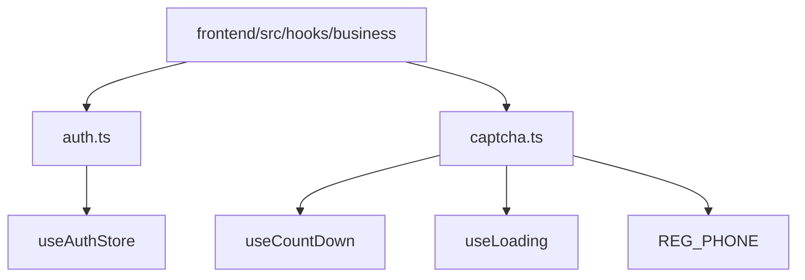
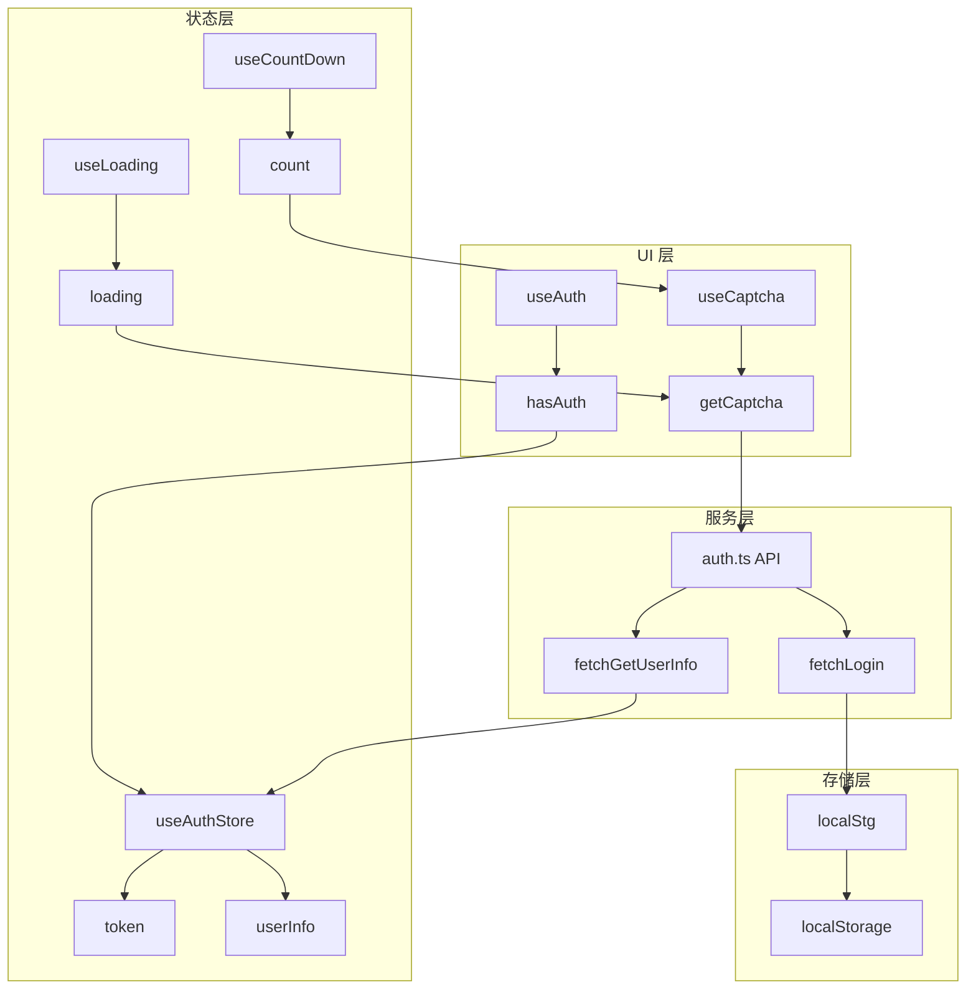
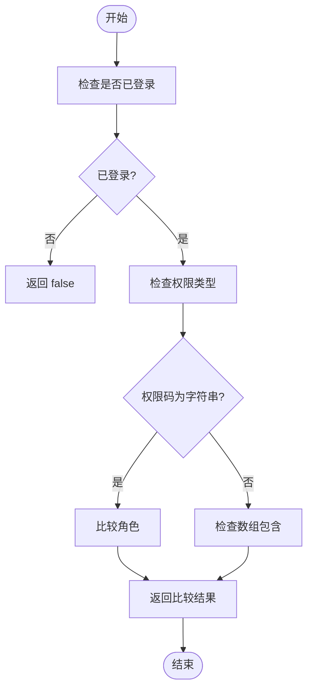
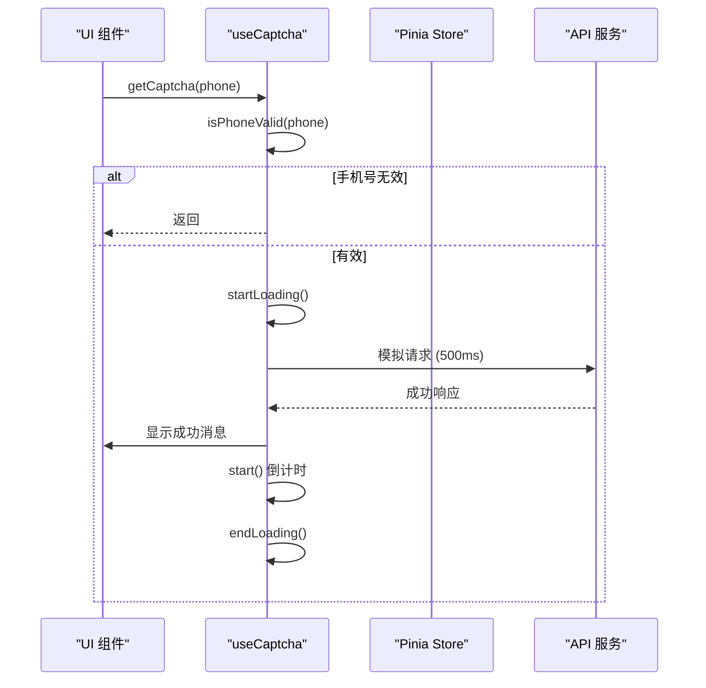
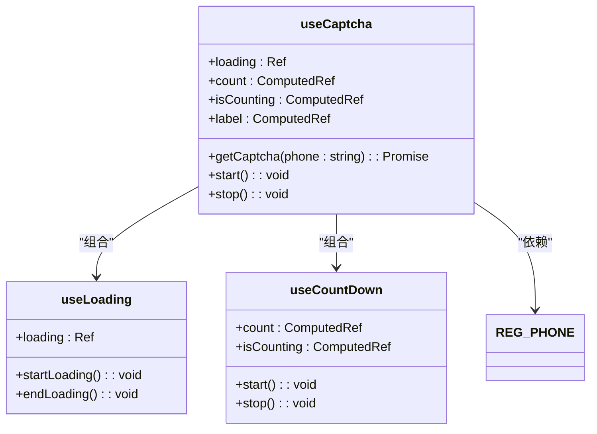
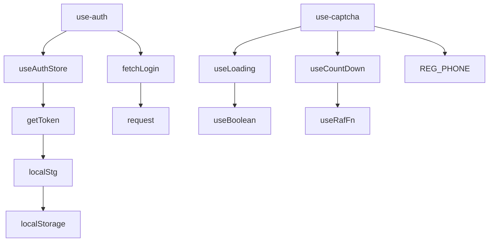

# 业务Hooks

<cite>
**本文档引用的文件**  
- [auth.ts](file://frontend/src/hooks/business/auth.ts)
- [captcha.ts](file://frontend/src/hooks/business/captcha.ts)
- [index.ts](file://frontend/src/store/modules/auth/index.ts)
- [shared.ts](file://frontend/src/store/modules/auth/shared.ts)
- [reg.ts](file://frontend/src/constants/reg.ts)
- [use-count-down.ts](file://frontend/packages/hooks/src/use-count-down.ts)
- [use-loading.ts](file://frontend/packages/hooks/src/use-loading.ts)
- [use-boolean.ts](file://frontend/packages/hooks/src/use-boolean.ts)
- [storage.ts](file://frontend/src/utils/storage.ts)
- [auth.ts](file://frontend/src/service/api/auth.ts)
</cite>

## 目录
1. [简介](#简介)
2. [项目结构](#项目结构)
3. [核心组件](#核心组件)
4. [架构概览](#架构概览)
5. [详细组件分析](#详细组件分析)
6. [依赖分析](#依赖分析)
7. [性能考虑](#性能考虑)
8. [故障排除指南](#故障排除指南)
9. [结论](#结论)

## 简介
本文档深入解析 `frontend/src/hooks/business` 目录下业务相关 Hook 的设计与实现。重点阐述 `use-auth` 如何封装用户认证状态管理、权限校验逻辑及与 Pinia store 的交互机制，包括 token 刷新、登录状态持久化与路由守卫集成；同时分析 `use-captcha` 在验证码获取、倒计时控制、请求防抖等方面的封装策略及其在登录、注册等场景中的实际应用。通过具体业务流程，展示这些 Hook 如何协调 API 调用、状态变更与 UI 反馈，确保高内聚低耦合。提供完整的类型定义、调用方式、异常处理及测试建议，帮助开发者理解业务逻辑抽象的最佳实践。

## 项目结构
`frontend/src/hooks/business` 目录包含两个核心业务 Hook：`auth.ts` 和 `captcha.ts`。它们分别负责用户认证与验证码管理，是前端业务逻辑的重要组成部分。

**图示来源**
- [auth.ts](file://frontend/src/hooks/business/auth.ts)
- [captcha.ts](file://frontend/src/hooks/business/captcha.ts)

**本节来源**
- [auth.ts](file://frontend/src/hooks/business/auth.ts)
- [captcha.ts](file://frontend/src/hooks/business/captcha.ts)

## 核心组件
本节分析 `use-auth` 和 `use-captcha` 两个核心 Hook 的实现细节。

**本节来源**
- [auth.ts](file://frontend/src/hooks/business/auth.ts#L1-L22)
- [captcha.ts](file://frontend/src/hooks/business/captcha.ts#L1-L72)

## 架构概览
整个认证与验证码流程涉及多个模块的协同工作，包括 Pinia Store、API 服务、本地存储和 UI 状态管理。

**图示来源**
- [auth.ts](file://frontend/src/hooks/business/auth.ts)
- [captcha.ts](file://frontend/src/hooks/business/captcha.ts)
- [index.ts](file://frontend/src/store/modules/auth/index.ts)
- [auth.ts](file://frontend/src/service/api/auth.ts)

## 详细组件分析
### use-auth 分析
`use-auth` Hook 封装了用户权限校验的核心逻辑，通过与 `useAuthStore` 的交互实现认证状态管理。

#### 权限校验逻辑
该 Hook 提供 `hasAuth` 方法，用于检查当前用户是否具有指定权限。

**图示来源**
- [auth.ts](file://frontend/src/hooks/business/auth.ts#L6-L18)

**本节来源**
- [auth.ts](file://frontend/src/hooks/business/auth.ts#L1-L22)
- [index.ts](file://frontend/src/store/modules/auth/index.ts#L13-L194)

### use-captcha 分析
`use-captcha` Hook 封装了验证码获取与倒计时控制的完整流程。

#### 验证码获取流程
该 Hook 协调了加载状态、倒计时和表单验证，确保用户体验流畅。

**图示来源**
- [captcha.ts](file://frontend/src/hooks/business/captcha.ts#L20-L65)

#### 倒计时与加载状态
`use-captcha` 组合使用多个基础 Hook 实现复杂状态管理。

**图示来源**
- [captcha.ts](file://frontend/src/hooks/business/captcha.ts#L3-L72)
- [use-loading.ts](file://frontend/packages/hooks/src/use-loading.ts#L7-L15)
- [use-count-down.ts](file://frontend/packages/hooks/src/use-count-down.ts#L8-L48)
- [reg.ts](file://frontend/src/constants/reg.ts#L3-L4)

**本节来源**
- [captcha.ts](file://frontend/src/hooks/business/captcha.ts#L1-L72)
- [use-loading.ts](file://frontend/packages/hooks/src/use-loading.ts#L7-L15)
- [use-count-down.ts](file://frontend/packages/hooks/src/use-count-down.ts#L8-L48)
- [reg.ts](file://frontend/src/constants/reg.ts#L3-L4)

## 依赖分析
业务 Hooks 依赖于多个基础模块和工具函数，形成清晰的依赖层级。

**图示来源**
- [auth.ts](file://frontend/src/hooks/business/auth.ts)
- [captcha.ts](file://frontend/src/hooks/business/captcha.ts)
- [index.ts](file://frontend/src/store/modules/auth/index.ts)
- [shared.ts](file://frontend/src/store/modules/auth/shared.ts)
- [storage.ts](file://frontend/src/utils/storage.ts)
- [use-loading.ts](file://frontend/packages/hooks/src/use-loading.ts)
- [use-boolean.ts](file://frontend/packages/hooks/src/use-boolean.ts)

**本节来源**
- [auth.ts](file://frontend/src/hooks/business/auth.ts)
- [captcha.ts](file://frontend/src/hooks/business/captcha.ts)
- [index.ts](file://frontend/src/store/modules/auth/index.ts)
- [shared.ts](file://frontend/src/store/modules/auth/shared.ts)
- [storage.ts](file://frontend/src/utils/storage.ts)

## 性能考虑
- `use-count-down` 使用 `requestAnimationFrame` 实现高精度倒计时，避免 `setInterval` 的累积误差
- `use-loading` 和 `use-boolean` 使用 `ref` 和 `computed` 实现响应式状态，性能开销极小
- 本地存储操作通过 `createStorage` 封装，确保前缀一致性和类型安全
- API 请求使用 `alova` 或 `axios` 封装，支持拦截器和错误处理

## 故障排除指南
### 认证问题
- **问题**: 用户登录后权限校验失败
- **排查**: 检查 `useAuthStore` 中的 `userInfo.role` 是否正确设置
- **检查点**: 确认 `fetchGetUserInfo` API 返回的角色字段与前端期望一致

### 验证码问题
- **问题**: 验证码按钮无响应
- **排查**: 检查手机号格式是否符合 `REG_PHONE` 正则表达式
- **检查点**: 确认 `loading` 状态未被意外锁定

### 存储问题
- **问题**: 页面刷新后登录状态丢失
- **排查**: 检查 `localStg` 是否正确将 token 存储到 `localStorage`
- **检查点**: 确认 `VITE_STORAGE_PREFIX` 环境变量配置正确

**本节来源**
- [auth.ts](file://frontend/src/hooks/business/auth.ts#L6-L18)
- [captcha.ts](file://frontend/src/hooks/business/captcha.ts#L20-L65)
- [shared.ts](file://frontend/src/store/modules/auth/shared.ts#L3-L5)
- [storage.ts](file://frontend/src/utils/storage.ts#L4-L4)

## 结论
`use-auth` 和 `use-captcha` 两个业务 Hook 通过组合基础 Hook 和 Pinia Store，实现了高内聚、低耦合的业务逻辑封装。它们不仅提供了简洁的 API，还隐藏了复杂的认证流程和状态管理细节，使 UI 组件能够专注于用户交互。这种分层设计模式值得在其他业务场景中推广。