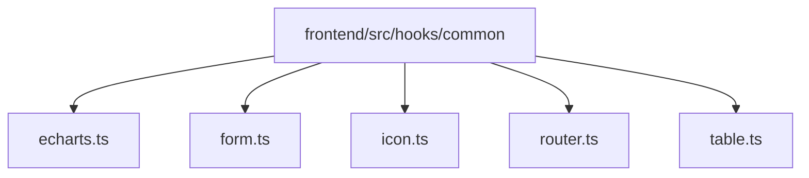
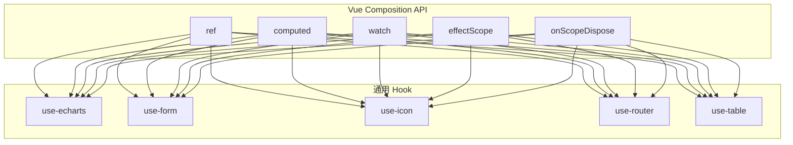
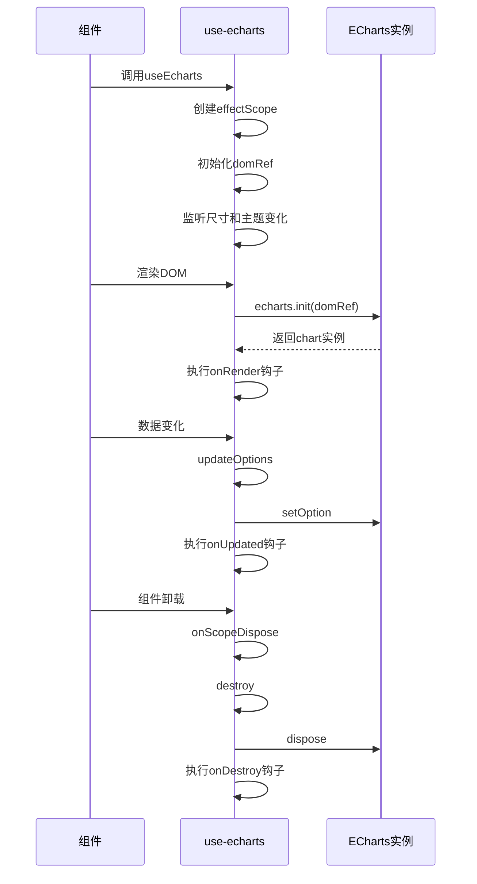
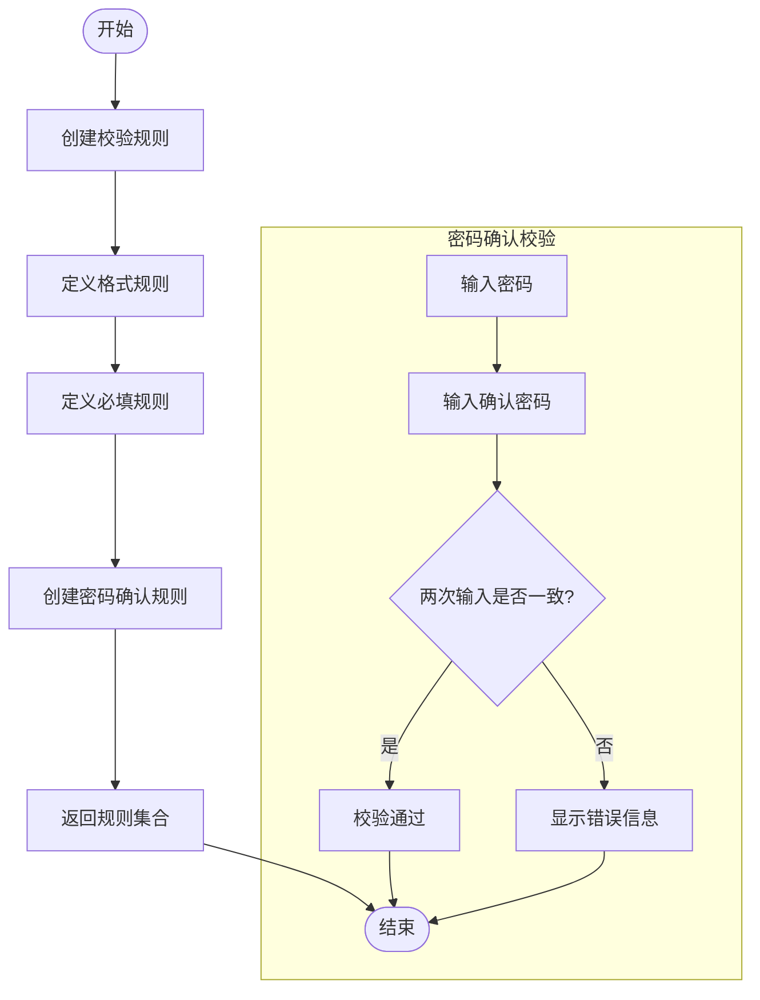
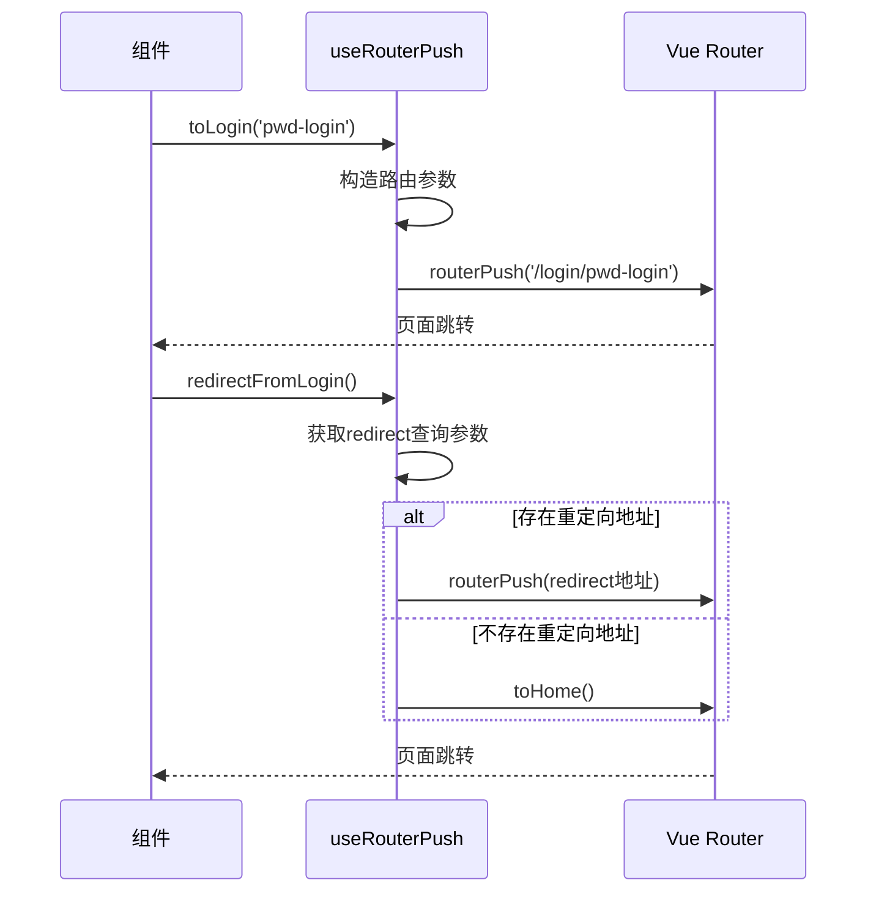
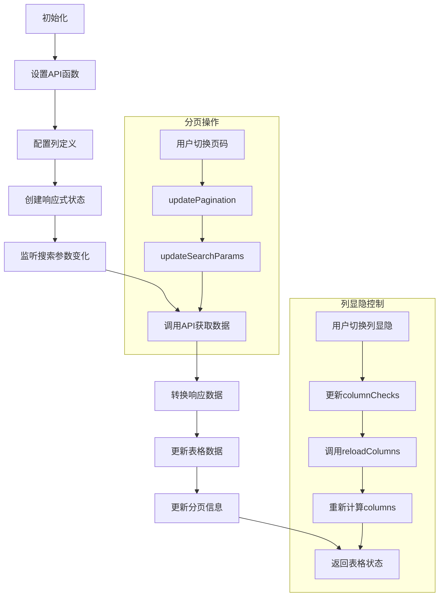
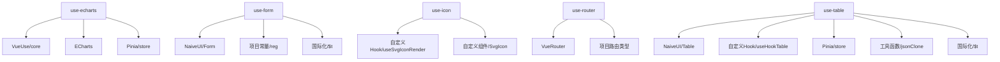

# 通用Hooks

<cite>
**本文档中引用的文件**  
- [echarts.ts](file://frontend/src/hooks/common/echarts.ts)
- [form.ts](file://frontend/src/hooks/common/form.ts)
- [icon.ts](file://frontend/src/hooks/common/icon.ts)
- [router.ts](file://frontend/src/hooks/common/router.ts)
- [table.ts](file://frontend/src/hooks/common/table.ts)
</cite>

## 目录
1. [简介](#简介)
2. [项目结构](#项目结构)
3. [核心组件](#核心组件)
4. [架构概览](#架构概览)
5. [详细组件分析](#详细组件分析)
6. [依赖分析](#依赖分析)
7. [性能考虑](#性能考虑)
8. [故障排除指南](#故障排除指南)
9. [结论](#结论)

## 简介
本文档详细介绍了 `frontend/src/hooks/common` 目录下各通用 Hook 的实现原理与使用场景。重点阐述了 `use-echarts` 如何封装 ECharts 实例的初始化、更新与销毁生命周期，并处理响应式数据绑定；分析了 `use-form` 在表单状态管理中的校验、重置与提交逻辑封装；说明了 `use-icon` 如何实现图标动态加载与缓存机制；解析了 `use-router` 在路由导航与参数监听中的应用；讲解了 `use-table` 如何集成分页、排序、筛选等复杂表格交互功能并优化渲染性能。提供每个 Hook 的类型定义、参数说明、返回值结构及典型使用示例，强调错误处理与资源释放的最佳实践。

## 项目结构
`frontend/src/hooks/common` 目录包含多个通用 Hook 文件，分别用于处理图表、表单、图标、路由和表格等常见功能。这些 Hook 被设计为可复用的逻辑单元，便于在不同组件中统一调用。



**图示来源**
- [echarts.ts](file://frontend/src/hooks/common/echarts.ts)
- [form.ts](file://frontend/src/hooks/common/form.ts)
- [icon.ts](file://frontend/src/hooks/common/icon.ts)
- [router.ts](file://frontend/src/hooks/common/router.ts)
- [table.ts](file://frontend/src/hooks/common/table.ts)

## 核心组件
本节将深入分析 `frontend/src/hooks/common` 目录下的五个核心 Hook：`use-echarts`、`use-form`、`use-icon`、`use-router` 和 `use-table`。

**本节来源**
- [echarts.ts](file://frontend/src/hooks/common/echarts.ts)
- [form.ts](file://frontend/src/hooks/common/form.ts)
- [icon.ts](file://frontend/src/hooks/common/icon.ts)
- [router.ts](file://frontend/src/hooks/common/router.ts)
- [table.ts](file://frontend/src/hooks/common/table.ts)

## 架构概览
整个 Hook 系统基于 Vue 3 的 Composition API 构建，利用 `ref`、`computed`、`watch` 和 `effectScope` 等响应式 API 实现状态管理与副作用控制。各 Hook 通过组合内部逻辑，对外暴露简洁的接口，降低组件层的复杂度。



**图示来源**
- [echarts.ts](file://frontend/src/hooks/common/echarts.ts)
- [form.ts](file://frontend/src/hooks/common/form.ts)
- [icon.ts](file://frontend/src/hooks/common/icon.ts)
- [router.ts](file://frontend/src/hooks/common/router.ts)
- [table.ts](file://frontend/src/hooks/common/table.ts)

## 详细组件分析
### use-echarts 分析
`use-echarts` 封装了 ECharts 图表实例的完整生命周期管理，包括初始化、更新和销毁。

#### 类型定义
```typescript
export type ECOption = echarts.ComposeOption<...>;
interface ChartHooks {
  onRender?: (chart: echarts.ECharts) => void | Promise<void>;
  onUpdated?: (chart: echarts.ECharts) => void | Promise<void>;
  onDestroy?: (chart: echarts.ECharts) => void | Promise<void>;
}
```

#### 参数说明
- `optionsFactory`: 返回 ECharts 配置对象的工厂函数
- `hooks`: 生命周期钩子函数集合

#### 返回值结构
- `domRef`: 图表容器的 DOM 引用
- `updateOptions`: 更新图表配置的方法
- `setOptions`: 直接设置图表选项的方法

#### 典型使用示例
```typescript
const { domRef, updateOptions } = useEcharts(() => ({
  title: { text: '示例图表' },
  series: [{ type: 'bar', data: [1, 2, 3] }]
}));
```

#### 生命周期管理
- **初始化**: 在 `render` 函数中调用 `echarts.init` 创建实例
- **更新**: 监听尺寸和主题变化，自动调用 `resize` 和 `changeTheme`
- **销毁**: 在 `onScopeDispose` 中调用 `destroy` 方法释放资源



**图示来源**
- [echarts.ts](file://frontend/src/hooks/common/echarts.ts#L82-L239)

**本节来源**
- [echarts.ts](file://frontend/src/hooks/common/echarts.ts#L82-L239)

### use-form 分析
`use-form` 提供了表单校验规则生成和表单实例操作的封装。

#### 类型定义
```typescript
type App.Global.FormRule = {
  required?: boolean;
  pattern?: RegExp;
  message: string;
  trigger: string;
  asyncValidator?: (rule, value) => Promise<void>;
};
```

#### 主要函数
- `useFormRules`: 生成预定义的校验规则
- `useNaiveForm`: 管理表单实例的引用和操作

#### 校验逻辑
- **必填校验**: `createRequiredRule`
- **格式校验**: 基于正则表达式的 `patternRules`
- **密码确认**: `createConfirmPwdRule` 实现两次输入一致性校验

#### 典型使用示例
```typescript
const { formRules } = useFormRules();
const { formRef, validate } = useNaiveForm();

// 在模板中使用
// <n-form :model="formData" :rules="formRules" ref="formRef">
```



**图示来源**
- [form.ts](file://frontend/src/hooks/common/form.ts#L6-L78)

**本节来源**
- [form.ts](file://frontend/src/hooks/common/form.ts#L6-L78)

### use-icon 分析
`use-icon` 实现了 SVG 图标的动态加载与虚拟节点渲染。

#### 实现机制
- 依赖 `useSvgIconRender` 来生成 SVG 图标的虚拟 DOM 节点
- 使用 `SvgIcon` 组件作为渲染载体
- 通过 `SvgIconVNode` 暴露可直接在模板中使用的虚拟节点

#### 典型使用示例
```typescript
const { SvgIconVNode } = useSvgIcon();
// 在渲染函数中使用
// return () => h(SvgIconVNode, { name: 'home' })
```

```mermaid
classDiagram
class useSvgIcon {
+SvgIconVNode : VNode
+useSvgIcon() : { SvgIconVNode }
}
class useSvgIconRender {
+useSvgIconRender(component) : { SvgIconVNode }
}
class SvgIcon {
+name : string
+size : string
+render() : VNode
}
useSvgIcon --> useSvgIconRender : "使用"
useSvgIconRender --> SvgIcon : "渲染"
```

**图示来源**
- [icon.ts](file://frontend/src/hooks/common/icon.ts#L3-L9)

**本节来源**
- [icon.ts](file://frontend/src/hooks/common/icon.ts#L3-L9)

### useRouterPush 分析
`useRouterPush` 封装了路由导航的常用操作。

#### 主要功能
- `routerPushByKey`: 通过路由名称进行跳转
- `toLogin`: 跳转到登录页并携带重定向参数
- `redirectFromLogin`: 从登录页重定向回原页面
- `toggleLoginModule`: 切换登录模块

#### 参数说明
- `inSetup`: 是否在 Vue 的 setup 环境中使用

#### 典型使用示例
```typescript
const { toLogin, redirectFromLogin } = useRouterPush();

// 跳转到登录页
toLogin('pwd-login');

// 登录成功后重定向
redirectFromLogin();
```



**图示来源**
- [router.ts](file://frontend/src/hooks/common/router.ts#L12-L114)

**本节来源**
- [router.ts](file://frontend/src/hooks/common/router.ts#L12-L114)

### use-table 分析
`use-table` 集成了分页、排序、筛选等复杂表格交互功能。

#### 主要功能
- 数据获取与分页管理
- 列显隐控制
- 移动端适配
- 搜索参数管理

#### 返回值结构
- `loading`: 加载状态
- `data`: 表格数据
- `columns`: 当前列配置
- `pagination`: 分页配置
- `getData`: 获取数据方法
- `updateSearchParams`: 更新搜索参数

#### 性能优化
- 使用 `effectScope` 管理副作用
- 在 `onScopeDispose` 中清理资源
- 通过 `computed` 实现移动端分页适配

#### 典型使用示例
```typescript
const { loading, data, columns, pagination, getData } = useTable({
  apiFn: getUserList,
  columns: [...]
});
```



**图示来源**
- [table.ts](file://frontend/src/hooks/common/table.ts#L12-L279)

**本节来源**
- [table.ts](file://frontend/src/hooks/common/table.ts#L12-L279)

## 依赖分析
各 Hook 之间的依赖关系清晰，均基于 Vue 3 的 Composition API 构建，同时依赖项目中的其他工具模块。



**图示来源**
- [echarts.ts](file://frontend/src/hooks/common/echarts.ts)
- [form.ts](file://frontend/src/hooks/common/form.ts)
- [icon.ts](file://frontend/src/hooks/common/icon.ts)
- [router.ts](file://frontend/src/hooks/common/router.ts)
- [table.ts](file://frontend/src/hooks/common/table.ts)

**本节来源**
- [echarts.ts](file://frontend/src/hooks/common/echarts.ts)
- [form.ts](file://frontend/src/hooks/common/form.ts)
- [icon.ts](file://frontend/src/hooks/common/icon.ts)
- [router.ts](file://frontend/src/hooks/common/router.ts)
- [table.ts](file://frontend/src/hooks/common/table.ts)

## 性能考虑
- **资源释放**: 所有 Hook 都通过 `onScopeDispose` 确保在组件卸载时正确清理资源
- **响应式优化**: 使用 `computed` 和 `watch` 的精确依赖追踪避免不必要的计算
- **懒加载**: `use-echarts` 在 DOM 就绪后才初始化图表实例
- **缓存机制**: `use-table` 对列配置进行缓存，避免重复计算

## 故障排除指南
- **图表不显示**: 检查 `domRef` 是否正确绑定到 DOM 元素
- **表单校验失效**: 确保 `formRef` 正确传递给 `n-form` 组件
- **路由跳转失败**: 检查路由名称是否正确，参数格式是否符合预期
- **表格数据不更新**: 确认 `apiFn` 返回的响应结构符合预期格式
- **内存泄漏**: 确保所有异步操作在 `onScopeDispose` 中被正确取消

**本节来源**
- [echarts.ts](file://frontend/src/hooks/common/echarts.ts)
- [form.ts](file://frontend/src/hooks/common/form.ts)
- [icon.ts](file://frontend/src/hooks/common/icon.ts)
- [router.ts](file://frontend/src/hooks/common/router.ts)
- [table.ts](file://frontend/src/hooks/common/table.ts)

## 结论
`frontend/src/hooks/common` 目录下的通用 Hook 设计良好，职责清晰，有效封装了常见功能的复杂性。通过 Composition API 的组合能力，这些 Hook 提供了简洁易用的接口，同时保证了性能和资源管理的正确性。建议在项目中广泛采用这些 Hook 来保持代码的一致性和可维护性。