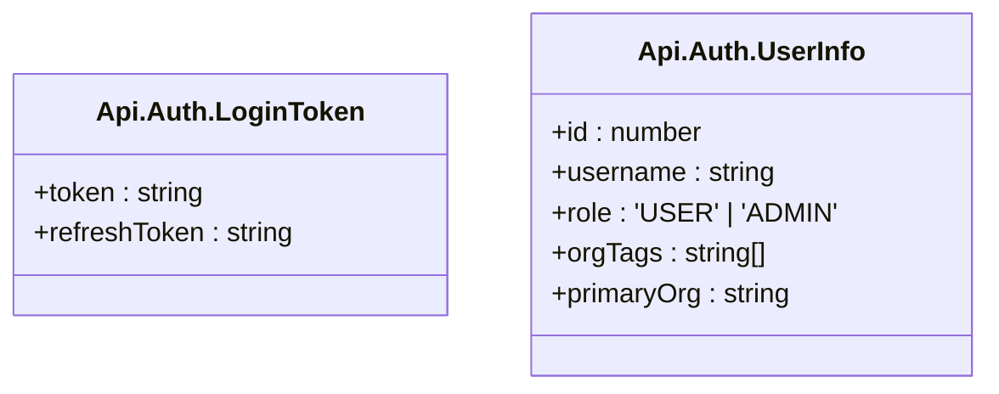
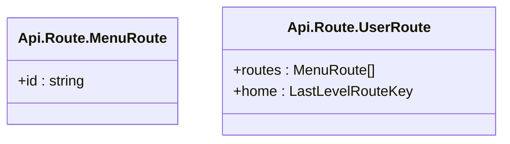
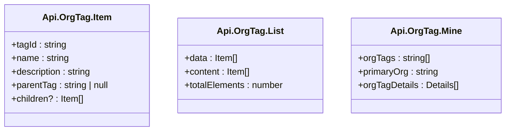
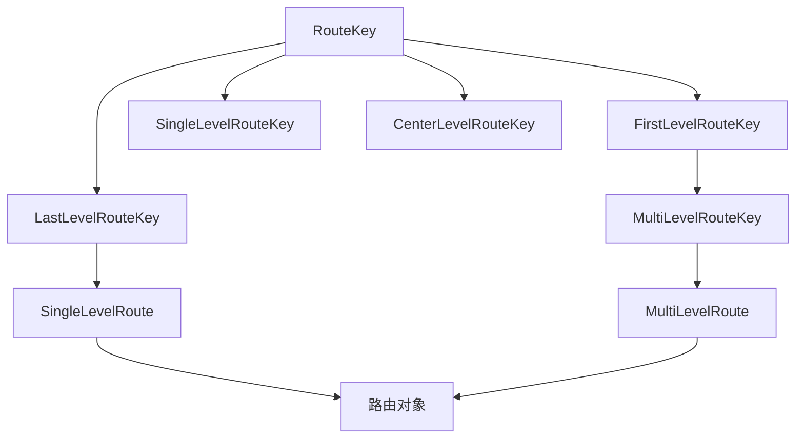
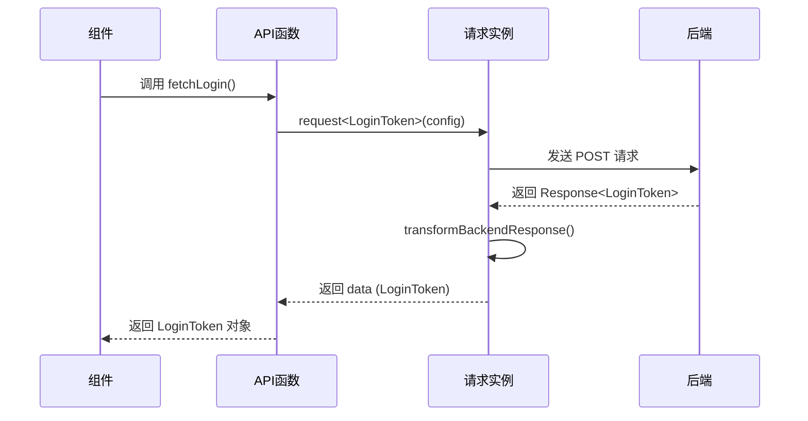

# API与路由类型

<cite>
**本文档引用的文件**   
- [api.d.ts](file://frontend/src/typings/api.d.ts)
- [app.d.ts](file://frontend/src/typings/app.d.ts)
- [router.d.ts](file://frontend/src/typings/router.d.ts)
- [elegant-router.d.ts](file://frontend/src/typings/elegant-router.d.ts)
- [auth.ts](file://frontend/src/service/api/auth.ts)
- [route.ts](file://frontend/src/service/api/route.ts)
- [org-tag.ts](file://frontend/src/service/api/org-tag.ts)
- [index.ts](file://frontend/src/service/request/index.ts)
- [shared.ts](file://frontend/src/service/request/shared.ts)
- [type.ts](file://frontend/src/service/request/type.ts)
</cite>

## 目录
1. [API响应统一结构](#api响应统一结构)
2. [业务模块数据契约](#业务模块数据契约)
3. [路由元信息定义](#路由元信息定义)
4. [动态路由表结构](#动态路由表结构)
5. [服务层与组件中的类型安全实践](#服务层与组件中的类型安全实践)

## API响应统一结构

在前端项目中，后端API响应的统一结构通过 `Response<T>` 泛型类型进行定义，确保所有接口返回的数据具有标准化的格式。该类型定义位于 `app.d.ts` 文件中，是整个项目类型安全的基础。

`Response<T>` 类型包含三个核心字段：
- **code**: 字符串类型的响应码，用于标识请求的成功或失败状态。
- **message**: 响应消息，通常用于向用户展示操作结果。
- **data**: 泛型参数 `T`，表示实际的业务数据，其类型由具体接口决定。

这种设计实现了编译时的类型检查，开发者在调用API时可以明确知道返回数据的结构，避免运行时错误。

```mermaid
classDiagram
class Response<T> {
+code : string
+message : string
+data : T
}
```

**图示来源**
- [app.d.ts](file://frontend/src/typiings/app.d.ts#L527-L561)

**本节来源**
- [app.d.ts](file://frontend/src/typings/app.d.ts#L527-L561)

## 业务模块数据契约

各业务模块（如 auth、route、org-tag）在 `api.d.ts` 文件中定义了精确的数据契约，这些契约与 `Response<T>` 类型结合使用，为每个API提供了完整的类型描述。

### 认证模块 (auth)

认证模块定义了用户登录、获取用户信息等接口所需的数据结构。

- **LoginToken**: 包含 `token` 和 `refreshToken`，用于用户身份验证。
- **UserInfo**: 描述用户基本信息，包括 `id`、`username`、`role`（用户角色）、`orgTags`（组织标签）和 `primaryOrg`（主组织）。



**图示来源**
- [api.d.ts](file://frontend/src/typings/api.d.ts#L45-L64)

### 路由模块 (route)

路由模块定义了与前端路由相关的数据结构。

- **MenuRoute**: 继承自 `ElegantConstRoute`，并添加了 `id` 字段，用于菜单渲染。
- **UserRoute**: 包含用户的路由列表 `routes` 和首页路由 `home`。



**图示来源**
- [api.d.ts](file://frontend/src/typings/api.d.ts#L78-L90)

### 组织标签模块 (org-tag)

组织标签模块定义了组织标签的增删改查操作所需的数据结构。

- **Item**: 表示单个标签，包含 `tagId`、`name`、`description`、`parentTag`（父标签）和可选的子标签 `children`。
- **List**: 继承自 `PaginatingQueryRecord<Item>`，用于分页查询标签列表。
- **Mine**: 包含用户当前的组织标签信息和详细信息。



**图示来源**
- [api.d.ts](file://frontend/src/typings/api.d.ts#L92-L118)

**本节来源**
- [api.d.ts](file://frontend/src/typings/api.d.ts#L45-L118)

## 路由元信息定义

路由元信息（RouteMeta）在 `router.d.ts` 文件中通过扩展 `vue-router` 的 `RouteMeta` 接口进行定义，包含了丰富的路由配置信息。

### RouteMeta 接口字段

| 字段名 | 类型 | 说明 |
| :--- | :--- | :--- |
| **title** | string | 路由标题，可用于文档标题 |
| **i18nKey** | App.I18n.I18nKey \| null | 国际化键，优先级高于 title |
| **roles** | string[] | 角色数组，用于权限校验 |
| **keepAlive** | boolean \| null | 是否缓存路由 |
| **constant** | boolean \| null | 是否为常量路由（无需登录验证） |
| **icon** | string | Iconify 图标 |
| **localIcon** | string | 本地SVG图标 |
| **iconFontSize** | number | 图标大小 |
| **order** | number \| null | 路由排序 |
| **href** | string \| null | 外部链接 |
| **hideInMenu** | boolean \| null | 是否在菜单中隐藏 |
| **activeMenu** | RouteKey \| null | 激活的菜单项 |
| **multiTab** | boolean \| null | 是否允许多标签页 |
| **fixedIndexInTab** | number \| null | 固定标签页的索引 |
| **query** | { key: string; value: string }[] \| null | 默认携带的查询参数 |

```mermaid
classDiagram
class RouteMeta {
+title : string
+i18nKey? : App.I18n.I18nKey | null
+roles? : string[]
+keepAlive? : boolean | null
+constant? : boolean | null
+icon? : string
+localIcon? : string
+iconFontSize? : number
+order? : number | null
+href? : string | null
+hideInMenu? : boolean | null
+activeMenu? : RouteKey | null
+multiTab? : boolean | null
+fixedIndexInTab? : number | null
+query? : { key : string; value : string }[] | null
}
```

**图示来源**
- [router.d.ts](file://frontend/src/typings/router.d.ts#L4-L72)

**本节来源**
- [router.d.ts](file://frontend/src/typings/router.d.ts#L4-L72)

## 动态路由表结构

`elegant-router.d.ts` 文件定义了动态路由表的结构，支持类型安全的路由导航与权限校验。

### 核心类型定义

该文件通过 `RouteMap` 映射了路由键（RouteKey）与实际路径（RoutePath）的关系，并通过一系列条件类型（Conditional Types）对路由进行分类：

- **FirstLevelRouteKey**: 一级路由键，如 "login"、"chat"。
- **LastLevelRouteKey**: 末级路由键，对应具体的页面组件。
- **SingleLevelRouteKey**: 单层路由键，既是第一级也是末级。
- **CenterLevelRouteKey**: 中间层路由键，用于嵌套路由。
- **MultiLevelRouteKey**: 多层路由键，包含子路由。

### 路由结构生成

通过 `SingleLevelRoute`、`MultiLevelRoute` 等类型，可以基于 `ElegantConstRoute` 生成符合项目规范的路由对象。这些类型利用 `Omit` 和 `Extract` 等工具类型，确保路由配置的组件路径、名称和路径严格匹配。



**图示来源**
- [elegant-router.d.ts](file://frontend/src/typings/elegant-router.d.ts#L10-L255)

**本节来源**
- [elegant-router.d.ts](file://frontend/src/typings/elegant-router.d.ts#L10-L255)

## 服务层与组件中的类型安全实践

### 服务层实现

在 `src/service/api` 目录下，各模块的API函数直接利用 `request` 工具函数和 `Response<T>` 类型，实现了类型安全的HTTP请求。

以 `auth.ts` 为例：
```typescript
export function fetchLogin(username: string, password: string) {
  return request<Api.Auth.LoginToken>({
    url: '/users/login',
    method: 'post',
    data: { username, password }
  });
}
```
此处 `request<Api.Auth.LoginToken>` 明确指定了返回数据的类型为 `Response<Api.Auth.LoginToken>`，编译器会强制检查返回值的结构。

`request` 函数的实现位于 `request/index.ts`，它通过 `createFlatRequest` 创建了一个泛型请求实例，并配置了请求拦截、响应转换和错误处理逻辑。其中 `transformBackendResponse` 钩子将后端响应的 `data` 字段直接作为返回值，实现了数据的自动解包。

### 组件中使用

在组件中调用这些API时，TypeScript编译器能够根据函数签名推断出返回值的类型，从而提供智能提示和编译时检查。

例如，调用 `fetchGetUserInfo()` 后，其返回的 `data` 对象将具有 `id`、`username` 等属性，任何对不存在属性的访问都会被编译器捕获。

此外，`request` 实例的状态管理（如 `errMsgStack`）和错误处理逻辑（如 `handleExpiredRequest`）也通过 `RequestInstanceState` 类型进行了定义，确保了整个请求生命周期的类型安全。



**图示来源**
- [auth.ts](file://frontend/src/service/api/auth.ts#L6-L14)
- [index.ts](file://frontend/src/service/request/index.ts#L10-L154)
- [shared.ts](file://frontend/src/service/request/shared.ts#L0-L64)

**本节来源**
- [auth.ts](file://frontend/src/service/api/auth.ts#L6-L14)
- [route.ts](file://frontend/src/service/api/route.ts#L3-L20)
- [org-tag.ts](file://frontend/src/service/api/org-tag.ts)
- [index.ts](file://frontend/src/service/request/index.ts#L10-L154)
- [type.ts](file://frontend/src/service/request/type.ts#L0-L6)
- [shared.ts](file://frontend/src/service/request/shared.ts#L0-L64)