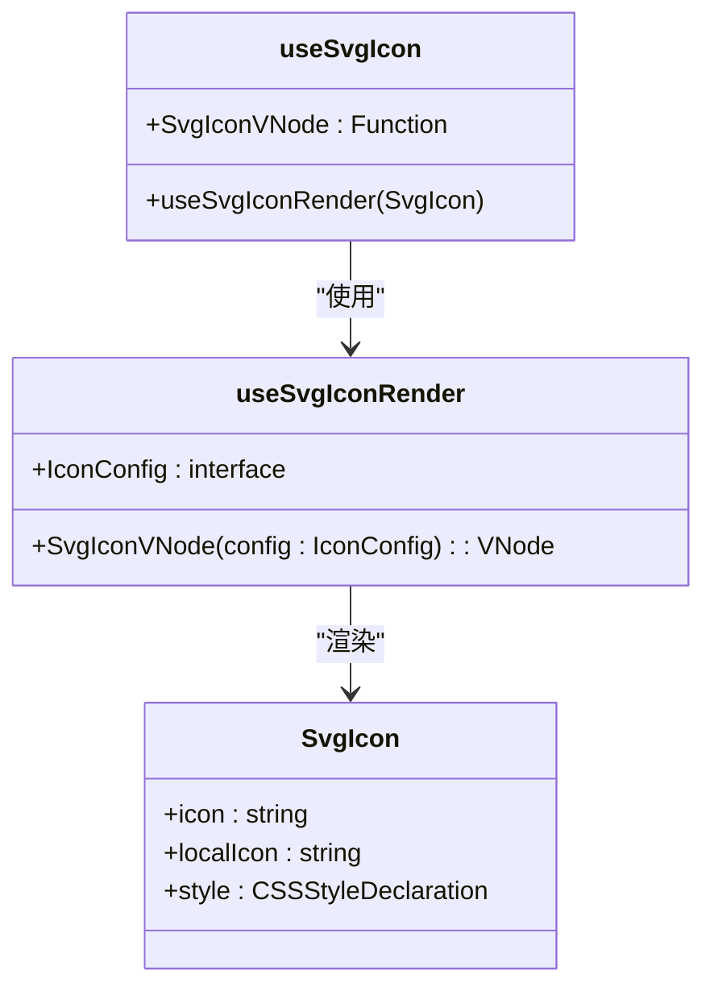
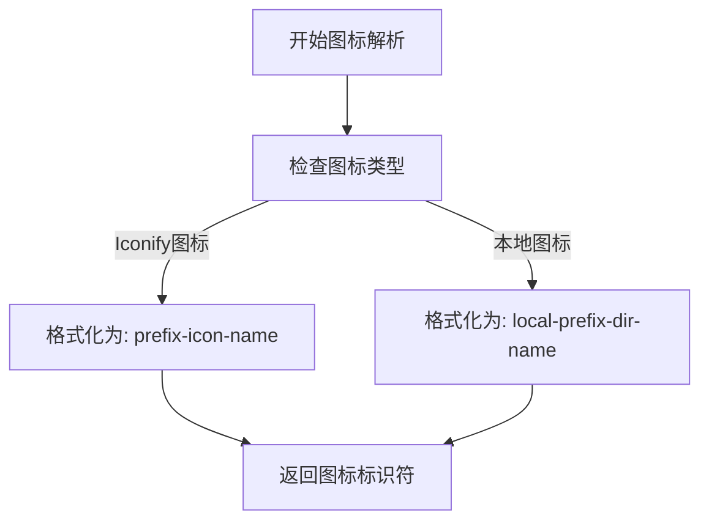
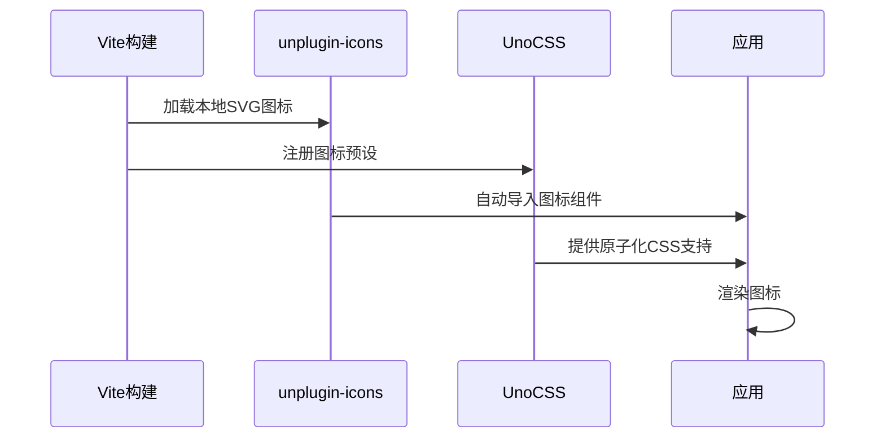

# 图标处理工具

<cite>
**本文档引用的文件**  
- [icon.ts](file://frontend/src/hooks/common/icon.ts)
- [icon.ts](file://frontend/src/utils/icon.ts)
- [use-svg-icon-render.ts](file://frontend/packages/hooks/src/use-svg-icon-render.ts)
- [svg-icon.vue](file://frontend/src/components/custom/svg-icon.vue)
- [unplugin.ts](file://frontend/build/plugins/unplugin.ts)
- [unocss.ts](file://frontend/build/plugins/unocss.ts)
- [iconify.ts](file://frontend/src/plugins/iconify.ts)
- [index.html](file://homepage/index.html)
</cite>

## 目录
1. [图标系统概述](#图标系统概述)
2. [核心组件分析](#核心组件分析)
3. [图标映射与动态解析机制](#图标映射与动态解析机制)
4. [运行时图标渲染优化](#运行时图标渲染优化)
5. [组件中的图标引用实践](#组件中的图标引用实践)
6. [图标缓存与降级策略](#图标缓存与降级策略)
7. [系统集成与配置](#系统集成与配置)

## 图标系统概述

本系统采用Iconify作为核心图标解决方案，结合Vite插件生态实现高效的图标管理和渲染。系统支持两种图标来源：远程Iconify图标集和本地SVG图标。通过`unplugin-icons`和`vite-plugin-svg-icons`插件，实现了图标按需加载、自动注册和离线缓存，确保了应用的性能和可靠性。

**Section sources**
- [icon.ts](file://frontend/src/hooks/common/icon.ts#L1-L10)
- [iconify.ts](file://frontend/src/plugins/iconify.ts#L1-L9)

## 核心组件分析

### useSvgIcon 钩子函数

`useSvgIcon` 是图标系统的核心钩子，封装了图标渲染的逻辑，提供了一致的API供组件使用。



**Diagram sources**
- [icon.ts](file://frontend/src/hooks/common/icon.ts#L1-L10)
- [use-svg-icon-render.ts](file://frontend/packages/hooks/src/use-svg-icon-render.ts#L1-L50)

**Section sources**
- [icon.ts](file://frontend/src/hooks/common/icon.ts#L1-L10)

### useSvgIconRender 实现

`useSvgIconRender` 是底层渲染函数，接收`SvgIcon`组件并返回可复用的`SvgIconVNode`渲染函数。

```typescript
import { h } from 'vue';
import type { Component } from 'vue';

export default function useSvgIconRender(SvgIcon: Component) {
  interface IconConfig {
    icon?: string;
    localIcon?: string;
    color?: string;
    fontSize?: number;
  }

  type IconStyle = Partial<Pick<CSSStyleDeclaration, 'color' | 'fontSize'>>;

  const SvgIconVNode = (config: IconConfig) => {
    const { color, fontSize, icon, localIcon } = config;
    const style: IconStyle = {};

    if (color) style.color = color;
    if (fontSize) style.fontSize = `${fontSize}px`;

    if (!icon && !localIcon) return undefined;

    return () => h(SvgIcon, { icon, localIcon, style });
  };

  return { SvgIconVNode };
}
```

该函数通过Vue的`h`函数创建虚拟DOM节点，支持图标颜色和尺寸的动态配置，并优先渲染本地图标。

**Section sources**
- [use-svg-icon-render.ts](file://frontend/packages/hooks/src/use-svg-icon-render.ts#L1-L50)

## 图标映射与动态解析机制

### 本地图标收集

`getLocalIcons` 函数利用Vite的`import.meta.glob`特性，动态收集`/src/assets/svg-icon/`目录下的所有SVG文件，并提取图标名称。

```typescript
export function getLocalIcons() {
  const svgIcons = import.meta.glob('/src/assets/svg-icon/*.svg');
  const keys = Object.keys(svgIcons)
    .map(item => item.split('/').at(-1)?.replace('.svg', '') || '')
    .filter(Boolean);
  return keys;
}
```

此机制实现了图标的自动发现和注册，无需手动维护图标列表。

### 图标路径解析

系统通过环境变量`VITE_ICON_PREFIX`和`VITE_ICON_LOCAL_PREFIX`配置图标前缀，确保图标名称的唯一性和可识别性。



**Diagram sources**
- [utils/icon.ts](file://frontend/src/utils/icon.ts#L1-L10)
- [unplugin.ts](file://frontend/build/plugins/unplugin.ts#L1-L82)

**Section sources**
- [utils/icon.ts](file://frontend/src/utils/icon.ts#L1-L10)

## 运行时图标渲染优化

### unplugin-icons 插件集成

通过`unplugin-icons`插件，系统实现了图标组件的自动导入和按需加载。

```typescript
Icons({
  compiler: 'vue3',
  customCollections: {
    [collectionName]: FileSystemIconLoader(localIconPath, svg =>
      svg.replace(/^<svg\s/, '<svg width="1em" height="1em" ')
    )
  },
  scale: 1,
  defaultClass: 'inline-block'
})
```

该配置将本地SVG图标转换为内联SVG，并设置默认尺寸，优化了渲染性能。

### UnoCSS 图标预设

UnoCSS的`preset-icons`预设进一步增强了图标支持，实现了原子化CSS与图标的无缝集成。

```typescript
presetIcons({
  prefix: `${VITE_ICON_PREFIX}-`,
  scale: 1,
  extraProperties: {
    display: 'inline-block'
  },
  collections: {
    [collectionName]: FileSystemIconLoader(localIconPath, svg =>
      svg.replace(/^<svg\s/, '<svg width="1em" height="1em" ')
    )
  }
})
```

**Section sources**
- [unplugin.ts](file://frontend/build/plugins/unplugin.ts#L19-L82)
- [unocss.ts](file://frontend/build/plugins/unocss.ts#L1-L31)

## 组件中的图标引用实践

### SvgIcon 组件实现

`SvgIcon` 是图标渲染的Vue组件，支持Iconify和本地SVG两种模式。

```vue
<script setup lang="ts">
import { computed, useAttrs } from 'vue';
import { Icon } from '@iconify/vue';

interface Props {
  icon?: string;
  localIcon?: string;
}

const props = defineProps<Props>();
const attrs = useAttrs();

const symbolId = computed(() => {
  const { VITE_ICON_LOCAL_PREFIX: prefix } = import.meta.env;
  const defaultLocalIcon = 'no-icon';
  const icon = props.localIcon || defaultLocalIcon;
  return `#${prefix}-${icon}`;
});

const renderLocalIcon = computed(() => props.localIcon || !props.icon);
</script>

<template>
  <template v-if="renderLocalIcon">
    <svg aria-hidden="true" width="1em" height="1em" v-bind="bindAttrs">
      <use :xlink:href="symbolId" fill="currentColor" />
    </svg>
  </template>
  <template v-else>
    <Icon v-if="icon" :icon="icon" v-bind="bindAttrs" />
  </template>
</template>
```

该组件优先渲染本地图标，确保离线可用性。

### 实际应用示例

在菜单、按钮等组件中，通过`useIcon`工具快速引用图标：

```typescript
function getGlobalMenuByBaseRoute(route) {
  const { SvgIconVNode } = useSvgIcon();
  const menu = {
    key: name as string,
    label,
    icon: SvgIconVNode({ icon, localIcon, fontSize: iconFontSize || 20 })
  };
  return menu;
}
```

**Diagram sources**
- [svg-icon.vue](file://frontend/src/components/custom/svg-icon.vue#L1-L55)
- [shared.ts](file://frontend/src/store/modules/route/shared.ts#L101-L164)

**Section sources**
- [svg-icon.vue](file://frontend/src/components/custom/svg-icon.vue#L1-L55)

## 图标缓存与降级策略

### 离线图标支持

系统通过`setupIconifyOffline`函数配置Iconify的离线资源地址，确保在网络不稳定时仍能加载图标。

```typescript
export function setupIconifyOffline() {
  const { VITE_ICONIFY_URL } = import.meta.env;
  if (VITE_ICONIFY_URL) {
    addAPIProvider('', { resources: [VITE_ICONIFY_URL] });
  }
}
```

### 缓存机制

虽然图标系统本身未实现复杂的缓存，但通过Vite的构建优化和浏览器缓存，实现了图标的高效加载。参考项目中的通用缓存模式：

```javascript
function saveStarsToCache(starsCount) {
  try {
    const cacheData = {
      count: starsCount,
      timestamp: Date.now()
    }
    localStorage.setItem('github-stars-cache', JSON.stringify(cacheData))
  } catch (error) {
    console.error('Failed to save stars to cache:', error)
  }
}
```

### 降级策略

系统采用多层降级策略：
1. 优先尝试加载本地图标
2. 本地图标不存在时，尝试加载Iconify远程图标
3. 所有图标加载失败时，返回undefined，组件不渲染图标

```typescript
if (!icon && !localIcon) {
  return undefined;
}
```

**Section sources**
- [iconify.ts](file://frontend/src/plugins/iconify.ts#L1-L9)
- [index.html](file://homepage/index.html#L1240-L1276)

## 系统集成与配置

### 环境变量配置

系统通过环境变量统一管理图标配置：

```typescript
// vite-env.d.ts
readonly VITE_ICON_PREFIX: 'icon';
readonly VITE_ICON_LOCAL_PREFIX: 'local-icon';
```

### 插件配置流程



**Diagram sources**
- [vite-env.d.ts](file://frontend/src/typings/vite-env.d.ts#L21-L27)
- [unplugin.ts](file://frontend/build/plugins/unplugin.ts#L1-L82)

**Section sources**
- [vite-env.d.ts](file://frontend/src/typings/vite-env.d.ts#L21-L27)