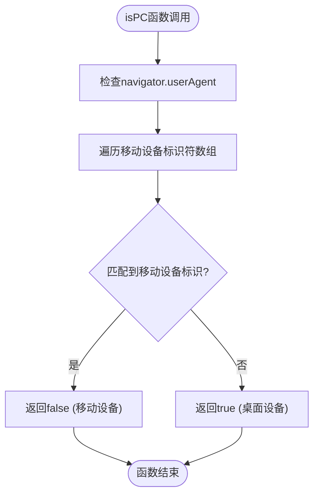
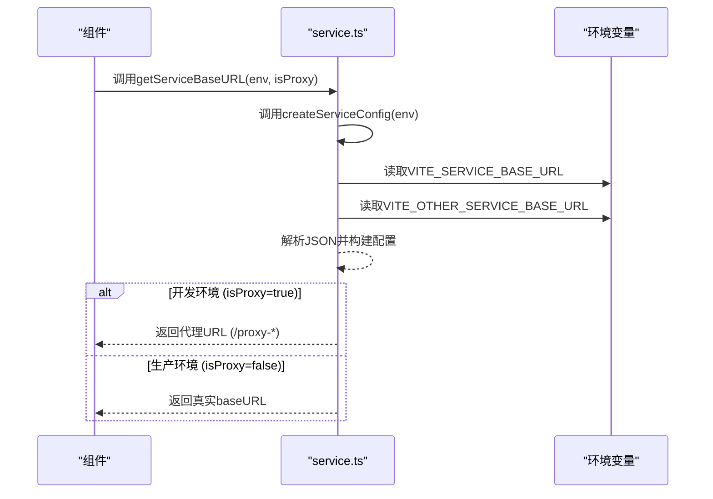
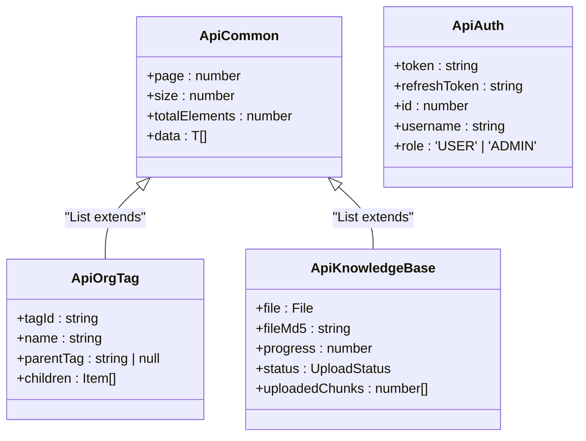
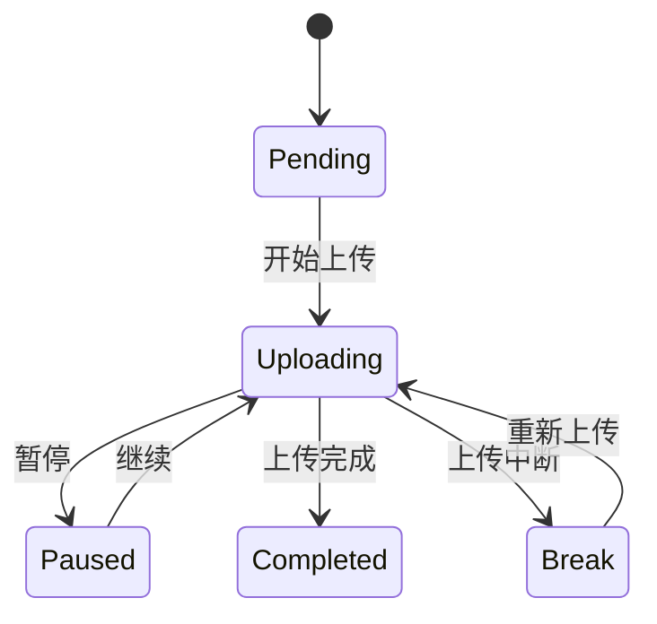
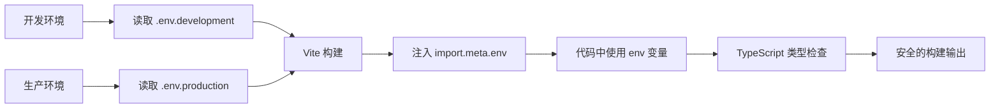

# 工具与类型系统

<cite>
**本文档引用的文件**  
- [api.d.ts](file://frontend/src/typings/api.d.ts)
- [router.d.ts](file://frontend/src/typings/router.d.ts)
- [union-key.d.ts](file://frontend/src/typings/union-key.d.ts)
- [vite-env.d.ts](file://frontend/src/typings/vite-env.d.ts)
- [common.d.ts](file://frontend/src/typings/common.d.ts)
- [agent.ts](file://frontend/src/utils/agent.ts)
- [common.ts](file://frontend/src/utils/common.ts)
- [icon.ts](file://frontend/src/utils/icon.ts)
- [service.ts](file://frontend/src/utils/service.ts)
- [storage.ts](file://frontend/src/utils/storage.ts)
- [app.ts](file://frontend/src/constants/app.ts)
- [common.ts](file://frontend/src/constants/common.ts)
- [index.ts](file://frontend/src/enum/index.ts)
</cite>

## 目录
1. [工具函数体系](#工具函数体系)
2. [类型声明系统](#类型声明系统)
3. [常量与枚举管理](#常量与枚举管理)
4. [类型安全与联合类型](#类型安全与联合类型)
5. [Vite环境变量与构建配置](#vite环境变量与构建配置)

## 工具函数体系

前端项目中的工具函数模块被组织在 `src/utils` 目录下，主要包括 `agent`、`common`、`icon`、`service` 和 `storage` 五个核心模块，每个模块负责特定的功能领域，便于维护和复用。

### agent 模块：设备检测工具

`agent.ts` 模块提供了一个简单的函数 `isPC()`，用于判断当前运行环境是否为桌面端设备。该函数通过检查 `navigator.userAgent` 中是否包含移动设备的标识符（如 Android、iPhone 等）来实现。



**图示来源**
- [agent.ts](file://frontend/src/utils/agent.ts#L1-L8)

**本节来源**
- [agent.ts](file://frontend/src/utils/agent.ts#L1-L8)

### common 模块：通用工具函数

`common.ts` 模块包含了一系列在项目中广泛使用的通用工具函数，是工具函数体系的核心。

- **`transformRecordToOption`**: 将一个键值对对象转换为下拉选项数组，常用于表单和选择器组件。
- **`translateOptions`**: 结合国际化（i18n），将选项的标签进行翻译。
- **`toggleHtmlClass`**: 用于动态添加或移除 HTML 根元素上的 CSS 类，常用于主题切换（如暗黑模式）。
- **`fileSize`**: 将字节数转换为可读的文件大小（如 KB、MB、GB）。
- **`calculateMD5`**: 使用 `SparkMD5` 库异步计算文件的 MD5 哈希值，用于文件去重和校验。
- **`formatDate`**: 使用 `dayjs` 库格式化日期时间。
- **`getFileExt`**: 获取文件名的扩展名。

```mermaid
classDiagram
class CommonUtils {
+transformRecordToOption(record) : Option[]
+translateOptions(options) : Option[]
+toggleHtmlClass(className) : {add, remove}
+fileSize(size : number) : string
+calculateMD5(file : File) : Promise<string>
+formatDate(date : any, format : string) : string
+getFileExt(fileName : string) : string
}
class Option {
+value : string
+label : string
}
CommonUtils --> Option : "返回"
```

**图示来源**
- [common.ts](file://frontend/src/utils/common.ts#L10-L113)

**本节来源**
- [common.ts](file://frontend/src/utils/common.ts#L10-L113)

### icon 模块：本地图标管理

`icon.ts` 模块通过 `getLocalIcons()` 函数，利用 Vite 的 `import.meta.glob` 功能，动态地收集并返回 `src/assets/svg-icon/` 目录下所有 SVG 图标的文件名（去除 `.svg` 后缀）。这些图标名称可用于在应用中动态渲染本地 SVG 图标。

**本节来源**
- [icon.ts](file://frontend/src/utils/icon.ts#L1-L9)

### service 模块：服务配置工具

`service.ts` 模块提供了与后端服务通信相关的配置工具。

- **`createServiceConfig`**: 根据环境变量（`import.meta.env`）创建服务配置对象，包括主服务的 `baseURL` 和其他服务的 `other` 配置。它会尝试解析 `VITE_OTHER_SERVICE_BASE_URL` 这个 JSON 字符串。
- **`getServiceBaseURL`**: 根据当前环境和是否启用代理，决定最终请求的 URL。在开发环境中，通常会使用代理模式（返回 `/proxy-*`）；在生产环境中，则直接使用真实的 `baseURL`。
- **`createProxyPattern`**: 生成代理路径的模式字符串。



**图示来源**
- [service.ts](file://frontend/src/utils/service.ts#L1-L75)

**本节来源**
- [service.ts](file://frontend/src/utils/service.ts#L1-L75)

### storage 模块：本地存储封装

`storage.ts` 模块利用 `@sa/utils` 包中的 `createStorage` 和 `createLocalforage` 函数，创建了两个封装好的存储实例：

- **`localStg`**: 基于 `localStorage` 的持久化存储，带有自定义前缀。
- **`sessionStg`**: 基于 `sessionStorage` 的会话存储，带有自定义前缀。
- **`localforage`**: 基于 `localforage` 库的异步存储，提供更好的性能和更大的存储空间。

这些封装简化了对浏览器存储的访问，并确保了存储键名的一致性。

**本节来源**
- [storage.ts](file://frontend/src/utils/storage.ts#L1-L9)

## 类型声明系统

项目的类型系统主要由 `src/typings` 目录下的多个 `.d.ts` 文件构成，为整个应用提供了精确的类型支持。

### api.d.ts：API 响应类型

`api.d.ts` 文件定义了所有后端 API 接口的响应数据类型，确保前端在处理 API 数据时具有完整的类型安全。

- **`Api.Common.PaginatingCommonParams`**: 分页请求的通用参数，如 `page`、`size`、`totalElements`。
- **`Api.Common.PaginatingQueryRecord<T>`**: 分页查询结果的通用结构，包含分页信息和数据列表。
- **`Api.Auth.LoginToken`**: 登录接口返回的令牌信息。
- **`Api.Route.UserRoute`**: 用户路由信息，包含菜单路由列表和首页路由。
- **`Api.OrgTag.List`**: 组织标签列表的分页数据结构。
- **`Api.KnowledgeBase.UploadTask`**: 知识库文件上传任务的数据结构，包含文件信息、上传进度、状态等。
- **`Api.Chat.Message`**: 聊天消息的数据结构，区分用户和助手角色。



**图示来源**
- [api.d.ts](file://frontend/src/typings/api.d.ts#L1-L203)

**本节来源**
- [api.d.ts](file://frontend/src/typings/api.d.ts#L1-L203)

### router.d.ts：路由元信息类型

`router.d.ts` 文件通过模块声明（`declare module 'vue-router'`）扩展了 `vue-router` 库的 `RouteMeta` 接口，为路由元信息（meta）添加了项目特定的类型。

- **`title`**: 路由标题。
- **`i18nKey`**: 国际化键名，优先级高于 `title`。
- **`roles`**: 访问该路由所需的角色。
- **`keepAlive`**: 是否缓存该路由组件。
- **`constant`**: 是否为常量路由（无需登录验证）。
- **`icon` / `localIcon`**: 菜单图标。
- **`hideInMenu`**: 是否在菜单中隐藏。
- **`fixedIndexInTab`**: 是否固定在标签页中。

**本节来源**
- [router.d.ts](file://frontend/src/typings/router.d.ts#L1-L72)

## 常量与枚举管理

### constants 目录：常量定义

`src/constants` 目录下的文件用于集中管理项目中的常量。

- **`app.ts`**: 定义了与应用主题、布局、登录模块等相关的常量。例如，`themeSchemaRecord` 将 `UnionKey.ThemeScheme` 枚举映射到国际化键名，`loginModuleRecord` 将登录模块类型映射到对应的标题。
- **`common.ts`**: 定义了通用常量，如 `yesOrNoRecord`（将 'Y'/'N' 映射到国际化键名）、`enableStatusOptions`（启用/禁用状态选项）以及文件上传的 `chunkSize` 和 `uploadAccept`（允许的文件类型）。

这些常量通过 `transformRecordToOption` 函数转换为下拉选项，实现了数据与视图的分离。

**本节来源**
- [app.ts](file://frontend/src/constants/app.ts#L1-L65)
- [common.ts](file://frontend/src/constants/common.ts#L1-L17)

### enum 目录：枚举定义

`src/enum/index.ts` 文件定义了项目中使用的枚举类型。

- **`SetupStoreId`**: 定义了 Pinia 状态管理库中各个 store 的唯一 ID。
- **`UploadStatus`**: 定义了文件上传任务的五种状态：`Uploading` (0), `Completed` (1), `Pending` (2), `Paused` (3), `Break` (4)。



**图示来源**
- [index.ts](file://frontend/src/enum/index.ts#L1-L16)

**本节来源**
- [index.ts](file://frontend/src/enum/index.ts#L1-L16)

## 类型安全与联合类型

`union-key.d.ts` 文件是提升类型安全性的关键。它定义了一系列联合类型（Union Types），将字符串字面量集合起来，避免了魔法字符串（magic strings）的使用。

- **`LoginModule`**: `'pwd-login' | 'code-login' | 'register' | 'reset-pwd' | 'bind-wechat'`
- **`ThemeScheme`**: `'light' | 'dark' | 'auto'`
- **`ThemeLayoutMode`**: `'vertical' | 'horizontal' | 'vertical-mix' | 'horizontal-mix'`
- **`ThemePageAnimateMode`**: 多种动画模式的集合。

这些联合类型在 `constants/app.ts` 中被直接引用，确保了常量定义的类型安全。例如，`themeSchemaRecord` 的键必须是 `UnionKey.ThemeScheme` 类型，任何拼写错误都会被 TypeScript 编译器捕获。

**本节来源**
- [union-key.d.ts](file://frontend/src/typings/union-key.d.ts#L1-L157)

## Vite环境变量与构建配置

`vite-env.d.ts` 文件为 Vite 的环境变量 `import.meta.env` 提供了类型定义，确保在代码中访问环境变量时有智能提示和类型检查。

- **`VITE_BASE_URL`**: 应用的基础路径。
- **`VITE_APP_TITLE`**: 应用标题。
- **`VITE_SERVICE_BASE_URL`**: 后端服务基础 URL。
- **`VITE_SERVICE_SUCCESS_CODE`**: 后端服务的成功状态码。
- **`VITE_AUTH_ROUTE_MODE`**: 路由鉴权模式（'static' 或 'dynamic'）。
- **`VITE_HTTP_PROXY`**: 是否启用 HTTP 代理。

通过为这些环境变量提供精确的类型（如字符串、数字、布尔值、字面量联合类型），开发者可以在开发过程中避免因拼写错误或类型不匹配而导致的运行时错误。



**本节来源**
- [vite-env.d.ts](file://frontend/src/typings/vite-env.d.ts#L1-L120)