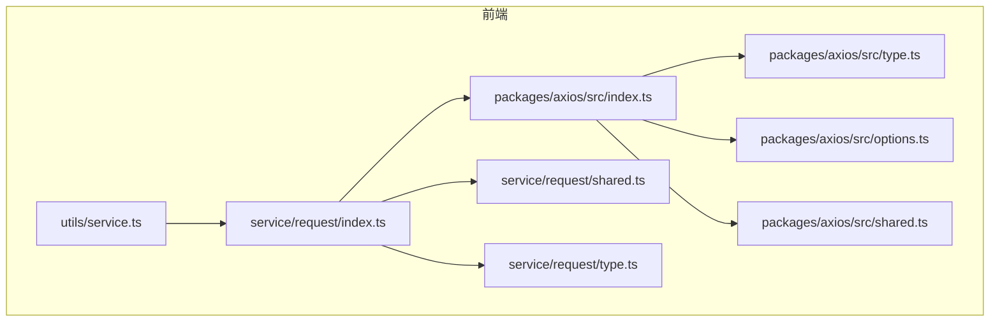
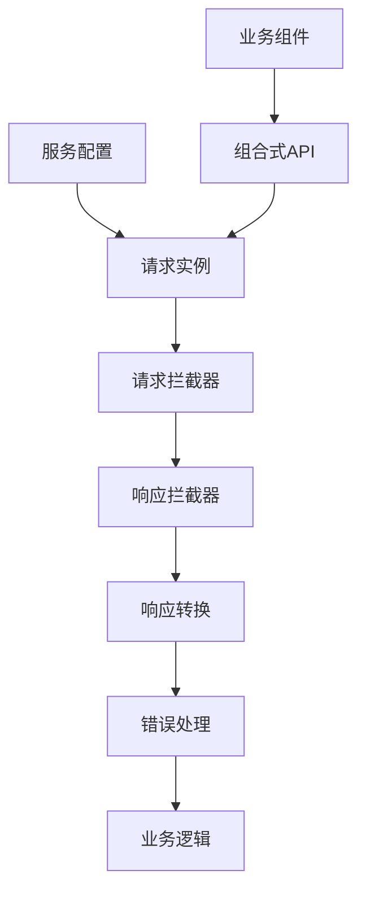
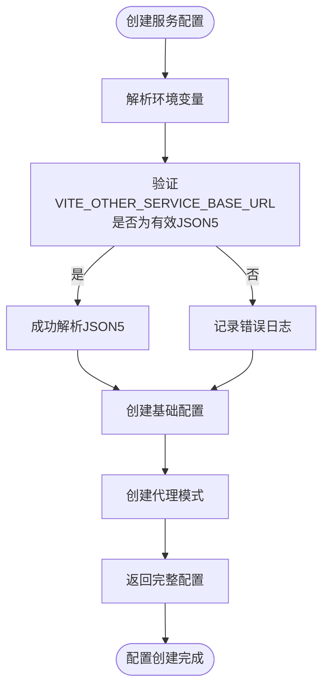
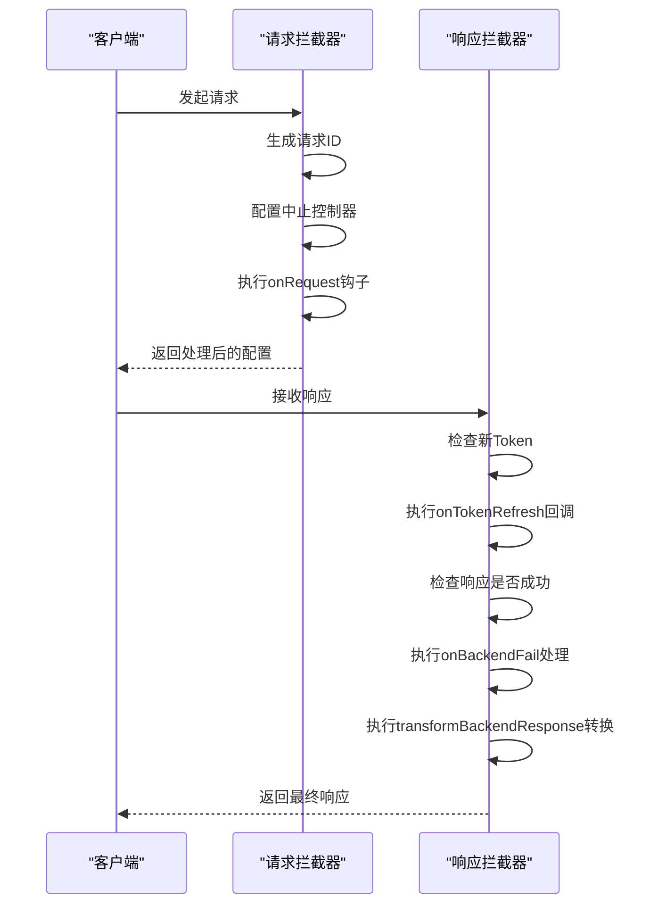
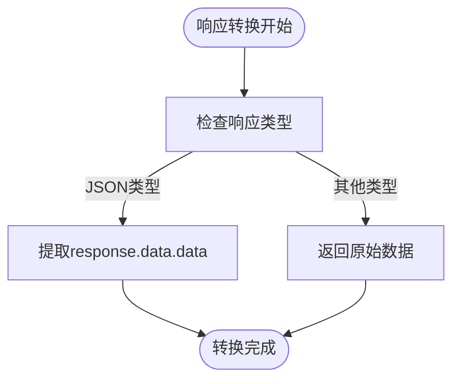
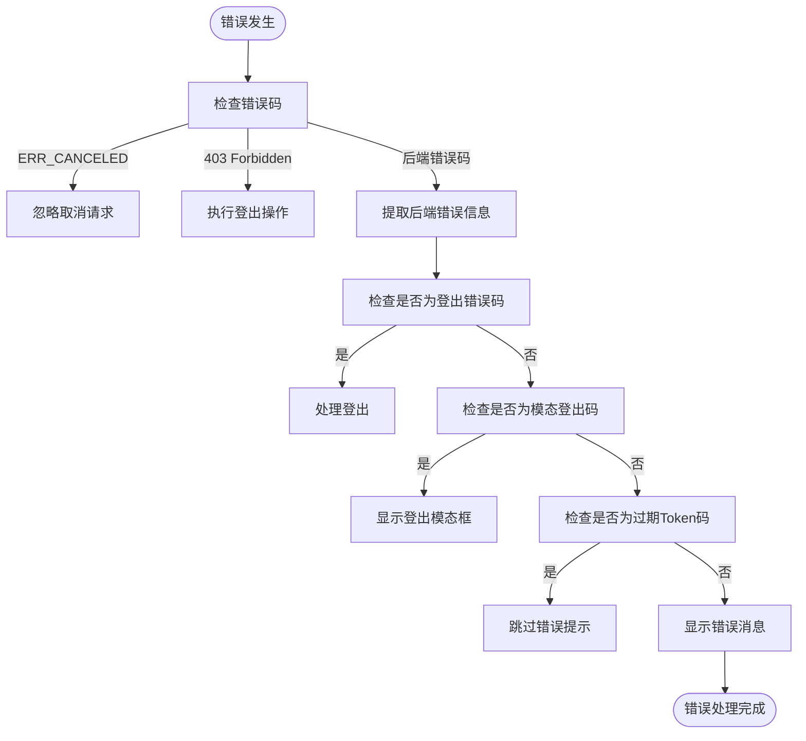
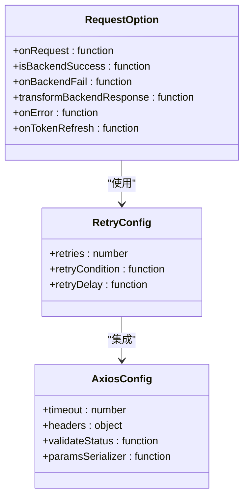
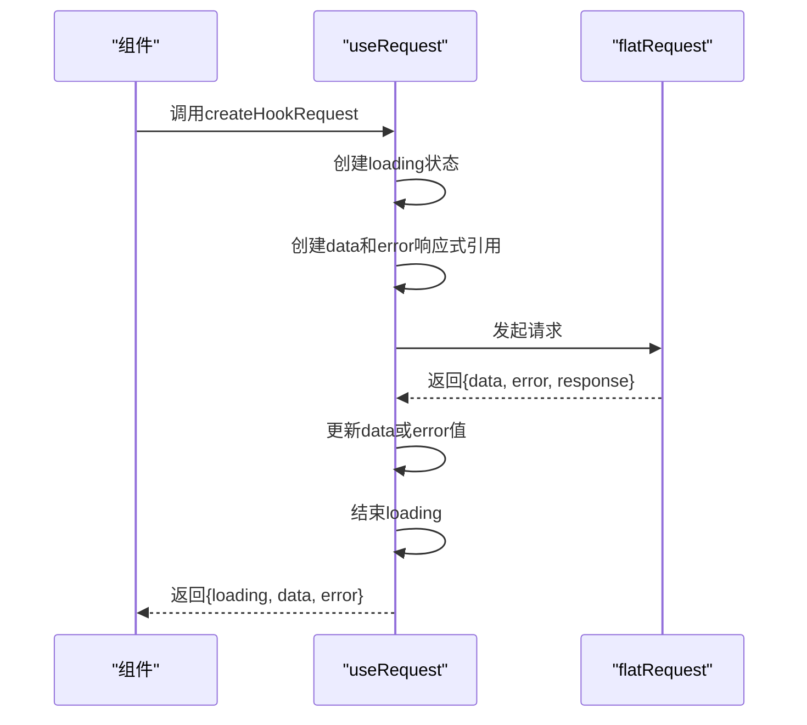
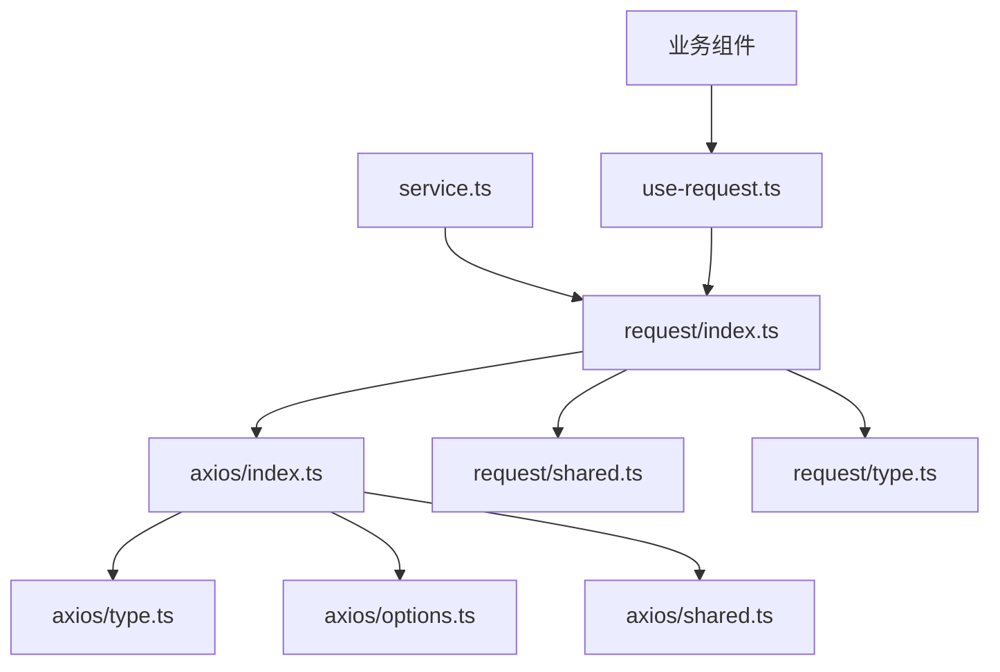

# 服务层工具

<cite>
**本文档引用的文件**   
- [service.ts](file://frontend/src/utils/service.ts)
- [index.ts](file://frontend/packages/axios/src/index.ts)
- [type.ts](file://frontend/packages/axios/src/type.ts)
- [options.ts](file://frontend/packages/axios/src/options.ts)
- [shared.ts](file://frontend/packages/axios/src/shared.ts)
- [index.ts](file://frontend/src/service/request/index.ts)
- [shared.ts](file://frontend/src/service/request/shared.ts)
- [type.ts](file://frontend/src/service/request/type.ts)
- [api.d.ts](file://frontend/src/typings/api.d.ts)
</cite>

## 目录
1. [简介](#简介)
2. [项目结构](#项目结构)
3. [核心组件](#核心组件)
4. [架构概览](#架构概览)
5. [详细组件分析](#详细组件分析)
6. [依赖分析](#依赖分析)
7. [性能考虑](#性能考虑)
8. [故障排除指南](#故障排除指南)
9. [结论](#结论)

## 简介
本文档详细说明了PaiSmart项目中与后端服务交互相关的工具函数。重点解析了如何统一处理API响应结构（如code/message/data模式），封装请求失败重试机制、错误码映射与业务异常提示。展示了transformRequest和transformResponse在请求拦截中的转换逻辑。结合useRequest等组合式API，说明该工具如何提升服务调用的健壮性与一致性。

## 项目结构
项目采用分层架构设计，前端代码位于`frontend`目录下，主要服务层工具分布在`packages/axios`和`src/service/request`目录中。核心服务配置工具位于`src/utils/service.ts`。

**图示来源**
- [service.ts](file://frontend/src/utils/service.ts)
- [index.ts](file://frontend/packages/axios/src/index.ts)
- [index.ts](file://frontend/src/service/request/index.ts)

**本节来源**
- [service.ts](file://frontend/src/utils/service.ts)
- [index.ts](file://frontend/packages/axios/src/index.ts)

## 核心组件
服务层工具的核心组件包括服务配置创建、请求实例创建、响应转换、错误处理和组合式API封装。这些组件共同构成了一个健壮的服务调用体系。

**本节来源**
- [service.ts](file://frontend/src/utils/service.ts)
- [index.ts](file://frontend/packages/axios/src/index.ts)
- [index.ts](file://frontend/src/service/request/index.ts)

## 架构概览
服务层工具采用分层架构，从底层的Axios封装到上层的业务逻辑处理，形成了完整的请求处理链。

**图示来源**
- [index.ts](file://frontend/packages/axios/src/index.ts)
- [index.ts](file://frontend/src/service/request/index.ts)

## 详细组件分析

### 服务配置管理
服务配置管理负责根据环境变量创建和获取服务基础URL，支持代理模式和多服务配置。

#### 服务配置创建

**图示来源**
- [service.ts](file://frontend/src/utils/service.ts#L7-L40)

**本节来源**
- [service.ts](file://frontend/src/utils/service.ts#L7-L40)

### 请求拦截与转换逻辑
请求拦截与转换逻辑是服务层工具的核心，通过Axios拦截器实现请求和响应的统一处理。

#### 请求拦截器流程

**图示来源**
- [index.ts](file://frontend/packages/axios/src/index.ts#L42-L92)
- [index.ts](file://frontend/packages/axios/src/index.ts#L90-L141)

**本节来源**
- [index.ts](file://frontend/packages/axios/src/index.ts#L42-L141)

### 响应结构统一处理
服务层工具通过`transformBackendResponse`函数统一处理API响应结构，提取业务数据。

#### 响应转换逻辑

**图示来源**
- [index.ts](file://frontend/src/service/request/index.ts#L139-L141)

**本节来源**
- [index.ts](file://frontend/src/service/request/index.ts#L139-L141)

### 错误处理与业务异常
错误处理机制涵盖了从网络错误到业务异常的完整处理流程，确保用户体验的一致性。

#### 错误处理流程

**图示来源**
- [index.ts](file://frontend/src/service/request/index.ts#L108-L137)
- [shared.ts](file://frontend/src/service/request/shared.ts#L48-L64)

**本节来源**
- [index.ts](file://frontend/src/service/request/index.ts#L108-L137)
- [shared.ts](file://frontend/src/service/request/shared.ts#L48-L64)

### 请求重试机制
请求重试机制通过axios-retry库实现，可配置重试次数和条件。

#### 重试配置

**图示来源**
- [options.ts](file://frontend/packages/axios/src/options.ts#L20-L28)
- [index.ts](file://frontend/packages/axios/src/index.ts#L25-L28)

**本节来源**
- [options.ts](file://frontend/packages/axios/src/options.ts#L20-L28)

### 组合式API封装
通过useRequest等组合式API，将服务调用与Vue的响应式系统深度集成。

#### useRequest实现

**图示来源**
- [use-request.ts](file://frontend/packages/hooks/src/use-request.ts#L30-L78)

**本节来源**
- [use-request.ts](file://frontend/packages/hooks/src/use-request.ts#L30-L78)

## 依赖分析
服务层工具的依赖关系清晰，各组件职责分明，耦合度低。

**图示来源**
- [service.ts](file://frontend/src/utils/service.ts)
- [index.ts](file://frontend/packages/axios/src/index.ts)
- [index.ts](file://frontend/src/service/request/index.ts)
- [use-request.ts](file://frontend/packages/hooks/src/use-request.ts)

**本节来源**
- [service.ts](file://frontend/src/utils/service.ts)
- [index.ts](file://frontend/packages/axios/src/index.ts)
- [index.ts](file://frontend/src/service/request/index.ts)
- [use-request.ts](file://frontend/packages/hooks/src/use-request.ts)

## 性能考虑
服务层工具在性能方面做了多项优化：

1. **请求中止**：通过AbortController实现请求中止，避免不必要的网络开销
2. **Token缓存**：在内存中缓存Token刷新Promise，避免重复刷新
3. **错误消息去重**：通过errMsgStack避免相同错误消息重复显示
4. **代理模式**：开发环境下使用代理减少跨域开销

## 故障排除指南
### 常见问题及解决方案

**问题1：请求返回403错误**
- **原因**：Token无效或过期
- **解决方案**：检查登录状态，重新登录获取新Token

**问题2：错误消息重复显示**
- **原因**：errMsgStack未正确清理
- **解决方案**：确保onLeave回调正确执行，清理错误消息栈

**问题3：Token刷新死循环**
- **原因**：refreshToken接口返回过期Token错误码
- **解决方案**：确保refreshToken接口返回登出错误码而非过期错误码

**问题4：代理模式不生效**
- **原因**：VITE_HTTP_PROXY环境变量未设置为'Y'
- **解决方案**：检查.env文件，确保VITE_HTTP_PROXY='Y'

**本节来源**
- [index.ts](file://frontend/src/service/request/index.ts#L51-L84)
- [shared.ts](file://frontend/src/service/request/shared.ts#L48-L64)

## 结论
PaiSmart项目的服务层工具设计精良，通过分层架构和组合式API，实现了服务调用的健壮性与一致性。关键优势包括：

1. **统一的响应处理**：通过transformBackendResponse统一提取业务数据
2. **完善的错误处理**：涵盖网络错误和业务异常的完整处理流程
3. **无感知Token刷新**：通过New-Token响应头实现无缝Token更新
4. **灵活的配置**：支持多服务基础URL和代理模式
5. **响应式集成**：通过useRequest与Vue响应式系统深度集成

这套工具显著提升了开发效率和用户体验，是项目架构中的重要组成部分。