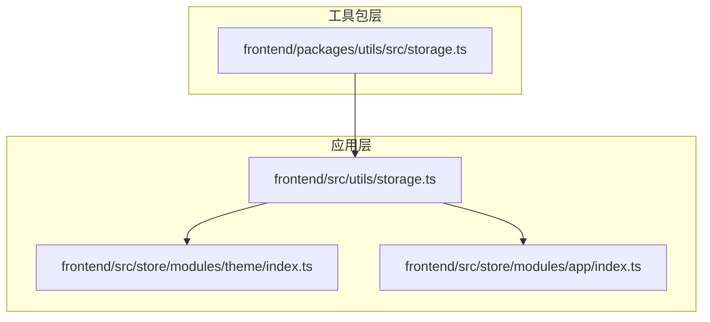
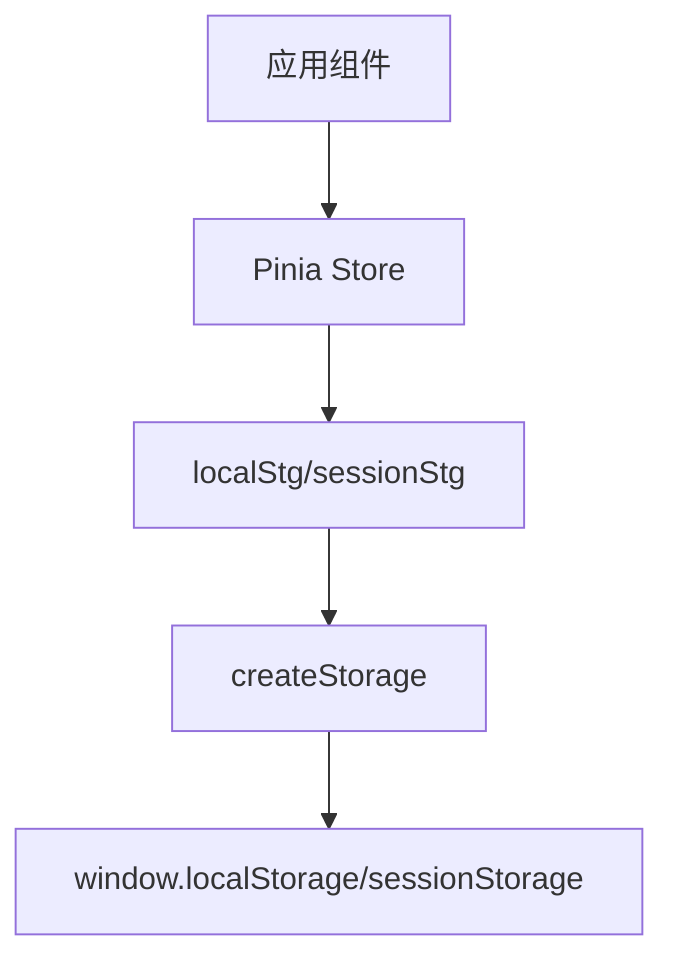
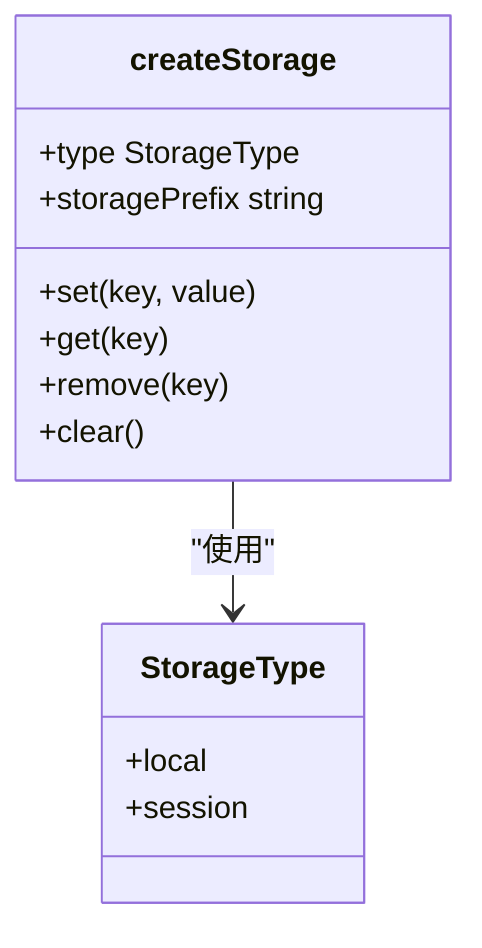
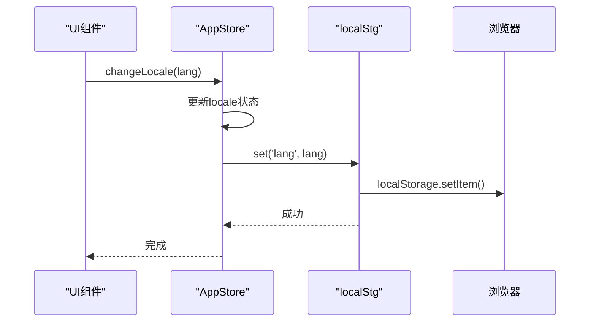
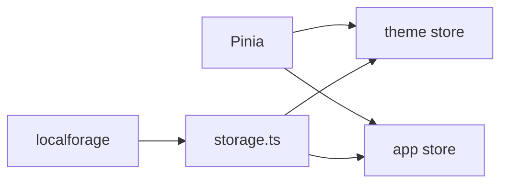

# 本地存储工具

<cite>
**本文档引用的文件**   
- [storage.ts](file://frontend/packages/utils/src/storage.ts#L1-L76)
- [storage.ts](file://frontend/src/utils/storage.ts#L1-L9)
- [theme/index.ts](file://frontend/src/store/modules/theme/index.ts#L1-L221)
- [app/index.ts](file://frontend/src/store/modules/app/index.ts#L1-L170)
- [storage.d.ts](file://frontend/src/typings/storage.d.ts#L1-L43)
</cite>

## 目录
1. [简介](#简介)
2. [项目结构](#项目结构)
3. [核心组件](#核心组件)
4. [架构概述](#架构概述)
5. [详细组件分析](#详细组件分析)
6. [依赖分析](#依赖分析)
7. [性能考虑](#性能考虑)
8. [故障排除指南](#故障排除指南)
9. [结论](#结论)

## 简介
本文档全面介绍`storage.ts`文件对浏览器存储能力的封装机制。重点说明`useLocalStorage`和`useSessionStorage`如何提供响应式存储访问接口，并自动处理JSON序列化、过期时间管理与跨标签页同步。分析存储键名命名规范、容量监控与异常处理机制。结合用户偏好设置（如主题、布局模式）展示实际应用案例，强调数据安全与隐私合规注意事项。

## 项目结构
项目中的本地存储功能主要分布在两个核心位置：工具包层和应用层。工具包层位于`frontend/packages/utils/src/storage.ts`，提供基础的存储封装；应用层位于`frontend/src/utils/storage.ts`，基于工具包创建具体实例。主题和应用状态管理模块通过Pinia Store使用这些存储实例来持久化用户偏好设置。



**图示来源**
- [storage.ts](file://frontend/packages/utils/src/storage.ts#L1-L76)
- [storage.ts](file://frontend/src/utils/storage.ts#L1-L9)

## 核心组件
核心组件包括`createStorage`函数，用于创建本地和会话存储实例，以及`localStg`和`sessionStg`两个导出实例。这些组件共同构成了应用的持久化存储基础。

**组件来源**
- [storage.ts](file://frontend/packages/utils/src/storage.ts#L5-L51)
- [storage.ts](file://frontend/src/utils/storage.ts#L4-L6)

## 架构概述
系统的本地存储架构采用分层设计模式，上层应用通过类型安全的接口访问底层浏览器存储。这种设计实现了关注点分离，提高了代码的可维护性和可测试性。



**图示来源**
- [storage.ts](file://frontend/packages/utils/src/storage.ts#L5-L51)
- [storage.ts](file://frontend/src/utils/storage.ts#L4-L6)

## 详细组件分析

### 存储创建函数分析
`createStorage`函数是本地存储封装的核心，它提供了一个类型安全的接口来操作浏览器的`localStorage`和`sessionStorage`。

#### 类图展示


**图示来源**
- [storage.ts](file://frontend/packages/utils/src/storage.ts#L3-L51)

### 应用状态存储分析
应用状态存储模块使用`localStg`实例来持久化用户的语言偏好和布局设置等关键信息。

#### 序列图展示


**图示来源**
- [app/index.ts](file://frontend/src/store/modules/app/index.ts#L1-L170)

### 主题设置存储分析
主题设置模块使用`localStg`实例来持久化用户的主题偏好，包括颜色方案、暗黑模式等。

#### 流程图展示
```mermaid
flowchart TD
A[用户更改主题] --> B{是否生产环境?}
B --> |是| C[调用localStg.set()]
B --> |否| D[不缓存]
C --> E[浏览器存储更新]
E --> F[页面刷新后恢复]
```

**图示来源**
- [theme/index.ts](file://frontend/src/store/modules/theme/index.ts#L1-L221)

## 依赖分析
本地存储功能依赖于多个外部库和内部模块，形成了一个完整的生态系统。



**图示来源**
- [storage.ts](file://frontend/packages/utils/src/storage.ts#L1-L76)
- [theme/index.ts](file://frontend/src/store/modules/theme/index.ts#L1-L221)

## 性能考虑
本地存储操作通常是同步的，可能阻塞主线程。建议对频繁读写的数据使用内存缓存，仅在必要时同步到持久化存储。对于大量数据，应考虑使用IndexedDB替代localStorage。

## 故障排除指南
当遇到存储相关问题时，首先检查浏览器的存储限制和隐私设置。确保存储键名遵循命名规范，避免冲突。对于序列化错误，验证存储的数据是否可被JSON.stringify正确处理。

**组件来源**
- [storage.ts](file://frontend/packages/utils/src/storage.ts#L20-L30)
- [storage.d.ts](file://frontend/src/typings/storage.d.ts#L1-L43)

## 结论
`storage.ts`文件提供了一套完整且类型安全的浏览器存储封装方案。通过分层架构和响应式集成，实现了用户偏好设置的无缝持久化。该设计既保证了数据的安全性，又提供了良好的开发体验。