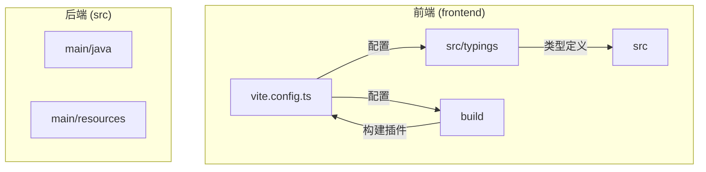
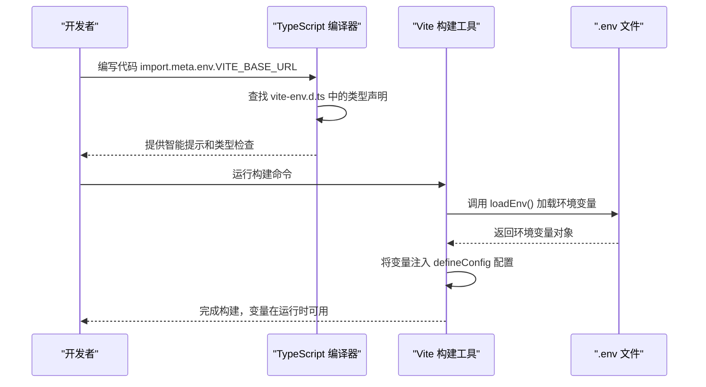
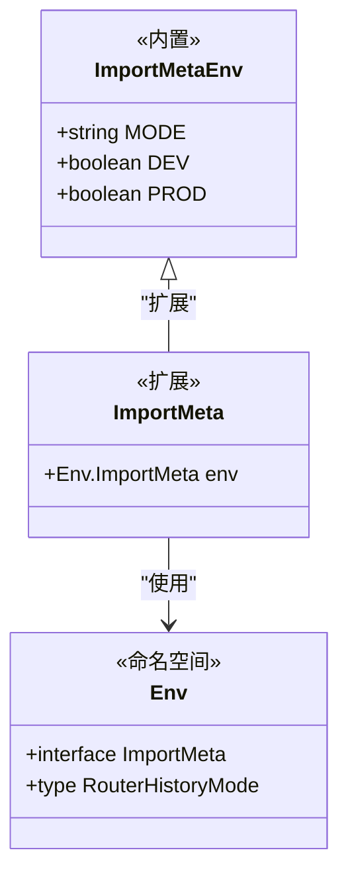
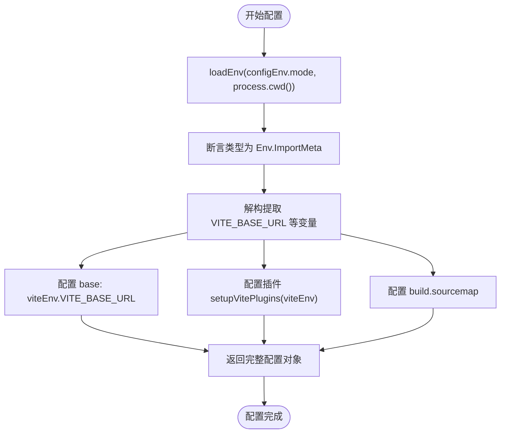
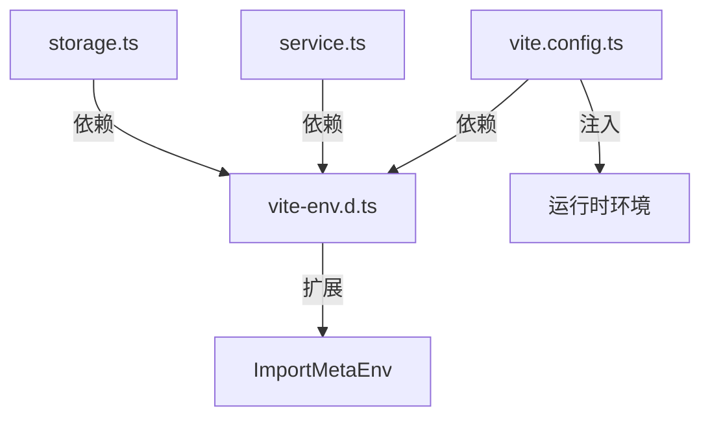

# 构建环境类型

<cite>
**本文档引用的文件**   
- [vite-env.d.ts](file://frontend/src/typings/vite-env.d.ts)
- [vite.config.ts](file://frontend/vite.config.ts)
- [common.d.ts](file://frontend/src/typings/common.d.ts)
- [service.ts](file://frontend/src/utils/service.ts)
- [storage.ts](file://frontend/src/utils/storage.ts)
</cite>

## 目录
1. [介绍](#介绍)
2. [项目结构](#项目结构)
3. [核心组件](#核心组件)
4. [架构概览](#架构概览)
5. [详细组件分析](#详细组件分析)
6. [依赖分析](#依赖分析)
7. [性能考虑](#性能考虑)
8. [故障排除指南](#故障排除指南)
9. [结论](#结论)

## 介绍
本文档详细解释了 `vite-env.d.ts` 文件如何扩展 Vite 的默认类型系统，声明 `import.meta.env` 中自定义环境变量（如 `VITE_API_BASE_URL`）的类型。文档说明了该类型声明文件如何与 `vite.config.ts` 中的 `defineConfig` 配合，实现开发和生产环境下的类型安全配置。通过具体代码示例，展示了在代码中通过 `import.meta.env` 访问环境变量时的智能提示与错误预防效果，确保构建时类型检查的完整性。

## 项目结构
该项目采用典型的前后端分离架构，前端位于 `frontend` 目录，后端位于 `src/main/java` 目录。前端项目使用 Vite 作为构建工具，TypeScript 作为开发语言，并通过模块化的 `packages` 目录组织可复用的组件和工具库。



**图示来源**
- [vite.config.ts](file://frontend/vite.config.ts#L1-L53)
- [vite-env.d.ts](file://frontend/src/typings/vite-env.d.ts#L1-L120)

## 核心组件
本项目的核心构建环境类型机制由两个关键文件驱动：`vite-env.d.ts` 和 `vite.config.ts`。前者负责类型声明，后者负责运行时配置，二者协同工作，确保了环境变量使用的类型安全。

**本节来源**
- [vite-env.d.ts](file://frontend/src/typings/vite-env.d.ts#L1-L120)
- [vite.config.ts](file://frontend/vite.config.ts#L1-L53)

## 架构概览
整个构建环境类型系统的架构围绕着 Vite 的模块解析和 TypeScript 的类型扩展机制展开。`vite-env.d.ts` 通过声明合并（Declaration Merging）扩展了 `import.meta` 的 `env` 对象，而 `vite.config.ts` 则在运行时加载 `.env` 文件并将其注入到构建配置中。



**图示来源**
- [vite-env.d.ts](file://frontend/src/typings/vite-env.d.ts#L1-L120)
- [vite.config.ts](file://frontend/vite.config.ts#L1-L53)

## 详细组件分析

### vite-env.d.ts 类型扩展分析
`vite-env.d.ts` 文件的核心作用是通过 TypeScript 的命名空间（`namespace`）和接口（`interface`）扩展了 Vite 的全局类型。它声明了一个名为 `Env` 的命名空间，并在其中定义了 `ImportMeta` 接口，该接口继承自 Vite 内置的 `ImportMetaEnv`。



**图示来源**
- [vite-env.d.ts](file://frontend/src/typings/vite-env.d.ts#L1-L120)

`Env.ImportMeta` 接口明确声明了所有以 `VITE_` 开头的自定义环境变量及其类型。例如：
- `VITE_BASE_URL: string`：应用的基础 URL。
- `VITE_SERVICE_BASE_URL: string`：后端服务的基础 URL。
- `VITE_HTTP_PROXY?: CommonType.YesOrNo`：一个可选的布尔标志，其类型为 `'Y' | 'N'`，用于控制是否启用 HTTP 代理。

这种强类型声明使得在代码编辑器中访问 `import.meta.env` 时，能够获得精确的自动补全和类型检查。如果尝试访问一个未声明的变量，TypeScript 编译器会立即报错。

**本节来源**
- [vite-env.d.ts](file://frontend/src/typings/vite-env.d.ts#L1-L120)
- [common.d.ts](file://frontend/src/typings/common.d.ts#L1-L25)

### vite.config.ts 配置与集成分析
`vite.config.ts` 是 Vite 的配置入口。它通过 `defineConfig` 函数接收一个配置工厂函数。该函数接收 `configEnv` 参数，并使用 `loadEnv` 函数从项目根目录加载对应模式（如 `development` 或 `production`）的 `.env` 文件。



**图示来源**
- [vite.config.ts](file://frontend/vite.config.ts#L1-L53)

关键代码 `const viteEnv = loadEnv(configEnv.mode, process.cwd()) as unknown as Env.ImportMeta;` 将 `loadEnv` 返回的普通对象，通过类型断言，强制转换为 `Env.ImportMeta` 类型。这一步至关重要，它将运行时加载的环境变量与 `vite-env.d.ts` 中声明的类型绑定在一起，实现了类型安全。随后，配置中的 `base: viteEnv.VITE_BASE_URL` 等字段便可以直接使用这些类型安全的变量。

**本节来源**
- [vite.config.ts](file://frontend/vite.config.ts#L1-L53)

### 环境变量使用场景分析
在实际代码中，`import.meta.env` 被广泛用于需要根据环境变化的配置。以下两个文件展示了其具体用法。

#### 服务配置创建 (service.ts)
`src/utils/service.ts` 文件中的 `createServiceConfig` 函数接收一个 `Env.ImportMeta` 类型的参数 `env`，并从中解构出 `VITE_SERVICE_BASE_URL` 和 `VITE_OTHER_SERVICE_BASE_URL` 来构建服务请求的配置对象。这确保了服务的基地址在不同环境下（开发、生产）能够正确指向。

```typescript
export function createServiceConfig(env: Env.ImportMeta) {
  const { VITE_SERVICE_BASE_URL, VITE_OTHER_SERVICE_BASE_URL } = env;
  // ... 使用这些变量构建配置
}
```

**本节来源**
- [service.ts](file://frontend/src/utils/service.ts#L1-L75)

#### 存储前缀设置 (storage.ts)
`src/utils/storage.ts` 文件直接使用 `import.meta.env.VITE_STORAGE_PREFIX` 来为本地存储（localStorage/sessionStorage）设置一个前缀，以避免不同项目或环境下的存储键名冲突。

```typescript
const storagePrefix = import.meta.env.VITE_STORAGE_PREFIX || '';
export const localStg = createStorage<StorageType.Local>('local', storagePrefix);
```

**本节来源**
- [storage.ts](file://frontend/src/utils/storage.ts#L1-L9)

## 依赖分析
该类型系统依赖于 Vite 和 TypeScript 的紧密集成。`vite-env.d.ts` 依赖于 Vite 的 `ImportMetaEnv` 基础类型。`vite.config.ts` 依赖于 `vite-env.d.ts` 提供的 `Env.ImportMeta` 类型来进行类型断言。实际业务代码（如 `service.ts` 和 `storage.ts`）则依赖于这个完整的类型系统来安全地访问环境变量。



**图示来源**
- [vite-env.d.ts](file://frontend/src/typings/vite-env.d.ts#L1-L120)
- [vite.config.ts](file://frontend/vite.config.ts#L1-L53)
- [service.ts](file://frontend/src/utils/service.ts#L1-L75)
- [storage.ts](file://frontend/src/utils/storage.ts#L1-L9)

## 性能考虑
此类型系统本身在运行时没有开销，因为 TypeScript 类型在编译后会被擦除。`loadEnv` 函数在构建时执行一次，其性能影响可以忽略不计。整体上，该方案在提供强大开发体验的同时，对应用性能无负面影响。

## 故障排除指南
- **问题：** 编辑器没有 `import.meta.env` 的智能提示。
  **解决方案：** 确保 `vite-env.d.ts` 文件位于 `tsconfig.json` 的 `include` 数组中，并且文件路径正确。
- **问题：** 构建时报错，提示 `VITE_XXX` 变量未定义。
  **解决方案：** 检查 `.env` 或 `.env.[mode]` 文件中是否定义了相应的变量。确保 `vite.config.ts` 中的 `loadEnv` 调用路径正确。
- **问题：** 类型断言失败。
  **解决方案：** 确保 `vite-env.d.ts` 中声明的变量名与 `.env` 文件中的变量名完全一致（包括大小写和前缀 `VITE_`）。

**本节来源**
- [vite-env.d.ts](file://frontend/src/typings/vite-env.d.ts#L1-L120)
- [vite.config.ts](file://frontend/vite.config.ts#L1-L53)

## 结论
通过 `vite-env.d.ts` 文件扩展 Vite 的默认类型，并与 `vite.config.ts` 中的 `defineConfig` 配合，该项目成功实现了构建环境的类型安全。这一机制不仅为开发者提供了卓越的智能提示和编译时错误检查，还确保了环境变量在配置和使用过程中的正确性，极大地提升了开发效率和代码的健壮性。