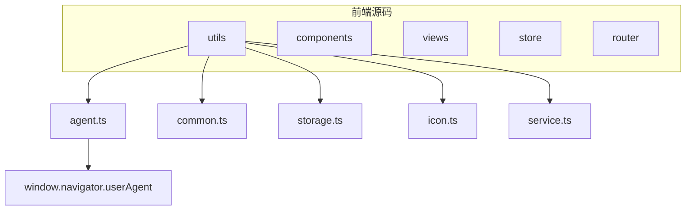
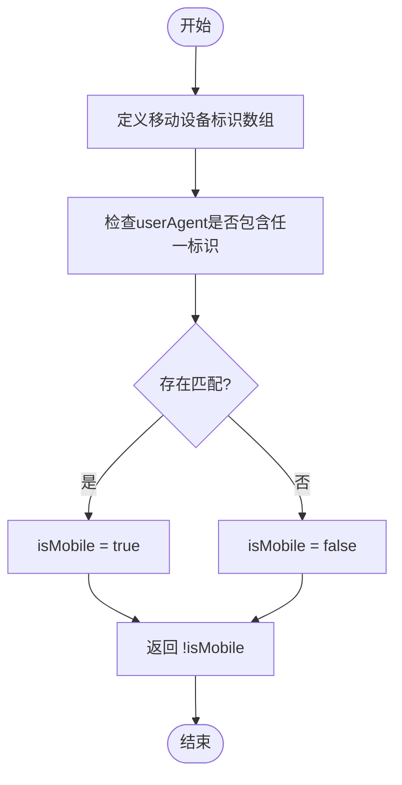
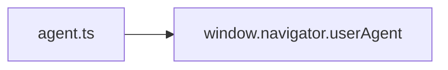

# 用户代理工具

<cite>
**本文档引用的文件**  
- [agent.ts](file://frontend/src/utils/agent.ts#L0-L6)
</cite>

## 目录
1. [简介](#简介)
2. [项目结构](#项目结构)
3. [核心组件](#核心组件)
4. [架构概述](#架构概述)
5. [详细组件分析](#详细组件分析)
6. [依赖分析](#依赖分析)
7. [性能考虑](#性能考虑)
8. [故障排除指南](#故障排除指南)
9. [结论](#结论)

## 简介
本文档详细说明了 `agent.ts` 文件中用户代理检测工具的实现机制。该工具通过解析浏览器的 `navigator.userAgent` 字符串，判断当前设备类型（移动端或桌面端），为前端应用提供运行时环境上下文。此功能在响应式布局适配、功能降级处理和埋点上报等场景中具有重要作用。尽管目前仅实现了一个 `isPC()` 函数，但其设计简洁高效，具备良好的可扩展性。

## 项目结构
项目采用模块化前端架构，主要分为 `build`、`packages` 和 `src` 三大目录。`src` 目录包含核心业务代码，其中 `utils` 子目录存放通用工具函数，`agent.ts` 即位于此路径下，与其他工具如 `common.ts`、`storage.ts` 等并列，表明其作为基础工具模块的定位。



**图示来源**  
- [agent.ts](file://frontend/src/utils/agent.ts#L0-L6)

**本节来源**  
- [agent.ts](file://frontend/src/utils/agent.ts#L0-L6)

## 核心组件
`agent.ts` 模块的核心功能是通过 `isPC()` 函数判断当前设备是否为桌面端。该函数通过检查 `userAgent` 字符串是否包含已知移动设备标识来实现设备类型检测。其返回值为布尔类型，`true` 表示桌面端，`false` 表示移动端。

**本节来源**  
- [agent.ts](file://frontend/src/utils/agent.ts#L0-L6)

## 架构概述
该用户代理检测工具属于前端基础工具层，位于应用架构的最底层。它不依赖任何业务逻辑，仅依赖浏览器原生的 `navigator.userAgent` API，因此具有极低的耦合度和高可移植性。上层组件或逻辑可直接导入并调用 `isPC()` 函数，以获取当前运行环境的设备类型信息。

```mermaid
graph TD
A[Browser Environment] --> B[window.navigator.userAgent]
B --> C[agent.ts]
C --> D[isPC()]
D --> E[Business Logic]
E --> F[Responsive Layout]
E --> G[Feature Degradation]
E --> H[Data Tracking]
```

**图示来源**  
- [agent.ts](file://frontend/src/utils/agent.ts#L0-L6)

## 详细组件分析

### isPC 函数实现分析
`isPC()` 函数的实现机制如下：
1. 定义一个包含常见移动设备关键字的数组 `agents`。
2. 使用 `Array.some()` 方法遍历该数组，检查 `window.navigator.userAgent` 字符串是否包含任何一个关键字。
3. 如果包含任意一个关键字，则 `isMobile` 为 `true`，表示当前为移动设备。
4. 最终返回 `!isMobile`，即如果非移动设备则返回 `true`，表示为桌面端。

该实现利用了 `some()` 方法的短路特性，一旦找到匹配项即停止遍历，提高了性能。正则表达式未被采用，而是使用了简单的字符串包含检查（`includes`），这在匹配固定关键字时更为高效且易于维护。



**图示来源**  
- [agent.ts](file://frontend/src/utils/agent.ts#L0-L6)

**本节来源**  
- [agent.ts](file://frontend/src/utils/agent.ts#L0-L6)

## 依赖分析
`agent.ts` 模块不依赖项目内的其他文件，仅依赖浏览器的全局对象 `window` 及其 `navigator.userAgent` 属性。这种设计使其成为一个独立的、无外部依赖的纯工具函数，可以轻松地在项目中任何地方复用。



**图示来源**  
- [agent.ts](file://frontend/src/utils/agent.ts#L0-L6)

**本节来源**  
- [agent.ts](file://frontend/src/utils/agent.ts#L0-L6)

## 性能考虑
`isPC()` 函数的性能表现优秀：
- **时间复杂度**：O(n)，其中 n 为移动设备标识数组的长度。由于数组长度固定且较小（8个元素），实际耗时可忽略不计。
- **执行效率**：使用 `includes` 进行字符串匹配，比正则表达式更轻量。`some()` 方法的短路机制避免了不必要的遍历。
- **调用成本**：函数无副作用，可安全地多次调用。建议在应用初始化时调用一次并将结果缓存，避免在高频渲染的组件中重复调用。

## 故障排除指南
- **问题**：`isPC()` 判断结果不准确。
  - **原因**：`userAgent` 字符串可能被用户代理修改或某些新型设备未被识别。
  - **解决方案**：定期更新 `agents` 数组，添加新出现的设备标识。可考虑结合屏幕尺寸等其他指标进行综合判断。
- **问题**：在 Node.js 环境中报错。
  - **原因**：`window` 对象在服务端不存在。
  - **解决方案**：在调用前检查 `typeof window !== 'undefined'`，确保运行在浏览器环境。

**本节来源**  
- [agent.ts](file://frontend/src/utils/agent.ts#L0-L6)

## 结论
`agent.ts` 模块提供了一个简洁、高效且可靠的用户代理检测工具。其 `isPC()` 函数通过分析 `userAgent` 字符串，准确区分桌面端与移动端，为上层应用提供了关键的运行时环境信息。该工具在响应式设计、功能适配和数据统计等方面具有重要价值。尽管当前功能较为基础，但其清晰的设计和低耦合性为未来的功能扩展（如识别具体操作系统、浏览器类型等）奠定了良好基础。