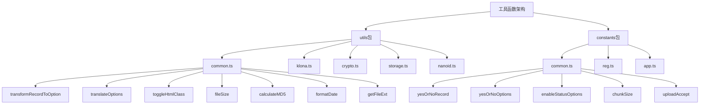
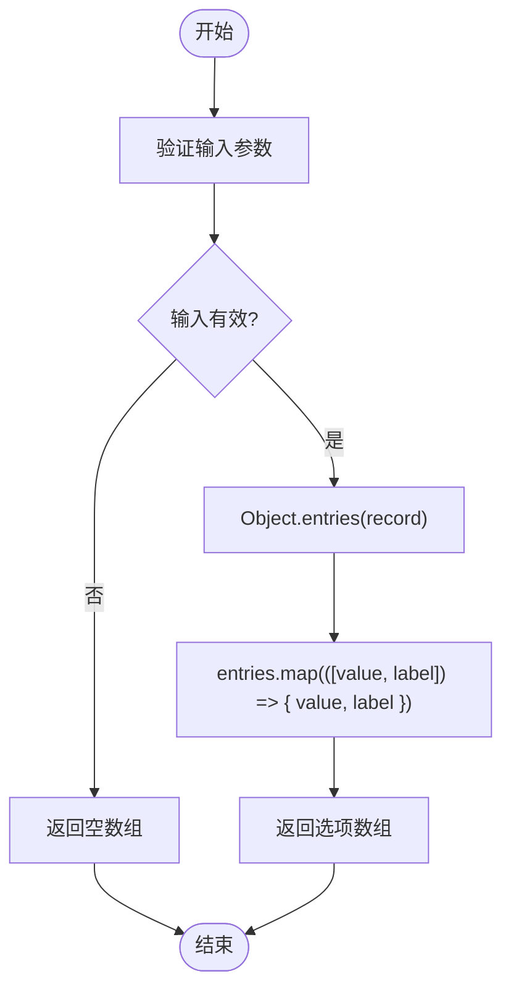
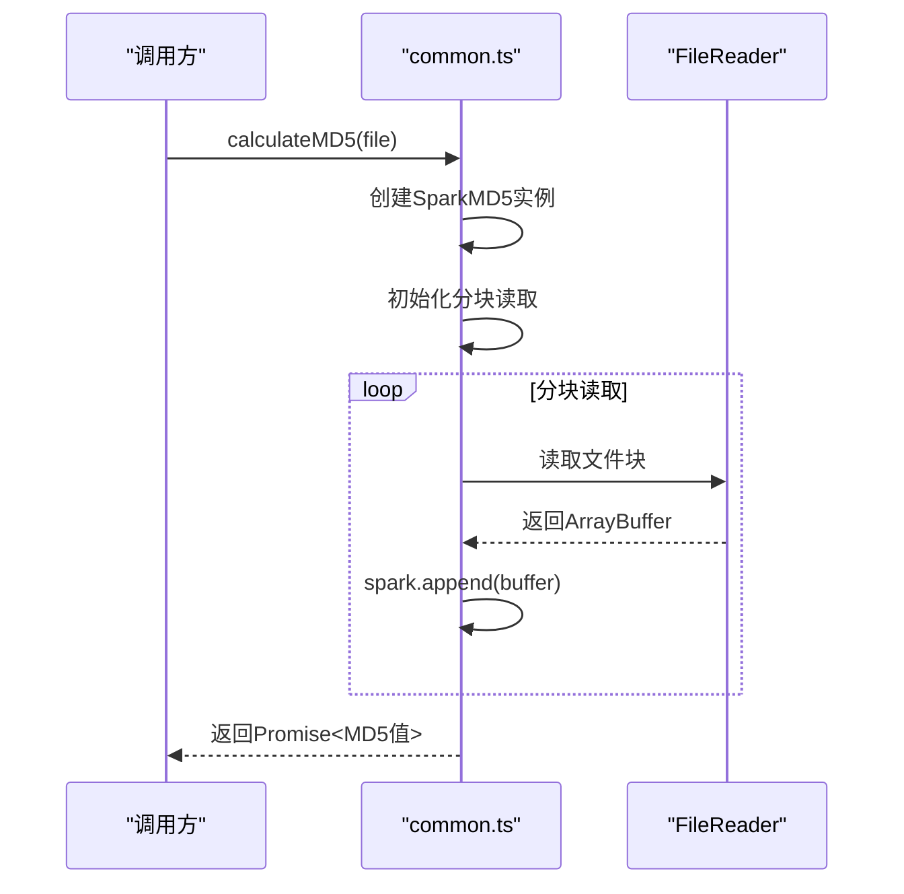
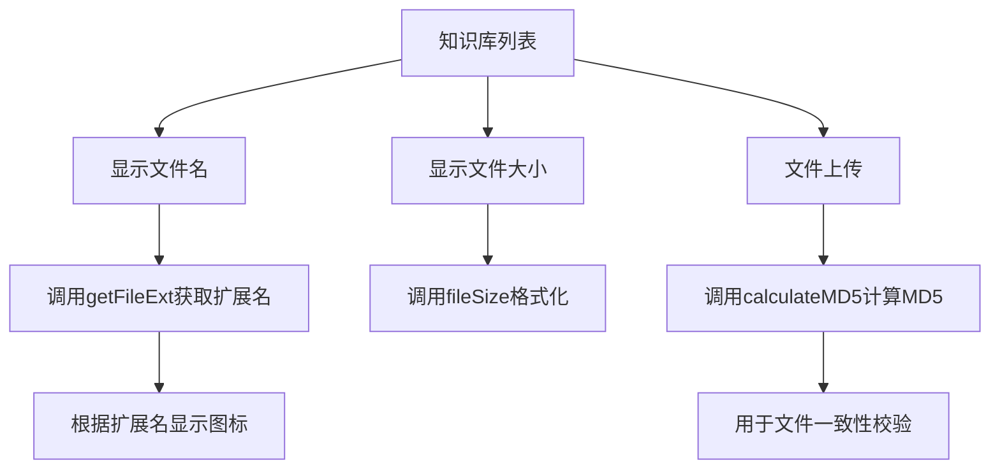

# 通用工具函数

<cite>
**本文档中引用的文件**  
- [common.ts](file://frontend/src/utils/common.ts)
- [constants/common.ts](file://frontend/src/constants/common.ts)
- [chat-message.vue](file://frontend/src/views/chat/modules/chat-message.vue)
- [knowledge-base/index.vue](file://frontend/src/views/knowledge-base/index.vue)
- [klona.ts](file://frontend/packages/utils/src/klona.ts)
- [package.json](file://frontend/package.json)
- [dayjs.ts](file://frontend/src/locales/dayjs.ts)
- [time.ts](file://frontend/build/config/time.ts)
- [dayjs.ts](file://frontend/src/plugins/dayjs.ts)
- [vite.config.ts](file://frontend/vite.config.ts)
</cite>

## 目录
1. [简介](#简介)
2. [项目结构](#项目结构)
3. [核心组件](#核心组件)
4. [架构概览](#架构概览)
5. [详细组件分析](#详细组件分析)
6. [依赖分析](#依赖分析)
7. [性能考量](#性能考量)
8. [故障排除指南](#故障排除指南)
9. [结论](#结论)

## 简介
本文档深入解析PaiSmart项目中封装的通用工具方法集，重点分析`frontend/src/utils/common.ts`文件中实现的高频使用函数。文档涵盖日期格式化、字符串处理、文件大小转换、MD5计算等实用功能的实现原理与边界条件处理。通过实际用例展示工具函数在UI组件中的调用模式，并分析其树摇优化配置以确保按需打包。文档还提供性能敏感场景下的使用建议与替代方案，为开发者提供全面的工具函数使用指南。

## 项目结构
PaiSmart项目采用前后端分离架构，前端部分位于`frontend`目录，采用Vue 3 + TypeScript技术栈。项目结构清晰，遵循功能模块化设计原则。

```mermaid
graph TB
subgraph "前端"
A[frontend]
A --> B[build]
A --> C[packages]
A --> D[src]
B --> B1[config]
B --> B2[plugins]
C --> C1[alova]
C --> C2[axios]
C --> C3[color]
C --> C4[hooks]
C --> C5[materials]
C --> C6[ofetch]
C --> C7[scripts]
C --> C8[uno-preset]
C --> C9[utils]
D --> D1[components]
D --> D2[constants]
D --> D3[enum]
D --> D4[store]
D --> D5[utils]
D --> D6[views]
end
subgraph "后端"
E[src]
E --> F[main]
E --> G[test]
end
A < --> E
```

**Diagram sources**
- [frontend](file://frontend)
- [src](file://src)

**Section sources**
- [frontend](file://frontend)
- [src](file://src)

## 核心组件
`frontend/src/utils/common.ts`文件封装了项目中高频使用的通用工具函数，这些函数在多个组件和模块中被广泛调用。核心功能包括：

- **transformRecordToOption**: 将记录对象转换为选项数组，用于表单下拉框等UI组件
- **translateOptions**: 对选项进行国际化翻译
- **toggleHtmlClass**: 切换HTML根元素的CSS类，用于主题切换
- **fileSize**: 文件大小格式化，自动转换为K、M、G单位
- **calculateMD5**: 异步计算文件MD5值，用于文件完整性校验
- **formatDate**: 日期格式化，基于dayjs库实现
- **getFileExt**: 获取文件扩展名

这些工具函数的设计遵循单一职责原则，接口简洁，易于在项目中复用。

**Section sources**
- [common.ts](file://frontend/src/utils/common.ts)

## 架构概览
PaiSmart项目的工具函数架构采用分层设计，将通用功能与业务逻辑分离。工具函数主要分布在`utils`和`constants`包中，通过ES模块系统进行组织和导出。



**Diagram sources**
- [common.ts](file://frontend/src/utils/common.ts)
- [constants/common.ts](file://frontend/src/constants/common.ts)

## 详细组件分析

### 工具函数实现分析

#### transformRecordToOption函数
该函数将记录对象转换为选项数组，常用于表单下拉框的数据源转换。



**Diagram sources**
- [common.ts](file://frontend/src/utils/common.ts#L10-L25)

#### formatDate函数
日期格式化函数基于dayjs库实现，支持自定义格式化字符串。

```typescript
export function formatDate(date: string | number | null | undefined, format = 'YYYY-MM-DD HH:mm:ss') {
  if (!date) return '';
  return dayjs(date).format(format);
}
```

该函数首先检查日期参数的有效性，若为空则返回空字符串，否则使用dayjs进行格式化。默认格式为"YYYY-MM-DD HH:mm:ss"，支持自定义格式化字符串。

**Section sources**
- [common.ts](file://frontend/src/utils/common.ts#L90-L94)

#### fileSize函数
文件大小格式化函数根据文件大小自动转换为合适的单位。

```typescript
export function fileSize(size: number) {
  if (size < 1024 * 1024) {
    return `${(size / 1024).toFixed(2)}K`;
  }
  if (size < 1024 * 1024 * 1024) {
    return `${(size / 1024 / 1024).toFixed(2)}M`;
  }
  return `${(size / 1024 / 1024 / 1024).toFixed(2)}G`;
}
```

该函数采用分段判断的方式，根据文件大小范围返回K、M或G单位的格式化字符串，保留两位小数。

**Section sources**
- [common.ts](file://frontend/src/utils/common.ts#L65-L75)

#### calculateMD5函数
异步计算文件MD5值，采用分块读取的方式处理大文件。



**Diagram sources**
- [common.ts](file://frontend/src/utils/common.ts#L77-L113)

### 实际应用场景分析

#### 聊天消息时间显示
在聊天界面中，`formatDate`函数用于显示消息时间戳。

```mermaid
flowchart TD
A[ChatMessage组件] --> B[接收消息对象]
B --> C[提取timestamp字段]
C --> D[调用formatDate函数]
D --> E[格式化为"YYYY-MM-DD HH:mm:ss"]
E --> F[显示在UI上]
```

**Diagram sources**
- [chat-message.vue](file://frontend/src/views/chat/modules/chat-message.vue#L121)

#### 知识库文件管理
在知识库模块中，多个工具函数协同工作实现文件管理功能。



**Diagram sources**
- [knowledge-base/index.vue](file://frontend/src/views/knowledge-base/index.vue)

### 对象深拷贝功能分析
项目通过`packages/utils/src/klona.ts`文件提供对象深拷贝功能。

```typescript
import { klona as jsonClone } from 'klona/json';

export { jsonClone };
```

该实现基于`klona`第三方库，提供了高性能的JSON安全深拷贝功能。`klona`库专门优化了JSON序列化兼容的对象拷贝，避免了`JSON.parse(JSON.stringify())`方法的诸多限制。

**Section sources**
- [klona.ts](file://frontend/packages/utils/src/klona.ts)

### 断言函数分析
项目中未直接实现`each`、`isEmpty`、`isNumber`等断言函数，而是通过依赖`lodash-es`库提供这些功能。

```json
{
  "dependencies": {
    "lodash-es": "4.17.21"
  }
}
```

`lodash-es`提供了模块化的ES版本，支持树摇优化，确保只打包实际使用的函数。这种设计避免了重复造轮子，同时保证了功能的稳定性和性能。

**Section sources**
- [package.json](file://frontend/package.json#L65-L67)

## 依赖分析
工具函数的依赖关系清晰，主要依赖第三方库和项目内部模块。

```mermaid
graph TD
A[common.ts] --> B[spark-md5]
A --> C[dayjs]
A --> D[@/locales]
E[klona.ts] --> F[klona/json]
G[dayjs.ts] --> H[dayjs]
I[vite.config.ts] --> J[unplugin-auto-import]
I --> K[unplugin-vue-components]
```

**Diagram sources**
- [common.ts](file://frontend/src/utils/common.ts)
- [klona.ts](file://frontend/packages/utils/src/klona.ts)
- [dayjs.ts](file://frontend/src/locales/dayjs.ts)
- [vite.config.ts](file://frontend/vite.config.ts)

## 性能考量
### 树摇优化配置
项目通过Vite配置确保工具函数的树摇优化，只打包实际使用的代码。

```typescript
// vite.config.ts
import AutoImport from 'unplugin-auto-import/vite';
import Components from 'unplugin-vue-components/vite';

export default defineConfig({
  plugins: [
    AutoImport({
      imports: ['vue', 'vue-router', 'pinia'],
      dts: 'src/typings/auto-imports.d.ts'
    }),
    Components({
      dts: 'src/typings/components.d.ts'
    })
  ]
});
```

`unplugin-auto-import`和`unplugin-vue-components`插件自动导入常用API，同时保持ES模块的静态分析能力，确保未使用的工具函数不会被打包。

### 性能敏感场景建议
1. **频繁调用的格式化函数**: 对于高频调用的`formatDate`等函数，考虑缓存结果避免重复计算
2. **大文件MD5计算**: `calculateMD5`采用分块读取，适合大文件处理，但会占用较多内存
3. **对象深拷贝**: `jsonClone`适用于JSON安全的对象，对于包含函数、Symbol等非序列化属性的对象不适用

## 故障排除指南
### 常见问题及解决方案
1. **日期显示异常**
   - 检查`dayjs`是否正确初始化
   - 确认时区配置是否正确
   - 验证输入日期格式是否符合预期

2. **文件大小显示不准确**
   - 检查输入参数是否为数字
   - 确认文件大小单位是否为字节

3. **MD5计算失败**
   - 检查文件读取权限
   - 验证文件对象是否有效
   - 确认`spark-md5`库是否正确加载

4. **国际化翻译失效**
   - 检查`$t`函数是否可用
   - 确认语言包是否正确加载
   - 验证翻译键是否存在

**Section sources**
- [common.ts](file://frontend/src/utils/common.ts)
- [dayjs.ts](file://frontend/src/locales/dayjs.ts)

## 结论
PaiSmart项目的通用工具函数集设计合理，功能实用，通过模块化组织和树摇优化确保了代码的可维护性和打包效率。`common.ts`文件中的工具函数覆盖了项目开发中的常见需求，包括数据转换、格式化、文件处理等。通过依赖`lodash-es`和`klona`等高质量第三方库，避免了重复实现通用功能，同时保证了性能和稳定性。建议在使用时注意性能敏感场景的优化，并遵循项目约定的调用模式，确保代码的一致性和可维护性。