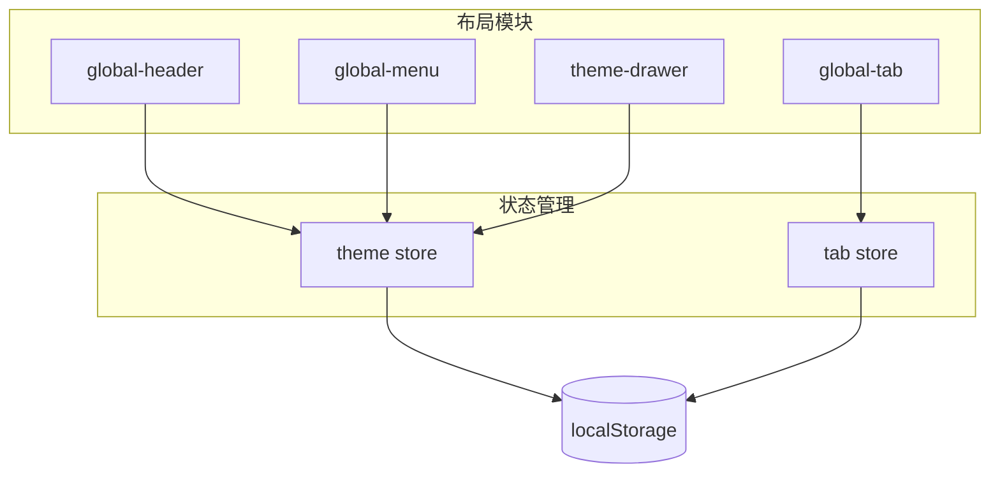
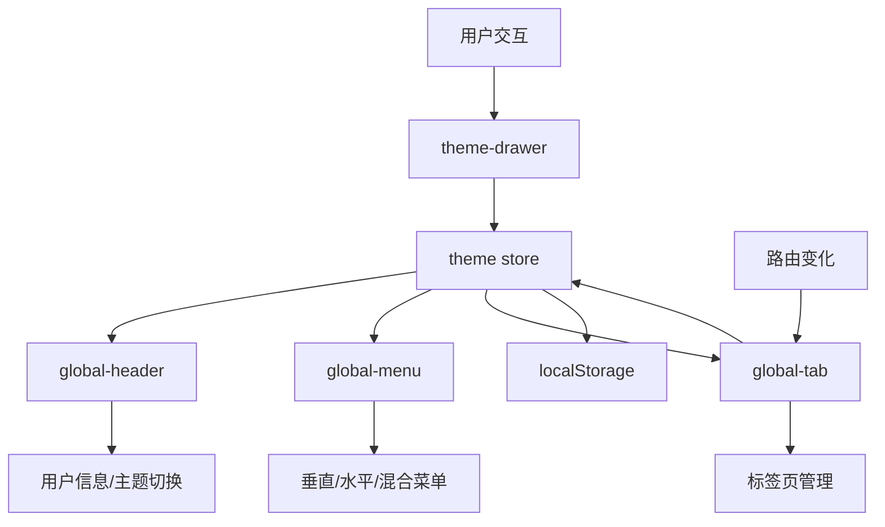
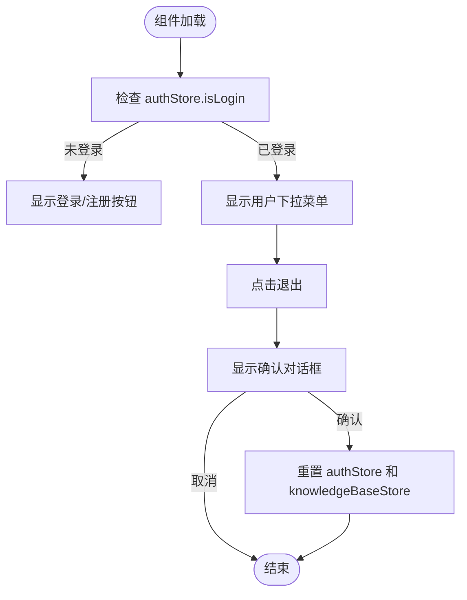
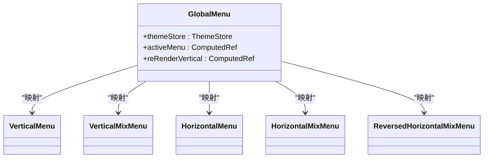
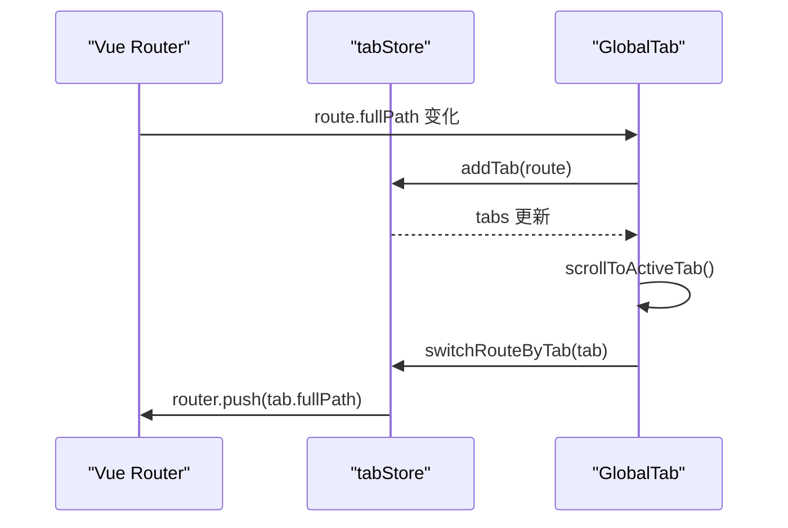
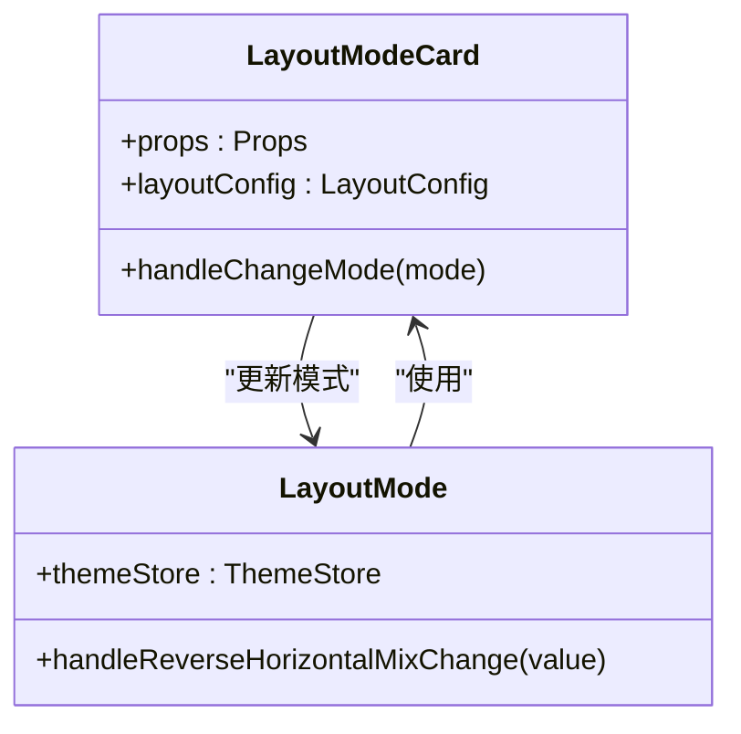
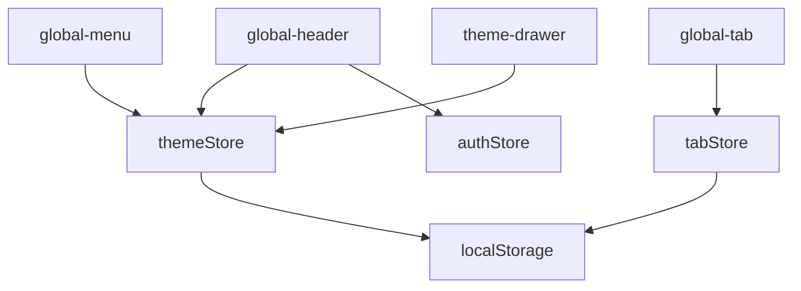

# 布局功能模块

<cite>
**本文档引用文件**  
- [global-header/index.vue](file://frontend/src/layouts/modules/global-header/index.vue#L1-L67)
- [global-header/components/user-avatar.vue](file://frontend/src/layouts/modules/global-header/components/user-avatar.vue#L1-L84)
- [global-header/components/theme-button.vue](file://frontend/src/layouts/modules/global-header/components/theme-button.vue#L1-L20)
- [global-menu/index.vue](file://frontend/src/layouts/modules/global-menu/index.vue#L1-L37)
- [global-menu/modules/vertical-menu.vue](file://frontend/src/layouts/modules/global-menu/modules/vertical-menu.vue#L1-L69)
- [global-menu/modules/horizontal-menu.vue](file://frontend/src/layouts/modules/global-menu/modules/horizontal-menu.vue#L1-L29)
- [global-tab/index.vue](file://frontend/src/layouts/modules/global-tab/index.vue#L1-L214)
- [global-tab/context-menu.vue](file://frontend/src/layouts/modules/global-tab/context-menu.vue#L1-L123)
- [theme-drawer/index.vue](file://frontend/src/layouts/modules/theme-drawer/index.vue#L1-L31)
- [theme-drawer/modules/layout-mode.vue](file://frontend/src/layouts/modules/theme-drawer/modules/layout-mode.vue#L1-L81)
- [theme-drawer/components/layout-mode-card.vue](file://frontend/src/layouts/modules/theme-drawer/components/layout-mode-card.vue#L1-L94)
- [store/modules/theme/index.ts](file://frontend/src/store/modules/theme/index.ts)
- [store/modules/tab/index.ts](file://frontend/src/store/modules/tab/index.ts)
</cite>

## 目录
1. [简介](#简介)
2. [项目结构](#项目结构)
3. [核心组件](#核心组件)
4. [架构概览](#架构概览)
5. [详细组件分析](#详细组件分析)
6. [依赖分析](#依赖分析)
7. [性能考量](#性能考量)
8. [故障排除指南](#故障排除指南)
9. [结论](#结论)

## 简介
本文档深入解析PaiSmart前端项目中的布局功能模块，涵盖全局头部、菜单、标签页及主题配置面板的核心实现。重点阐述用户信息展示、主题切换、多模式菜单渲染、标签页管理及配置持久化等关键功能，结合状态管理机制说明跨组件通信原理。

## 项目结构
布局功能模块主要由`global-header`、`global-menu`、`global-tab`和`theme-drawer`四大组件构成，分别负责头部区域、导航菜单、标签页和主题配置。这些组件位于`frontend/src/layouts/modules/`目录下，通过Vuex存储模块`theme`和`tab`进行状态管理，实现配置的全局同步与持久化。

**图示来源**  
- [global-header/index.vue](file://frontend/src/layouts/modules/global-header/index.vue#L1-L67)
- [global-menu/index.vue](file://frontend/src/layouts/modules/global-menu/index.vue#L1-L37)
- [global-tab/index.vue](file://frontend/src/layouts/modules/global-tab/index.vue#L1-L214)
- [theme-drawer/index.vue](file://frontend/src/layouts/modules/theme-drawer/index.vue#L1-L31)
- [store/modules/theme/index.ts](file://frontend/src/store/modules/theme/index.ts)
- [store/modules/tab/index.ts](file://frontend/src/store/modules/tab/index.ts)

**本节来源**  
- [frontend/src/layouts/modules/](file://frontend/src/layouts/modules/)
- [frontend/src/store/modules/](file://frontend/src/store/modules/)

## 核心组件
布局系统的核心组件包括`global-header`（全局头部）、`global-menu`（全局菜单）、`global-tab`（全局标签页）和`theme-drawer`（主题抽屉）。这些组件通过统一的状态管理(store)实现配置同步，并利用Teleport、BetterScroll等技术优化渲染与交互体验。

**本节来源**  
- [global-header/index.vue](file://frontend/src/layouts/modules/global-header/index.vue#L1-L67)
- [global-menu/index.vue](file://frontend/src/layouts/modules/global-menu/index.vue#L1-L37)
- [global-tab/index.vue](file://frontend/src/layouts/modules/global-tab/index.vue#L1-L214)
- [theme-drawer/index.vue](file://frontend/src/layouts/modules/theme-drawer/index.vue#L1-L31)

## 架构概览
整个布局系统采用模块化设计，各组件职责分明。`global-header`集成用户信息、搜索、国际化及主题切换功能；`global-menu`根据主题配置动态渲染不同布局模式的菜单；`global-tab`管理多标签页并提供上下文菜单；`theme-drawer`提供可视化配置界面，所有配置通过`theme`和`tab` store进行管理，并持久化至`localStorage`。

**图示来源**  
- [theme-drawer/index.vue](file://frontend/src/layouts/modules/theme-drawer/index.vue#L1-L31)
- [store/modules/theme/index.ts](file://frontend/src/store/modules/theme/index.ts)
- [store/modules/tab/index.ts](file://frontend/src/store/modules/tab/index.ts)
- [global-header/index.vue](file://frontend/src/layouts/modules/global-header/index.vue#L1-L67)
- [global-menu/index.vue](file://frontend/src/layouts/modules/global-menu/index.vue#L1-L37)
- [global-tab/index.vue](file://frontend/src/layouts/modules/global-tab/index.vue#L1-L214)

## 详细组件分析

### global-header 分析
`global-header`组件负责渲染页面顶部区域，集成用户信息展示与主题切换功能。

#### 用户信息展示
通过`user-avatar.vue`组件实现。该组件根据`authStore.isLogin`状态显示登录/注册按钮或用户下拉菜单。登录状态下，显示用户名和用户头像图标，并提供“退出登录”选项。退出时弹出确认对话框，确认后重置`authStore`和`knowledgeBaseStore`。

**图示来源**  
- [global-header/components/user-avatar.vue](file://frontend/src/layouts/modules/global-header/components/user-avatar.vue#L1-L84)

#### 主题切换功能
通过`theme-button.vue`和`ThemeSchemaSwitch`组件实现。`theme-button`点击后调用`appStore.openThemeDrawer`打开主题配置抽屉。`ThemeSchemaSwitch`组件绑定`themeStore.themeScheme`和`themeStore.darkMode`，点击时触发`themeStore.toggleThemeScheme`切换主题方案。

**本节来源**  
- [global-header/index.vue](file://frontend/src/layouts/modules/global-header/index.vue#L1-L67)
- [global-header/components/user-avatar.vue](file://frontend/src/layouts/modules/global-header/components/user-avatar.vue#L1-L84)
- [global-header/components/theme-button.vue](file://frontend/src/layouts/modules/global-header/components/theme-button.vue#L1-L20)

### global-menu 分析
`global-menu`组件根据`themeStore.layout.mode`的值动态渲染不同布局模式的菜单。

#### 菜单模式渲染机制
主组件`index.vue`通过计算属性`activeMenu`，根据`themeStore.layout.mode`的值映射到对应的菜单组件（`VerticalMenu`、`VerticalMixMenu`、`HorizontalMenu`、`HorizontalMixMenu`或`ReversedHorizontalMixMenu`），并使用`<component :is="activeMenu" />`进行动态渲染。

**图示来源**  
- [global-menu/index.vue](file://frontend/src/layouts/modules/global-menu/index.vue#L1-L37)

#### 状态同步策略
菜单组件通过`useThemeStore`和`useAppStore`获取主题和应用状态。例如，`vertical-menu.vue`监听`appStore.siderCollapse`和当前路由，动态更新菜单的折叠状态和展开的菜单项。`horizontal-menu.vue`则直接使用`routeStore.menus`作为菜单选项。

**本节来源**  
- [global-menu/index.vue](file://frontend/src/layouts/modules/global-menu/index.vue#L1-L37)
- [global-menu/modules/vertical-menu.vue](file://frontend/src/layouts/modules/global-menu/modules/vertical-menu.vue#L1-L69)
- [global-menu/modules/horizontal-menu.vue](file://frontend/src/layouts/modules/global-menu/modules/horizontal-menu.vue#L1-L29)

### global-tab 分析
`global-tab`组件实现多标签页管理，支持标签的添加、关闭、切换及上下文菜单操作。

#### 多标签页管理逻辑
组件在`init`函数中调用`tabStore.initTabStore(route)`初始化标签页。通过`watch`监听`route.fullPath`的变化，自动调用`tabStore.addTab(route)`添加新标签。标签的激活状态由`tabStore.activeTabId`控制，切换标签时调用`tabStore.switchRouteByTab(tab)`。

**图示来源**  
- [global-tab/index.vue](file://frontend/src/layouts/modules/global-tab/index.vue#L1-L214)

#### 上下文菜单交互
通过`context-menu.vue`组件实现。右键点击标签时，`handleContextMenu`函数阻止默认行为，设置`dropdown`的可见性、坐标和`tabId`。`context-menu`组件根据`tabId`和`disabledKeys`生成禁用项，并通过`dropdownAction`对象处理不同操作（如关闭当前、关闭其他等）。

**本节来源**  
- [global-tab/index.vue](file://frontend/src/layouts/modules/global-tab/index.vue#L1-L214)
- [global-tab/context-menu.vue](file://frontend/src/layouts/modules/global-tab/context-menu.vue#L1-L123)

### theme-drawer 分析
`theme-drawer`组件提供主题配置的可视化界面，包含暗色模式、布局模式、主题颜色、页面功能和配置操作等模块。

#### 配置面板实现
主组件`index.vue`使用`NDrawer`和`NDrawerContent`构建抽屉式面板，内容由多个模块组件（`DarkMode`、`LayoutMode`等）构成。抽屉的显示状态由`appStore.themeDrawerVisible`控制。

#### layout-mode-card 布局预览
`layout-mode-card.vue`组件通过`v-for`遍历`layoutConfig`对象，为每种布局模式（垂直、垂直混合、水平、水平混合）渲染一个卡片。卡片内使用`<slot :name="key">`插入预览图，点击卡片触发`handleChangeMode`，通过`emit('update:mode')`更新父组件的布局模式。

**图示来源**  
- [theme-drawer/components/layout-mode-card.vue](file://frontend/src/layouts/modules/theme-drawer/components/layout-mode-card.vue#L1-L94)
- [theme-drawer/modules/layout-mode.vue](file://frontend/src/layouts/modules/theme-drawer/modules/layout-mode.vue#L1-L81)

#### setting-item 配置项管理
`setting-item.vue`组件用于封装单个配置项，如开关、下拉框等，提供统一的标签和布局。在`layout-mode.vue`中，当布局模式为`horizontal-mix`时，显示“反转水平混合”开关，绑定`themeStore.layout.reverseHorizontalMix`，更新时调用`themeStore.setLayoutReverseHorizontalMix`。

#### 配置持久化流程
所有主题配置的修改最终都会调用`themeStore`中的相应方法（如`toggleThemeScheme`、`setLayoutMode`等）。这些方法在修改状态后，会自动将整个`themeStore`的状态序列化并保存到`localStorage`中。页面加载时，`themeStore`会从`localStorage`读取初始状态，实现配置的持久化。

**本节来源**  
- [theme-drawer/index.vue](file://frontend/src/layouts/modules/theme-drawer/index.vue#L1-L31)
- [theme-drawer/modules/layout-mode.vue](file://frontend/src/layouts/modules/theme-drawer/modules/layout-mode.vue#L1-L81)
- [theme-drawer/components/layout-mode-card.vue](file://frontend/src/layouts/modules/theme-drawer/components/layout-mode-card.vue#L1-L94)
- [store/modules/theme/index.ts](file://frontend/src/store/modules/theme/index.ts)

## 依赖分析
布局模块各组件高度依赖`store`模块中的`theme`和`tab` store进行状态管理。`themeStore`管理主题、布局、暗色模式等全局配置，`tabStore`管理标签页状态。两者均使用`pinia`，并通过`persist`插件实现`localStorage`持久化。组件间通过事件（如`update:mode`）和状态变更进行通信。

**图示来源**  
- [store/modules/theme/index.ts](file://frontend/src/store/modules/theme/index.ts)
- [store/modules/tab/index.ts](file://frontend/src/store/modules/tab/index.ts)
- [global-header/index.vue](file://frontend/src/layouts/modules/global-header/index.vue#L1-L67)
- [global-menu/index.vue](file://frontend/src/layouts/modules/global-menu/index.vue#L1-L37)
- [global-tab/index.vue](file://frontend/src/layouts/modules/global-tab/index.vue#L1-L214)
- [theme-drawer/index.vue](file://frontend/src/layouts/modules/theme-drawer/index.vue#L1-L31)

**本节来源**  
- [store/modules/theme/index.ts](file://frontend/src/store/modules/theme/index.ts)
- [store/modules/tab/index.ts](file://frontend/src/store/modules/tab/index.ts)

## 性能考量
- **动态组件**：`global-menu`使用`<component :is>`动态渲染，避免加载所有菜单组件。
- **虚拟滚动**：`global-tab`使用`BetterScroll`实现水平滚动，优化大量标签页的渲染性能。
- **计算属性**：广泛使用`computed`属性缓存计算结果，避免重复计算。
- **侦听器优化**：使用`watch`的`immediate`和`deep`选项精确控制侦听时机。

## 故障排除指南
- **菜单不显示**：检查`themeStore.layout.mode`是否正确，以及`GLOBAL_SIDER_MENU_ID`元素是否存在。
- **标签页不更新**：确保`route.fullPath`正确触发`watch`，检查`tabStore`的`addTab`逻辑。
- **配置不持久化**：确认`pinia`的`persist`插件已正确配置，检查`localStorage`的读写权限。
- **抽屉无法打开**：检查`appStore.themeDrawerVisible`的`setter`方法是否被正确调用。

**本节来源**  
- [global-menu/modules/vertical-menu.vue](file://frontend/src/layouts/modules/global-menu/modules/vertical-menu.vue#L1-L69)
- [global-tab/index.vue](file://frontend/src/layouts/modules/global-tab/index.vue#L1-L214)
- [store/modules/theme/index.ts](file://frontend/src/store/modules/theme/index.ts)
- [store/modules/tab/index.ts](file://frontend/src/store/modules/tab/index.ts)

## 结论
PaiSmart的布局功能模块设计精良，通过模块化组件和集中式状态管理，实现了灵活、可配置的用户界面。`global-header`、`global-menu`、`global-tab`和`theme-drawer`各司其职，协同工作，为用户提供流畅的交互体验。`theme`和`tab` store不仅管理状态，还实现了配置的持久化，确保用户偏好得以保存。整体架构清晰，易于维护和扩展。