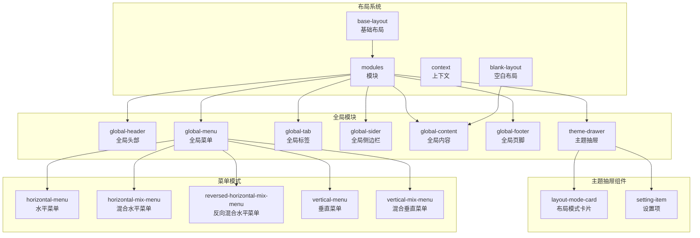
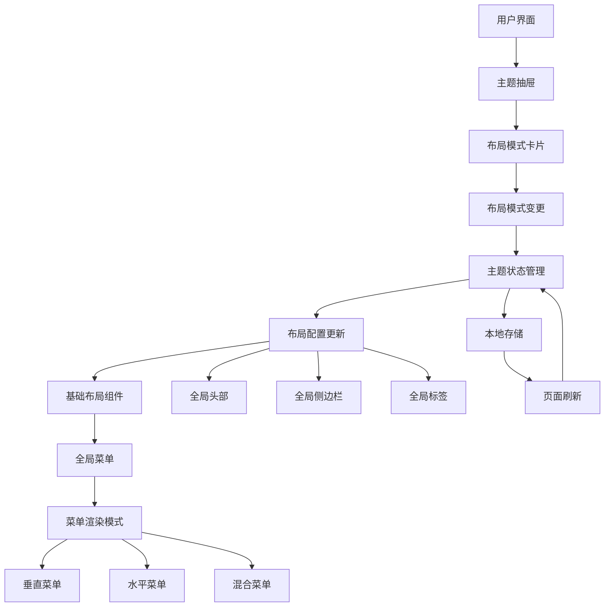
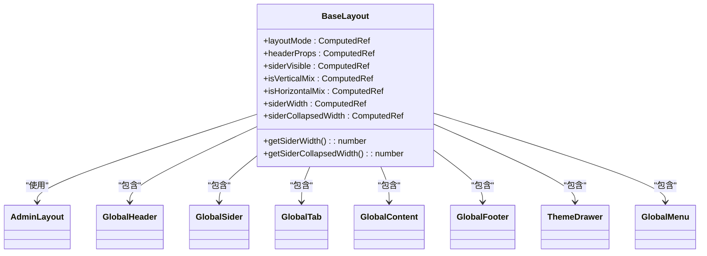
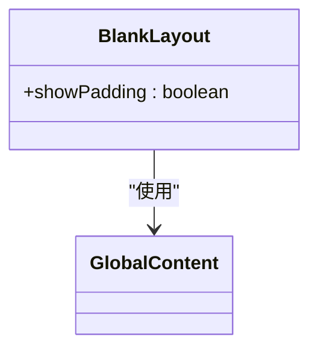
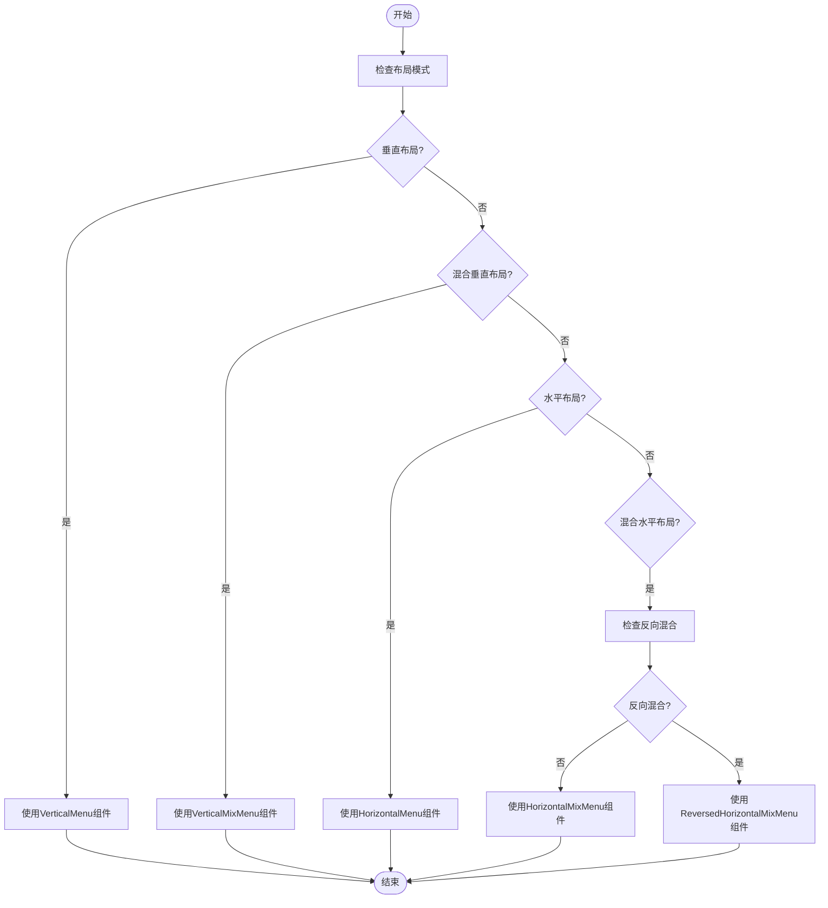
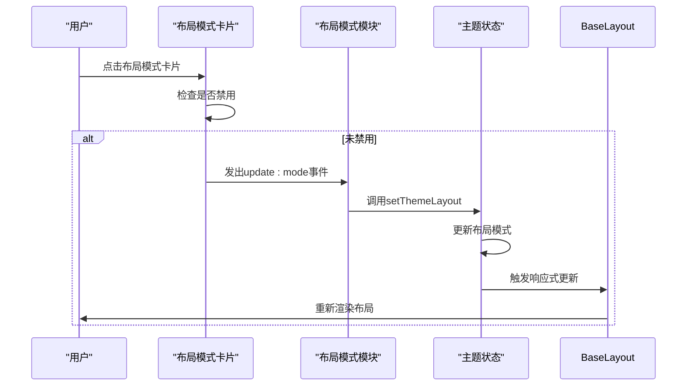
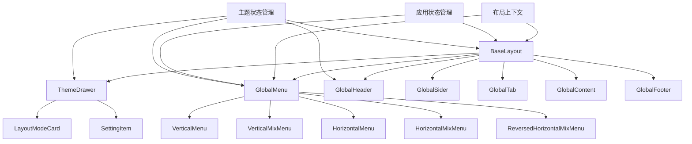

# 布局系统

<cite>
**本文档引用的文件**   
- [base-layout/index.vue](file://frontend/src/layouts/base-layout/index.vue)
- [blank-layout/index.vue](file://frontend/src/layouts/blank-layout/index.vue)
- [global-menu/index.vue](file://frontend/src/layouts/modules/global-menu/index.vue)
- [theme-drawer/modules/layout-mode.vue](file://frontend/src/layouts/modules/theme-drawer/modules/layout-mode.vue)
- [theme-drawer/components/layout-mode-card.vue](file://frontend/src/layouts/modules/theme-drawer/components/layout-mode-card.vue)
- [context/index.ts](file://frontend/src/layouts/context/index.ts)
- [theme/index.ts](file://frontend/src/store/modules/theme/index.ts)
- [app.d.ts](file://frontend/src/typings/app.d.ts)
- [storage.d.ts](file://frontend/src/typings/storage.d.ts)
- [app.ts](file://frontend/src/constants/app.ts)
</cite>

## 目录
1. [引言](#引言)
2. [项目结构](#项目结构)
3. [核心组件](#核心组件)
4. [架构概览](#架构概览)
5. [详细组件分析](#详细组件分析)
6. [依赖分析](#依赖分析)
7. [性能考虑](#性能考虑)
8. [故障排除指南](#故障排除指南)
9. [结论](#结论)

## 引言
本文档深入解析了PaiSmart项目中的多模式布局系统实现机制。该系统提供了灵活的界面布局能力，支持多种布局模式的动态切换和持久化配置。文档将详细阐述base-layout与blank-layout的应用场景与结构差异，分析global-header、global-menu、global-tab等模块化布局组件的通信机制与状态同步策略，以及horizontal-menu、vertical-mix-menu等菜单渲染模式的切换逻辑与响应式适配方案。

## 项目结构
布局系统主要由`frontend/src/layouts`目录下的组件构成，采用模块化设计，将不同功能的布局组件分离。系统核心包括基础布局、空白布局、全局模块和主题抽屉等部分。

**图示来源**
- [base-layout/index.vue](file://frontend/src/layouts/base-layout/index.vue)
- [blank-layout/index.vue](file://frontend/src/layouts/blank-layout/index.vue)
- [modules](file://frontend/src/layouts/modules)

**本节来源**
- [base-layout/index.vue](file://frontend/src/layouts/base-layout/index.vue)
- [blank-layout/index.vue](file://frontend/src/layouts/blank-layout/index.vue)

## 核心组件
布局系统的核心组件包括基础布局(base-layout)和空白布局(blank-layout)，它们分别适用于不同的应用场景。基础布局提供了完整的页面框架，包含头部、侧边栏、标签页等元素，而空白布局则仅包含内容区域，适用于登录页等特殊页面。

**本节来源**
- [base-layout/index.vue](file://frontend/src/layouts/base-layout/index.vue#L0-L148)
- [blank-layout/index.vue](file://frontend/src/layouts/blank-layout/index.vue#L0-L13)

## 架构概览
布局系统采用分层架构设计，通过状态管理(store)实现全局配置的统一管理，利用上下文(context)机制实现组件间的通信。系统通过主题抽屉(theme-drawer)提供可视化配置界面，用户可以实时调整布局模式并查看效果。

**图示来源**
- [theme-drawer/modules/layout-mode.vue](file://frontend/src/layouts/modules/theme-drawer/modules/layout-mode.vue)
- [theme/index.ts](file://frontend/src/store/modules/theme/index.ts)
- [base-layout/index.vue](file://frontend/src/layouts/base-layout/index.vue)

## 详细组件分析

### 基础布局与空白布局分析
基础布局(base-layout)和空白布局(blank-layout)是系统提供的两种主要布局模式，它们在结构和应用场景上有显著差异。

#### 基础布局实现
基础布局组件通过AdminLayout封装了完整的页面框架，集成了头部、侧边栏、标签页、内容区域和页脚等模块。它根据主题设置动态调整布局模式，支持垂直、水平、混合等多种布局方式。

**图示来源**
- [base-layout/index.vue](file://frontend/src/layouts/base-layout/index.vue#L0-L148)

**本节来源**
- [base-layout/index.vue](file://frontend/src/layouts/base-layout/index.vue#L0-L148)

#### 空白布局实现
空白布局(blank-layout)是一种极简布局，仅包含内容区域，适用于登录页、错误页等不需要复杂框架的页面。其结构简单，只引入了GlobalContent组件。

**图示来源**
- [blank-layout/index.vue](file://frontend/src/layouts/blank-layout/index.vue#L0-L13)

**本节来源**
- [blank-layout/index.vue](file://frontend/src/layouts/blank-layout/index.vue#L0-L13)

### 全局菜单组件分析
全局菜单组件(global-menu)是布局系统的核心组件之一，负责根据当前布局模式动态渲染不同类型的菜单。

#### 菜单渲染模式切换逻辑
全局菜单组件通过计算属性activeMenu根据当前主题设置的布局模式选择相应的菜单组件进行渲染。系统支持四种主要的菜单渲染模式：垂直菜单、混合垂直菜单、水平菜单和混合水平菜单。

**图示来源**
- [global-menu/index.vue](file://frontend/src/layouts/modules/global-menu/index.vue#L0-L37)

**本节来源**
- [global-menu/index.vue](file://frontend/src/layouts/modules/global-menu/index.vue#L0-L37)

### 布局配置可视化控制分析
主题抽屉(theme-drawer)中的布局模式模块提供了布局配置的可视化控制界面，用户可以通过点击卡片选择不同的布局模式。

#### 布局模式卡片组件
布局模式卡片组件(layout-mode-card)通过循环渲染四种布局模式的可视化卡片，用户点击卡片即可切换布局模式。组件使用禁用状态防止在移动端切换布局。

**图示来源**
- [layout-mode-card.vue](file://frontend/src/layouts/modules/theme-drawer/components/layout-mode-card.vue#L0-L94)
- [layout-mode.vue](file://frontend/src/layouts/modules/theme-drawer/modules/layout-mode.vue#L0-L81)

**本节来源**
- [layout-mode-card.vue](file://frontend/src/layouts/modules/theme-drawer/components/layout-mode-card.vue#L0-L94)
- [layout-mode.vue](file://frontend/src/layouts/modules/theme-drawer/modules/layout-mode.vue#L0-L81)

## 依赖分析
布局系统各组件之间存在明确的依赖关系，通过状态管理和上下文机制实现数据共享和通信。

**图示来源**
- [theme/index.ts](file://frontend/src/store/modules/theme/index.ts)
- [app/index.ts](file://frontend/src/store/modules/app/index.ts)
- [context/index.ts](file://frontend/src/layouts/context/index.ts)
- [base-layout/index.vue](file://frontend/src/layouts/base-layout/index.vue)

**本节来源**
- [theme/index.ts](file://frontend/src/store/modules/theme/index.ts#L0-L221)
- [app/index.ts](file://frontend/src/store/modules/app/index.ts#L79-L132)
- [context/index.ts](file://frontend/src/layouts/context/index.ts#L0-L83)

## 性能考虑
布局系统在设计时考虑了性能优化，通过以下机制确保良好的用户体验：

1. **按需加载**：菜单组件使用defineAsyncComponent实现异步加载，减少初始加载时间
2. **响应式更新**：使用computed属性和watch监听器，确保只有相关组件在状态变化时重新渲染
3. **缓存机制**：主题设置在页面关闭或刷新时自动缓存到本地存储，避免重复计算
4. **移动端优化**：在移动端自动切换为垂直布局，并保存切换前的布局设置，返回桌面端时恢复

## 故障排除指南
### 布局模式无法切换
**问题描述**：点击布局模式卡片无反应
**可能原因**：
1. 组件处于禁用状态（移动端）
2. 事件绑定错误
3. 状态管理更新失败

**解决方案**：
1. 检查`layout-mode-card.vue`中的disabled属性
2. 确认`handleChangeMode`函数正确触发`update:mode`事件
3. 验证`themeStore.setThemeLayout`方法是否正确执行

### 菜单渲染异常
**问题描述**：菜单显示不正确或样式错乱
**可能原因**：
1. 布局模式与菜单组件不匹配
2. 响应式数据计算错误
3. 样式冲突

**解决方案**：
1. 检查`global-menu/index.vue`中activeMenu计算属性的逻辑
2. 验证`themeStore.layout.mode`的值是否正确
3. 检查CSS作用域和样式优先级

**本节来源**
- [theme-drawer/components/layout-mode-card.vue](file://frontend/src/layouts/modules/theme-drawer/components/layout-mode-card.vue#L0-L94)
- [theme-drawer/modules/layout-mode.vue](file://frontend/src/layouts/modules/theme-drawer/modules/layout-mode.vue#L0-L81)
- [theme/index.ts](file://frontend/src/store/modules/theme/index.ts#L0-L221)

## 结论
PaiSmart项目的布局系统采用模块化设计，提供了灵活的多模式布局能力。系统通过基础布局和空白布局满足不同页面的需求，利用全局组件实现一致的界面风格。主题抽屉提供了直观的可视化配置界面，用户可以轻松调整布局模式。状态管理机制确保了配置的持久化和跨组件同步，上下文机制实现了复杂组件间的高效通信。整体架构清晰，扩展性强，为后续新增布局模式提供了良好的基础。