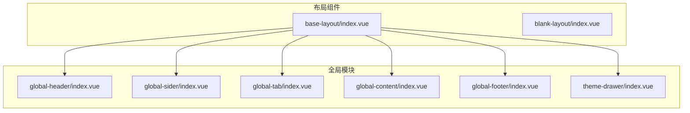
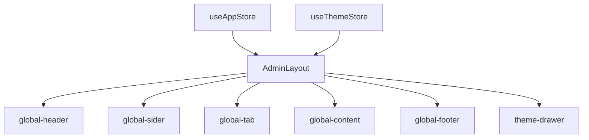
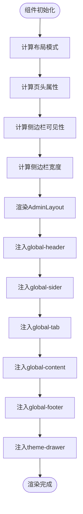
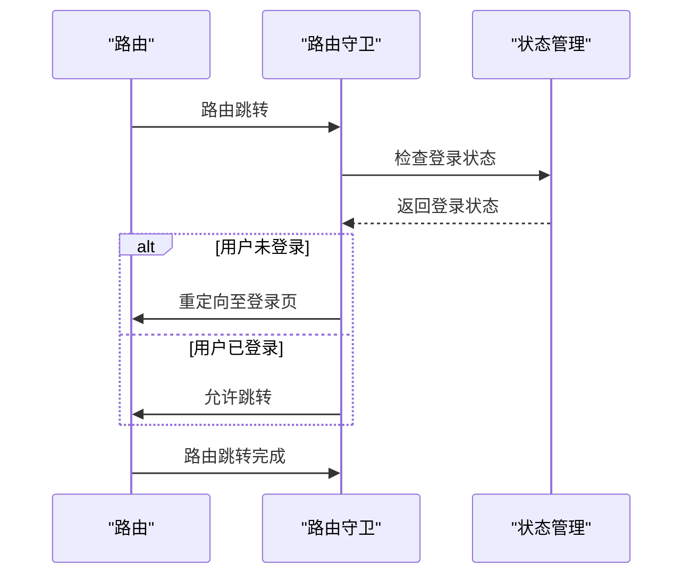

# 核心布局实现

<cite>
**本文档引用的文件**   
- [base-layout/index.vue](file://frontend/src/layouts/base-layout/index.vue)
- [blank-layout/index.vue](file://frontend/src/layouts/blank-layout/index.vue)
- [global-header/index.vue](file://frontend/src/layouts/modules/global-header/index.vue)
- [global-sider/index.vue](file://frontend/src/layouts/modules/global-sider/index.vue)
- [global-tab/index.vue](file://frontend/src/layouts/modules/global-tab/index.vue)
- [global-content/index.vue](file://frontend/src/layouts/modules/global-content/index.vue)
- [global-footer/index.vue](file://frontend/src/layouts/modules/global-footer/index.vue)
- [theme-drawer/index.vue](file://frontend/src/layouts/modules/theme-drawer/index.vue)
- [route.ts](file://frontend/src/router/guard/route.ts)
- [transform.ts](file://frontend/src/router/elegant/transform.ts)
</cite>

## 目录
1. [引言](#引言)
2. [项目结构](#项目结构)
3. [核心组件](#核心组件)
4. [架构概述](#架构概述)
5. [详细组件分析](#详细组件分析)
6. [依赖分析](#依赖分析)
7. [性能考虑](#性能考虑)
8. [故障排除指南](#故障排除指南)
9. [结论](#结论)

## 引言
本文档深入分析了PaiSmart项目中的两种核心布局组件：`base-layout`与`blank-layout`。前者作为企业级应用的标准布局，集成了全局导航、侧边栏、页头、标签页等模块化组件；后者则采用极简设计，适用于登录页、错误页等特殊路由场景。文档将详细阐述两者的结构设计、适用场景、切换机制及其实现细节。

## 项目结构
PaiSmart项目的前端布局组件位于`frontend/src/layouts`目录下，主要包含`base-layout`和`blank-layout`两个子目录。每个布局目录下均包含一个`index.vue`文件，作为布局组件的入口。此外，`modules`目录下存放了多个可复用的全局模块组件，如`global-header`、`global-sider`等，这些组件被`base-layout`所集成。

**图示来源**
- [base-layout/index.vue](file://frontend/src/layouts/base-layout/index.vue)
- [global-header/index.vue](file://frontend/src/layouts/modules/global-header/index.vue)
- [global-sider/index.vue](file://frontend/src/layouts/modules/global-sider/index.vue)
- [global-tab/index.vue](file://frontend/src/layouts/modules/global-tab/index.vue)
- [global-content/index.vue](file://frontend/src/layouts/modules/global-content/index.vue)
- [global-footer/index.vue](file://frontend/src/layouts/modules/global-footer/index.vue)
- [theme-drawer/index.vue](file://frontend/src/layouts/modules/theme-drawer/index.vue)

**本节来源**
- [base-layout/index.vue](file://frontend/src/layouts/base-layout/index.vue)
- [blank-layout/index.vue](file://frontend/src/layouts/blank-layout/index.vue)

## 核心组件
`base-layout`和`blank-layout`是PaiSmart项目中两种截然不同的布局策略。`base-layout`通过集成多个全局模块组件，构建了一个功能完备的企业级应用界面框架；而`blank-layout`则通过最少的代码，提供了一个纯净的页面容器，适用于不需要复杂布局的特殊页面。

**本节来源**
- [base-layout/index.vue](file://frontend/src/layouts/base-layout/index.vue)
- [blank-layout/index.vue](file://frontend/src/layouts/blank-layout/index.vue)

## 架构概述
`base-layout`的架构设计遵循模块化和可配置的原则。它通过`AdminLayout`组件作为基础容器，将`global-header`、`global-sider`、`global-tab`、`global-content`、`global-footer`和`theme-drawer`等模块组件以插槽（slot）的形式注入，实现了布局的灵活组合。同时，通过`useAppStore`和`useThemeStore`等状态管理工具，实现了布局的动态配置和响应式调整。

**图示来源**
- [base-layout/index.vue](file://frontend/src/layouts/base-layout/index.vue)

## 详细组件分析

### base-layout 分析
`base-layout`组件通过`defineAsyncComponent`异步加载`GlobalMenu`组件，以优化首屏加载性能。它通过计算属性`layoutMode`、`headerProps`、`siderVisible`等，根据`themeStore`中的配置动态调整布局模式、页头显示、侧边栏可见性等。`siderWidth`和`siderCollapsedWidth`函数则根据布局模式和菜单状态计算侧边栏的宽度，确保了布局的灵活性和响应式特性。

**图示来源**
- [base-layout/index.vue](file://frontend/src/layouts/base-layout/index.vue)

**本节来源**
- [base-layout/index.vue](file://frontend/src/layouts/base-layout/index.vue)

### blank-layout 分析
`blank-layout`的设计极为简洁，仅包含一个`GlobalContent`组件，并通过`show-padding="false"`属性关闭了内容区域的内边距。这种设计使其非常适合用于登录页、错误页等需要全屏展示内容的场景。由于其极简的结构，`blank-layout`的加载性能和渲染效率都非常高。

**本节来源**
- [blank-layout/index.vue](file://frontend/src/layouts/blank-layout/index.vue)

### 全局模块组件分析

#### 全局页头 (global-header)
`global-header`组件集成了搜索框、全屏切换、语言切换、主题切换、用户头像等常用功能。它通过`props`接收`showMenuToggler`等配置，以适应不同的布局需求。组件内部使用`useFullscreen`等VueUse工具，实现了全屏切换功能。

**本节来源**
- [global-header/index.vue](file://frontend/src/layouts/modules/global-header/index.vue)

#### 全局侧边栏 (global-sider)
`global-sider`组件主要负责展示`GlobalLogo`和侧边栏菜单。它通过`computed`属性`isVerticalMix`、`isHorizontalMix`等判断当前布局模式，并据此决定是否显示Logo和调整菜单包装器的样式类。

**本节来源**
- [global-sider/index.vue](file://frontend/src/layouts/modules/global-sider/index.vue)

#### 全局标签页 (global-tab)
`global-tab`组件实现了标签页的滚动、激活、关闭、右键菜单等功能。它使用`BetterScroll`组件实现了水平滚动，并通过`watch`监听路由变化，自动添加新的标签页。`scrollToActiveTab`函数确保了当前激活的标签页始终位于可视区域内。

**本节来源**
- [global-tab/index.vue](file://frontend/src/layouts/modules/global-tab/index.vue)

#### 全局内容 (global-content)
`global-content`组件是路由视图的容器，它使用`<RouterView>`和`<KeepAlive>`实现了页面的缓存和过渡动画。`transitionName`计算属性根据`themeStore`中的配置动态选择过渡动画，`resetScroll`函数则在页面切换后重置滚动位置。

**本节来源**
- [global-content/index.vue](file://frontend/src/layouts/modules/global-content/index.vue)

#### 全局页脚 (global-footer)
`global-footer`组件仅包含一个简单的版权信息链接，其设计极为简洁。

**本节来源**
- [global-footer/index.vue](file://frontend/src/layouts/modules/global-footer/index.vue)

#### 主题抽屉 (theme-drawer)
`theme-drawer`组件通过`NDrawer`实现了主题配置的抽屉式弹窗。它集成了`DarkMode`、`LayoutMode`、`ThemeColor`、`PageFun`、`ConfigOperation`等多个子模块，提供了全面的主题配置功能。

**本节来源**
- [theme-drawer/index.vue](file://frontend/src/layouts/modules/theme-drawer/index.vue)

## 依赖分析
`base-layout`与`blank-layout`之间的切换主要由路由守卫控制。`route.ts`中的`createRouteGuard`函数通过检查路由的`meta`信息和用户的登录状态，决定使用哪种布局。例如，当用户未登录时，会自动跳转到使用`blank-layout`的登录页；当用户已登录时，则使用`base-layout`展示主应用界面。

**图示来源**
- [route.ts](file://frontend/src/router/guard/route.ts)

**本节来源**
- [route.ts](file://frontend/src/router/guard/route.ts)

## 性能考虑
`base-layout`通过异步加载`GlobalMenu`组件，有效减少了首屏加载时间。`global-tab`组件使用`BetterScroll`实现了高性能的水平滚动，避免了原生滚动可能带来的性能问题。`global-content`组件通过`<KeepAlive>`缓存页面状态，减少了重复渲染的开销。

## 故障排除指南
- **问题：侧边栏宽度计算错误**
  - **原因**：`siderWidth`函数中的逻辑可能未正确处理`reverseHorizontalMix`等特殊情况。
  - **解决方案**：检查`themeStore.layout.reverseHorizontalMix`和`isActiveFirstLevelMenuHasChildren.value`的值，确保计算逻辑正确。
- **问题：标签页无法滚动到激活项**
  - **原因**：`scrollToActiveTab`函数可能因DOM未完全渲染而失败。
  - **解决方案**：确保在`nextTick`后执行滚动操作，并检查`bsScroll.value.instance`是否有效。

**本节来源**
- [base-layout/index.vue](file://frontend/src/layouts/base-layout/index.vue)
- [global-tab/index.vue](file://frontend/src/layouts/modules/global-tab/index.vue)

## 结论
`base-layout`和`blank-layout`的设计体现了PaiSmart项目在布局策略上的灵活性和可扩展性。`base-layout`通过模块化集成，构建了一个功能强大且可配置的企业级应用框架；`blank-layout`则通过极简设计，为特殊页面提供了高效的解决方案。两者的协同工作，确保了应用在不同场景下的最佳用户体验。