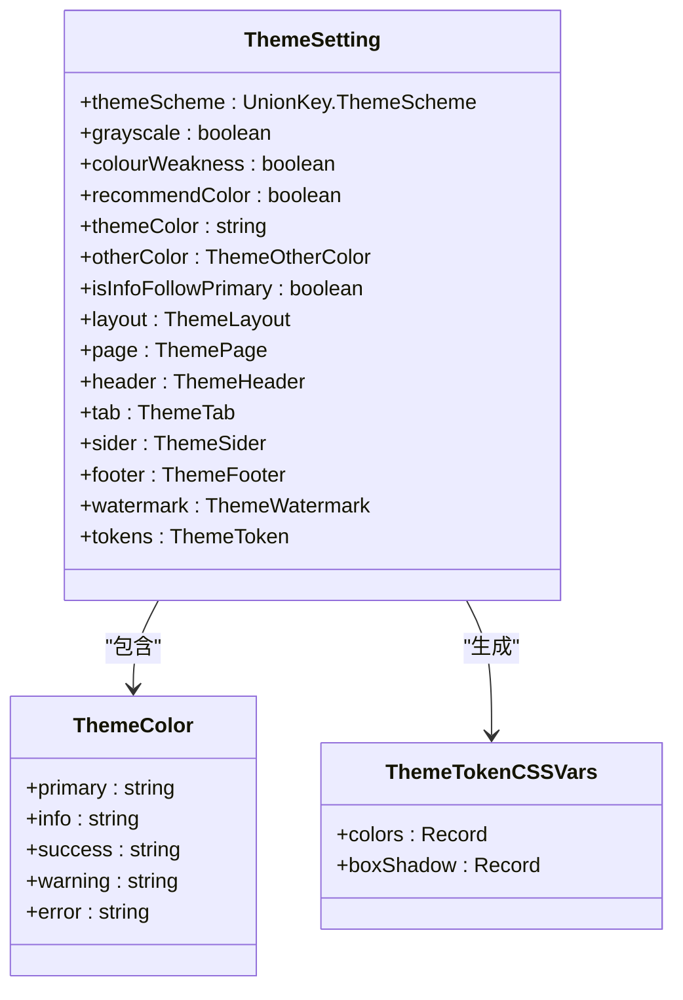
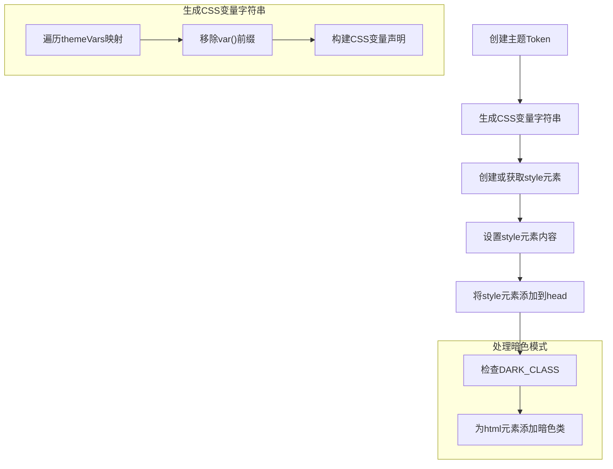
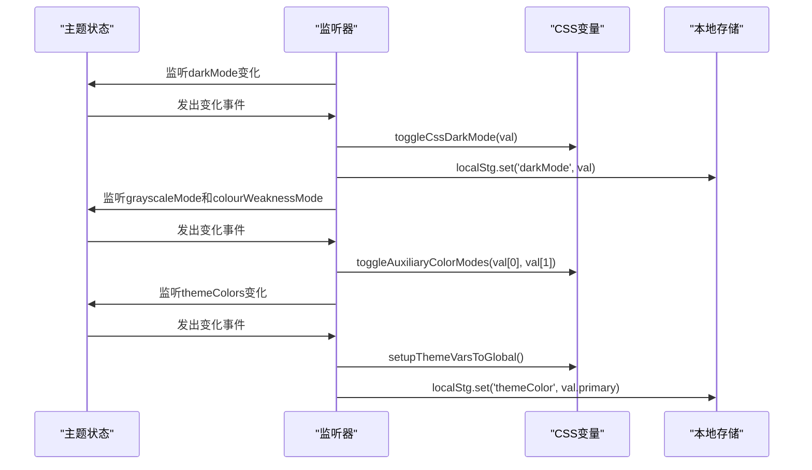

# 主题状态模块

<cite>
**本文档引用的文件**   
- [index.ts](file://frontend/src/store/modules/theme/index.ts)
- [shared.ts](file://frontend/src/store/modules/theme/shared.ts)
- [settings.ts](file://frontend/src/theme/settings.ts)
- [vars.ts](file://frontend/src/theme/vars.ts)
- [theme-schema-switch.vue](file://frontend/src/components/common/theme-schema-switch.vue)
- [index.vue](file://frontend/src/layouts/modules/theme-drawer/index.vue)
- [dark-mode.vue](file://frontend/src/layouts/modules/theme-drawer/modules/dark-mode.vue)
- [theme-color.vue](file://frontend/src/layouts/modules/theme-drawer/modules/theme-color.vue)
</cite>

## 目录
1. [主题状态管理概述](#主题状态管理概述)
2. [核心状态字段定义与持久化](#核心状态字段定义与持久化)
3. [主题处理工具函数分析](#主题处理工具函数分析)
4. [动态主题切换实现流程](#动态主题切换实现流程)
5. [组件交互与UI实现](#组件交互与ui实现)

## 主题状态管理概述

主题状态模块是前端应用中负责管理UI外观的核心模块，通过Pinia状态管理库实现对主题颜色、暗色模式、布局变量等UI状态的集中管理。该模块采用模块化设计，将状态定义、工具函数和UI组件分离，确保了代码的可维护性和可扩展性。

**Section sources**
- [index.ts](file://frontend/src/store/modules/theme/index.ts#L1-L221)

## 核心状态字段定义与持久化

### 主题设置初始化

主题状态的初始配置在`settings.ts`文件中定义，包含主题方案、颜色配置、布局模式等完整设置：

```typescript
export const themeSettings: App.Theme.ThemeSetting = {
  themeScheme: 'auto',
  grayscale: false,
  colourWeakness: false,
  recommendColor: true,
  themeColor: '#646cff',
  otherColor: { 
    info: '#2080f0', 
    success: '#52c41a', 
    warning: '#faad14', 
    error: '#f5222d' 
  },
  isInfoFollowPrimary: true,
  layout: { mode: 'vertical', scrollMode: 'content' },
  // ...其他配置
};
```

### 状态字段定义

在`index.ts`中，通过`defineStore`创建主题状态仓库，核心字段包括：

- **primaryColor**: 主题主色，对应`themeColor`字段
- **darkMode**: 暗色模式状态，基于`themeScheme`和系统偏好计算
- **themeVars**: 主题变量，通过计算属性动态生成



**Diagram sources**
- [settings.ts](file://frontend/src/theme/settings.ts#L1-L50)
- [index.ts](file://frontend/src/store/modules/theme/index.ts#L1-L221)

### 持久化策略

主题状态采用以下持久化策略：

1. **生产环境持久化**：在生产环境中，主题设置会存储在localStorage中
2. **版本覆盖机制**：通过`overrideThemeSettings`实现新版本发布时的主题配置更新
3. **页面关闭时缓存**：监听`beforeunload`事件，在页面关闭或刷新时缓存设置

```typescript
function cacheThemeSettings() {
  const isProd = import.meta.env.PROD;
  if (!isProd) return;
  localStg.set('themeSettings', settings.value);
}

useEventListener(window, 'beforeunload', () => {
  cacheThemeSettings();
});
```

**Section sources**
- [index.ts](file://frontend/src/store/modules/theme/index.ts#L137-L198)
- [shared.ts](file://frontend/src/store/modules/theme/shared.ts#L1-L32)

## 主题处理工具函数分析

### CSS变量注入机制

`shared.ts`中的`addThemeVarsToGlobal`函数负责将主题变量注入全局CSS：



**Diagram sources**
- [shared.ts](file://frontend/src/store/modules/theme/shared.ts#L146-L203)

### 主题切换动画与辅助功能

#### 暗色模式切换

```typescript
export function toggleCssDarkMode(darkMode = false) {
  const { add, remove } = toggleHtmlClass(DARK_CLASS);
  if (darkMode) {
    add();
  } else {
    remove();
  }
}
```

#### 辅助色彩模式

```typescript
export function toggleAuxiliaryColorModes(grayscaleMode = false, colourWeakness = false) {
  const htmlElement = document.documentElement;
  htmlElement.style.filter = [
    grayscaleMode ? 'grayscale(100%)' : '', 
    colourWeakness ? 'invert(80%)' : ''
  ].filter(Boolean).join(' ');
}
```

### 主题颜色生成

`createThemeToken`函数根据主题颜色生成完整的调色板：

```typescript
function createThemePaletteColors(colors: App.Theme.ThemeColor, recommended = false) {
  const colorKeys = Object.keys(colors) as App.Theme.ThemeColorKey[];
  const colorPaletteVar = {} as App.Theme.ThemePaletteColor;
  
  colorKeys.forEach(key => {
    const colorMap = getColorPalette(colors[key], recommended);
    colorPaletteVar[key] = colorMap.get(500)!;
    
    colorMap.forEach((hex, number) => {
      colorPaletteVar[`${key}-${number}`] = hex;
    });
  });
  
  return colorPaletteVar;
}
```

**Section sources**
- [shared.ts](file://frontend/src/store/modules/theme/shared.ts#L146-L258)

## 动态主题切换实现流程

### 状态监听与响应

主题状态通过watch监听器实现自动响应：



**Diagram sources**
- [index.ts](file://frontend/src/store/modules/theme/index.ts#L137-L198)

### 主题方案切换

`toggleThemeScheme`函数实现主题方案的循环切换：

```typescript
function toggleThemeScheme() {
  const themeSchemes: UnionKey.ThemeScheme[] = ['light', 'dark', 'auto'];
  const index = themeSchemes.findIndex(item => item === settings.value.themeScheme);
  const nextIndex = index === themeSchemes.length - 1 ? 0 : index + 1;
  const nextThemeScheme = themeSchemes[nextIndex];
  setThemeScheme(nextThemeScheme);
}
```

## 组件交互与UI实现

### 主题抽屉组件

`theme-drawer`作为主题设置的UI容器，整合了各个主题设置模块：

```vue
<template>
  <NDrawer v-model:show="appStore.themeDrawerVisible" width="360">
    <NDrawerContent title="主题设置">
      <DarkMode />
      <LayoutMode />
      <ThemeColor />
      <PageFun />
      <template #footer>
        <ConfigOperation />
      </template>
    </NDrawerContent>
  </NDrawer>
</template>
```

**Section sources**
- [index.vue](file://frontend/src/layouts/modules/theme-drawer/index.vue#L1-L32)

### 主题颜色选择器

`theme-color.vue`模块实现主题颜色的可视化选择：

```vue
<template>
  <SettingItem v-for="(_, key) in themeStore.themeColors" :key="key">
    <NColorPicker
      :value="themeStore.themeColors[key]"
      :disabled="key === 'info' && themeStore.isInfoFollowPrimary"
      :swatches="swatches"
      @update:value="handleUpdateColor($event, key)"
    />
  </SettingItem>
</template>

<script setup>
function handleUpdateColor(color: string, key: App.Theme.ThemeColorKey) {
  themeStore.updateThemeColors(key, color);
}
</script>
```

### 暗色模式切换器

`dark-mode.vue`模块提供暗色模式的多种切换方式：

```vue
<template>
  <NTabs type="segment" :value="themeStore.themeScheme" @update:value="handleSegmentChange">
    <NTab v-for="(_, key) in themeSchemaRecord" :key="key" :name="key">
      <SvgIcon :icon="icons[key]" />
    </NTab>
  </NTabs>
  <SettingItem label="灰度模式">
    <NSwitch :value="themeStore.grayscale" @update:value="handleGrayscaleChange" />
  </SettingItem>
  <SettingItem label="色弱模式">
    <NSwitch :value="themeStore.colourWeakness" @update:value="handleColourWeaknessChange" />
  </SettingItem>
</template>
```

**Section sources**
- [dark-mode.vue](file://frontend/src/layouts/modules/theme-drawer/modules/dark-mode.vue#L1-L76)
- [theme-color.vue](file://frontend/src/layouts/modules/theme-drawer/modules/theme-color.vue#L1-L78)

### 主题方案切换按钮

`theme-schema-switch.vue`组件提供快速切换主题的按钮：

```vue
<template>
  <ButtonIcon
    :icon="icon"
    :tooltip-content="tooltipContent"
    @click="handleSwitch"
  />
</template>

<script setup>
function handleSwitch() {
  emit('switch');
}
</script>
```

**Section sources**
- [theme-schema-switch.vue](file://frontend/src/components/common/theme-schema-switch.vue#L1-L56)