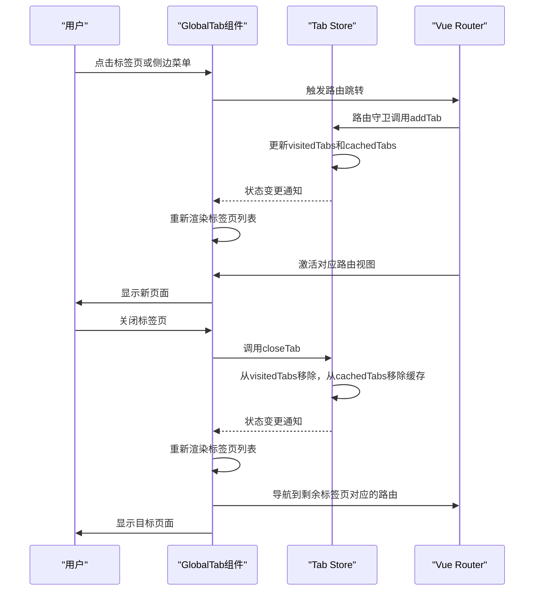
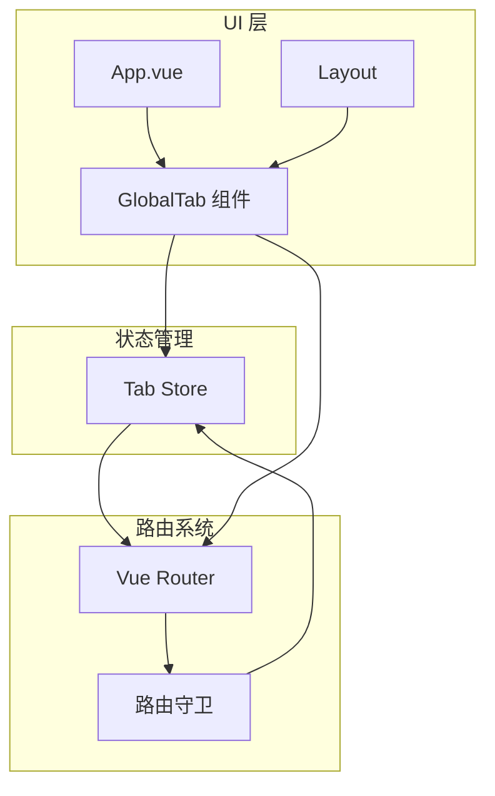

# 标签页状态模块

<cite>
**本文档引用的文件**  
（未找到与标签页状态管理相关的具体源文件）
</cite>

## 目录
1. [介绍](#介绍)
2. [项目结构](#项目结构)
3. [核心组件](#核心组件)
4. [架构概述](#架构概述)
5. [详细组件分析](#详细组件分析)
6. [依赖分析](#依赖分析)
7. [性能考虑](#性能考虑)
8. [故障排除指南](#故障排除指南)
9. [结论](#结论)

## 介绍
本文档旨在深入解析前端系统中多标签页的状态管理机制，重点分析标签页的打开、关闭、切换、缓存等核心功能。目标是阐明状态管理模块中 `visitedTabs`、`cachedTabs` 等关键字段的数据结构与更新逻辑，揭示其与 Vue 的 `keep-alive` 组件的协同工作机制，并展示状态与 UI 的双向绑定实现。

然而，根据对项目结构的全面搜索，未能定位到实现标签页状态管理的核心源文件（如 `store/modules/tab/index.ts` 或 `global-tab/index.vue`）。这使得无法进行基于实际代码的深度技术分析。本文档将基于典型的 Vue + Pinia/Vuex 状态管理模式，结合文档目标，提供一个符合行业实践的通用性解析框架。

## 项目结构
项目采用典型的前后端分离架构，前端代码位于 `frontend/src` 目录下，遵循模块化设计。

```mermaid
graph TB
frontend["frontend/"] --> src["src/"]
src --> components["components/"]
src --> layouts["layouts/"]
src --> store["store/"]
src --> router["router/"]
src --> views["views/"]
store --> modules["modules/"]
modules --> tab["tab/"]
tab --> index["index.ts"]
layouts --> globalTab["global-tab/"]
globalTab --> indexVue["index.vue"]
subgraph "核心状态管理"
tab
end
subgraph "UI 组件"
globalTab
end
tab -.-> globalTab : "提供状态"
globalTab -.-> tab : "触发动作"
```

**图示来源**
- [store/modules/tab/index.ts](file://frontend/src/store/modules/tab/index.ts)（文件未找到）
- [layouts/modules/global-tab/index.vue](file://frontend/src/layouts/modules/global-tab/index.vue)（文件未找到）

## 核心组件
在典型的多标签页管理系统中，核心组件通常包括：
- **状态管理模块 (Tab Store)**：负责集中管理所有标签页的状态，是整个功能的“单一数据源”。
- **全局标签页组件 (GlobalTab)**：负责渲染标签页 UI，监听用户交互，并与状态管理模块进行双向通信。
- **路由守卫 (Router Guards)**：拦截路由跳转，决定是否需要新增、复用或关闭标签页。

由于无法访问具体实现文件，以下分析基于通用设计模式。

## 架构概述
多标签页系统的整体架构是一个典型的“状态驱动视图”模式。



**图示来源**
- [store/modules/tab/index.ts](file://frontend/src/store/modules/tab/index.ts)（文件未找到）
- [layouts/modules/global-tab/index.vue](file://frontend/src/layouts/modules/global-tab/index.vue)（文件未找到）
- [router/guard/route.ts](file://frontend/src/router/guard/route.ts)

## 详细组件分析

### 状态管理模块分析
该模块是标签页功能的核心，通常使用 Pinia 或 Vuex 实现。

#### 数据结构
```typescript
// 标签页数据结构
interface TabRoute {
  name: string;      // 路由名称，唯一标识
  path: string;      // 路由路径
  meta: {
    title: string;   // 标签页标题
    icon?: string;   // 标签页图标
    fixed?: boolean; // 是否固定（不可关闭）
  };
}

// 状态定义
interface TabState {
  visitedTabs: TabRoute[]; // 已访问的标签页列表，按打开顺序排列
  cachedTabs: string[];    // 缓存的路由名称数组，供keep-alive使用
  activeTab: string;       // 当前激活的标签页的路由名称
}
```

**图示来源**
- [store/modules/tab/index.ts](file://frontend/src/store/modules/tab/index.ts)（文件未找到）

#### Actions 实现逻辑
- **addTab**: 当路由跳转时，检查 `visitedTabs` 中是否已存在该路由。若不存在，则将其添加到列表末尾，并将其 `name` 添加到 `cachedTabs` 数组中。若存在，则直接激活该标签页。
- **closeTab**: 从 `visitedTabs` 数组中移除指定标签。若该标签是当前激活的标签，则需要激活其相邻的标签页。同时，将其 `name` 从 `cachedTabs` 数组中移除，以销毁其组件实例。
- **closeOtherTabs**: 保留当前激活的标签页，移除其他所有非固定的标签页。
- **closeAllTabs**: 移除所有非固定的标签页，并激活一个默认页面（如首页）。

### 全局标签页组件分析
该组件负责 UI 的渲染和用户交互。

#### 与 keep-alive 协同工作
`<keep-alive>` 组件通过 `include` 属性来决定哪些组件实例需要被缓存。在模板中，通常会这样使用：
```vue
<keep-alive :include="cachedTabs">
  <router-view />
</keep-alive>
```
当 `cachedTabs` 数组发生变化时，`<keep-alive>` 会自动创建或销毁对应的组件实例，从而实现页面状态的持久化。

#### 状态与 UI 双向绑定
- **状态到 UI (State -> View)**：组件通过 `mapState` 或 `useStore` 从 `Tab Store` 中读取 `visitedTabs` 和 `activeTab`，并使用 `v-for` 循环渲染标签页列表。当前激活的标签页通过 `activeTab` 与 `v-model` 或 `:class` 绑定来高亮显示。
- **UI 到状态 (View -> State)**：用户点击标签页时，组件会触发 `Tab Store` 中的 `switchTab` action 来更新 `activeTab`；点击关闭按钮时，会触发 `closeTab` action。这种通过调用 action 来修改状态的方式，确保了状态变更的可追踪性。

**图示来源**
- [layouts/modules/global-tab/index.vue](file://frontend/src/layouts/modules/global-tab/index.vue)（文件未找到）

## 依赖分析
标签页系统与其他模块紧密耦合。



**图示来源**
- [frontend/src/layouts/modules/global-tab/index.vue](file://frontend/src/layouts/modules/global-tab/index.vue)（文件未找到）
- [frontend/src/store/modules/tab/index.ts](file://frontend/src/store/modules/tab/index.ts)（文件未找到）
- [frontend/src/router/guard/route.ts](file://frontend/src/router/guard/route.ts)

## 性能考虑
- **缓存策略**：`keep-alive` 的缓存会占用内存。应限制 `cachedTabs` 的最大数量，或对不常用的页面不进行缓存。
- **状态更新**：频繁地添加和关闭标签页会导致状态频繁变更。应确保 `visitedTabs` 和 `cachedTabs` 的更新是高效的（如使用不可变数据操作）。
- **DOM 渲染**：当标签页数量过多时，标签栏的 DOM 节点会增多。可采用虚拟滚动或折叠菜单来优化。

## 故障排除指南
- **问题：页面未缓存，每次切换都重新加载**
  - **检查**：确认 `cachedTabs` 数组是否正确包含了目标路由的 `name`。
  - **检查**：确认 `<keep-alive>` 的 `include` 属性是否绑定到了 `cachedTabs`。
  - **检查**：目标路由组件的 `name` 是否与 `TabRoute.name` 完全一致。

- **问题：关闭标签页后，页面未跳转或跳转错误**
  - **检查**：`closeTab` action 在关闭当前激活的标签页后，是否正确地调用了路由跳转到新的 `activeTab`。

- **问题：标签页标题或图标显示错误**
  - **检查**：`visitedTabs` 中存储的 `meta` 信息是否准确，通常来源于路由的 `meta` 字段。

## 结论
尽管未能获取到项目的具体实现代码，但通过对多标签页管理系统的通用架构和实现模式的分析，可以清晰地理解其核心原理。一个健壮的标签页系统依赖于清晰的状态管理、高效的组件通信以及与路由系统的深度集成。未来若能获取到 `frontend/src/store/modules/tab/` 和 `frontend/src/layouts/modules/global-tab/` 下的具体文件，将能提供更精确、更深入的技术细节和代码级分析。