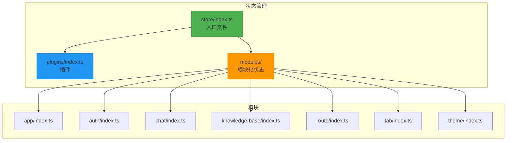
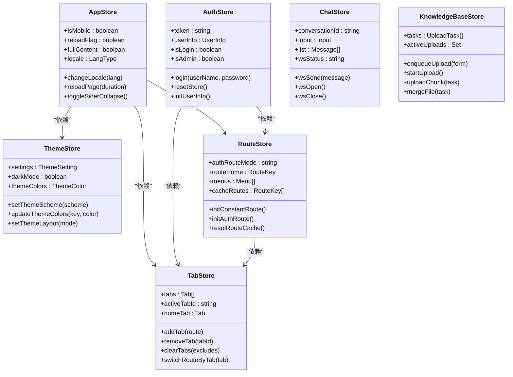
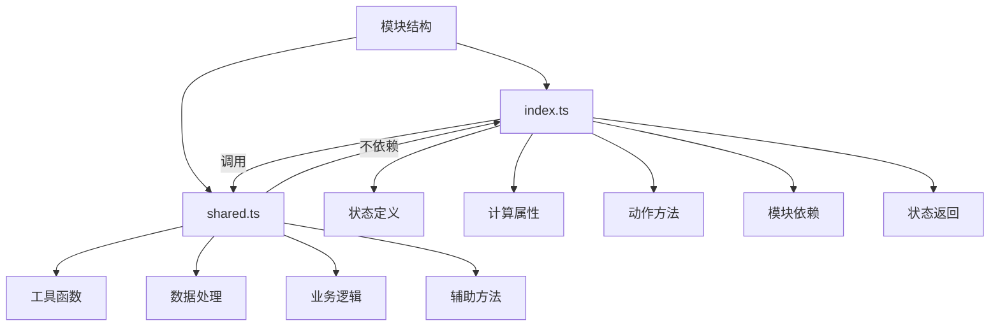
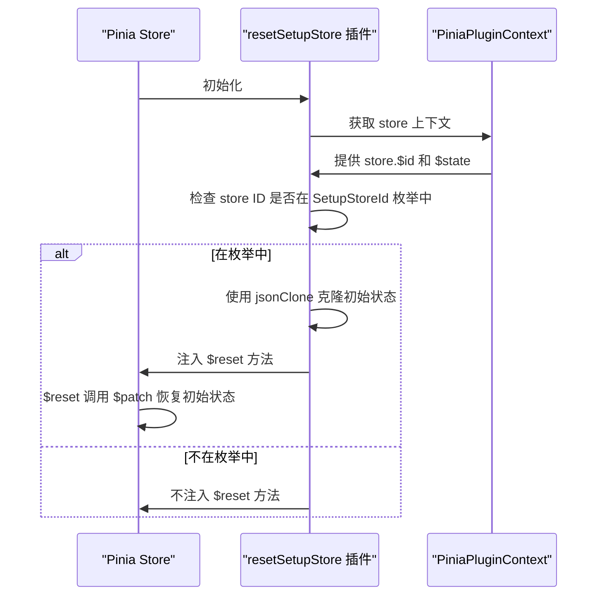

# 状态管理集成

<cite>
**本文档引用的文件**   
- [store/index.ts](file://frontend/src/store/index.ts)
- [plugins/index.ts](file://frontend/src/store/plugins/index.ts)
- [enum/index.ts](file://frontend/src/enum/index.ts)
- [modules/app/index.ts](file://frontend/src/store/modules/app/index.ts)
- [modules/auth/index.ts](file://frontend/src/store/modules/auth/index.ts)
- [modules/auth/shared.ts](file://frontend/src/store/modules/auth/shared.ts)
- [modules/chat/index.ts](file://frontend/src/store/modules/chat/index.ts)
- [modules/knowledge-base/index.ts](file://frontend/src/store/modules/knowledge-base/index.ts)
- [modules/route/index.ts](file://frontend/src/store/modules/route/index.ts)
- [modules/route/shared.ts](file://frontend/src/store/modules/route/shared.ts)
- [modules/tab/index.ts](file://frontend/src/store/modules/tab/index.ts)
- [modules/tab/shared.ts](file://frontend/src/store/modules/tab/shared.ts)
- [modules/theme/index.ts](file://frontend/src/store/modules/theme/index.ts)
- [modules/theme/shared.ts](file://frontend/src/store/modules/theme/shared.ts)
</cite>

## 目录
1. [项目结构分析](#项目结构分析)
2. [核心组件分析](#核心组件分析)
3. [模块化状态管理架构](#模块化状态管理架构)
4. [模块状态划分与数据边界](#模块状态划分与数据边界)
5. [模块内部职责分离模式](#模块内部职责分离模式)
6. [持久化插件工作机制](#持久化插件工作机制)
7. [实际业务场景中的安全使用](#实际业务场景中的安全使用)

## 项目结构分析

项目采用模块化架构，状态管理位于 `frontend/src/store` 目录下，遵循清晰的分层设计。核心状态管理使用 Pinia 实现，通过模块化方式组织不同功能域的状态。



**图示来源**
- [store/index.ts](file://frontend/src/store/index.ts)
- [plugins/index.ts](file://frontend/src/store/plugins/index.ts)
- [modules/app/index.ts](file://frontend/src/store/modules/app/index.ts)
- [modules/auth/index.ts](file://frontend/src/store/modules/auth/index.ts)
- [modules/chat/index.ts](file://frontend/src/store/modules/chat/index.ts)
- [modules/knowledge-base/index.ts](file://frontend/src/store/modules/knowledge-base/index.ts)
- [modules/route/index.ts](file://frontend/src/store/modules/route/index.ts)
- [modules/tab/index.ts](file://frontend/src/store/modules/tab/index.ts)
- [modules/theme/index.ts](file://frontend/src/store/modules/theme/index.ts)

## 核心组件分析

### 状态管理入口

状态管理的入口文件 `store/index.ts` 负责初始化 Pinia 实例并注册全局插件。

```typescript
import type { App } from 'vue';
import { createPinia } from 'pinia';
import { resetSetupStore } from './plugins';

/** 设置 Vue 状态管理插件 pinia */
export function setupStore(app: App) {
  const store = createPinia();
  store.use(resetSetupStore);
  app.use(store);
}
```

该文件通过 `setupStore` 函数将 Pinia 实例注入到 Vue 应用中，并注册了 `resetSetupStore` 插件，用于实现状态重置功能。

**本节来源**
- [store/index.ts](file://frontend/src/store/index.ts)

### 模块注册机制

通过 `defineStore` 函数定义各个模块的状态，使用枚举 `SetupStoreId` 统一管理模块 ID，确保模块注册的唯一性和可维护性。

```typescript
export enum SetupStoreId {
  App = 'app-store',
  Theme = 'theme-store',
  Auth = 'auth-store',
  Route = 'route-store',
  Tab = 'tab-store',
  KnowledgeBase = 'knowledge-base-store',
  Chat = 'chat-store'
}
```

每个模块通过 `useXxxStore` 函数暴露，遵循统一的命名规范，便于在组件中导入和使用。

**本节来源**
- [enum/index.ts](file://frontend/src/enum/index.ts)

## 模块化状态管理架构

### 模块化设计原则

系统采用模块化状态管理架构，将不同功能域的状态分离到独立的模块中，遵循单一职责原则。每个模块负责特定业务领域的状态管理，降低耦合度，提高可维护性。



**图示来源**
- [modules/app/index.ts](file://frontend/src/store/modules/app/index.ts)
- [modules/auth/index.ts](file://frontend/src/store/modules/auth/index.ts)
- [modules/chat/index.ts](file://frontend/src/store/modules/chat/index.ts)
- [modules/knowledge-base/index.ts](file://frontend/src/store/modules/knowledge-base/index.ts)
- [modules/route/index.ts](file://frontend/src/store/modules/route/index.ts)
- [modules/tab/index.ts](file://frontend/src/store/modules/tab/index.ts)
- [modules/theme/index.ts](file://frontend/src/store/modules/theme/index.ts)

## 模块状态划分与数据边界

### 应用状态模块 (app)

负责管理应用级别的全局状态，包括布局、主题、语言等用户界面相关的状态。

**状态划分：**
- **响应式状态**：`isMobile`, `reloadFlag`, `fullContent`, `locale`, `siderCollapse` 等
- **计算属性**：`isMobile` 基于屏幕断点计算
- **动作方法**：`reloadPage`, `changeLocale`, `toggleSiderCollapse` 等

**数据边界：**
- 不直接管理用户认证信息
- 不管理路由配置数据
- 通过依赖注入方式使用其他模块

```typescript
export const useAppStore = defineStore(SetupStoreId.App, () => {
  const themeStore = useThemeStore();
  const routeStore = useRouteStore();
  const tabStore = useTabStore();
  
  // 状态定义
  const { bool: reloadFlag, setBool: setReloadFlag } = useBoolean(true);
  const locale = ref<App.I18n.LangType>(localStg.get('lang') || 'zh-CN');
  
  // 动作方法
  async function reloadPage(duration = 300) {
    setReloadFlag(false);
    await new Promise(resolve => setTimeout(resolve, duration));
    setReloadFlag(true);
  }
  
  function changeLocale(lang: App.I18n.LangType) {
    locale.value = lang;
    localStg.set('lang', lang);
  }
  
  return {
    isMobile,
    reloadFlag,
    reloadPage,
    fullContent,
    locale,
    changeLocale,
    siderCollapse,
    setSiderCollapse,
    toggleSiderCollapse
  };
});
```

**本节来源**
- [modules/app/index.ts](file://frontend/src/store/modules/app/index.ts)

### 认证状态模块 (auth)

负责管理用户认证相关的状态，包括登录状态、用户信息、权限等。

**状态划分：**
- **响应式状态**：`token`, `userInfo`, `loginLoading`
- **计算属性**：`isLogin`, `isAdmin`, `isStaticSuper`
- **动作方法**：`login`, `resetStore`, `initUserInfo`, `setToken`

**数据边界：**
- 封装了认证相关的业务逻辑
- 管理本地存储中的认证信息
- 与其他模块协作处理认证后的状态重置

```typescript
export const useAuthStore = defineStore(SetupStoreId.Auth, () => {
  const token = ref(getToken());
  const userInfo: Api.Auth.UserInfo = reactive({
    id: 0,
    username: '',
    role: 'USER',
    orgTags: [],
    primaryOrg: ''
  });
  
  const isLogin = computed(() => Boolean(token.value));
  const isAdmin = computed(() => userInfo.role === 'ADMIN');
  
  async function login(userName: string, password: string, redirect = true) {
    startLoading();
    const { data: loginToken, error } = await fetchLogin(userName, password);
    if (!error) {
      const pass = await loginByToken(loginToken);
      if (pass) {
        await redirectFromLogin(redirect);
      }
    }
    endLoading();
  }
  
  return {
    token,
    userInfo,
    isLogin,
    isAdmin,
    loginLoading,
    login,
    resetStore,
    initUserInfo,
    setToken
  };
});
```

**本节来源**
- [modules/auth/index.ts](file://frontend/src/store/modules/auth/index.ts)

### 主题状态模块 (theme)

负责管理应用主题相关的状态，包括主题方案、颜色、布局等。

**状态划分：**
- **响应式状态**：`settings`, `darkMode`, `themeColors`
- **计算属性**：`darkMode`, `themeColors`, `naiveTheme`
- **动作方法**：`setThemeScheme`, `updateThemeColors`, `setThemeLayout`

**数据边界：**
- 管理主题配置的持久化
- 处理主题相关的 CSS 变量
- 与 UI 组件库（Naive UI）集成

```typescript
export const useThemeStore = defineStore(SetupStoreId.Theme, () => {
  const settings: Ref<App.Theme.ThemeSetting> = ref(initThemeSettings());
  const darkMode = computed(() => {
    if (settings.value.themeScheme === 'auto') {
      return osTheme.value === 'dark';
    }
    return settings.value.themeScheme === 'dark';
  });
  
  function setThemeScheme(themeScheme: UnionKey.ThemeScheme) {
    settings.value.themeScheme = themeScheme;
  }
  
  function updateThemeColors(key: App.Theme.ThemeColorKey, color: string) {
    settings.value.themeColor = color;
  }
  
  return {
    ...toRefs(settings.value),
    darkMode,
    themeColors,
    naiveTheme,
    setThemeScheme,
    updateThemeColors,
    setThemeLayout
  };
});
```

**本节来源**
- [modules/theme/index.ts](file://frontend/src/store/modules/theme/index.ts)

### 路由状态模块 (route)

负责管理路由相关的状态，包括菜单、权限路由、缓存等。

**状态划分：**
- **响应式状态**：`constantRoutes`, `authRoutes`, `menus`, `cacheRoutes`
- **计算属性**：`breadcrumbs`, `searchMenus`
- **动作方法**：`initConstantRoute`, `initAuthRoute`, `resetRouteCache`

**数据边界：**
- 管理动态路由的生成和注册
- 处理菜单和面包屑的生成
- 管理路由缓存策略

```typescript
export const useRouteStore = defineStore(SetupStoreId.Route, () => {
  const constantRoutes = shallowRef<ElegantConstRoute[]>([]);
  const authRoutes = shallowRef<ElegantConstRoute[]>([]);
  const menus = ref<App.Global.Menu[]>([]);
  const cacheRoutes = ref<RouteKey[]>([]);
  
  async function initConstantRoute() {
    const staticRoute = createStaticRoutes();
    addConstantRoutes(staticRoute.constantRoutes);
    handleConstantAndAuthRoutes();
  }
  
  async function initAuthRoute() {
    const { data, error } = await fetchGetUserRoutes();
    if (!error) {
      addAuthRoutes(data.routes);
      handleConstantAndAuthRoutes();
    }
  }
  
  return {
    resetStore,
    routeHome,
    menus,
    searchMenus,
    cacheRoutes,
    resetRouteCache,
    breadcrumbs,
    initConstantRoute,
    initAuthRoute
  };
});
```

**本节来源**
- [modules/route/index.ts](file://frontend/src/store/modules/route/index.ts)

### 标签页状态模块 (tab)

负责管理标签页相关的状态，包括标签页列表、激活状态、缓存等。

**状态划分：**
- **响应式状态**：`tabs`, `activeTabId`, `homeTab`
- **计算属性**：`allTabs`
- **动作方法**：`addTab`, `removeTab`, `clearTabs`, `switchRouteByTab`

**数据边界：**
- 管理标签页的持久化
- 处理标签页的增删改查操作
- 与路由系统集成

```typescript
export const useTabStore = defineStore(SetupStoreId.Tab, () => {
  const tabs = ref<App.Global.Tab[]>([]);
  const activeTabId = ref<string>('');
  const homeTab = ref<App.Global.Tab>();
  
  function addTab(route: App.Global.TabRoute, active = true) {
    const tab = getTabByRoute(route);
    if (!isTabInTabs(tab.id, tabs.value)) {
      tabs.value.push(tab);
    }
    if (active) {
      setActiveTabId(tab.id);
    }
  }
  
  async function removeTab(tabId: string) {
    const removeTabIndex = tabs.value.findIndex(tab => tab.id === tabId);
    tabs.value.splice(removeTabIndex, 1);
  }
  
  return {
    tabs: allTabs,
    activeTabId,
    addTab,
    removeTab,
    clearTabs,
    switchRouteByTab,
    updateTabsByLocale,
    cacheTabs
  };
});
```

**本节来源**
- [modules/tab/index.ts](file://frontend/src/store/modules/tab/index.ts)

### 聊天状态模块 (chat)

负责管理聊天相关的状态，包括会话、消息列表、WebSocket 连接等。

**状态划分：**
- **响应式状态**：`conversationId`, `input`, `list`, `wsStatus`
- **动作方法**：`wsSend`, `wsOpen`, `wsClose`

**数据边界：**
- 管理 WebSocket 连接状态
- 处理聊天消息的收发
- 与认证模块集成获取用户令牌

```typescript
export const useChatStore = defineStore(SetupStoreId.Chat, () => {
  const conversationId = ref<string>('');
  const input = ref<Api.Chat.Input>({ message: '' });
  const list = ref<Api.Chat.Message[]>([]);
  
  const store = useAuthStore();
  const { wsStatus, wsData, wsSend, wsOpen, wsClose } = useWebSocket(
    `/proxy-ws/chat/${store.token}`,
    { autoReconnect: true }
  );
  
  return {
    input,
    conversationId,
    list,
    wsStatus,
    wsData,
    wsSend,
    wsOpen,
    wsClose,
    scrollToBottom
  };
});
```

**本节来源**
- [modules/chat/index.ts](file://frontend/src/store/modules/chat/index.ts)

### 知识库状态模块 (knowledge-base)

负责管理知识库文件上传相关的状态，包括上传任务、进度、并发控制等。

**状态划分：**
- **响应式状态**：`tasks`, `activeUploads`
- **动作方法**：`enqueueUpload`, `startUpload`, `uploadChunk`, `mergeFile`

**数据边界：**
- 管理文件分片上传的完整流程
- 处理上传任务的队列和并发控制
- 与后端 API 集成

```typescript
export const useKnowledgeBaseStore = defineStore(SetupStoreId.KnowledgeBase, () => {
  const tasks = ref<Api.KnowledgeBase.UploadTask[]>([]);
  const activeUploads = ref<Set<string>>(new Set());
  
  async function enqueueUpload(form: Api.KnowledgeBase.Form) {
    const file = form.fileList![0].file!;
    const md5 = await calculateMD5(file);
    const existingTask = tasks.value.find(t => t.fileMd5 === md5);
    
    if (existingTask) {
      // 处理已存在的任务
      return;
    }
    
    const newTask: Api.KnowledgeBase.UploadTask = {
      file,
      fileMd5: md5,
      fileName: file.name,
      totalSize: file.size,
      status: UploadStatus.Pending,
      orgTag: form.orgTag
    };
    
    tasks.value.push(newTask);
    startUpload();
  }
  
  async function startUpload() {
    const pendingTasks = tasks.value.filter(
      t => t.status === UploadStatus.Pending && !activeUploads.value.has(t.fileMd5)
    );
    
    if (pendingTasks.length === 0) return;
    
    const task = pendingTasks[0];
    task.status = UploadStatus.Uploading;
    activeUploads.value.add(task.fileMd5);
    
    try {
      for (let i = 0; i < totalChunks; i += 1) {
        if (!task.uploadedChunks.includes(i)) {
          task.chunkIndex = i;
          const success = await uploadChunk(task);
          if (!success) throw new Error('分片上传失败');
        }
      }
    } catch (e) {
      task.status = UploadStatus.Break;
    } finally {
      activeUploads.value.delete(task.fileMd5);
      startUpload();
    }
  }
  
  return {
    tasks,
    activeUploads,
    enqueueUpload,
    startUpload
  };
});
```

**本节来源**
- [modules/knowledge-base/index.ts](file://frontend/src/store/modules/knowledge-base/index.ts)

## 模块内部职责分离模式

### index.ts 与 shared.ts 职责分离

各模块采用 `index.ts` 和 `shared.ts` 文件分离的模式，遵循关注点分离原则。



**图示来源**
- [modules/auth/index.ts](file://frontend/src/store/modules/auth/index.ts)
- [modules/auth/shared.ts](file://frontend/src/store/modules/auth/shared.ts)
- [modules/route/index.ts](file://frontend/src/store/modules/route/index.ts)
- [modules/route/shared.ts](file://frontend/src/store/modules/route/shared.ts)
- [modules/tab/index.ts](file://frontend/src/store/modules/tab/index.ts)
- [modules/tab/shared.ts](file://frontend/src/store/modules/tab/shared.ts)
- [modules/theme/index.ts](file://frontend/src/store/modules/theme/index.ts)
- [modules/theme/shared.ts](file://frontend/src/store/modules/theme/shared.ts)

### 认证模块职责分离

**index.ts 职责：**
- 定义模块状态（token、userInfo）
- 定义计算属性（isLogin、isAdmin）
- 定义动作方法（login、resetStore）
- 管理模块依赖（useRoute、useRouterPush）

**shared.ts 职责：**
- 提供工具函数（getToken、clearAuthStorage）
- 封装本地存储操作

```typescript
// modules/auth/shared.ts
export function getToken() {
  return localStg.get('token') || '';
}

export function clearAuthStorage() {
  localStg.remove('token');
  localStg.remove('refreshToken');
}
```

**本节来源**
- [modules/auth/index.ts](file://frontend/src/store/modules/auth/index.ts)
- [modules/auth/shared.ts](file://frontend/src/store/modules/auth/shared.ts)

### 路由模块职责分离

**index.ts 职责：**
- 管理路由状态（constantRoutes、authRoutes）
- 处理路由初始化逻辑
- 管理菜单和缓存

**shared.ts 职责：**
- 提供路由过滤函数（filterAuthRoutesByRoles）
- 提供菜单生成函数（getGlobalMenusByAuthRoutes）
- 提供面包屑生成函数（getBreadcrumbsByRoute）
- 提供数据处理函数（sortRoutesByOrder）

```typescript
// modules/route/shared.ts
export function filterAuthRoutesByRoles(routes: ElegantConstRoute[], role: string) {
  return routes.flatMap(route => filterAuthRouteByRoles(route, role));
}

export function getGlobalMenusByAuthRoutes(routes: ElegantConstRoute[]) {
  const menus: App.Global.Menu[] = [];
  routes.forEach(route => {
    if (!route.meta?.hideInMenu) {
      const menu = getGlobalMenuByBaseRoute(route);
      if (route.children?.some(child => !child.meta?.hideInMenu)) {
        menu.children = getGlobalMenusByAuthRoutes(route.children);
      }
      menus.push(menu);
    }
  });
  return menus;
}
```

**本节来源**
- [modules/route/index.ts](file://frontend/src/store/modules/route/index.ts)
- [modules/route/shared.ts](file://frontend/src/store/modules/route/shared.ts)

### 标签页模块职责分离

**index.ts 职责：**
- 管理标签页状态（tabs、activeTabId）
- 处理标签页操作（addTab、removeTab）
- 管理标签页缓存

**shared.ts 职责：**
- 提供标签页工具函数（getTabByRoute、getTabIdByRoute）
- 提供标签页过滤函数（filterTabsByIds）
- 提供标签页提取函数（extractTabsByAllRoutes）
- 提供国际化处理函数（updateTabsByI18nKey）

```typescript
// modules/tab/shared.ts
export function getTabByRoute(route: App.Global.TabRoute) {
  const { name, path, fullPath = path, meta } = route;
  const { title, i18nKey, fixedIndexInTab } = meta;
  const label = i18nKey ? $t(i18nKey) : title;
  
  const tab: App.Global.Tab = {
    id: getTabIdByRoute(route),
    label,
    routeKey: name as LastLevelRouteKey,
    routePath: path as RouteMap[LastLevelRouteKey],
    fullPath,
    fixedIndex: fixedIndexInTab,
    icon,
    localIcon,
    i18nKey
  };
  
  return tab;
}
```

**本节来源**
- [modules/tab/index.ts](file://frontend/src/store/modules/tab/index.ts)
- [modules/tab/shared.ts](file://frontend/src/store/modules/tab/shared.ts)

### 主题模块职责分离

**index.ts 职责：**
- 管理主题状态（settings、darkMode）
- 处理主题变更逻辑
- 管理主题缓存

**shared.ts 职责：**
- 提供主题初始化函数（initThemeSettings）
- 提供主题变量生成函数（createThemeToken）
- 提供 CSS 变量注入函数（addThemeVarsToGlobal）
- 提供主题模式切换函数（toggleCssDarkMode）

```typescript
// modules/theme/shared.ts
export function initThemeSettings() {
  const isProd = import.meta.env.PROD;
  if (!isProd) return themeSettings;
  
  const localSettings = localStg.get('themeSettings');
  let settings = defu(localSettings, themeSettings);
  return settings;
}

export function addThemeVarsToGlobal(tokens: App.Theme.BaseToken, darkTokens: App.Theme.BaseToken) {
  const cssVarStr = getCssVarByTokens(tokens);
  const darkCssVarStr = getCssVarByTokens(darkTokens);
  
  const css = `
    :root {
      ${cssVarStr}
    }
  `;
  
  const darkCss = `
    html.${DARK_CLASS} {
      ${darkCssVarStr}
    }
  `;
  
  const styleId = 'theme-vars';
  const style = document.querySelector(`#${styleId}`) || document.createElement('style');
  style.id = styleId;
  style.textContent = css + darkCss;
  document.head.appendChild(style);
}
```

**本节来源**
- [modules/theme/index.ts](file://frontend/src/store/modules/theme/index.ts)
- [modules/theme/shared.ts](file://frontend/src/store/modules/theme/shared.ts)

## 持久化插件工作机制

### 插件实现

持久化插件 `plugins/index.ts` 实现了状态重置功能，通过 Pinia 插件机制在模块初始化时注入。

```typescript
import type { PiniaPluginContext } from 'pinia';
import { jsonClone } from '@sa/utils';
import { SetupStoreId } from '@/enum';

/**
 * 重置使用 setup 语法编写的状态存储
 *
 * @param context
 */
export function resetSetupStore(context: PiniaPluginContext) {
  const setupSyntaxIds = Object.values(SetupStoreId) as string[];

  if (setupSyntaxIds.includes(context.store.$id)) {
    const { $state } = context.store;
    const defaultStore = jsonClone($state);
    
    context.store.$reset = () => {
      context.store.$patch(defaultStore);
    };
  }
}
```

**本节来源**
- [plugins/index.ts](file://frontend/src/store/plugins/index.ts)

### 工作机制

插件通过以下步骤实现状态持久化和重置：



**图示来源**
- [plugins/index.ts](file://frontend/src/store/plugins/index.ts)
- [enum/index.ts](file://frontend/src/enum/index.ts)

### 用户偏好设置存储

各模块通过 `beforeunload` 事件监听器实现用户偏好设置的持久化存储。

```typescript
// app 模块
useEventListener(window, 'beforeunload', () => {
  localStg.set('mixSiderFixed', mixSiderFixed.value ? 'Y' : 'N');
});

// theme 模块
useEventListener(window, 'beforeunload', () => {
  cacheThemeSettings();
});

// tab 模块
useEventListener(window, 'beforeunload', () => {
  cacheTabs();
});
```

**本节来源**
- [modules/app/index.ts](file://frontend/src/store/modules/app/index.ts)
- [modules/theme/index.ts](file://frontend/src/store/modules/theme/index.ts)
- [modules/tab/index.ts](file://frontend/src/store/modules/tab/index.ts)

## 实际业务场景中的安全使用

### 状态读取

在组件中安全地读取状态，遵循响应式原则：

```typescript
// 组件中读取状态
import { useAppStore } from '@/store/modules/app';
import { useAuthStore } from '@/store/modules/auth';

export default defineComponent({
  setup() {
    const appStore = useAppStore();
    const authStore = useAuthStore();
    
    // 直接读取响应式状态
    const isMobile = computed(() => appStore.isMobile);
    const isLogin = computed(() => authStore.isLogin);
    const isAdmin = computed(() => authStore.isAdmin);
    
    // 使用计算属性
    const showSidebar = computed(() => !isMobile.value && !appStore.fullContent);
    
    return {
      isMobile,
      isLogin,
      isAdmin,
      showSidebar
    };
  }
});
```

**本节来源**
- [modules/app/index.ts](file://frontend/src/store/modules/app/index.ts)
- [modules/auth/index.ts](file://frontend/src/store/modules/auth/index.ts)

### 状态变更

通过调用模块暴露的动作方法安全地变更状态：

```typescript
// 组件中变更状态
import { useAppStore } from '@/store/modules/app';
import { useAuthStore } from '@/store/modules/auth';

export default defineComponent({
  setup() {
    const appStore = useAppStore();
    const authStore = useAuthStore();
    
    // 调用动作方法变更状态
    const toggleSidebar = () => {
      appStore.toggleSiderCollapse();
    };
    
    const changeLanguage = (lang: App.I18n.LangType) => {
      appStore.changeLocale(lang);
    };
    
    const handleLogin = async (userName: string, password: string) => {
      try {
        await authStore.login(userName, password);
        // 登录成功后的处理
      } catch (error) {
        // 登录失败的处理
      }
    };
    
    const logout = async () => {
      await authStore.resetStore();
    };
    
    return {
      toggleSidebar,
      changeLanguage,
      handleLogin,
      logout
    };
  }
});
```

**本节来源**
- [modules/app/index.ts](file://frontend/src/store/modules/app/index.ts)
- [modules/auth/index.ts](file://frontend/src/store/modules/auth/index.ts)

### 错误处理

在状态变更操作中实现完善的错误处理机制：

```typescript
// 安全的状态变更操作
async function safeLogin(userName: string, password: string) {
  const authStore = useAuthStore();
  
  try {
    // 开始加载状态
    authStore.startLoading();
    
    // 执行登录操作
    await authStore.login(userName, password);
    
    // 登录成功提示
    window.$notification?.success({
      title: '登录成功',
      content: `欢迎回来，${authStore.userInfo.username}`,
      duration: 4500
    });
  } catch (error) {
    // 错误处理
    window.$notification?.error({
      title: '登录失败',
      content: error.message || '用户名或密码错误',
      duration: 4500
    });
  } finally {
    // 结束加载状态
    authStore.endLoading();
  }
}
```

**本节来源**
- [modules/auth/index.ts](file://frontend/src/store/modules/auth/index.ts)

### 状态重置

利用插件提供的 `$reset` 方法安全地重置状态：

```typescript
// 安全的状态重置
async function resetAuthState() {
  const authStore = useAuthStore();
  const routeStore = useRouteStore();
  const tabStore = useTabStore();
  
  // 记录用户ID用于后续比较
  authStore.recordUserId();
  
  // 清除认证存储
  clearAuthStorage();
  
  // 重置认证状态
  authStore.$reset();
  
  // 重置其他相关状态
  tabStore.cacheTabs();
  routeStore.resetStore();
}
```

**本节来源**
- [modules/auth/index.ts](file://frontend/src/store/modules/auth/index.ts)
- [modules/route/index.ts](file://frontend/src/store/modules/route/index.ts)
- [modules/tab/index.ts](file://frontend/src/store/modules/tab/index.ts)