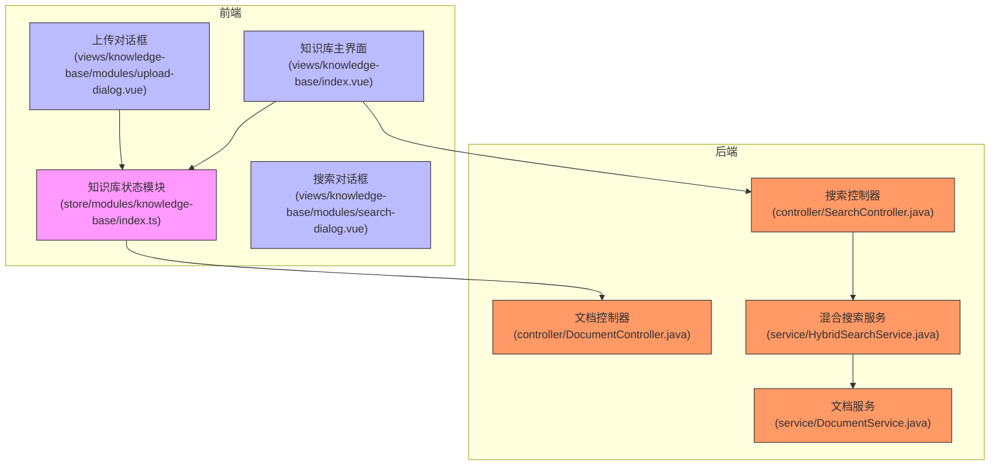
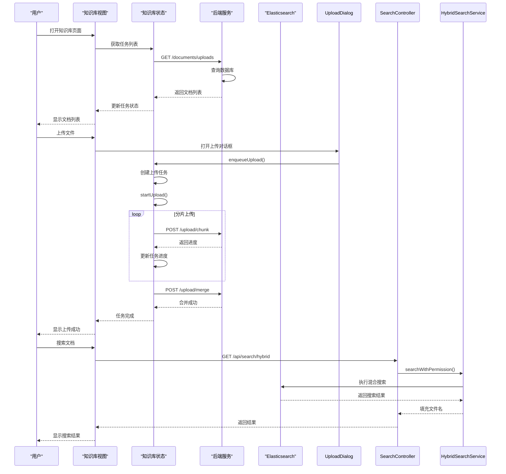
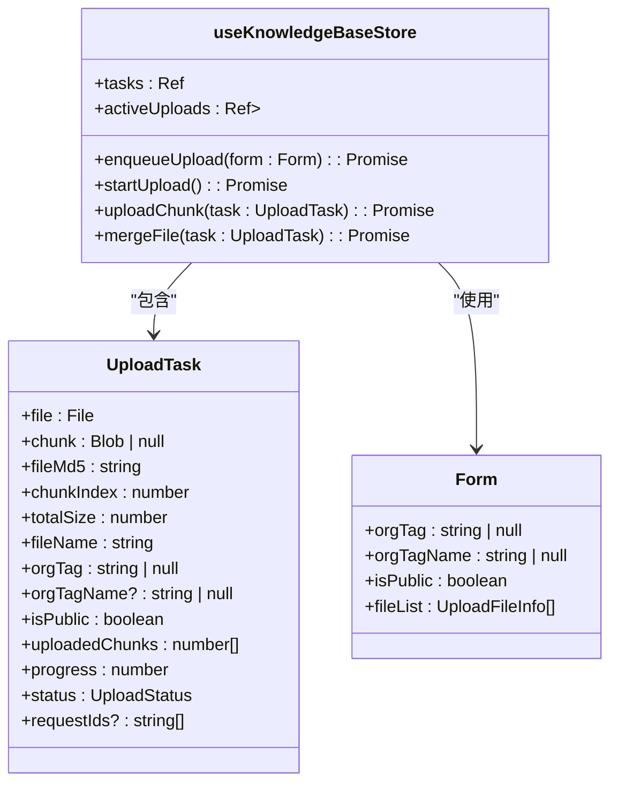
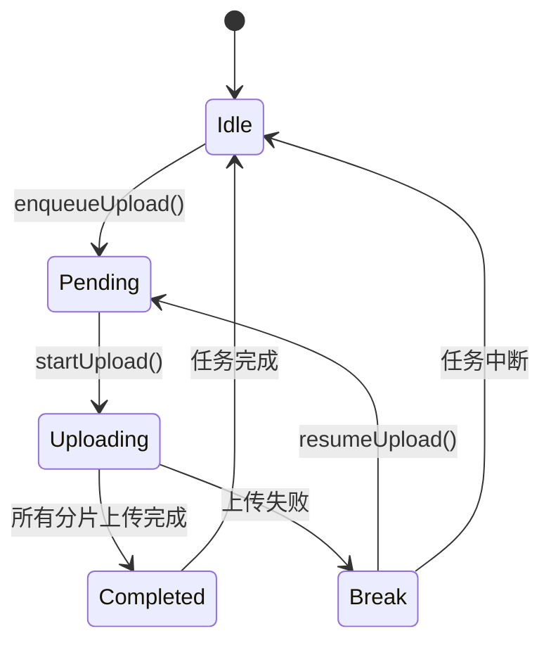
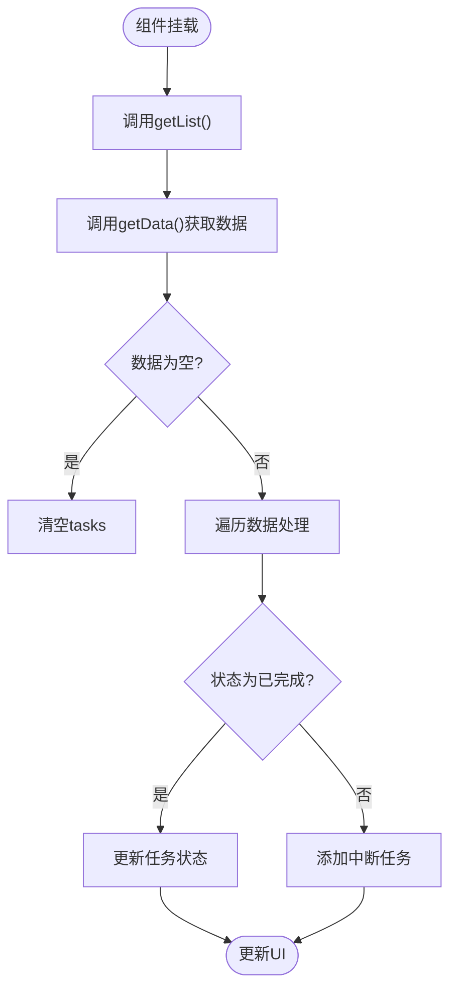
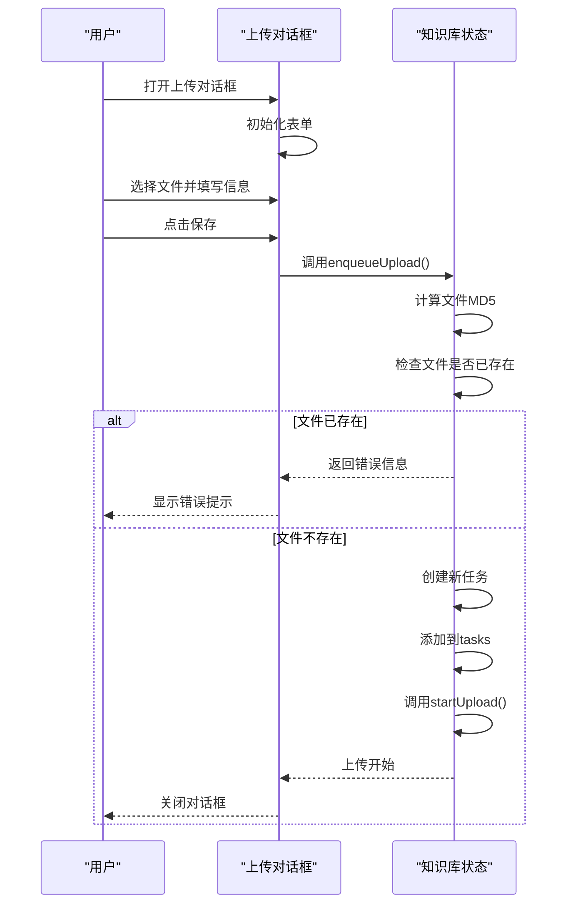
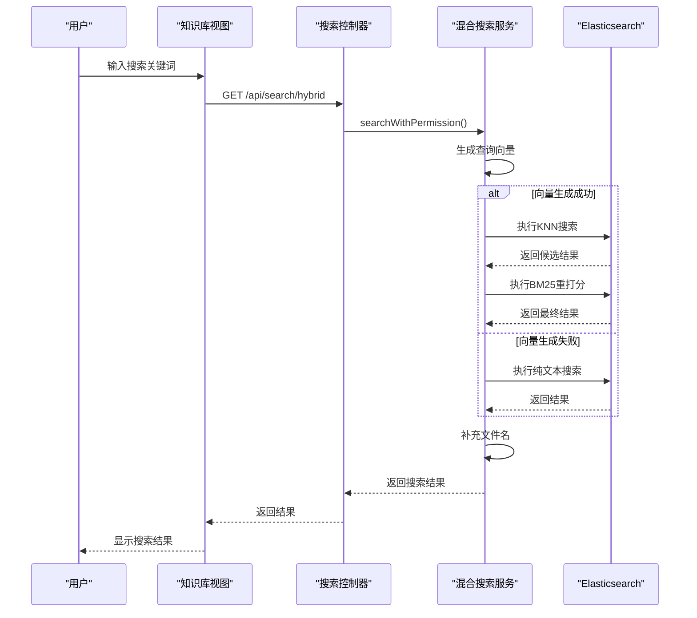
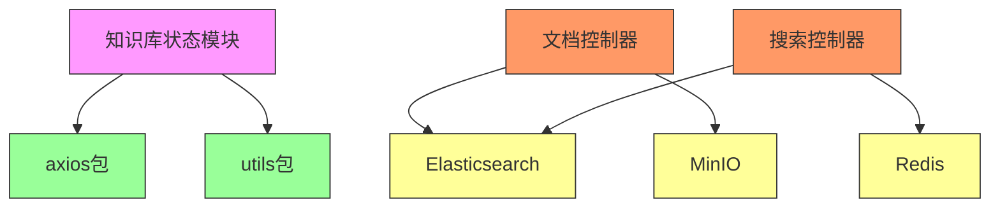

# 知识库状态模块

<cite>
**本文档引用的文件**   
- [index.ts](file://frontend/src/store/modules/knowledge-base/index.ts)
- [index.vue](file://frontend/src/views/knowledge-base/index.vue)
- [upload-dialog.vue](file://frontend/src/views/knowledge-base/modules/upload-dialog.vue)
- [DocumentController.java](file://src/main/java/com/yizhaoqi/smartpai/controller/DocumentController.java)
- [SearchController.java](file://src/main/java/com/yizhaoqi/smartpai/controller/SearchController.java)
- [HybridSearchService.java](file://src/main/java/com/yizhaoqi/smartpai/service/HybridSearchService.java)
- [api.d.ts](file://frontend/src/typings/api.d.ts)
</cite>

## 目录
1. [简介](#简介)
2. [项目结构](#项目结构)
3. [核心组件](#核心组件)
4. [架构概述](#架构概述)
5. [详细组件分析](#详细组件分析)
6. [依赖分析](#依赖分析)
7. [性能考虑](#性能考虑)
8. [故障排除指南](#故障排除指南)
9. [结论](#结论)

## 简介
本文档深入解析知识库状态模块的设计与实现，重点分析知识库相关的状态管理机制，包括文档列表、搜索状态、上传进度等核心功能。文档详细说明了状态模块中`documents`、`searchQuery`、`uploadStatus`等字段的定义与更新策略，分析了文档上传、搜索执行、结果展示等操作与后端API的交互流程。通过结合`knowledge-base/index.vue`和`upload-dialog.vue`组件，展示了复杂异步操作的状态管理最佳实践，为开发者提供了全面的技术参考。

## 项目结构
知识库模块采用分层架构设计，前端状态管理与后端服务分离，通过清晰的接口进行通信。前端使用Pinia进行状态管理，将知识库相关的状态集中管理；后端则采用Spring Boot框架，通过RESTful API提供服务。整个模块围绕文档的上传、管理、搜索三大核心功能构建，形成了完整的知识库管理系统。



**图示来源**
- [index.ts](file://frontend/src/store/modules/knowledge-base/index.ts)
- [index.vue](file://frontend/src/views/knowledge-base/index.vue)
- [upload-dialog.vue](file://frontend/src/views/knowledge-base/modules/upload-dialog.vue)
- [DocumentController.java](file://src/main/java/com/yizhaoqi/smartpai/controller/DocumentController.java)
- [SearchController.java](file://src/main/java/com/yizhaoqi/smartpai/controller/SearchController.java)
- [HybridSearchService.java](file://src/main/java/com/yizhaoqi/smartpai/service/HybridSearchService.java)

## 核心组件
知识库状态模块的核心组件包括状态管理器、主界面视图、上传对话框和搜索对话框。状态管理器负责维护所有知识库相关的状态，包括上传任务列表、活动上传队列等。主界面视图负责展示文档列表和提供用户操作入口，上传对话框处理文件上传的表单交互，搜索对话框则负责检索功能的用户界面。

**组件来源**
- [index.ts](file://frontend/src/store/modules/knowledge-base/index.ts#L0-L184)
- [index.vue](file://frontend/src/views/knowledge-base/index.vue#L0-L320)
- [upload-dialog.vue](file://frontend/src/views/knowledge-base/modules/upload-dialog.vue#L0-L112)

## 架构概述
知识库模块采用前后端分离架构，前端通过Pinia状态管理库集中管理知识库相关状态，后端通过Spring Boot提供RESTful API服务。整个系统的核心是文档的生命周期管理，从上传、处理到搜索，形成了完整的数据流。前端状态管理器与后端API协同工作，确保用户操作的实时反馈和数据一致性。



**图示来源**
- [index.ts](file://frontend/src/store/modules/knowledge-base/index.ts#L0-L184)
- [index.vue](file://frontend/src/views/knowledge-base/index.vue#L0-L320)
- [DocumentController.java](file://src/main/java/com/yizhaoqi/smartpai/controller/DocumentController.java#L0-L46)
- [SearchController.java](file://src/main/java/com/yizhaoqi/smartpai/controller/SearchController.java#L0-L90)
- [HybridSearchService.java](file://src/main/java/com/yizhaoqi/smartpai/service/HybridSearchService.java#L0-L472)

## 详细组件分析
### 状态管理器分析
知识库状态管理器是整个模块的核心，负责管理所有与知识库相关的状态。它使用Pinia框架创建了一个名为`useKnowledgeBaseStore`的状态存储，集中管理上传任务、活动上传等状态。



**图示来源**
- [index.ts](file://frontend/src/store/modules/knowledge-base/index.ts#L0-L184)
- [api.d.ts](file://frontend/src/typings/api.d.ts#L128-L152)

#### 状态字段定义与更新策略
状态管理器定义了两个核心状态字段：`tasks`和`activeUploads`。`tasks`是一个响应式数组，存储所有上传任务的状态，包括文件信息、上传进度、状态等。`activeUploads`是一个响应式集合，记录当前正在上传的文件MD5值，用于控制并发上传数量。

```typescript
const tasks = ref<Api.KnowledgeBase.UploadTask[]>([]);
const activeUploads = ref<Set<string>>(new Set());
```

当用户上传文件时，`enqueueUpload`方法会创建一个新的上传任务并添加到`tasks`数组中。如果文件已存在，则根据当前状态给出相应提示。任务状态通过`UploadStatus`枚举定义，包括`Uploading`、`Completed`、`Pending`、`Paused`和`Break`五种状态。

上传进度的更新策略采用分片上传机制。系统将大文件分割成多个分片，每个分片上传完成后，后端返回已上传的分片索引和进度百分比。前端收到响应后，更新对应任务的`uploadedChunks`数组和`progress`字段，实现精确的进度显示。

#### 上传任务状态机
上传任务的状态转换遵循严格的流程，确保上传过程的可靠性和用户体验。状态机的转换流程如下：



**图示来源**
- [index.ts](file://frontend/src/store/modules/knowledge-base/index.ts#L0-L184)
- [index.vue](file://frontend/src/views/knowledge-base/index.vue#L0-L320)

### 主界面视图分析
知识库主界面视图负责展示文档列表和提供用户操作入口。它通过`useTable`钩子获取文档数据，并使用`storeToRefs`将状态管理器中的`tasks`映射到本地响应式变量，实现数据的双向绑定。



**图示来源**
- [index.vue](file://frontend/src/views/knowledge-base/index.vue#L125-L160)

主界面的`getList`方法是状态同步的关键。它首先从后端获取最新的文档列表，然后与状态管理器中的任务列表进行对比和同步。对于已完成的文档，如果任务列表中存在相同文件MD5的任务，则更新其状态为已完成；如果不存在，则将该文档添加到任务列表中。对于未完成的文档，如果任务列表中没有相同文件MD5的任务，则将其状态设置为中断并添加到任务列表中。

这种设计确保了前端状态与后端数据的一致性，即使用户刷新页面或在不同设备间切换，也能正确显示文档的上传状态。

### 上传对话框分析
上传对话框组件提供了文件上传的用户界面，它与状态管理器紧密协作，实现了文件上传的完整流程。



**图示来源**
- [upload-dialog.vue](file://frontend/src/views/knowledge-base/modules/upload-dialog.vue#L0-L112)
- [index.ts](file://frontend/src/store/modules/knowledge-base/index.ts#L0-L184)

上传对话框通过`defineModel`创建了`visible`属性，实现了对话框的显示/隐藏控制。当用户点击保存按钮时，`handleSubmit`方法会调用状态管理器的`enqueueUpload`方法，将上传表单数据传递给状态管理器。状态管理器收到数据后，会计算文件的MD5值作为唯一标识，并检查该文件是否已经存在。

如果文件已存在且状态为已完成，系统会提示"文件已存在"；如果文件正在上传中，则提示"文件正在上传中"；如果文件上传中断，则将其状态重置为待上传并启动上传流程。这种设计避免了重复上传，提高了系统效率。

### 搜索功能分析
知识库的搜索功能采用混合搜索策略，结合了文本匹配和向量相似度搜索，提供了更精准的搜索结果。前端通过`SearchController`提供的API接口与后端通信，实现了高效的文档检索。



**图示来源**
- [SearchController.java](file://src/main/java/com/yizhaoqi/smartpai/controller/SearchController.java#L0-L90)
- [HybridSearchService.java](file://src/main/java/com/yizhaoqi/smartpai/service/HybridSearchService.java#L0-L472)

混合搜索服务首先尝试生成查询文本的向量表示，如果成功，则执行KNN（K-Nearest Neighbors）搜索，从Elasticsearch中召回与查询向量最相似的文档。然后使用BM25算法对召回结果进行重打分，结合文本匹配的相关性，得到最终的排序结果。

如果向量生成失败（例如AI服务不可用），系统会自动降级为纯文本搜索，确保搜索功能的可用性。搜索结果返回后，服务会查询数据库补充文件名信息，使前端能够显示完整的搜索结果。

## 依赖分析
知识库模块的依赖关系清晰，前端组件与后端服务通过定义良好的API接口进行通信。状态管理器作为前端的核心，依赖于`axios`包进行HTTP请求，依赖于`utils`包进行MD5计算等工具操作。后端服务则依赖于Elasticsearch进行文档搜索，依赖于MinIO进行文件存储，依赖于Redis进行缓存管理。



**图示来源**
- [index.ts](file://frontend/src/store/modules/knowledge-base/index.ts#L0-L184)
- [DocumentController.java](file://src/main/java/com/yizhaoqi/smartpai/controller/DocumentController.java#L0-L46)
- [SearchController.java](file://src/main/java/com/yizhaoqi/smartpai/controller/SearchController.java#L0-L90)

## 性能考虑
知识库模块在设计时充分考虑了性能因素。前端采用分片上传机制，将大文件分割成小块进行上传，避免了单次请求过大导致的超时问题。同时，限制并发上传数量（最多3个），防止过多的并发请求影响系统性能。

后端采用混合搜索策略，在保证搜索精度的同时，通过KNN召回和BM25重打分的两阶段搜索，平衡了搜索速度和准确性。系统还实现了搜索结果的缓存机制，对于频繁搜索的关键词，可以直接从Redis缓存中获取结果，减少对Elasticsearch的压力。

文件上传过程中，系统通过MD5校验确保文件的唯一性，避免了重复上传和存储。上传任务的状态通过`requestIds`数组进行管理，支持取消上传操作，提高了用户体验。

## 故障排除指南
### 上传失败
当文件上传失败时，系统会将任务状态设置为"中断"，并在控制台输出错误信息。可能的原因包括：
- 网络连接不稳定
- 文件分片上传超时
- 后端服务不可用

解决方案：
1. 检查网络连接是否正常
2. 尝试续传功能，系统会检查已上传的分片并继续上传
3. 如果续传失败，删除任务后重新上传

### 搜索无结果
当搜索无结果时，可能的原因包括：
- 搜索关键词与文档内容不匹配
- 文档尚未完成向量化处理
- 权限不足，无法访问相关文档

解决方案：
1. 尝试使用更通用的关键词搜索
2. 检查文档上传状态，确保文档已完成处理
3. 确认当前用户有权限访问目标文档

### 状态不同步
当前端显示的状态与后端实际状态不一致时，可能的原因包括：
- 页面未及时刷新
- 缓存数据未更新
- 状态同步逻辑有缺陷

解决方案：
1. 手动刷新页面，重新获取最新状态
2. 检查`getList`方法的实现，确保状态同步逻辑正确
3. 在关键操作后强制刷新状态

**故障排除来源**
- [index.ts](file://frontend/src/store/modules/knowledge-base/index.ts#L0-L184)
- [index.vue](file://frontend/src/views/knowledge-base/index.vue#L0-L320)
- [HybridSearchService.java](file://src/main/java/com/yizhaoqi/smartpai/service/HybridSearchService.java#L0-L472)

## 结论
知识库状态模块通过精心设计的状态管理机制，实现了文档上传、管理和搜索的完整功能。前端使用Pinia集中管理状态，通过响应式数据绑定确保UI的实时更新；后端提供稳定的RESTful API服务，采用混合搜索策略提高搜索精度。整个模块体现了前后端分离架构的优势，代码结构清晰，职责分明，为知识库功能的扩展和维护提供了良好的基础。