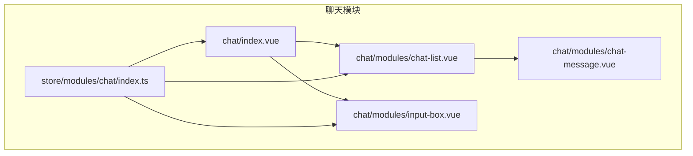
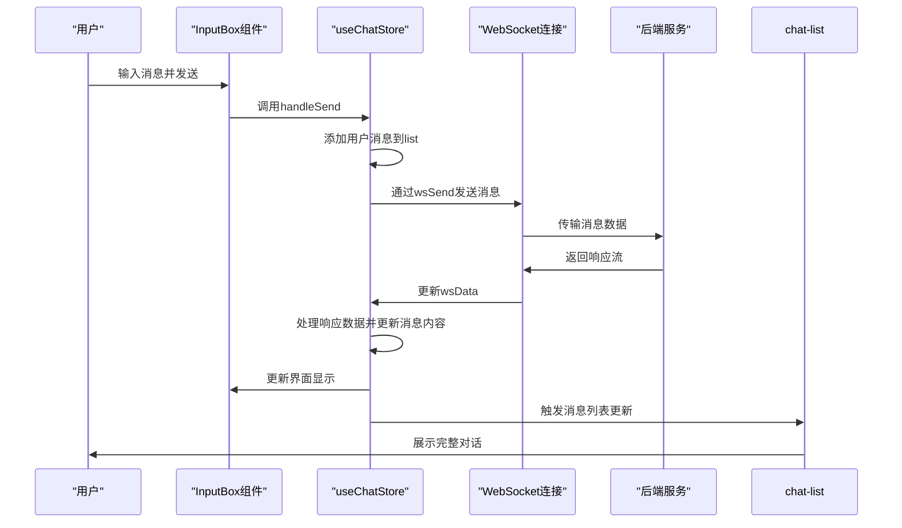
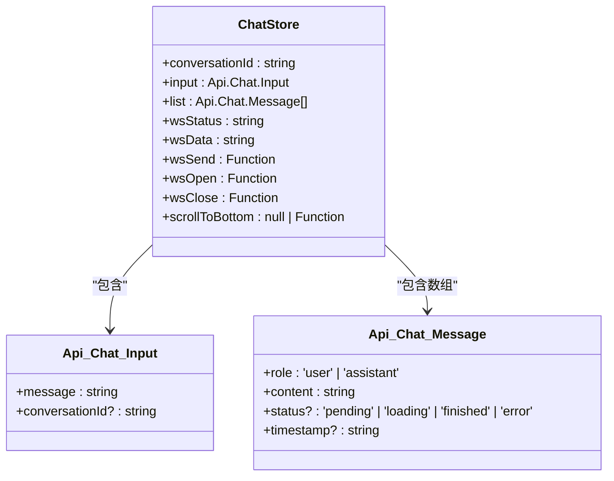
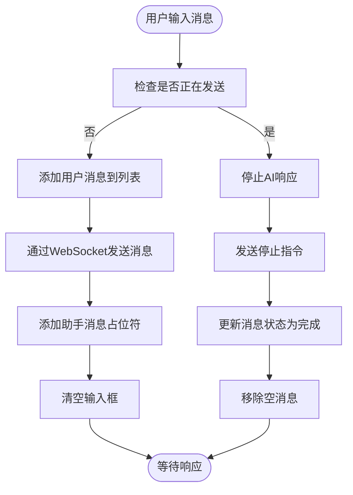
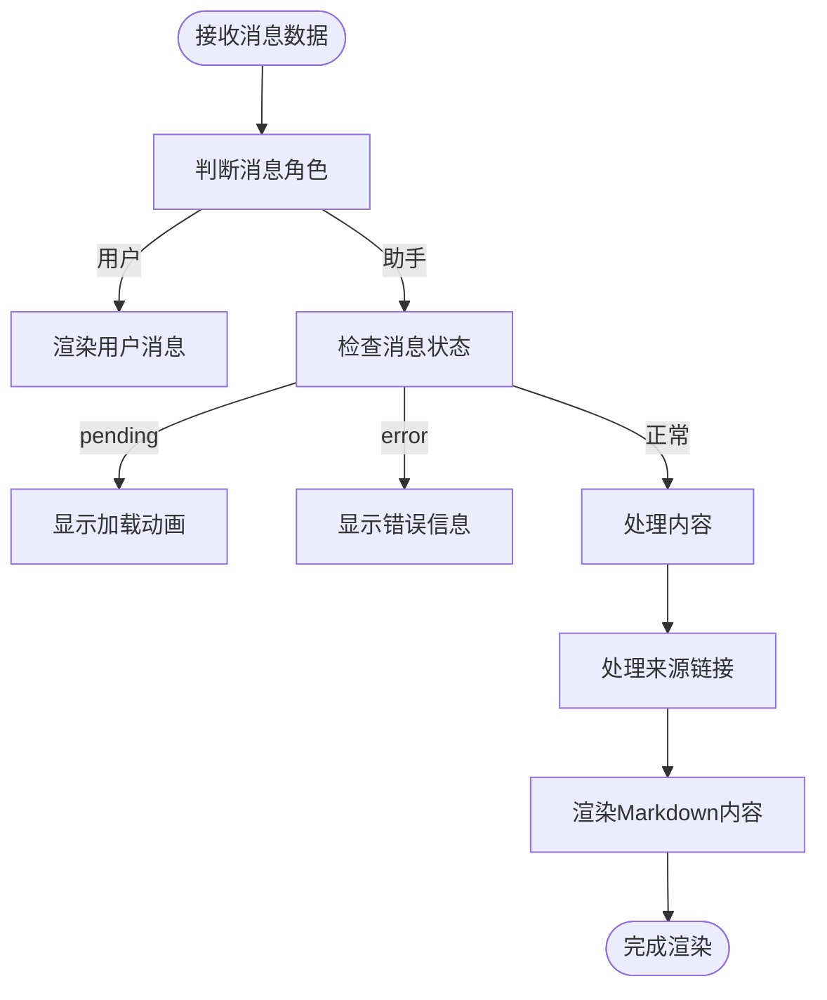
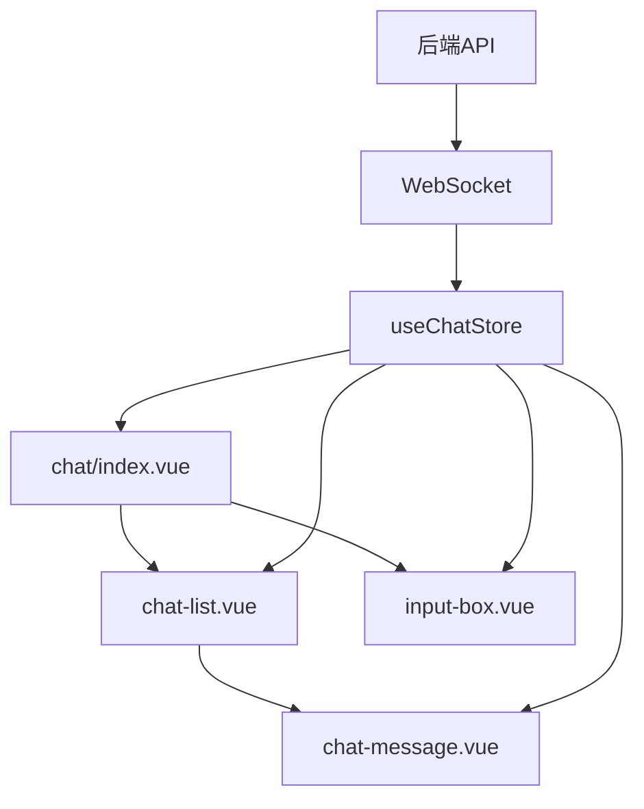

# 聊天状态模块

<cite>
**本文档引用的文件**  
- [index.ts](file://frontend/src/store/modules/chat/index.ts)
- [input-box.vue](file://frontend/src/views/chat/modules/input-box.vue)
- [chat-message.vue](file://frontend/src/views/chat/modules/chat-message.vue)
- [chat-list.vue](file://frontend/src/views/chat/modules/chat-list.vue)
- [index.vue](file://frontend/src/views/chat/index.vue)
- [sockert.js](file://frontend/src/sockert.js)
- [api.d.ts](file://frontend/src/typings/api.d.ts)
</cite>

## 目录
1. [引言](#引言)
2. [项目结构](#项目结构)
3. [核心组件](#核心组件)
4. [架构概览](#架构概览)
5. [详细组件分析](#详细组件分析)
6. [依赖分析](#依赖分析)
7. [性能考虑](#性能考虑)
8. [故障排除指南](#故障排除指南)
9. [结论](#结论)

## 引言
本文档全面阐述了PaiSmart项目中chat模块的状态管理机制。重点分析了会话列表、当前会话、消息历史等核心状态的组织方式，以及与WebSocket服务的交互逻辑。通过深入解析`useChatStore`状态管理模块和相关Vue组件，展示了实时聊天功能的响应式实现原理。

## 项目结构
聊天模块的前端代码主要分布在`frontend/src/views/chat`目录下，采用模块化设计。主组件`index.vue`负责整体布局，通过引入`chat-list.vue`、`input-box.vue`等子组件实现功能分离。状态管理由`store/modules/chat/index.ts`统一维护，通过Pinia store实现跨组件状态共享。



**图示来源**  
- [index.vue](file://frontend/src/views/chat/index.vue)
- [chat-list.vue](file://frontend/src/views/chat/modules/chat-list.vue)
- [input-box.vue](file://frontend/src/views/chat/modules/input-box.vue)
- [index.ts](file://frontend/src/store/modules/chat/index.ts)

## 核心组件
聊天模块的核心组件包括：
- **状态管理(store)**：`useChatStore`负责管理所有聊天相关的状态
- **消息列表(chat-list)**：展示消息历史记录
- **输入框(input-box)**：处理用户输入和消息发送
- **消息项(chat-message)**：渲染单条消息内容

这些组件通过共享的Pinia store进行数据同步，实现了响应式更新。

**本节来源**  
- [index.ts](file://frontend/src/store/modules/chat/index.ts)
- [index.vue](file://frontend/src/views/chat/index.vue)

## 架构概览
聊天模块采用典型的MVVM架构模式，将视图(View)与状态(Model)分离。通过WebSocket实现与后端的实时通信，所有消息数据流都经过状态管理模块进行统一处理。



**图示来源**  
- [index.ts](file://frontend/src/store/modules/chat/index.ts)
- [input-box.vue](file://frontend/src/views/chat/modules/input-box.vue)
- [chat-list.vue](file://frontend/src/views/chat/modules/chat-list.vue)

## 详细组件分析

### 状态管理模块分析
`useChatStore`是聊天模块的核心状态管理器，使用Pinia框架实现。它定义了聊天功能所需的所有状态和操作。

#### 数据结构设计
状态管理模块定义了以下核心字段：



**图示来源**  
- [index.ts](file://frontend/src/store/modules/chat/index.ts)
- [api.d.ts](file://frontend/src/typings/api.d.ts)

**本节来源**  
- [index.ts](file://frontend/src/store/modules/chat/index.ts)
- [api.d.ts](file://frontend/src/typings/api.d.ts)

#### 核心状态字段说明
- **conversationId**: 当前会话的唯一标识符
- **input**: 用户输入框的内容，类型为`Api.Chat.Input`
- **list**: 消息历史列表，存储`Api.Chat.Message`类型的数组
- **wsStatus**: WebSocket连接状态（OPEN、CONNECTING、CLOSED）
- **wsData**: WebSocket接收到的数据
- **wsSend**: 发送数据到WebSocket的方法
- **scrollToBottom**: 滚动到底部的方法引用

#### Actions实现细节
状态管理模块通过WebSocket与后端服务交互，主要实现以下功能：

1. **WebSocket连接初始化**：
```typescript
const { status: wsStatus, data: wsData, send: wsSend, open: wsOpen, close: wsClose } = useWebSocket(`/proxy-ws/chat/${store.token}`, {
  autoReconnect: true
});
```

2. **消息发送逻辑**：
   - 用户发送消息时，先将消息添加到`list`中
   - 通过`wsSend`方法将消息发送到WebSocket
   - 添加一个空的助手消息占位符

3. **响应接收处理**：
   - 监听`wsData`的变化
   - 解析接收到的数据流
   - 逐步更新助手消息的内容

**本节来源**  
- [index.ts](file://frontend/src/store/modules/chat/index.ts)

### 输入框组件分析
`input-box.vue`组件负责处理用户输入和消息发送操作。

#### 消息发送流程


**图示来源**  
- [input-box.vue](file://frontend/src/views/chat/modules/input-box.vue)

#### 实时状态更新机制
组件通过`storeToRefs`将状态管理中的响应式数据映射到本地：

```typescript
const { input, list, wsStatus, wsData } = storeToRefs(chatStore);
```

并使用计算属性实时判断发送状态：

```typescript
const isSending = computed(() => {
  return (
    latestMessage.value?.role === 'assistant' && ['loading', 'pending'].includes(latestMessage.value?.status || '')
  );
});
```

**本节来源**  
- [input-box.vue](file://frontend/src/views/chat/modules/input-box.vue)

### 消息展示组件分析
`chat-message.vue`组件负责渲染单条消息内容，支持Markdown格式和来源文件链接。

#### 消息渲染流程


**图示来源**  
- [chat-message.vue](file://frontend/src/views/chat/modules/chat-message.vue)

#### 来源文件链接处理
组件实现了智能的来源文件链接处理：

```typescript
function processSourceLinks(text: string): string {
  const sourcePattern = /\(来源#(\d+):\s*([^)]+)\)/g;
  return text.replace(sourcePattern, (_match, sourceNum, fileName) => {
    // 创建可点击的链接
    return `(来源#${sourceNum}: <span class="source-file-link" data-file-id="${fileId}">${fileName}</span>)`;
  });
}
```

**本节来源**  
- [chat-message.vue](file://frontend/src/views/chat/modules/chat-message.vue)

### 会话列表组件分析
`chat-list.vue`组件负责管理消息列表的展示和滚动行为。

#### 滚动同步机制
组件通过监听消息列表变化来自动滚动到底部：

```typescript
watch(() => [...list.value], scrollToBottom);

function scrollToBottom() {
  setTimeout(() => {
    scrollbarRef.value?.scrollBy({
      top: 999999999999999,
      behavior: 'auto'
    });
  }, 100);
}
```

并在挂载时将滚动方法注册到状态管理中：

```typescript
onMounted(() => {
  chatStore.scrollToBottom = scrollToBottom;
});
```

**本节来源**  
- [chat-list.vue](file://frontend/src/views/chat/modules/chat-list.vue)

## 依赖分析
聊天模块的依赖关系清晰，各组件职责分明。



**图示来源**  
- [index.vue](file://frontend/src/views/chat/index.vue)
- [index.ts](file://frontend/src/store/modules/chat/index.ts)

**本节来源**  
- 所有聊天模块相关文件

## 性能考虑
1. **响应式优化**：使用`storeToRefs`避免破坏响应式
2. **滚动性能**：使用`setTimeout`延迟滚动操作，避免频繁触发
3. **内存管理**：WebSocket连接自动重连，确保长连接稳定性
4. **事件处理**：采用事件委托处理来源链接点击，减少事件监听器数量

## 故障排除指南
### 常见问题及解决方案
1. **WebSocket连接失败**
   - 检查token是否有效
   - 确认后端WebSocket服务是否正常运行
   - 查看浏览器控制台是否有网络错误

2. **消息不显示**
   - 检查`list`数组是否正确更新
   - 确认`chat-message.vue`组件是否正确接收props
   - 验证WebSocket数据格式是否符合预期

3. **滚动异常**
   - 确保`scrollToBottom`方法正确注册
   - 检查滚动容器的高度设置
   - 验证消息列表更新是否触发了监听器

**本节来源**  
- [index.ts](file://frontend/src/store/modules/chat/index.ts)
- [input-box.vue](file://frontend/src/views/chat/modules/input-box.vue)
- [chat-list.vue](file://frontend/src/views/chat/modules/chat-list.vue)

## 结论
PaiSmart项目的聊天状态模块设计合理，采用了现代化的前端架构模式。通过Pinia进行集中式状态管理，结合WebSocket实现实时通信，各组件职责分明且耦合度低。响应式设计确保了界面的实时更新，为用户提供了流畅的聊天体验。建议未来可以增加会话持久化、消息搜索等高级功能，进一步提升用户体验。