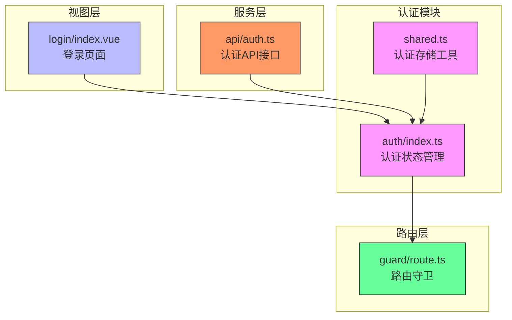
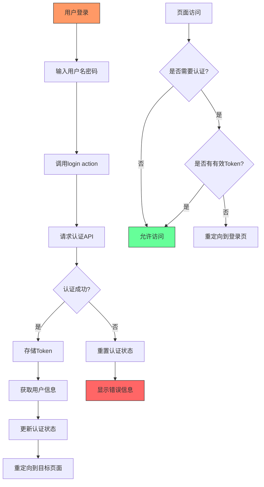
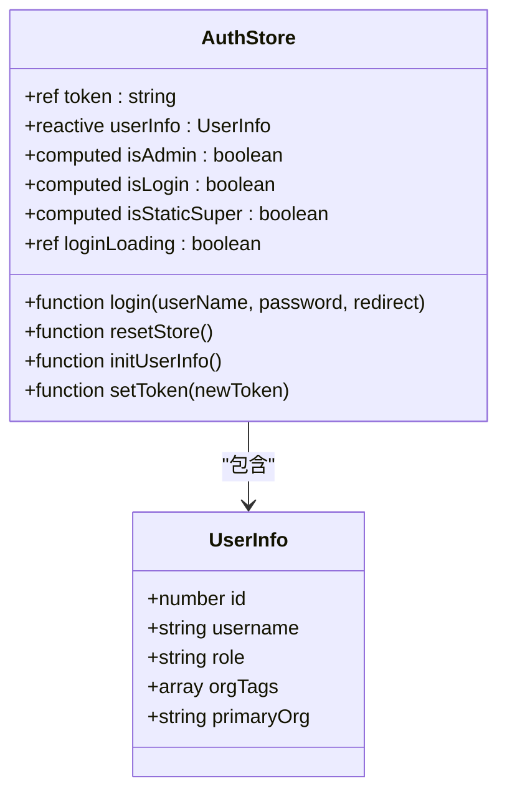
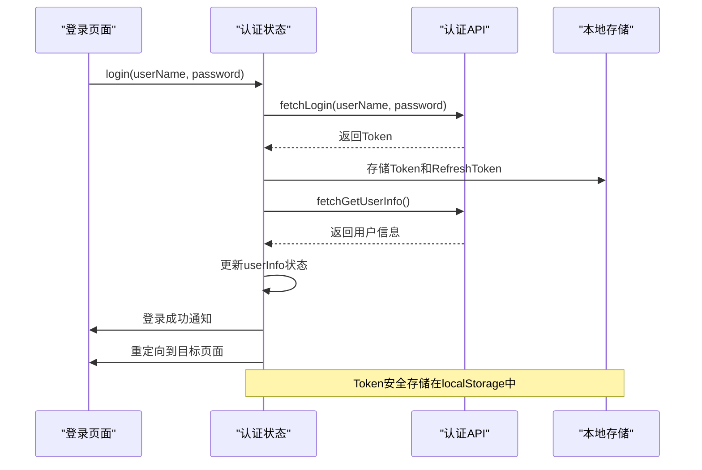
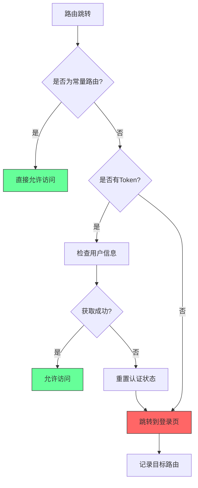
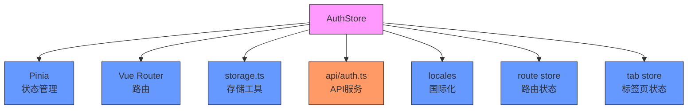

# 认证状态模块

<cite>
**本文档引用的文件**   
- [auth.ts](file://frontend/src/store/modules/auth/index.ts)
- [shared.ts](file://frontend/src/store/modules/auth/shared.ts)
- [login.vue](file://frontend/src/views/_builtin/login/index.vue)
- [api/auth.ts](file://frontend/src/service/api/auth.ts)
- [auth.ts](file://frontend/src/hooks/business/auth.ts)
- [route.ts](file://frontend/src/router/guard/route.ts)
</cite>

## 目录
1. [简介](#简介)
2. [项目结构](#项目结构)
3. [核心组件](#核心组件)
4. [架构概览](#架构概览)
5. [详细组件分析](#详细组件分析)
6. [依赖分析](#依赖分析)
7. [性能考虑](#性能考虑)
8. [故障排除指南](#故障排除指南)
9. [结论](#结论)

## 简介
本文档详细说明了PaiSmart项目的认证状态模块如何管理用户认证状态，包括token、用户信息、权限码等敏感数据的存储与更新机制。文档解析了权限校验工具函数及其在路由守卫中的应用，分析了登录、登出、刷新token等核心操作的实现流程，强调了安全存储与状态同步机制。通过结合登录页面和认证服务层代码，演示了完整的认证状态流转过程，并说明了该模块与路由守卫的集成方式。

## 项目结构
认证状态模块主要由以下几个部分组成：
- **store/modules/auth**: 包含认证状态的核心逻辑，使用Pinia进行状态管理
- **views/_builtin/login**: 登录页面的UI组件和交互逻辑
- **service/api/auth.ts**: 定义与后端认证接口的通信
- **hooks/business/auth.ts**: 业务相关的认证hook
- **router/guard/route.ts**: 路由守卫，负责认证拦截和权限控制



**图示来源**
- [auth.ts](file://frontend/src/store/modules/auth/index.ts)
- [shared.ts](file://frontend/src/store/modules/auth/shared.ts)
- [login.vue](file://frontend/src/views/_builtin/login/index.vue)
- [api/auth.ts](file://frontend/src/service/api/auth.ts)
- [route.ts](file://frontend/src/router/guard/route.ts)

**本节来源**
- [auth.ts](file://frontend/src/store/modules/auth/index.ts)
- [project_structure](file://project_structure)

## 核心组件

认证状态模块的核心组件包括：
- **useAuthStore**: 使用Pinia定义的认证状态存储，管理token、用户信息、权限等敏感数据
- **getToken/clearAuthStorage**: 在shared.ts中定义的认证存储工具函数，用于获取和清除认证信息
- **login action**: 处理用户登录流程，包括凭证验证、token存储、用户信息获取等
- **路由守卫**: 在用户访问受保护路由时进行认证状态检查

这些组件共同构成了一个完整的认证状态管理系统，确保了用户认证信息的安全存储和状态同步。

**本节来源**
- [auth.ts](file://frontend/src/store/modules/auth/index.ts)
- [shared.ts](file://frontend/src/store/modules/auth/shared.ts)

## 架构概览



**图示来源**
- [auth.ts](file://frontend/src/store/modules/auth/index.ts)
- [route.ts](file://frontend/src/router/guard/route.ts)

## 详细组件分析

### 认证状态管理分析

#### 状态定义
认证状态模块使用Pinia进行状态管理，定义了以下核心状态：



**图示来源**
- [auth.ts](file://frontend/src/store/modules/auth/index.ts#L15-L50)

#### 登录流程分析


**图示来源**
- [auth.ts](file://frontend/src/store/modules/auth/index.ts#L80-L150)
- [api/auth.ts](file://frontend/src/service/api/auth.ts)

#### 权限校验工具函数
在shared.ts文件中定义了两个关键的权限校验工具函数：

```typescript
/** 获取Token */
export function getToken() {
  return localStg.get('token') || '';
}

/** 清除认证存储 */
export function clearAuthStorage() {
  localStg.remove('token');
  localStg.remove('refreshToken');
}
```

这些工具函数提供了对认证信息的安全访问和清除操作，确保了敏感数据的统一管理。

**本节来源**
- [shared.ts](file://frontend/src/store/modules/auth/shared.ts#L3-L12)

### 路由守卫集成分析

认证状态模块与路由守卫紧密集成，确保只有经过认证的用户才能访问受保护的路由。



**图示来源**
- [route.ts](file://frontend/src/router/guard/route.ts)
- [auth.ts](file://frontend/src/store/modules/auth/index.ts)

## 依赖分析



**图示来源**
- [auth.ts](file://frontend/src/store/modules/auth/index.ts)
- [package.json](file://frontend/package.json)

**本节来源**
- [auth.ts](file://frontend/src/store/modules/auth/index.ts)

## 性能考虑
认证状态模块在设计时考虑了以下性能优化：
- 使用Pinia进行状态管理，确保状态变更的响应式更新
- 在登录成功后一次性获取用户信息，减少API调用次数
- 使用本地存储缓存认证信息，避免重复登录
- 在用户切换时清除不必要的标签页，减少内存占用

## 故障排除指南
当认证状态出现问题时，可以按照以下步骤进行排查：

1. **检查Token存储**: 确认localStorage中是否正确存储了token和refreshToken
2. **验证API响应**: 检查认证API是否返回了正确的用户信息
3. **查看状态更新**: 确认useAuthStore中的状态是否正确更新
4. **检查路由守卫**: 验证路由守卫是否正确拦截了未认证的访问

**本节来源**
- [auth.ts](file://frontend/src/store/modules/auth/index.ts)
- [route.ts](file://frontend/src/router/guard/route.ts)

## 结论
认证状态模块通过Pinia状态管理、本地存储和路由守卫的协同工作，实现了安全可靠的用户认证机制。模块设计考虑了安全性、性能和用户体验，为整个应用提供了稳定的认证基础。通过清晰的状态管理、安全的存储机制和完善的错误处理，确保了用户认证流程的顺畅和安全。