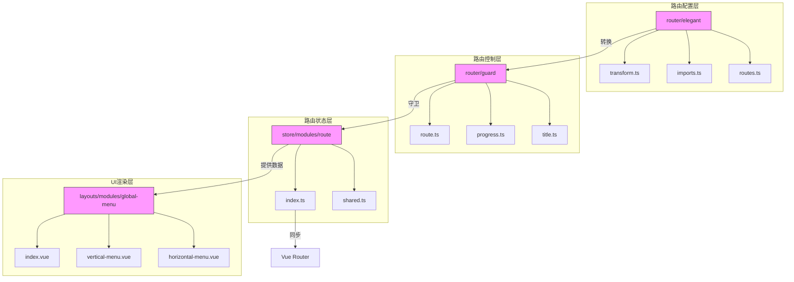
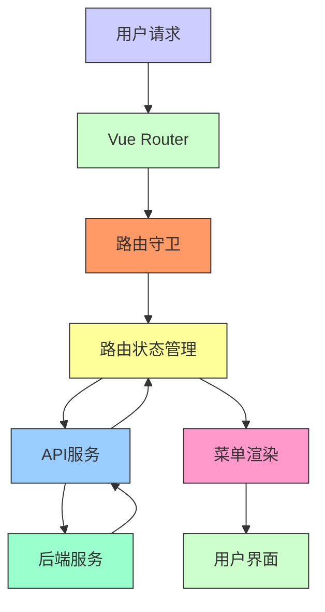
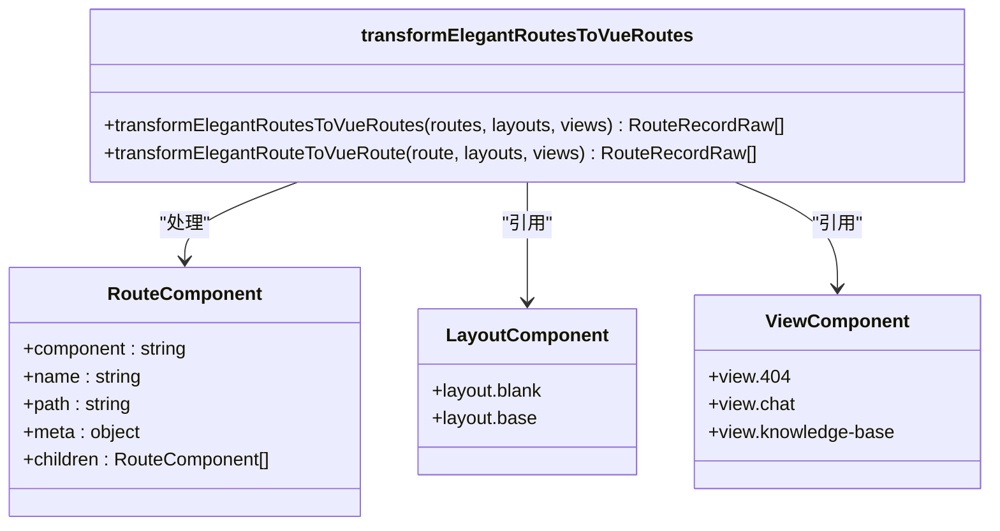
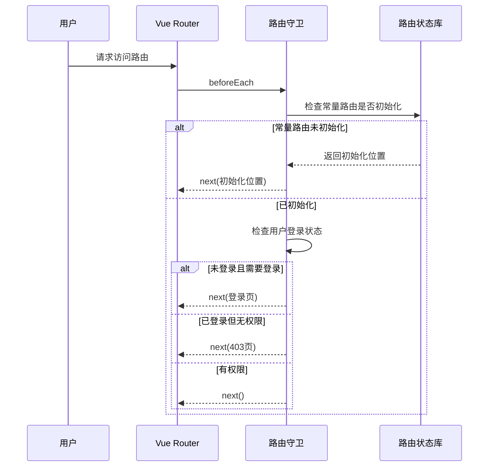
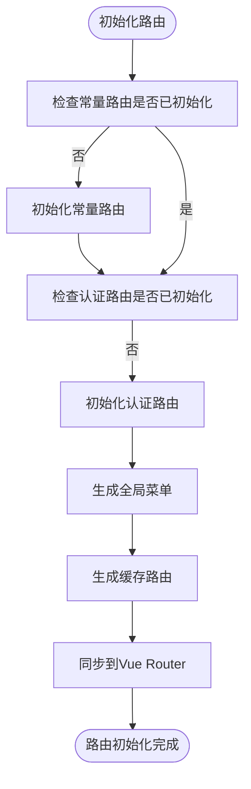
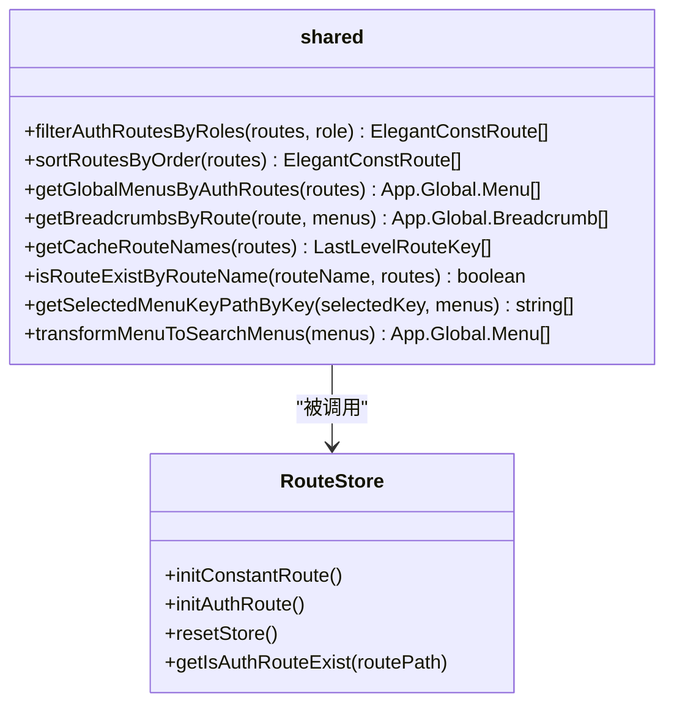
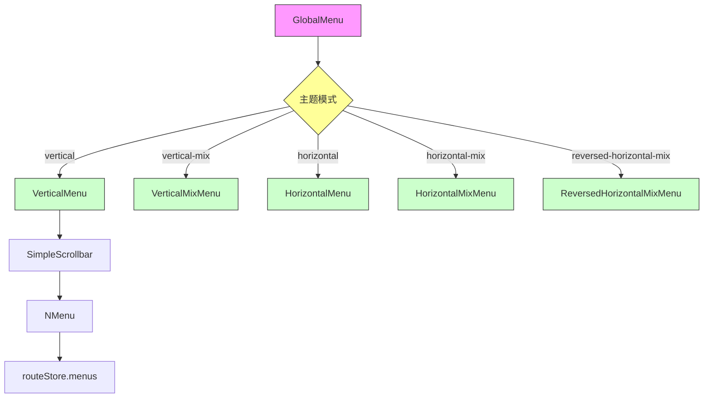
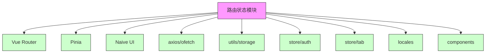

# 路由状态模块

<cite>
**本文档引用的文件**   
- [index.ts](file://frontend/src/router/index.ts)
- [routes/index.ts](file://frontend/src/router/routes/index.ts)
- [elegant/transform.ts](file://frontend/src/router/elegant/transform.ts)
- [guard/route.ts](file://frontend/src/router/guard/route.ts)
- [modules/route/index.ts](file://frontend/src/store/modules/route/index.ts)
- [modules/route/shared.ts](file://frontend/src/store/modules/route/shared.ts)
- [modules/global-menu/index.vue](file://frontend/src/layouts/modules/global-menu/index.vue)
- [modules/vertical-menu.vue](file://frontend/src/layouts/modules/global-menu/modules/vertical-menu.vue)
- [base-layout/index.vue](file://frontend/src/layouts/base-layout/index.vue)
- [api/route.ts](file://frontend/src/service/api/route.ts)
- [build/plugins/router.ts](file://frontend/build/plugins/router.ts)
</cite>

## 目录
1. [引言](#引言)
2. [项目结构](#项目结构)
3. [核心组件](#核心组件)
4. [架构概览](#架构概览)
5. [详细组件分析](#详细组件分析)
6. [依赖分析](#依赖分析)
7. [性能考虑](#性能考虑)
8. [故障排除指南](#故障排除指南)
9. [结论](#结论)

## 引言
本文档详细说明了PaiSmart项目中路由状态模块的实现机制，重点分析了`route`模块如何动态管理路由状态，包括权限路由、菜单结构、当前路由信息等。文档解析了`shared.ts`中路由处理工具函数的作用，如路由扁平化、权限过滤等，并深入分析了根据用户权限动态生成路由表的流程，以及与Vue Router实例的同步机制。通过结合`global-menu`和`base-layout`组件，展示了路由状态在UI渲染中的实际应用。

## 项目结构
路由模块主要分布在`frontend/src/router`和`frontend/src/store/modules/route`目录下，形成了一个完整的路由管理系统。该系统通过分层设计，将路由配置、状态管理、UI渲染分离，实现了高内聚低耦合的架构。

**图示来源**
- [transform.ts](file://frontend/src/router/elegant/transform.ts)
- [route.ts](file://frontend/src/router/guard/route.ts)
- [index.ts](file://frontend/src/store/modules/route/index.ts)
- [index.vue](file://frontend/src/layouts/modules/global-menu/index.vue)

**本节来源**
- [frontend/src/router](file://frontend/src/router)
- [frontend/src/store/modules/route](file://frontend/src/store/modules/route)

## 核心组件
路由状态模块的核心组件包括路由配置、路由守卫、路由状态存储和菜单渲染组件。这些组件协同工作，实现了动态路由管理和权限控制。

**本节来源**
- [index.ts](file://frontend/src/router/index.ts#L0-L30)
- [index.ts](file://frontend/src/store/modules/route/index.ts#L0-L29)

## 架构概览
路由状态管理采用分层架构，从下至上分为路由配置层、路由控制层、路由状态层和UI渲染层。这种分层设计使得系统各部分职责清晰，便于维护和扩展。

**图示来源**
- [index.ts](file://frontend/src/router/index.ts#L0-L30)
- [route.ts](file://frontend/src/router/guard/route.ts#L0-L50)
- [index.ts](file://frontend/src/store/modules/route/index.ts#L0-L29)

## 详细组件分析

### 路由配置与转换分析
路由配置采用`elegant-router`方案，通过约定式路由自动生成路由配置。`transform.ts`文件中的`transformElegantRoutesToVueRoutes`函数负责将优雅路由转换为Vue Router可识别的路由格式。

**图示来源**
- [elegant/transform.ts](file://frontend/src/router/elegant/transform.ts#L0-L41)

**本节来源**
- [elegant/transform.ts](file://frontend/src/router/elegant/transform.ts#L0-L197)

### 路由守卫与权限控制分析
路由守卫机制通过`createRouteGuard`函数实现，它在路由跳转前进行权限验证，确保用户只能访问其权限范围内的路由。

**图示来源**
- [guard/route.ts](file://frontend/src/router/guard/route.ts#L0-L50)

**本节来源**
- [guard/route.ts](file://frontend/src/router/guard/route.ts#L0-L192)

### 路由状态管理分析
路由状态管理使用Pinia存储，`useRouteStore`是核心状态管理器，负责管理路由的初始化、权限过滤、菜单生成等。

**图示来源**
- [modules/route/index.ts](file://frontend/src/store/modules/route/index.ts#L0-L29)

**本节来源**
- [modules/route/index.ts](file://frontend/src/store/modules/route/index.ts#L0-L348)

### 路由工具函数分析
`shared.ts`文件提供了多个路由处理工具函数，包括权限过滤、菜单生成、面包屑生成等，这些函数是路由状态管理的核心工具。

**图示来源**
- [modules/route/shared.ts](file://frontend/src/store/modules/route/shared.ts#L0-L41)

**本节来源**
- [modules/route/shared.ts](file://frontend/src/store/modules/route/shared.ts#L0-L335)

### 菜单渲染分析
全局菜单组件根据主题模式动态渲染不同的菜单布局，实现了垂直菜单、水平菜单等多种布局方式。

**图示来源**
- [modules/global-menu/index.vue](file://frontend/src/layouts/modules/global-menu/index.vue#L0-L37)

**本节来源**
- [modules/global-menu/index.vue](file://frontend/src/layouts/modules/global-menu/index.vue#L0-L37)
- [modules/vertical-menu.vue](file://frontend/src/layouts/modules/global-menu/modules/vertical-menu.vue#L0-L69)

## 依赖分析
路由状态模块依赖于多个外部组件和内部模块，形成了复杂的依赖关系网络。

**图示来源**
- [index.ts](file://frontend/src/store/modules/route/index.ts#L0-L29)
- [base-layout/index.vue](file://frontend/src/layouts/base-layout/index.vue#L0-L148)

**本节来源**
- [index.ts](file://frontend/src/store/modules/route/index.ts#L0-L29)
- [base-layout/index.vue](file://frontend/src/layouts/base-layout/index.vue#L0-L148)

## 性能考虑
路由状态模块在性能方面做了多项优化，包括路由懒加载、菜单缓存、权限预加载等。

1. **路由懒加载**: 使用动态导入实现路由组件的懒加载，减少初始加载时间。
2. **菜单缓存**: 将生成的菜单结构缓存到Pinia状态库中，避免重复计算。
3. **权限预加载**: 在用户登录后预加载权限路由，提高后续路由跳转的响应速度。
4. **路由过滤优化**: 使用Map数据结构存储路由，提高路由查找效率。

**本节来源**
- [index.ts](file://frontend/src/store/modules/route/index.ts#L31-L78)
- [shared.ts](file://frontend/src/store/modules/route/shared.ts#L0-L335)

## 故障排除指南
### 常见问题及解决方案

**问题1: 路由无法访问，跳转到404页面**
- **可能原因**: 常量路由未正确初始化
- **解决方案**: 检查`initConstantRoute`函数的执行情况，确保常量路由已正确加载

**问题2: 权限路由未显示**
- **可能原因**: 用户角色与路由权限不匹配
- **解决方案**: 检查`filterAuthRoutesByRoles`函数的过滤逻辑，确认用户角色和路由权限配置

**问题3: 菜单无法展开**
- **可能原因**: `expandedKeys`未正确更新
- **解决方案**: 检查`updateExpandedKeys`函数的执行逻辑，确保选中菜单路径正确计算

**问题4: 动态路由加载失败**
- **可能原因**: API接口返回数据格式不正确
- **解决方案**: 检查`fetchGetUserRoutes`接口返回数据，确保符合预期格式

**本节来源**
- [guard/route.ts](file://frontend/src/router/guard/route.ts#L52-L97)
- [index.ts](file://frontend/src/store/modules/route/index.ts#L0-L348)
- [api/route.ts](file://frontend/src/service/api/route.ts#L0-L20)

## 结论
PaiSmart项目的路由状态模块采用分层架构设计，通过`elegant-router`方案实现了约定式路由配置，结合Pinia状态管理实现了动态路由权限控制。系统通过路由守卫机制确保了访问安全性，通过菜单组件实现了灵活的UI渲染。整体设计具有良好的可维护性和扩展性，为项目的权限管理和导航系统提供了坚实的基础。