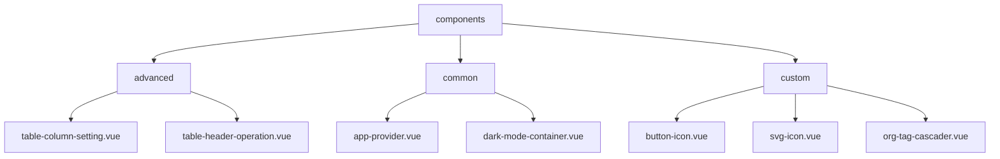
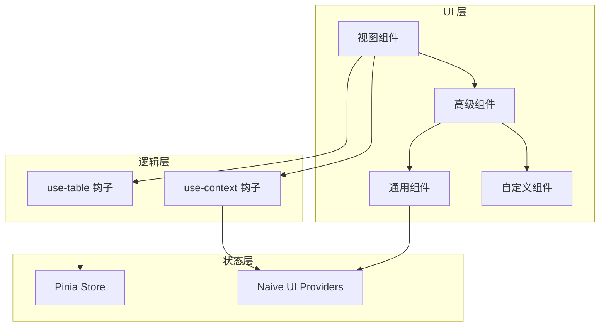
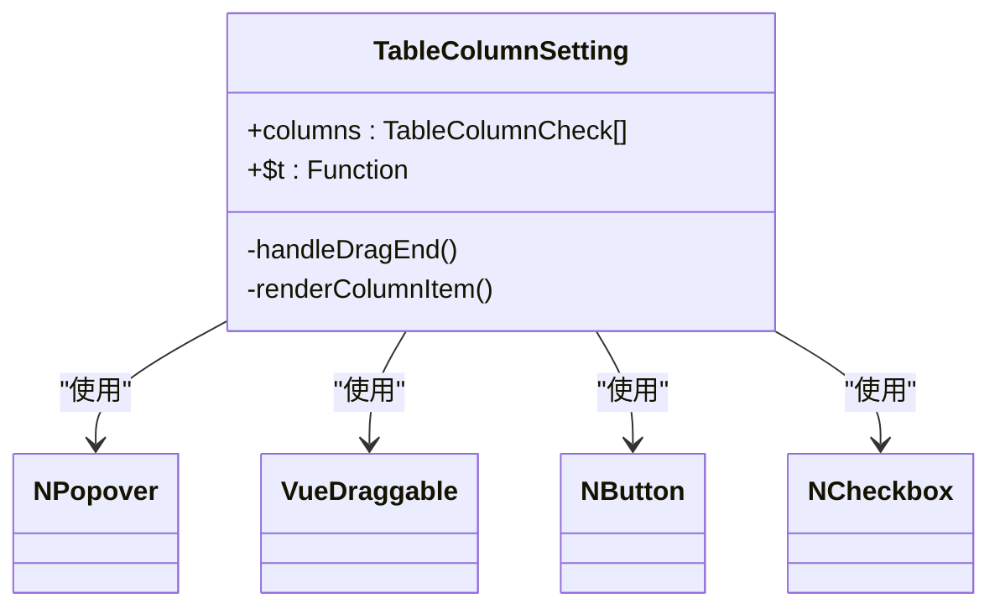
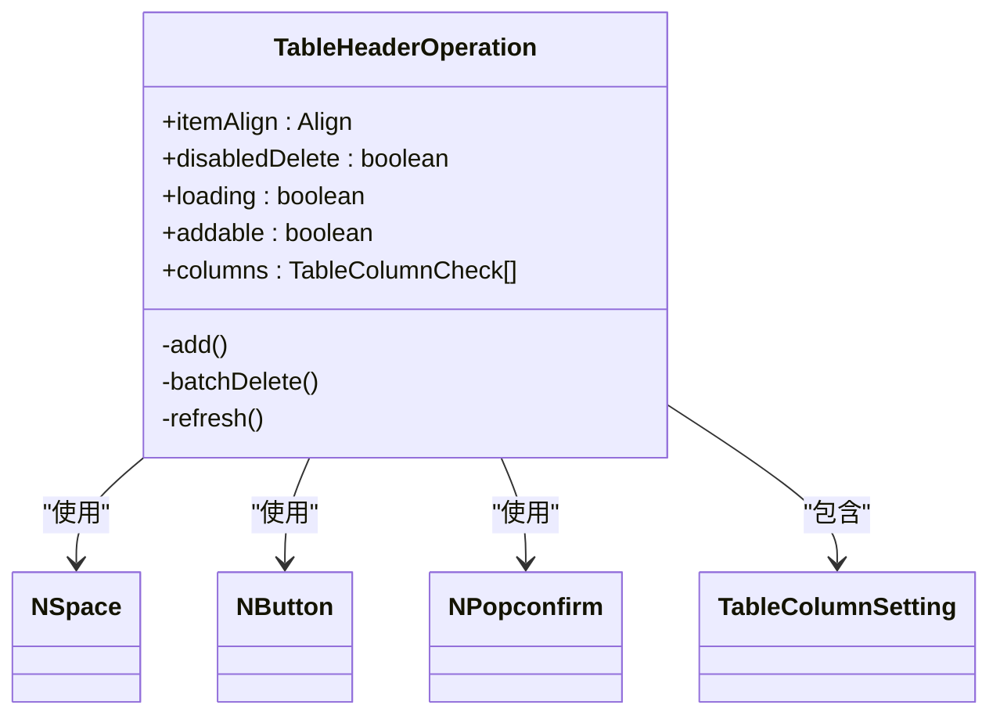
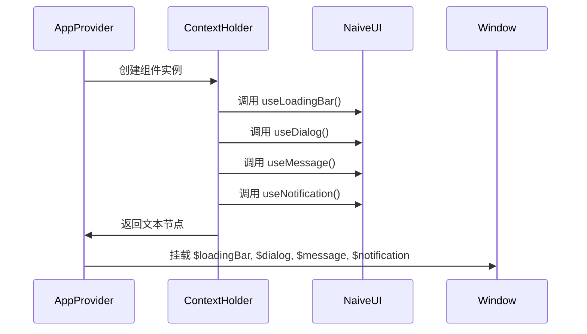
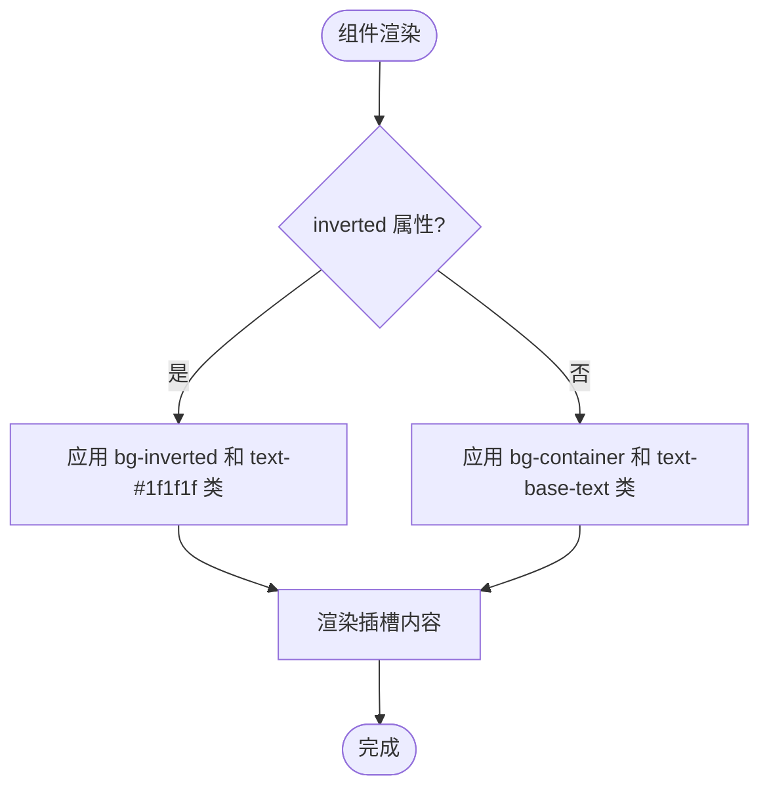
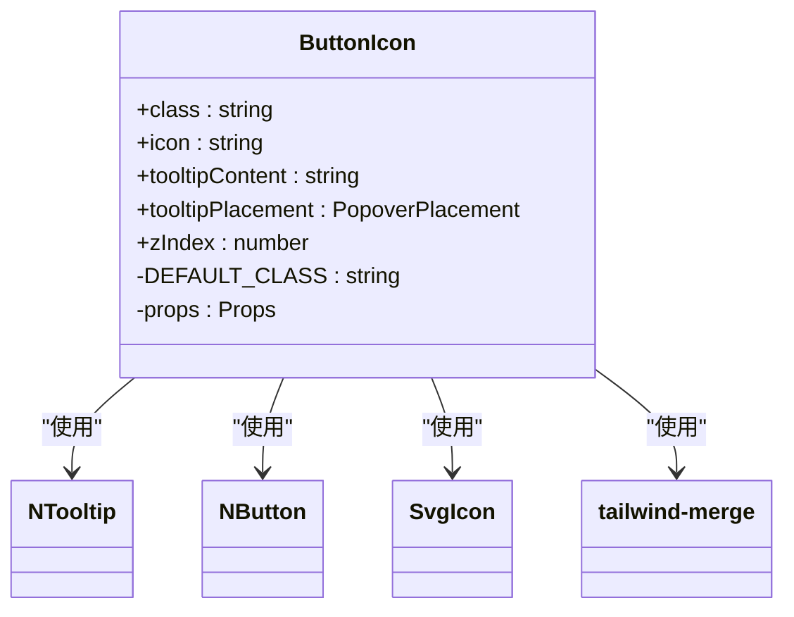
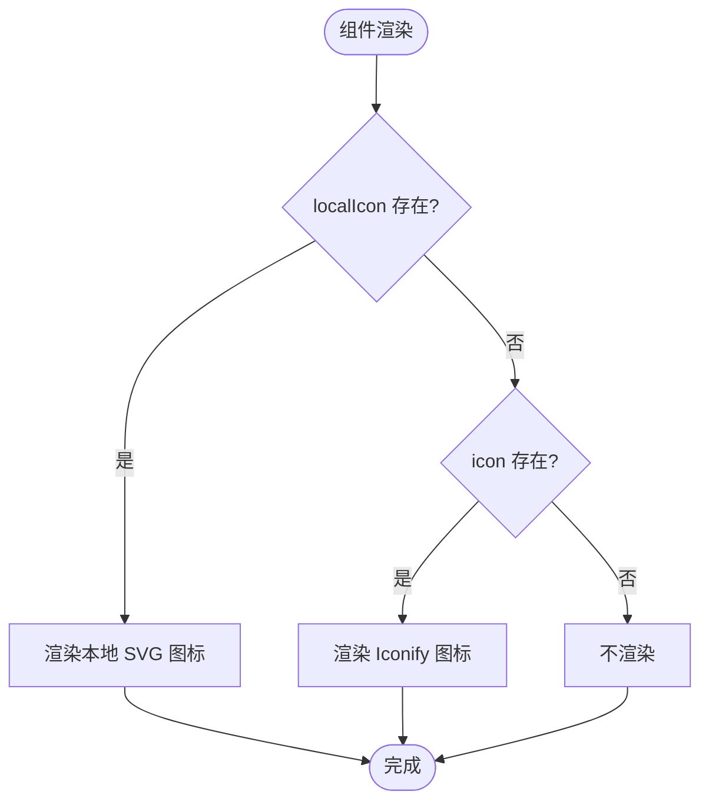
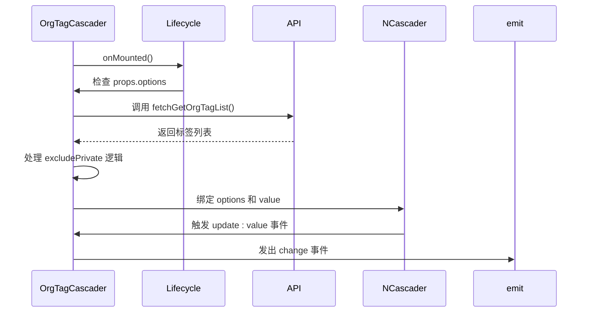
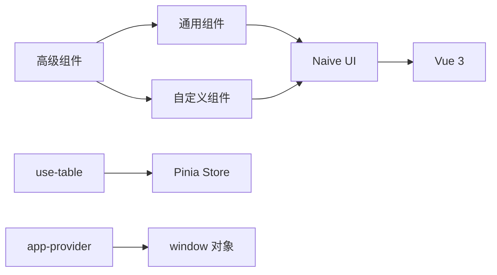

# 组件体系

<cite>
**本文档引用的文件**  
- [table-column-setting.vue](file://frontend/src/components/advanced/table-column-setting.vue)
- [table-header-operation.vue](file://frontend/src/components/advanced/table-header-operation.vue)
- [app-provider.vue](file://frontend/src/components/common/app-provider.vue)
- [dark-mode-container.vue](file://frontend/src/components/common/dark-mode-container.vue)
- [button-icon.vue](file://frontend/src/components/custom/button-icon.vue)
- [svg-icon.vue](file://frontend/src/components/custom/svg-icon.vue)
- [org-tag-cascader.vue](file://frontend/src/components/custom/org-tag-cascader.vue)
- [use-table.ts](file://packages/hooks/src/use-table.ts)
- [org-tag/index.vue](file://frontend/src/views/org-tag/index.vue)
- [user/index.vue](file://frontend/src/views/user/index.vue)
- [global-header/index.vue](file://frontend/src/layouts/modules/global-header/index.vue)
- [theme/shared.ts](file://frontend/src/store/modules/theme/shared.ts)
</cite>

## 目录
1. [引言](#引言)
2. [项目结构](#项目结构)
3. [核心组件](#核心组件)
4. [架构概览](#架构概览)
5. [详细组件分析](#详细组件分析)
6. [依赖分析](#依赖分析)
7. [性能考量](#性能考量)
8. [故障排除指南](#故障排除指南)
9. [结论](#结论)

## 引言

本文档旨在深入解析前端组件体系的三层分类架构：高级组件（advanced）、通用组件（common）和自定义组件（custom）。通过分析具体实现，阐述各层级组件的设计目的、复用场景及最佳实践。文档将结合实际代码示例，展示组件在视图中的集成方式，并说明如何通过二次封装实现设计系统统一。

## 项目结构

前端组件体系按照功能和复用性分为三个层级目录：`advanced`、`common` 和 `custom`，分别存放高级功能组件、通用基础组件和业务定制组件。

**图示来源**
- [table-column-setting.vue](file://frontend/src/components/advanced/table-column-setting.vue)
- [app-provider.vue](file://frontend/src/components/common/app-provider.vue)
- [button-icon.vue](file://frontend/src/components/custom/button-icon.vue)

**本节来源**
- [frontend/src/components](file://frontend/src/components)

## 核心组件

前端组件体系采用分层设计，将组件划分为三个层级：高级组件（advanced）、通用组件（common）和自定义组件（custom），以实现关注点分离和代码复用。

**本节来源**
- [frontend/src/components](file://frontend/src/components)

## 架构概览

系统采用分层组件架构，通过 `app-provider` 提供全局上下文，`dark-mode-container` 管理主题状态，`use-table` 钩子统一数据处理逻辑，各层级组件协同工作。

**图示来源**
- [use-table.ts](file://packages/hooks/src/use-table.ts)
- [app-provider.vue](file://frontend/src/components/common/app-provider.vue)

## 详细组件分析

### 高级组件分析

#### table-column-setting 组件

`table-column-setting` 组件提供表格列的动态配置功能，支持列的显示/隐藏和拖拽排序。

**图示来源**
- [table-column-setting.vue](file://frontend/src/components/advanced/table-column-setting.vue)

**本节来源**
- [table-column-setting.vue](file://frontend/src/components/advanced/table-column-setting.vue)

#### table-header-operation 组件

`table-header-operation` 组件封装了表格头部的常用操作按钮，包括新增、批量删除和刷新。

**图示来源**
- [table-header-operation.vue](file://frontend/src/components/advanced/table-header-operation.vue)

**本节来源**
- [table-header-operation.vue](file://frontend/src/components/advanced/table-header-operation.vue)

### 通用组件分析

#### app-provider 组件

`app-provider` 组件作为应用全局状态注入的核心，通过 `defineComponent` 创建一个不可见的上下文持有者，将 Naive UI 的全局实例挂载到 `window` 对象上。

**图示来源**
- [app-provider.vue](file://frontend/src/components/common/app-provider.vue)

**本节来源**
- [app-provider.vue](file://frontend/src/components/common/app-provider.vue)

#### dark-mode-container 组件

`dark-mode-container` 组件通过 CSS 类切换实现暗黑模式，根据 `inverted` 属性决定容器的背景和文字颜色。

**图示来源**
- [dark-mode-container.vue](file://frontend/src/components/common/dark-mode-container.vue)

**本节来源**
- [dark-mode-container.vue](file://frontend/src/components/common/dark-mode-container.vue)

### 自定义组件分析

#### button-icon 组件

`button-icon` 组件封装了带图标的按钮，支持 Tooltip 提示和自定义样式，通过 `twMerge` 合并类名。

**图示来源**
- [button-icon.vue](file://frontend/src/components/custom/button-icon.vue)

**本节来源**
- [button-icon.vue](file://frontend/src/components/custom/button-icon.vue)

#### svg-icon 组件

`svg-icon` 组件支持 Iconify 图标和本地 SVG 图标，优先渲染本地图标，通过 `xlink:href` 引用 SVG 符号。

**图示来源**
- [svg-icon.vue](file://frontend/src/components/custom/svg-icon.vue)

**本节来源**
- [svg-icon.vue](file://frontend/src/components/custom/svg-icon.vue)

#### org-tag-cascader 组件

`org-tag-cascader` 组件封装了组织标签的级联选择器，支持动态加载选项和排除私有标签。

**图示来源**
- [org-tag-cascader.vue](file://frontend/src/components/custom/org-tag-cascader.vue)

**本节来源**
- [org-tag-cascader.vue](file://frontend/src/components/custom/org-tag-cascader.vue)

## 依赖分析

组件体系依赖 Naive UI 作为基础 UI 库，通过二次封装实现设计系统统一。`app-provider` 依赖 Naive UI 的 Provider 组件，`svg-icon` 依赖 Iconify，`use-table` 钩子依赖 `@sa/hooks` 包。

**图示来源**
- [app-provider.vue](file://frontend/src/components/common/app-provider.vue)
- [svg-icon.vue](file://frontend/src/components/custom/svg-icon.vue)
- [use-table.ts](file://packages/hooks/src/use-table.ts)

**本节来源**
- [frontend/src/components](file://frontend/src/components)
- [packages/hooks/src/use-table.ts](file://packages/hooks/src/use-table.ts)

## 性能考量

组件体系通过以下方式优化性能：
- 使用 `v-model` 双向绑定减少状态同步开销
- 通过 `computed` 属性缓存计算结果
- 利用 `reactive` 和 `ref` 实现响应式数据
- 在 `onMounted` 阶段进行异步数据加载
- 使用 `effectScope` 管理副作用生命周期

## 故障排除指南

### 常见问题

1. **图标不显示**：检查 `VITE_ICON_LOCAL_PREFIX` 环境变量配置和 SVG Sprite 文件
2. **暗黑模式失效**：确保 `dark-mode-container` 组件正确应用了 `inverted` 属性
3. **全局方法不可用**：确认 `app-provider` 已在应用根组件中正确包裹
4. **级联选择器数据为空**：检查 `fetchGetOrgTagList` API 是否返回正确数据格式

**本节来源**
- [svg-icon.vue](file://frontend/src/components/custom/svg-icon.vue)
- [dark-mode-container.vue](file://frontend/src/components/common/dark-mode-container.vue)
- [app-provider.vue](file://frontend/src/components/common/app-provider.vue)
- [org-tag-cascader.vue](file://frontend/src/components/custom/org-tag-cascader.vue)

## 结论

本文档详细解析了前端组件体系的三层架构设计。高级组件封装复杂业务逻辑，通用组件提供全局状态和基础功能，自定义组件满足特定业务需求。通过 `app-provider` 实现全局上下文注入，`dark-mode-container` 管理主题状态，`use-table` 钩子统一数据处理。组件间通过 `v-model`、事件和插槽进行通信，实现了高内聚、低耦合的设计目标。建议在开发中遵循此架构模式，确保代码的可维护性和可扩展性。