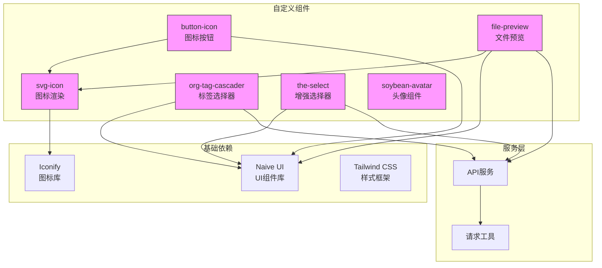
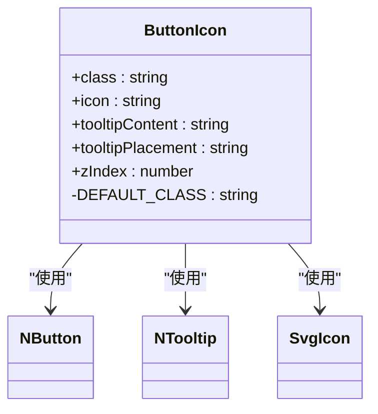
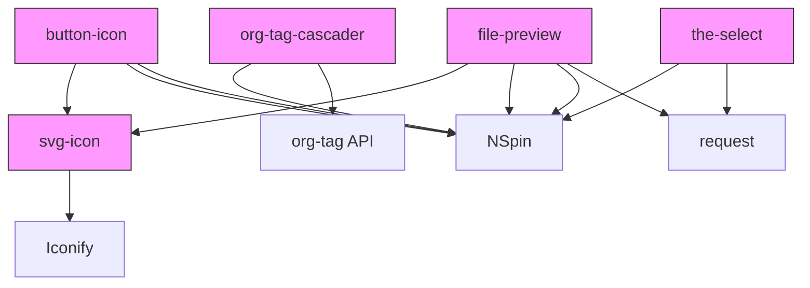

# 自定义业务组件

<cite>
**本文档引用的文件**   
- [svg-icon.vue](file://frontend/src/components/custom/svg-icon.vue)
- [button-icon.vue](file://frontend/src/components/custom/button-icon.vue)
- [org-tag-cascader.vue](file://frontend/src/components/custom/org-tag-cascader.vue)
- [the-select.vue](file://frontend/src/components/custom/the-select.vue)
- [soybean-avatar.vue](file://frontend/src/components/custom/soybean-avatar.vue)
- [file-preview.vue](file://frontend/src/components/custom/file-preview.vue)
- [org-tag.ts](file://frontend/src/service/api/org-tag.ts)
- [vite-env.d.ts](file://frontend/src/typings/vite-env.d.ts)
- [DocumentController.java](file://src/main/java/com/yizhaoqi/smartpai/controller/DocumentController.java)
- [org-tag-operate-dialog.vue](file://frontend/src/views/org-tag/modules/org-tag-operate-dialog.vue)
- [index.vue](file://frontend/src/views/org-tag/index.vue)
</cite>

## 目录
1. [引言](#引言)
2. [核心组件分析](#核心组件分析)
3. [架构概览](#架构概览)
4. [详细组件分析](#详细组件分析)
5. [依赖分析](#依赖分析)
6. [性能考量](#性能考量)
7. [故障排除指南](#故障排除指南)
8. [结论](#结论)

## 引言
本文档系统阐述了PaiSmart项目中自定义业务组件的封装原则与复用价值。通过深入分析svg-icon、button-icon、org-tag-cascader、the-select、soybean-avatar和file-preview等核心组件，揭示了其在实际业务场景中的应用模式、技术实现细节和设计哲学。这些组件不仅提升了开发效率，还确保了用户界面的一致性和可维护性。

## 核心组件分析
本文档分析的核心组件包括：svg-icon（轻量级图标渲染）、button-icon（带图标的按钮）、org-tag-cascader（组织标签级联选择器）、the-select（增强型选择器）、soybean-avatar（头像组件）和file-preview（文件预览组件）。这些组件共同构成了前端应用的基础UI元素库。

**本文档引用的文件**   
- [svg-icon.vue](file://frontend/src/components/custom/svg-icon.vue)
- [button-icon.vue](file://frontend/src/components/custom/button-icon.vue)
- [org-tag-cascader.vue](file://frontend/src/components/custom/org-tag-cascader.vue)
- [the-select.vue](file://frontend/src/components/custom/the-select.vue)
- [soybean-avatar.vue](file://frontend/src/components/custom/soybean-avatar.vue)
- [file-preview.vue](file://frontend/src/components/custom/file-preview.vue)

## 架构概览
自定义业务组件架构基于Vue 3的组合式API，利用Naive UI作为基础UI库，并通过Iconify实现图标管理。组件通过props接收配置，通过emits触发事件，形成了清晰的输入输出接口。数据流遵循单向数据流原则，通过v-model实现双向绑定。



**图表来源** 
- [svg-icon.vue](file://frontend/src/components/custom/svg-icon.vue)
- [button-icon.vue](file://frontend/src/components/custom/button-icon.vue)
- [org-tag-cascader.vue](file://frontend/src/components/custom/org-tag-cascader.vue)
- [the-select.vue](file://frontend/src/components/custom/the-select.vue)
- [soybean-avatar.vue](file://frontend/src/components/custom/soybean-avatar.vue)
- [file-preview.vue](file://frontend/src/components/custom/file-preview.vue)

## 详细组件分析

### svg-icon组件分析
svg-icon组件是所有图标相关组件的基础，实现了基于Iconify的轻量级图标渲染。

#### 组件功能
svg-icon组件支持两种图标来源：Iconify在线图标和本地SVG图标。当同时传递`icon`和`localIcon`属性时，优先渲染本地图标。

```mermaid
classDiagram
class SvgIcon {
+icon : string
+localIcon : string
-bindAttrs : object
-symbolId : string
-renderLocalIcon : boolean
+renderLocalIcon() : boolean
}
SvgIcon --> Icon : "使用"
Icon --> "@iconify/vue" : "依赖"
```

**图表来源** 
- [svg-icon.vue](file://frontend/src/components/custom/svg-icon.vue#L1-L55)

#### 技术实现
组件通过`computed`属性计算绑定属性和图标ID。本地图标使用SVG Symbol引用机制，通过`xlink:href`引用预定义的SVG图标。

```typescript
const symbolId = computed(() => {
  const { VITE_ICON_LOCAL_PREFIX: prefix } = import.meta.env;
  const defaultLocalIcon = 'no-icon';
  const icon = props.localIcon || defaultLocalIcon;
  return `#${prefix}-${icon}`;
});
```

环境变量`VITE_ICON_LOCAL_PREFIX`在`vite-env.d.ts`中定义为`'local-icon'`，确保了本地图标ID的统一前缀。

**组件来源**
- [svg-icon.vue](file://frontend/src/components/custom/svg-icon.vue#L1-L55)
- [vite-env.d.ts](file://frontend/src/typings/vite-env.d.ts#L1-L120)

### button-icon组件分析
button-icon组件基于svg-icon构建，提供了带图标的按钮功能。

#### 组件功能
该组件封装了`NButton`和`NTooltip`，提供了一个带有图标和可选工具提示的按钮。支持通过`tooltipContent`属性设置提示文本，通过`icon`属性指定图标。



**图表来源** 
- [button-icon.vue](file://frontend/src/components/custom/button-icon.vue#L1-L48)

#### 技术实现
组件使用`tailwind-merge`库合并默认样式和自定义样式，确保样式优先级正确。图标通过默认插槽注入，优先使用`SvgIcon`组件渲染。

```vue
<template>
  <NTooltip :placement="tooltipPlacement" :z-index="zIndex" :disabled="!tooltipContent">
    <template #trigger>
      <NButton quaternary :class="twMerge(DEFAULT_CLASS, props.class)" v-bind="$attrs">
        <div class="flex-center gap-8px">
          <slot>
            <SvgIcon :icon="icon" />
          </slot>
        </div>
      </NButton>
    </template>
    {{ tooltipContent }}
  </NTooltip>
</template>
```

**组件来源**
- [button-icon.vue](file://frontend/src/components/custom/button-icon.vue#L1-L48)

### org-tag-cascader组件分析
org-tag-cascader组件用于组织标签的级联选择，是用户管理功能的核心组件。

#### 组件功能
该组件基于`NCascader`实现，支持从API获取组织标签树数据，并可选择性地过滤私有标签。通过`excludePrivate`属性控制是否禁用以`PRIVATE_`开头的私有标签。

```mermaid
classDiagram
class OrgTagCascader {
+options : Api.OrgTag.Item[]
+excludePrivate : boolean
-model : string | number | Array<number | string> | undefined | null
-opts : CascaderOption[]
+getOptions() : Promise
+onUpdate(value, option) : void
}
OrgTagCascader --> NCascader : "使用"
OrgTagCascader --> "org-tag.ts" : "依赖"
```

**图表来源** 
- [org-tag-cascader.vue](file://frontend/src/components/custom/org-tag-cascader.vue#L1-L57)
- [org-tag.ts](file://frontend/src/service/api/org-tag.ts#L1-L5)

#### 技术实现
组件在`onMounted`生命周期中获取标签数据，支持通过`props.options`传入外部数据或通过`fetchGetOrgTagList`从API获取数据。

```typescript
async function getOptions() {
  const { error, data } = await fetchGetOrgTagList();
  if (!error) opts.value = data.data as unknown as CascaderOption[];
}
```

权限过滤逻辑在获取数据后执行，通过遍历选项并设置`disabled`属性来实现：

```typescript
if (props.excludePrivate) {
  opts.value.forEach(x => {
    x.disabled = (x as unknown as Api.OrgTag.Item).tagId.startsWith('PRIVATE_');
  });
}
```

**组件来源**
- [org-tag-cascader.vue](file://frontend/src/components/custom/org-tag-cascader.vue#L1-L57)
- [org-tag.ts](file://frontend/src/service/api/org-tag.ts#L1-L5)

### the-select组件分析
the-select组件是一个增强型选择器，支持远程搜索和缓存机制。

#### 组件功能
该组件基于`NSelect`实现，支持通过`url`属性指定数据源API，自动处理远程数据获取和缓存。支持通过`params`传递查询参数，通过`keyField`指定数据字段。

```mermaid
classDiagram
class TheSelect {
+url : string
+immediate : boolean
+params : Record<string, any>
+keyField : string
+selectFirst : boolean
-model : string | number | null
-opts : Array<SelectOption | SelectGroupOption>
+fetchOpts() : Promise
+onUpdate(value, option) : void
}
TheSelect --> NSelect : "使用"
TheSelect --> "request" : "依赖"
```

**图表来源** 
- [the-select.vue](file://frontend/src/components/custom/the-select.vue#L1-L67)

#### 技术实现
组件通过`watch`监听`params`变化，自动重新获取数据。`immediate`属性控制是否在组件挂载时立即获取数据。

```typescript
watch(
  () => params,
  (newVal, oldVal) => {
    if (JSON.stringify(newVal) !== JSON.stringify(oldVal)) {
      fetchOpts();
    }
  }
);

onMounted(() => {
  if (immediate) fetchOpts();
});
```

数据获取后，根据`keyField`决定如何处理响应数据：

```typescript
if (keyField) opts.value = data[keyField];
else opts.value = data;
```

**组件来源**
- [the-select.vue](file://frontend/src/components/custom/the-select.vue#L1-L67)

### soybean-avatar组件分析
soybean-avatar组件是一个简单的头像展示组件。

#### 组件功能
该组件提供了一个圆形头像展示，使用固定的图片资源。通过CSS类实现圆形裁剪和尺寸控制。

```mermaid
classDiagram
class SoybeanAvatar {
}
SoybeanAvatar --> "soybean.jpg" : "使用"
```

**图表来源** 
- [soybean-avatar.vue](file://frontend/src/components/custom/soybean-avatar.vue#L1-L13)

#### 技术实现
组件使用简单的模板结构，通过CSS类实现样式：

```vue
<template>
  <div class="size-72px overflow-hidden rd-1/2">
    
  </div>
</template>
```

其中`size-72px`设置尺寸，`overflow-hidden`隐藏溢出内容，`rd-1/2`实现圆形边框。

**组件来源**
- [soybean-avatar.vue](file://frontend/src/components/custom/soybean-avatar.vue#L1-L13)

### file-preview组件分析
file-preview组件用于预览多种格式的文件内容，是知识库上传功能的关键组件。

#### 组件功能
该组件支持文件预览、下载和关闭操作。根据文件扩展名显示相应的图标，支持文本内容的预览。

```mermaid
classDiagram
class FilePreview {
+fileName : string
+visible : boolean
-loading : boolean
-downloading : boolean
-content : string
-error : string
+getFileIcon(fileName) : string
+loadPreviewContent() : Promise
+downloadFile() : Promise
+closePreview() : void
}
FilePreview --> SvgIcon : "使用"
FilePreview --> NSpin : "使用"
FilePreview --> NButton : "使用"
FilePreview --> "request" : "依赖"
```

**图表来源** 
- [file-preview.vue](file://frontend/src/components/custom/file-preview.vue#L1-L195)

#### 技术实现
组件通过`getFileIcon`方法根据文件扩展名返回对应的图标名称：

```typescript
function getFileIcon(fileName: string) {
  const ext = getFileExt(fileName);
  if (ext) {
    const supportedIcons = ['pdf', 'doc', 'docx', 'txt', 'md', 'jpg', 'jpeg', 'png', 'gif'];
    return supportedIcons.includes(ext.toLowerCase()) ? ext : 'dflt';
  }
  return 'dflt';
}
```

预览内容通过API获取，使用`/documents/preview`端点：

```typescript
const { error: requestError, data } = await request<{
  fileName: string;
  content: string;
  fileSize: number;
}>({
  url: '/documents/preview',
  params: {
    fileName: props.fileName,
    token: token || undefined
  }
});
```

后端`DocumentController.java`中的`getFilePreviewContent`方法处理预览请求，确保用户有权限访问文件。

**组件来源**
- [file-preview.vue](file://frontend/src/components/custom/file-preview.vue#L1-L195)
- [DocumentController.java](file://src/main/java/com/yizhaoqi/smartpai/controller/DocumentController.java#L405-L429)

## 依赖分析
自定义业务组件之间存在明确的依赖关系，形成了一个层次化的组件体系。



**图表来源** 
- [svg-icon.vue](file://frontend/src/components/custom/svg-icon.vue)
- [button-icon.vue](file://frontend/src/components/custom/button-icon.vue)
- [org-tag-cascader.vue](file://frontend/src/components/custom/org-tag-cascader.vue)
- [the-select.vue](file://frontend/src/components/custom/the-select.vue)
- [file-preview.vue](file://frontend/src/components/custom/file-preview.vue)

## 性能考量
各组件在性能方面均有优化考虑：

1. **svg-icon**: 使用SVG Symbol机制，避免重复加载相同图标
2. **the-select**: 通过`watch`监听参数变化，避免不必要的API调用
3. **file-preview**: 按需加载预览内容，仅在可见时获取数据
4. **org-tag-cascader**: 支持传入外部数据，避免重复获取

## 故障排除指南
### 常见问题及解决方案

**问题**: svg-icon无法显示本地图标
**解决方案**: 确保`VITE_ICON_LOCAL_PREFIX`环境变量正确配置，且SVG文件位于`src/assets/svg-icon/`目录下

**问题**: org-tag-cascader无法获取数据
**解决方案**: 检查`fetchGetOrgTagList`API是否正常工作，确认用户有权限访问组织标签数据

**问题**: file-preview预览失败
**解决方案**: 检查文件是否存在，确认用户有权限访问该文件，验证token是否有效

**组件来源**
- [svg-icon.vue](file://frontend/src/components/custom/svg-icon.vue)
- [org-tag-cascader.vue](file://frontend/src/components/custom/org-tag-cascader.vue)
- [file-preview.vue](file://frontend/src/components/custom/file-preview.vue)

## 结论
PaiSmart项目的自定义业务组件设计体现了良好的封装原则和复用价值。通过分层设计和清晰的接口定义，这些组件不仅提高了开发效率，还确保了应用的一致性和可维护性。svg-icon和button-icon组件构建了统一的图标体系，org-tag-cascader和the-select组件解决了复杂的业务选择需求，file-preview组件则为知识库功能提供了强大的文件预览支持。这些组件共同构成了一个健壮、可扩展的前端UI基础。