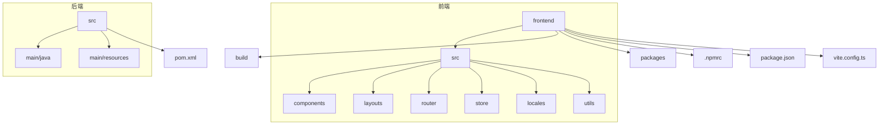
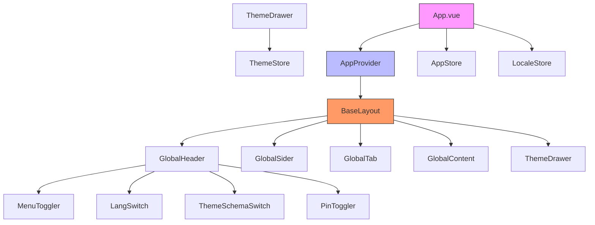
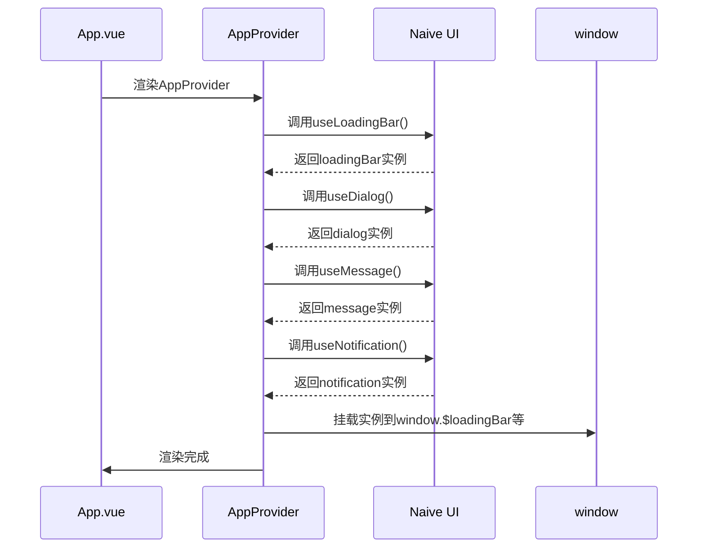
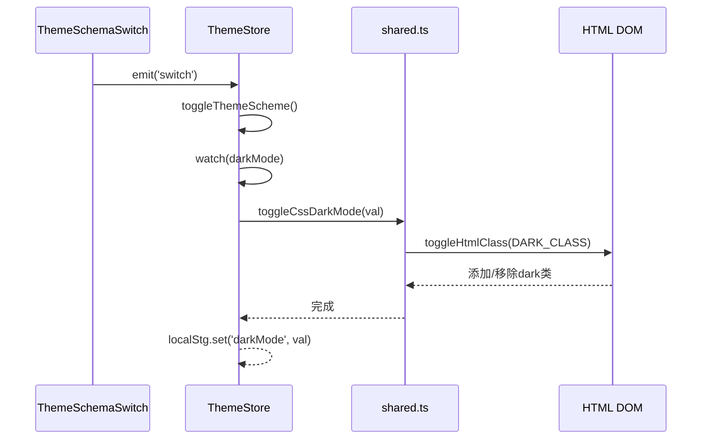
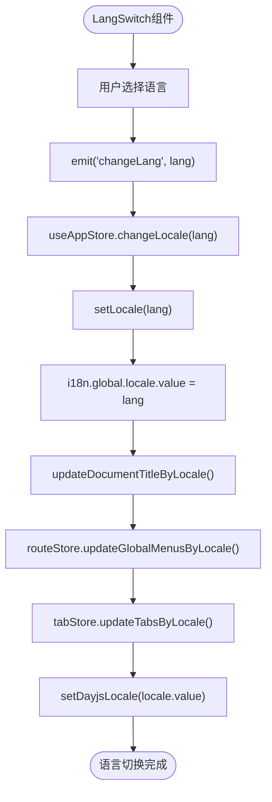
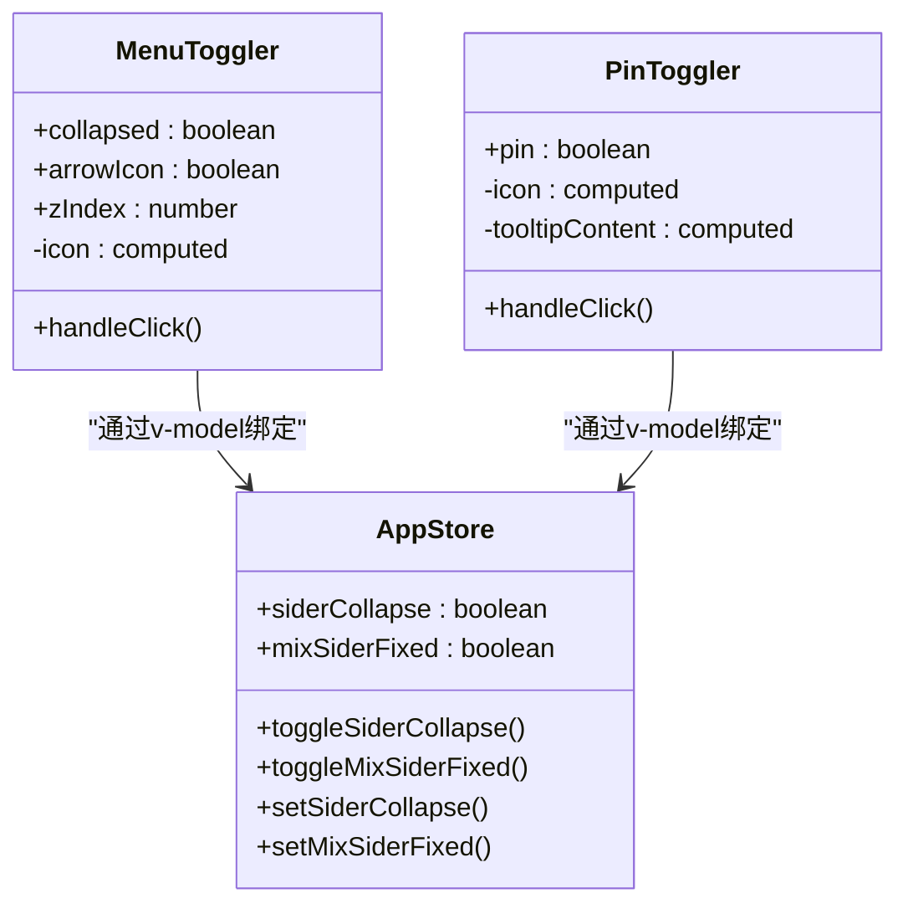
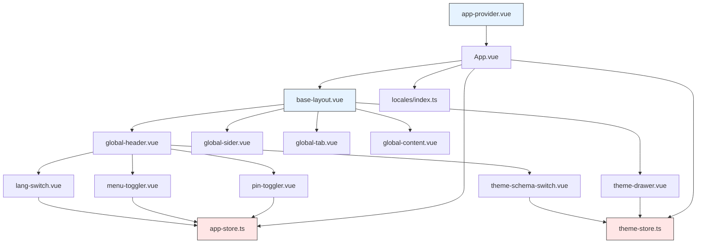

# 通用组件

<cite>
**本文档引用的文件**   
- [app-provider.vue](file://frontend/src/components/common/app-provider.vue)
- [dark-mode-container.vue](file://frontend/src/components/common/dark-mode-container.vue)
- [theme-schema-switch.vue](file://frontend/src/components/common/theme-schema-switch.vue)
- [lang-switch.vue](file://frontend/src/components/common/lang-switch.vue)
- [menu-toggler.vue](file://frontend/src/components/common/menu-toggler.vue)
- [pin-toggler.vue](file://frontend/src/components/common/pin-toggler.vue)
- [exception-base.vue](file://frontend/src/components/common/exception-base.vue)
- [base-layout/index.vue](file://frontend/src/layouts/base-layout/index.vue)
- [theme/index.ts](file://frontend/src/store/modules/theme/index.ts)
- [app/index.ts](file://frontend/src/store/modules/app/index.ts)
- [locales/index.ts](file://frontend/src/locales/index.ts)
- [shared.ts](file://frontend/src/store/modules/theme/shared.ts)
- [App.vue](file://frontend/src/App.vue)
- [main.ts](file://frontend/src/main.ts)
</cite>

## 目录
1. [简介](#简介)
2. [项目结构](#项目结构)
3. [核心组件](#核心组件)
4. [架构概览](#架构概览)
5. [详细组件分析](#详细组件分析)
6. [依赖分析](#依赖分析)
7. [性能考虑](#性能考虑)
8. [故障排除指南](#故障排除指南)
9. [结论](#结论)

## 简介
本文档全面解析了PaiSmart项目中通用UI组件在应用全局行为控制中的作用。重点阐述了`app-provider`作为根组件如何注入全局依赖，`dark-mode-container`与`theme-schema-switch`组件如何协同实现主题切换与暗色模式支持，以及`lang-switch`组件如何集成i18n实现多语言动态切换。同时分析了`menu-toggler`、`pin-toggler`等布局控制组件与store模块的联动逻辑，并阐述了`exception-base`统一异常界面的路由拦截处理方式。最后结合实际代码展示了这些组件在`base-layout`中的集成模式与样式隔离方案。

## 项目结构
该项目采用前后端分离架构，前端代码位于`frontend`目录下，后端代码位于`src`目录下。前端部分使用Vue 3框架，结合TypeScript、Vite、Pinia等现代前端技术栈构建。项目结构清晰，遵循功能模块化设计原则，主要包含组件、布局、路由、状态管理、工具函数等核心模块。



**图示来源**
- [frontend](file://frontend)
- [src](file://src)

**本节来源**
- [frontend](file://frontend)
- [src](file://src)

## 核心组件
本项目的核心UI组件主要集中在`frontend/src/components/common`目录下，这些组件作为全局行为控制的基础，贯穿整个应用的生命周期。它们通过与Pinia状态管理、i18n国际化、Naive UI组件库等技术的深度集成，实现了应用的全局配置、主题切换、语言切换、布局控制等关键功能。

**本节来源**
- [app-provider.vue](file://frontend/src/components/common/app-provider.vue)
- [dark-mode-container.vue](file://frontend/src/components/common/dark-mode-container.vue)
- [lang-switch.vue](file://frontend/src/components/common/lang-switch.vue)

## 架构概览
整个应用的架构遵循典型的MVVM模式，以Vue 3作为视图层，Pinia作为状态管理层，Vue Router作为路由管理层。`app-provider`组件作为根级依赖注入器，为全局提供Naive UI的各类工具实例。`App.vue`作为应用的根组件，通过`NConfigProvider`配置全局主题和语言，并包裹`app-provider`组件。`base-layout`作为基础布局组件，集成了头部、侧边栏、标签页、内容区等模块，并通过`theme-drawer`提供主题配置面板。



**图示来源**
- [App.vue](file://frontend/src/App.vue#L1-L59)
- [base-layout/index.vue](file://frontend/src/layouts/base-layout/index.vue#L1-L149)
- [app-provider.vue](file://frontend/src/components/common/app-provider.vue#L1-L39)

## 详细组件分析

### app-provider 组件分析
`app-provider`组件作为应用的根级依赖注入器，其核心作用是将Naive UI提供的`useLoadingBar`、`useDialog`、`useMessage`、`useNotification`等Hook实例挂载到全局`window`对象上，从而实现跨组件的便捷调用。



**图示来源**
- [app-provider.vue](file://frontend/src/components/common/app-provider.vue#L1-L39)
- [App.vue](file://frontend/src/App.vue#L1-L59)

**本节来源**
- [app-provider.vue](file://frontend/src/components/common/app-provider.vue#L1-L39)
- [App.vue](file://frontend/src/App.vue#L1-L59)

### 主题切换机制分析
主题切换功能由`theme-schema-switch`、`dark-mode-container`、`theme-store`等多个组件协同完成。`theme-schema-switch`作为用户交互入口，触发主题切换事件；`theme-store`作为状态管理中心，管理主题模式并持久化设置；`shared.ts`中的`toggleCssDarkMode`函数负责实际的CSS类切换。



**图示来源**
- [theme-schema-switch.vue](file://frontend/src/components/common/theme-schema-switch.vue#L1-L57)
- [theme/index.ts](file://frontend/src/store/modules/theme/index.ts#L1-L222)
- [shared.ts](file://frontend/src/store/modules/theme/shared.ts#L1-L260)

**本节来源**
- [theme-schema-switch.vue](file://frontend/src/components/common/theme-schema-switch.vue#L1-L57)
- [theme/index.ts](file://frontend/src/store/modules/theme/index.ts#L1-L222)
- [shared.ts](file://frontend/src/store/modules/theme/shared.ts#L1-L260)

### 多语言切换机制分析
多语言切换功能通过`lang-switch`组件与`locales`模块的紧密配合实现。`lang-switch`组件提供语言选择界面，`locales/index.ts`文件初始化Vue I18n实例，并通过`$t`函数提供翻译服务。



**图示来源**
- [lang-switch.vue](file://frontend/src/components/common/lang-switch.vue#L1-L50)
- [locales/index.ts](file://frontend/src/locales/index.ts#L1-L27)
- [app/index.ts](file://frontend/src/store/modules/app/index.ts#L1-L170)

**本节来源**
- [lang-switch.vue](file://frontend/src/components/common/lang-switch.vue#L1-L50)
- [locales/index.ts](file://frontend/src/locales/index.ts#L1-L27)
- [app/index.ts](file://frontend/src/store/modules/app/index.ts#L1-L170)

### 布局控制组件分析
`menu-toggler`和`pin-toggler`组件通过与`app-store`的双向绑定，实现对侧边栏折叠状态和固定状态的控制。`app-store`中的`useBoolean` Hook提供了便捷的状态管理能力。



**图示来源**
- [menu-toggler.vue](file://frontend/src/components/common/menu-toggler.vue#L1-L48)
- [pin-toggler.vue](file://frontend/src/components/common/pin-toggler.vue#L1-L27)
- [app/index.ts](file://frontend/src/store/modules/app/index.ts#L1-L170)

**本节来源**
- [menu-toggler.vue](file://frontend/src/components/common/menu-toggler.vue#L1-L48)
- [pin-toggler.vue](file://frontend/src/components/common/pin-toggler.vue#L1-L27)
- [app/index.ts](file://frontend/src/store/modules/app/index.ts#L1-L170)

### 异常处理组件分析
`exception-base`组件作为统一的异常界面，通过接收`type`属性来显示不同类型的错误页面（403、404、500），并提供返回首页的按钮。

```mermaid
flowchart TD
A[ExceptionBase组件] --> B{type属性}
B --> |403| C[显示无权限图标]
B --> |404| D[显示未找到图标]
B --> |500| E[显示服务错误图标]
C --> F[渲染SvgIcon]
D --> F
E --> F
F --> G[渲染返回首页按钮]
G --> H[绑定routerPushByKey('root')]
```

**图示来源**
- [exception-base.vue](file://frontend/src/components/common/exception-base.vue#L1-L44)

**本节来源**
- [exception-base.vue](file://frontend/src/components/common/exception-base.vue#L1-L44)

## 依赖分析
各通用组件之间存在清晰的依赖关系，形成了一个完整的全局控制体系。`app-provider`作为最基础的依赖注入层，被`App.vue`直接引用。`base-layout`作为核心布局组件，集成了所有其他通用组件。`theme-store`和`app-store`作为状态中心，被多个UI组件依赖。



**图示来源**
- [App.vue](file://frontend/src/App.vue#L1-L59)
- [base-layout/index.vue](file://frontend/src/layouts/base-layout/index.vue#L1-L149)
- [app-provider.vue](file://frontend/src/components/common/app-provider.vue#L1-L39)
- [theme/index.ts](file://frontend/src/store/modules/theme/index.ts#L1-L222)
- [app/index.ts](file://frontend/src/store/modules/app/index.ts#L1-L170)

**本节来源**
- [App.vue](file://frontend/src/App.vue#L1-L59)
- [base-layout/index.vue](file://frontend/src/layouts/base-layout/index.vue#L1-L149)
- [app-provider.vue](file://frontend/src/components/common/app-provider.vue#L1-L39)
- [theme/index.ts](file://frontend/src/store/modules/theme/index.ts#L1-L222)
- [app/index.ts](file://frontend/src/store/modules/app/index.ts#L1-L170)

## 性能考虑
该架构在性能方面做了多项优化：
1. **状态管理**：使用Pinia进行状态管理，避免了不必要的组件重渲染。
2. **懒加载**：`GlobalMenu`组件使用`defineAsyncComponent`进行异步加载，减少首屏加载时间。
3. **持久化**：主题和语言设置通过`localStg`（localStorage）持久化，避免重复计算。
4. **响应式设计**：通过`useBreakpoints`实现响应式布局，在移动端自动折叠侧边栏。
5. **CSS变量**：使用CSS自定义属性（CSS Variables）实现主题切换，避免了频繁的DOM操作。

## 故障排除指南
当遇到以下问题时，可参考以下解决方案：

**问题：主题切换无效**
- 检查`theme-store`中的`darkMode`计算属性是否正确响应`themeScheme`变化
- 确认`shared.ts`中的`toggleCssDarkMode`函数是否正确操作了HTML元素的class
- 验证`App.vue`中的`naiveDarkTheme`计算属性是否正确引用了`themeStore.darkMode`

**问题：语言切换后菜单未更新**
- 检查`app-store`中的`watch(locale)`回调是否正确调用了`routeStore.updateGlobalMenusByLocale()`
- 确认`locales/index.ts`中的`setLocale`函数是否正确更新了i18n实例

**问题：全局通知无法调用**
- 确认`app-provider.vue`是否正确挂载了`window.$notification`实例
- 检查`App.vue`是否正确包裹了`AppProvider`组件

**本节来源**
- [theme/index.ts](file://frontend/src/store/modules/theme/index.ts#L1-L222)
- [shared.ts](file://frontend/src/store/modules/theme/shared.ts#L1-L260)
- [App.vue](file://frontend/src/App.vue#L1-L59)
- [app-provider.vue](file://frontend/src/components/common/app-provider.vue#L1-L39)

## 结论
PaiSmart项目的通用UI组件设计精良，通过合理的架构分层和模块化设计，实现了应用的全局行为控制。`app-provider`组件解决了全局依赖注入的难题，`theme-store`和`app-store`提供了可靠的状态管理，各类切换组件通过与store的双向绑定实现了响应式交互。整个系统耦合度低、可维护性强，为后续功能扩展提供了坚实的基础。