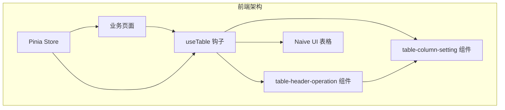
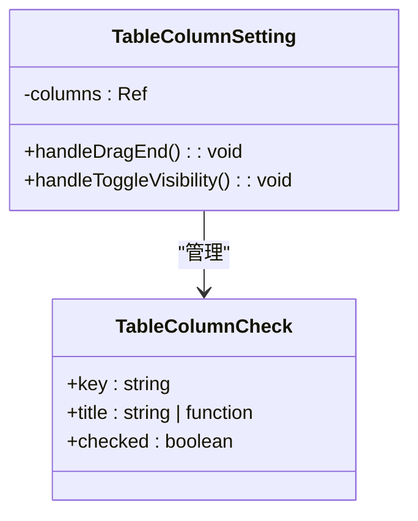
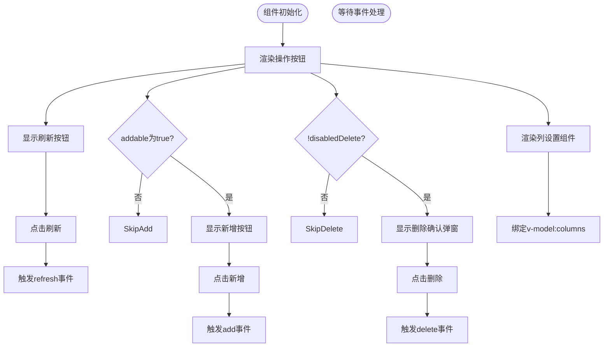
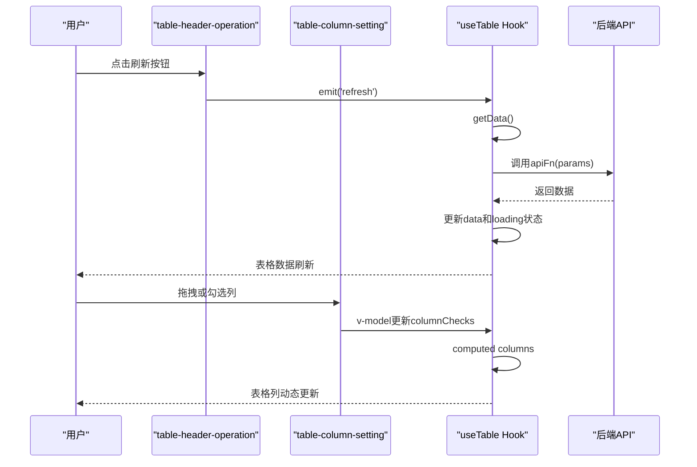

# 高级组件

<cite>
**本文档中引用的文件**   
- [table-column-setting.vue](file://frontend/src/components/advanced/table-column-setting.vue)
- [table-header-operation.vue](file://frontend/src/components/advanced/table-header-operation.vue)
- [use-table.ts](file://frontend/packages/hooks/src/use-table.ts)
- [table.ts](file://frontend/src/hooks/common/table.ts)
- [index.vue](file://frontend/src/views/user/index.vue)
- [storage.ts](file://frontend/src/utils/storage.ts)
- [shared.ts](file://frontend/src/store/modules/theme/shared.ts)
- [app.ts](file://frontend/src/store/modules/app/index.ts)
- [index.ts](file://frontend/src/store/modules/theme/index.ts)
- [naive-ui.d.ts](file://frontend/src/typings/naive-ui.d.ts)
</cite>

## 目录
1. [简介](#简介)
2. [核心组件分析](#核心组件分析)
3. [架构概览](#架构概览)
4. [详细组件分析](#详细组件分析)
5. [数据交互与状态管理](#数据交互与状态管理)
6. [实际使用示例](#实际使用示例)
7. [结论](#结论)

## 简介
本文档深入分析了 `table-column-setting` 和 `table-header-operation` 两个高级Vue组件的设计目标、业务场景及技术实现。这两个组件是构建现代化、用户友好型表格界面的核心，它们通过封装复杂的交互逻辑，极大地提升了开发效率和用户体验。文档将详细阐述 `table-column-setting` 组件如何实现表格列的动态显示/隐藏控制，并探讨其与 `Pinia` 状态管理及 `Vue` 响应式系统的集成方式。同时，解析 `table-header-operation` 组件如何在表格头部集成操作按钮、批量处理和刷新等功能。最后，通过实际代码示例展示其在业务页面中的集成方法。

## 核心组件分析

`table-column-setting` 和 `table-header-operation` 是为了解决复杂表格场景下的通用需求而设计的高级封装组件。

- **`table-column-setting` 组件**：提供了一个交互式弹窗，允许用户通过勾选复选框来控制表格中各列的显示与隐藏。它还支持通过拖拽来重新排列列的顺序，从而让用户能够根据个人偏好自定义表格视图。
- **`table-header-operation` 组件**：作为表格头部的操作栏，它集成了“新增”、“批量删除”、“刷新”等常用操作按钮，并内置了 `table-column-setting` 组件，形成一个功能完备的表格操作中心。

**Section sources**
- [table-column-setting.vue](file://frontend/src/components/advanced/table-column-setting.vue)
- [table-header-operation.vue](file://frontend/src/components/advanced/table-header-operation.vue)

## 架构概览



**Diagram sources**
- [table-column-setting.vue](file://frontend/src/components/advanced/table-column-setting.vue)
- [table-header-operation.vue](file://frontend/src/components/advanced/table-header-operation.vue)
- [table.ts](file://frontend/src/hooks/common/table.ts)

## 详细组件分析

### table-column-setting 组件分析

`table-column-setting` 组件的核心功能是动态管理表格列的可见性。

#### 实现机制
该组件通过 `defineModel` API 接收一个名为 `columns` 的 prop，其类型为 `NaiveUI.TableColumnCheck[]`。这个数组包含了所有列的元信息，如 `key`（列的唯一标识）、`title`（列标题）和 `checked`（是否显示）。



**Diagram sources**
- [naive-ui.d.ts](file://frontend/src/typings/naive-ui.d.ts#L9-L9)
- [table-column-setting.vue](file://frontend/src/components/advanced/table-column-setting.vue#L1-L37)

组件内部使用 `vue-draggable-plus` 库实现了列顺序的拖拽排序。当用户拖动列项时，`v-model` 会直接更新传入的 `columns` 数组，得益于 Vue 的响应式系统，这一变化会立即反映在界面上。

用户通过勾选或取消勾选复选框来控制 `item.checked` 的值，从而实现列的显示与隐藏。值得注意的是，此组件本身**不负责持久化**用户的配置。它只是一个纯粹的UI控制器，将用户的操作结果通过 `v-model` 双向绑定的方式同步给父组件。

**Section sources**
- [table-column-setting.vue](file://frontend/src/components/advanced/table-column-setting.vue)

### table-header-operation 组件分析

`table-header-operation` 组件是表格操作功能的聚合体。

#### 封装机制
该组件通过 `defineProps` 接收多个配置项，如 `addable`（是否显示新增按钮）、`disabledDelete`（是否禁用删除按钮）等，使其具有高度的可配置性。



**Diagram sources**
- [table-header-operation.vue](file://frontend/src/components/advanced/table-header-operation.vue#L1-L75)

组件内部通过 `emit` 向父组件抛出 `add`、`delete` 和 `refresh` 事件。父组件监听这些事件并执行相应的业务逻辑（如打开新增表单、调用删除API、重新获取数据等）。同时，它通过 `v-model:columns` 将 `columnChecks` 状态传递给 `table-column-setting` 组件，实现了功能的无缝集成。

**Section sources**
- [table-header-operation.vue](file://frontend/src/components/advanced/table-header-operation.vue)

## 数据交互与状态管理

这两个组件与父级视图的数据交互模式是基于 Vue 的响应式系统和自定义 Hook 的。

### 与 useTable 钩子的协同
`useTable` 钩子是整个表格功能的核心。它使用 `useHookTable` 创建了一个包含 `loading`、`data`、`columns`、`columnChecks` 等状态的响应式对象。



**Diagram sources**
- [table-header-operation.vue](file://frontend/src/components/advanced/table-header-operation.vue#L30-L45)
- [table-column-setting.vue](file://frontend/src/components/advanced/table-column-setting.vue#L1-L37)
- [table.ts](file://frontend/src/hooks/common/table.ts#L1-L279)

`columnChecks` 在 `useTable` 中被定义为一个 `Ref<TableColumnCheck[]>`，它记录了每一列的显示状态。`columns` 是一个计算属性，它根据 `columnChecks` 的 `checked` 状态，从所有可用列中筛选出需要显示的列。当 `columnChecks` 发生变化时，`columns` 会自动重新计算，从而驱动 Naive UI 表格的重新渲染。

### 持久化与用户偏好记忆
尽管 `table-column-setting` 组件本身不处理持久化，但整个系统具备实现用户偏好记忆的潜力。`useTable` 钩子中的 `columnChecks` 状态是持久化的理想位置。开发者可以在 `useTable` 钩子初始化时，从 `localStorage`（通过 `localStg`）读取用户上次保存的列配置，并在 `columnChecks` 发生变化时将其写回。虽然当前代码未实现此功能，但其架构设计为此提供了便利。

**Section sources**
- [table.ts](file://frontend/src/hooks/common/table.ts)
- [storage.ts](file://frontend/src/utils/storage.ts)
- [app.ts](file://frontend/src/store/modules/app/index.ts)

## 实际使用示例

以下是在 `user/index.vue` 页面中集成这些组件的完整示例：

```vue
<script setup lang="tsx">
// 1. 导入组件和Hook
import TableHeaderOperation from '@/components/advanced/table-header-operation.vue';
import { useTable } from '@/hooks/common/table';

// 2. 使用useTable Hook初始化表格
const { columns, columnChecks, data, getData, loading, mobilePagination } = useTable({
  apiFn: requestUserList, // 获取数据的API函数
  columns: () => [
    { key: 'username', title: '用户名' },
    { key: 'email', title: '邮箱' },
    { key: 'status', title: '状态' },
    { key: 'operate', title: '操作' }
  ]
});
</script>

<template>
  <NCard title="用户列表">
    <!-- 3. 在header-extra插槽中使用table-header-operation -->
    <template #header-extra>
      <TableHeaderOperation 
        v-model:columns="columnChecks" 
        :loading="loading" 
        @refresh="getData" 
      />
    </template>
    <!-- 4. 将计算后的columns传递给Naive UI表格 -->
    <NDataTable :columns="columns" :data="data" :loading="loading" />
  </NCard>
</template>
```

此示例展示了清晰的协同工作方式：
1.  `useTable` 负责管理所有表格状态。
2.  `table-header-operation` 通过 `v-model:columns` 绑定 `columnChecks`，并监听 `@refresh` 事件来调用 `getData`。
3.  `table-column-setting` 作为 `table-header-operation` 的子组件，间接地与 `columnChecks` 进行双向绑定。
4.  Naive UI 表格接收由 `useTable` 计算出的最终 `columns` 数组进行渲染。

**Section sources**
- [index.vue](file://frontend/src/views/user/index.vue)

## 结论
`table-column-setting` 和 `table-header-operation` 组件通过精巧的设计，将复杂的表格交互逻辑进行了高度封装。它们利用 Vue 3 的 `defineModel` 和组合式 API，与 `useTable` 自定义 Hook 紧密协作，实现了数据驱动的动态表格。这种架构模式不仅分离了关注点，提高了代码的可维护性和复用性，也为实现用户偏好持久化等高级功能奠定了坚实的基础。开发者可以轻松地在任何业务页面中集成这些组件，快速构建出专业且功能丰富的表格界面。