# 业务视图

<cite>
**本文档引用的文件**   
- [index.vue](file://frontend/src/views/chat/index.vue)
- [chat-list.vue](file://frontend/src/views/chat/modules/chat-list.vue)
- [input-box.vue](file://frontend/src/views/chat/modules/input-box.vue)
- [chat-message.vue](file://frontend/src/views/chat/modules/chat-message.vue)
- [index.ts](file://frontend/src/store/modules/chat/index.ts)
- [index.vue](file://frontend/src/views/knowledge-base/index.vue)
- [upload-dialog.vue](file://frontend/src/views/knowledge-base/modules/upload-dialog.vue)
- [search-dialog.vue](file://frontend/src/views/knowledge-base/modules/search-dialog.vue)
- [index.ts](file://frontend/src/store/modules/knowledge-base/index.ts)
- [index.vue](file://frontend/src/views/org-tag/index.vue)
- [org-tag-operate-dialog.vue](file://frontend/src/views/org-tag/modules/org-tag-operate-dialog.vue)
- [index.vue](file://frontend/src/views/user/index.vue)
- [org-tag-setting-dialog.vue](file://frontend/src/views/user/modules/org-tag-setting-dialog.vue)
- [index.vue](file://frontend/src/views/recharge/index.vue)
- [index.vue](file://frontend/src/views/recharge-manage/index.vue)
- [index.vue](file://frontend/src/views/usage-monitor/index.vue)
- [index.vue](file://frontend/src/views/invite-code/index.vue)
- [recharge.ts](file://frontend/src/service/api/recharge.ts)
- [invite-code.ts](file://frontend/src/service/api/invite-code.ts)
- [api.d.ts](file://frontend/src/typings/api.d.ts)
</cite>

## 更新摘要
**所做更改**   
- 新增充值界面模块分析，包括余额充值、充值记录、支付流程
- 新增使用监控界面模块分析，包括用量总览、限流配置、趋势图表
- 新增邀请码界面模块分析，包括邀请码管理、批量创建、状态控制
- 新增充值套餐管理界面分析，包括套餐配置、编辑表单、验证规则
- 更新架构概览，增加新的业务视图模块
- 扩展API类型定义，新增充值、邀请码、用量监控相关类型

## 目录
1. [引言](#引言)
2. [项目结构](#项目结构)
3. [核心组件](#核心组件)
4. [架构概览](#架构概览)
5. [详细组件分析](#详细组件分析)
6. [新增业务视图分析](#新增业务视图分析)
7. [依赖分析](#依赖分析)
8. [性能考虑](#性能考虑)
9. [故障排除指南](#故障排除指南)
10. [结论](#结论)

## 引言
本文档旨在系统梳理PaiSmart项目中核心业务功能视图的组织架构，重点分析chat、knowledge-base、org-tag、user等模块的页面结构设计原则。通过深入剖析各模块的index.vue主视图与modules目录下功能组件的职责分离模式，揭示前端组件化设计的最佳实践。文档将详细讲解聊天模块中chat-list、chat-message、input-box的通信机制与状态管理，知识库模块中search-dialog和upload-dialog的弹窗复用设计，以及org-tag-operate-dialog的数据绑定与表单验证实现。结合Pinia状态管理，阐述跨视图数据共享的最佳实践，为开发者提供全面的技术参考。

**更新** 新增对充值界面、使用监控界面、邀请码界面等新增业务视图的深入分析，涵盖完整的业务流程和组件设计模式。

## 项目结构
PaiSmart项目的前端视图模块采用清晰的目录结构组织，每个业务模块独立存放于frontend/src/views目录下。模块化设计遵循单一职责原则，将主视图与功能组件分离，提高了代码的可维护性和复用性。

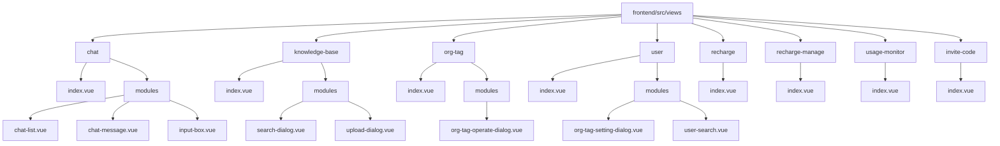

**图表来源**
- [frontend/src/views](file://frontend/src/views)

**章节来源**
- [frontend/src/views](file://frontend/src/views)

## 核心组件
本项目的核心业务组件包括聊天模块、知识库模块、组织标签模块、用户管理模块，以及新增的充值模块、使用监控模块和邀请码模块。这些组件通过Pinia进行状态管理，实现了跨组件的数据共享和状态同步。聊天模块利用WebSocket实现实时通信，知识库模块实现了文件分片上传和断点续传功能，组织标签模块提供了树形结构的标签管理，用户模块则实现了用户与组织标签的关联管理。充值模块实现了微信支付集成和订单管理，使用监控模块提供了用量统计和限流配置，邀请码模块实现了用户邀请和推广管理。

**章节来源**
- [frontend/src/views/chat/index.vue:0-13](file://frontend/src/views/chat/index.vue#L0-L13)
- [frontend/src/views/knowledge-base/index.vue:0-320](file://frontend/src/views/knowledge-base/index.vue#L0-L320)
- [frontend/src/views/org-tag/index.vue:0-110](file://frontend/src/views/org-tag/index.vue#L0-L110)
- [frontend/src/views/user/index.vue:0-123](file://frontend/src/views/user/index.vue#L0-L123)
- [frontend/src/views/recharge/index.vue:0-435](file://frontend/src/views/recharge/index.vue#L0-L435)
- [frontend/src/views/recharge-manage/index.vue:0-504](file://frontend/src/views/recharge-manage/index.vue#L0-L504)
- [frontend/src/views/usage-monitor/index.vue:0-556](file://frontend/src/views/usage-monitor/index.vue#L0-L556)
- [frontend/src/views/invite-code/index.vue:0-481](file://frontend/src/views/invite-code/index.vue#L0-L481)

## 架构概览
系统采用前后端分离架构，前端基于Vue 3和TypeScript构建，使用Pinia进行状态管理，Naive UI作为UI组件库。各业务模块通过模块化设计，将主视图与功能组件分离，实现了高内聚低耦合的设计原则。新增的充值、监控、邀请码模块进一步完善了系统的商业化运营能力。

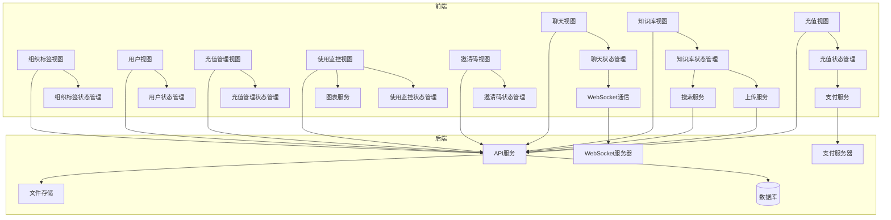

**图表来源**
- [frontend/src/store/modules/chat/index.ts:0-33](file://frontend/src/store/modules/chat/index.ts#L0-L33)
- [frontend/src/store/modules/knowledge-base/index.ts:0-184](file://frontend/src/store/modules/knowledge-base/index.ts#L0-L184)
- [frontend/src/views/chat/index.vue:0-13](file://frontend/src/views/chat/index.vue#L0-L13)
- [frontend/src/views/knowledge-base/index.vue:0-320](file://frontend/src/views/knowledge-base/index.vue#L0-L320)

## 详细组件分析
### 聊天模块分析
聊天模块采用组件化设计，将主视图与功能组件分离。主视图index.vue负责组件的组合和布局，chat-list.vue负责消息列表的展示和滚动，input-box.vue负责用户输入和消息发送，chat-message.vue负责单条消息的渲染。

#### 组件通信机制
聊天模块通过Pinia状态管理实现组件间通信。useChatStore定义了全局共享的状态，包括消息列表、输入内容、WebSocket连接状态等。各组件通过storeToRefs引用这些状态，实现数据的双向绑定。

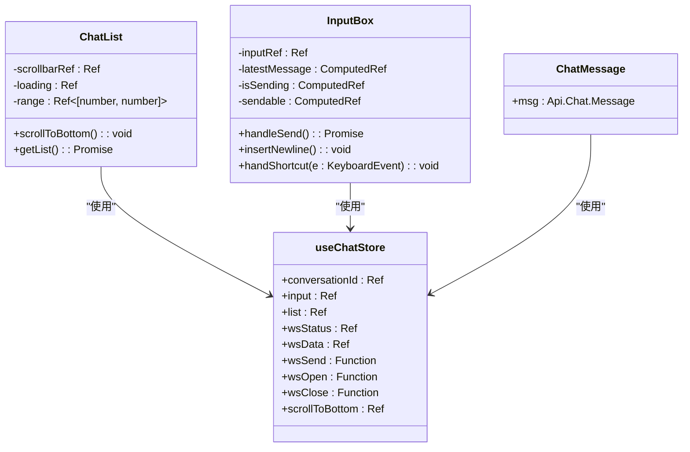

**图表来源**
- [frontend/src/store/modules/chat/index.ts:0-33](file://frontend/src/store/modules/chat/index.ts#L0-L33)
- [frontend/src/views/chat/modules/chat-list.vue:0-78](file://frontend/src/views/chat/modules/chat-list.vue#L0-L78)
- [frontend/src/views/chat/modules/input-box.vue:0-115](file://frontend/src/views/chat/modules/input-box.vue#L0-L115)
- [frontend/src/views/chat/modules/chat-message.vue](file://frontend/src/views/chat/modules/chat-message.vue)

**章节来源**
- [frontend/src/store/modules/chat/index.ts:0-33](file://frontend/src/store/modules/chat/index.ts#L0-L33)
- [frontend/src/views/chat/modules/chat-list.vue:0-78](file://frontend/src/views/chat/modules/chat-list.vue#L0-L78)
- [frontend/src/views/chat/modules/input-box.vue:0-115](file://frontend/src/views/chat/modules/input-box.vue#L0-L115)

#### 状态管理
聊天模块的状态管理通过useChatStore实现，该Store使用useWebSocket建立与后端的WebSocket连接，处理消息的发送和接收。消息列表(list)作为响应式数据，当新消息到达时，自动更新视图。

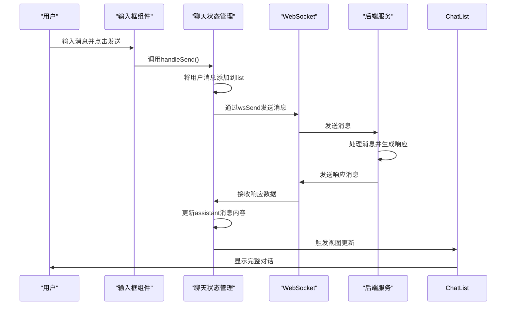

**图表来源**
- [frontend/src/store/modules/chat/index.ts:0-33](file://frontend/src/store/modules/chat/index.ts#L0-L33)
- [frontend/src/views/chat/modules/input-box.vue:0-115](file://frontend/src/views/chat/modules/input-box.vue#L0-L115)
- [frontend/src/views/chat/modules/chat-list.vue:0-78](file://frontend/src/views/chat/modules/chat-list.vue#L0-L78)

**章节来源**
- [frontend/src/store/modules/chat/index.ts:0-33](file://frontend/src/store/modules/chat/index.ts#L0-L33)
- [frontend/src/views/chat/modules/input-box.vue:0-115](file://frontend/src/views/chat/modules/input-box.vue#L0-L115)

### 知识库模块分析
知识库模块实现了文件上传、检索和管理功能，采用模块化设计，将主视图与弹窗组件分离，实现了组件的复用。

#### 弹窗复用设计
知识库模块的search-dialog和upload-dialog采用统一的弹窗设计模式，通过v-model:visible实现弹窗的显示和隐藏控制。两个组件都使用NModal作为基础弹窗，通过插槽定义内容和操作按钮，实现了高度一致的用户体验。

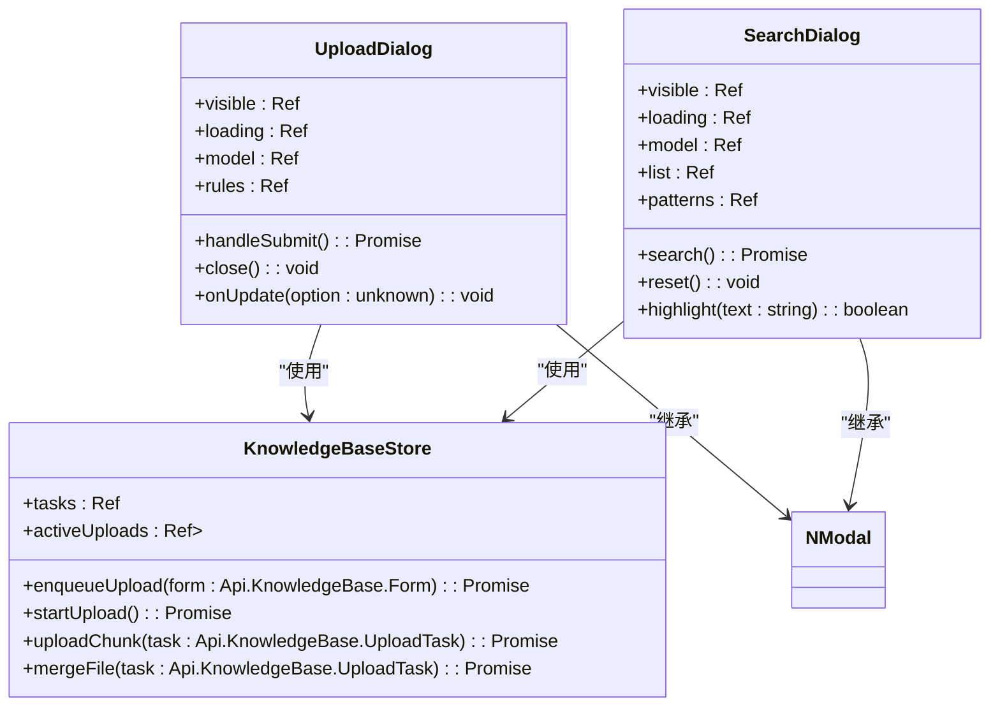

**图表来源**
- [frontend/src/views/knowledge-base/modules/upload-dialog.vue:0-112](file://frontend/src/views/knowledge-base/modules/upload-dialog.vue#L0-L112)
- [frontend/src/views/knowledge-base/modules/search-dialog.vue:0-146](file://frontend/src/views/knowledge-base/modules/search-dialog.vue#L0-L146)
- [frontend/src/store/modules/knowledge-base/index.ts:0-184](file://frontend/src/store/modules/knowledge-base/index.ts#L0-L184)

**章节来源**
- [frontend/src/views/knowledge-base/modules/upload-dialog.vue:0-112](file://frontend/src/views/knowledge-base/modules/upload-dialog.vue#L0-L112)
- [frontend/src/views/knowledge-base/modules/search-dialog.vue:0-146](file://frontend/src/views/knowledge-base/modules/search-dialog.vue#L0-L146)

#### 状态管理机制
知识库模块的状态管理通过useKnowledgeBaseStore实现，该Store管理所有上传任务的状态，包括任务列表、活跃上传队列等。采用分片上传机制，支持大文件的断点续传。

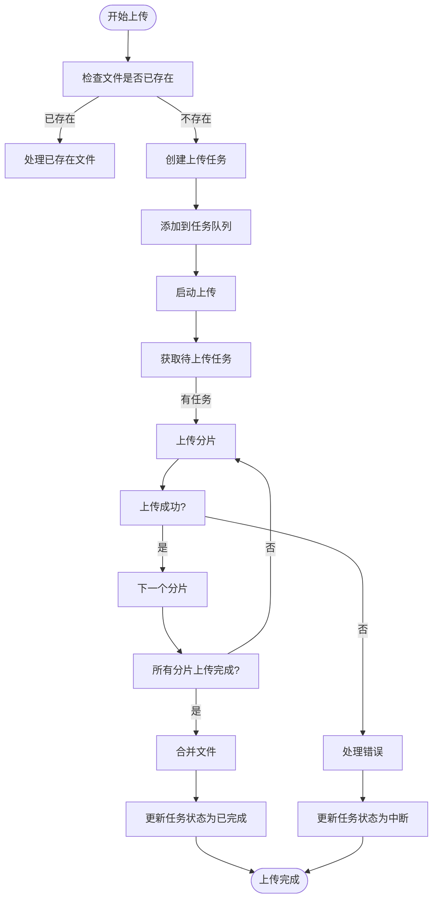

**图表来源**
- [frontend/src/store/modules/knowledge-base/index.ts:0-184](file://frontend/src/store/modules/knowledge-base/index.ts#L0-L184)

**章节来源**
- [frontend/src/store/modules/knowledge-base/index.ts:0-184](file://frontend/src/store/modules/knowledge-base/index.ts#L0-L184)

### 组织标签模块分析
组织标签模块实现了组织标签的增删改查功能，通过org-tag-operate-dialog组件实现标签的创建和编辑操作。

#### 数据绑定与表单验证
org-tag-operate-dialog组件通过v-model实现数据双向绑定，使用Naive UI的表单验证功能实现输入验证。组件根据operateType属性动态显示不同的标题和操作逻辑。

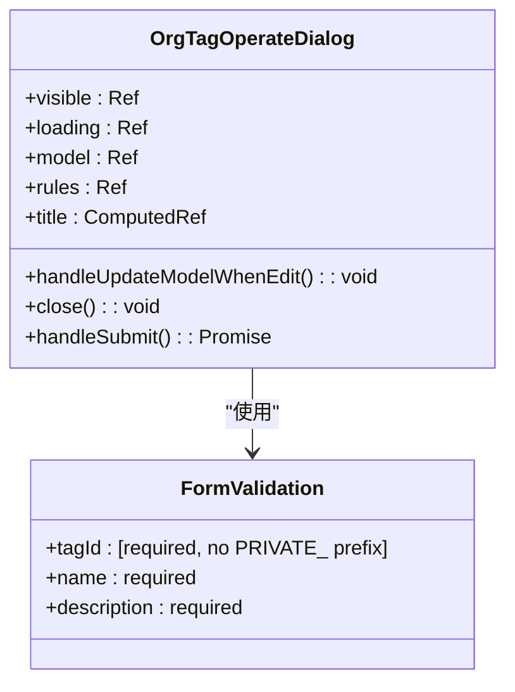

**图表来源**
- [frontend/src/views/org-tag/modules/org-tag-operate-dialog.vue:0-132](file://frontend/src/views/org-tag/modules/org-tag-operate-dialog.vue#L0-L132)

**章节来源**
- [frontend/src/views/org-tag/modules/org-tag-operate-dialog.vue:0-132](file://frontend/src/views/org-tag/modules/org-tag-operate-dialog.vue#L0-L132)

### 用户模块分析
用户模块实现了用户管理功能，通过org-tag-setting-dialog组件实现用户组织标签的分配。

#### 数据绑定与表单验证
org-tag-setting-dialog组件通过v-model实现数据双向绑定，使用Naive UI的表单验证功能确保必填字段的完整性。组件特别处理了私人组织标签的保护逻辑，防止用户误删系统生成的私人标签。

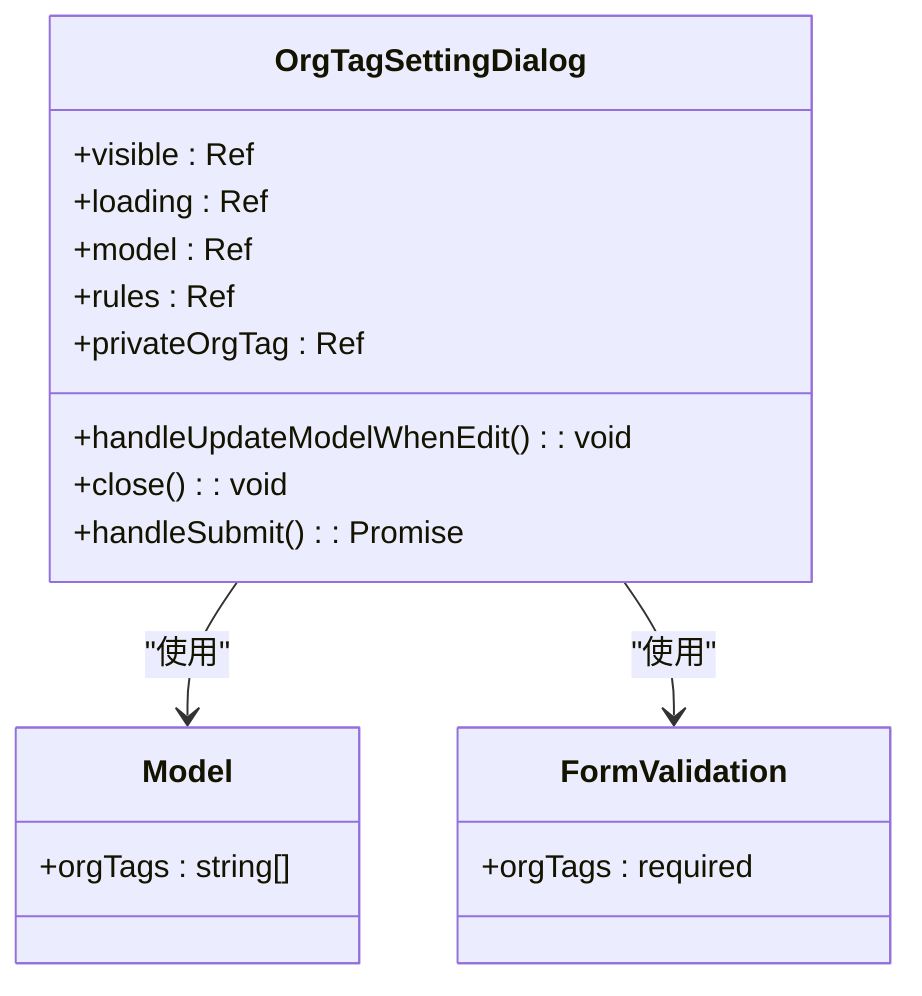

**图表来源**
- [frontend/src/views/user/modules/org-tag-setting-dialog.vue:0-99](file://frontend/src/views/user/modules/org-tag-setting-dialog.vue#L0-L99)

**章节来源**
- [frontend/src/views/user/modules/org-tag-setting-dialog.vue:0-99](file://frontend/src/views/user/modules/org-tag-setting-dialog.vue#L0-L99)

## 新增业务视图分析

### 充值界面分析
充值界面实现了完整的余额充值功能，包括充值套餐展示、自定义充值、订单管理和支付流程。该模块采用响应式设计，支持多种充值方式和灵活的金额设置。

#### 核心功能模块
充值界面主要包含三个核心功能模块：充值套餐展示、自定义充值和订单管理。每个模块都有独立的状态管理和交互逻辑，通过统一的API接口与后端服务通信。

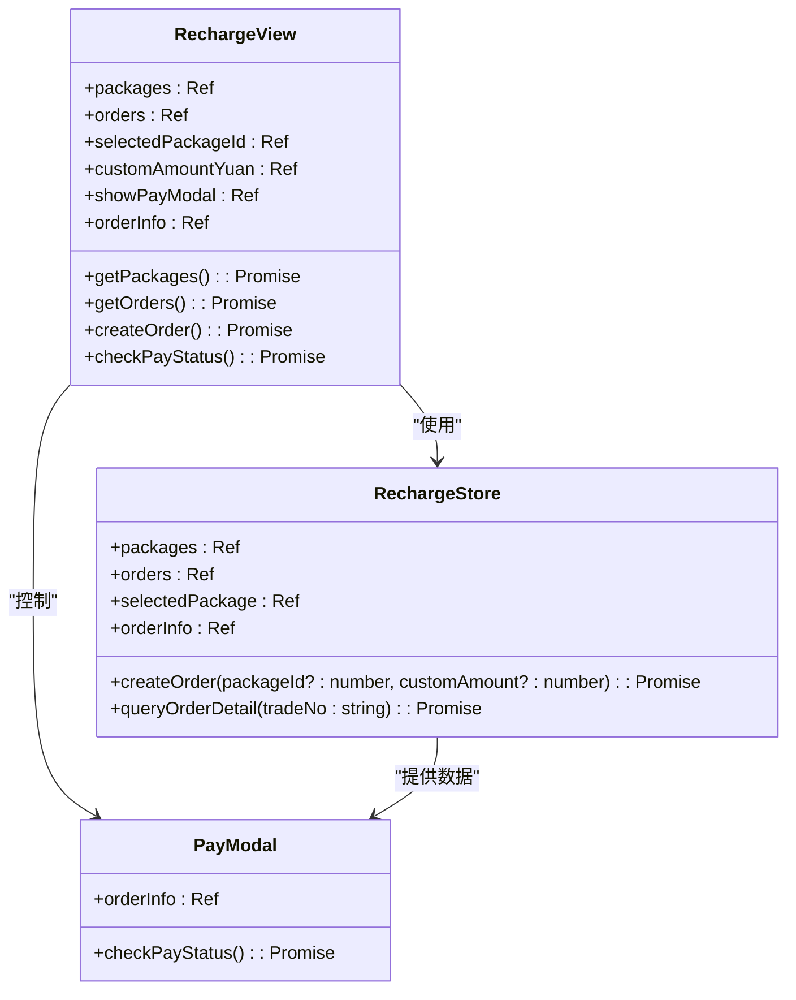

**图表来源**
- [frontend/src/views/recharge/index.vue:0-435](file://frontend/src/views/recharge/index.vue#L0-L435)
- [frontend/src/service/api/recharge.ts:0-39](file://frontend/src/service/api/recharge.ts#L0-L39)

#### 支付流程设计
充值模块实现了完整的支付流程，从套餐选择到支付确认再到状态查询。系统支持微信支付集成，通过二维码展示和状态轮询实现支付过程的可视化管理。

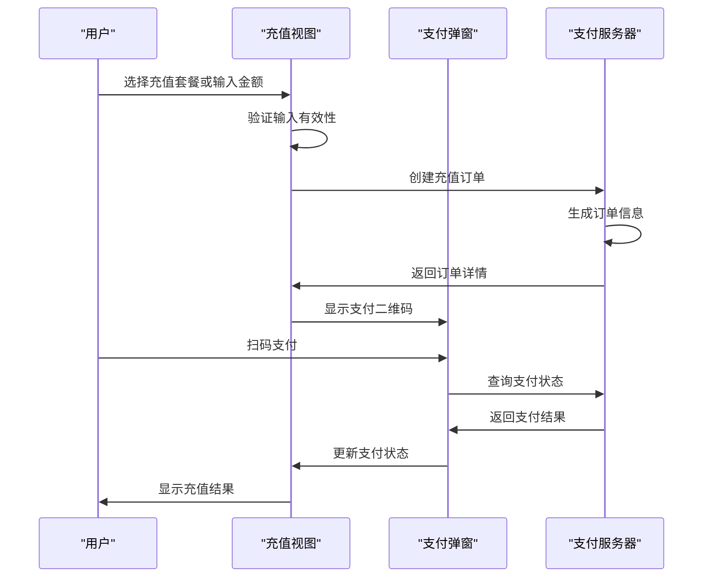

**图表来源**
- [frontend/src/views/recharge/index.vue:108-160](file://frontend/src/views/recharge/index.vue#L108-L160)
- [frontend/src/service/api/recharge.ts:12-38](file://frontend/src/service/api/recharge.ts#L12-L38)

**章节来源**
- [frontend/src/views/recharge/index.vue:0-435](file://frontend/src/views/recharge/index.vue#L0-L435)
- [frontend/src/service/api/recharge.ts:0-39](file://frontend/src/service/api/recharge.ts#L0-L39)

### 充值套餐管理分析
充值套餐管理界面提供了管理员专用的套餐配置功能，支持套餐的创建、编辑、删除和排序管理。该模块采用表格形式展示套餐信息，配合弹窗表单实现完整的CRUD操作。

#### 表单验证与数据转换
套餐管理模块实现了严格的表单验证机制，确保数据的完整性和一致性。系统在前端进行数据格式转换，将元转换为分，将万转换为具体的token数量，保证与后端API的数据格式匹配。

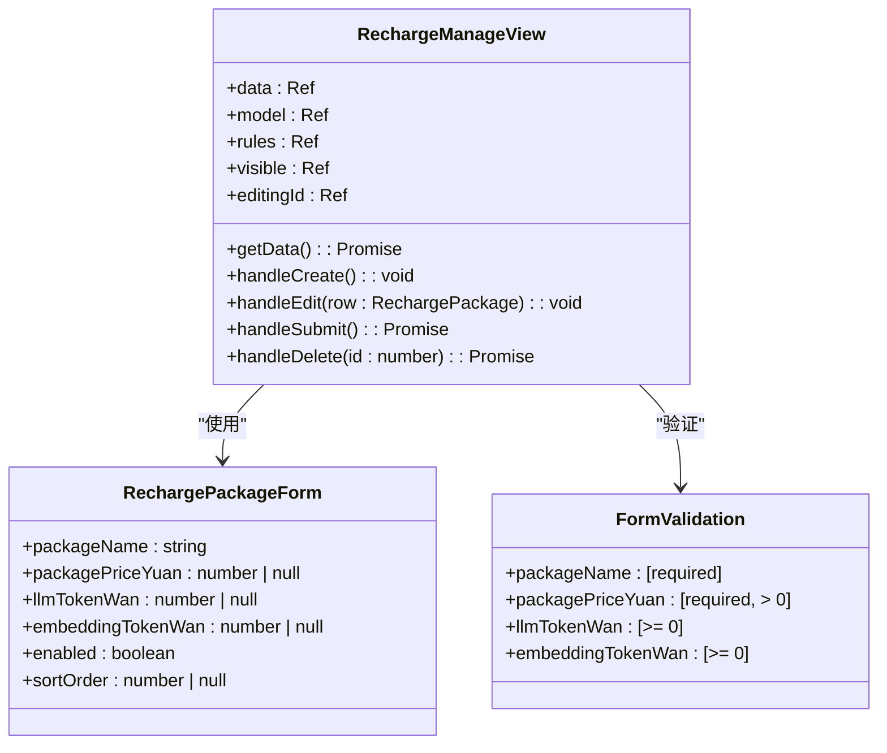

**图表来源**
- [frontend/src/views/recharge-manage/index.vue:0-504](file://frontend/src/views/recharge-manage/index.vue#L0-L504)

#### 数据格式转换机制
系统实现了双向的数据格式转换，确保用户界面的友好性和后端数据的准确性。价格从元转换为分，token数量从万转换为具体数值，同时提供自动化的套餐描述和权益文案生成功能。

**章节来源**
- [frontend/src/views/recharge-manage/index.vue:0-504](file://frontend/src/views/recharge-manage/index.vue#L0-L504)

### 使用监控界面分析
使用监控界面提供了全面的系统用量统计和限流配置管理功能。该模块集成了图表展示、实时监控和告警通知等多种功能，帮助管理员掌握系统的运行状况。

#### 图表可视化设计
使用监控模块采用了ECharts图表库实现复杂的数据可视化，支持多维度的用量趋势展示和实时数据更新。系统提供了多种图表类型，包括折线图、柱状图等，满足不同场景的监控需求。

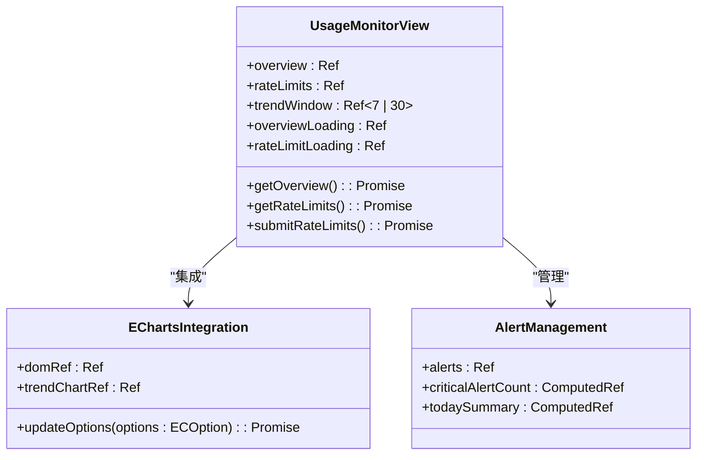

**图表来源**
- [frontend/src/views/usage-monitor/index.vue:0-556](file://frontend/src/views/usage-monitor/index.vue#L0-L556)

#### 限流配置管理
系统提供了精细化的限流配置管理，支持多维度的流量控制策略。管理员可以针对聊天消息、LLM全局Token预算、Embedding上传和查询等不同场景设置相应的限流参数。

**章节来源**
- [frontend/src/views/usage-monitor/index.vue:0-556](file://frontend/src/views/usage-monitor/index.vue#L0-L556)

### 邀请码界面分析
邀请码界面实现了完整的用户邀请和推广管理功能，支持邀请码的创建、编辑、禁用、删除和批量操作。该模块提供了丰富的状态管理和操作反馈机制。

#### 状态管理与操作流程
邀请码模块实现了完整的状态管理机制，包括启用/禁用状态、使用情况跟踪、可用性判断等。系统提供了直观的操作界面，支持单个编辑和批量删除功能。

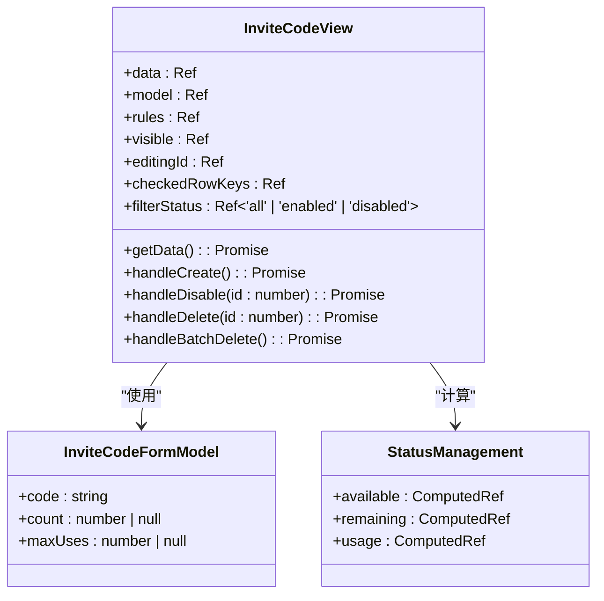

**图表来源**
- [frontend/src/views/invite-code/index.vue:0-481](file://frontend/src/views/invite-code/index.vue#L0-L481)

#### 邀请分享功能
系统集成了多种邀请分享方式，支持直接复制邀请码、生成注册链接和生成邀请话术等功能。这些功能通过浏览器的剪贴板API实现，提供便捷的用户邀请体验。

**章节来源**
- [frontend/src/views/invite-code/index.vue:0-481](file://frontend/src/views/invite-code/index.vue#L0-L481)

## 依赖分析
各业务模块之间通过Pinia状态管理进行数据共享，减少了组件间的直接依赖。主视图组件依赖功能组件，功能组件依赖状态管理Store，形成了清晰的依赖层次。新增的充值、监控、邀请码模块通过专门的API服务与后端通信，保持了良好的模块隔离。

```mermaid
graph TD
ChatStore[useChatStore] --> WebSocket[useWebSocket]
KBStore[useKnowledgeBaseStore] --> Request[request]
OrgTagStore[useOrgTagStore] --> Request[request]
UserStore[useUserStore] --> Request[request]
RechargeStore[useRechargeStore] --> RechargeAPI[recharge.ts]
RechargeManageStore[useRechargeManageStore] --> Request[request]
UsageMonitorStore[useUsageMonitorStore] --> Request[request]
InviteCodeStore[useInviteCodeStore] --> InviteCodeAPI[invite-code.ts]
ChatView[index.vue] --> ChatList[chat-list.vue]
ChatView --> InputBox[input-box.vue]
ChatList --> ChatStore
InputBox --> ChatStore
KBView[index.vue] --> UploadDialog[upload-dialog.vue]
KBView --> SearchDialog[search-dialog.vue]
UploadDialog --> KBStore
SearchDialog --> KBStore
OrgTagView[index.vue] --> OrgTagOperateDialog[org-tag-operate-dialog.vue]
OrgTagOperateDialog --> Request[request]
UserView[index.vue] --> OrgTagSettingDialog[org-tag-setting-dialog.vue]
OrgTagSettingDialog --> Request[request]
RechargeView[index.vue] --> RechargeAPI
RechargeManageView[index.vue] --> RechargeManageAPI[recharge-manage]
UsageMonitorView[index.vue] --> ECharts[echarts.ts]
InviteCodeView[index.vue] --> InviteCodeAPI
```

**图表来源**
- [frontend/src/store/modules/chat/index.ts:0-33](file://frontend/src/store/modules/chat/index.ts#L0-L33)
- [frontend/src/store/modules/knowledge-base/index.ts:0-184](file://frontend/src/store/modules/knowledge-base/index.ts#L0-L184)
- [frontend/src/views/chat/index.vue:0-13](file://frontend/src/views/chat/index.vue#L0-L13)
- [frontend/src/views/knowledge-base/index.vue:0-320](file://frontend/src/views/knowledge-base/index.vue#L0-L320)
- [frontend/src/views/org-tag/index.vue:0-110](file://frontend/src/views/org-tag/index.vue#L0-L110)
- [frontend/src/views/user/index.vue:0-123](file://frontend/src/views/user/index.vue#L0-L123)
- [frontend/src/service/api/recharge.ts:0-39](file://frontend/src/service/api/recharge.ts#L0-L39)
- [frontend/src/service/api/invite-code.ts:0-48](file://frontend/src/service/api/invite-code.ts#L0-L48)

**章节来源**
- [frontend/src/store/modules/chat/index.ts:0-33](file://frontend/src/store/modules/chat/index.ts#L0-L33)
- [frontend/src/store/modules/knowledge-base/index.ts:0-184](file://frontend/src/store/modules/knowledge-base/index.ts#L0-L184)

## 性能考虑
项目在性能方面做了多项优化：聊天模块使用虚拟滚动和防抖技术优化消息列表渲染；知识库模块采用分片上传避免大文件上传超时；各模块使用Pinia进行状态管理，避免不必要的组件重新渲染。WebSocket连接采用自动重连机制，确保通信的稳定性。新增的图表模块使用ECharts进行高效的数据可视化，支持大数据量的实时更新。

**更新** 充值模块采用异步加载和懒加载策略，避免不必要的API调用；监控模块实现了数据缓存和智能刷新机制，减少频繁的图表更新开销。

## 故障排除指南
常见问题及解决方案：
1. **聊天消息不显示**：检查WebSocket连接状态，确保后端服务正常运行
2. **文件上传失败**：检查文件大小和类型是否符合要求，确认网络连接正常
3. **弹窗无法关闭**：检查v-model绑定是否正确，确保visible变量可写
4. **数据不更新**：检查Pinia状态是否正确引用，确认响应式数据更新
5. **充值支付失败**：检查支付参数是否正确，确认微信支付服务可用
6. **监控数据异常**：检查API接口响应，确认限流配置正确
7. **邀请码操作失败**：检查权限验证，确认管理员身份有效

**更新** 新增充值、监控、邀请码模块的故障排除指南，涵盖支付状态查询、图表数据刷新、权限验证等相关问题。

**章节来源**
- [frontend/src/store/modules/chat/index.ts:0-33](file://frontend/src/store/modules/chat/index.ts#L0-L33)
- [frontend/src/store/modules/knowledge-base/index.ts:0-184](file://frontend/src/store/modules/knowledge-base/index.ts#L0-L184)
- [frontend/src/views/chat/modules/input-box.vue:0-115](file://frontend/src/views/chat/modules/input-box.vue#L0-L115)

## 结论
PaiSmart项目的业务视图设计遵循了现代前端开发的最佳实践，采用模块化、组件化的架构设计，通过Pinia实现高效的状态管理。各业务模块职责清晰，组件间通信机制合理，为系统的可维护性和可扩展性奠定了良好基础。新增的充值界面、使用监控界面、邀请码界面等业务视图进一步完善了系统的商业化运营能力，涵盖了用户充值、系统监控、用户推广等关键业务场景。建议在后续开发中继续保持这种设计模式，并进一步优化性能和用户体验，特别是在大数据量监控和实时支付等场景下的性能表现。