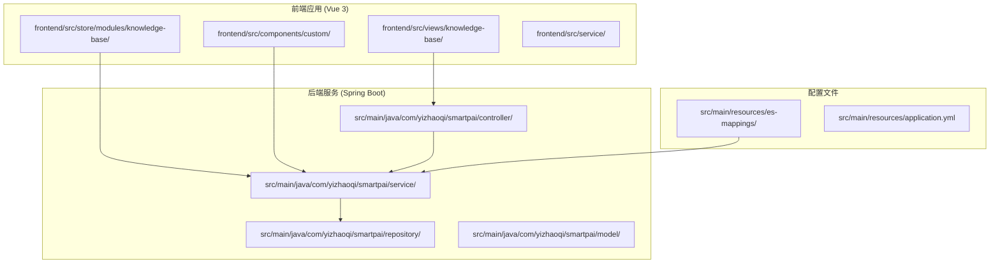
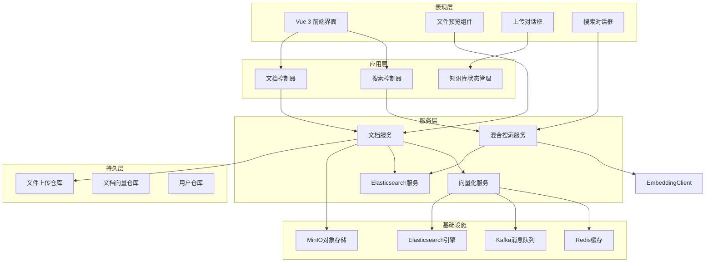
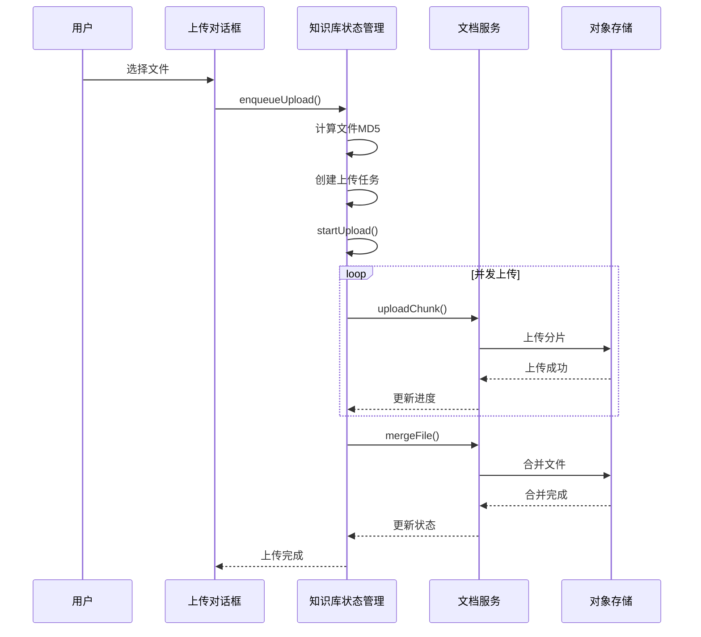
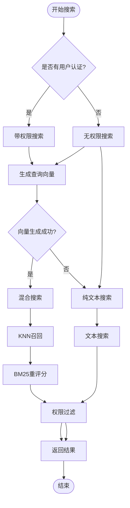
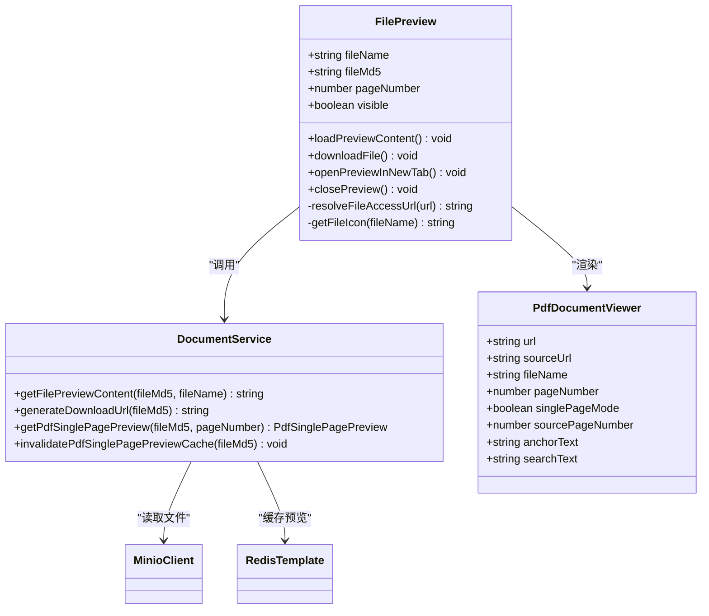
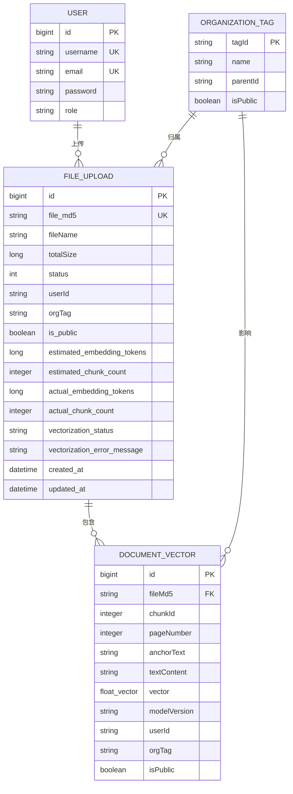
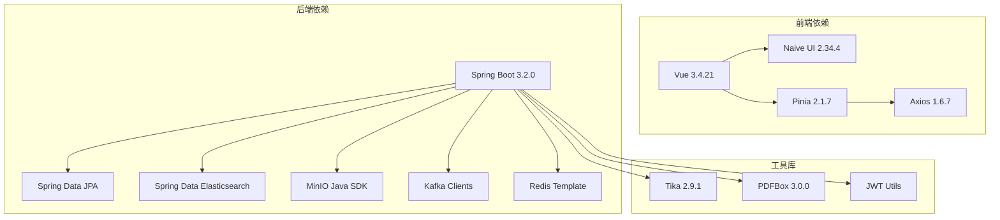

# 知识库视图增强

<cite>
**本文档引用的文件**
- [frontend/src/views/knowledge-base/index.vue](file://frontend/src/views/knowledge-base/index.vue)
- [frontend/src/views/knowledge-base/modules/upload-dialog.vue](file://frontend/src/views/knowledge-base/modules/upload-dialog.vue)
- [frontend/src/views/knowledge-base/modules/search-dialog.vue](file://frontend/src/views/knowledge-base/modules/search-dialog.vue)
- [frontend/src/store/modules/knowledge-base/index.ts](file://frontend/src/store/modules/knowledge-base/index.ts)
- [frontend/src/components/custom/file-preview.vue](file://frontend/src/components/custom/file-preview.vue)
- [src/main/java/com/yizhaoqi/smartpai/controller/DocumentController.java](file://src/main/java/com/yizhaoqi/smartpai/controller/DocumentController.java)
- [src/main/java/com/yizhaoqi/smartpai/service/DocumentService.java](file://src/main/java/com/yizhaoqi/smartpai/service/DocumentService.java)
- [src/main/java/com/yizhaoqi/smartpai/controller/SearchController.java](file://src/main/java/com/yizhaoqi/smartpai/controller/SearchController.java)
- [src/main/java/com/yizhaoqi/smartpai/service/HybridSearchService.java](file://src/main/java/com/yizhaoqi/smartpai/service/HybridSearchService.java)
- [src/main/java/com/yizhaoqi/smartpai/service/ElasticsearchService.java](file://src/main/java/com/yizhaoqi/smartpai/service/ElasticsearchService.java)
- [src/main/java/com/yizhaoqi/smartpai/model/FileUpload.java](file://src/main/java/com/yizhaoqi/smartpai/model/FileUpload.java)
- [src/main/resources/es-mappings/knowledge_base.json](file://src/main/resources/es-mappings/knowledge_base.json)
</cite>

## 目录
1. [简介](#简介)
2. [项目结构](#项目结构)
3. [核心组件](#核心组件)
4. [架构概览](#架构概览)
5. [详细组件分析](#详细组件分析)
6. [依赖关系分析](#依赖关系分析)
7. [性能考量](#性能考量)
8. [故障排除指南](#故障排除指南)
9. [结论](#结论)

## 简介

知识库视图增强是一个基于Vue 3 + Spring Boot构建的企业级知识管理平台，专注于提升文档上传、检索和预览体验。该项目实现了完整的RAG（检索增强生成）知识库系统，支持多格式文档上传、智能向量化、权限控制和实时预览功能。

系统采用前后端分离架构，前端使用现代化的Vue 3技术栈，后端基于Spring Boot微服务框架，集成了Elasticsearch搜索引擎、MinIO对象存储和Kafka消息队列，为企业用户提供高效的知识管理和检索能力。

## 项目结构

项目采用模块化的目录结构，主要分为前端和后端两个部分：

**图表来源**
- [frontend/src/views/knowledge-base/index.vue:1-540](file://frontend/src/views/knowledge-base/index.vue#L1-L540)
- [src/main/java/com/yizhaoqi/smartpai/controller/DocumentController.java:1-929](file://src/main/java/com/yizhaoqi/smartpai/controller/DocumentController.java#L1-L929)

**章节来源**
- [frontend/src/views/knowledge-base/index.vue:1-540](file://frontend/src/views/knowledge-base/index.vue#L1-L540)
- [src/main/java/com/yizhaoqi/smartpai/controller/DocumentController.java:1-929](file://src/main/java/com/yizhaoqi/smartpai/controller/DocumentController.java#L1-L929)

## 核心组件

### 知识库视图组件

知识库视图是整个系统的前端核心，提供了完整的文档管理界面：

- **文件列表展示**：基于Naive UI的表格组件，支持分页、排序和筛选
- **文件上传功能**：支持断点续传、进度监控和并发控制
- **文件预览**：集成多种格式的在线预览，包括PDF、图片和文本文件
- **检索功能**：提供混合检索能力，支持语义搜索和关键词搜索

### 状态管理

知识库状态管理采用Pinia Store模式，实现了高效的文件上传队列管理：

- **上传任务队列**：支持多个文件的并发上传
- **进度跟踪**：实时监控上传进度和状态
- **错误处理**：完善的错误捕获和恢复机制

### 后端服务层

后端服务层提供了完整的业务逻辑处理：

- **文档服务**：文件上传、删除、预览和下载
- **搜索服务**：混合检索算法，支持权限控制
- **向量化服务**：文档向量化处理和缓存管理

**章节来源**
- [frontend/src/views/knowledge-base/index.vue:51-160](file://frontend/src/views/knowledge-base/index.vue#L51-L160)
- [frontend/src/store/modules/knowledge-base/index.ts:6-238](file://frontend/src/store/modules/knowledge-base/index.ts#L6-L238)
- [src/main/java/com/yizhaoqi/smartpai/service/DocumentService.java:44-778](file://src/main/java/com/yizhaoqi/smartpai/service/DocumentService.java#L44-L778)

## 架构概览

系统采用分层架构设计，实现了清晰的职责分离：

**图表来源**
- [frontend/src/views/knowledge-base/index.vue:12-166](file://frontend/src/views/knowledge-base/index.vue#L12-L166)
- [src/main/java/com/yizhaoqi/smartpai/controller/DocumentController.java:32-929](file://src/main/java/com/yizhaoqi/smartpai/controller/DocumentController.java#L32-L929)
- [src/main/java/com/yizhaoqi/smartpai/service/HybridSearchService.java:31-499](file://src/main/java/com/yizhaoqi/smartpai/service/HybridSearchService.java#L31-L499)

## 详细组件分析

### 文件上传组件

文件上传组件实现了完整的多文件上传功能，支持断点续传和并发控制：

**图表来源**
- [frontend/src/views/knowledge-base/modules/upload-dialog.vue:52-60](file://frontend/src/views/knowledge-base/modules/upload-dialog.vue#L52-L60)
- [frontend/src/store/modules/knowledge-base/index.ts:123-171](file://frontend/src/store/modules/knowledge-base/index.ts#L123-L171)
- [frontend/src/store/modules/knowledge-base/index.ts:174-229](file://frontend/src/store/modules/knowledge-base/index.ts#L174-L229)

组件特性：
- **断点续传**：支持文件分片上传和断点续传
- **并发控制**：限制同时上传的文件数量
- **进度监控**：实时显示上传进度和状态
- **错误恢复**：自动处理上传失败并重试

**章节来源**
- [frontend/src/views/knowledge-base/modules/upload-dialog.vue:1-163](file://frontend/src/views/knowledge-base/modules/upload-dialog.vue#L1-L163)
- [frontend/src/store/modules/knowledge-base/index.ts:1-238](file://frontend/src/store/modules/knowledge-base/index.ts#L1-L238)

### 搜索功能组件

混合搜索功能结合了语义搜索和关键词搜索的优势：

**图表来源**
- [src/main/java/com/yizhaoqi/smartpai/service/HybridSearchService.java:63-177](file://src/main/java/com/yizhaoqi/smartpai/service/HybridSearchService.java#L63-L177)
- [src/main/java/com/yizhaoqi/smartpai/controller/SearchController.java:46-89](file://src/main/java/com/yizhaoqi/smartpai/controller/SearchController.java#L46-L89)

搜索算法特点：
- **混合检索**：结合向量相似度和关键词匹配
- **权限控制**：基于用户身份和组织标签的访问控制
- **重评分机制**：使用BM25算法优化搜索结果质量
- **回退机制**：向量生成失败时自动切换到纯文本搜索

**章节来源**
- [src/main/java/com/yizhaoqi/smartpai/service/HybridSearchService.java:1-499](file://src/main/java/com/yizhaoqi/smartpai/service/HybridSearchService.java#L1-L499)
- [src/main/java/com/yizhaoqi/smartpai/controller/SearchController.java:1-91](file://src/main/java/com/yizhaoqi/smartpai/controller/SearchController.java#L1-L91)

### 文件预览组件

文件预览组件提供了丰富的文档预览功能：

**图表来源**
- [frontend/src/components/custom/file-preview.vue:153-512](file://frontend/src/components/custom/file-preview.vue#L153-L512)
- [src/main/java/com/yizhaoqi/smartpai/service/DocumentService.java:526-778](file://src/main/java/com/yizhaoqi/smartpai/service/DocumentService.java#L526-L778)

预览功能特性：
- **多格式支持**：PDF、图片、文本等多种格式预览
- **PDF单页预览**：支持PDF文件的单页预览和缓存
- **在线下载**：支持在线预览和直接下载
- **新窗口打开**：支持在新窗口中打开原始文件

**章节来源**
- [frontend/src/components/custom/file-preview.vue:1-701](file://frontend/src/components/custom/file-preview.vue#L1-L701)
- [src/main/java/com/yizhaoqi/smartpai/service/DocumentService.java:585-745](file://src/main/java/com/yizhaoqi/smartpai/service/DocumentService.java#L585-L745)

### 数据模型设计

系统采用清晰的数据模型设计，支持复杂的权限控制和向量化处理：

**图表来源**
- [src/main/java/com/yizhaoqi/smartpai/model/FileUpload.java:14-108](file://src/main/java/com/yizhaoqi/smartpai/model/FileUpload.java#L14-L108)
- [src/main/resources/es-mappings/knowledge_base.json:1-43](file://src/main/resources/es-mappings/knowledge_base.json#L1-L43)

数据模型特点：
- **向量化索引**：Elasticsearch中存储向量数据和文本内容
- **权限控制**：通过用户ID、组织标签和公开标志实现多层权限控制
- **版本管理**：支持向量化模型版本追踪和回溯
- **历史数据**：完整的历史数据记录和状态管理

**章节来源**
- [src/main/java/com/yizhaoqi/smartpai/model/FileUpload.java:1-108](file://src/main/java/com/yizhaoqi/smartpai/model/FileUpload.java#L1-L108)
- [src/main/resources/es-mappings/knowledge_base.json:1-43](file://src/main/resources/es-mappings/knowledge_base.json#L1-L43)

## 依赖关系分析

系统各组件之间的依赖关系清晰明确：

**图表来源**
- [frontend/package.json](file://frontend/package.json)
- [pom.xml](file://pom.xml)

**章节来源**
- [frontend/package.json](file://frontend/package.json)
- [pom.xml](file://pom.xml)

## 性能考量

系统在设计时充分考虑了性能优化：

### 前端性能优化
- **虚拟滚动**：大数据量表格使用虚拟滚动减少DOM节点
- **懒加载**：组件按需加载，减少初始包体积
- **缓存策略**：合理使用浏览器缓存和组件缓存
- **并发控制**：上传任务并发数限制，避免资源争用

### 后端性能优化
- **向量化缓存**：Redis缓存向量化结果，减少重复计算
- **批量操作**：Elasticsearch批量索引，提高写入性能
- **连接池**：数据库和外部服务连接池配置
- **异步处理**：长耗时操作使用Kafka异步处理

### 存储优化
- **分片上传**：大文件分片上传，支持断点续传
- **对象存储**：MinIO分布式存储，支持水平扩展
- **预览缓存**：PDF单页预览缓存，减少重复生成

## 故障排除指南

### 常见问题及解决方案

**文件上传失败**
- 检查网络连接和服务器状态
- 验证文件格式和大小限制
- 查看浏览器控制台错误信息
- 确认用户权限和配额限制

**搜索结果不准确**
- 检查Elasticsearch索引状态
- 验证向量化模型配置
- 确认用户权限设置
- 查看搜索日志和性能监控

**预览功能异常**
- 验证文件格式支持情况
- 检查MinIO存储状态
- 确认Redis缓存可用性
- 查看PDF预览缓存配置

**章节来源**
- [frontend/src/views/knowledge-base/index.vue:211-232](file://frontend/src/views/knowledge-base/index.vue#L211-L232)
- [src/main/java/com/yizhaoqi/smartpai/service/DocumentService.java:104-169](file://src/main/java/com/yizhaoqi/smartpai/service/DocumentService.java#L104-L169)

## 结论

知识库视图增强项目是一个功能完整、架构清晰的企业级知识管理平台。通过前后端分离的设计，系统实现了高效的文档管理、智能检索和丰富预览功能。

项目的主要优势包括：
- **完整的RAG功能**：支持语义搜索和关键词搜索的混合检索
- **强大的权限控制**：基于用户身份和组织标签的多层权限管理
- **高性能架构**：采用微服务架构和分布式存储，支持高并发访问
- **用户体验优秀**：提供流畅的文件上传、预览和搜索体验

未来可以进一步优化的方向包括：
- 增加更多的文件格式支持
- 优化搜索算法的准确性
- 扩展移动端适配
- 增强数据分析和统计功能