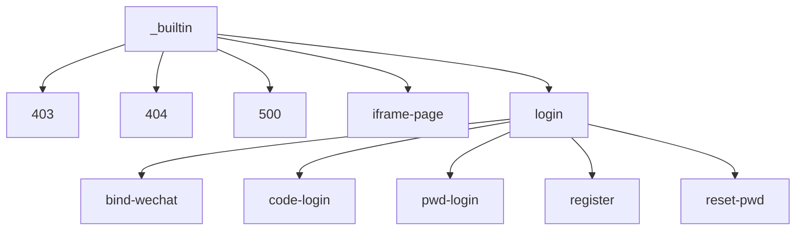
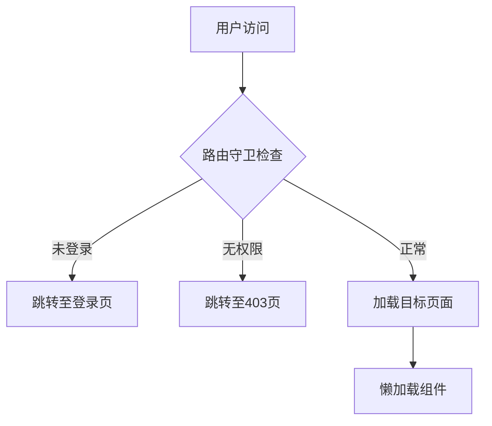
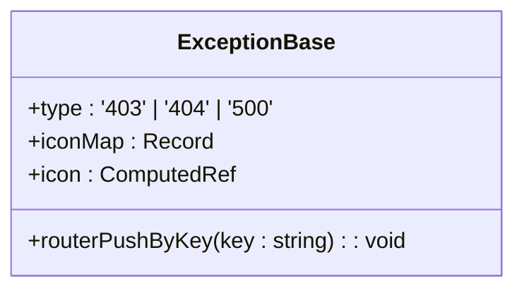
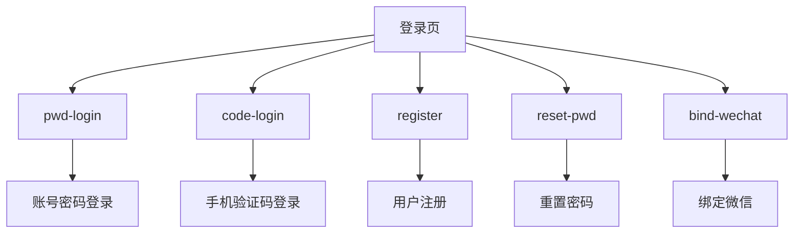
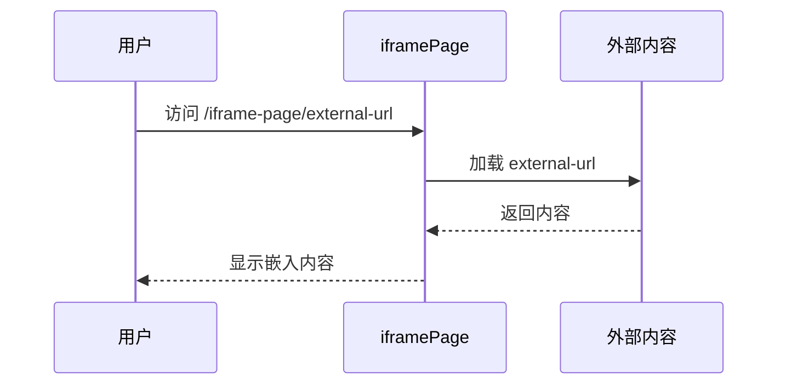
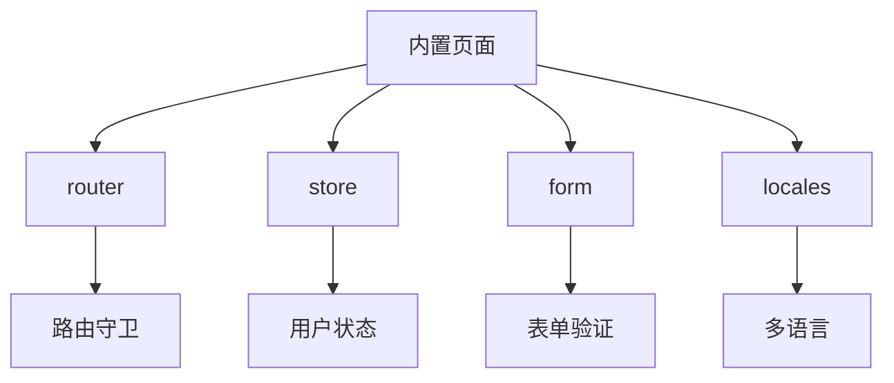

# 内置页面

<cite>
**本文档引用的文件**  
- [exception-base.vue](file://frontend/src/components/common/exception-base.vue)
- [403/index.vue](file://frontend/src/views/_builtin/403/index.vue)
- [404/index.vue](file://frontend/src/views/_builtin/404/index.vue)
- [500/index.vue](file://frontend/src/views/_builtin/500/index.vue)
- [login/index.vue](file://frontend/src/views/_builtin/login/index.vue)
- [login/modules/pwd-login.vue](file://frontend/src/views/_builtin/login/modules/pwd-login.vue)
- [login/modules/code-login.vue](file://frontend/src/views/_builtin/login/modules/code-login.vue)
- [login/modules/register.vue](file://frontend/src/views/_builtin/login/modules/register.vue)
- [login/modules/reset-pwd.vue](file://frontend/src/views/_builtin/login/modules/reset-pwd.vue)
- [login/modules/bind-wechat.vue](file://frontend/src/views/_builtin/login/modules/bind-wechat.vue)
- [iframe-page/[url].vue](file://frontend/src/views/_builtin/iframe-page/[url].vue)
- [router/guard/route.ts](file://frontend/src/router/guard/route.ts)
- [router/guard/index.ts](file://frontend/src/router/guard/index.ts)
- [router/routes/builtin.ts](file://frontend/src/router/routes/builtin.ts)
- [router/index.ts](file://frontend/src/router/index.ts)
</cite>

## 目录
1. [简介](#简介)
2. [项目结构](#项目结构)
3. [核心组件](#核心组件)
4. [架构概览](#架构概览)
5. [详细组件分析](#详细组件分析)
6. [依赖分析](#依赖分析)
7. [性能考量](#性能考量)
8. [故障排除指南](#故障排除指南)
9. [结论](#结论)

## 简介
本文档详细阐述了前端内置视图的设计与实现，涵盖异常处理页面（403、404、500）的用户友好提示机制和统一视觉风格。重点分析了登录页的模块化结构，说明了 `bind-wechat`、`code-login`、`pwd-login`、`register`、`reset-pwd` 等子组件的功能划分与交互逻辑。同时，解释了 `iframe-page` 动态路由页面的 URL 参数解析机制及其在嵌入第三方内容时的安全策略。结合路由守卫配置，说明了这些内置页面的访问控制与懒加载实现方式。

## 项目结构
前端内置视图位于 `frontend/src/views/_builtin` 目录下，包含以下主要模块：
- `403`：无权限访问页面
- `404`：页面未找到页面
- `500`：服务错误页面
- `iframe-page`：用于嵌入第三方内容的动态路由页面
- `login`：登录页及其子组件

**图示来源**
- [403/index.vue](file://frontend/src/views/_builtin/403/index.vue)
- [404/index.vue](file://frontend/src/views/_builtin/404/index.vue)
- [500/index.vue](file://frontend/src/views/_builtin/500/index.vue)
- [iframe-page/[url].vue](file://frontend/src/views/_builtin/iframe-page/[url].vue)
- [login/index.vue](file://frontend/src/views/_builtin/login/index.vue)

**本节来源**
- [frontend/src/views/_builtin](file://frontend/src/views/_builtin)

## 核心组件
内置视图的核心组件包括异常基础组件 `exception-base.vue` 和登录页主组件 `login/index.vue`。`exception-base.vue` 提供了统一的视觉风格和用户友好提示机制，而 `login/index.vue` 通过模块化设计实现了多种登录方式的集成。

**本节来源**
- [exception-base.vue](file://frontend/src/components/common/exception-base.vue)
- [login/index.vue](file://frontend/src/views/_builtin/login/index.vue)

## 架构概览
系统通过路由配置和路由守卫实现内置页面的访问控制和懒加载。路由守卫在用户访问页面前进行权限检查，确保只有授权用户才能访问特定页面。同时，通过动态路由和组件懒加载，优化了页面加载性能。

**图示来源**
- [router/guard/route.ts](file://frontend/src/router/guard/route.ts)
- [router/index.ts](file://frontend/src/router/index.ts)

## 详细组件分析

### 异常处理页面分析
异常处理页面（403、404、500）通过 `exception-base.vue` 组件实现统一的视觉风格和用户友好提示。该组件根据传入的 `type` 参数显示不同的图标和提示信息，并提供返回首页的按钮。

**图示来源**
- [exception-base.vue](file://frontend/src/components/common/exception-base.vue)

**本节来源**
- [exception-base.vue](file://frontend/src/components/common/exception-base.vue)
- [403/index.vue](file://frontend/src/views/_builtin/403/index.vue)
- [404/index.vue](file://frontend/src/views/_builtin/404/index.vue)
- [500/index.vue](file://frontend/src/views/_builtin/500/index.vue)

### 登录页分析
登录页采用模块化设计，通过 `login/index.vue` 主组件集成多个子组件，包括 `pwd-login`、`code-login`、`register`、`reset-pwd` 和 `bind-wechat`。主组件根据 `module` 参数动态切换显示不同的子组件，实现了多种登录方式的统一管理。

#### 登录子组件功能划分

**图示来源**
- [login/index.vue](file://frontend/src/views/_builtin/login/index.vue)
- [login/modules/pwd-login.vue](file://frontend/src/views/_builtin/login/modules/pwd-login.vue)
- [login/modules/code-login.vue](file://frontend/src/views/_builtin/login/modules/code-login.vue)
- [login/modules/register.vue](file://frontend/src/views/_builtin/login/modules/register.vue)
- [login/modules/reset-pwd.vue](file://frontend/src/views/_builtin/login/modules/reset-pwd.vue)
- [login/modules/bind-wechat.vue](file://frontend/src/views/_builtin/login/modules/bind-wechat.vue)

**本节来源**
- [login/index.vue](file://frontend/src/views/_builtin/login/index.vue)
- [login/modules/pwd-login.vue](file://frontend/src/views/_builtin/login/modules/pwd-login.vue)
- [login/modules/code-login.vue](file://frontend/src/views/_builtin/login/modules/code-login.vue)
- [login/modules/register.vue](file://frontend/src/views/_builtin/login/modules/register.vue)
- [login/modules/reset-pwd.vue](file://frontend/src/views/_builtin/login/modules/reset-pwd.vue)
- [login/modules/bind-wechat.vue](file://frontend/src/views/_builtin/login/modules/bind-wechat.vue)

### iframe页面分析
`iframe-page` 组件通过动态路由 `[url].vue` 实现第三方内容的嵌入。该组件接收 `url` 参数，并将其作为 `iframe` 的 `src` 属性，从而在页面中嵌入外部内容。目前未实现针对 `X-Frame-Options` 的安全策略处理。

**图示来源**
- [iframe-page/[url].vue](file://frontend/src/views/_builtin/iframe-page/[url].vue)

**本节来源**
- [iframe-page/[url].vue](file://frontend/src/views/_builtin/iframe-page/[url].vue)

## 依赖分析
内置页面的实现依赖于多个核心模块，包括路由管理、状态管理、表单验证和国际化。通过 `router` 模块实现页面导航和访问控制，通过 `store` 模块管理用户状态和权限信息，通过 `form` 模块实现表单验证，通过 `locales` 模块实现多语言支持。

**图示来源**
- [router/guard/route.ts](file://frontend/src/router/guard/route.ts)
- [store/modules/auth/index.ts](file://frontend/src/store/modules/auth/index.ts)
- [hooks/common/form.ts](file://frontend/src/hooks/common/form.ts)
- [locales/index.ts](file://frontend/src/locales/index.ts)

**本节来源**
- [router/guard/route.ts](file://frontend/src/router/guard/route.ts)
- [store/modules/auth/index.ts](file://frontend/src/store/modules/auth/index.ts)
- [hooks/common/form.ts](file://frontend/src/hooks/common/form.ts)
- [locales/index.ts](file://frontend/src/locales/index.ts)

## 性能考量
通过组件懒加载和路由守卫的权限检查，内置页面在保证安全性的同时优化了性能。异常页面和登录页的组件均采用按需加载，减少了初始加载时间。路由守卫在用户访问页面前进行权限检查，避免了不必要的页面加载。

## 故障排除指南
- **异常页面不显示**：检查 `exception-base.vue` 组件的 `type` 参数是否正确传递。
- **登录页无法切换模块**：检查 `login/index.vue` 组件的 `module` 参数是否正确设置。
- **iframe页面无法加载**：检查 `url` 参数是否正确，并确保目标页面允许被嵌入。

**本节来源**
- [exception-base.vue](file://frontend/src/components/common/exception-base.vue)
- [login/index.vue](file://frontend/src/views/_builtin/login/index.vue)
- [iframe-page/[url].vue](file://frontend/src/views/_builtin/iframe-page/[url].vue)

## 结论
前端内置视图通过模块化设计和统一的视觉风格，实现了异常处理、用户登录和第三方内容嵌入等功能。通过路由守卫和组件懒加载，确保了系统的安全性和性能。未来可进一步完善 `iframe` 页面的安全策略，以应对潜在的安全风险。