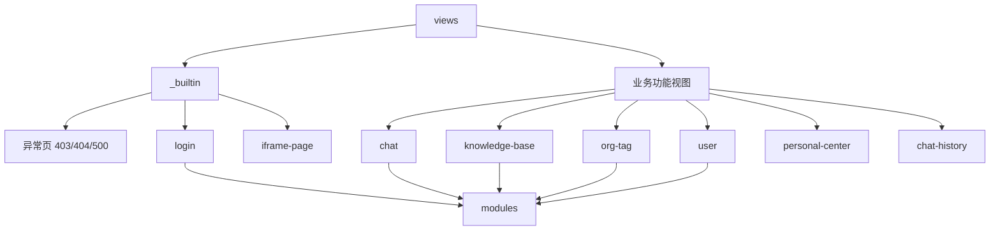
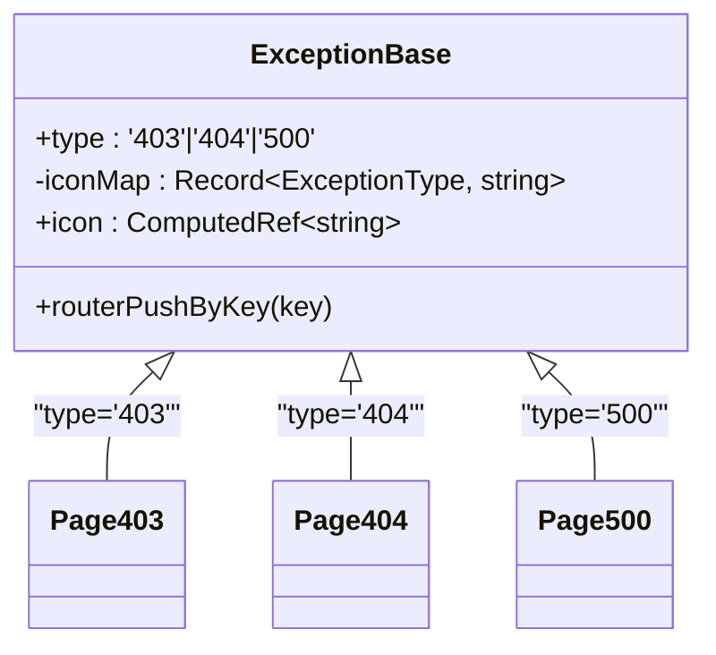
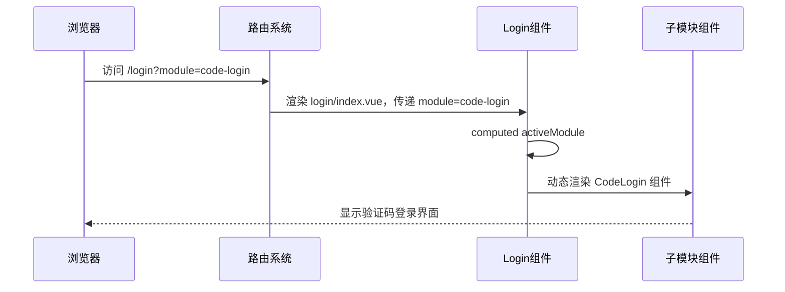
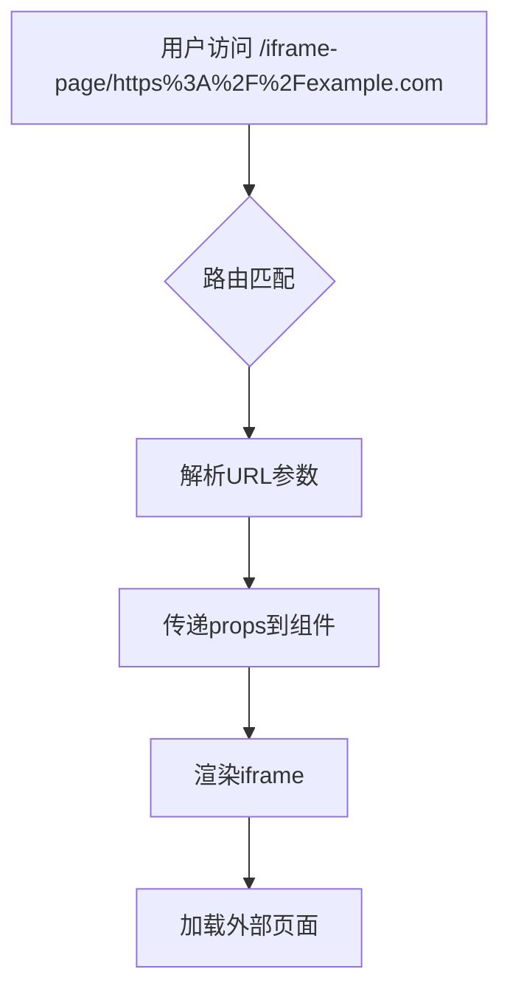
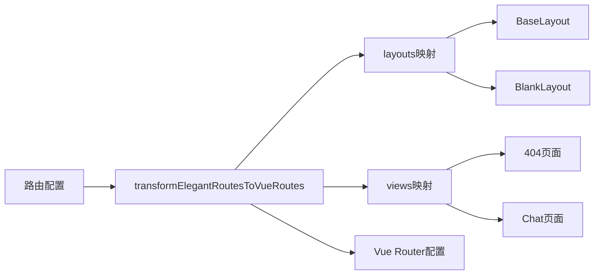
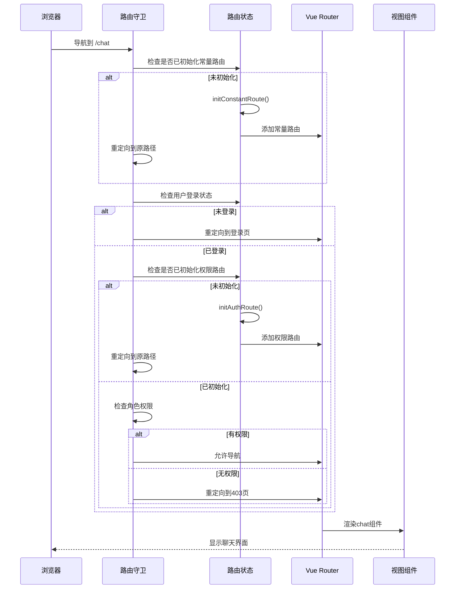

# 视图组织

<cite>
**本文档引用的文件**  
- [builtin.ts](file://frontend/src/router/routes/builtin.ts)
- [index.ts](file://frontend/src/router/routes/index.ts)
- [transform.ts](file://frontend/src/router/elegant/transform.ts)
- [imports.ts](file://frontend/src/router/elegant/imports.ts)
- [login/index.vue](file://frontend/src/views/_builtin/login/index.vue)
- [_builtin/403/index.vue](file://frontend/src/views/_builtin/403/index.vue)
- [_builtin/404/index.vue](file://frontend/src/views/_builtin/404/index.vue)
- [_builtin/500/index.vue](file://frontend/src/views/_builtin/500/index.vue)
- [_builtin/iframe-page/[url].vue](file://frontend/src/views/_builtin/iframe-page/[url].vue)
- [exception-base.vue](file://frontend/src/components/common/exception-base.vue)
- [chat/index.vue](file://frontend/src/views/chat/index.vue)
- [knowledge-base/index.vue](file://frontend/src/views/knowledge-base/index.vue)
- [org-tag/index.vue](file://frontend/src/views/org-tag/index.vue)
- [route.ts](file://frontend/src/router/guard/route.ts)
- [route/index.ts](file://frontend/src/store/modules/route/index.ts)
</cite>

## 目录
1. [视图层结构概览](#视图层结构概览)  
2. [内置页面与业务视图的区分](#内置页面与业务视图的区分)  
3. [异常页与登录页的路由配置与复用机制](#异常页与登录页的路由配置与复用机制)  
   - [403、404、500异常页实现机制](#403404500异常页实现机制)  
   - [登录页的模块化复用机制](#登录页的模块化复用机制)  
4. [核心业务模块的目录结构设计](#核心业务模块的目录结构设计)  
   - [chat模块的内聚性组织](#chat模块的内聚性组织)  
   - [knowledge-base模块的功能组件组织](#knowledge-base模块的功能组件组织)  
   - [org-tag模块的数据与操作分离设计](#org-tag模块的数据与操作分离设计)  
5. [iframe-page动态路由实现原理](#iframe-page动态路由实现原理)  
6. [视图与路由的映射关系及懒加载策略](#视图与路由的映射关系及懒加载策略)  
   - [路由映射机制](#路由映射机制)  
   - [组件懒加载策略](#组件懒加载策略)  
7. [完整路由控制流程](#完整路由控制流程)

## 视图层结构概览

前端视图层位于`frontend/src/views`目录下，采用清晰的分层结构组织页面组件。整体结构分为两大类：内置页面（`_builtin`）和业务功能视图。内置页面包含系统级通用页面如异常处理页和登录页，而业务功能视图则对应具体业务模块如聊天、知识库管理等。



**图示来源**  
- [frontend/src/views](file://frontend/src/views)

## 内置页面与业务视图的区分

视图层通过`_builtin`目录明确区分系统内置页面与业务功能视图。这种设计实现了关注点分离：

- **内置页面**：存放于`_builtin`目录，包含`403`、`404`、`500`异常页、`login`登录页和`iframe-page`嵌入页。这些页面具有全局性、复用性强的特点。
- **业务视图**：直接位于`views`根目录下，如`chat`、`knowledge-base`等，每个目录对应一个独立业务模块，保持业务边界清晰。

这种组织方式提高了代码可维护性，便于团队协作开发。

**本节来源**  
- [frontend/src/views](file://frontend/src/views)

## 异常页与登录页的路由配置与复用机制

### 403、404、500异常页实现机制

异常页采用高度复用的设计模式。三个异常页面（`403`、`404`、`500`）均通过简单的模板引用公共组件`exception-base.vue`，仅传递不同的类型参数。

```vue
<!-- frontend/src/views/_builtin/403/index.vue -->
<template>
  <ExceptionBase type="403" />
</template>
```

核心复用组件`exception-base.vue`根据传入的`type`参数动态渲染对应图标和文案，实现了三类异常页的统一管理。



**图示来源**  
- [exception-base.vue](file://frontend/src/components/common/exception-base.vue)  
- [_builtin/403/index.vue](file://frontend/src/views/_builtin/403/index.vue)  
- [_builtin/404/index.vue](file://frontend/src/views/_builtin/404/index.vue)  
- [_builtin/500/index.vue](file://frontend/src/views/_builtin/500/index.vue)

**本节来源**  
- [exception-base.vue](file://frontend/src/components/common/exception-base.vue)

### 登录页的模块化复用机制

登录页通过动态组件实现多模块复用。主组件`login/index.vue`接收`module`路由参数，动态渲染不同子模块。

```ts
// frontend/src/views/_builtin/login/index.vue
const moduleMap: Record<UnionKey.LoginModule, LoginModule> = {
  'pwd-login': { label: '密码登录', component: PwdLogin },
  'code-login': { label: '验证码登录', component: CodeLogin },
  register: { label: '注册', component: Register },
  'reset-pwd': { label: '重置密码', component: ResetPwd },
  'bind-wechat': { label: '绑定微信', component: BindWechat }
};

const activeModule = computed(() => moduleMap[props.module || 'pwd-login']);
```

路由配置中使用正则表达式定义动态参数，实现单一入口多页面复用：

```ts
// 路由配置
path: '/login/:module(pwd-login|code-login|register|reset-pwd|bind-wechat)?'
```



**图示来源**  
- [login/index.vue](file://frontend/src/views/_builtin/login/index.vue)  
- [builtin.ts](file://frontend/src/router/routes/builtin.ts)

**本节来源**  
- [login/index.vue](file://frontend/src/views/_builtin/login/index.vue)

## 核心业务模块的目录结构设计

### chat模块的内聚性组织

`chat`模块采用`modules`子目录组织功能组件，实现高内聚的组件设计。主视图`index.vue`仅负责布局编排，具体功能由子组件实现。

```ts
// frontend/src/views/chat/index.vue
<script setup lang="ts">
import ChatList from './modules/chat-list.vue';
import InputBox from './modules/input-box.vue';
</script>

<template>
  <div class="flex-col gap-4">
    <ChatList />
    <InputBox />
  </div>
</template>
```

`modules`目录下包含：
- `chat-list.vue`：聊天列表展示
- `chat-message.vue`：单条消息渲染
- `input-box.vue`：输入框组件

这种设计实现了关注点分离，便于组件复用和单元测试。

**本节来源**  
- [chat/index.vue](file://frontend/src/views/chat/index.vue)

### knowledge-base模块的功能组件组织

`knowledge-base`模块同样采用`modules`子目录组织可复用功能组件：

```ts
// frontend/src/views/knowledge-base/index.vue
import UploadDialog from './modules/upload-dialog.vue';
import SearchDialog from './modules/search-dialog.vue';
```

主视图集中处理数据获取、状态管理和表格渲染逻辑，而`upload-dialog`和`search-dialog`作为独立功能模块被引用。这种设计模式实现了：
- 数据逻辑与UI逻辑分离
- 功能组件可跨模块复用
- 主视图保持简洁，专注核心业务流程

**本节来源**  
- [knowledge-base/index.vue](file://frontend/src/views/knowledge-base/index.vue)

### org-tag模块的数据与操作分离设计

`org-tag`模块展示了典型的数据管理页面设计模式：

```ts
// frontend/src/views/org-tag/index.vue
const { columns, columnChecks, data, loading, getData } = useTable({
  apiFn: fetchGetOrgTagList,
  columns: () => [...]
});

const { dialogVisible, operateType, editingData, handleAdd, handleEdit, onDeleted } = useTableOperate<Api.OrgTag.Item>(getData);
```

主视图通过`useTable`和`useTableOperate`两个组合式函数分离了数据获取与操作逻辑，并通过`OrgTagOperateDialog`组件实现操作界面的复用。这种设计提高了代码可读性和可维护性。

**本节来源**  
- [org-tag/index.vue](file://frontend/src/views/org-tag/index.vue)

## iframe-page动态路由实现原理

`iframe-page`实现了动态嵌入外部页面的功能，其核心机制如下：

```ts
// 路由配置
{
  name: 'iframe-page',
  path: '/iframe-page/:url',
  component: 'layout.base$view.iframe-page',
  props: true,
  meta: {
    title: 'iframe-page',
    constant: true
  }
}
```

动态组件接收URL参数并渲染iframe：

```vue
<!-- frontend/src/views/_builtin/iframe-page/[url].vue -->
<script setup lang="ts">
interface Props {
  url: string;
}
defineProps<Props>();
</script>

<template>
  <div class="h-full">
    <iframe id="iframePage" class="size-full" :src="url"></iframe>
  </div>
</template>
```

应用场景包括：
- 嵌入第三方管理系统
- 集成外部文档页面
- 展示帮助中心内容



**图示来源**  
- [routes.ts](file://frontend/src/router/elegant/routes.ts)  
- [url].vue](file://frontend/src/views/_builtin/iframe-page/[url].vue)

**本节来源**  
- [routes.ts](file://frontend/src/router/elegant/routes.ts)  
- [url].vue](file://frontend/src/views/_builtin/iframe-page/[url].vue)

## 视图与路由的映射关系及懒加载策略

### 路由映射机制

系统采用`@elegant-router`方案实现路由与视图的映射。核心转换逻辑在`transform.ts`中：

```ts
// frontend/src/router/elegant/transform.ts
function transformElegantRouteToVueRoute(route, layouts, views) {
  const LAYOUT_PREFIX = 'layout.';
  const VIEW_PREFIX = 'view.';
  const FIRST_LEVEL_ROUTE_COMPONENT_SPLIT = '$';
  
  if (isSingleLevelRoute(route)) {
    const [layout, view] = component.split(FIRST_LEVEL_ROUTE_COMPONENT_SPLIT);
    return {
      component: layouts[layout],
      children: [{ component: views[view] }]
    };
  }
}
```

路由配置使用字符串标识符映射组件：
- `layout.blank$view.404` 表示使用`blank`布局包裹`404`视图
- `layout.base$view.chat` 表示使用`base`布局包裹`chat`视图



**图示来源**  
- [transform.ts](file://frontend/src/router/elegant/transform.ts)  
- [imports.ts](file://frontend/src/router/elegant/imports.ts)

**本节来源**  
- [transform.ts](file://frontend/src/router/elegant/transform.ts)

### 组件懒加载策略

系统通过动态`import()`实现组件懒加载，优化首屏加载性能：

```ts
// frontend/src/router/elegant/imports.ts
export const views: Record<LastLevelRouteKey, RouteComponent | (() => Promise<RouteComponent>)> = {
  403: () => import("@/views/_builtin/403/index.vue"),
  404: () => import("@/views/_builtin/404/index.vue"),
  chat: () => import("@/views/chat/index.vue"),
  // ...
};
```

这种策略确保：
- 初始加载仅下载必要代码
- 按需加载各功能模块
- 显著减少首屏加载时间

**本节来源**  
- [imports.ts](file://frontend/src/router/elegant/imports.ts)

## 完整路由控制流程

系统的路由控制流程涉及多个层级的协同工作：



核心控制逻辑位于`route.ts`路由守卫中，结合`route/index.ts`状态管理，实现了完整的权限控制和路由初始化流程。

**本节来源**  
- [route.ts](file://frontend/src/router/guard/route.ts)  
- [route/index.ts](file://frontend/src/store/modules/route/index.ts)