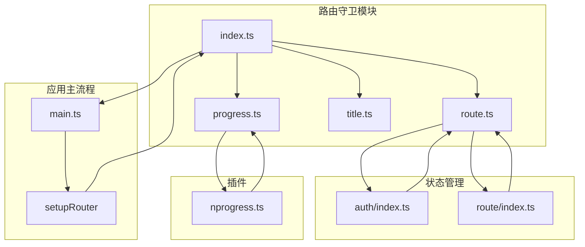
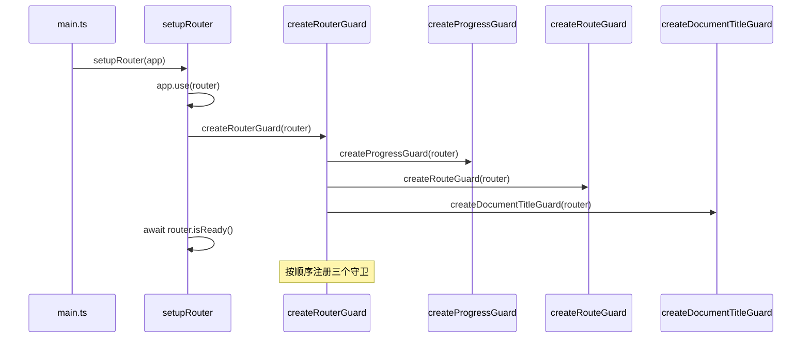
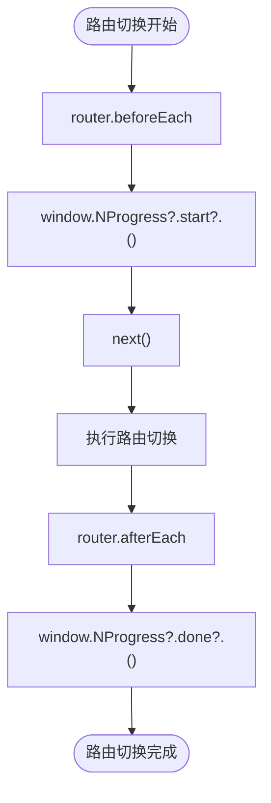
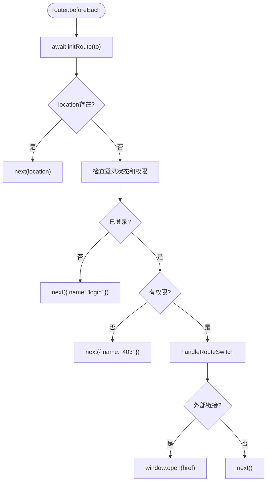
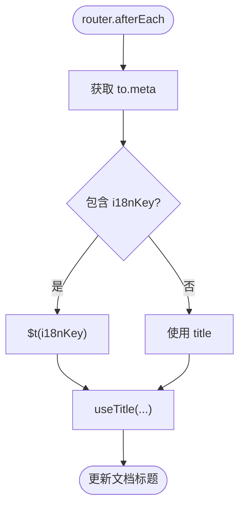
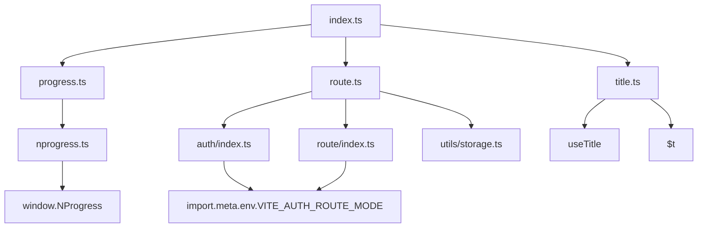

# 路由守卫

<cite>
**本文档引用的文件**  
- [index.ts](file://frontend/src/router/guard/index.ts)
- [progress.ts](file://frontend/src/router/guard/progress.ts)
- [route.ts](file://frontend/src/router/guard/route.ts)
- [title.ts](file://frontend/src/router/guard/title.ts)
- [main.ts](file://frontend/src/main.ts)
- [nprogress.ts](file://frontend/src/plugins/nprogress.ts)
- [auth/index.ts](file://frontend/src/store/modules/auth/index.ts)
- [route/index.ts](file://frontend/src/store/modules/route/index.ts)
- [vite-env.d.ts](file://frontend/src/typings/vite-env.d.ts)
</cite>

## 目录
1. [引言](#引言)
2. [项目结构](#项目结构)
3. [核心组件](#核心组件)
4. [架构概览](#架构概览)
5. [详细组件分析](#详细组件分析)
6. [依赖分析](#依赖分析)
7. [性能考量](#性能考量)
8. [故障排除指南](#故障排除指南)
9. [结论](#结论)

## 引言
本文档深入剖析了Vue Router在本项目中的导航守卫体系实现。重点分析`guard`目录下的三个核心守卫模块：`progress.ts`、`route.ts`和`title.ts`，阐述其职责、执行顺序、异步协调机制以及与应用主流程的集成方式。通过代码示例，展示如何在守卫中集成加载状态管理和错误处理流程。

## 项目结构
项目采用模块化分层架构，路由守卫逻辑集中于`frontend/src/router/guard`目录下。该目录通过`index.ts`统一导出，由主应用入口`main.ts`调用，实现了关注点分离和高内聚的设计。



**图示来源**
- [index.ts](file://frontend/src/router/guard/index.ts)
- [main.ts](file://frontend/src/main.ts)
- [nprogress.ts](file://frontend/src/plugins/nprogress.ts)

## 核心组件
本项目的核心路由守卫组件包括：
- **加载进度守卫** (`progress.ts`): 负责在路由切换时显示和隐藏NProgress加载条。
- **权限路由守卫** (`route.ts`): 基于用户权限和路由元信息，实现动态路由匹配与访问拦截。
- **页面标题守卫** (`title.ts`): 根据路由元信息动态更新浏览器页面标题。

这些组件通过`createRouterGuard`函数统一注册，确保了执行顺序和逻辑的清晰性。

**组件来源**
- [progress.ts](file://frontend/src/router/guard/progress.ts)
- [route.ts](file://frontend/src/router/guard/route.ts)
- [title.ts](file://frontend/src/router/guard/title.ts)

## 架构概览
路由守卫的执行流程始于`main.ts`中的`setupApp`函数。应用初始化时，依次调用`setupNProgress`（初始化NProgress）、`setupRouter`（安装路由并创建守卫），最终完成守卫的注册。守卫的执行顺序由`createRouterGuard`函数的调用顺序决定。



**图示来源**
- [main.ts](file://frontend/src/main.ts#L20-L30)
- [index.ts](file://frontend/src/router/guard/index.ts#L10-L15)

## 详细组件分析

### 加载进度守卫分析
`progress.ts`模块实现了NProgress加载进度条的全局控制。它通过`router.beforeEach`和`router.afterEach`两个钩子，在路由切换开始时启动进度条，在切换完成后关闭进度条。



**图示来源**
- [progress.ts](file://frontend/src/router/guard/progress.ts#L4-L11)
- [nprogress.ts](file://frontend/src/plugins/nprogress.ts#L5-L8)

#### 代码实现
```typescript
// frontend/src/router/guard/progress.ts
export function createProgressGuard(router: Router) {
  router.beforeEach((_to, _from, next) => {
    window.NProgress?.start?.(); // 切换开始，启动进度条
    next();
  });
  router.afterEach(_to => {
    window.NProgress?.done?.(); // 切换完成，关闭进度条
  });
}
```
该模块依赖于`nprogress.ts`插件，后者通过`setupNProgress`函数在`main.ts`中被调用，将`NProgress`实例挂载到`window`对象上，供守卫模块使用。

**组件来源**
- [progress.ts](file://frontend/src/router/guard/progress.ts)
- [nprogress.ts](file://frontend/src/plugins/nprogress.ts)

### 权限路由守卫分析
`route.ts`是权限控制的核心模块，其实现了复杂的异步逻辑，包括路由初始化、登录状态检查、角色权限验证等。

#### 执行流程分析


**图示来源**
- [route.ts](file://frontend/src/router/guard/route.ts#L10-L190)

#### 核心逻辑详解
1.  **路由初始化 (`initRoute`)**:
    *   检查常量路由是否已初始化 (`isInitConstantRoute`)。若未初始化，则先初始化常量路由，并重定向到原目标路由。
    *   检查权限路由是否已初始化 (`isInitAuthRoute`)。若未初始化，则先初始化权限路由，并根据情况重定向。
    *   此机制确保了在路由未完全加载时，用户访问会被正确引导。

2.  **权限判断**:
    *   **登录状态**: 通过`localStg.get('token')`检查本地存储的token。
    *   **角色权限**: 从`to.meta.roles`获取路由所需角色，与`authStore.userInfo.role`进行比对。
    *   **超级管理员**: 通过`isStaticSuper`计算属性判断是否为静态超级角色，拥有所有权限。

3.  **处理逻辑**:
    *   已登录且访问登录页，重定向到首页。
    *   无需登录的路由（如404），直接放行。
    *   未登录，重定向到登录页，并携带`redirect`参数。
    *   已登录但无权限，重定向到403页面。

4.  **外部链接处理 (`handleRouteSwitch`)**:
    *   如果路由元信息包含`href`，则在新窗口打开链接，并阻止当前路由跳转。

#### 与状态管理的集成
权限守卫深度依赖Pinia状态管理：
*   **`authStore`**: 提供用户信息 (`userInfo`)、登录状态 (`isLogin`) 和角色信息。
*   **`routeStore`**: 管理路由的初始化状态 (`isInitConstantRoute`, `isInitAuthRoute`) 和路由数据。

```typescript
// frontend/src/router/guard/route.ts
const authStore = useAuthStore();
const routeStore = useRouteStore();
```

**组件来源**
- [route.ts](file://frontend/src/router/guard/route.ts)
- [auth/index.ts](file://frontend/src/store/modules/auth/index.ts)
- [route/index.ts](file://frontend/src/store/modules/route/index.ts)

### 页面标题守卫分析
`title.ts`模块负责动态更新页面标题，支持国际化。



**图示来源**
- [title.ts](file://frontend/src/router/guard/title.ts#L7-L13)

#### 代码实现
```typescript
// frontend/src/router/guard/title.ts
export function createDocumentTitleGuard(router: Router) {
  router.afterEach(to => {
    const { i18nKey, title } = to.meta;
    // 优先使用国际化键，否则使用静态标题
    const documentTitle = i18nKey ? $t(i18nKey) : title;
    useTitle(documentTitle); // 利用VueUse的useTitle函数
  });
}
```
该守卫在`router.afterEach`钩子中执行，确保DOM已更新。它利用`@vueuse/core`的`useTitle`函数来设置`document.title`，并优先使用`i18nKey`进行国际化翻译。

**组件来源**
- [title.ts](file://frontend/src/router/guard/title.ts)

## 依赖分析
路由守卫体系依赖于多个核心模块，形成了一个紧密协作的网络。



**图示来源**
- [index.ts](file://frontend/src/router/guard/index.ts)
- [vite-env.d.ts](file://frontend/src/typings/vite-env.d.ts#L80)

### 关键依赖说明
*   **`nprogress.ts`**: 为`progress.ts`提供NProgress实例。
*   **`auth/index.ts` 和 `route/index.ts`**: 为`route.ts`提供用户状态和路由状态。
*   **`import.meta.env.VITE_AUTH_ROUTE_MODE`**: 环境变量，决定权限路由是静态生成还是动态从后端获取，影响`routeStore`的初始化逻辑。
*   **`@vueuse/core`**: 为`title.ts`提供`useTitle`工具函数。

## 性能考量
1.  **异步操作**: `route.ts`中的`initRoute`函数包含`await`操作，可能会阻塞路由跳转。应确保`initConstantRoute`和`initAuthRoute`的API调用高效。
2.  **状态管理**: 频繁读取Pinia store的状态是高效的，但应避免在守卫中进行复杂的计算。
3.  **NProgress**: 加载条的显示/隐藏是轻量级的DOM操作，对性能影响极小。

## 故障排除指南
*   **问题**: 加载条不显示。
  *   **检查**: 确认`main.ts`中是否调用了`setupNProgress()`。
  *   **检查**: 确认`nprogress.css`是否已正确引入。
*   **问题**: 登录后无法跳转，或权限判断失效。
  *   **检查**: 确认`authStore`中的`token`和`userInfo`是否正确设置。
  *   **检查**: 确认路由元信息中的`roles`字段是否正确配置。
  *   **检查**: 环境变量`VITE_AUTH_ROUTE_MODE`的值是否符合预期。
*   **问题**: 页面标题未更新。
  *   **检查**: 确认`title.ts`是否已通过`createRouterGuard`注册。
  *   **检查**: 确认路由元信息中`title`或`i18nKey`是否存在。

**组件来源**
- [main.ts](file://frontend/src/main.ts#L22)
- [route.ts](file://frontend/src/router/guard/route.ts)
- [auth/index.ts](file://frontend/src/store/modules/auth/index.ts)

## 结论
本项目的路由守卫体系设计精良，职责清晰。通过`progress.ts`、`route.ts`和`title.ts`三个模块的协同工作，实现了加载状态、权限控制和页面标题的自动化管理。其与Pinia状态管理和应用主流程的集成方式体现了高内聚、低耦合的设计原则。开发者可以基于此体系，轻松扩展更复杂的路由控制逻辑。