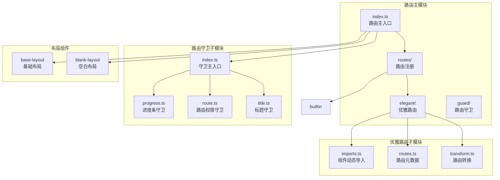
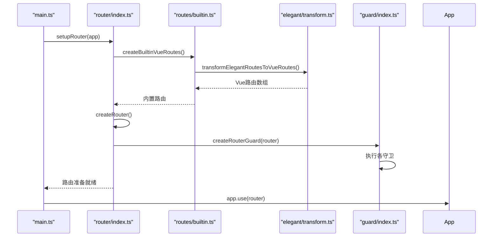
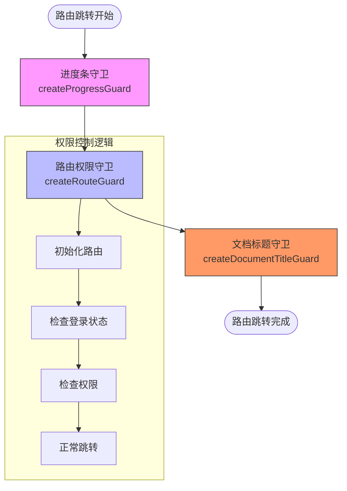
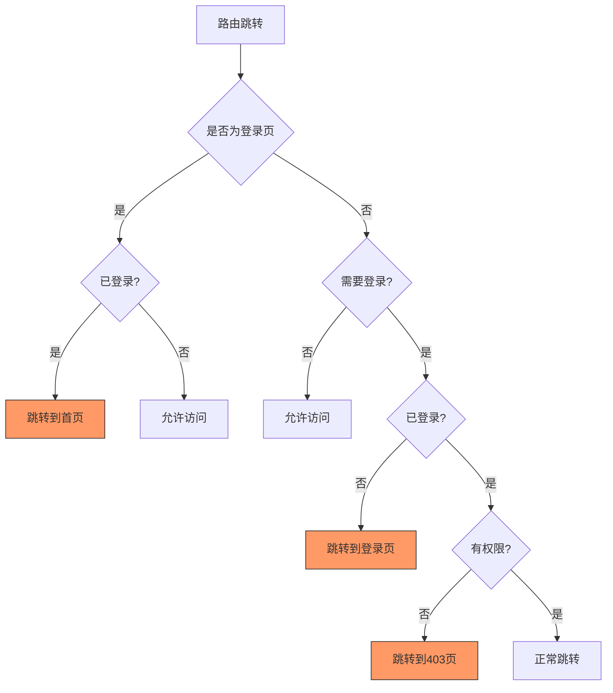
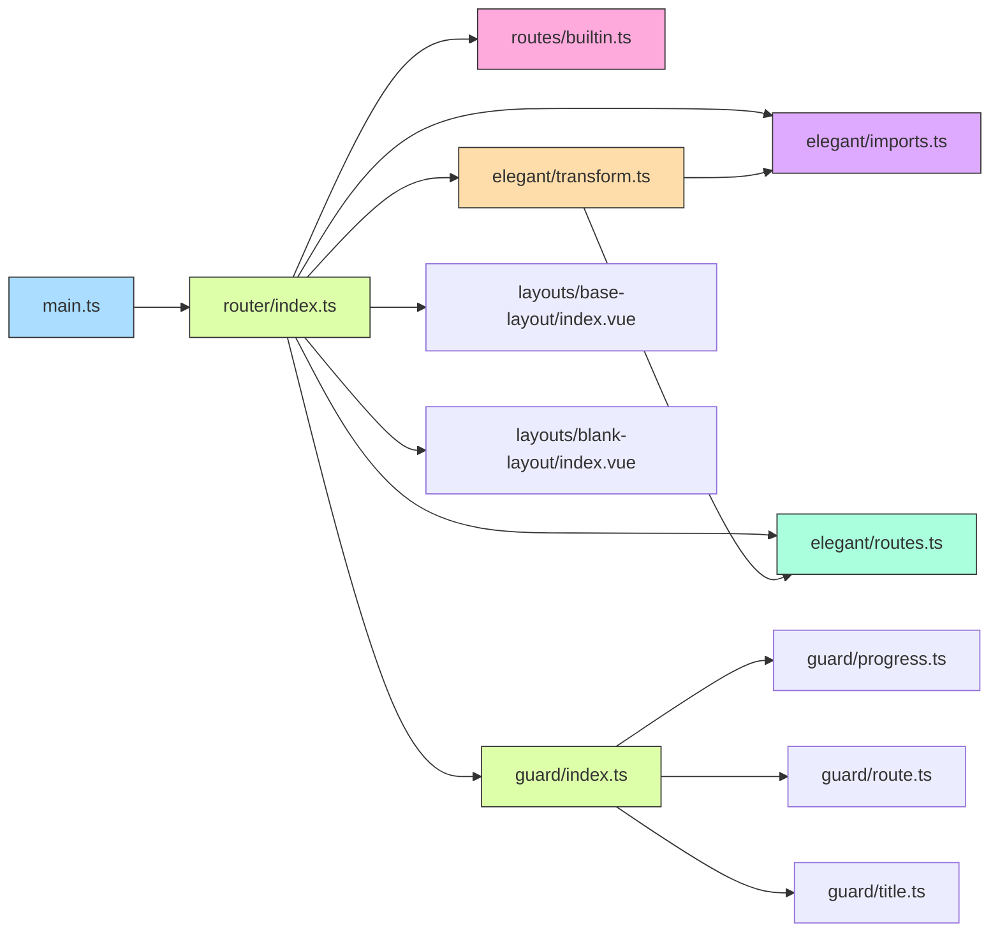
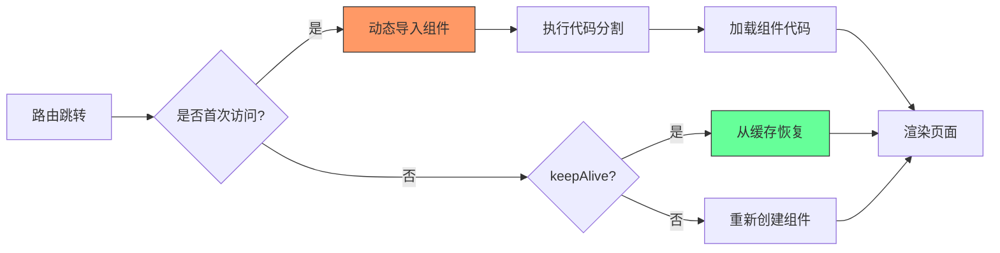

# 路由结构

<cite>
**本文档中引用的文件**  
- [index.ts](file://frontend/src/router/index.ts)
- [builtin.ts](file://frontend/src/router/routes/builtin.ts)
- [routes.ts](file://frontend/src/router/elegant/routes.ts)
- [transform.ts](file://frontend/src/router/elegant/transform.ts)
- [imports.ts](file://frontend/src/router/elegant/imports.ts)
- [index.ts](file://frontend/src/router/guard/index.ts)
- [progress.ts](file://frontend/src/router/guard/progress.ts)
- [route.ts](file://frontend/src/guard/route.ts)
- [title.ts](file://frontend/src/router/guard/title.ts)
- [main.ts](file://frontend/src/main.ts)
- [base-layout/index.vue](file://frontend/src/layouts/base-layout/index.vue)
- [blank-layout/index.vue](file://frontend/src/layouts/blank-layout/index.vue)
- [router.d.ts](file://frontend/src/typings/router.d.ts)
</cite>

## 目录
1. [简介](#简介)
2. [项目结构](#项目结构)
3. [核心组件](#核心组件)
4. [架构概览](#架构概览)
5. [详细组件分析](#详细组件分析)
6. [依赖分析](#依赖分析)
7. [性能考量](#性能考量)
8. [故障排除指南](#故障排除指南)
9. [结论](#结论)

## 简介
本文档详细解析了基于 Vue Router 的前端路由系统设计，重点阐述了路由元数据定义、动态导入与转换机制、路由守卫执行顺序与权限控制逻辑、预设路由与动态路由注册方式，以及路由与布局组件的联动机制。系统采用 elegant-router 方案实现路由的优雅管理，通过模块化设计实现了路由配置的自动化与灵活性。

## 项目结构
项目路由系统采用分层架构设计，主要由以下模块构成：



**图示来源**  
- [index.ts](file://frontend/src/router/index.ts)
- [builtin.ts](file://frontend/src/router/routes/builtin.ts)
- [imports.ts](file://frontend/src/router/elegant/imports.ts)
- [routes.ts](file://frontend/src/router/elegant/routes.ts)
- [transform.ts](file://frontend/src/router/elegant/transform.ts)

**本节来源**  
- [index.ts](file://frontend/src/router/index.ts)
- [routes](file://frontend/src/router/routes)
- [elegant](file://frontend/src/router/elegant)
- [guard](file://frontend/src/router/guard)

## 核心组件
路由系统的核心组件包括路由定义、转换机制、守卫逻辑和布局联动。系统通过 `elegant-router` 方案实现路由的自动化管理，将路由配置与组件导入分离，提高了代码的可维护性。

**本节来源**  
- [index.ts](file://frontend/src/router/index.ts#L1-L30)
- [transform.ts](file://frontend/src/router/elegant/transform.ts#L1-L197)

## 架构概览
整个路由系统的初始化流程始于 `main.ts`，通过 `setupRouter` 函数注册路由实例并应用路由守卫。路由配置采用分层设计，预设路由与动态路由通过统一的转换机制生成 Vue Router 所需的路由记录。



**图示来源**  
- [main.ts](file://frontend/src/main.ts#L1-L33)
- [index.ts](file://frontend/src/router/index.ts#L1-L30)
- [builtin.ts](file://frontend/src/router/routes/builtin.ts#L1-L31)
- [transform.ts](file://frontend/src/router/elegant/transform.ts#L1-L197)
- [index.ts](file://frontend/src/router/guard/index.ts#L1-L15)

## 详细组件分析
### 路由元数据定义与转换机制
系统采用 `elegant-router` 方案定义路由元数据，通过 `elegant/routes.ts` 文件集中管理所有路由配置。每个路由包含名称、路径、组件和元信息等关键属性。

```typescript
{
  name: 'chat',
  path: '/chat',
  component: 'layout.base$view.chat',
  meta: {
    title: 'chat',
    i18nKey: 'route.chat',
    icon: 'solar:chat-round-call-line-duotone',
    order: 1
  }
}
```

路由元信息（meta）包含丰富的控制属性，用于控制页面行为：

- **title**: 页面标题
- **i18nKey**: 国际化键名
- **icon**: 菜单图标
- **order**: 菜单排序
- **roles**: 角色权限
- **constant**: 是否为常量路由
- **hideInMenu**: 是否在菜单中隐藏
- **keepAlive**: 是否缓存页面
- **multiTab**: 是否允许多标签页

**本节来源**  
- [routes.ts](file://frontend/src/router/elegant/routes.ts#L1-L136)
- [router.d.ts](file://frontend/src/typings/router.d.ts#L1-L52)

#### 路由动态导入与转换
系统通过 `elegant/imports.ts` 实现组件的动态导入，采用 `import()` 函数实现代码分割，提升应用性能。

```mermaid
classDiagram
class RouteTransformer {
+transformElegantRoutesToVueRoutes(routes, layouts, views)
+transformElegantRouteToVueRoute(route, layouts, views)
+getRoutePath(name)
+getRouteName(path)
}
class ComponentImporter {
+layouts : Record~string, RouteComponent~
+views : Record~string, () => Promise~RouteComponent~~
}
RouteTransformer --> ComponentImporter : "使用"
RouteTransformer --> VueRouter : "生成"
note right of RouteTransformer
路由转换器负责将优雅路由
转换为Vue Router所需的
路由记录格式
end
note left of ComponentImporter
组件导入器通过动态导入
实现代码分割和懒加载
end
```

**图示来源**  
- [imports.ts](file://frontend/src/router/elegant/imports.ts#L1-L29)
- [transform.ts](file://frontend/src/router/elegant/transform.ts#L1-L197)

**本节来源**  
- [imports.ts](file://frontend/src/router/elegant/imports.ts#L1-L29)
- [transform.ts](file://frontend/src/router/elegant/transform.ts#L1-L197)

### 路由守卫执行顺序与权限控制
路由守卫系统采用分层设计，通过 `guard/index.ts` 统一注册，确保守卫按特定顺序执行。



**图示来源**  
- [index.ts](file://frontend/src/router/guard/index.ts#L1-L15)
- [progress.ts](file://frontend/src/router/guard/progress.ts#L1-L11)
- [route.ts](file://frontend/src/router/guard/route.ts#L1-L192)
- [title.ts](file://frontend/src/router/guard/title.ts#L1-L13)

#### 进度条守卫
进度条守卫在路由跳转前后控制 NProgress 的显示与隐藏，提供用户友好的加载反馈。

```typescript
export function createProgressGuard(router: Router) {
  router.beforeEach((_to, _from, next) => {
    window.NProgress?.start?.();
    next();
  });
  router.afterEach(_to => {
    window.NProgress?.done?.();
  });
}
```

**本节来源**  
- [progress.ts](file://frontend/src/router/guard/progress.ts#L1-L11)

#### 路由权限守卫
路由权限守卫实现完整的权限控制逻辑，包括登录验证、角色权限检查和路由初始化。



**图示来源**  
- [route.ts](file://frontend/src/router/guard/route.ts#L1-L192)

**本节来源**  
- [route.ts](file://frontend/src/router/guard/route.ts#L1-L192)

#### 标题守卫
标题守卫在路由跳转后更新文档标题，支持国际化。

```typescript
export function createDocumentTitleGuard(router: Router) {
  router.afterEach(to => {
    const { i18nKey, title } = to.meta;
    const documentTitle = i18nKey ? $t(i18nKey) : title;
    useTitle(documentTitle);
  });
}
```

**本节来源**  
- [title.ts](file://frontend/src/router/guard/title.ts#L1-L13)

### 预设路由与动态路由注册
系统通过 `builtin.ts` 文件注册预设路由，包括根路由和404路由。

```typescript
export const ROOT_ROUTE: CustomRoute = {
  name: 'root',
  path: '/',
  redirect: getRoutePath(import.meta.env.VITE_ROUTE_HOME) || '/home',
  meta: {
    title: 'root',
    constant: true
  }
};

const NOT_FOUND_ROUTE: CustomRoute = {
  name: 'not-found',
  path: '/:pathMatch(.*)*',
  component: 'layout.blank$view.404',
  meta: {
    title: 'not-found',
    constant: true
  }
};
```

预设路由通过 `createBuiltinVueRoutes` 函数转换为 Vue Router 格式，并与动态路由合并。

**本节来源**  
- [builtin.ts](file://frontend/src/router/routes/builtin.ts#L1-L31)

### 路由与布局组件联动机制
系统通过 `base-layout` 和 `blank-layout` 两种布局组件实现不同的页面结构。

#### 基础布局组件
基础布局组件 `base-layout/index.vue` 集成了头部、侧边栏、标签页、内容区和底部等模块。

```mermaid
classDiagram
class BaseLayout {
+layoutMode : computed
+headerProps : computed
+siderVisible : computed
+siderWidth : computed
+siderCollapsedWidth : computed
}
BaseLayout --> AdminLayout : "使用"
BaseLayout --> GlobalHeader : "包含"
BaseLayout --> GlobalSider : "包含"
BaseLayout --> GlobalTab : "包含"
BaseLayout --> GlobalContent : "包含"
BaseLayout --> GlobalFooter : "包含"
BaseLayout --> ThemeDrawer : "包含"
BaseLayout --> GlobalMenu : "异步加载"
note right of BaseLayout
基础布局组件通过计算属性
动态控制布局行为，支持
多种布局模式
end
```

**图示来源**  
- [base-layout/index.vue](file://frontend/src/layouts/base-layout/index.vue#L1-L148)

**本节来源**  
- [base-layout/index.vue](file://frontend/src/layouts/base-layout/index.vue#L1-L148)
- [blank-layout/index.vue](file://frontend/src/layouts/blank-layout/index.vue#L1-L13)

#### 空白布局组件
空白布局组件 `blank-layout/index.vue` 仅包含内容区域，适用于登录页等简单页面。

```typescript
<script setup lang="ts">
import GlobalContent from '../modules/global-content/index.vue';

defineOptions({
  name: 'BlankLayout'
});
</script>

<template>
  <GlobalContent :show-padding="false" />
</template>
```

**本节来源**  
- [blank-layout/index.vue](file://frontend/src/layouts/blank-layout/index.vue#L1-L13)

## 依赖分析
路由系统各组件之间的依赖关系清晰，采用单向依赖原则，避免循环依赖。



**图示来源**  
- [main.ts](file://frontend/src/main.ts#L1-L33)
- [index.ts](file://frontend/src/router/index.ts#L1-L30)
- [builtin.ts](file://frontend/src/router/routes/builtin.ts#L1-L31)
- [imports.ts](file://frontend/src/router/elegant/imports.ts#L1-L29)
- [routes.ts](file://frontend/src/router/elegant/routes.ts#L1-L136)
- [transform.ts](file://frontend/src/router/elegant/transform.ts#L1-L197)
- [guard/index.ts](file://frontend/src/router/guard/index.ts#L1-L15)

**本节来源**  
- [main.ts](file://frontend/src/main.ts#L1-L33)
- [index.ts](file://frontend/src/router/index.ts#L1-L30)

## 性能考量
系统通过多种策略优化路由性能：

1. **代码分割**：通过动态导入实现路由级别的代码分割
2. **懒加载**：组件按需加载，减少初始包大小
3. **路由缓存**：通过 `keepAlive` 元信息控制页面缓存
4. **预加载**：关键路由预加载提升用户体验



**本节来源**  
- [imports.ts](file://frontend/src/router/elegant/imports.ts#L1-L29)
- [routes.ts](file://frontend/src/router/elegant/routes.ts#L1-L136)

## 故障排除指南
### 常见问题及解决方案

1. **路由无法访问**
   - 检查路由元信息中的 `constant` 属性
   - 确认用户登录状态和角色权限
   - 检查组件路径是否正确

2. **布局显示异常**
   - 检查布局组件的计算属性配置
   - 确认主题设置是否正确
   - 检查 CSS 变量设置

3. **动态导入失败**
   - 确认组件路径正确性
   - 检查模块是否存在
   - 验证动态导入语法

4. **守卫不生效**
   - 确认守卫已正确注册
   - 检查守卫执行顺序
   - 验证路由跳转逻辑

**本节来源**  
- [route.ts](file://frontend/src/router/guard/route.ts#L1-L192)
- [transform.ts](file://frontend/src/router/elegant/transform.ts#L1-L197)
- [imports.ts](file://frontend/src/router/elegant/imports.ts#L1-L29)

## 结论
本文档详细解析了基于 Vue Router 的路由系统设计，涵盖了路由元数据定义、动态导入与转换机制、路由守卫执行顺序与权限控制逻辑、预设路由与动态路由注册方式，以及路由与布局组件的联动机制。系统采用优雅的设计模式，通过模块化和自动化实现了路由的高效管理，为应用提供了灵活、安全和高性能的路由解决方案。