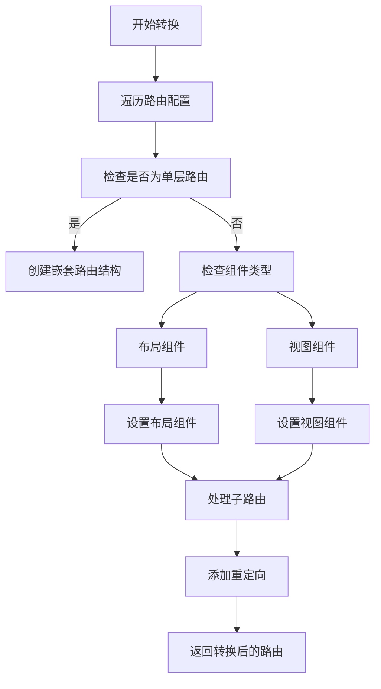
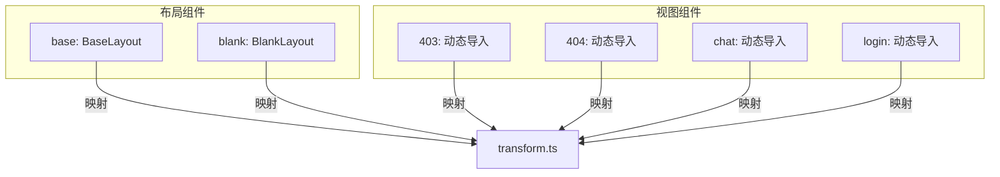
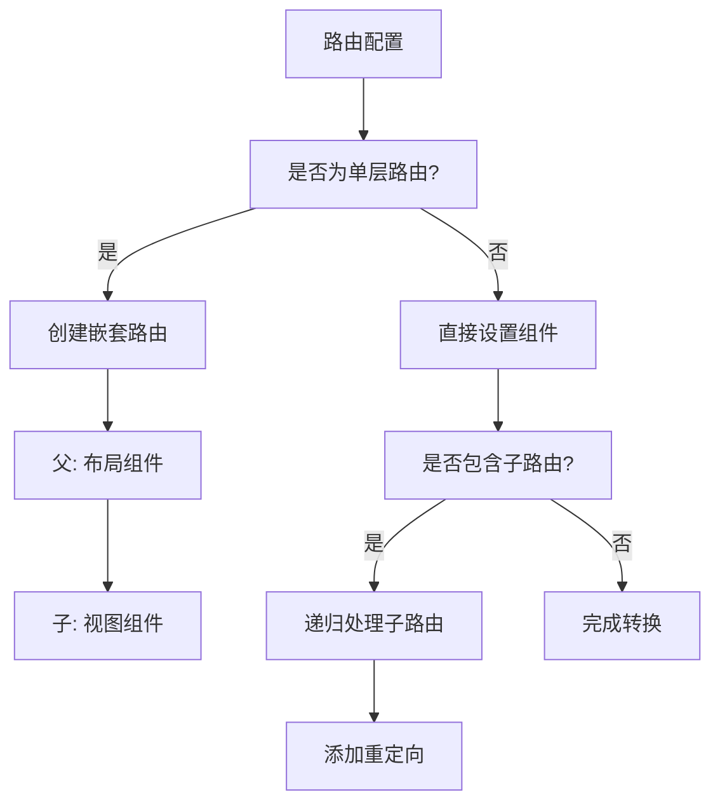
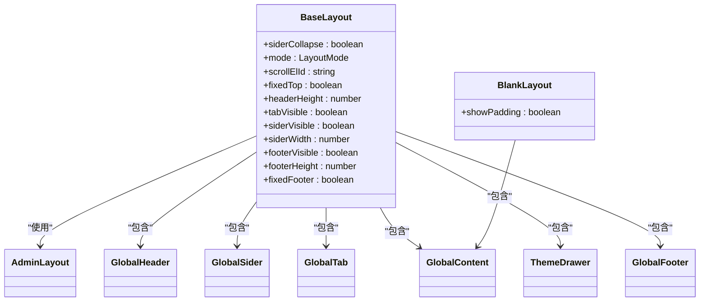
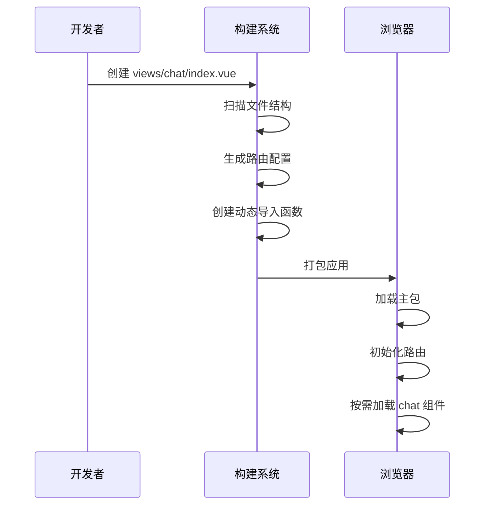
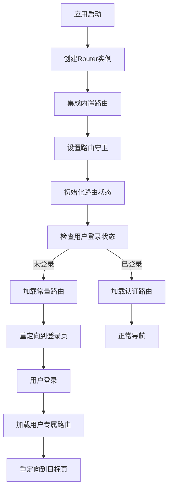

# 路由转换机制

<cite>
**本文档引用的文件**   
- [transform.ts](file://frontend/src/router/elegant/transform.ts)
- [imports.ts](file://frontend/src/router/elegant/imports.ts)
- [routes.ts](file://frontend/src/router/elegant/routes.ts)
- [base-layout/index.vue](file://frontend/src/layouts/base-layout/index.vue)
- [blank-layout/index.vue](file://frontend/src/layouts/blank-layout/index.vue)
- [router.ts](file://frontend/build/plugins/router.ts)
- [index.ts](file://frontend/src/router/index.ts)
- [builtin.ts](file://frontend/src/router/routes/builtin.ts)
- [route.ts](file://frontend/src/router/guard/route.ts)
- [index.ts](file://frontend/src/store/modules/route/index.ts)
</cite>

## 目录
1. [路由转换机制](#路由转换机制)
2. [核心转换逻辑](#核心转换逻辑)
3. [自动路由发现与导入](#自动路由发现与导入)
4. [路由层级与嵌套处理](#路由层级与嵌套处理)
5. [布局映射策略](#布局映射策略)
6. [开发体验与性能影响](#开发体验与性能影响)
7. [系统集成与工作流](#系统集成与工作流)

## 核心转换逻辑

elegant路由系统的核心转换逻辑由`transform.ts`文件实现，该文件定义了`transformElegantRoutesToVueRoutes`函数，负责将原始的elegant路由配置转换为Vue Router兼容的路由记录（RouteRecordRaw）。此转换过程是整个路由系统的基础，确保了自定义路由配置能够被Vue Router正确解析和使用。

转换函数接收三个主要参数：原始路由配置数组、布局组件映射和视图组件映射。通过`flatMap`方法遍历每个路由项并调用内部的`transformElegantRouteToVueRoute`函数进行逐个转换。这种设计允许系统处理复杂的嵌套路由结构，并在转换过程中进行错误处理和日志记录。

**图示来源**
- [transform.ts](file://frontend/src/router/elegant/transform.ts#L39-L145)

**本节来源**
- [transform.ts](file://frontend/src/router/elegant/transform.ts#L0-L197)

## 自动路由发现与导入

自动路由发现与导入机制由`imports.ts`文件实现，该文件通过`views`对象将文件路径映射到动态导入函数。系统利用Vite的`import()`函数实现按需加载，每个视图组件都被定义为一个返回Promise的异步函数。例如，`chat`路由对应的视图组件被定义为`() => import("@/views/chat/index.vue")`，这确保了组件只在需要时才被加载，优化了应用的初始加载性能。

`imports.ts`文件还定义了`layouts`对象，用于管理布局组件。当前系统支持两种布局：`base`（基础布局）和`blank`（空白布局）。这些布局组件是静态导入的，因为它们是应用的核心UI结构，需要在应用启动时立即可用。

**图示来源**
- [imports.ts](file://frontend/src/router/elegant/imports.ts#L0-L29)
- [transform.ts](file://frontend/src/router/elegant/transform.ts#L39-L93)

**本节来源**
- [imports.ts](file://frontend/src/router/elegant/imports.ts#L0-L29)

## 路由层级与嵌套处理

路由层级与嵌套处理是`transform.ts`中的关键逻辑，系统通过`isFirstLevelRoute`和`isSingleLevelRoute`等辅助函数来判断路由的层级关系。单层路由（single level route）是指没有子路由且名称中不包含下划线分隔符的一级路由。对于这类路由，系统会创建一个特殊的嵌套路由结构，将布局组件作为父路由，视图组件作为子路由。

当路由包含子路由时，系统会递归调用`transformElegantRouteToVueRoute`函数处理每个子路由。如果父路由是一级路由，则子路由会被添加到父路由的`children`数组中；否则，子路由会被直接推入结果数组。这种处理方式确保了路由树的正确构建，同时通过`redirect`属性为有子路由的节点自动添加重定向规则，指向第一个子路由。

**图示来源**
- [transform.ts](file://frontend/src/router/elegant/transform.ts#L91-L145)

**本节来源**
- [transform.ts](file://frontend/src/router/elegant/transform.ts#L39-L145)

## 布局映射策略

布局映射策略通过组件字符串前缀来实现，系统定义了`layout.`和`view.`两个前缀来区分布局组件和视图组件。在`transformElegantRouteToVueRoute`函数中，通过`isLayout`和`isView`函数检查组件字符串的前缀，从而确定组件类型。例如，`layout.base$view.chat`表示使用`base`布局和`chat`视图。

对于基础布局（base layout），系统使用`AdminLayout`组件，该组件提供了完整的管理界面结构，包括头部、侧边栏、标签页和内容区域。而空白布局（blank layout）则仅包含`GlobalContent`组件，适用于登录页等不需要复杂布局的页面。这种设计使得开发者可以通过简单的字符串配置来选择不同的页面布局，极大地提高了路由配置的灵活性。

**图示来源**
- [base-layout/index.vue](file://frontend/src/layouts/base-layout/index.vue#L0-L148)
- [blank-layout/index.vue](file://frontend/src/layouts/blank-layout/index.vue#L0-L13)
- [transform.ts](file://frontend/src/router/elegant/transform.ts#L39-L93)

**本节来源**
- [base-layout/index.vue](file://frontend/src/layouts/base-layout/index.vue#L0-L148)
- [blank-layout/index.vue](file://frontend/src/layouts/blank-layout/index.vue#L0-L13)

## 开发体验与性能影响

自动导入机制显著减少了手动路由注册的工作量，开发者只需在`views`目录下创建相应的Vue组件，系统就会自动发现并生成路由配置。这种约定优于配置的设计模式提高了开发效率，减少了出错的可能性。同时，动态导入确保了代码分割，每个路由组件都被打包成独立的chunk，实现了按需加载，优化了应用的初始加载时间。

在构建性能方面，由于路由配置是静态生成的，构建过程可以进行充分的优化。Vite的HMR（热模块替换）机制也能很好地支持这种路由结构，当修改某个视图组件时，只有相关的模块会被重新编译和加载，提供了快速的开发反馈循环。此外，通过`elegant-router`插件的配置，系统还能自动生成路由元数据，如国际化键和常量路由标记，进一步简化了开发工作。

**图示来源**
- [imports.ts](file://frontend/src/router/elegant/imports.ts#L0-L29)
- [router.ts](file://frontend/build/plugins/router.ts#L0-L41)

**本节来源**
- [imports.ts](file://frontend/src/router/elegant/imports.ts#L0-L29)
- [router.ts](file://frontend/build/plugins/router.ts#L0-L41)

## 系统集成与工作流

路由系统通过多个文件的协同工作实现完整功能。`index.ts`作为主路由配置文件，创建Vue Router实例并集成内置路由。`builtin.ts`文件定义了根路由和404路由等必须的常量路由，这些路由通过`createBuiltinVueRoutes`函数转换为Vue Router格式。`routes/index.ts`文件提供了`getAuthVueRoutes`函数，用于获取认证路由的Vue Router版本。

路由守卫`route.ts`在导航前进行权限检查，结合`routeStore`的状态管理，实现了复杂的路由逻辑。例如，当用户未登录时访问需要认证的路由，系统会自动重定向到登录页；当用户已登录但访问登录页时，会重定向到首页。这种集成确保了路由系统的安全性和用户体验的一致性。

**图示来源**
- [index.ts](file://frontend/src/router/index.ts#L0-L30)
- [builtin.ts](file://frontend/src/router/routes/builtin.ts#L0-L30)
- [route.ts](file://frontend/src/router/guard/route.ts#L0-L192)
- [index.ts](file://frontend/src/store/modules/route/index.ts#L0-L199)

**本节来源**
- [index.ts](file://frontend/src/router/index.ts#L0-L30)
- [builtin.ts](file://frontend/src/router/routes/builtin.ts#L0-L30)
- [route.ts](file://frontend/src/router/guard/route.ts#L0-L192)
- [index.ts](file://frontend/src/store/modules/route/index.ts#L0-L199)