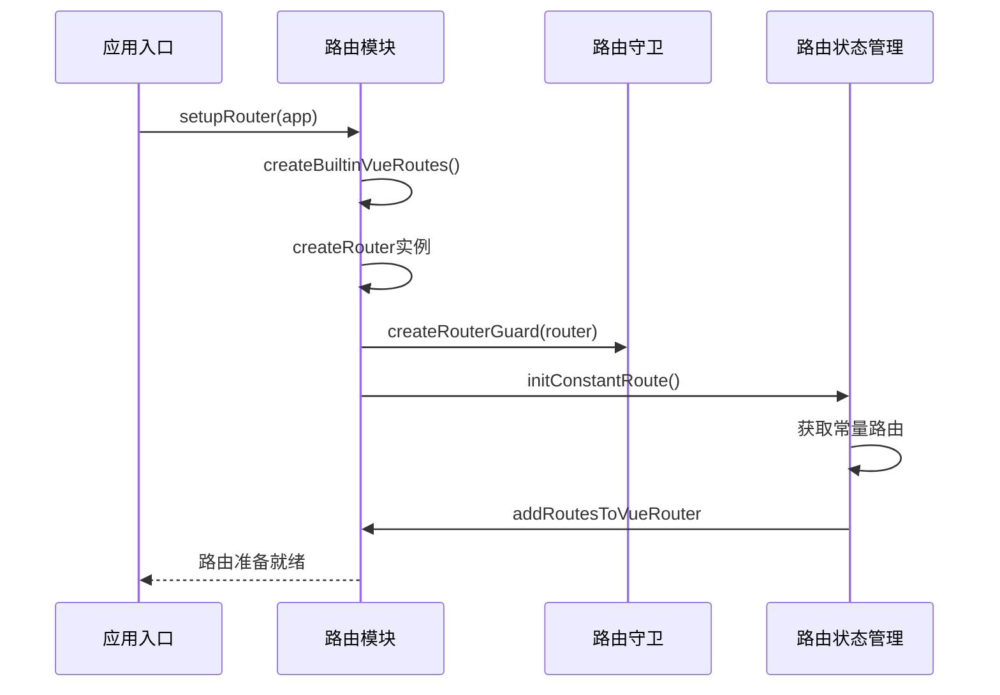
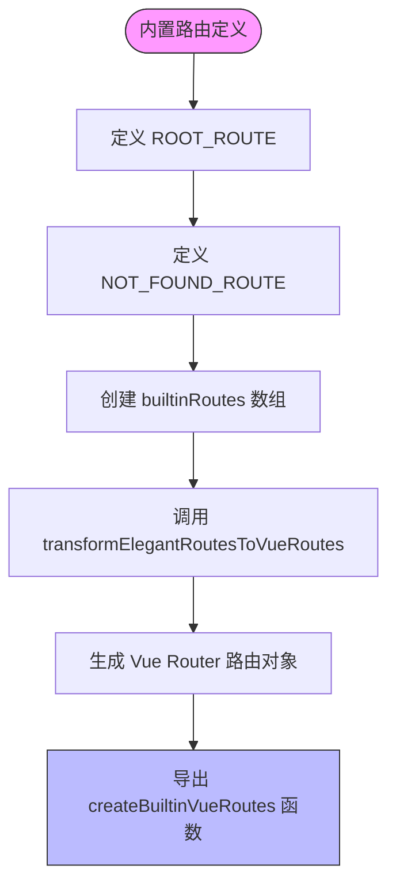
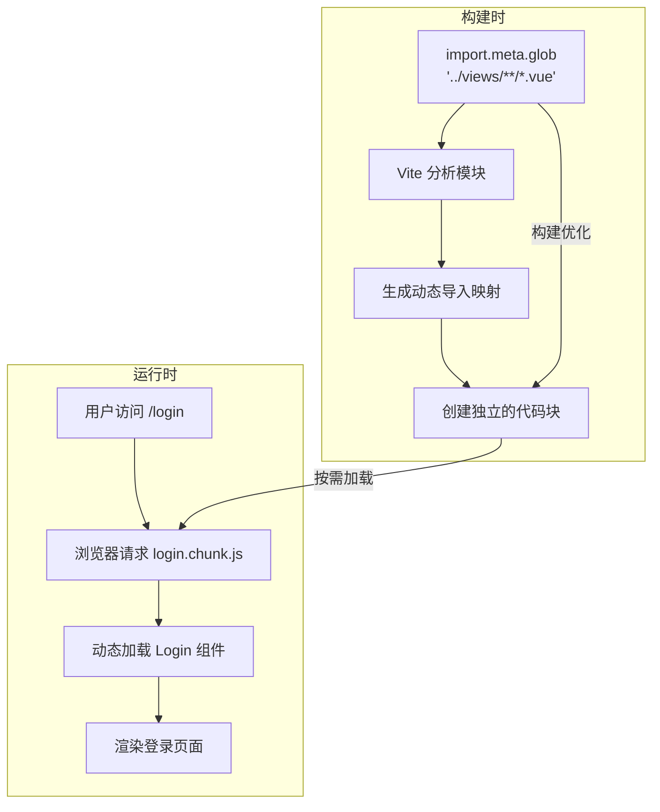
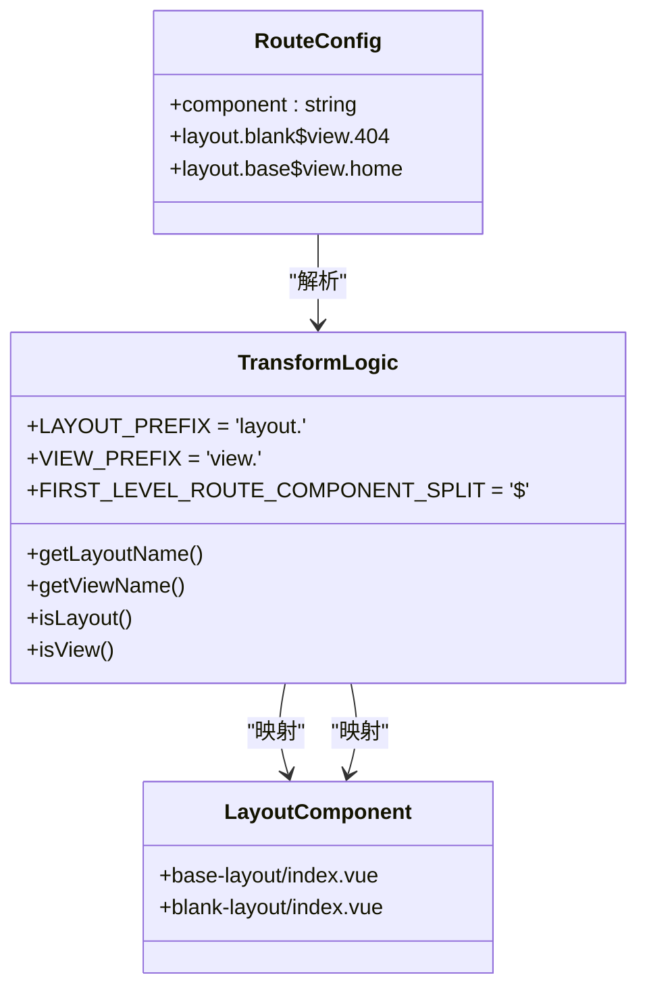

# 路由配置

<cite>
**本文档引用的文件**   
- [index.ts](file://frontend/src/router/index.ts)
- [builtin.ts](file://frontend/src/router/routes/builtin.ts)
- [routes.ts](file://frontend/src/router/elegant/routes.ts)
- [transform.ts](file://frontend/src/router/elegant/transform.ts)
- [imports.ts](file://frontend/src/router/elegant/imports.ts)
- [router.ts](file://frontend/build/plugins/router.ts)
- [router.d.ts](file://frontend/src/typings/router.d.ts)
- [elegant-router.d.ts](file://frontend/src/typings/elegant-router.d.ts)
</cite>

## 目录
1. [路由初始化流程](#路由初始化流程)
2. [路由元数据结构设计](#路由元数据结构设计)
3. [预设路由静态注册](#预设路由静态注册)
4. [路由级代码分割机制](#路由级代码分割机制)
5. [布局组件映射关系](#布局组件映射关系)
6. [自定义路由配置示例](#自定义路由配置示例)

## 路由初始化流程

前端路由系统的初始化流程始于 `frontend/src/router/index.ts` 文件，该文件负责整合 elegant 路由系统与 Vue Router 实例。初始化过程遵循严格的顺序和依赖关系，确保路由系统在应用启动时正确配置。



**图示来源**
- [index.ts](file://frontend/src/router/index.ts#L0-L29)
- [builtin.ts](file://frontend/src/router/routes/builtin.ts#L0-L30)
- [store/index.ts](file://frontend/src/store/modules/route/index.ts)

**流程分析**
1. **创建路由实例**：在 `index.ts` 中，首先通过 `createRouter` 创建 Vue Router 实例，其历史模式由环境变量 `VITE_ROUTER_HISTORY_MODE` 决定（支持 hash、history、memory 三种模式）。
2. **初始化内置路由**：调用 `createBuiltinVueRoutes()` 函数生成根路由和 404 路由等基础路由，并将其作为初始路由配置。
3. **设置路由守卫**：通过 `createRouterGuard(router)` 注册全局前置守卫，实现权限验证、登录状态检查等核心功能。
4. **异步等待准备**：调用 `router.isReady()` 确保路由系统完全初始化后，应用才进入就绪状态。

**代码示例**
```typescript
// frontend/src/router/index.ts
export const router = createRouter({
  history: historyCreatorMap[VITE_ROUTER_HISTORY_MODE](VITE_BASE_URL),
  routes: createBuiltinVueRoutes() // 初始仅包含内置路由
});

export async function setupRouter(app: App) {
  app.use(router);
  createRouterGuard(router);
  await router.isReady(); // 等待路由准备就绪
}
```

**初始化流程**
- [index.ts](file://frontend/src/router/index.ts#L0-L29)
- [guard/route.ts](file://frontend/src/router/guard/route.ts#L0-L50)

## 路由元数据结构设计

路由元数据（meta）在 `frontend/src/typings/router.d.ts` 文件中通过 TypeScript 接口进行语义化定义，为每个路由提供丰富的附加信息。这些元数据字段在权限控制、UI 渲染和用户体验优化中发挥关键作用。

```mermaid
classDiagram
class RouteMeta {
+title : string
+i18nKey? : I18nKey
+roles? : string[]
+keepAlive? : boolean
+constant? : boolean
+icon? : string
+localIcon? : string
+order? : number
+hideInMenu? : boolean
+multiTab? : boolean
+fixedIndexInTab? : number
+query? : {key : string; value : string}[]
}
class RouteUsage {
+document.title ← title
+菜单/面包屑 ← icon/localIcon
+权限验证 ← roles/constant
+页面缓存 ← keepAlive
+标签页管理 ← multiTab/fixedIndexInTab
}
RouteMeta --> RouteUsage : "提供数据"
```

**图示来源**
- [router.d.ts](file://frontend/src/typings/router.d.ts#L0-L52)
- [tab/shared.ts](file://frontend/src/store/modules/tab/shared.ts#L64-L107)

**核心字段语义化定义**

**:title**
- **语义**：路由的标题，用于文档标题和标签页显示
- **类型**：`string`
- **优先级**：当 `i18nKey` 存在时，`title` 将被忽略

**:i18nKey**
- **语义**：国际化键值，用于多语言支持
- **类型**：`App.I18n.I18nKey | null`
- **格式**：`route.${key}`，如 `route.home`

**:roles**
- **语义**：访问该路由所需的角色列表
- **类型**：`string[]`
- **权限逻辑**：用户至少拥有其中一个角色即可访问
- **模式限制**：仅在静态路由模式下生效

**:constant**
- **语义**：是否为常量路由（无需登录验证）
- **类型**：`boolean | null`
- **典型应用**：登录页、错误页等公共页面

**:keepAlive**
- **语义**：是否启用页面缓存（Vue 的 keep-alive 功能）
- **类型**：`boolean | null`
- **性能优化**：避免组件重复创建和销毁

**:icon/localIcon**
- **语义**：菜单和面包屑中显示的图标
- **类型**：`string`
- **优先级**：`localIcon` 优先于 `icon`
- **来源**：`icon` 来自 Iconify 图标库，`localIcon` 来自本地 SVG 图标

**:hideInMenu**
- **语义**：是否在菜单中隐藏该路由
- **类型**：`boolean | null`
- **应用场景**：详情页、重定向页等非菜单项

**:multiTab**
- **语义**：不同查询参数是否使用独立标签页
- **类型**：`boolean | null`
- **用户体验**：避免相同路径不同参数的页面相互覆盖

**元数据使用**
- [router.d.ts](file://frontend/src/typings/router.d.ts#L0-L52)
- [tab/shared.ts](file://frontend/src/store/modules/tab/shared.ts#L64-L107)

## 预设路由静态注册

预设路由（如登录、错误页）通过 `frontend/src/router/routes/builtin.ts` 文件进行静态注册，这些路由是系统运行的基础，必须在应用启动时就位。



**图示来源**
- [builtin.ts](file://frontend/src/router/routes/builtin.ts#L0-L30)
- [transform.ts](file://frontend/src/router/elegant/transform.ts#L0-L41)

**核心实现**

**1. 根路由 (ROOT_ROUTE)**
```typescript
export const ROOT_ROUTE: CustomRoute = {
  name: 'root',
  path: '/',
  redirect: getRoutePath(import.meta.env.VITE_ROUTE_HOME) || '/home',
  meta: {
    title: 'root',
    constant: true
  }
};
```
- **功能**：应用的根路径，通常重定向到首页
- **动态配置**：重定向目标由环境变量 `VITE_ROUTE_HOME` 决定
- **常量路由**：`constant: true` 表示无需登录即可访问

**2. 404 路由 (NOT_FOUND_ROUTE)**
```typescript
const NOT_FOUND_ROUTE: CustomRoute = {
  name: 'not-found',
  path: '/:pathMatch(.*)*',
  component: 'layout.blank$view.404',
  meta: {
    title: 'not-found',
    constant: true
  }
};
```
- **通配符路径**：`/:pathMatch(.*)*` 匹配所有未定义的路径
- **组件映射**：使用 `layout.blank$view.404` 语法指定布局和视图
- **布局选择**：`blank` 布局通常用于无框架的错误页面

**3. 路由转换与导出**
```typescript
const builtinRoutes: CustomRoute[] = [ROOT_ROUTE, NOT_FOUND_ROUTE];

export function createBuiltinVueRoutes() {
  return transformElegantRoutesToVueRoutes(builtinRoutes, layouts, views);
}
```
- **转换函数**：`transformElegantRoutesToVueRoutes` 将优雅路由格式转换为 Vue Router 原生格式
- **依赖注入**：`layouts` 和 `views` 对象由 `elegant/imports` 模块提供，通过动态导入实现

**静态注册**
- [builtin.ts](file://frontend/src/router/routes/builtin.ts#L0-L30)
- [imports.ts](file://frontend/src/router/elegant/imports.ts)

## 路由级代码分割机制

路由级代码分割通过 `import.meta.glob` 动态导入实现，这是一种 Vite 原生支持的优化技术，能够显著提升首屏加载性能。



**图示来源**
- [router.ts](file://frontend/build/plugins/router.ts#L0-L40)
- [imports.ts](file://frontend/src/router/elegant/imports.ts)

**实现原理**

**1. 动态导入配置**
在 `frontend/build/plugins/router.ts` 中，`setupElegantRouter` 插件配置了布局组件的路径：
```typescript
export function setupElegantRouter() {
  return ElegantVueRouter({
    layouts: {
      base: 'src/layouts/base-layout/index.vue',
      blank: 'src/layouts/blank-layout/index.vue'
    },
    // ... 其他配置
  });
}
```
此配置被 `@elegant-router/vue/vite` 插件读取，并在构建时生成相应的动态导入代码。

**2. 视图组件的动态导入**
`frontend/src/router/elegant/imports.ts` 文件利用 `import.meta.glob` 实现视图组件的惰性加载：
```typescript
// 该文件由 elegant-router 插件自动生成
const views = import.meta.glob('../views/**/*.vue');
```
- **模式匹配**：`../views/**/*.vue` 匹配 views 目录下所有 Vue 组件
- **返回值**：一个对象，键为文件路径，值为返回组件的异步函数
- **打包效果**：每个匹配的组件都会被打包成独立的 chunk

**3. 路由转换中的应用**
在 `transformElegantRoutesToVueRoutes` 函数中，组件字符串被解析并映射到动态导入函数：
```typescript
// component: 'layout.base$view.home'
// layouts['base'] 和 views['home'] 分别指向对应的动态导入函数
vueRoute.component = layouts[layoutName]; // 或 views[viewName]
```
当路由被访问时，Vue Router 才会触发对应的动态导入，加载所需的组件代码。

**性能优势**
- **首屏体积减小**：仅加载当前页面所需代码，避免一次性加载所有页面
- **并行加载**：浏览器可以并行下载多个小的代码块
- **缓存友好**：未修改的代码块可以被浏览器长期缓存

**代码分割机制**
- [router.ts](file://frontend/build/plugins/router.ts#L0-L40)
- [imports.ts](file://frontend/src/router/elegant/imports.ts)
- [transform.ts](file://frontend/src/router/elegant/transform.ts#L39-L93)

## 布局组件映射关系

布局组件（如 base-layout、blank-layout）与路由配置通过优雅的字符串约定进行映射，这种设计实现了配置与实现的解耦。



**图示来源**
- [transform.ts](file://frontend/src/router/elegant/transform.ts#L39-L93)
- [elegant-router.d.ts](file://frontend/src/typings/elegant-router.d.ts#L160-L203)

**映射规则详解**

**1. 字符串约定语法**
- **布局前缀**：`layout.` 用于标识布局组件
- **视图前缀**：`view.` 用于标识页面视图组件
- **分隔符**：`$` 用于分隔一级路由中的布局和视图
- **示例**：`layout.base$view.home` 表示使用 `base` 布局和 `home` 视图

**2. 类型系统定义**
在 `frontend/src/typings/elegant-router.d.ts` 中，通过 TypeScript 类型精确描述了这种映射关系：
```typescript
type SingleLevelRoute<K extends SingleLevelRouteKey> = {
  name: K;
  path: RouteMap[K];
  component: `layout.${RouteLayout}$view.${K}`; // 字面量类型约束
};
```
这确保了路由配置的类型安全，任何不符合约定的字符串都会在编译时报错。

**3. 转换逻辑实现**
`transformElegantRouteToVueRoute` 函数负责解析这些字符串并映射到实际组件：
```typescript
function isLayout(component: string) {
  return component.startsWith('layout.');
}

function getLayoutName(component: string) {
  const layout = component.replace('layout.', '');
  return layouts[layout]; // 从 imports.ts 的 layouts 对象中获取
}
```
- **布局解析**：`isLayout` 检查组件字符串，`getLayoutName` 提取布局名称
- **视图解析**：类似逻辑处理 `view.` 前缀
- **一级路由特殊处理**：对于单层路由，使用 `$` 分隔符同时指定布局和视图

**4. 布局组件实现**
`base-layout` 和 `blank-layout` 作为 Vue 组件，通过 `<router-view>` 插槽接收并渲染具体的页面内容。`blank-layout` 通常是一个极简的容器，适用于登录页和错误页。

**布局映射**
- [transform.ts](file://frontend/src/router/elegant/transform.ts#L39-L93)
- [elegant-router.d.ts](file://frontend/src/typings/elegant-router.d.ts#L160-L203)
- [base-layout/index.vue](file://frontend/src/layouts/base-layout/index.vue)

## 自定义路由配置示例

基于上述机制，可以创建可复用的自定义路由配置。以下是一个完整的示例，展示如何定义一个需要权限验证的用户管理模块。

```typescript
// frontend/src/router/routes/custom.ts
import type { CustomRoute } from '@elegant-router/types';

/**
 * 用户管理模块的自定义路由
 * 展示了多级路由、权限控制和布局配置
 */
const userManagementRoutes: CustomRoute[] = [
  {
    name: 'user_management',
    path: '/user',
    component: 'layout.base', // 使用 base 布局
    meta: {
      title: '用户管理',
      i18nKey: 'route.user_management',
      icon: 'mdi:account-group', // 使用 Iconify 图标
      order: 2, // 在菜单中的排序
      roles: ['admin', 'user_manager'] // 仅管理员和用户管理员可访问
    },
    children: [
      {
        name: 'user_list',
        path: 'list',
        component: 'view.user_list',
        meta: {
          title: '用户列表',
          i18nKey: 'route.user_list',
          keepAlive: true // 启用页面缓存
        }
      },
      {
        name: 'user_detail',
        path: 'detail/:id',
        component: 'view.user_detail',
        meta: {
          title: '用户详情',
          i18nKey: 'route.user_detail',
          hideInMenu: true, // 不在菜单中显示
          activeMenu: 'user_list' // 激活时高亮 "用户列表" 菜单
        },
        props: true // 将路由参数作为 props 传递给组件
      },
      {
        name: 'user_create',
        path: 'create',
        component: 'view.user_create',
        meta: {
          title: '创建用户',
          i18nKey: 'route.user_create',
          hideInMenu: true
        }
      }
    ]
  },
  {
    name: 'profile',
    path: '/profile',
    component: 'layout.base$view.profile', // 一级路由，直接指定视图
    meta: {
      title: '个人中心',
      i18nKey: 'route.profile',
      icon: 'mdi:account-circle',
      constant: false, // 需要登录
      keepAlive: true
    }
  }
];

export default userManagementRoutes;
```

**使用说明**
1. 将此文件保存为 `frontend/src/router/routes/custom.ts`
2. 在 `frontend/src/router/routes/index.ts` 中导入并合并：
```typescript
import customRoutes from './custom';
// ... 其他代码
```
3. 路由系统会自动将这些配置转换为 Vue Router 可识别的格式，并应用权限控制。

**配置要点**
- **权限控制**：通过 `roles` 字段实现基于角色的访问控制
- **用户体验**：`keepAlive` 提升页面切换流畅度，`activeMenu` 改善导航体验
- **国际化**：使用 `i18nKey` 实现多语言支持
- **图标系统**：结合 Iconify 提供丰富的图标选择

**自定义配置**
- [custom.ts](file://frontend/src/router/routes/custom.ts) (示例文件)
- [index.ts](file://frontend/src/router/routes/index.ts#L0-L39)