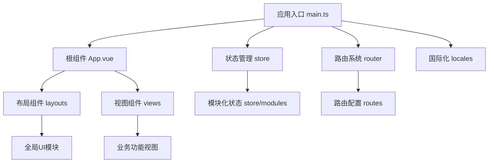
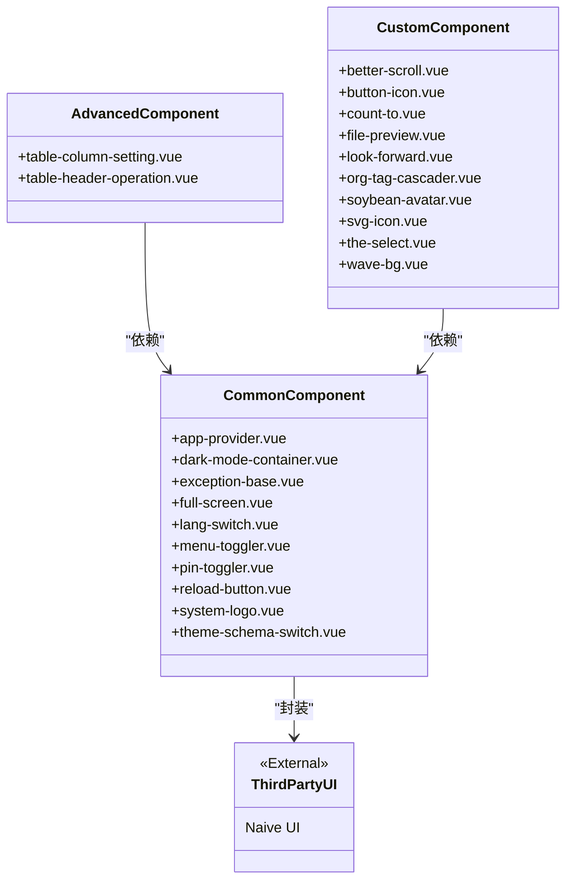
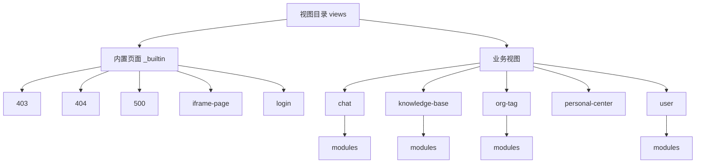
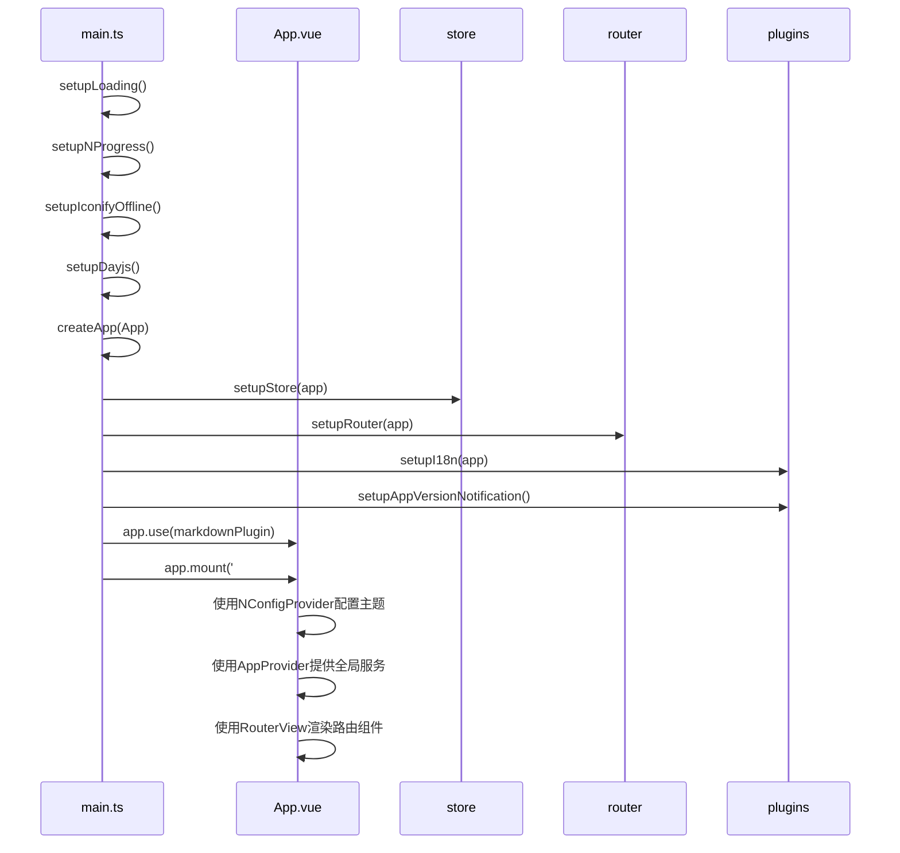
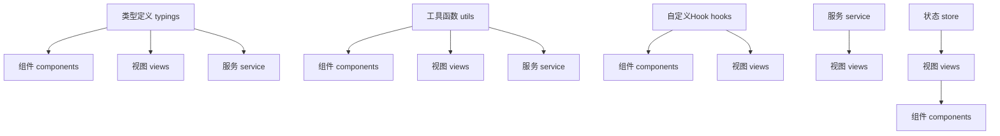

# 项目结构

<cite>
**本文档引用的文件**   
- [main.ts](file://frontend/src/main.ts)
- [App.vue](file://frontend/src/App.vue)
- [index.ts](file://frontend/src/store/index.ts)
- [index.ts](file://frontend/src/router/index.ts)
- [builtin.ts](file://frontend/src/router/routes/builtin.ts)
- [app-provider.vue](file://frontend/src/components/common/app-provider.vue)
- [imports.ts](file://frontend/src/router/elegant/imports.ts)
- [chat/index.vue](file://frontend/src/views/chat/index.vue)
- [knowledge-base/index.vue](file://frontend/src/views/knowledge-base/index.vue)
- [advanced/table-column-setting.vue](file://frontend/src/components/advanced/table-column-setting.vue)
- [custom/svg-icon.vue](file://frontend/src/components/custom/svg-icon.vue)
- [hooks/common/icon.ts](file://frontend/src/hooks/common/icon.ts)
- [utils/common.ts](file://frontend/src/utils/common.ts)
- [typings/common.d.ts](file://frontend/src/typings/common.d.ts)
</cite>

## 目录

1. [项目结构](#项目结构)
2. [核心模块职责划分](#核心模块职责划分)
3. [组件分类逻辑](#组件分类逻辑)
4. [视图组织方式](#视图组织方式)
5. [应用入口集成](#应用入口集成)
6. [模块依赖管理](#模块依赖管理)

## 核心模块职责划分

前端项目采用模块化架构设计，通过清晰的目录结构实现关注点分离。各核心模块职责明确，协同工作构建完整的应用系统。

**图示来源**
- [main.ts](file://frontend/src/main.ts)
- [App.vue](file://frontend/src/App.vue)
- [index.ts](file://frontend/src/store/index.ts)
- [index.ts](file://frontend/src/router/index.ts)

**本节来源**
- [main.ts](file://frontend/src/main.ts#L1-L34)
- [App.vue](file://frontend/src/App.vue#L1-L59)

### 组件模块

**components** 目录存放可复用的UI组件，按功能和使用范围分为三个子目录：

- **advanced**: 高级功能组件，如 `table-column-setting.vue`（表格列设置）和 `table-header-operation.vue`（表格头部操作），提供复杂交互功能
- **common**: 通用基础组件，如 `app-provider.vue`（应用提供者）、`dark-mode-container.vue`（暗色模式容器）等，构成应用基础UI元素
- **custom**: 自定义业务组件，如 `svg-icon.vue`（SVG图标）、`org-tag-cascader.vue`（组织标签级联选择器）等，满足特定业务需求

### 视图模块

**views** 目录存放页面级组件，组织应用的各个功能界面：

- **_builtin**: 内置系统页面，包含 `403`、`404`、`500` 等错误页面，`login` 登录页面和 `iframe-page` 内嵌页面
- **chat**: 聊天功能视图，包含聊天主界面和相关模块
- **knowledge-base**: 知识库管理视图，支持文档上传、内容提取和索引管理
- **org-tag**: 组织标签管理视图，提供标签配置功能
- **user**: 用户管理视图，包含用户搜索和标签设置功能

### 状态管理模块

**store** 目录采用Pinia进行状态管理，实现跨组件数据共享：

- **modules**: 状态模块化设计，包含 `app`（应用状态）、`auth`（认证状态）、`chat`（聊天状态）、`knowledge-base`（知识库状态）、`route`（路由状态）、`tab`（标签页状态）和 `theme`（主题状态）等独立模块
- **plugins**: 状态管理插件，如 `resetSetupStore` 用于重置状态
- **index.ts**: 状态管理入口文件，负责创建Pinia实例并注册插件

### 路由模块

**router** 目录管理应用的导航和页面跳转：

- **elegant**: 优雅路由配置，包含 `imports.ts`（路由导入）、`routes.ts`（路由定义）和 `transform.ts`（路由转换）
- **guard**: 路由守卫，包含 `progress.ts`（进度条）、`route.ts`（路由守卫）和 `title.ts`（标题设置）
- **routes**: 路由配置，包含 `builtin.ts`（内置路由）和 `index.ts`（路由入口）
- **index.ts**: 路由入口文件，负责创建路由器实例并设置路由守卫

### 布局模块

**layouts** 目录提供应用的整体布局结构：

- **base-layout**: 基础布局，包含完整的页面框架
- **blank-layout**: 空白布局，用于不需要框架的页面
- **context**: 布局上下文
- **modules**: 布局模块，包含 `global-header`（全局头部）、`global-menu`（全局菜单）、`global-tab`（全局标签页）、`theme-drawer`（主题抽屉）等可复用的布局组件

### 自定义Hook模块

**hooks** 目录存放自定义Hook，实现逻辑复用：

- **business**: 业务相关Hook，如 `auth.ts`（认证Hook）和 `captcha.ts`（验证码Hook）
- **common**: 通用Hook，如 `echarts.ts`（ECharts集成）、`form.ts`（表单处理）、`icon.ts`（图标处理）、`router.ts`（路由辅助）和 `table.ts`（表格处理）

## 组件分类逻辑

项目采用三级组件分类体系，确保组件的可维护性和复用性。

**图示来源**
- [components/advanced](file://frontend/src/components/advanced)
- [components/common](file://frontend/src/components/common)
- [components/custom](file://frontend/src/components/custom)

**本节来源**
- [components](file://frontend/src/components)

### 高级组件

**advanced** 目录存放复杂功能组件，这些组件通常：

- 提供特定场景下的高级交互功能
- 具有较高的业务耦合度
- 依赖通用组件构建基础UI
- 如 `table-column-setting.vue` 用于配置表格列显示，`table-header-operation.vue` 提供表格头部操作按钮

### 通用组件

**common** 目录存放基础UI组件，这些组件具有以下特点：

- 高度可复用，可在多个场景使用
- 功能单一，职责明确
- 封装第三方UI库（如Naive UI）的组件
- 如 `app-provider.vue` 提供全局上下文，`dark-mode-container.vue` 管理暗色模式切换

### 自定义组件

**custom** 目录存放业务定制组件，这些组件：

- 满足特定业务需求
- 可能封装特定技术（如 `better-scroll.vue` 封装滚动库）
- 提供项目特有的UI元素（如 `soybean-avatar.vue` 大豆头像）
- 如 `svg-icon.vue` 统一管理SVG图标，`org-tag-cascader.vue` 实现组织标签级联选择

## 视图组织方式

项目采用分层视图组织策略，将内置页面与业务视图分离管理。

**图示来源**
- [views](file://frontend/src/views)
- [views/_builtin](file://frontend/src/views/_builtin)
- [views/chat](file://frontend/src/views/chat)
- [views/knowledge-base](file://frontend/src/views/knowledge-base)

**本节来源**
- [views](file://frontend/src/views)
- [builtin.ts](file://frontend/src/router/routes/builtin.ts#L1-L32)
- [imports.ts](file://frontend/src/router/elegant/imports.ts#L1-L28)

### 内置页面

**_builtin** 目录存放系统内置页面，这些页面：

- 通过 `builtin.ts` 配置路由
- 在 `imports.ts` 中动态导入
- 使用特殊命名约定（如 `iframe-page/[url].vue` 支持动态URL参数）
- 包含标准错误页面（403、404、500）和登录页面

### 业务视图

业务视图按功能模块组织，每个模块包含：

- 主视图文件（如 `chat/index.vue`）
- 模块子目录（modules）存放功能组件（如 `chat/modules/chat-list.vue`）
- 清晰的父子组件关系
- 如 `chat` 视图包含聊天列表和输入框，`knowledge-base` 视图包含搜索和上传对话框

## 应用入口集成

应用入口通过 `main.ts` 和 `App.vue` 协同工作，集成所有模块。

**图示来源**
- [main.ts](file://frontend/src/main.ts#L1-L34)
- [App.vue](file://frontend/src/App.vue#L1-L59)

**本节来源**
- [main.ts](file://frontend/src/main.ts#L1-L34)
- [App.vue](file://frontend/src/App.vue#L1-L59)

### 入口文件 main.ts

`main.ts` 是应用的启动入口，负责：

- 初始化加载状态和进度条
- 配置离线图标和日期处理
- 创建Vue应用实例
- 依次设置状态管理、路由、国际化等核心插件
- 挂载应用到DOM

### 根组件 App.vue

`App.vue` 是应用的根组件，负责：

- 使用 `NConfigProvider` 配置Naive UI的主题和语言
- 使用 `AppProvider` 提供全局服务（如消息、对话框）
- 使用 `RouterView` 渲染当前路由对应的视图组件
- 条件渲染水印组件

## 模块依赖管理

项目采用多种机制实现模块间依赖管理，确保代码的可维护性和复用性。

**图示来源**
- [typings](file://frontend/src/typings)
- [utils](file://frontend/src/utils)
- [hooks](file://frontend/src/hooks)
- [service](file://frontend/src/service)
- [store](file://frontend/src/store)

**本节来源**
- [typings/common.d.ts](file://frontend/src/typings/common.d.ts#L1-L24)
- [utils/common.ts](file://frontend/src/utils/common.ts)
- [hooks/common/icon.ts](file://frontend/src/hooks/common/icon.ts#L1-L9)

### 类型定义复用

**typings** 目录集中管理类型定义，包括：

- `api.d.ts`: API接口类型
- `app.d.ts`: 应用全局类型
- `common.d.ts`: 通用类型（如 `Option<K, M>` 选项类型）
- `router.d.ts`: 路由相关类型
- 通过集中管理类型，确保类型一致性，减少重复定义

### 工具函数复用

**utils** 目录提供通用工具函数，包括：

- `common.ts`: 通用工具函数
- `agent.ts`: 客户端环境检测（如 `isPC()` 判断是否为PC端）
- `icon.ts`: 图标处理工具
- `service.ts`: 服务相关工具
- `storage.ts`: 存储工具
- 通过工具函数复用，避免代码重复，提高开发效率

### 自定义Hook复用

自定义Hook实现逻辑复用，如：

- `useSvgIcon()` 在 `hooks/common/icon.ts` 中定义，封装SVG图标渲染逻辑
- 通过 `useSvgIconRender` Hook 和 `SvgIcon` 组件的组合，实现图标的一致性管理
- 业务组件通过导入Hook即可使用封装好的逻辑，无需重复实现