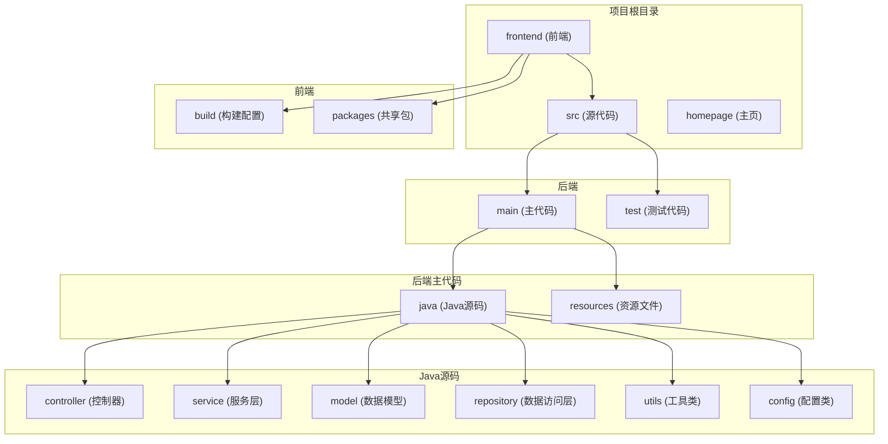
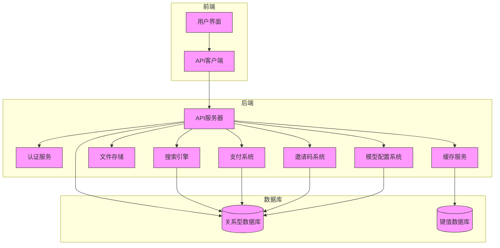
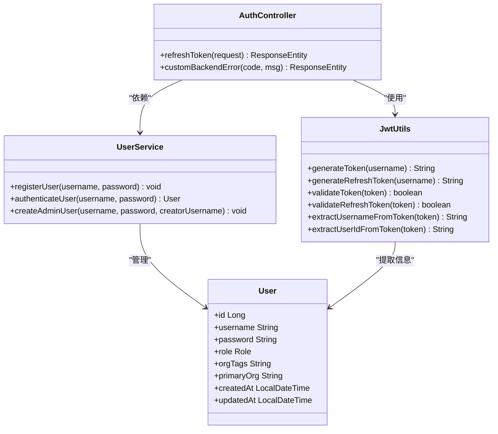
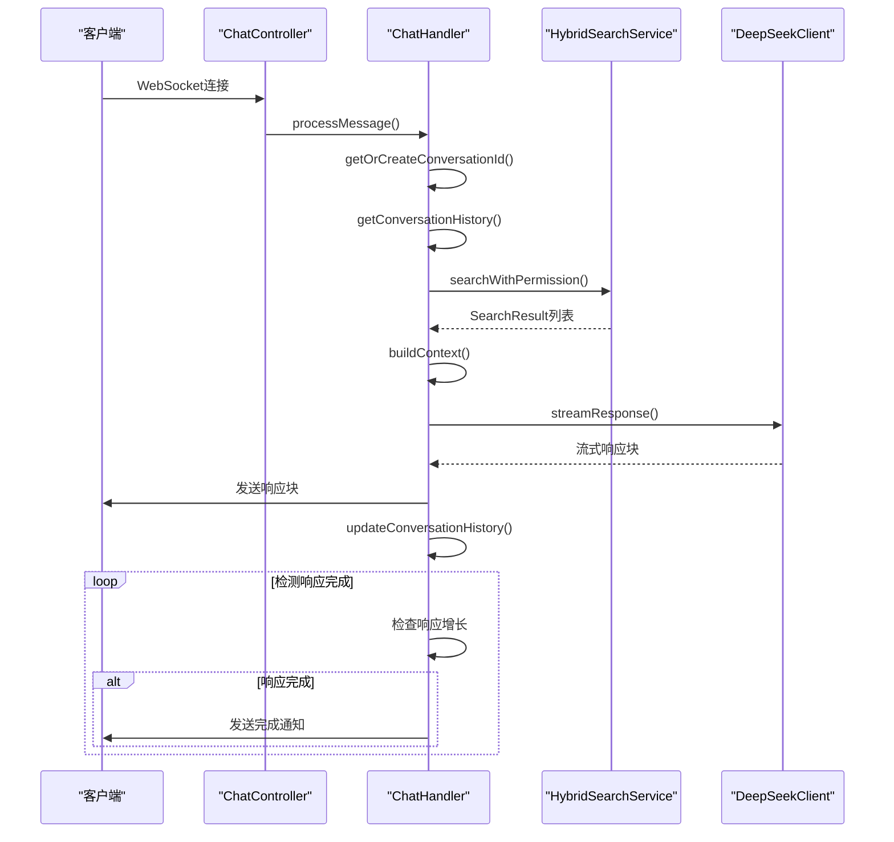
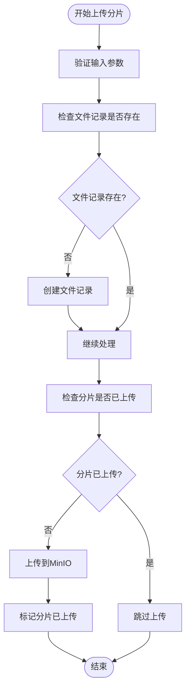
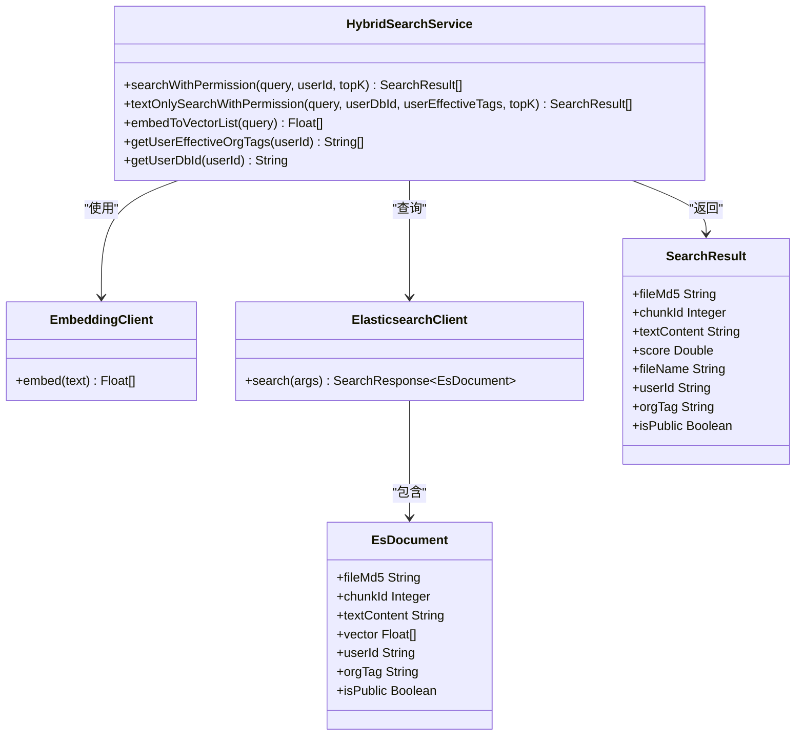
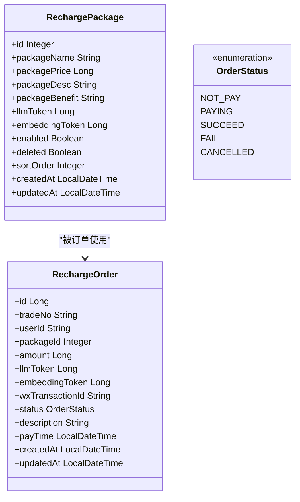
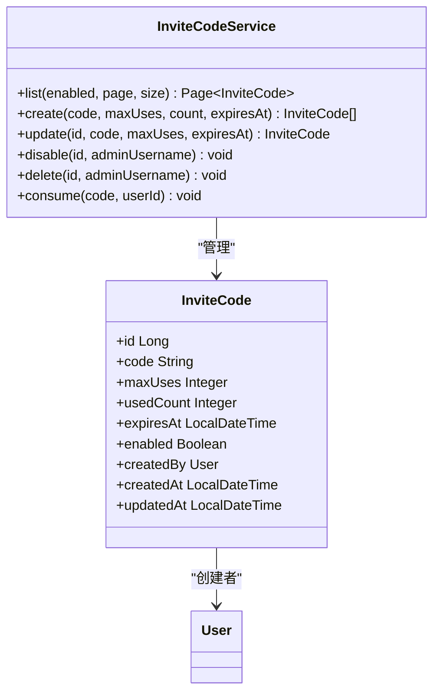
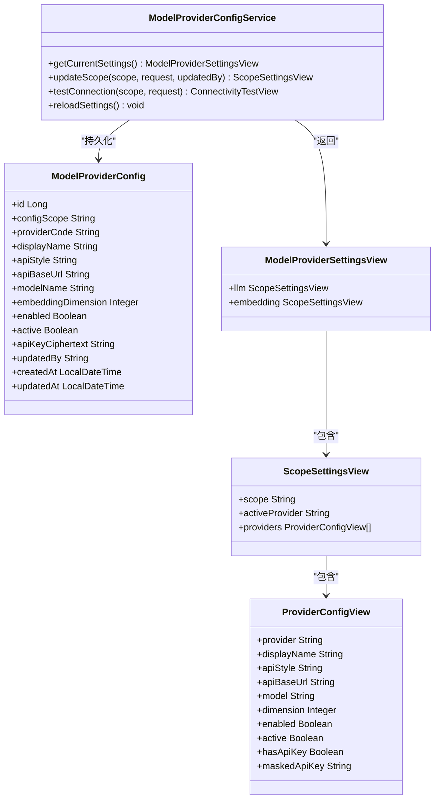

# API接口

<cite>
**本文档中引用的文件**
- [AuthController.java](file://src/main/java/com/yizhaoqi/smartpai/controller/AuthController.java)
- [ChatController.java](file://src/main/java/com/yizhaoqi/smartpai/controller/ChatController.java)
- [UploadController.java](file://src/main/java/com/yizhaoqi/smartpai/controller/UploadController.java)
- [DocumentController.java](file://src/main/java/com/yizhaoqi/smartpai/controller/DocumentController.java)
- [SearchController.java](file://src/main/java/com/yizhaoqi/smartpai/controller/SearchController.java)
- [UserController.java](file://src/main/java/com/yizhaoqi/smartpai/controller/UserController.java)
- [RechargeController.java](file://src/main/java/com/yizhaoqi/smartpai/controller/RechargeController.java)
- [AdminController.java](file://src/main/java/com/yizhaoqi/smartpai/controller/AdminController.java)
- [ChatHandler.java](file://src/main/java/com/yizhaoqi/smartpai/service/ChatHandler.java)
- [UploadService.java](file://src/main/java/com/yizhaoqi/smartpai/service/UploadService.java)
- [DocumentService.java](file://src/main/java/com/yizhaoqi/smartpai/service/DocumentService.java)
- [HybridSearchService.java](file://src/main/java/com/yizhaoqi/smartpai/service/HybridSearchService.java)
- [UserService.java](file://src/main/java/com/yizhaoqi/smartpai/service/UserService.java)
- [ConversationService.java](file://src/main/java/com/yizhaoqi/smartpai/service/ConversationService.java)
- [RechargeService.java](file://src/main/java/com/yizhaoqi/smartpai/service/RechargeService.java)
- [InviteCodeService.java](file://src/main/java/com/yizhaoqi/smartpai/service/InviteCodeService.java)
- [ModelProviderConfigService.java](file://src/main/java/com/yizhaoqi/smartpai/service/ModelProviderConfigService.java)
- [JwtUtils.java](file://src/main/java/com/yizhaoqi/smartpai/utils/JwtUtils.java)
- [User.java](file://src/main/java/com/yizhaoqi/smartpai/model/User.java)
- [FileUpload.java](file://src/main/java/com/yizhaoqi/smartpai/model/FileUpload.java)
- [SearchResult.java](file://src/main/java/com/yizhaoqi/smartpai/entity/SearchResult.java)
- [RechargePackage.java](file://src/main/java/com/yizhaoqi/smartpai/model/RechargePackage.java)
- [RechargeOrder.java](file://src/main/java/com/yizhaoqi/smartpai/model/RechargeOrder.java)
- [InviteCode.java](file://src/main/java/com/yizhaoqi/smartpai/model/InviteCode.java)
- [ModelProviderConfig.java](file://src/main/java/com/yizhaoqi/smartpai/model/ModelProviderConfig.java)
- [InviteCodeRepository.java](file://src/main/java/com/yizhaoqi/smartpai/repository/InviteCodeRepository.java)
- [ModelProviderConfigRepository.java](file://src/main/java/com/yizhaoqi/smartpai/repository/ModelProviderConfigRepository.java)
- [recharge.ts](file://frontend/src/service/api/recharge.ts)
- [invite-code.ts](file://frontend/src/service/api/invite-code.ts)
</cite>

## 更新摘要
**所做更改**
- 新增充值管理API章节，涵盖充值套餐、订单管理、支付回调等功能
- 新增邀请码API章节，包含邀请码的创建、管理、使用等功能
- 新增模型提供商配置API章节，支持多供应商模型配置管理
- 更新架构概览，添加新的业务接口组件
- 完善错误处理和状态码说明
- 添加新的数据模型和实体关系图

## 目录
1. [简介](#简介)
2. [项目结构](#项目结构)
3. [核心组件](#核心组件)
4. [架构概览](#架构概览)
5. [详细组件分析](#详细组件分析)
6. [充值管理API](#充值管理api)
7. [邀请码API](#邀请码api)
8. [模型提供商配置API](#模型提供商配置api)
9. [依赖分析](#依赖分析)
10. [性能考量](#性能考量)
11. [故障排除指南](#故障排除指南)
12. [结论](#结论)

## 简介
本文档为PaiSmart后端RESTful API的完整技术文档，详细记录了系统的认证、聊天、文档上传、搜索、充值管理、邀请码和模型提供商配置等核心功能模块。文档涵盖了各API端点的HTTP方法、URL路径、请求参数、响应结构、状态码含义及错误处理机制。特别说明了基于JWT的认证机制在各接口中的应用，包括认证头格式和令牌刷新流程。通过详细的代码分析和可视化图表，为开发者提供了全面的系统理解。

## 项目结构
PaiSmart项目采用前后端分离的架构设计，后端基于Spring Boot框架构建RESTful API服务，前端使用Vue.js框架。项目主要分为`frontend`和`src`两个目录，分别存放前端和后端代码。

**图示来源**
- [项目结构:1-100](file://#L1-L100)

**本节来源**
- [项目结构:1-100](file://#L1-L100)

## 核心组件
PaiSmart系统的核心功能由多个关键组件构成，包括认证管理、聊天交互、文档处理、搜索服务、充值管理、邀请码管理和模型提供商配置。这些组件通过清晰的分层架构协同工作，确保系统的稳定性和可扩展性。

**本节来源**
- [AuthController.java:1-86](file://src/main/java/com/yizhaoqi/smartpai/controller/AuthController.java#L1-L86)
- [ChatController.java:1-50](file://src/main/java/com/yizhaoqi/smartpai/controller/ChatController.java#L1-L50)
- [UploadController.java:1-50](file://src/main/java/com/yizhaoqi/smartpai/controller/UploadController.java#L1-L50)
- [RechargeController.java:1-198](file://src/main/java/com/yizhaoqi/smartpai/controller/RechargeController.java#L1-L198)
- [AdminController.java:396-448](file://src/main/java/com/yizhaoqi/smartpai/controller/AdminController.java#L396-L448)

## 架构概览
PaiSmart系统采用典型的分层架构，从前端到后端各层职责分明。系统通过RESTful API与前端交互，使用JWT进行身份认证，利用MinIO存储文件，Elasticsearch提供搜索能力，Redis用于缓存和会话管理，同时集成了微信支付、邀请码管理和模型提供商配置等业务功能。

**图示来源**
- [SmartPaiApplication.java:1-20](file://src/main/java/com/yizhaoqi/smartpai/SmartPaiApplication.java#L1-L20)
- [WebConfig.java:1-30](file://src/main/java/com/yizhaoqi/smartpai/config/WebConfig.java#L1-L30)

## 详细组件分析
### 认证组件分析
认证组件负责系统的用户身份验证和授权管理，采用JWT（JSON Web Token）作为主要的认证机制。系统提供登录、注册和令牌刷新等接口，确保用户安全访问受保护的资源。

#### 认证类图

**图示来源**
- [AuthController.java:1-86](file://src/main/java/com/yizhaoqi/smartpai/controller/AuthController.java#L1-L86)
- [JwtUtils.java:1-50](file://src/main/java/com/yizhaoqi/smartpai/utils/JwtUtils.java#L1-L50)
- [UserService.java:1-200](file://src/main/java/com/yizhaoqi/smartpai/service/UserService.java#L1-L200)
- [User.java:1-44](file://src/main/java/com/yizhaoqi/smartpai/model/User.java#L1-L44)

**本节来源**
- [AuthController.java:1-86](file://src/main/java/com/yizhaoqi/smartpai/controller/AuthController.java#L1-L86)
- [JwtUtils.java:1-100](file://src/main/java/com/yizhaoqi/smartpai/utils/JwtUtils.java#L1-L100)
- [UserService.java:1-200](file://src/main/java/com/yizhaoqi/smartpai/service/UserService.java#L1-L200)

### 聊天组件分析
聊天组件是PaiSmart的核心功能之一，支持WebSocket实时通信，提供流式响应的聊天体验。系统通过混合搜索服务获取相关知识，调用DeepSeek API生成回复，并管理对话历史。

#### 聊天序列图

**图示来源**
- [ChatController.java:1-50](file://src/main/java/com/yizhaoqi/smartpai/controller/ChatController.java#L1-L50)
- [ChatHandler.java:1-200](file://src/main/java/com/yizhaoqi/smartpai/service/ChatHandler.java#L1-L200)
- [HybridSearchService.java:1-200](file://src/main/java/com/yizhaoqi/smartpai/service/HybridSearchService.java#L1-L200)

**本节来源**
- [ChatController.java:1-50](file://src/main/java/com/yizhaoqi/smartpai/controller/ChatController.java#L1-L50)
- [ChatHandler.java:1-200](file://src/main/java/com/yizhaoqi/smartpai/service/ChatHandler.java#L1-L200)

### 文档上传组件分析
文档上传组件实现了大文件的分片上传和合并功能，支持断点续传。系统使用Redis缓存分片状态，MinIO存储文件，确保上传过程的可靠性和高效性。

#### 文件上传流程图

**图示来源**
- [UploadController.java:1-50](file://src/main/java/com/yizhaoqi/smartpai/controller/UploadController.java#L1-L50)
- [UploadService.java:1-200](file://src/main/java/com/yizhaoqi/smartpai/service/UploadService.java#L1-L200)

**本节来源**
- [UploadController.java:1-50](file://src/main/java/com/yizhaoqi/smartpai/controller/UploadController.java#L1-L50)
- [UploadService.java:1-200](file://src/main/java/com/yizhaoqi/smartpai/service/UploadService.java#L1-L200)

### 搜索组件分析
搜索组件采用混合搜索策略，结合文本匹配和向量相似度搜索，提供精准的搜索结果。系统通过Elasticsearch存储文档向量，支持权限过滤，确保用户只能访问其有权限的文档。

#### 混合搜索类图

**图示来源**
- [HybridSearchService.java:1-200](file://src/main/java/com/yizhaoqi/smartpai/service/HybridSearchService.java#L1-L200)
- [SearchResult.java:1-39](file://src/main/java/com/yizhaoqi/smartpai/entity/SearchResult.java#L1-L39)
- [EsDocument.java:1-50](file://src/main/java/com/yizhaoqi/smartpai/entity/EsDocument.java#L1-L50)

**本节来源**
- [HybridSearchService.java:1-200](file://src/main/java/com/yizhaoqi/smartpai/service/HybridSearchService.java#L1-L200)
- [SearchResult.java:1-39](file://src/main/java/com/yizhaoqi/smartpai/entity/SearchResult.java#L1-L39)

## 充值管理API

### 概述
充值管理API为平台的付费功能提供完整的解决方案，包括充值套餐管理、订单创建、支付处理和订单查询等功能。系统支持微信支付集成，提供安全可靠的在线充值体验。

### API端点概览
- **GET /api/v1/recharge/packages** - 获取充值套餐列表
- **POST /api/v1/recharge/create-order** - 创建充值订单
- **POST /api/v1/recharge/pay-callback** - 微信支付回调
- **GET /api/v1/recharge/orders** - 查询用户订单列表
- **GET /api/v1/recharge/orders/{tradeNo}** - 查询订单详情

### 充值套餐管理（管理员）
- **GET /api/v1/admin/recharge-packages** - 获取所有充值套餐列表
- **POST /api/v1/admin/recharge-packages** - 创建充值套餐
- **PUT /api/v1/admin/recharge-packages/{id}** - 更新充值套餐
- **DELETE /api/v1/admin/recharge-packages/{id}** - 删除充值套餐（逻辑删除）

### 数据模型

**图示来源**
- [RechargePackage.java:1-63](file://src/main/java/com/yizhaoqi/smartpai/model/RechargePackage.java#L1-L63)
- [RechargeOrder.java:1-79](file://src/main/java/com/yizhaoqi/smartpai/model/RechargeOrder.java#L1-L79)

### 错误处理
- **400 Bad Request**: 无效的充值金额或套餐ID
- **401 Unauthorized**: 无效的用户令牌
- **403 Forbidden**: 无权访问订单详情
- **500 Internal Server Error**: 服务器内部错误

**本节来源**
- [RechargeController.java:1-198](file://src/main/java/com/yizhaoqi/smartpai/controller/RechargeController.java#L1-L198)
- [RechargeService.java:1-212](file://src/main/java/com/yizhaoqi/smartpai/service/RechargeService.java#L1-L212)
- [RechargePackage.java:1-63](file://src/main/java/com/yizhaoqi/smartpai/model/RechargePackage.java#L1-L63)
- [RechargeOrder.java:1-79](file://src/main/java/com/yizhaoqi/smartpai/model/RechargeOrder.java#L1-L79)

## 邀请码API

### 概述
邀请码API提供完整的邀请码管理系统，支持邀请码的创建、管理、使用和统计功能。系统支持批量生成、有效期控制、使用次数限制等高级功能。

### API端点概览
- **GET /api/v1/admin/invite-codes** - 分页查询邀请码
- **POST /api/v1/admin/invite-codes** - 创建邀请码
- **PUT /api/v1/admin/invite-codes/{id}** - 更新邀请码
- **PATCH /api/v1/admin/invite-codes/{id}/disable** - 禁用邀请码
- **DELETE /api/v1/admin/invite-codes/{id}** - 删除邀请码

### 邀请码管理（管理员）
- **GET /api/v1/admin/invite-codes** - 分页查询邀请码
  - 参数: enabled(Boolean), page(int), size(int)
  - 响应: 邀请码列表和分页信息

- **POST /api/v1/admin/invite-codes** - 创建邀请码
  - 请求体: code(string), maxUses(int), count(int), expiresAt(date)
  - 支持批量创建和自定义邀请码

- **PUT /api/v1/admin/invite-codes/{id}** - 更新邀请码
  - 请求体: code(string), maxUses(int), expiresAt(date)

- **PATCH /api/v1/admin/invite-codes/{id}/disable** - 禁用邀请码
  - 响应: 成功禁用邀请码

- **DELETE /api/v1/admin/invite-codes/{id}** - 删除邀请码
  - 响应: 成功删除邀请码

### 数据模型

**图示来源**
- [InviteCode.java:1-47](file://src/main/java/com/yizhaoqi/smartpai/model/InviteCode.java#L1-L47)
- [InviteCodeService.java:1-213](file://src/main/java/com/yizhaoqi/smartpai/service/InviteCodeService.java#L1-L213)
- [InviteCodeRepository.java:1-24](file://src/main/java/com/yizhaoqi/smartpai/repository/InviteCodeRepository.java#L1-L24)

### 错误处理
- **400 Bad Request**: 邀请码已存在或为空
- **403 Forbidden**: 非管理员用户尝试管理邀请码
- **404 Not Found**: 邀请码不存在
- **409 Conflict**: 邀请码已过期或达到最大使用次数

**本节来源**
- [AdminController.java:396-448](file://src/main/java/com/yizhaoqi/smartpai/controller/AdminController.java#L396-L448)
- [InviteCodeService.java:1-213](file://src/main/java/com/yizhaoqi/smartpai/service/InviteCodeService.java#L1-L213)
- [InviteCode.java:1-47](file://src/main/java/com/yizhaoqi/smartpai/model/InviteCode.java#L1-L47)
- [InviteCodeRepository.java:1-24](file://src/main/java/com/yizhaoqi/smartpai/repository/InviteCodeRepository.java#L1-L24)

## 模型提供商配置API

### 概述
模型提供商配置API支持多供应商模型配置管理，包括LLM（大语言模型）和Embedding（向量模型）的配置。系统支持动态切换、连接测试和配置覆盖等功能。

### API端点概览
- **GET /api/v1/admin/model-providers** - 获取当前模型配置
- **PUT /api/v1/admin/model-providers/{scope}** - 更新指定作用域的模型配置
- **POST /api/v1/admin/model-providers/{scope}/test** - 测试模型提供商连接

### 作用域和供应商
- **作用域**: `llm`（大语言模型）, `embedding`（向量模型）
- **默认供应商**: 
  - LLM: deepseek, qwen, zhipu
  - Embedding: aliyun, zhipu

### 配置管理
- **GET /api/v1/admin/model-providers** - 获取当前模型配置
  - 响应: 包含所有供应商的配置视图

- **PUT /api/v1/admin/model-providers/{scope}** - 更新模型配置
  - 请求体: activeProvider(string), providers(array)
  - 支持启用/禁用供应商、修改API密钥、调整维度等

- **POST /api/v1/admin/model-providers/{scope}/test** - 测试连接
  - 请求体: apiBaseUrl(string), model(string), apiKey(string), dimension(number)
  - 响应: 连接测试结果和延迟

### 数据模型

**图示来源**
- [ModelProviderConfig.java:1-47](file://src/main/java/com/yizhaoqi/smartpai/model/ModelProviderConfig.java#L1-L47)
- [ModelProviderConfigService.java:1-482](file://src/main/java/com/yizhaoqi/smartpai/service/ModelProviderConfigService.java#L1-L482)
- [ModelProviderConfigRepository.java:1-16](file://src/main/java/com/yizhaoqi/smartpai/repository/ModelProviderConfigRepository.java#L1-L16)

### 错误处理
- **400 Bad Request**: 配置参数无效或供应商不支持
- **404 Not Found**: 未找到激活的模型配置
- **409 Conflict**: Embedding模型切换需要重嵌入任务
- **500 Internal Server Error**: 连接测试失败

**本节来源**
- [AdminController.java:287-330](file://src/main/java/com/yizhaoqi/smartpai/controller/AdminController.java#L287-L330)
- [ModelProviderConfigService.java:1-482](file://src/main/java/com/yizhaoqi/smartpai/service/ModelProviderConfigService.java#L1-L482)
- [ModelProviderConfig.java:1-47](file://src/main/java/com/yizhaoqi/smartpai/model/ModelProviderConfig.java#L1-L47)
- [ModelProviderConfigRepository.java:1-16](file://src/main/java/com/yizhaoqi/smartpai/repository/ModelProviderConfigRepository.java#L1-L16)

## 依赖分析
PaiSmart系统的各组件之间存在明确的依赖关系，形成了清晰的服务调用链。通过依赖分析，可以更好地理解系统的架构设计和数据流动。

```mermaid
graph TD
AuthController --> UserService
UserController --> UserService
ChatController --> ChatHandler
UploadController --> UploadService
DocumentController --> DocumentService
SearchController --> HybridSearchService
ChatHandler --> HybridSearchService
ChatHandler --> DeepSeekClient
UploadService --> MinioClient
UploadService --> FileUploadRepository
DocumentService --> FileUploadRepository
DocumentService --> DocumentVectorRepository
DocumentService --> MinioClient
DocumentService --> ElasticsearchService
HybridSearchService --> ElasticsearchClient
HybridSearchService --> EmbeddingClient
HybridSearchService --> UserService
HybridSearchService --> OrgTagCacheService
UserService --> UserRepository
UserService --> OrganizationTagRepository
ConversationService --> UserRepository
ConversationService --> ConversationRepository
RechargeController --> RechargeService
RechargeService --> WxPayService
RechargeService --> RechargePackageRepository
RechargeService --> RechargeOrderRepository
RechargeService --> UserTokenService
InviteCodeService --> InviteCodeRepository
InviteCodeService --> UserRepository
ModelProviderConfigService --> ModelProviderConfigRepository
classDef controller fill:#ffcccc,stroke:#333;
classDef service fill:#ccffcc,stroke:#333;
classDef repository fill:#ccccff,stroke:#333;
classDef client fill:#ffffcc,stroke:#333;
class AuthController,UserController,ChatController,UploadController,DocumentController,SearchController,RechargeController,AdminController controller;
class UserService,ChatHandler,UploadService,DocumentService,HybridSearchService,ConversationService,RechargeService,InviteCodeService,ModelProviderConfigService service;
class UserRepository,OrganizationTagRepository,FileUploadRepository,DocumentVectorRepository,ConversationRepository,RechargePackageRepository,RechargeOrderRepository,InviteCodeRepository,ModelProviderConfigRepository repository;
class MinioClient,ElasticsearchClient,EmbeddingClient,DeepSeekClient,WxPayService client;
```

**图示来源**
- [项目依赖关系:1-100](file://#L1-L100)

**本节来源**
- [项目依赖关系:1-100](file://#L1-L100)

## 性能考量
PaiSmart系统在设计时充分考虑了性能因素，采用了多种优化策略来提升系统响应速度和处理能力。

1. **缓存机制**：使用Redis缓存用户组织标签、分片上传状态、模型配置等频繁访问的数据，减少数据库查询压力。
2. **异步处理**：文件处理任务通过Kafka消息队列异步执行，避免阻塞主线程；支付回调采用异步处理机制。
3. **流式响应**：聊天接口采用WebSocket流式传输，用户可以即时看到AI生成的回复，提升交互体验。
4. **分片上传**：大文件采用分片上传机制，支持断点续传，提高上传成功率和效率。
5. **混合搜索**：结合向量搜索和文本匹配，通过KNN召回和BM25重排序，平衡搜索精度和性能。
6. **支付集成**：微信支付采用异步回调机制，避免长时间阻塞请求处理。
7. **配置缓存**：模型提供商配置采用内存缓存，减少数据库访问频率。

**本节来源**
- [RedisConfig.java:1-50](file://src/main/java/com/yizhaoqi/smartpai/config/RedisConfig.java#L1-L50)
- [KafkaConfig.java:1-50](file://src/main/java/com/yizhaoqi/smartpai/config/KafkaConfig.java#L1-L50)
- [ChatHandler.java:1-200](file://src/main/java/com/yizhaoqi/smartpai/service/ChatHandler.java#L1-L200)
- [UploadService.java:1-200](file://src/main/java/com/yizhaoqi/smartpai/service/UploadService.java#L1-L200)
- [HybridSearchService.java:1-200](file://src/main/java/com/yizhaoqi/smartpai/service/HybridSearchService.java#L1-L200)
- [RechargeService.java:1-212](file://src/main/java/com/yizhaoqi/smartpai/service/RechargeService.java#L1-L212)
- [ModelProviderConfigService.java:1-482](file://src/main/java/com/yizhaoqi/smartpai/service/ModelProviderConfigService.java#L1-L482)

## 故障排除指南
### 认证问题
**问题**：JWT令牌验证失败
**解决方案**：
1. 检查令牌是否过期，过期后需调用`/api/v1/auth/refreshToken`接口刷新
2. 验证令牌格式是否正确，必须以`Bearer `开头
3. 检查`Authorization`头是否正确设置

**问题**：无法刷新令牌
**解决方案**：
1. 确认`refreshToken`参数不为空
2. 检查`refreshToken`是否有效，可能已被使用或过期
3. 查看服务器日志中的详细错误信息

### 文件上传问题
**问题**：分片上传失败
**解决方案**：
1. 检查MinIO服务是否正常运行
2. 验证文件MD5计算是否正确
3. 查看Redis中分片状态是否一致

**问题**：文件合并失败
**解决方案**：
1. 确认所有分片都已成功上传
2. 检查MinIO中分片文件是否存在
3. 验证文件权限设置

### 搜索问题
**问题**：搜索结果为空
**解决方案**：
1. 检查Elasticsearch索引是否正常
2. 验证文档是否已成功向量化并存入索引
3. 确认用户权限是否允许访问相关文档

**问题**：搜索响应慢
**解决方案**：
1. 检查Elasticsearch集群性能
2. 优化查询语句，避免全表扫描
3. 增加缓存命中率

### 充值管理问题
**问题**：充值订单创建失败
**解决方案**：
1. 检查套餐ID是否有效且启用
2. 验证充值金额是否大于0
3. 确认用户令牌有效性

**问题**：支付回调处理异常
**解决方案**：
1. 检查微信支付回调签名是否正确
2. 验证订单状态更新逻辑
3. 查看支付服务日志

### 邀请码问题
**问题**：邀请码使用失败
**解决方案**：
1. 检查邀请码是否已启用
2. 验证使用次数限制
3. 确认邀请码是否过期

**问题**：邀请码创建失败
**解决方案**：
1. 检查邀请码格式是否符合要求
2. 验证批量创建数量限制
3. 确认数据库唯一约束

### 模型配置问题
**问题**：模型连接测试失败
**解决方案**：
1. 检查API地址和端口是否可达
2. 验证API密钥是否正确
3. 确认网络防火墙设置

**问题**：配置更新后不生效
**解决方案**：
1. 调用`reloadSettings()`重新加载配置
2. 检查配置缓存是否更新
3. 验证数据库持久化是否成功

**本节来源**
- [JwtUtils.java:1-100](file://src/main/java/com/yizhaoqi/smartpai/utils/JwtUtils.java#L1-L100)
- [UploadService.java:1-200](file://src/main/java/com/yizhaoqi/smartpai/service/UploadService.java#L1-L200)
- [HybridSearchService.java:1-200](file://src/main/java/com/yizhaoqi/smartpai/service/HybridSearchService.java#L1-L200)
- [LogUtils.java:1-50](file://src/main/java/com/yizhaoqi/smartpai/utils/LogUtils.java#L1-L50)
- [RechargeService.java:1-212](file://src/main/java/com/yizhaoqi/smartpai/service/RechargeService.java#L1-L212)
- [InviteCodeService.java:1-213](file://src/main/java/com/yizhaoqi/smartpai/service/InviteCodeService.java#L1-L213)
- [ModelProviderConfigService.java:1-482](file://src/main/java/com/yizhaoqi/smartpai/service/ModelProviderConfigService.java#L1-L482)

## 结论
PaiSmart后端系统采用现代化的技术栈和清晰的架构设计，实现了认证、聊天、文档管理、搜索、充值管理、邀请码和模型提供商配置等核心功能。系统通过JWT进行安全认证，利用WebSocket提供实时聊天体验，采用分片上传机制处理大文件，结合向量搜索和文本匹配实现智能搜索，集成了微信支付、邀请码管理和模型配置等完整的业务功能。各组件职责分明，依赖关系清晰，具有良好的可维护性和扩展性。通过合理的性能优化和错误处理机制，系统能够稳定高效地运行，为用户提供优质的服务体验。