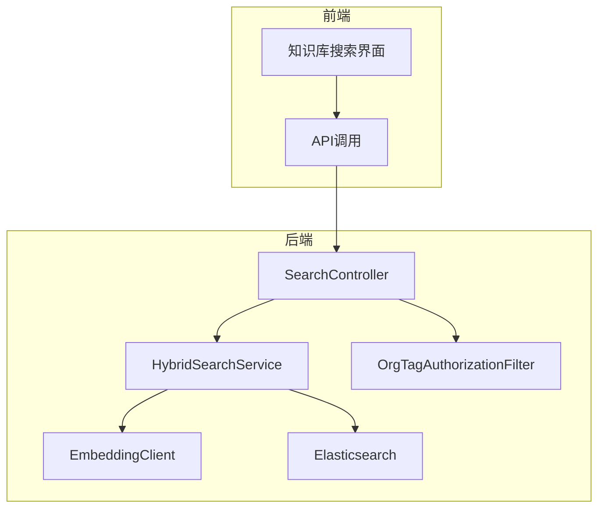
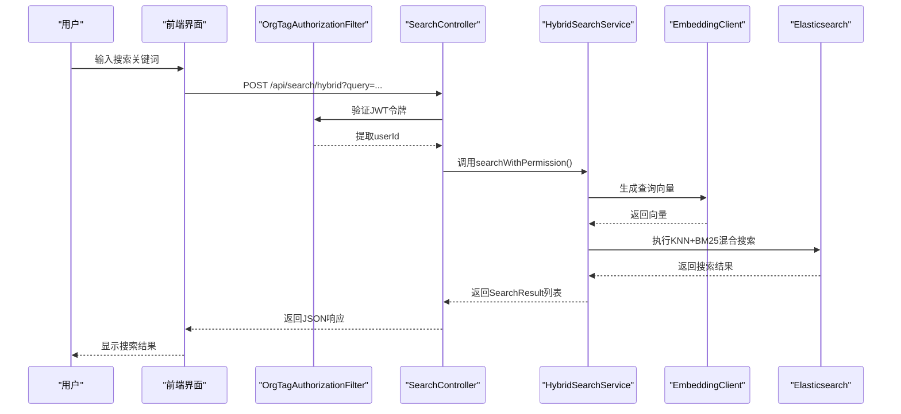
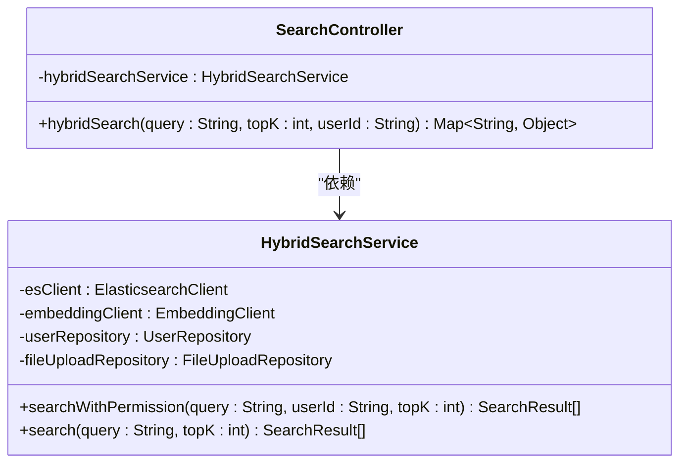
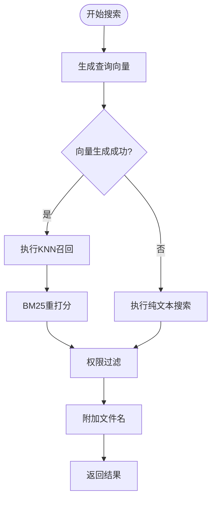
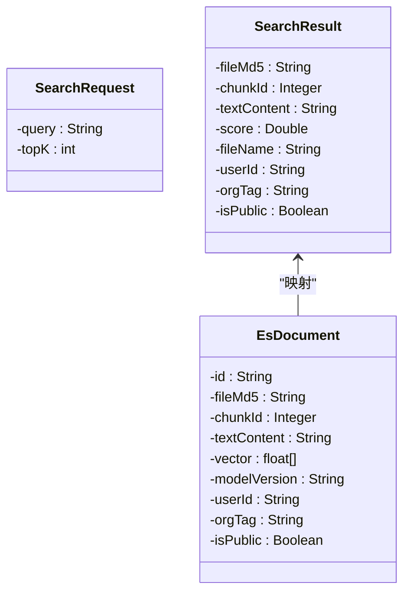
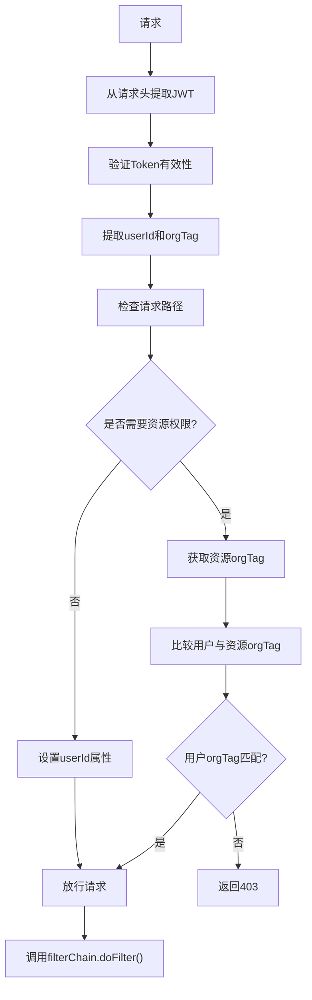
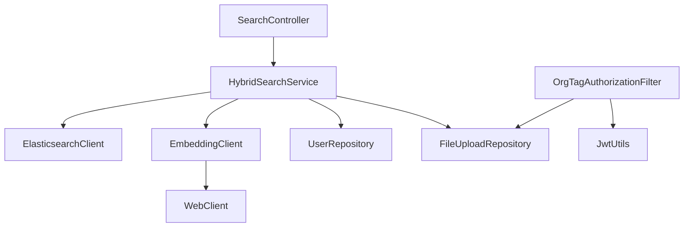

# 搜索接口

<cite>
**本文档引用的文件**   
- [SearchController.java](file://src/main/java/com/yizhaoqi/smartpai/controller/SearchController.java#L1-L90)
- [HybridSearchService.java](file://src/main/java/com/yizhaoqi/smartpai/service/HybridSearchService.java#L1-L472)
- [SearchRequest.java](file://src/main/java/com/yizhaoqi/smartpai/entity/SearchRequest.java#L1-L10)
- [SearchResult.java](file://src/main/java/com/yizhaoqi/smartpai/entity/SearchResult.java#L1-L39)
- [EsDocument.java](file://src/main/java/com/yizhaoqi/smartpai/entity/EsDocument.java#L1-L48)
- [knowledge_base.json](file://src/main/resources/es-mappings/knowledge_base.json#L1-L35)
- [EmbeddingClient.java](file://src/main/java/com/yizhaoqi/smartpai/client/EmbeddingClient.java#L1-L104)
- [ElasticsearchService.java](file://src/main/java/com/yizhaoqi/smartpai/service/ElasticsearchService.java#L1-L87)
- [OrgTagAuthorizationFilter.java](file://src/main/java/com/yizhaoqi/smartpai/config/OrgTagAuthorizationFilter.java#L1-L338)
</cite>

## 目录
1. [简介](#简介)
2. [项目结构](#项目结构)
3. [核心组件](#核心组件)
4. [架构概览](#架构概览)
5. [详细组件分析](#详细组件分析)
6. [依赖分析](#依赖分析)
7. [性能考量](#性能考量)
8. [故障排除指南](#故障排除指南)
9. [结论](#结论)

## 简介
本文档详细说明了PaiSmart知识库的搜索接口，重点介绍混合搜索功能的实现机制。该系统结合了关键词匹配与向量相似度搜索，支持基于用户身份和组织标签的权限控制。文档涵盖了搜索请求端点的参数结构、响应格式、实现逻辑以及典型使用场景，旨在为开发者和用户提供全面的技术参考。

## 项目结构
PaiSmart项目的搜索功能主要分布在后端`src/main/java`目录下的`controller`、`service`、`entity`和`config`包中。前端部分通过`frontend/src/views/knowledge-base`中的组件调用后端API。核心搜索逻辑由`SearchController`和`HybridSearchService`协同完成，数据存储于Elasticsearch中，权限控制通过`OrgTagAuthorizationFilter`实现。

**图示来源**
- [SearchController.java](file://src/main/java/com/yizhaoqi/smartpai/controller/SearchController.java#L1-L90)
- [HybridSearchService.java](file://src/main/java/com/yizhaoqi/smartpai/service/HybridSearchService.java#L1-L472)

**本节来源**
- [SearchController.java](file://src/main/java/com/yizhaoqi/smartpai/controller/SearchController.java#L1-L90)

## 核心组件
搜索功能的核心组件包括`SearchController`（处理HTTP请求）、`HybridSearchService`（实现混合搜索逻辑）、`EmbeddingClient`（生成文本向量）和`OrgTagAuthorizationFilter`（权限控制）。这些组件协同工作，实现了高效、安全的知识库搜索。

**本节来源**
- [SearchController.java](file://src/main/java/com/yizhaoqi/smartpai/controller/SearchController.java#L1-L90)
- [HybridSearchService.java](file://src/main/java/com/yizhaoqi/smartpai/service/HybridSearchService.java#L1-L472)

## 架构概览
PaiSmart搜索功能采用分层架构，从前端界面到后端服务再到数据存储，形成了清晰的调用链路。用户发起搜索请求后，首先经过权限过滤器验证身份，然后由控制器调用混合搜索服务，服务层结合文本匹配和向量搜索，最终从Elasticsearch获取结果并返回给前端。

**图示来源**
- [SearchController.java](file://src/main/java/com/yizhaoqi/smartpai/controller/SearchController.java#L1-L90)
- [HybridSearchService.java](file://src/main/java/com/yizhaoqi/smartpai/service/HybridSearchService.java#L1-L472)
- [OrgTagAuthorizationFilter.java](file://src/main/java/com/yizhaoqi/smartpai/config/OrgTagAuthorizationFilter.java#L1-L338)

## 详细组件分析

### 搜索控制器分析
`SearchController`是搜索功能的入口，负责处理来自前端的HTTP请求。它定义了`/api/search/hybrid`端点，接收搜索查询参数，并调用`HybridSearchService`执行实际的搜索操作。

**图示来源**
- [SearchController.java](file://src/main/java/com/yizhaoqi/smartpai/controller/SearchController.java#L1-L90)
- [HybridSearchService.java](file://src/main/java/com/yizhaoqi/smartpai/service/HybridSearchService.java#L1-L472)

**本节来源**
- [SearchController.java](file://src/main/java/com/yizhaoqi/smartpai/controller/SearchController.java#L1-L90)

### 混合搜索服务分析
`HybridSearchService`是搜索功能的核心，实现了混合搜索算法。它结合了关键词搜索（BM25）和向量相似度搜索（KNN），通过Elasticsearch的rescore机制进行结果融合。

#### 混合搜索流程

**图示来源**
- [HybridSearchService.java](file://src/main/java/com/yizhaoqi/smartpai/service/HybridSearchService.java#L1-L472)

**本节来源**
- [HybridSearchService.java](file://src/main/java/com/yizhaoqi/smartpai/service/HybridSearchService.java#L1-L472)

### 数据结构分析
搜索功能涉及多个关键数据结构，包括请求参数、搜索结果和Elasticsearch文档。

#### 请求与响应结构

**图示来源**
- [SearchRequest.java](file://src/main/java/com/yizhaoqi/smartpai/entity/SearchRequest.java#L1-L10)
- [SearchResult.java](file://src/main/java/com/yizhaoqi/smartpai/entity/SearchResult.java#L1-L39)
- [EsDocument.java](file://src/main/java/com/yizhaoqi/smartpai/entity/EsDocument.java#L1-L48)

**本节来源**
- [SearchRequest.java](file://src/main/java/com/yizhaoqi/smartpai/entity/SearchRequest.java#L1-L10)
- [SearchResult.java](file://src/main/java/com/yizhaoqi/smartpai/entity/SearchResult.java#L1-L39)

### 权限控制分析
`OrgTagAuthorizationFilter`实现了基于JWT令牌的权限控制，确保用户只能访问其有权限的资源。

**图示来源**
- [OrgTagAuthorizationFilter.java](file://src/main/java/com/yizhaoqi/smartpai/config/OrgTagAuthorizationFilter.java#L1-L338)

**本节来源**
- [OrgTagAuthorizationFilter.java](file://src/main/java/com/yizhaoqi/smartpai/config/OrgTagAuthorizationFilter.java#L1-L338)

## 依赖分析
搜索功能依赖于多个外部服务和库，包括Elasticsearch、向量生成API和MinIO对象存储。这些依赖通过Spring的依赖注入机制进行管理。

**图示来源**
- [SearchController.java](file://src/main/java/com/yizhaoqi/smartpai/controller/SearchController.java#L1-L90)
- [HybridSearchService.java](file://src/main/java/com/yizhaoqi/smartpai/service/HybridSearchService.java#L1-L472)
- [EmbeddingClient.java](file://src/main/java/com/yizhaoqi/smartpai/client/EmbeddingClient.java#L1-L104)

**本节来源**
- [pom.xml](file://pom.xml#L1-L100)

## 性能考量
混合搜索的性能受多个因素影响，包括向量维度、Elasticsearch索引配置和网络延迟。系统通过批量处理、缓存和异步操作来优化性能。

- **向量维度**: 当前设置为2048维，影响向量搜索速度
- **KNN召回窗口**: 设置为`topK * 30`，平衡召回率和性能
- **批量处理**: 向量生成支持批量处理，减少API调用次数
- **缓存**: 用户组织标签信息被缓存，减少数据库查询

**本节来源**
- [HybridSearchService.java](file://src/main/java/com/yizhaoqi/smartpai/service/HybridSearchService.java#L1-L472)
- [EmbeddingClient.java](file://src/main/java/com/yizhaoqi/smartpai/client/EmbeddingClient.java#L1-L104)

## 故障排除指南
### 常见问题
1. **搜索无结果**: 检查文档是否已成功索引，确认`fileUploadRepository`中存在记录
2. **权限拒绝**: 验证JWT令牌中的`orgTag`是否与资源匹配
3. **向量生成失败**: 检查向量API服务是否正常运行
4. **Elasticsearch连接失败**: 确认ES配置正确，服务可访问

### 日志分析
- `HYBRID_SEARCH`性能监控日志可帮助定位性能瓶颈
- `logBusinessError`记录搜索失败的详细信息
- `attachFileNames`失败可能影响文件名显示

**本节来源**
- [SearchController.java](file://src/main/java/com/yizhaoqi/smartpai/controller/SearchController.java#L1-L90)
- [HybridSearchService.java](file://src/main/java/com/yizhaoqi/smartpai/service/HybridSearchService.java#L1-L472)

## 结论
PaiSmart的搜索功能通过混合搜索算法实现了高精度的知识库检索。系统结合了关键词匹配和向量相似度，支持灵活的权限控制和高效的性能表现。未来可考虑引入搜索建议、模糊匹配和更复杂的排序策略来进一步提升用户体验。