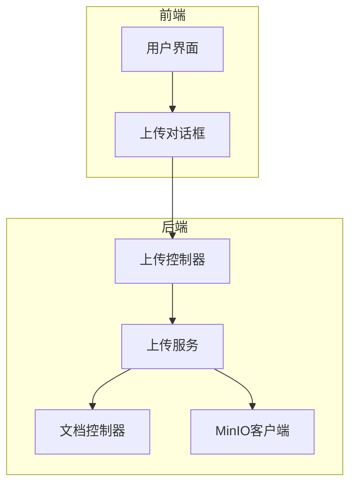
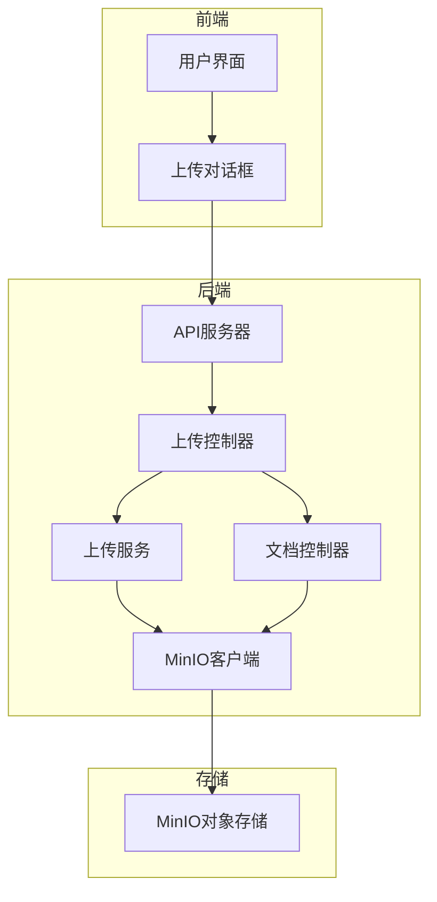
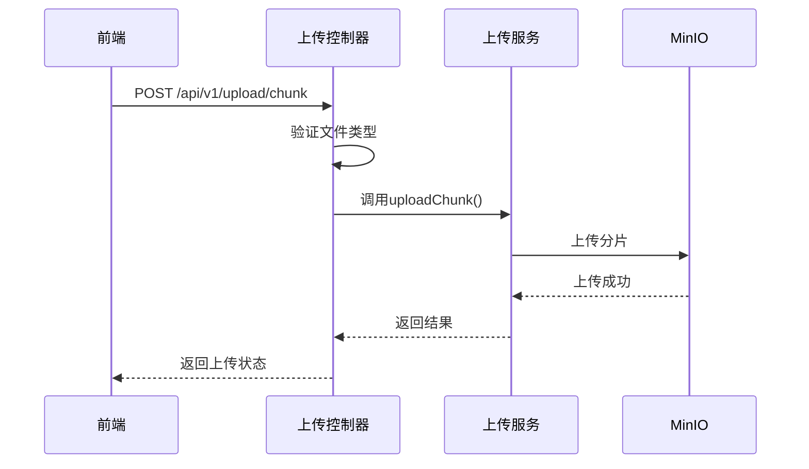
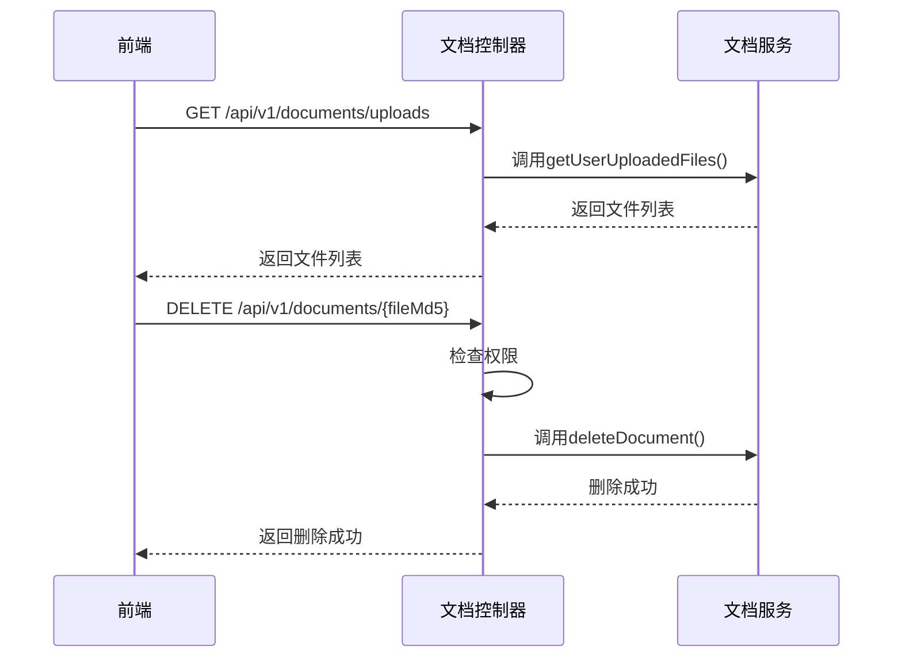
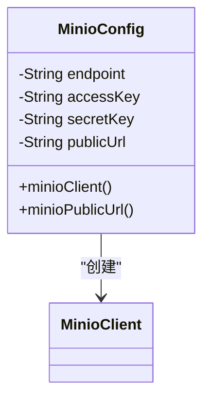
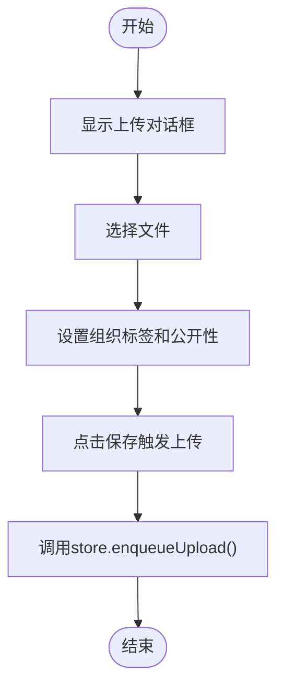
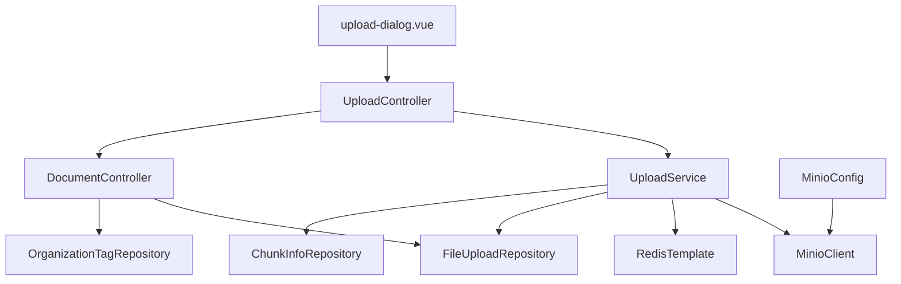

# 文档上传接口

<cite>
**本文档中引用的文件**   
- [UploadController.java](file://src/main/java/com/yizhaoqi/smartpai/controller/UploadController.java)
- [UploadService.java](file://src/main/java/com/yizhaoqi/smartpai/service/UploadService.java)
- [DocumentController.java](file://src/main/java/com/yizhaoqi/smartpai/controller/DocumentController.java)
- [MinioConfig.java](file://src/main/java/com/yizhaoqi/smartpai/config/MinioConfig.java)
- [upload-dialog.vue](file://frontend/src/views/knowledge-base/modules/upload-dialog.vue)
</cite>

## 目录
1. [简介](#简介)
2. [项目结构](#项目结构)
3. [核心组件](#核心组件)
4. [架构概述](#架构概述)
5. [详细组件分析](#详细组件分析)
6. [依赖分析](#依赖分析)
7. [性能考虑](#性能考虑)
8. [故障排除指南](#故障排除指南)
9. [结论](#结论)

## 简介
本文档详细描述了PaiSmart项目中的文档上传与管理API。该系统提供了一套完整的文件处理解决方案，包括文件上传、文档列表获取、文档删除等功能。系统支持大文件的分片上传，具备进度反馈机制，并通过MinIO实现安全的文件存储。文档解析流程在文件上传完成后自动触发，用户可以通过轮询或WebSocket获取处理状态。本系统旨在为用户提供高效、可靠、安全的文档管理服务。

## 项目结构
PaiSmart项目的结构清晰地分为前端和后端两个主要部分。后端采用Spring Boot框架，实现了RESTful API，处理文件上传、文档管理等核心业务逻辑。前端使用Vue.js框架，提供了用户友好的界面，用于文件上传和文档管理。两个部分通过API进行通信，形成了一个完整的文档管理系统。



**图示来源**
- [UploadController.java](file://src/main/java/com/yizhaoqi/smartpai/controller/UploadController.java)
- [UploadService.java](file://src/main/java/com/yizhaoqi/smartpai/service/UploadService.java)
- [DocumentController.java](file://src/main/java/com/yizhaoqi/smartpai/controller/DocumentController.java)
- [MinioConfig.java](file://src/main/java/com/yizhaoqi/smartpai/config/MinioConfig.java)
- [upload-dialog.vue](file://frontend/src/views/knowledge-base/modules/upload-dialog.vue)

## 核心组件

文档上传与管理系统的**核心组件**包括上传控制器（UploadController）、上传服务（UploadService）、文档控制器（DocumentController）和MinIO配置（MinioConfig）。上传控制器负责接收前端的上传请求，验证文件类型，并将分片上传到MinIO。上传服务处理分片的合并和状态管理。文档控制器提供文档列表获取和删除功能。MinIO配置定义了文件存储后端的访问策略和安全性配置。

**组件来源**
- [UploadController.java](file://src/main/java/com/yizhaoqi/smartpai/controller/UploadController.java)
- [UploadService.java](file://src/main/java/com/yizhaoqi/smartpai/service/UploadService.java)
- [DocumentController.java](file://src/main/java/com/yizhaoqi/smartpai/controller/DocumentController.java)
- [MinioConfig.java](file://src/main/java/com/yizhaoqi/smartpai/config/MinioConfig.java)

## 架构概述

该文档上传与管理系统的架构采用分层设计，从前端用户界面到后端服务，再到文件存储，形成了一个完整的处理链。前端通过上传对话框组件与用户交互，收集上传参数并触发上传流程。后端的上传控制器接收请求，调用上传服务处理分片上传和合并。文档控制器提供文档的增删改查功能。所有文件最终存储在MinIO对象存储中，确保了数据的安全性和可靠性。



**图示来源**
- [UploadController.java](file://src/main/java/com/yizhaoqi/smartpai/controller/UploadController.java)
- [UploadService.java](file://src/main/java/com/yizhaoqi/smartpai/service/UploadService.java)
- [DocumentController.java](file://src/main/java/com/yizhaoqi/smartpai/controller/DocumentController.java)
- [MinioConfig.java](file://src/main/java/com/yizhaoqi/smartpai/config/MinioConfig.java)
- [upload-dialog.vue](file://frontend/src/views/knowledge-base/modules/upload-dialog.vue)

## 详细组件分析

### 上传控制器分析
上传控制器是文件上传流程的入口点，负责处理分片上传、合并和状态查询等请求。它通过`/api/v1/upload/chunk`端点接收分片上传请求，验证文件类型，并将分片信息存储到MinIO。通过`/api/v1/upload/merge`端点触发文件合并流程，将所有分片合并成一个完整的文件。控制器还提供了`/api/v1/upload/status`端点，用于查询上传进度。



**图示来源**
- [UploadController.java](file://src/main/java/com/yizhaoqi/smartpai/controller/UploadController.java#L50-L150)
- [UploadService.java](file://src/main/java/com/yizhaoqi/smartpai/service/UploadService.java#L50-L100)

**组件来源**
- [UploadController.java](file://src/main/java/com/yizhaoqi/smartpai/controller/UploadController.java)
- [UploadService.java](file://src/main/java/com/yizhaoqi/smartpai/service/UploadService.java)

### 上传服务分析
上传服务是文件处理的核心业务逻辑层，负责分片的上传、合并和状态管理。服务使用Redis来跟踪分片的上传状态，确保分片不会被重复上传。当所有分片都上传完成后，服务会触发合并流程，将所有分片合并成一个完整的文件，并更新数据库中的文件状态。

```mermaid
classDiagram
class UploadService {
+uploadChunk(fileMd5, chunkIndex, totalSize, fileName, file, orgTag, isPublic, userId)
+mergeChunks(fileMd5, fileName, userId)
+getUploadedChunks(fileMd5, userId)
+getTotalChunks(fileMd5, userId)
+markChunkUploaded(fileMd5, chunkIndex, userId)
+deleteFileMark(fileMd5, userId)
}
class UploadService --> RedisTemplate : "使用"
class UploadService --> MinioClient : "使用"
class UploadService --> FileUploadRepository : "使用"
class UploadService --> ChunkInfoRepository : "使用"
```

**图示来源**
- [UploadService.java](file://src/main/java/com/yizhaoqi/smartpai/service/UploadService.java#L50-L200)

**组件来源**
- [UploadService.java](file://src/main/java/com/yizhaoqi/smartpai/service/UploadService.java)

### 文档控制器分析
文档控制器提供了文档管理的功能，包括获取文档列表和删除文档。通过`/api/v1/documents/uploads`端点获取用户上传的所有文件列表，通过`/api/v1/documents/accessible`端点获取用户可访问的所有文件列表。删除文档通过`DELETE /api/v1/documents/{fileMd5}`端点实现，控制器会先检查用户的权限，然后调用文档服务执行删除操作。



**图示来源**
- [DocumentController.java](file://src/main/java/com/yizhaoqi/smartpai/controller/DocumentController.java#L50-L150)
- [UploadService.java](file://src/main/java/com/yizhaoqi/smartpai/service/UploadService.java#L50-L100)

**组件来源**
- [DocumentController.java](file://src/main/java/com/yizhaoqi/smartpai/controller/DocumentController.java)
- [UploadService.java](file://src/main/java/com/yizhaoqi/smartpai/service/UploadService.java)

### MinIO配置分析
MinIO配置类定义了文件存储后端的访问策略和安全性配置。它通过Spring的`@Value`注解从配置文件中读取MinIO的端点、访问密钥、密钥和公共URL，并创建`MinioClient`实例用于与MinIO服务器交互。配置还提供了`minioPublicUrl` Bean，用于生成文件的公共访问链接。



**图示来源**
- [MinioConfig.java](file://src/main/java/com/yizhaoqi/smartpai/config/MinioConfig.java#L10-L30)

**组件来源**
- [MinioConfig.java](file://src/main/java/com/yizhaoqi/smartpai/config/MinioConfig.java)

### 前端上传组件分析
前端上传对话框组件使用Vue.js和Naive UI构建，提供了用户友好的文件上传界面。组件允许用户选择组织标签、设置文件公开性，并上传文件。上传过程通过`enqueueUpload`方法触发，该方法将上传任务添加到知识库存储中，由后台处理。



**图示来源**
- [upload-dialog.vue](file://frontend/src/views/knowledge-base/modules/upload-dialog.vue#L10-L50)

**组件来源**
- [upload-dialog.vue](file://frontend/src/views/knowledge-base/modules/upload-dialog.vue)

## 依赖分析

该文档上传与管理系统的依赖关系清晰，从前端到后端再到存储，形成了一个完整的处理链。前端依赖于后端API，后端服务依赖于MinIO进行文件存储，同时使用Redis来管理分片状态。各组件之间的依赖关系如下图所示：



**图示来源**
- [UploadController.java](file://src/main/java/com/yizhaoqi/smartpai/controller/UploadController.java)
- [UploadService.java](file://src/main/java/com/yizhaoqi/smartpai/service/UploadService.java)
- [DocumentController.java](file://src/main/java/com/yizhaoqi/smartpai/controller/DocumentController.java)
- [MinioConfig.java](file://src/main/java/com/yizhaoqi/smartpai/config/MinioConfig.java)
- [upload-dialog.vue](file://frontend/src/views/knowledge-base/modules/upload-dialog.vue)

## 性能考虑

该系统在设计时充分考虑了性能因素。对于大文件上传，系统采用分片上传机制，每个分片大小为5MB，这有助于提高上传的稳定性和效率。使用Redis来存储分片状态，可以快速查询上传进度，避免了频繁的数据库查询。MinIO作为对象存储，提供了高吞吐量和低延迟的文件访问能力。此外，系统通过预签名URL提供文件下载，减少了服务器的负载。

## 故障排除指南

在使用文档上传与管理API时，可能会遇到一些常见问题。以下是一些故障排除建议：

1. **文件上传失败**：检查文件类型是否在支持的列表中，确认文件大小是否超过限制。
2. **上传进度不准确**：确保Redis服务正常运行，检查分片状态是否正确更新。
3. **文件合并失败**：确认所有分片都已成功上传，检查MinIO存储空间是否充足。
4. **权限错误**：验证用户是否有权访问或删除指定的文档。
5. **网络问题**：检查前端与后端、后端与MinIO之间的网络连接。

**组件来源**
- [UploadController.java](file://src/main/java/com/yizhaoqi/smartpai/controller/UploadController.java)
- [UploadService.java](file://src/main/java/com/yizhaoqi/smartpai/service/UploadService.java)
- [DocumentController.java](file://src/main/java/com/yizhaoqi/smartpai/controller/DocumentController.java)

## 结论

PaiSmart项目的文档上传与管理API提供了一套完整、高效、安全的文件处理解决方案。通过分片上传、进度反馈、自动解析和安全存储等特性，系统能够满足现代应用对文档管理的需求。前端与后端的良好集成，使得用户可以轻松地上传、管理和访问文档。未来可以考虑增加更多文件类型的支持，优化上传性能，并提供更丰富的文档处理功能。