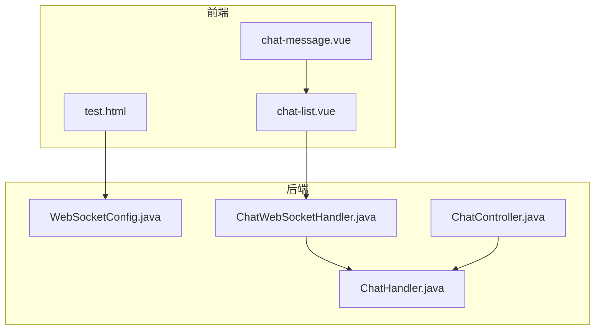
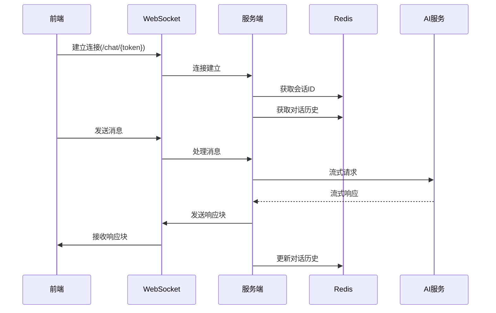
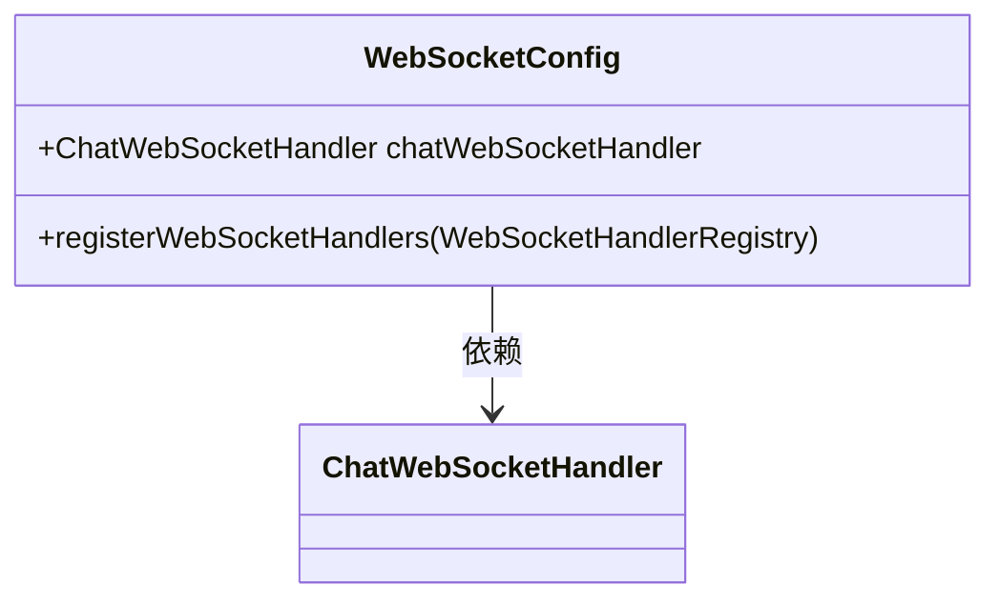
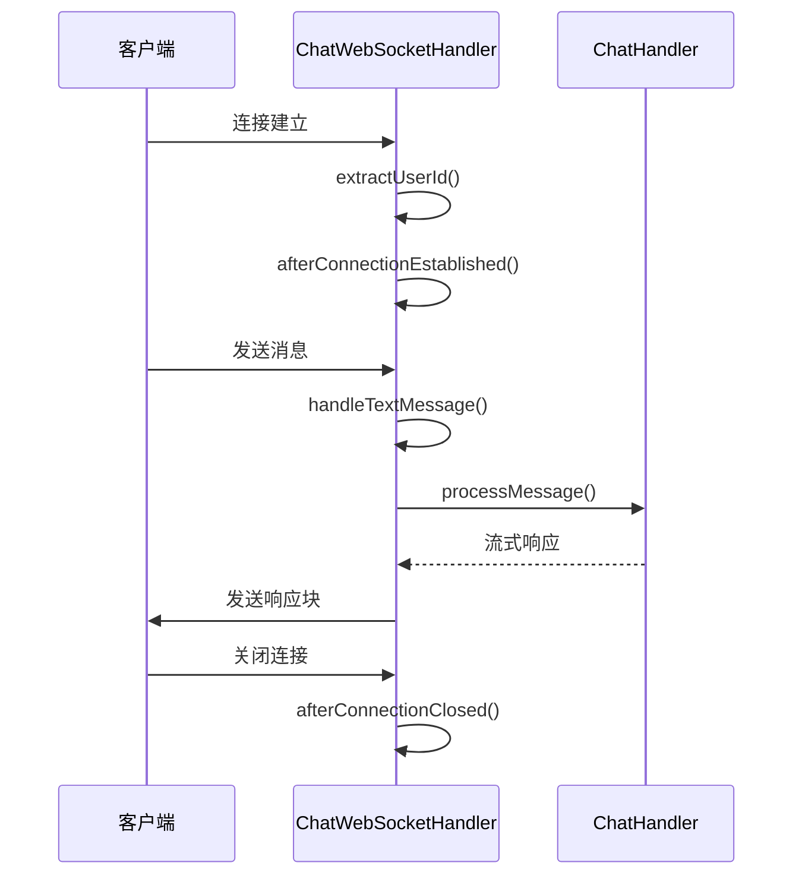
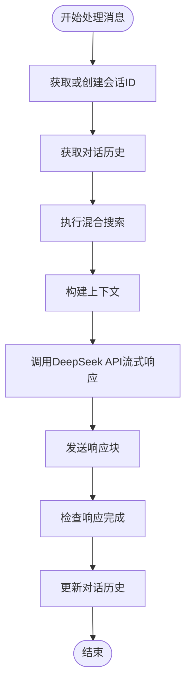
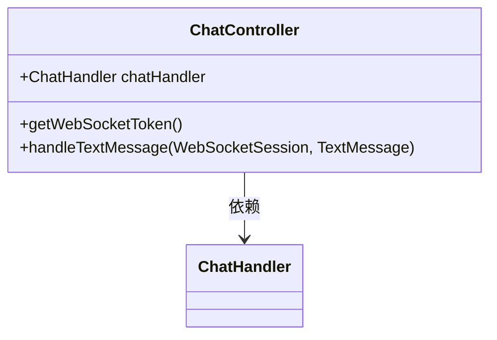
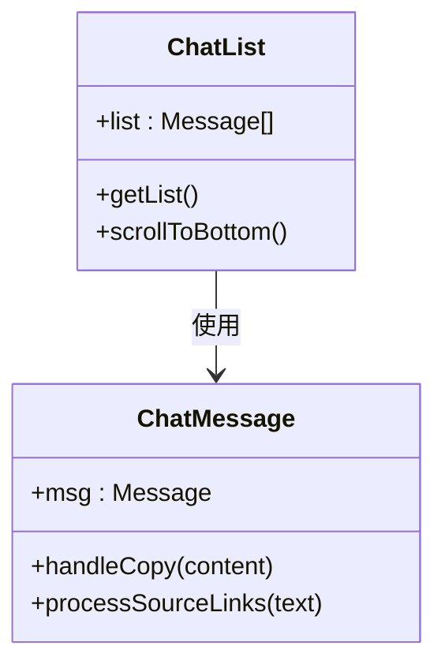
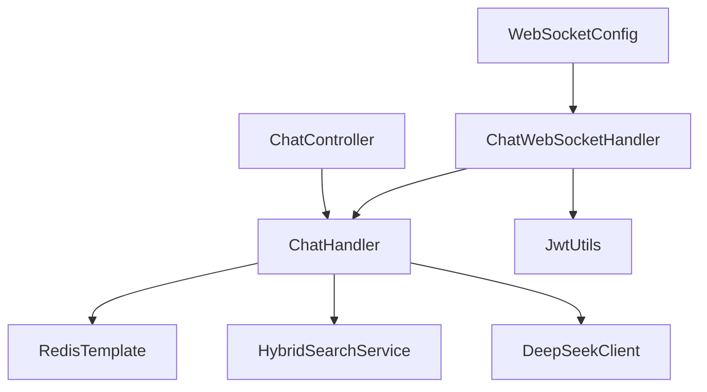

# 聊天接口

<cite>
**本文档中引用的文件**   
- [WebSocketConfig.java](file://src/main/java/com/yizhaoqi/smartpai/config/WebSocketConfig.java#L1-L24)
- [ChatWebSocketHandler.java](file://src/main/java/com/yizhaoqi/smartpai/handler/ChatWebSocketHandler.java#L1-L122)
- [ChatHandler.java](file://src/main/java/com/yizhaoqi/smartpai/service/ChatHandler.java#L1-L401)
- [ChatController.java](file://src/main/java/com/yizhaoqi/smartpai/controller/ChatController.java#L1-L82)
- [test.html](file://src/main/resources/static/test.html#L500-L799)
- [chat-message.vue](file://frontend/src/views/chat/modules/chat-message.vue#L1-L170)
- [chat-list.vue](file://frontend/src/views/chat/modules/chat-list.vue#L1-L79)
</cite>

## 目录
1. [项目结构](#项目结构)
2. [核心组件](#核心组件)
3. [架构概述](#架构概述)
4. [详细组件分析](#详细组件分析)
5. [依赖分析](#依赖分析)
6. [性能考虑](#性能考虑)
7. [故障排除指南](#故障排除指南)

## 项目结构
PaiSmart项目采用前后端分离的架构，前端位于`frontend`目录，后端Java代码位于`src/main/java`目录。聊天功能的实现涉及多个关键组件，包括WebSocket配置、处理器、服务类以及前端Vue组件。

**图示来源**
- [WebSocketConfig.java](file://src/main/java/com/yizhaoqi/smartpai/config/WebSocketConfig.java#L1-L24)
- [ChatWebSocketHandler.java](file://src/main/java/com/yizhaoqi/smartpai/handler/ChatWebSocketHandler.java#L1-L122)
- [ChatHandler.java](file://src/main/java/com/yizhaoqi/smartpai/service/ChatHandler.java#L1-L401)
- [ChatController.java](file://src/main/java/com/yizhaoqi/smartpai/controller/ChatController.java#L1-L82)
- [test.html](file://src/main/resources/static/test.html#L500-L799)
- [chat-message.vue](file://frontend/src/views/chat/modules/chat-message.vue#L1-L170)
- [chat-list.vue](file://frontend/src/views/chat/modules/chat-list.vue#L1-L79)

**章节来源**
- [WebSocketConfig.java](file://src/main/java/com/yizhaoqi/smartpai/config/WebSocketConfig.java#L1-L24)
- [ChatWebSocketHandler.java](file://src/main/java/com/yizhaoqi/smartpai/handler/ChatWebSocketHandler.java#L1-L122)
- [ChatHandler.java](file://src/main/java/com/yizhaoqi/smartpai/service/ChatHandler.java#L1-L401)
- [ChatController.java](file://src/main/java/com/yizhaoqi/smartpai/controller/ChatController.java#L1-L82)
- [test.html](file://src/main/resources/static/test.html#L500-L799)
- [chat-message.vue](file://frontend/src/views/chat/modules/chat-message.vue#L1-L170)
- [chat-list.vue](file://frontend/src/views/chat/modules/chat-list.vue#L1-L79)

## 核心组件
聊天功能的核心组件包括WebSocket配置、处理器、服务类和控制器。WebSocketConfig负责配置WebSocket端点，ChatWebSocketHandler处理WebSocket连接和消息，ChatHandler实现具体的聊天逻辑，ChatController提供RESTful接口。

**章节来源**
- [WebSocketConfig.java](file://src/main/java/com/yizhaoqi/smartpai/config/WebSocketConfig.java#L1-L24)
- [ChatWebSocketHandler.java](file://src/main/java/com/yizhaoqi/smartpai/handler/ChatWebSocketHandler.java#L1-L122)
- [ChatHandler.java](file://src/main/java/com/yizhaoqi/smartpai/service/ChatHandler.java#L1-L401)
- [ChatController.java](file://src/main/java/com/yizhaoqi/smartpai/controller/ChatController.java#L1-L82)

## 架构概述
PaiSmart聊天功能采用WebSocket实现双向实时通信，结合RESTful API进行会话管理。前端通过WebSocket连接到后端，发送用户消息并接收流式响应。后端使用Redis存储对话历史，通过DeepSeekClient调用AI服务生成回复。

**图示来源**
- [WebSocketConfig.java](file://src/main/java/com/yizhaoqi/smartpai/config/WebSocketConfig.java#L1-L24)
- [ChatWebSocketHandler.java](file://src/main/java/com/yizhaoqi/smartpai/handler/ChatWebSocketHandler.java#L1-L122)
- [ChatHandler.java](file://src/main/java/com/yizhaoqi/smartpai/service/ChatHandler.java#L1-L401)
- [ChatController.java](file://src/main/java/com/yizhaoqi/smartpai/controller/ChatController.java#L1-L82)

## 详细组件分析
### WebSocket配置分析
WebSocketConfig类配置了WebSocket端点路径和处理器。端点路径为`/chat/{token}`，使用JWT令牌进行身份验证。

**图示来源**
- [WebSocketConfig.java](file://src/main/java/com/yizhaoqi/smartpai/config/WebSocketConfig.java#L1-L24)

**章节来源**
- [WebSocketConfig.java](file://src/main/java/com/yizhaoqi/smartpai/config/WebSocketConfig.java#L1-L24)

### WebSocket处理器分析
ChatWebSocketHandler处理WebSocket连接的生命周期事件，包括连接建立、消息接收和连接关闭。它使用JWT令牌提取用户ID，并将消息转发给ChatHandler处理。

**图示来源**
- [ChatWebSocketHandler.java](file://src/main/java/com/yizhaoqi/smartpai/handler/ChatWebSocketHandler.java#L1-L122)

**章节来源**
- [ChatWebSocketHandler.java](file://src/main/java/com/yizhaoqi/smartpai/handler/ChatWebSocketHandler.java#L1-L122)

### 聊天服务分析
ChatHandler是聊天功能的核心服务类，负责处理消息、管理对话历史和调用AI服务。它使用Redis存储和检索对话历史，并通过DeepSeekClient实现流式响应。

**图示来源**
- [ChatHandler.java](file://src/main/java/com/yizhaoqi/smartpai/service/ChatHandler.java#L1-L401)

**章节来源**
- [ChatHandler.java](file://src/main/java/com/yizhaoqi/smartpai/service/ChatHandler.java#L1-L401)

### 聊天控制器分析
ChatController提供RESTful接口，用于获取WebSocket停止指令Token。它继承自TextWebSocketHandler，处理WebSocket消息。

**图示来源**
- [ChatController.java](file://src/main/java/com/yizhaoqi/smartpai/controller/ChatController.java#L1-L82)

**章节来源**
- [ChatController.java](file://src/main/java/com/yizhaoqi/smartpai/controller/ChatController.java#L1-L82)

### 前端组件分析
前端聊天界面由chat-message.vue和chat-list.vue组件构成。chat-message.vue负责显示单条消息，chat-list.vue负责管理消息列表。

**图示来源**
- [chat-message.vue](file://frontend/src/views/chat/modules/chat-message.vue#L1-L170)
- [chat-list.vue](file://frontend/src/views/chat/modules/chat-list.vue#L1-L79)

**章节来源**
- [chat-message.vue](file://frontend/src/views/chat/modules/chat-message.vue#L1-L170)
- [chat-list.vue](file://frontend/src/views/chat/modules/chat-list.vue#L1-L79)

## 依赖分析
聊天功能的组件之间存在明确的依赖关系。WebSocketConfig依赖ChatWebSocketHandler，ChatWebSocketHandler依赖ChatHandler和JwtUtils，ChatHandler依赖RedisTemplate、HybridSearchService和DeepSeekClient。

**图示来源**
- [WebSocketConfig.java](file://src/main/java/com/yizhaoqi/smartpai/config/WebSocketConfig.java#L1-L24)
- [ChatWebSocketHandler.java](file://src/main/java/com/yizhaoqi/smartpai/handler/ChatWebSocketHandler.java#L1-L122)
- [ChatHandler.java](file://src/main/java/com/yizhaoqi/smartpai/service/ChatHandler.java#L1-L401)
- [ChatController.java](file://src/main/java/com/yizhaoqi/smartpai/controller/ChatController.java#L1-L82)

**章节来源**
- [WebSocketConfig.java](file://src/main/java/com/yizhaoqi/smartpai/config/WebSocketConfig.java#L1-L24)
- [ChatWebSocketHandler.java](file://src/main/java/com/yizhaoqi/smartpai/handler/ChatWebSocketHandler.java#L1-L122)
- [ChatHandler.java](file://src/main/java/com/yizhaoqi/smartpai/service/ChatHandler.java#L1-L401)
- [ChatController.java](file://src/main/java/com/yizhaoqi/smartpai/controller/ChatController.java#L1-L82)

## 性能考虑
聊天功能在性能方面有以下考虑：
1. 使用Redis缓存对话历史，减少数据库查询
2. 实现流式响应，避免长时间等待
3. 限制对话历史长度为20条消息，防止内存溢出
4. 使用CompletableFuture异步处理响应完成检查
5. 实现WebSocket连接重试机制，提高可靠性

## 故障排除指南
### WebSocket连接问题
- **问题**：无法建立WebSocket连接
- **解决方案**：检查JWT令牌是否正确，确保后端服务正在运行

### 消息处理失败
- **问题**：消息处理出错
- **解决方案**：检查日志中的错误信息，确认DeepSeekClient配置正确

### 响应延迟
- **问题**：AI响应延迟较长
- **解决方案**：检查网络连接，确认DeepSeek服务正常运行

### 历史记录丢失
- **问题**：对话历史记录丢失
- **解决方案**：检查Redis连接，确认Redis服务正常运行

**章节来源**
- [ChatWebSocketHandler.java](file://src/main/java/com/yizhaoqi/smartpai/handler/ChatWebSocketHandler.java#L1-L122)
- [ChatHandler.java](file://src/main/java/com/yizhaoqi/smartpai/service/ChatHandler.java#L1-L401)
- [test.html](file://src/main/resources/static/test.html#L500-L799)