# 后端架构

<cite>
**本文档引用的文件**   
- [AuthController.java](file://src/main/java/com/yizhaoqi/smartpai/controller/AuthController.java)
- [UserService.java](file://src/main/java/com/yizhaoqi/smartpai/service/UserService.java)
- [JwtUtils.java](file://src/main/java/com/yizhaoqi/smartpai/utils/JwtUtils.java)
- [SecurityConfig.java](file://src/main/java/com/yizhaoqi/smartpai/config/SecurityConfig.java)
- [WebConfig.java](file://src/main/java/com/yizhaoqi/smartpai/config/WebConfig.java)
- [RedisConfig.java](file://src/main/java/com/yizhaoqi/smartpai/config/RedisConfig.java)
- [EsConfig.java](file://src/main/java/com/yizhaoqi/smartpai/config/EsConfig.java)
- [WebSocketConfig.java](file://src/main/java/com/yizhaoqi/smartpai/config/WebSocketConfig.java)
- [ChatWebSocketHandler.java](file://src/main/java/com/yizhaoqi/smartpai/handler/ChatWebSocketHandler.java)
- [ChatHandler.java](file://src/main/java/com/yizhaoqi/smartpai/service/ChatHandler.java)
- [HybridSearchService.java](file://src/main/java/com/yizhaoqi/smartpai/service/HybridSearchService.java)
- [VectorizationService.java](file://src/main/java/com/yizhaoqi/smartpai/service/VectorizationService.java)
- [ElasticsearchService.java](file://src/main/java/com/yizhaoqi/smartpai/service/ElasticsearchService.java)
- [DocumentService.java](file://src/main/java/com/yizhaoqi/smartpai/service/DocumentService.java)
- [EsDocument.java](file://src/main/java/com/yizhaoqi/smartpai/entity/EsDocument.java)
- [User.java](file://src/main/java/com/yizhaoqi/smartpai/model/User.java)
- [OrganizationTag.java](file://src/main/java/com/yizhaoqi/smartpai/model/OrganizationTag.java)
- [application.yml](file://src/main/resources/application.yml)
</cite>

## 目录
1. [简介](#简介)
2. [项目结构](#项目结构)
3. [核心组件](#核心组件)
4. [架构概览](#架构概览)
5. [详细组件分析](#详细组件分析)
6. [依赖分析](#依赖分析)
7. [性能考虑](#性能考虑)
8. [故障排除指南](#故障排除指南)
9. [结论](#结论)

## 简介
PaiSmart后端是一个基于Spring Boot的现代化微服务架构系统，采用分层MVC设计模式构建。系统核心功能包括用户认证与授权、实时聊天、知识库搜索和文档管理。后端通过Spring Security实现JWT认证，集成Elasticsearch提供混合搜索能力，并使用WebSocket实现低延迟的实时通信。系统采用Redis进行会话和令牌缓存，MinIO用于文件存储，Kafka处理异步任务。整体架构设计注重安全性、可扩展性和高性能，为前端应用提供稳定可靠的API服务。

## 项目结构
PaiSmart项目的后端代码位于`src/main/java/com/yizhaoqi/smartpai`目录下，遵循标准的Spring Boot项目结构。主要包含controller、service、repository、model、entity、config、utils和handler等包。`controller`包包含API控制器，`service`包包含业务逻辑服务，`repository`包包含数据访问接口，`model`包包含领域模型，`entity`包包含Elasticsearch实体，`config`包包含各种配置类，`utils`包包含工具类，`handler`包包含WebSocket处理器。资源文件位于`src/main/resources`目录下，包括Elasticsearch映射配置和YAML配置文件。

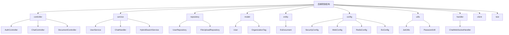

**图示来源**
- [项目结构](file://)

## 核心组件

PaiSmart后端的核心组件包括认证系统、实时通信系统、搜索系统和文档管理系统。认证系统基于JWT和Spring Security实现，提供安全的用户认证和授权。实时通信系统使用WebSocket实现，支持流式AI响应和实时消息传递。搜索系统采用混合搜索策略，结合Elasticsearch的文本搜索和向量相似度搜索，提供精准的知识库检索。文档管理系统支持文件上传、解析、向量化和全文检索，实现知识库的完整生命周期管理。这些核心组件通过清晰的分层架构和依赖注入机制协同工作，共同支撑系统的各项功能。

**组件来源**
- [AuthController.java](file://src/main/java/com/yizhaoqi/smartpai/controller/AuthController.java)
- [ChatHandler.java](file://src/main/java/com/yizhaoqi/smartpai/service/ChatHandler.java)
- [HybridSearchService.java](file://src/main/java/com/yizhaoqi/smartpai/service/HybridSearchService.java)
- [DocumentService.java](file://src/main/java/com/yizhaoqi/smartpai/service/DocumentService.java)

## 架构概览

PaiSmart后端采用典型的分层架构，从上到下分为表现层、业务逻辑层、数据访问层和基础设施层。表现层由Spring MVC控制器组成，处理HTTP请求和响应。业务逻辑层包含各种服务类，实现核心业务功能。数据访问层通过JPA和Elasticsearch客户端与数据库交互。基础设施层集成Redis、MinIO、Kafka等外部服务。各层之间通过接口和依赖注入解耦，确保代码的可维护性和可测试性。系统通过配置类统一管理各种外部服务的连接和参数，通过工具类提供通用功能支持。

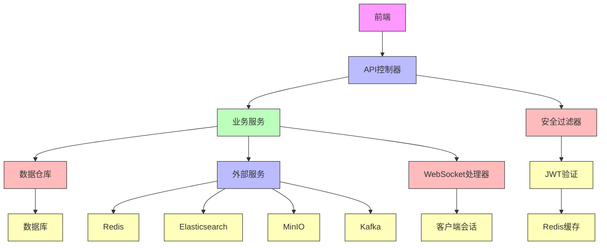

**图示来源**
- [架构概览](file://)

## 详细组件分析

### 认证与授权系统分析

PaiSmart的认证与授权系统基于JWT和Spring Security构建，提供安全可靠的用户身份验证和权限控制。系统使用`JwtUtils`工具类生成、验证和刷新JWT令牌，通过`SecurityConfig`配置Spring Security的安全策略，`AuthController`处理登录和注册请求，`UserService`实现用户管理业务逻辑。

#### 认证流程类图
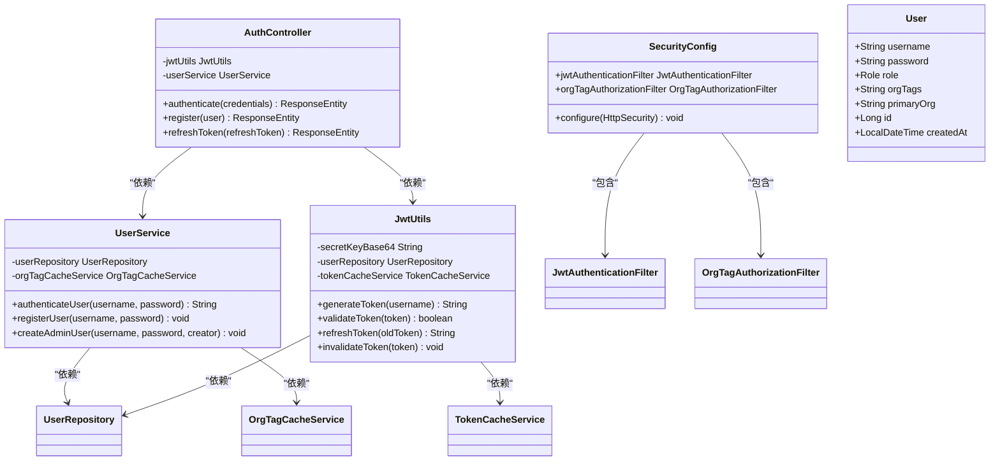

**图示来源**
- [AuthController.java](file://src/main/java/com/yizhaoqi/smartpai/controller/AuthController.java#L1-L50)
- [UserService.java](file://src/main/java/com/yizhaoqi/smartpai/service/UserService.java#L1-L100)
- [JwtUtils.java](file://src/main/java/com/yizhaoqi/smartpai/utils/JwtUtils.java#L1-L50)
- [SecurityConfig.java](file://src/main/java/com/yizhaoqi/smartpai/config/SecurityConfig.java#L1-L30)

#### JWT认证流程序列图
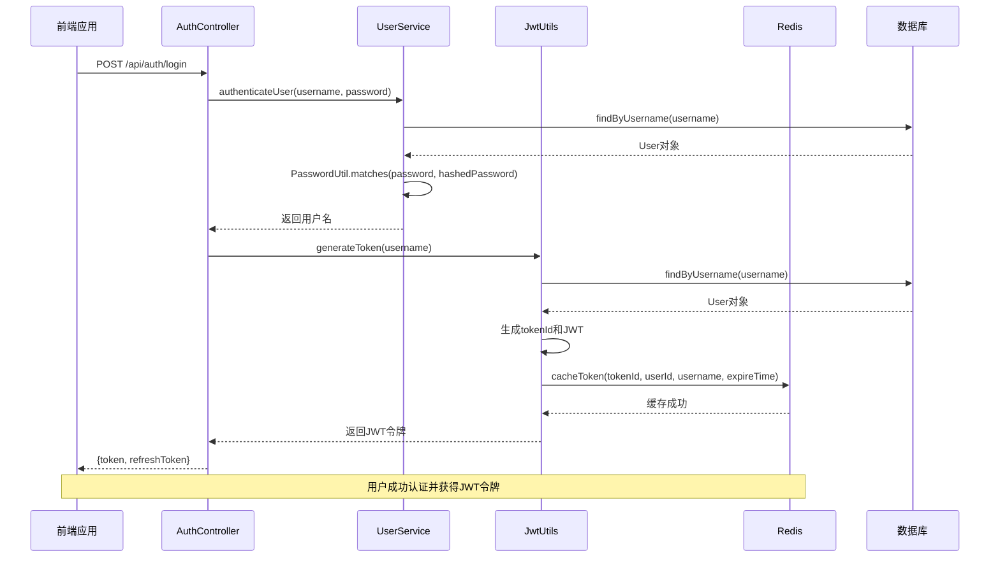

**图示来源**
- [AuthController.java](file://src/main/java/com/yizhaoqi/smartpai/controller/AuthController.java#L20-L40)
- [UserService.java](file://src/main/java/com/yizhaoqi/smartpai/service/UserService.java#L50-L80)
- [JwtUtils.java](file://src/main/java/com/yizhaoqi/smartpai/utils/JwtUtils.java#L50-L100)

### 数据访问与搜索系统分析

PaiSmart的数据访问与搜索系统采用混合架构，结合关系型数据库和Elasticsearch搜索引擎。系统使用JPA进行用户和组织标签的CRUD操作，使用Elasticsearch进行知识库的全文搜索和向量搜索。`HybridSearchService`是搜索系统的核心，它整合了文本匹配和向量相似度两种搜索方式，提供更精准的搜索结果。

#### 混合搜索服务类图
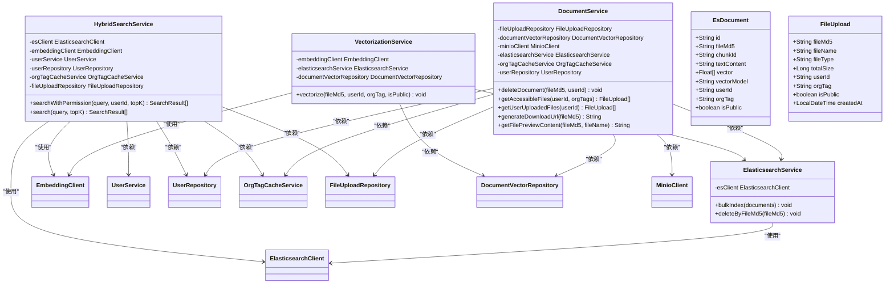

**图示来源**
- [HybridSearchService.java](file://src/main/java/com/yizhaoqi/smartpai/service/HybridSearchService.java#L1-L50)
- [ElasticsearchService.java](file://src/main/java/com/yizhaoqi/smartpai/service/ElasticsearchService.java#L1-L20)
- [VectorizationService.java](file://src/main/java/com/yizhaoqi/smartpai/service/VectorizationService.java#L1-L20)
- [DocumentService.java](file://src/main/java/com/yizhaoqi/smartpai/service/DocumentService.java#L1-L50)

#### 混合搜索流程序列图
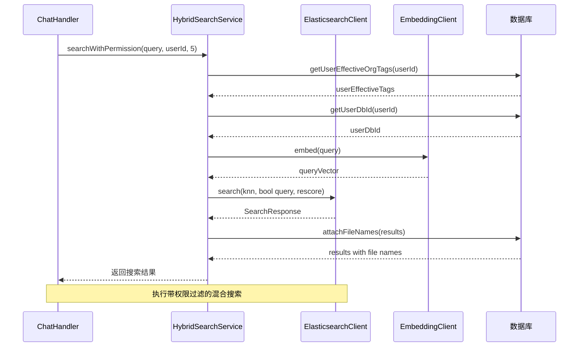

**图示来源**
- [ChatHandler.java](file://src/main/java/com/yizhaoqi/smartpai/service/ChatHandler.java#L50-L80)
- [HybridSearchService.java](file://src/main/java/com/yizhaoqi/smartpai/service/HybridSearchService.java#L50-L150)
- [ElasticsearchClient](file://external)
- [EmbeddingClient.java](file://src/main/java/com/yizhaoqi/smartpai/client/EmbeddingClient.java)

### 实时通信系统分析

PaiSmart的实时通信系统基于WebSocket实现，支持流式AI响应和实时消息传递。系统使用`WebSocketConfig`配置WebSocket端点，`ChatWebSocketHandler`处理WebSocket连接和消息，`ChatHandler`处理聊天业务逻辑。前端通过WebSocket连接到`/chat/{token}`端点，服务器通过该连接实时推送AI生成的响应片段。

#### 实时通信类图
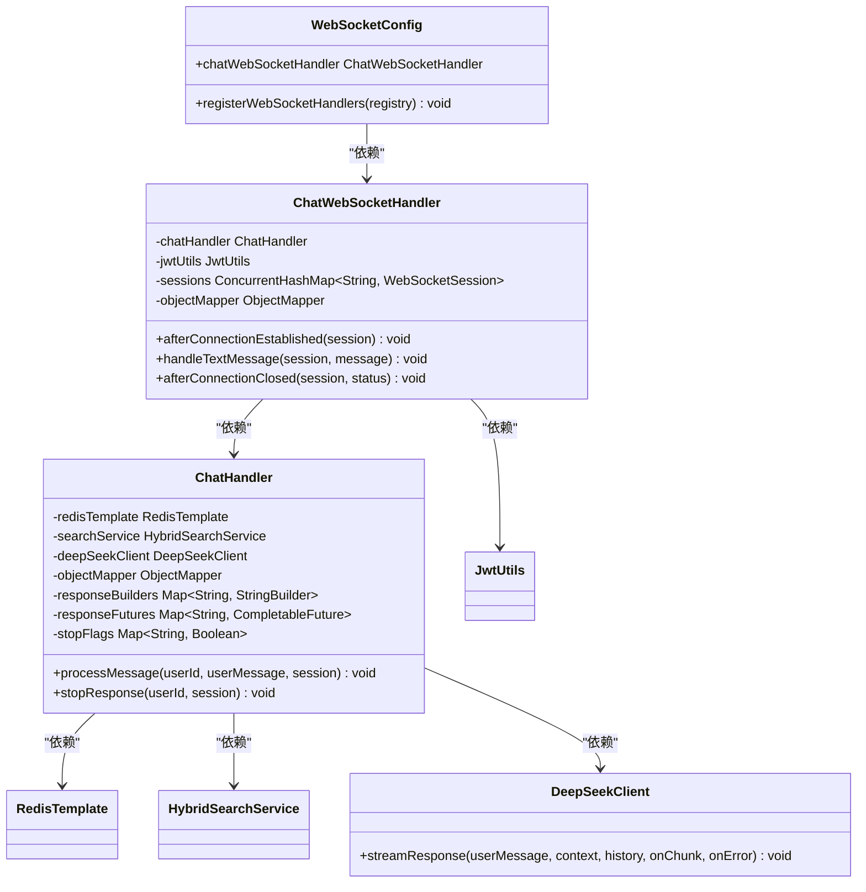

**图示来源**
- [WebSocketConfig.java](file://src/main/java/com/yizhaoqi/smartpai/config/WebSocketConfig.java#L1-L20)
- [ChatWebSocketHandler.java](file://src/main/java/com/yizhaoqi/smartpai/handler/ChatWebSocketHandler.java#L1-L50)
- [ChatHandler.java](file://src/main/java/com/yizhaoqi/smartpai/service/ChatHandler.java#L1-L50)
- [DeepSeekClient.java](file://src/main/java/com/yizhaoqi/smartpai/client/DeepSeekClient.java)

#### 实时聊天流程序列图
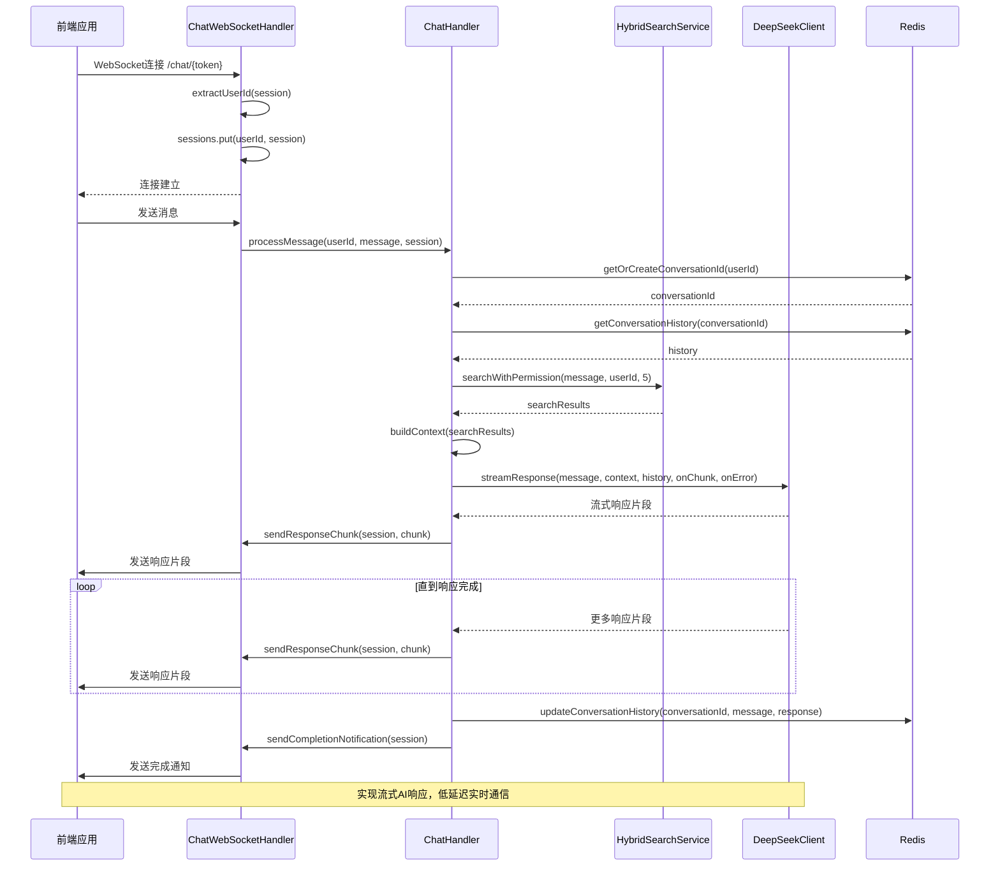

**图示来源**
- [ChatWebSocketHandler.java](file://src/main/java/com/yizhaoqi/smartpai/handler/ChatWebSocketHandler.java#L50-L100)
- [ChatHandler.java](file://src/main/java/com/yizhaoqi/smartpai/service/ChatHandler.java#L50-L200)
- [HybridSearchService.java](file://src/main/java/com/yizhaoqi/smartpai/service/HybridSearchService.java#L50-L100)
- [DeepSeekClient.java](file://src/main/java/com/yizhaoqi/smartpai/client/DeepSeekClient.java)

### 配置系统分析

PaiSmart的配置系统通过Spring Boot的配置机制统一管理各种外部服务的连接和参数。系统包含多个配置类，分别处理Web、安全、Redis、Elasticsearch和WebSocket等配置。这些配置类通过`@Configuration`注解声明，使用`@Value`注解注入配置属性，通过`@Bean`注解定义和配置各种组件。

#### 配置类依赖图
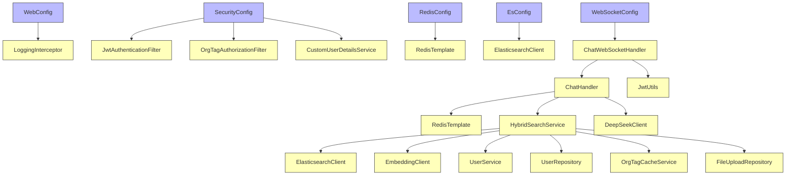

**图示来源**
- [WebConfig.java](file://src/main/java/com/yizhaoqi/smartpai/config/WebConfig.java)
- [SecurityConfig.java](file://src/main/java/com/yizhaoqi/smartpai/config/SecurityConfig.java)
- [RedisConfig.java](file://src/main/java/com/yizhaoqi/smartpai/config/RedisConfig.java)
- [EsConfig.java](file://src/main/java/com/yizhaoqi/smartpai/config/EsConfig.java)
- [WebSocketConfig.java](file://src/main/java/com/yizhaoqi/smartpai/config/WebSocketConfig.java)

#### Web配置流程图
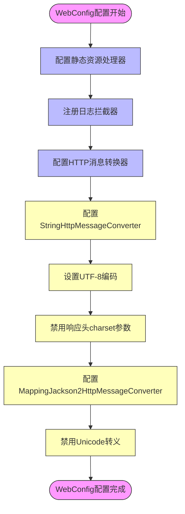

**图示来源**
- [WebConfig.java](file://src/main/java/com/yizhaoqi/smartpai/config/WebConfig.java#L20-L70)

## 依赖分析

PaiSmart后端系统的组件依赖关系清晰，遵循高内聚低耦合的设计原则。核心依赖关系包括：控制器层依赖服务层，服务层依赖数据访问层和外部服务客户端，配置类依赖各种组件并将其注入到系统中。系统通过Spring的依赖注入机制管理这些依赖关系，确保组件之间的松耦合和可测试性。

```mermaid
graph TD
AuthController --> UserService
UserController --> UserService
AdminController --> UserService
ChatController --> ChatHandler
DocumentController --> DocumentService
ParseController --> ParseService
SearchController --> HybridSearchService
UploadController --> UploadService
UserService --> UserRepository
UserService --> OrganizationTagRepository
UserService --> OrgTagCacheService
DocumentService --> FileUploadRepository
DocumentService --> DocumentVectorRepository
DocumentService --> MinioClient
DocumentService --> ElasticsearchService
DocumentService --> OrgTagCacheService
DocumentService --> UserRepository
HybridSearchService --> ElasticsearchClient
HybridSearchService --> EmbeddingClient
HybridSearchService --> UserService
HybridSearchService --> UserRepository
HybridSearchService --> OrgTagCacheService
HybridSearchService --> FileUploadRepository
VectorizationService --> EmbeddingClient
VectorizationService --> ElasticsearchService
VectorizationService --> DocumentVectorRepository
ChatHandler --> RedisTemplate
ChatHandler --> HybridSearchService
ChatHandler --> DeepSeekClient
ChatWebSocketHandler --> ChatHandler
ChatWebSocketHandler --> JwtUtils
SecurityConfig --> JwtAuthenticationFilter
SecurityConfig --> OrgTagAuthorizationFilter
SecurityConfig --> CustomUserDetailsService
WebConfig --> LoggingInterceptor
WebSocketConfig --> ChatWebSocketHandler
RedisConfig --> RedisTemplate
EsConfig --> ElasticsearchClient
style AuthController fill:#bbf,stroke:#333
style UserController fill:#bbf,stroke:#333
style AdminController fill:#bbf,stroke:#333
style ChatController fill:#bbf,stroke:#333
style DocumentController fill:#bbf,stroke:#333
style ParseController fill:#bbf,stroke:#333
style SearchController fill:#bbf,stroke:#333
style UploadController fill:#bbf,stroke:#333
style UserService fill:#bfb,stroke:#333
style DocumentService fill:#bfb,stroke:#333
style HybridSearchService fill:#bfb,stroke:#333
style VectorizationService fill:#bfb,stroke:#333
style ChatHandler fill:#bfb,stroke:#333
style UserRepository fill:#fbb,stroke:#333
style OrganizationTagRepository fill:#fbb,stroke:#333
style FileUploadRepository fill:#fbb,stroke:#333
style DocumentVectorRepository fill:#fbb,stroke:#333
style MinioClient fill:#ffb,stroke:#333
style ElasticsearchService fill:#ffb,stroke:#333
style ElasticsearchClient fill:#ffb,stroke:#333
style EmbeddingClient fill:#ffb,stroke:#333
style DeepSeekClient fill:#ffb,stroke:#333
style RedisTemplate fill:#ffb,stroke:#333
style JwtAuthenticationFilter fill:#fbb,stroke:#333
style OrgTagAuthorizationFilter fill:#fbb,stroke:#333
style CustomUserDetailsService fill:#fbb,stroke:#333
style LoggingInterceptor fill:#fbb,stroke:#333
style ChatWebSocketHandler fill:#fbb,stroke:#333
style JwtUtils fill:#fbb,stroke:#333
style SecurityConfig fill:#bbf,stroke:#333
style WebConfig fill:#bbf,stroke:#333
style WebSocketConfig fill:#bbf,stroke:#333
style RedisConfig fill:#bbf,stroke:#333
style EsConfig fill:#bbf,stroke:#333
```

**图示来源**
- [依赖分析](file://)

## 性能考虑

PaiSmart后端在设计时充分考虑了性能优化，采用了多种策略来提高系统响应速度和吞吐量。首先，系统使用Redis缓存JWT令牌和用户组织标签信息，避免了频繁的数据库查询。其次，Elasticsearch的混合搜索策略结合了KNN向量搜索和BM25文本搜索，通过rescore机制提高了搜索的准确性和效率。再者，实时聊天采用流式响应模式，通过WebSocket逐步推送AI生成的内容，减少了用户等待时间。此外，系统使用连接池管理数据库和外部服务连接，通过异步处理和批量操作优化了I/O性能。最后，合理的分页和缓存策略有效控制了内存使用，避免了大规模数据加载导致的性能下降。

**性能考虑来源**
- [JwtUtils.java](file://src/main/java/com/yizhaoqi/smartpai/utils/JwtUtils.java)
- [HybridSearchService.java](file://src/main/java/com/yizhaoqi/smartpai/service/HybridSearchService.java)
- [ChatHandler.java](file://src/main/java/com/yizhaoqi/smartpai/service/ChatHandler.java)
- [ElasticsearchService.java](file://src/main/java/com/yizhaoqi/smartpai/service/ElasticsearchService.java)
- [DocumentService.java](file://src/main/java/com/yizhaoqi/smartpai/service/DocumentService.java)

## 故障排除指南

### 常见问题及解决方案

1. **JWT令牌验证失败**
   - **症状**: 用户无法登录或API返回401错误
   - **原因**: JWT密钥不匹配、令牌过期或Redis缓存问题
   - **解决方案**: 
     - 检查`application.yml`中的`jwt.secret-key`配置是否正确
     - 确认Redis服务正常运行且连接配置正确
     - 检查系统时间是否同步，避免因时间偏差导致令牌验证失败

2. **Elasticsearch搜索无结果**
   - **症状**: 搜索功能返回空结果或错误
   - **原因**: Elasticsearch服务未启动、索引不存在或映射配置错误
   - **解决方案**:
     - 确认Elasticsearch服务正常运行且网络可达
     - 检查`es-mappings/knowledge_base.json`映射文件是否正确应用
     - 验证`EsConfig`中的连接配置（host、port、scheme、username、password）

3. **WebSocket连接失败**
   - **症状**: 实时聊天功能无法建立连接
   - **原因**: WebSocket端点配置错误、CORS问题或JWT令牌无效
   - **解决方案**:
     - 检查`WebSocketConfig`中的端点路径和允许的来源配置
     - 确认前端传递的JWT令牌有效且未过期
     - 检查浏览器控制台和服务器日志中的具体错误信息

4. **文件上传或解析失败**
   - **症状**: 文件上传后无法预览或搜索
   - **原因**: MinIO服务问题、文件解析错误或向量化服务异常
   - **解决方案**:
     - 确认MinIO服务正常运行且存储桶存在
     - 检查`application.yml`中的MinIO连接配置
     - 验证文件类型是否在支持列表中，查看日志中的具体解析错误

5. **Redis连接超时**
   - **症状**: 系统响应缓慢或缓存功能失效
   - **原因**: Redis服务不可达、连接池耗尽或网络问题
   - **解决方案**:
     - 检查Redis服务状态和网络连接
     - 验证`application.yml`中的Redis连接配置
     - 监控Redis内存使用情况，避免内存溢出

**故障排除来源**
- [JwtUtils.java](file://src/main/java/com/yizhaoqi/smartpai/utils/JwtUtils.java)
- [EsConfig.java](file://src/main/java/com/yizhaoqi/smartpai/config/EsConfig.java)
- [WebSocketConfig.java](file://src/main/java/com/yizhaoqi/smartpai/config/WebSocketConfig.java)
- [MinioConfig.java](file://src/main/java/com/yizhaoqi/smartpai/config/MinioConfig.java)
- [RedisConfig.java](file://src/main/java/com/yizhaoqi/smartpai/config/RedisConfig.java)

## 结论

PaiSmart后端架构设计合理，采用Spring Boot的分层MVC模式，实现了清晰的职责划分和良好的代码组织。系统通过JWT和Spring Security提供了安全的认证与授权机制，使用Elasticsearch和向量搜索实现了强大的知识库检索功能，基于WebSocket的实时通信系统支持流式AI响应，提供了流畅的用户体验。配置系统灵活可扩展，通过YAML文件集中管理各种外部服务的连接参数。整体架构具有良好的可维护性、可扩展性和高性能，为前端应用提供了稳定可靠的API服务。建议在后续开发中进一步完善单元测试和集成测试，加强监控和日志分析能力，持续优化系统性能和稳定性。