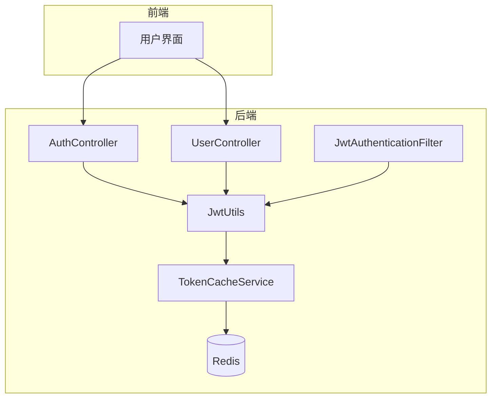
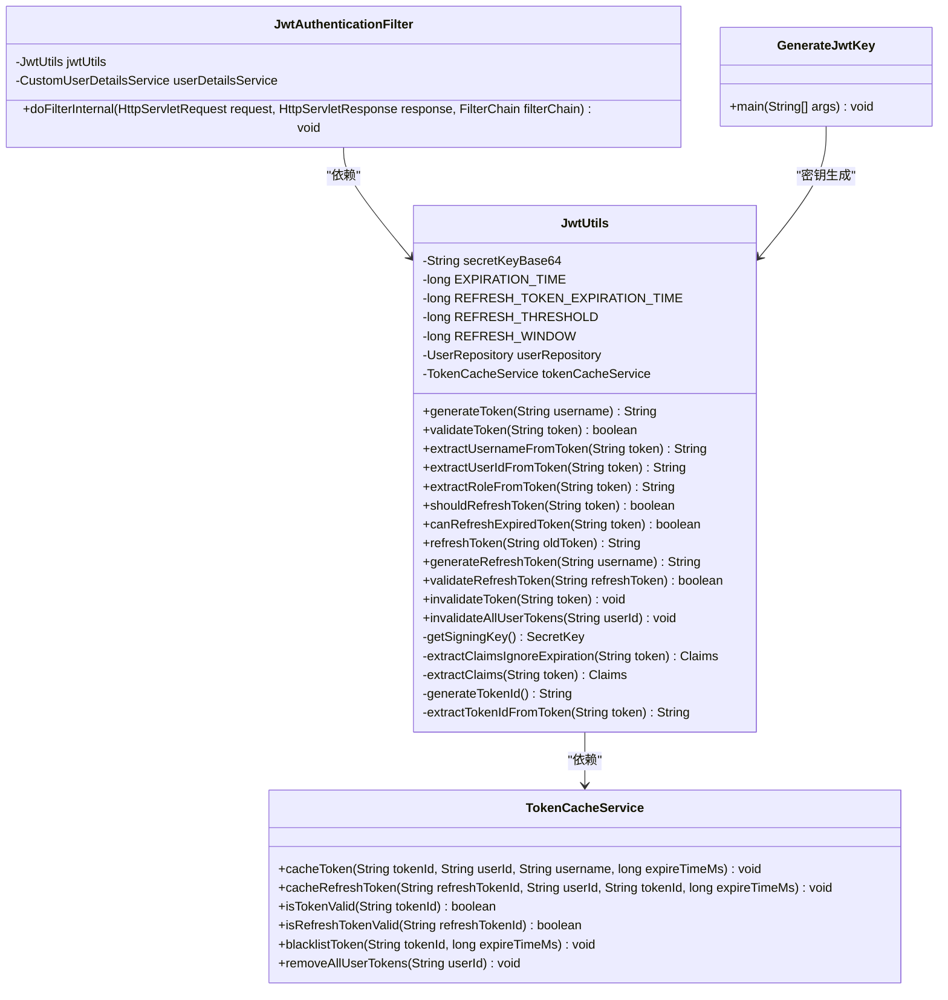
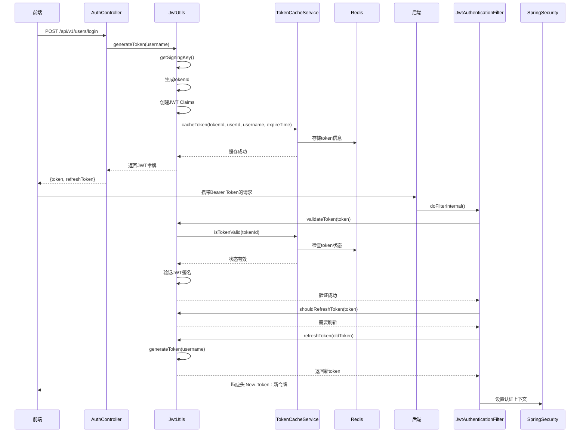
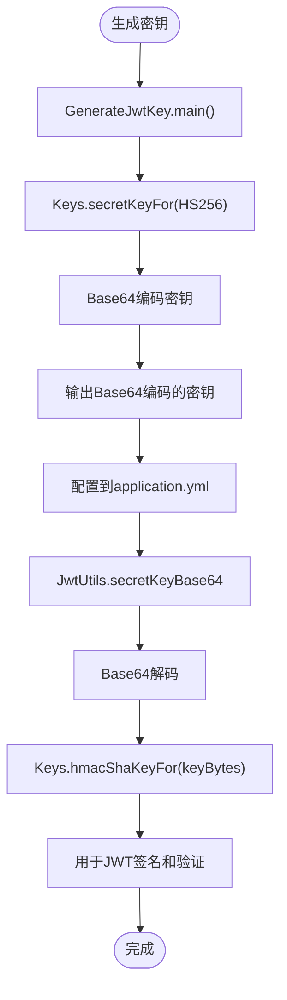

# JWT工具

<cite>
**本文档引用的文件**   
- [JwtUtils.java](file://src/main/java/com/yizhaoqi/smartpai/utils/JwtUtils.java)
- [GenerateJwtKey.java](file://src/main/java/com/yizhaoqi/smartpai/utils/GenerateJwtKey.java)
- [JwtAuthenticationFilter.java](file://src/main/java/com/yizhaoqi/smartpai/config/JwtAuthenticationFilter.java)
- [TokenCacheService.java](file://src/main/java/com/yizhaoqi/smartpai/service/TokenCacheService.java)
- [AuthController.java](file://src/main/java/com/yizhaoqi/smartpai/controller/AuthController.java)
- [UserController.java](file://src/main/java/com/yizhaoqi/smartpai/controller/UserController.java)
- [application.yml](file://src/main/resources/application.yml)
</cite>

## 目录
1. [简介](#简介)
2. [核心组件](#核心组件)
3. [架构概览](#架构概览)
4. [详细组件分析](#详细组件分析)
5. [依赖分析](#依赖分析)
6. [性能考虑](#性能考虑)
7. [故障排除指南](#故障排除指南)
8. [结论](#结论)

## 简介
本文档深入解析了`JwtUtils`类的实现机制，涵盖JWT令牌的生成、解析、签名验证和刷新功能。详细说明了其使用的加密算法（如HS256）、密钥管理策略、过期时间控制及防重放攻击设计。结合`GenerateJwtKey.java`说明了密钥生成的安全性保障。提供了完整的API文档，包括方法签名、参数说明、返回值和异常处理。展示了在用户认证流程中如何与`JwtAuthenticationFilter`集成使用，并给出了实际调用示例。分析了其在分布式环境下的适用性和性能优化建议。

## 核心组件

`JwtUtils`类是本系统中负责JWT令牌管理的核心工具类。它实现了令牌的生成、验证、解析和刷新功能，并通过Redis缓存机制增强了安全性。`GenerateJwtKey`类用于生成安全的JWT密钥。`JwtAuthenticationFilter`作为Spring Security过滤器，负责在每次请求时自动处理JWT令牌的验证和刷新。`TokenCacheService`提供了基于Redis的令牌状态管理服务。

**本文档引用的文件**   
- [JwtUtils.java](file://src/main/java/com/yizhaoqi/smartpai/utils/JwtUtils.java)
- [GenerateJwtKey.java](file://src/main/java/com/yizhaoqi/smartpai/utils/GenerateJwtKey.java)
- [JwtAuthenticationFilter.java](file://src/main/java/com/yizhaoqi/smartpai/config/JwtAuthenticationFilter.java)
- [TokenCacheService.java](file://src/main/java/com/yizhaoqi/smartpai/service/TokenCacheService.java)

## 架构概览



**图示来源**
- [JwtUtils.java](file://src/main/java/com/yizhaoqi/smartpai/utils/JwtUtils.java)
- [JwtAuthenticationFilter.java](file://src/main/java/com/yizhaoqi/smartpai/config/JwtAuthenticationFilter.java)
- [TokenCacheService.java](file://src/main/java/com/yizhaoqi/smartpai/service/TokenCacheService.java)
- [AuthController.java](file://src/main/java/com/yizhaoqi/smartpai/controller/AuthController.java)
- [UserController.java](file://src/main/java/com/yizhaoqi/smartpai/controller/UserController.java)

## 详细组件分析

### JwtUtils类分析

`JwtUtils`类是JWT令牌管理的核心实现，提供了完整的令牌生命周期管理功能。



**图示来源**
- [JwtUtils.java](file://src/main/java/com/yizhaoqi/smartpai/utils/JwtUtils.java)
- [TokenCacheService.java](file://src/main/java/com/yizhaoqi/smartpai/service/TokenCacheService.java)
- [GenerateJwtKey.java](file://src/main/java/com/yizhaoqi/smartpai/utils/GenerateJwtKey.java)
- [JwtAuthenticationFilter.java](file://src/main/java/com/yizhaoqi/smartpai/config/JwtAuthenticationFilter.java)

### 认证流程分析



**图示来源**
- [JwtUtils.java](file://src/main/java/com/yizhaoqi/smartpai/utils/JwtUtils.java)
- [JwtAuthenticationFilter.java](file://src/main/java/com/yizhaoqi/smartpai/config/JwtAuthenticationFilter.java)
- [TokenCacheService.java](file://src/main/java/com/yizhaoqi/smartpai/service/TokenCacheService.java)
- [AuthController.java](file://src/main/java/com/yizhaoqi/smartpai/controller/AuthController.java)

### 密钥管理机制



**图示来源**
- [GenerateJwtKey.java](file://src/main/java/com/yizhaoqi/smartpai/utils/GenerateJwtKey.java)
- [JwtUtils.java](file://src/main/java/com/yizhaoqi/smartpai/utils/JwtUtils.java)
- [application.yml](file://src/main/resources/application.yml)

## 依赖分析

```mermaid
graph TD
JwtUtils --> UserRepository : "依赖"
JwtUtils --> TokenCacheService : "依赖"
JwtAuthenticationFilter --> JwtUtils : "依赖"
JwtAuthenticationFilter --> CustomUserDetailsService : "依赖"
AuthController --> JwtUtils : "依赖"
UserController --> JwtUtils : "依赖"
TokenCacheService --> RedisTemplate : "依赖"
GenerateJwtKey --> Keys : "依赖"
JwtUtils --> Keys : "依赖"
```

**图示来源**
- [JwtUtils.java](file://src/main/java/com/yizhaoqi/smartpai/utils/JwtUtils.java)
- [JwtAuthenticationFilter.java](file://src/main/java/com/yizhaoqi/smartpai/config/JwtAuthenticationFilter.java)
- [TokenCacheService.java](file://src/main/java/com/yizhaoqi/smartpai/service/TokenCacheService.java)
- [AuthController.java](file://src/main/java/com/yizhaoqi/smartpai/controller/AuthController.java)
- [UserController.java](file://src/main/java/com/yizhaoqi/smartpai/controller/UserController.java)

## 性能考虑

`JwtUtils`类在设计时考虑了多项性能优化措施：

1. **Redis缓存优先验证**：在验证JWT令牌时，首先检查Redis缓存中的令牌状态，避免了每次都需要进行JWT签名验证的计算开销。

2. **双重验证机制**：先通过Redis缓存进行快速失败检查，再进行JWT签名验证，提高了验证效率。

3. **自动刷新机制**：在令牌即将过期时自动刷新，避免了用户因令牌过期而被强制登出，提升了用户体验。

4. **合理的过期时间设置**：访问令牌设置为1小时，刷新令牌设置为7天，平衡了安全性和用户体验。

5. **Redis键值设计**：使用前缀区分不同类型的令牌，便于管理和清理。

6. **缓冲时间设置**：Redis缓存时间比JWT过期时间多5分钟，防止因时钟偏差导致的问题。

## 故障排除指南

### 常见问题及解决方案

1. **令牌验证失败**
   - 检查`application.yml`中的`jwt.secret-key`配置是否正确
   - 确认密钥是否为Base64编码格式
   - 检查Redis服务是否正常运行

2. **令牌无法刷新**
   - 确认令牌是否在宽限期内（过期后10分钟内）
   - 检查用户信息是否存在于数据库中
   - 验证Redis中是否存有对应的刷新令牌信息

3. **密钥生成问题**
   - 确保`GenerateJwtKey`类中的HS256算法正确
   - 检查生成的密钥是否已正确配置到`application.yml`

4. **Redis连接问题**
   - 检查`application.yml`中的Redis配置
   - 确认Redis服务是否启动
   - 验证网络连接是否正常

5. **自动刷新不工作**
   - 检查`REFRESH_THRESHOLD`设置（当前为5分钟）
   - 确认`JwtAuthenticationFilter`已正确配置在过滤器链中
   - 验证前端是否正确处理了`New-Token`响应头

**本文档引用的文件**   
- [JwtUtils.java](file://src/main/java/com/yizhaoqi/smartpai/utils/JwtUtils.java)
- [TokenCacheService.java](file://src/main/java/com/yizhaoqi/smartpai/service/TokenCacheService.java)
- [application.yml](file://src/main/resources/application.yml)

## 结论

`JwtUtils`类实现了一套完整的JWT令牌管理方案，具有以下特点：

1. **安全性高**：采用HS256加密算法，结合Redis缓存实现双重验证，有效防止令牌被篡改或重放攻击。

2. **用户体验好**：实现了无感知的自动刷新机制，当令牌即将过期时自动刷新，避免用户频繁登录。

3. **可扩展性强**：通过`TokenCacheService`实现了灵活的令牌状态管理，便于在分布式环境中使用。

4. **易于维护**：提供了`GenerateJwtKey`工具类用于安全地生成密钥，简化了密钥管理。

5. **集成度高**：与Spring Security无缝集成，通过`JwtAuthenticationFilter`实现了自动的用户认证。

该实现方案在保证安全性的同时，提供了良好的用户体验和系统性能，适用于需要JWT认证的各类应用场景。