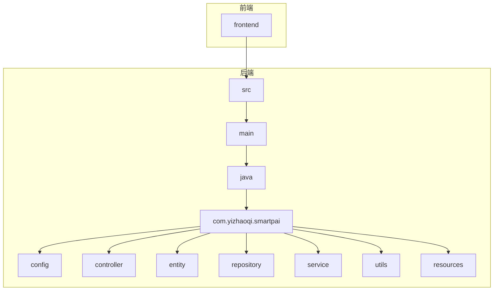
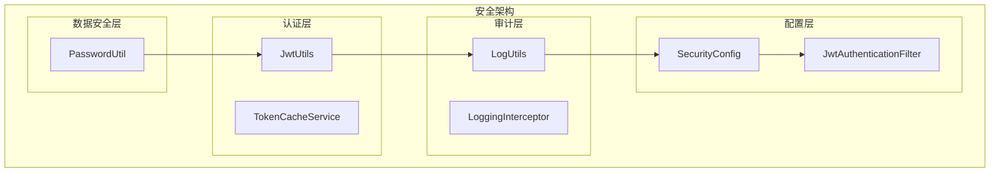
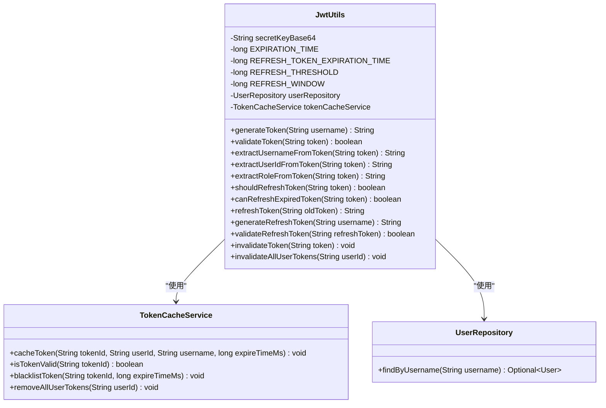
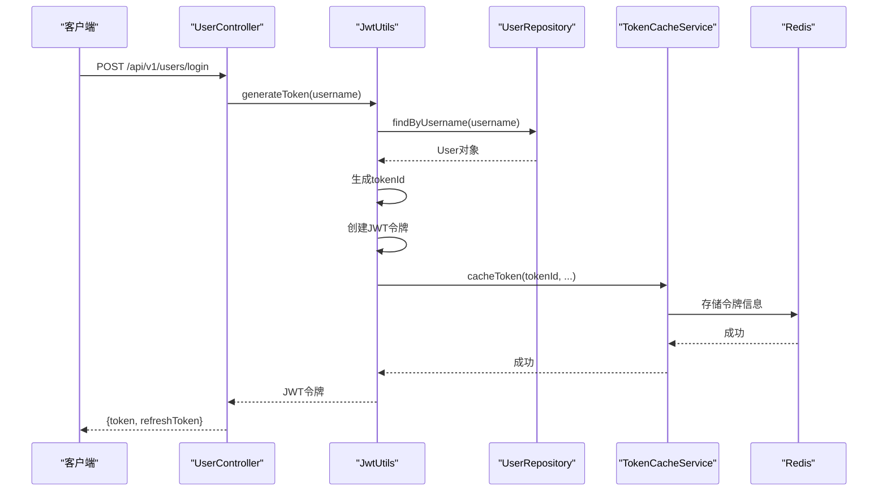
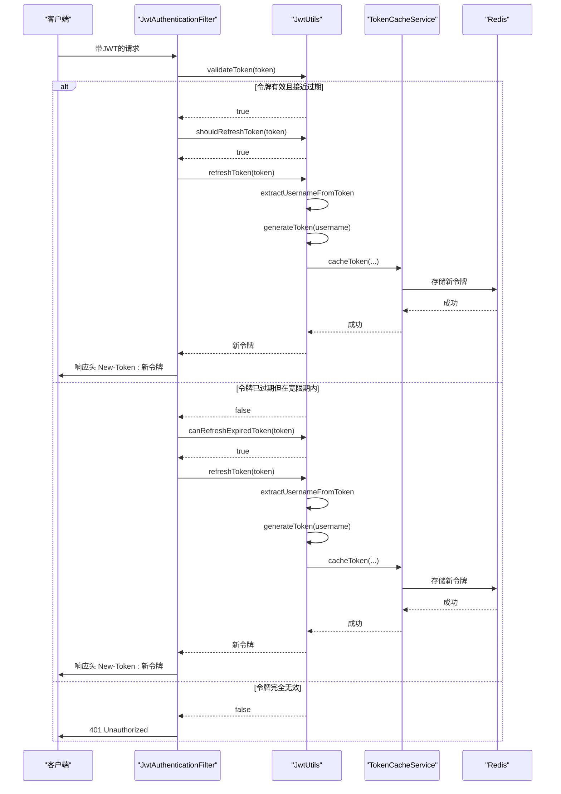
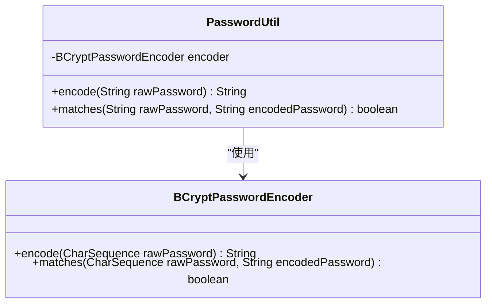
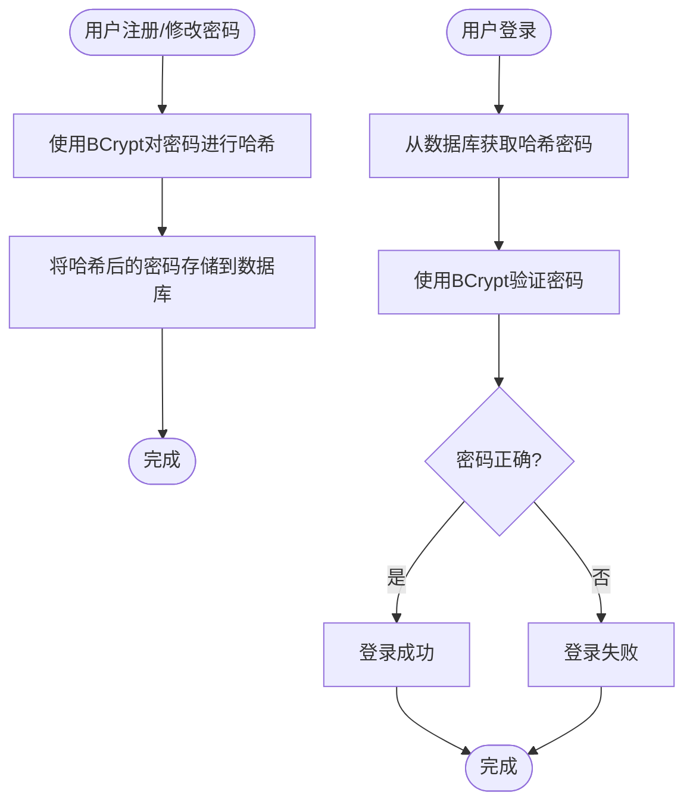
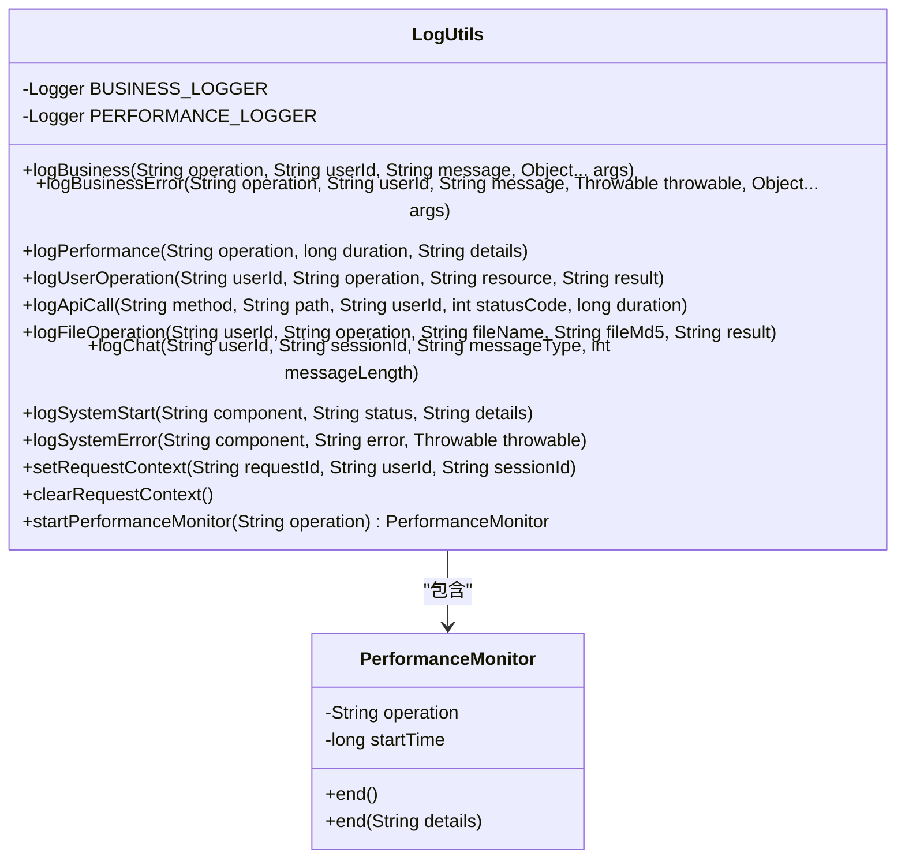
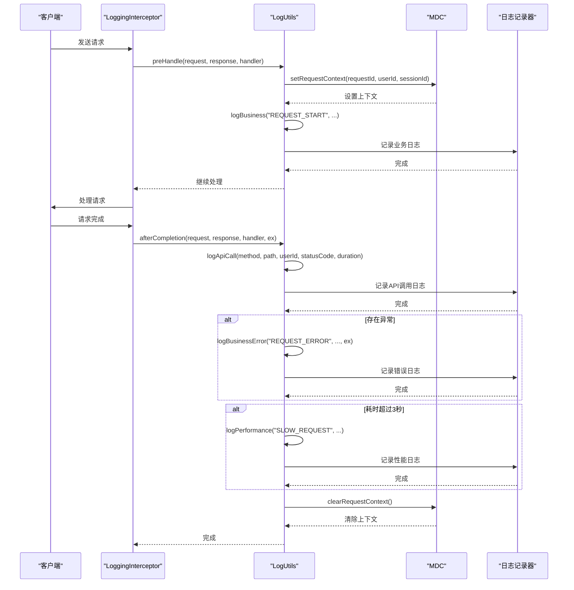
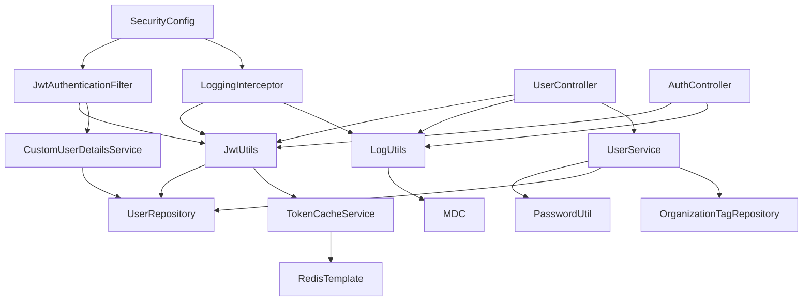

# 安全工具

<cite>
**本文档引用的文件**   
- [JwtUtils.java](file://src/main/java/com/yizhaoqi/smartpai/utils/JwtUtils.java)
- [PasswordUtil.java](file://src/main/java/com/yizhaoqi/smartpai/utils/PasswordUtil.java)
- [LogUtils.java](file://src/main/java/com/yizhaoqi/smartpai/utils/LogUtils.java)
- [LoggingInterceptor.java](file://src/main/java/com/yizhaoqi/smartpai/config/LoggingInterceptor.java)
- [JwtAuthenticationFilter.java](file://src/main/java/com/yizhaoqi/smartpai/config/JwtAuthenticationFilter.java)
- [TokenCacheService.java](file://src/main/java/com/yizhaoqi/smartpai/service/TokenCacheService.java)
- [AuthController.java](file://src/main/java/com/yizhaoqi/smartpai/controller/AuthController.java)
- [UserController.java](file://src/main/java/com/yizhaoqi/smartpai/controller/UserController.java)
- [User.java](file://src/main/java/com/yizhaoqi/smartpai/model/User.java)
- [UserRepository.java](file://src/main/java/com/yizhaoqi/smartpai/repository/UserRepository.java)
- [CustomUserDetailsService.java](file://src/main/java/com/yizhaoqi/smartpai/service/CustomUserDetailsService.java)
- [SecurityConfig.java](file://src/main/java/com/yizhaoqi/smartpai/config/SecurityConfig.java)
- [WebConfig.java](file://src/main/java/com/yizhaoqi/smartpai/config/WebConfig.java)
- [RedisConfig.java](file://src/main/java/com/yizhaoqi/smartpai/config/RedisConfig.java)
- [application.yml](file://src/main/resources/application.yml)
- [GenerateJwtKey.java](file://src/main/java/com/yizhaoqi/smartpai/utils/GenerateJwtKey.java)
- [UserService.java](file://src/main/java/com/yizhaoqi/smartpai/service/UserService.java)
</cite>

## 目录
1. [简介](#简介)
2. [项目结构](#项目结构)
3. [核心组件](#核心组件)
4. [架构概览](#架构概览)
5. [详细组件分析](#详细组件分析)
6. [依赖分析](#依赖分析)
7. [性能考虑](#性能考虑)
8. [故障排除指南](#故障排除指南)
9. [结论](#结论)

## 简介
本文档系统化地介绍了PaiSmart项目中的安全工具组件及其在整体安全架构中的支撑作用。重点说明了`JwtUtils`提供的JWT编码、解码、签名验证和令牌刷新功能的实现原理与使用方式，包括密钥管理、算法选择和时间戳校验机制。详细描述了`PasswordUtil`中采用的BCrypt密码哈希算法实现，强调盐值生成、迭代次数配置和防暴力破解设计。分析了`LogUtils`和`LoggingInterceptor`在安全审计方面的应用，包括敏感信息脱敏、关键操作日志记录和异常追踪能力。提供了各工具类的API接口文档、调用示例和最佳实践建议，并说明了其与其他安全模块的集成方式。

## 项目结构
PaiSmart项目的结构清晰地分为前端和后端两个主要部分。后端代码位于`src/main/java/com/yizhaoqi/smartpai`目录下，遵循典型的Spring Boot项目结构，包含`config`、`controller`、`entity`、`repository`、`service`和`utils`等包。安全相关的工具类和配置主要集中在`utils`和`config`包中。前端代码位于`frontend`目录下，采用Vue.js框架构建。

**图示来源**
- [项目结构](file://项目结构)

**章节来源**
- [项目结构](file://项目结构)

## 核心组件
PaiSmart的安全架构由三个核心工具类构成：`JwtUtils`负责身份认证和会话管理，`PasswordUtil`负责用户密码的安全存储，`LogUtils`负责安全审计和操作追踪。这些组件通过`JwtAuthenticationFilter`和`LoggingInterceptor`等过滤器与Spring Security框架深度集成，形成了一个完整的安全防护体系。

**章节来源**
- [JwtUtils.java](file://src/main/java/com/yizhaoqi/smartpai/utils/JwtUtils.java)
- [PasswordUtil.java](file://src/main/java/com/yizhaoqi/smartpai/utils/PasswordUtil.java)
- [LogUtils.java](file://src/main/java/com/yizhaoqi/smartpai/utils/LogUtils.java)

## 架构概览
PaiSmart的安全架构采用分层设计，从下到上依次为：数据安全层（密码哈希）、认证层（JWT）、审计层（日志记录）和配置层（Spring Security）。`PasswordUtil`确保用户密码在数据库中的安全存储；`JwtUtils`生成和验证JWT令牌，实现无状态的身份认证；`LogUtils`记录所有关键操作，提供审计追踪能力；`JwtAuthenticationFilter`和`LoggingInterceptor`作为过滤器拦截请求，执行认证和日志记录。

**图示来源**
- [JwtUtils.java](file://src/main/java/com/yizhaoqi/smartpai/utils/JwtUtils.java)
- [PasswordUtil.java](file://src/main/java/com/yizhaoqi/smartpai/utils/PasswordUtil.java)
- [LogUtils.java](file://src/main/java/com/yizhaoqi/smartpai/utils/LogUtils.java)
- [SecurityConfig.java](file://src/main/java/com/yizhaoqi/smartpai/config/SecurityConfig.java)
- [JwtAuthenticationFilter.java](file://src/main/java/com/yizhaoqi/smartpai/config/JwtAuthenticationFilter.java)
- [LoggingInterceptor.java](file://src/main/java/com/yizhaoqi/smartpai/config/LoggingInterceptor.java)
- [TokenCacheService.java](file://src/main/java/com/yizhaoqi/smartpai/service/TokenCacheService.java)

## 详细组件分析
### JwtUtils分析
`JwtUtils`是PaiSmart项目中负责JWT令牌生成、验证和刷新的核心工具类。它不仅实现了标准的JWT功能，还通过与Redis的集成，提供了更高级的令牌状态管理能力。

#### 类图

**图示来源**
- [JwtUtils.java](file://src/main/java/com/yizhaoqi/smartpai/utils/JwtUtils.java)
- [TokenCacheService.java](file://src/main/java/com/yizhaoqi/smartpai/service/TokenCacheService.java)
- [UserRepository.java](file://src/main/java/com/yizhaoqi/smartpai/repository/UserRepository.java)

#### JWT令牌生成与验证流程

**图示来源**
- [JwtUtils.java](file://src/main/java/com/yizhaoqi/smartpai/utils/JwtUtils.java)
- [UserController.java](file://src/main/java/com/yizhaoqi/smartpai/controller/UserController.java)
- [UserRepository.java](file://src/main/java/com/yizhaoqi/smartpai/repository/UserRepository.java)
- [TokenCacheService.java](file://src/main/java/com/yizhaoqi/smartpai/service/TokenCacheService.java)

#### 令牌刷新机制

**图示来源**
- [JwtUtils.java](file://src/main/java/com/yizhaoqi/smartpai/utils/JwtUtils.java)
- [JwtAuthenticationFilter.java](file://src/main/java/com/yizhaoqi/smartpai/config/JwtAuthenticationFilter.java)
- [TokenCacheService.java](file://src/main/java/com/yizhaoqi/smartpai/service/TokenCacheService.java)

**章节来源**
- [JwtUtils.java](file://src/main/java/com/yizhaoqi/smartpai/utils/JwtUtils.java)
- [JwtAuthenticationFilter.java](file://src/main/java/com/yizhaoqi/smartpai/config/JwtAuthenticationFilter.java)
- [TokenCacheService.java](file://src/main/java/com/yizhaoqi/smartpai/service/TokenCacheService.java)

### PasswordUtil分析
`PasswordUtil`是PaiSmart项目中负责用户密码安全存储的工具类。它封装了Spring Security的BCryptPasswordEncoder，提供了简单易用的密码加密和验证接口。

#### 类图

**图示来源**
- [PasswordUtil.java](file://src/main/java/com/yizhaoqi/smartpai/utils/PasswordUtil.java)

#### 密码处理流程

**图示来源**
- [PasswordUtil.java](file://src/main/java/com/yizhaoqi/smartpai/utils/PasswordUtil.java)
- [UserService.java](file://src/main/java/com/yizhaoqi/smartpai/service/UserService.java)

**章节来源**
- [PasswordUtil.java](file://src/main/java/com/yizhaoqi/smartpai/utils/PasswordUtil.java)
- [UserService.java](file://src/main/java/com/yizhaoqi/smartpai/service/UserService.java)

### LogUtils分析
`LogUtils`是PaiSmart项目中负责安全审计和操作追踪的工具类。它提供了多种日志记录方法，支持业务日志、性能日志、用户操作日志等不同类型的日志记录。

#### 类图

**图示来源**
- [LogUtils.java](file://src/main/java/com/yizhaoqi/smartpai/utils/LogUtils.java)

#### 日志记录流程

**图示来源**
- [LogUtils.java](file://src/main/java/com/yizhaoqi/smartpai/utils/LogUtils.java)
- [LoggingInterceptor.java](file://src/main/java/com/yizhaoqi/smartpai/config/LoggingInterceptor.java)

**章节来源**
- [LogUtils.java](file://src/main/java/com/yizhaoqi/smartpai/utils/LogUtils.java)
- [LoggingInterceptor.java](file://src/main/java/com/yizhaoqi/smartpai/config/LoggingInterceptor.java)

## 依赖分析
PaiSmart的安全工具组件之间存在紧密的依赖关系。`JwtUtils`依赖于`UserRepository`获取用户信息，依赖于`TokenCacheService`进行令牌状态管理。`TokenCacheService`依赖于Spring Data Redis进行数据持久化。`LogUtils`被`LoggingInterceptor`和各个控制器广泛使用。`JwtAuthenticationFilter`依赖于`JwtUtils`进行令牌验证，同时被`SecurityConfig`配置到Spring Security过滤器链中。

**图示来源**
- [JwtUtils.java](file://src/main/java/com/yizhaoqi/smartpai/utils/JwtUtils.java)
- [TokenCacheService.java](file://src/main/java/com/yizhaoqi/smartpai/service/TokenCacheService.java)
- [LogUtils.java](file://src/main/java/com/yizhaoqi/smartpai/utils/LogUtils.java)
- [LoggingInterceptor.java](file://src/main/java/com/yizhaoqi/smartpai/config/LoggingInterceptor.java)
- [JwtAuthenticationFilter.java](file://src/main/java/com/yizhaoqi/smartpai/config/JwtAuthenticationFilter.java)
- [SecurityConfig.java](file://src/main/java/com/yizhaoqi/smartpai/config/SecurityConfig.java)
- [UserController.java](file://src/main/java/com/yizhaoqi/smartpai/controller/UserController.java)
- [AuthController.java](file://src/main/java/com/yizhaoqi/smartpai/controller/AuthController.java)
- [UserService.java](file://src/main/java/com/yizhaoqi/smartpai/service/UserService.java)
- [CustomUserDetailsService.java](file://src/main/java/com/yizhaoqi/smartpai/service/CustomUserDetailsService.java)
- [UserRepository.java](file://src/main/java/com/yizhaoqi/smartpai/repository/UserRepository.java)
- [RedisConfig.java](file://src/main/java/com/yizhaoqi/smartpai/config/RedisConfig.java)

**章节来源**
- [JwtUtils.java](file://src/main/java/com/yizhaoqi/smartpai/utils/JwtUtils.java)
- [TokenCacheService.java](file://src/main/java/com/yizhaoqi/smartpai/service/TokenCacheService.java)
- [LogUtils.java](file://src/main/java/com/yizhaoqi/smartpai/utils/LogUtils.java)
- [LoggingInterceptor.java](file://src/main/java/com/yizhaoqi/smartpai/config/LoggingInterceptor.java)
- [JwtAuthenticationFilter.java](file://src/main/java/com/yizhaoqi/smartpai/config/JwtAuthenticationFilter.java)
- [SecurityConfig.java](file://src/main/java/com/yizhaoqi/smartpai/config/SecurityConfig.java)
- [UserController.java](file://src/main/java/com/yizhaoqi/smartpai/controller/UserController.java)
- [AuthController.java](file://src/main/java/com/yizhaoqi/smartpai/controller/AuthController.java)
- [UserService.java](file://src/main/java/com/yizhaoqi/smartpai/service/UserService.java)
- [CustomUserDetailsService.java](file://src/main/java/com/yizhaoqi/smartpai/service/CustomUserDetailsService.java)
- [UserRepository.java](file://src/main/java/com/yizhaoqi/smartpai/repository/UserRepository.java)
- [RedisConfig.java](file://src/main/java/com/yizhaoqi/smartpai/config/RedisConfig.java)

## 性能考虑
PaiSmart的安全工具在设计时充分考虑了性能因素。`JwtUtils`通过将令牌信息缓存到Redis中，避免了每次验证令牌时都需要解析JWT的开销。`TokenCacheService`使用Redis的Set数据结构来管理用户的多个令牌，提高了批量操作的效率。`LogUtils`使用MDC（Mapped Diagnostic Context）来传递请求上下文信息，避免了在方法调用链中传递大量参数的开销。`LoggingInterceptor`只对API请求进行详细的日志记录，避免了对静态资源请求的性能影响。

## 故障排除指南
### JWT令牌相关问题
- **问题：令牌无法验证**
  - **可能原因**：密钥不匹配、令牌已过期、令牌被加入黑名单
  - **解决方案**：检查`application.yml`中的`jwt.secret-key`配置，确认密钥正确；检查令牌是否已过期；检查Redis中是否存在该令牌的黑名单记录

- **问题：令牌刷新失败**
  - **可能原因**：refreshToken无效、refreshToken已过期
  - **解决方案**：确认refreshToken是否正确传递；检查refreshToken的有效期（默认7天）

- **问题：无法获取用户信息**
  - **可能原因**：用户不存在、用户信息未正确缓存
  - **解决方案**：检查数据库中是否存在该用户；检查`JwtUtils`生成令牌时是否正确获取了用户信息

### 密码相关问题
- **问题：用户无法登录**
  - **可能原因**：密码错误、密码哈希算法不匹配
  - **解决方案**：确认用户输入的密码正确；确认`PasswordUtil`使用的BCrypt算法与注册时一致

### 日志相关问题
- **问题：日志未按预期记录**
  - **可能原因**：`LoggingInterceptor`未正确注册、日志级别配置不当
  - **解决方案**：检查`WebConfig`中是否正确注册了`LoggingInterceptor`；检查`application.yml`中的日志级别配置

**章节来源**
- [JwtUtils.java](file://src/main/java/com/yizhaoqi/smartpai/utils/JwtUtils.java)
- [PasswordUtil.java](file://src/main/java/com/yizhaoqi/smartpai/utils/PasswordUtil.java)
- [LogUtils.java](file://src/main/java/com/yizhaoqi/smartpai/utils/LogUtils.java)
- [LoggingInterceptor.java](file://src/main/java/com/yizhaoqi/smartpai/config/LoggingInterceptor.java)
- [WebConfig.java](file://src/main/java/com/yizhaoqi/smartpai/config/WebConfig.java)
- [application.yml](file://src/main/resources/application.yml)

## 结论
PaiSmart项目的安全工具组件设计精良，功能完备。`JwtUtils`通过与Redis的集成，实现了高效的令牌状态管理，支持主动刷新和宽限期刷新机制，提升了用户体验。`PasswordUtil`采用业界标准的BCrypt算法，确保了用户密码的安全存储。`LogUtils`提供了全面的日志记录能力，支持业务审计和性能监控。这些组件通过Spring Security框架紧密集成，形成了一个完整的安全防护体系，为PaiSmart项目的稳定运行提供了有力保障。