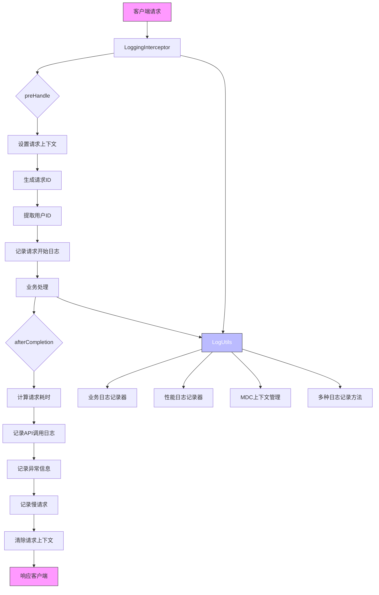
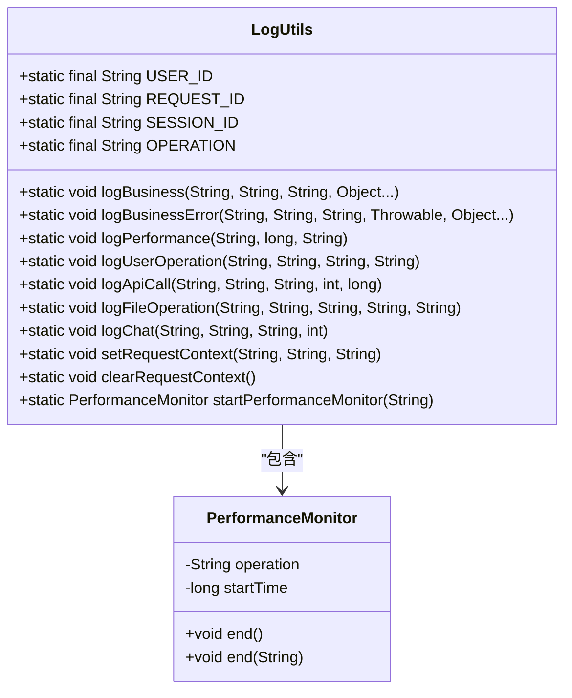
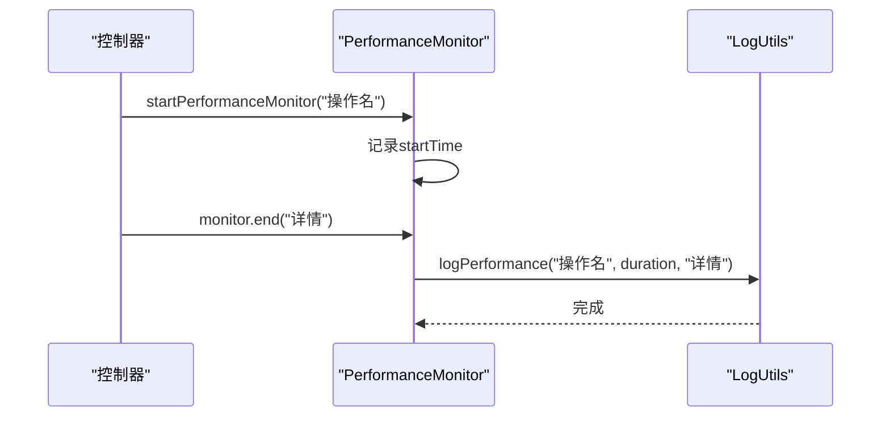
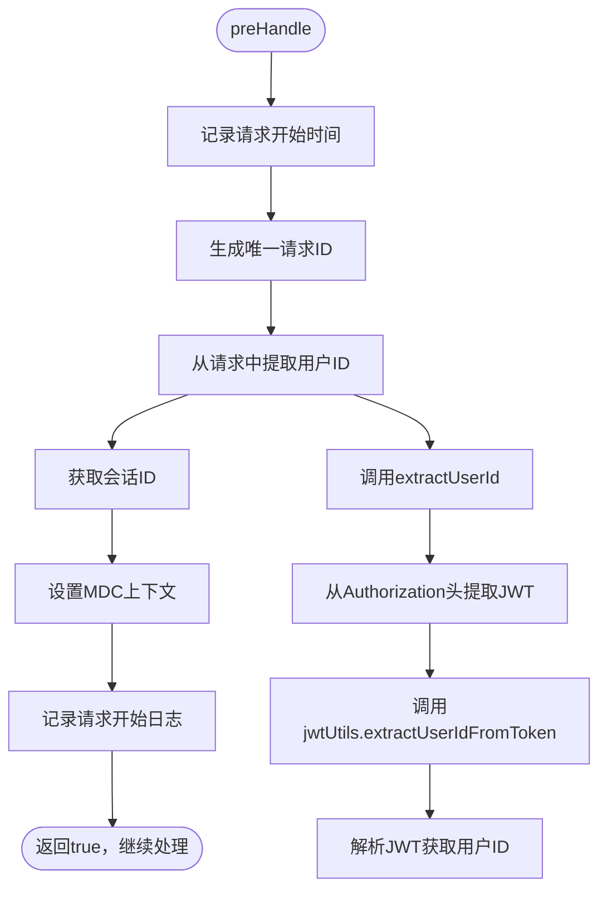
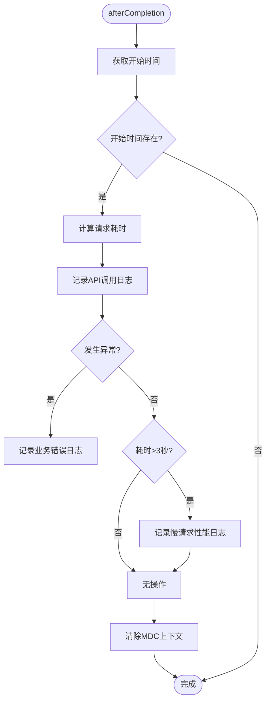
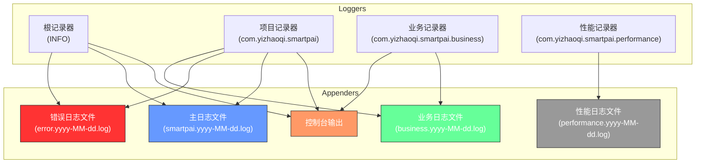
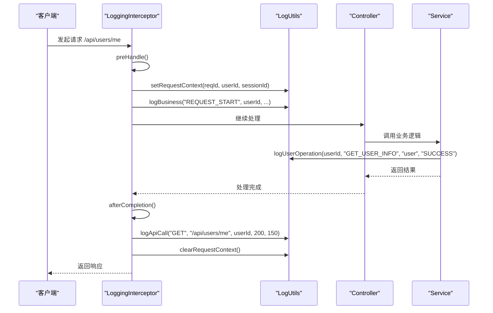

# 安全日志

<cite>
**本文档中引用的文件**   
- [LogUtils.java](file://src/main/java/com/yizhaoqi/smartpai/utils/LogUtils.java)
- [LoggingInterceptor.java](file://src/main/java/com/yizhaoqi/smartpai/config/LoggingInterceptor.java)
- [logback-spring.xml](file://src/main/resources/logback-spring.xml)
- [WebConfig.java](file://src/main/java/com/yizhaoqi/smartpai/config/WebConfig.java)
- [JwtUtils.java](file://src/main/java/com/yizhaoqi/smartpai/utils/JwtUtils.java)
- [ChatController.java](file://src/main/java/com/yizhaoqi/smartpai/controller/ChatController.java)
- [AdminController.java](file://src/main/java/com/yizhaoqi/smartpai/controller/AdminController.java)
- [UserController.java](file://src/main/java/com/yizhaoqi/smartpai/controller/UserController.java)
</cite>

## 目录
1. [引言](#引言)
2. [核心组件分析](#核心组件分析)
3. [日志工具类LogUtils详解](#日志工具类logutils详解)
4. [日志拦截器LoggingInterceptor分析](#日志拦截器logginginterceptor分析)
5. [日志配置文件分析](#日志配置文件分析)
6. [日志体系协同工作流程](#日志体系协同工作流程)
7. [日志审计应用场景](#日志审计应用场景)
8. [性能影响评估与优化建议](#性能影响评估与优化建议)
9. [结论](#结论)

## 引言

本文档系统阐述了PaiSmart项目中基于LogUtils和LoggingInterceptor构建的安全日志体系。该体系旨在提供全面、结构化且安全的日志记录功能，以支持系统监控、安全审计、故障排查和合规性要求。通过分析LogUtils提供的结构化日志记录、敏感信息脱敏和上下文追踪功能，以及LoggingInterceptor如何自动拦截请求并记录关键操作日志，本文将深入解析该日志体系的实现原理和最佳实践。

## 核心组件分析

安全日志体系的核心由两个关键组件构成：`LogUtils`（日志工具类）和`LoggingInterceptor`（日志拦截器）。它们协同工作，实现了从日志生成到记录的完整流程。



**图示来源**
- [LoggingInterceptor.java](file://src/main/java/com/yizhaoqi/smartpai/config/LoggingInterceptor.java)
- [LogUtils.java](file://src/main/java/com/yizhaoqi/smartpai/utils/LogUtils.java)

**本节来源**
- [LoggingInterceptor.java](file://src/main/java/com/yizhaoqi/smartpai/config/LoggingInterceptor.java)
- [LogUtils.java](file://src/main/java/com/yizhaoqi/smartpai/utils/LogUtils.java)

## 日志工具类LogUtils详解

`LogUtils`是整个日志体系的核心工具类，它封装了所有日志记录的逻辑，提供了统一、规范的日志输出接口。

### 结构化日志记录

`LogUtils`通过提供一系列专用的静态方法，实现了高度结构化的日志记录。这些方法将日志信息分解为明确的字段，便于后续的解析、搜索和分析。



**图示来源**
- [LogUtils.java](file://src/main/java/com/yizhaoqi/smartpai/utils/LogUtils.java)

**本节来源**
- [LogUtils.java](file://src/main/java/com/yizhaoqi/smartpai/utils/LogUtils.java)

#### 主要日志方法

1.  **`logBusiness`**: 记录通用的业务日志，包含操作类型、用户ID和自定义消息。
    ```java
    public static void logBusiness(String operation, String userId, String message, Object... args) {
        try {
            MDC.put(OPERATION, operation);
            MDC.put(USER_ID, userId);
            BUSINESS_LOGGER.info("[{}] [用户:{}] {}", operation, userId, formatMessage(message, args));
        } finally {
            MDC.clear();
        }
    }
    ```

2.  **`logBusinessError`**: 专门用于记录业务错误日志，会包含异常堆栈信息。
    ```java
    public static void logBusinessError(String operation, String userId, String message, Throwable throwable, Object... args) {
        try {
            MDC.put(OPERATION, operation);
            MDC.put(USER_ID, userId);
            BUSINESS_LOGGER.error("[{}] [用户:{}] {}", operation, userId, formatMessage(message, args), throwable);
        } finally {
            MDC.clear();
        }
    }
    ```

3.  **`logApiCall`**: 记录API调用的详细信息，包括HTTP方法、路径、用户ID、状态码和耗时。
    ```java
    public static void logApiCall(String method, String path, String userId, int statusCode, long duration) {
        try {
            MDC.put(USER_ID, userId);
            MDC.put(OPERATION, "API_CALL");
            BUSINESS_LOGGER.info("[API] [{}] {} [用户:{}] [状态:{}] [耗时:{}ms]", method, path, userId, statusCode, duration);
        } finally {
            MDC.clear();
        }
    }
    ```

4.  **`logUserOperation`**: 记录用户的特定操作，如登录、文件上传等，包含操作、资源和结果。
    ```java
    public static void logUserOperation(String userId, String operation, String resource, String result) {
        try {
            MDC.put(USER_ID, userId);
            MDC.put(OPERATION, operation);
            BUSINESS_LOGGER.info("[用户操作] [用户:{}] [操作:{}] [资源:{}] [结果:{}]", userId, operation, resource, result);
        } finally {
            MDC.clear();
        }
    }
    ```

### 敏感信息脱敏与上下文追踪

`LogUtils`利用SLF4J的MDC（Mapped Diagnostic Context）机制来实现上下文追踪和信息关联。

-   **MDC键名常量**: 定义了`USER_ID`, `REQUEST_ID`, `SESSION_ID`, `OPERATION`等常量，确保所有日志记录使用统一的键名。
-   **上下文管理**: 通过`setRequestContext`和`clearRequestContext`方法，在请求开始时设置上下文，在请求结束时清除上下文，防止信息污染。
-   **自动脱敏**: 虽然`LogUtils`本身不直接处理密码、令牌等敏感信息的脱敏，但它通过结构化日志设计，引导开发者在调用日志方法时传入已脱敏的数据。例如，在记录登录日志时，不应记录明文密码。

### 性能监控功能

`LogUtils`内置了一个`PerformanceMonitor`内部类，提供了便捷的性能监控功能。



**图示来源**
- [LogUtils.java](file://src/main/java/com/yizhaoqi/smartpai/utils/LogUtils.java)

**本节来源**
- [LogUtils.java](file://src/main/java/com/yizhaoqi/smartpai/utils/LogUtils.java)

使用方式如下：
```java
LogUtils.PerformanceMonitor monitor = LogUtils.startPerformanceMonitor("USER_LOGIN");
try {
    // 执行耗时操作...
} finally {
    monitor.end("登录成功"); // 自动计算耗时并记录日志
}
```

## 日志拦截器LoggingInterceptor分析

`LoggingInterceptor`是一个Spring MVC的拦截器，它在请求处理的各个阶段自动插入日志记录逻辑，实现了对所有API请求的无侵入式监控。

### 拦截器注册与配置

该拦截器在`WebConfig`类中被注册，并配置了拦截路径和排除路径。

```java
@Configuration
public class WebConfig implements WebMvcConfigurer {
    @Autowired
    private LoggingInterceptor loggingInterceptor;

    @Override
    public void addInterceptors(InterceptorRegistry registry) {
        registry.addInterceptor(loggingInterceptor)
                .addPathPatterns("/**") // 拦截所有路径
                .excludePathPatterns("/static/**", "/css/**", "/js/**", "/images/**", "/*.ico", "/*.html"); // 排除静态资源
    }
}
```

**本节来源**
- [WebConfig.java](file://src/main/java/com/yizhaoqi/smartpai/config/WebConfig.java)

### preHandle方法分析

`preHandle`方法在请求处理之前执行，主要负责初始化日志上下文。



**图示来源**
- [LoggingInterceptor.java](file://src/main/java/com/yizhaoqi/smartpai/config/LoggingInterceptor.java)
- [JwtUtils.java](file://src/main/java/com/yizhaoqi/smartpai/utils/JwtUtils.java)

**本节来源**
- [LoggingInterceptor.java](file://src/main/java/com/yizhaoqi/smartpai/config/LoggingInterceptor.java)

关键步骤：
1.  **记录开始时间**: 将当前时间戳存入`HttpServletRequest`的属性中，用于后续计算耗时。
2.  **生成请求ID**: 使用`UUID`生成一个短的唯一ID，用于关联同一请求的所有日志。
3.  **提取用户ID**: 调用`extractUserId`方法，从`Authorization`请求头中解析JWT令牌，并利用`JwtUtils`工具类提取用户ID。如果解析失败或未提供令牌，则标记为`anonymous`。
4.  **设置上下文**: 调用`LogUtils.setRequestContext`，将请求ID、用户ID和会话ID存入MDC。
5.  **记录开始日志**: 对于API请求，记录一条`REQUEST_START`日志。

### afterCompletion方法分析

`afterCompletion`方法在请求处理完成后（无论成功或失败）执行，负责记录最终的调用结果和性能数据。



**图示来源**
- [LoggingInterceptor.java](file://src/main/java/com/yizhaoqi/smartpai/config/LoggingInterceptor.java)

**本节来源**
- [LoggingInterceptor.java](file://src/main/java/com/yizhaoqi/smartpai/config/LoggingInterceptor.java)

关键步骤：
1.  **计算耗时**: 从`HttpServletRequest`中取出`preHandle`阶段记录的开始时间，计算出整个请求的处理耗时。
2.  **记录API调用日志**: 调用`LogUtils.logApiCall`，记录HTTP方法、路径、用户ID、响应状态码和耗时。
3.  **记录异常信息**: 如果`Exception ex`参数不为`null`，说明处理过程中发生了异常，调用`LogUtils.logBusinessError`记录错误日志。
4.  **记录慢请求**: 如果请求耗时超过3秒，调用`LogUtils.logPerformance`记录一条慢请求日志，便于性能监控。
5.  **清除上下文**: 在`finally`块中调用`LogUtils.clearRequestContext()`，确保MDC中的上下文被清除，避免影响后续请求。

## 日志配置文件分析

`logback-spring.xml`文件定义了日志的输出格式、级别控制和存储策略。

### 日志级别控制

文件通过`<logger>`和`<springProfile>`标签实现了精细化的日志级别控制。

-   **项目包日志**: `com.yizhaoqi.smartpai`包下的日志级别为`INFO`。
-   **开发环境**: 通过`<springProfile name="dev">`，将项目包和Spring Web、Security的日志级别提升为`DEBUG`，便于开发调试。
-   **生产环境**: 通过`<springProfile name="prod">`，将项目包日志级别设为`INFO`，并将根日志级别设为`WARN`，减少不必要的日志输出。
-   **第三方库**: 对`org.springframework`、`org.hibernate`、`io.minio`等第三方库的日志级别进行了降级，避免其日志污染主日志文件。

**本节来源**
- [logback-spring.xml](file://src/main/resources/logback-spring.xml)

### 输出格式与存储策略

文件定义了多种Appender，将不同类型的日志输出到不同的文件中。



**图示来源**
- [logback-spring.xml](file://src/main/resources/logback-spring.xml)

**本节来源**
- [logback-spring.xml](file://src/main/resources/logback-spring.xml)

-   **控制台输出 (CONSOLE)**: 使用`PatternLayoutEncoder`定义了包含日期、线程、日志级别、记录器名称和消息的格式。
-   **主日志文件 (FILE)**: 按天滚动，最大保留30天，单个文件最大100MB。
-   **错误日志文件 (ERROR_FILE)**: 通过`LevelFilter`只接收`ERROR`级别的日志，便于快速定位错误。
-   **业务日志文件 (BUSINESS_FILE)**: 专门存储`LogUtils`记录的业务日志。
-   **性能日志文件 (PERFORMANCE_FILE)**: 专门存储性能相关的日志，保留7天。

## 日志体系协同工作流程

以下是一个完整的API请求处理流程，展示了`LogUtils`和`LoggingInterceptor`如何协同工作。



**图示来源**
- [LoggingInterceptor.java](file://src/main/java/com/yizhaoqi/smartpai/config/LoggingInterceptor.java)
- [LogUtils.java](file://src/main/java/com/yizhaoqi/smartpai/utils/LogUtils.java)
- [UserController.java](file://src/main/java/com/yizhaoqi/smartpai/controller/UserController.java)

**本节来源**
- [LoggingInterceptor.java](file://src/main/java/com/yizhaoqi/smartpai/config/LoggingInterceptor.java)
- [LogUtils.java](file://src/main/java/com/yizhaoqi/smartpai/utils/LogUtils.java)

## 日志审计应用场景

### 异常追踪

当系统出现异常时，可以通过`error.yyyy-MM-dd.log`文件快速定位错误。结合`REQUEST_ID`，可以在`business.yyyy-MM-dd.log`中找到该请求的完整处理链路，包括请求开始、中间操作和最终错误，极大地简化了故障排查。

### 安全事件回溯

例如，管理员在`AdminController`中执行删除知识库文档的操作：
```java
LogUtils.logUserOperation(adminUsername, "ADMIN_DELETE_KNOWLEDGE", documentId, "SUCCESS");
```
这条日志记录了操作者、操作类型、操作资源和结果。如果发生误删，审计人员可以精确回溯到具体时间、具体操作人和具体文档，明确责任。

### 合规性检查

系统记录了所有关键操作（登录、文件上传、权限变更等）的日志，并且日志中包含用户ID、时间戳和操作详情。这满足了GDPR、等保等法规对操作可追溯性的要求。

## 性能影响评估与优化建议

### 性能影响评估

该日志体系的设计对性能的影响是可控的：
1.  **异步写入**: Logback默认使用异步Appender，日志记录不会阻塞主线程。
2.  **MDC开销**: MDC基于`ThreadLocal`，读写速度很快，开销极小。
3.  **字符串拼接**: `String.format`在`logBusiness`等方法中使用，但仅在日志级别开启时执行。

### 优化建议

1.  **启用异步日志**: 在`logback-spring.xml`中配置`AsyncAppender`，进一步降低日志I/O对主线程的影响。
2.  **精细化日志级别**: 在生产环境中，避免使用`DEBUG`级别，减少日志量。
3.  **定期归档与清理**: 确保`MaxHistory`配置合理，并定期将旧日志归档到对象存储，防止磁盘空间耗尽。
4.  **集中式日志管理**: 考虑引入ELK（Elasticsearch, Logstash, Kibana）或类似系统，实现日志的集中收集、存储和可视化分析。

## 结论

PaiSmart项目通过`LogUtils`和`LoggingInterceptor`的协同，构建了一个功能完善、结构清晰的安全日志体系。该体系实现了结构化日志记录、自动化的请求监控、敏感信息保护和精细化的日志管理，为系统的稳定性、安全性和可维护性提供了强有力的保障。通过合理的配置和优化，该体系能够在满足审计和监控需求的同时，将性能开销控制在可接受范围内。