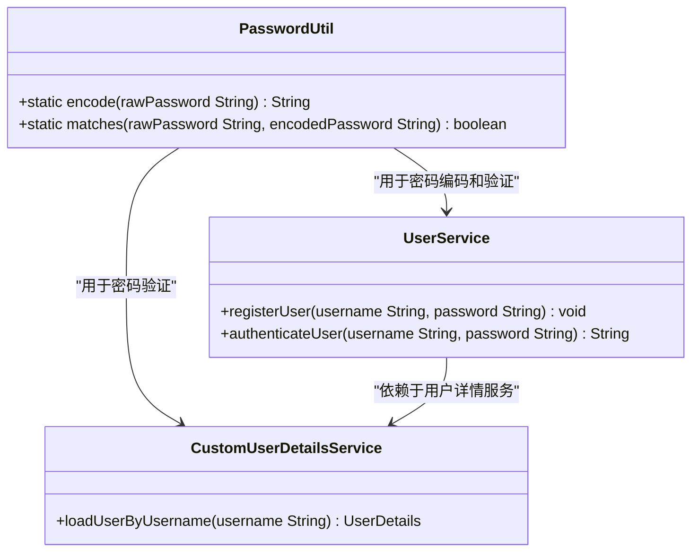
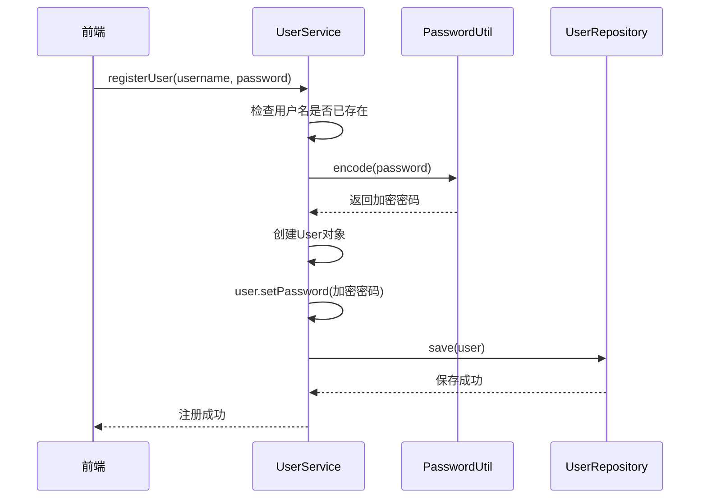
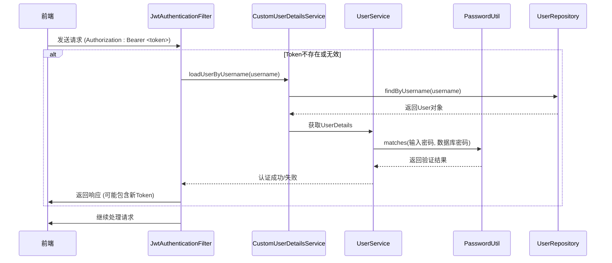

# 密码安全

<cite>
**本文档引用的文件**   
- [PasswordUtil.java](file://src/main/java/com/yizhaoqi/smartpai/utils/PasswordUtil.java)
- [UserService.java](file://src/main/java/com/yizhaoqi/smartpai/service/UserService.java)
- [CustomUserDetailsService.java](file://src/main/java/com/yizhaoqi/smartpai/service/CustomUserDetailsService.java)
- [User.java](file://src/main/java/com/yizhaoqi/smartpai/model/User.java)
- [SecurityConfig.java](file://src/main/java/com/yizhaoqi/smartpai/config/SecurityConfig.java)
- [JwtAuthenticationFilter.java](file://src/main/java/com/yizhaoqi/smartpai/config/JwtAuthenticationFilter.java)
- [JwtUtils.java](file://src/main/java/com/yizhaoqi/smartpai/utils/JwtUtils.java)
- [UserServiceTest.java](file://src/test/java/com/yizhaoqi/smartpai/service/UserServiceTest.java)
</cite>

## 目录
1. [引言](#引言)
2. [核心密码安全机制](#核心密码安全机制)
3. [BCrypt哈希算法原理与实现](#bcrypt哈希算法原理与实现)
4. [密码安全在用户认证流程中的应用](#密码安全在用户认证流程中的应用)
5. [安全配置与最佳实践](#安全配置与最佳实践)
6. [测试与验证](#测试与验证)
7. [结论](#结论)

## 引言
本文档全面介绍了PaiSmart项目中实现的密码安全机制。系统采用Spring Security框架，通过BCrypt哈希算法对用户密码进行安全存储，有效抵御暴力破解和彩虹表攻击。文档详细阐述了`PasswordUtil`工具类的核心功能、`UserService`中的业务逻辑集成、`CustomUserDetailsService`在认证流程中的作用，以及相关的安全配置。通过分析代码实现和数据流，为开发者提供了关于密码安全的最佳实践和配置建议。

## 核心密码安全机制

### PasswordUtil工具类分析
`PasswordUtil`类是整个系统密码安全的核心，它封装了密码的编码和验证功能，为上层业务逻辑提供了简单、安全的接口。



**图源**
- [PasswordUtil.java](file://src/main/java/com/yizhaoqi/smartpai/utils/PasswordUtil.java)
- [UserService.java](file://src/main/java/com/yizhaoqi/smartpai/service/UserService.java)
- [CustomUserDetailsService.java](file://src/main/java/com/yizhaoqi/smartpai/service/CustomUserDetailsService.java)

**核心功能接口**

- **`encode(String rawPassword)`**: 对明文密码进行哈希编码。
- **`matches(String rawPassword, String encodedPassword)`**: 验证明文密码与已编码密码是否匹配。

**实现细节**
```java
public class PasswordUtil {
    // 使用Spring Security的BCryptPasswordEncoder
    private static final BCryptPasswordEncoder encoder = new BCryptPasswordEncoder();

    /**
     * 加密密码
     * @param rawPassword 明文密码
     * @return 加密后的密码
     */
    public static String encode(String rawPassword) {
        return encoder.encode(rawPassword);
    }

    /**
     * 验证密码是否匹配
     * @param rawPassword     明文密码
     * @param encodedPassword 加密后的密码
     * @return 是否匹配
     */
    public static boolean matches(String rawPassword, String encodedPassword) {
        return encoder.matches(rawPassword, encodedPassword);
    }
}
```

**分析**
- **算法选择**: 使用了`BCryptPasswordEncoder`，这是目前推荐的密码哈希算法。
- **盐值机制**: BCrypt算法在内部自动生成并存储盐值（salt），无需开发者手动管理。盐值会与哈希结果一起编码在最终的字符串中。
- **迭代次数**: `BCryptPasswordEncoder`默认使用10轮迭代（log rounds = 10），这是一个在安全性和性能之间取得良好平衡的值。迭代次数越高，暴力破解所需时间越长。

**节源**
- [PasswordUtil.java](file://src/main/java/com/yizhaoqi/smartpai/utils/PasswordUtil.java#L1-L29)

## BCrypt哈希算法原理与实现

### BCrypt算法原理
BCrypt是一种基于Blowfish分组密码的自适应哈希函数，专为密码存储而设计。其核心优势在于：

1.  **自适应性 (Adaptive)**: 可以通过调整“工作因子”（Work Factor）来增加计算成本。随着硬件性能的提升，可以增加工作因子以保持破解难度。
2.  **内置盐值 (Built-in Salt)**: 每次哈希都会生成一个唯一的、加密安全的随机盐值，并将其与哈希结果一起存储。这使得彩虹表攻击完全失效。
3.  **抗GPU/ASIC攻击**: BCrypt的计算过程需要大量的内存访问，这使得使用GPU或专用硬件进行并行破解的成本极高。

### BCrypt哈希字符串结构
一个典型的BCrypt哈希字符串如下：
```
$2a$10$vI8aWBnW3fID.ZQ4/zo1G.q1lRps.9c8UOvj/6HvFOfkxshF6WktC
```
- `$2a$`: 算法标识符。
- `10`: 工作因子（log rounds），表示2^10次迭代。
- `vI8aWBnW3fID.ZQ4/zo1G.`: 22个字符的Base64编码盐值。
- `q1lRps.9c8UOvj/6HvFOfkxshF6WktC`: 31个字符的Base64编码哈希值。

### 在PaiSmart中的实现
在PaiSmart项目中，BCrypt的实现完全由Spring Security的`BCryptPasswordEncoder`类处理。开发者只需调用`PasswordUtil`提供的静态方法，无需关心底层细节。

**节源**
- [PasswordUtil.java](file://src/main/java/com/yizhaoqi/smartpai/utils/PasswordUtil.java)

## 密码安全在用户认证流程中的应用

### 用户注册流程
当新用户注册时，系统会调用`UserService`的`registerUser`方法，该方法会使用`PasswordUtil`对密码进行编码。



**图源**
- [UserService.java](file://src/main/java/com/yizhaoqi/smartpai/service/UserService.java#L34-L62)
- [PasswordUtil.java](file://src/main/java/com/yizhaoqi/smartpai/utils/PasswordUtil.java)

**代码实现**
```java
@Service
public class UserService {
    @Autowired
    private UserRepository userRepository;

    public void registerUser(String username, String password) {
        // ... 检查用户名 ...
        User user = new User();
        user.setUsername(username);
        // 使用PasswordUtil对密码进行编码
        user.setPassword(PasswordUtil.encode(password));
        // ... 设置其他属性 ...
        userRepository.save(user);
    }
}
```

**节源**
- [UserService.java](file://src/main/java/com/yizhaoqi/smartpai/service/UserService.java#L34-L62)

### 用户登录认证流程
用户登录时，系统会验证其提供的密码是否与数据库中存储的哈希值匹配。这个过程由Spring Security的认证机制驱动。



**图源**
- [JwtAuthenticationFilter.java](file://src/main/java/com/yizhaoqi/smartpai/config/JwtAuthenticationFilter.java)
- [CustomUserDetailsService.java](file://src/main/java/com/yizhaoqi/smartpai/service/CustomUserDetailsService.java)
- [UserService.java](file://src/main/java/com/yizhaoqi/smartpai/service/UserService.java)
- [PasswordUtil.java](file://src/main/java/com/yizhaoqi/smartpai/utils/PasswordUtil.java)

#### 关键组件分析

**1. CustomUserDetailsService**
该服务实现了Spring Security的`UserDetailsService`接口，负责从数据库加载用户信息。

```java
@Service
public class CustomUserDetailsService implements UserDetailsService {
    @Autowired
    private UserRepository userRepository;

    @Override
    public UserDetails loadUserByUsername(String username) throws UsernameNotFoundException {
        User user = userRepository.findByUsername(username)
                .orElseThrow(() -> new UsernameNotFoundException("User not found"));
        // 将数据库中的用户信息转换为Spring Security的UserDetails对象
        // 注意：这里传入的是从数据库读取的、已经编码的密码
        return new org.springframework.security.core.userdetails.User(
                user.getUsername(),
                user.getPassword(), // 这是BCrypt哈希后的密码
                getAuthorities(user.getRole())
        );
    }
}
```
**节源**
- [CustomUserDetailsService.java](file://src/main/java/com/yizhaoqi/smartpai/service/CustomUserDetailsService.java#L19-L48)

**2. Spring Security认证流程**
当`JwtAuthenticationFilter`需要验证用户时，它会调用`AuthenticationManager`。`AuthenticationManager`会使用`DaoAuthenticationProvider`，后者会调用`CustomUserDetailsService`获取`UserDetails`。然后，`DaoAuthenticationProvider`会使用`PasswordEncoder`（即`BCryptPasswordEncoder`）来验证用户输入的密码与`UserDetails`中存储的密码是否匹配。这个验证过程最终会调用到`PasswordUtil.matches()`方法。

### 用户实体与密码存储
用户的密码最终存储在数据库的`users`表中。

```java
@Entity
@Table(name = "users")
public class User {
    // ... 其他字段 ...

    @Column(nullable = false)
    private String password; // 存储BCrypt哈希后的密码

    // ... getter和setter ...
}
```
**节源**
- [User.java](file://src/main/java/com/yizhaoqi/smartpai/model/User.java#L9-L42)

## 安全配置与最佳实践

### SecurityConfig分析
`SecurityConfig`类定义了应用的安全规则，明确了哪些接口需要认证。

```java
@Configuration
@EnableWebSecurity
public class SecurityConfig {
    @Bean
    public SecurityFilterChain securityFilterChain(HttpSecurity http) throws Exception {
        http.csrf(csrf -> csrf.disable())
            .authorizeHttpRequests(authorize -> authorize
                // 允许注册和登录接口匿名访问
                .requestMatchers("/api/v1/users/register", "/api/v1/users/login").permitAll()
                // 其他请求需要认证
                .anyRequest().authenticated()
            )
            .sessionManagement(session -> session
                .sessionCreationPolicy(SessionCreationPolicy.STATELESS))
            .addFilterBefore(jwtAuthenticationFilter, UsernamePasswordAuthenticationFilter.class);
        return http.build();
    }
}
```
**节源**
- [SecurityConfig.java](file://src/main/java/com/yizhaoqi/smartpai/config/SecurityConfig.java#L17-L87)

### 最佳实践与安全建议

1.  **算法参数调优**:
    *   **工作因子**: 当前使用默认的10轮。可以根据服务器性能和安全需求进行调整。例如，设置为12或13可以显著增加破解难度，但也会增加登录时的计算时间。可以通过`new BCryptPasswordEncoder(12)`来设置。

2.  **密码复杂度策略集成**:
    *   当前系统未强制密码复杂度。建议在`UserService.registerUser`和`UserService.authenticateUser`方法中添加密码强度校验，例如：
        *   最小长度（如8位）
        *   必须包含大小写字母、数字和特殊字符
        *   不能包含用户名或常见字典词汇
    *   可以使用如`zxcvbn`等库来评估密码强度。

3.  **潜在安全风险防范措施**:
    *   **防止暴力破解**: 在`authenticateUser`方法上添加失败次数限制和账户锁定机制。例如，连续5次登录失败后锁定账户15分钟。
    *   **安全的密钥管理**: `jwt.secret-key`应通过环境变量或密钥管理服务（KMS）注入，避免硬编码在代码或配置文件中。
    *   **定期轮换密钥**: 应制定JWT密钥的轮换计划，以降低密钥泄露带来的长期风险。
    *   **监控与日志**: 记录所有登录尝试（成功和失败），以便进行安全审计和异常行为检测。

## 测试与验证

### 单元测试分析
`UserServiceTest`类包含了对密码安全机制的测试用例，验证了注册和认证流程的正确性。

```java
class UserServiceTest {
    @Mock
    private UserRepository userRepository;

    @InjectMocks
    private UserService userService;

    @Test
    void testAuthenticateUser_Success() {
        // 准备测试数据
        String rawPassword = "password123";
        String encodedPassword = PasswordUtil.encode(rawPassword); // 使用真实的PasswordUtil

        User user = new User();
        user.setUsername("testuser");
        user.setPassword(encodedPassword); // 设置编码后的密码

        when(userRepository.findByUsername("testuser")).thenReturn(Optional.of(user));

        // 执行测试
        String username = userService.authenticateUser("testuser", rawPassword);

        // 断言结果
        assertEquals("testuser", username);
    }
}
```
**节源**
- [UserServiceTest.java](file://src/test/java/com/yizhaoqi/smartpai/service/UserServiceTest.java#L50-L89)

**分析**
- 该测试用例直接调用了`PasswordUtil.encode()`来生成测试用的哈希密码，确保了测试的真实性。
- 它验证了当用户输入正确的明文密码时，`authenticateUser`方法能够成功返回用户名，证明了`PasswordUtil.matches()`方法的正确性。

## 结论
PaiSmart项目通过`PasswordUtil`工具类，基于Spring Security的`BCryptPasswordEncoder`，实现了一套安全、可靠的密码存储和验证机制。该机制利用BCrypt算法的自适应性和内置盐值特性，有效抵御了常见的密码攻击。系统通过`UserService`、`CustomUserDetailsService`和Spring Security框架的紧密集成，将密码安全无缝地融入到用户注册和登录的整个流程中。为了进一步提升安全性，建议实施密码复杂度策略、登录失败限制，并加强密钥管理。