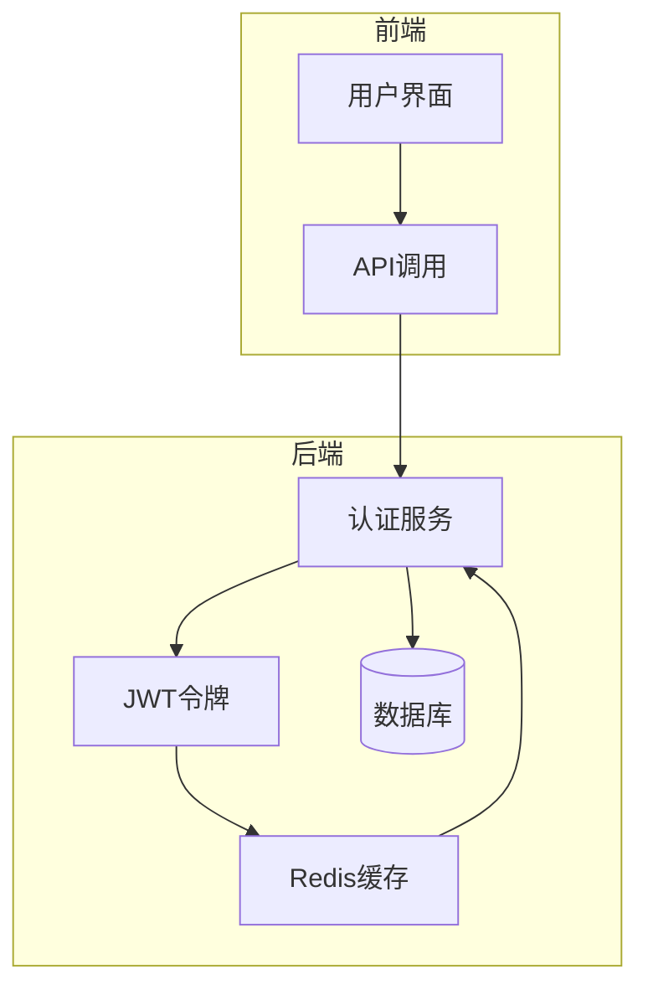
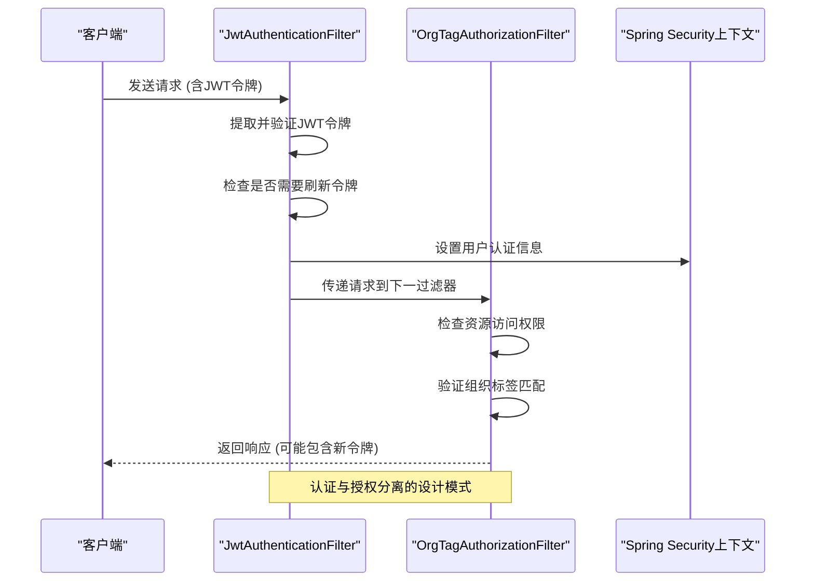
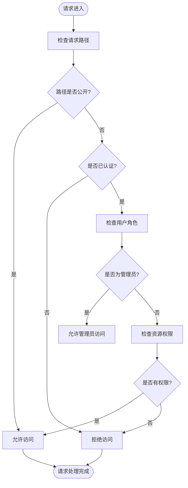
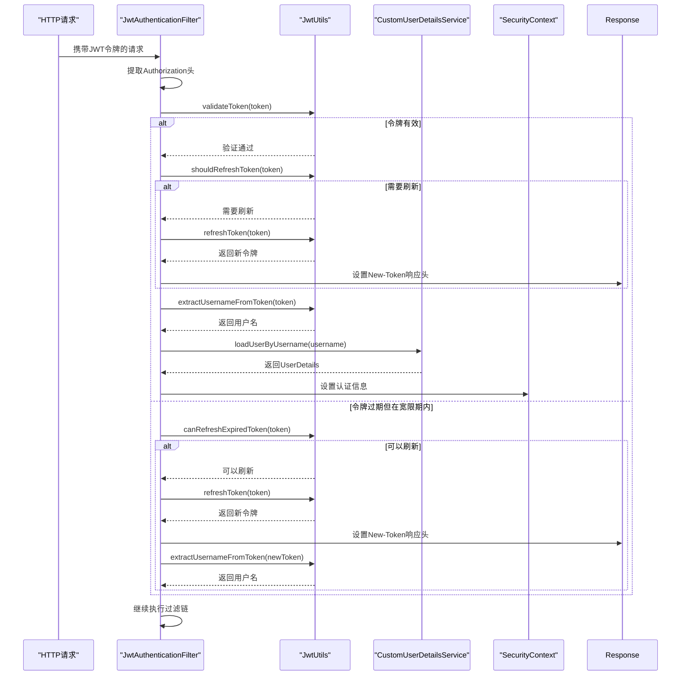
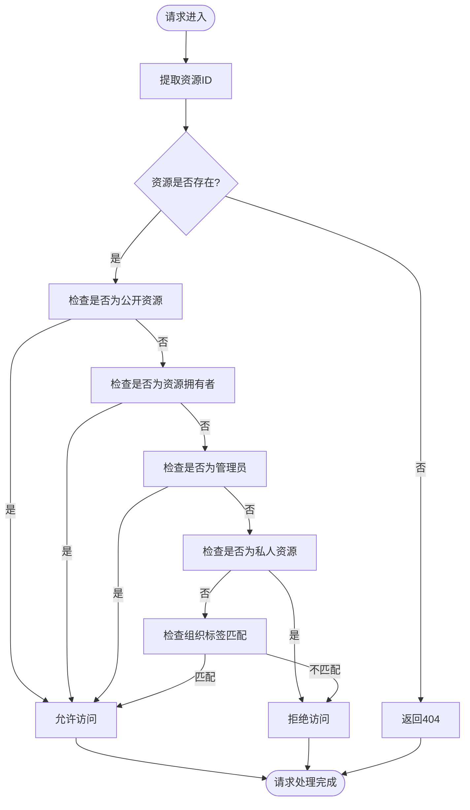
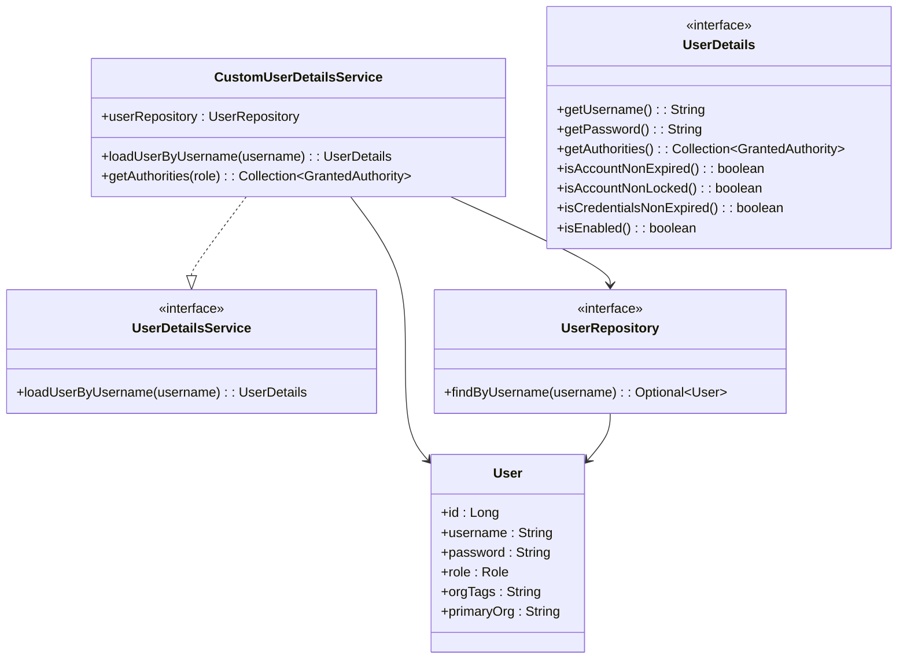
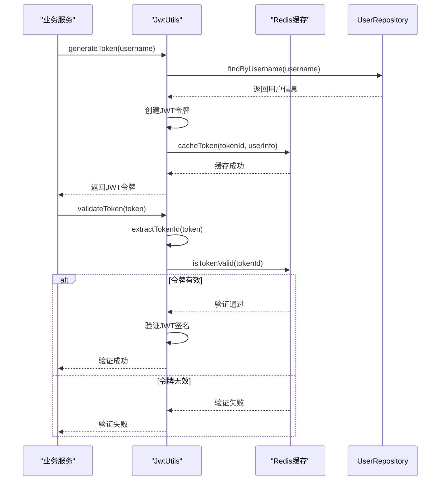
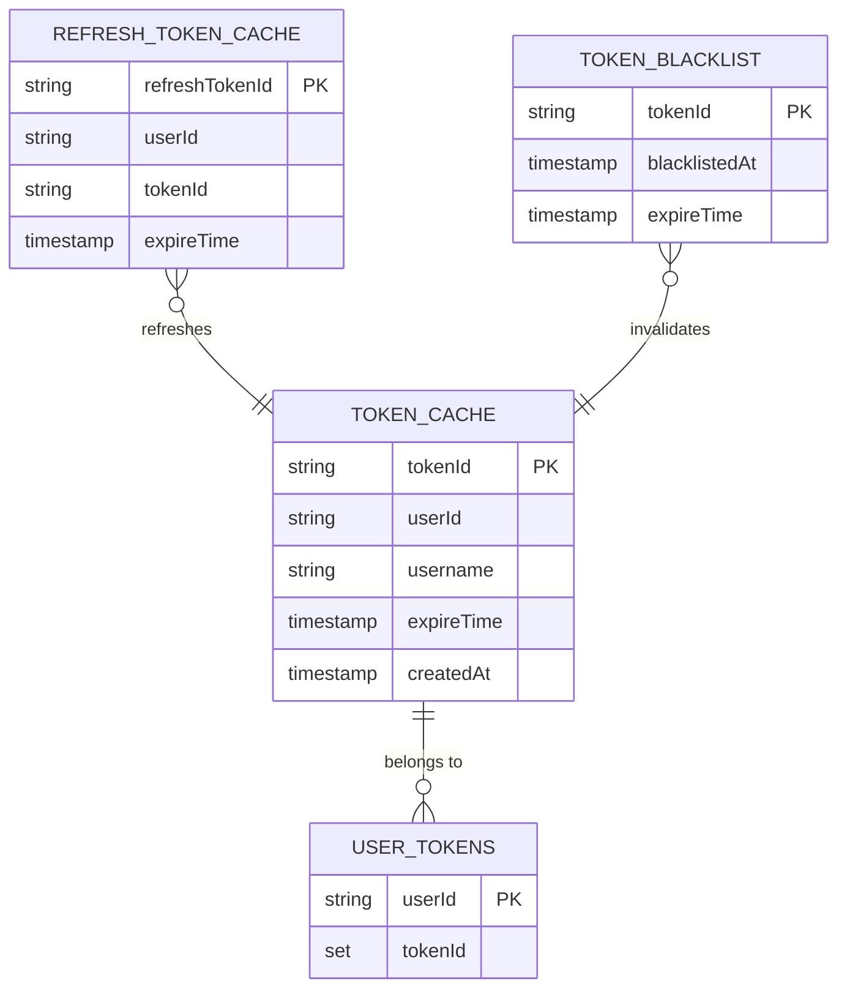
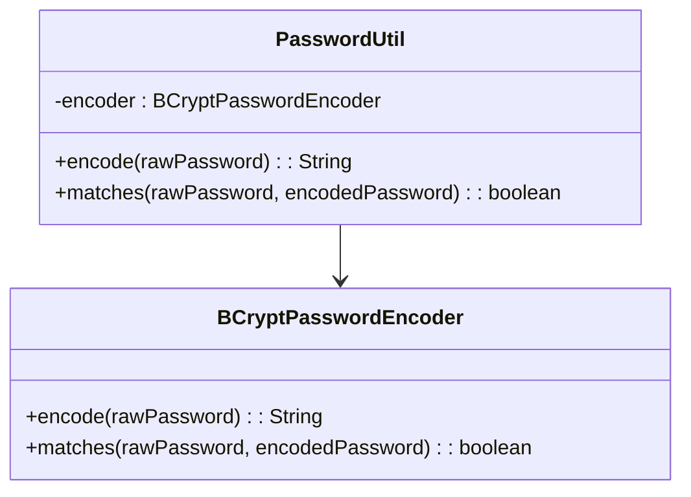

# 安全机制

<cite>
**本文档引用的文件**   
- [SecurityConfig.java](file://src/main/java/com/yizhaoqi/smartpai/config/SecurityConfig.java)
- [JwtAuthenticationFilter.java](file://src/main/java/com/yizhaoqi/smartpai/config/JwtAuthenticationFilter.java)
- [OrgTagAuthorizationFilter.java](file://src/main/java/com/yizhaoqi/smartpai/config/OrgTagAuthorizationFilter.java)
- [CustomUserDetailsService.java](file://src/main/java/com/yizhaoqi/smartpai/service/CustomUserDetailsService.java)
- [JwtUtils.java](file://src/main/java/com/yizhaoqi/smartpai/utils/JwtUtils.java)
- [TokenCacheService.java](file://src/main/java/com/yizhaoqi/smartpai/service/TokenCacheService.java)
- [PasswordUtil.java](file://src/main/java/com/yizhaoqi/smartpai/utils/PasswordUtil.java)
- [AuthController.java](file://src/main/java/com/yizhaoqi/smartpai/controller/AuthController.java)
- [UserService.java](file://src/main/java/com/yizhaoqi/smartpai/service/UserService.java)
- [User.java](file://src/main/java/com/yizhaoqi/smartpai/model/User.java)
- [UserRepository.java](file://src/main/java/com/yizhaoqi/smartpai/repository/UserRepository.java)
- [OrganizationTag.java](file://src/main/java/com/yizhaoqi/smartpai/model/OrganizationTag.java)
- [OrgTagCacheService.java](file://src/main/java/com/yizhaoqi/smartpai/service/OrgTagCacheService.java)
</cite>

## 目录
1. [安全架构概述](#安全架构概述)
2. [双重认证授权体系](#双重认证授权体系)
3. [安全规则配置](#安全规则配置)
4. [JWT认证过滤器](#jwt认证过滤器)
5. [组织标签授权过滤器](#组织标签授权过滤器)
6. [用户详情服务](#用户详情服务)
7. [JWT工具类](#jwt工具类)
8. [令牌缓存服务](#令牌缓存服务)
9. [密码加密方案](#密码加密方案)
10. [安全最佳实践](#安全最佳实践)

## 安全架构概述

PaiSmart系统采用基于Spring Security和JWT的双重认证授权体系，构建了多层次的安全防护机制。该架构通过无状态的JWT令牌实现用户身份认证，结合自定义的组织标签授权过滤器实现企业级多租户权限控制。系统采用Redis缓存技术增强JWT令牌的安全性，防止令牌劫持，并实现了无感知的自动刷新机制，提升了用户体验。

**图示来源**
- [SecurityConfig.java](file://src/main/java/com/yizhaoqi/smartpai/config/SecurityConfig.java)
- [JwtAuthenticationFilter.java](file://src/main/java/com/yizhaoqi/smartpai/config/JwtAuthenticationFilter.java)
- [TokenCacheService.java](file://src/main/java/com/yizhaoqi/smartpai/service/TokenCacheService.java)

## 双重认证授权体系

PaiSmart系统的安全架构采用双重过滤器链设计，通过JwtAuthenticationFilter和OrgTagAuthorizationFilter两个自定义过滤器实现认证与授权的分离。这种设计遵循了单一职责原则，使每个过滤器专注于特定的安全功能。

**图示来源**
- [SecurityConfig.java](file://src/main/java/com/yizhaoqi/smartpai/config/SecurityConfig.java#L65-L87)
- [JwtAuthenticationFilter.java](file://src/main/java/com/yizhaoqi/smartpai/config/JwtAuthenticationFilter.java#L31-L59)
- [OrgTagAuthorizationFilter.java](file://src/main/java/com/yizhaoqi/smartpai/config/OrgTagAuthorizationFilter.java#L50-L100)

## 安全规则配置

SecurityConfig类是系统安全配置的核心，通过Spring Security的SecurityFilterChain配置了全面的安全规则。配置中禁用了CSRF保护，采用无状态会话管理策略，并定义了详细的路径权限规则。

### 路径权限规则

安全配置定义了多层次的访问控制策略，根据不同的API端点设置了相应的权限要求：

- **公开访问路径**：静态资源、WebSocket连接、登录注册接口、测试接口等允许匿名访问
- **角色限制路径**：文件上传下载、对话历史、搜索接口等要求用户具有USER或ADMIN角色
- **管理员专属路径**：以`/api/v1/admin/**`开头的接口仅允许ADMIN角色访问
- **通用要求**：除上述明确允许的路径外，所有其他请求都需要认证

**图示来源**
- [SecurityConfig.java](file://src/main/java/com/yizhaoqi/smartpai/config/SecurityConfig.java#L30-L52)
- [SecurityConfig.java](file://src/main/java/com/yizhaoqi/smartpai/config/SecurityConfig.java#L52-L65)

**本节来源**
- [SecurityConfig.java](file://src/main/java/com/yizhaoqi/smartpai/config/SecurityConfig.java#L0-L89)

## JWT认证过滤器

JwtAuthenticationFilter是系统认证流程的核心组件，负责解析请求头中的JWT令牌，验证其有效性，并将用户信息设置到Spring Security上下文中。

### 过滤器执行流程

1. **提取令牌**：从请求头的Authorization字段提取JWT令牌
2. **验证令牌**：检查令牌的有效性，包括签名验证和过期时间检查
3. **自动刷新**：实现无感知的令牌自动刷新机制
4. **设置认证**：将用户信息加载到安全上下文中
5. **继续过滤链**：将请求传递给下一个过滤器

**图示来源**
- [JwtAuthenticationFilter.java](file://src/main/java/com/yizhaoqi/smartpai/config/JwtAuthenticationFilter.java#L31-L59)
- [JwtUtils.java](file://src/main/java/com/yizhaoqi/smartpai/utils/JwtUtils.java#L150-L200)

**本节来源**
- [JwtAuthenticationFilter.java](file://src/main/java/com/yizhaoqi/smartpai/config/JwtAuthenticationFilter.java#L0-L98)

## 组织标签授权过滤器

OrgTagAuthorizationFilter实现了企业级多租户权限控制逻辑，支持基于组织标签的数据访问控制，确保用户只能访问其权限范围内的资源。

### 多租户权限控制逻辑

该过滤器实现了三级访问控制模型：
1. **用户私人空间**：仅资源创建者可访问
2. **组织资源**：组织成员可访问
3. **公开资源**：所有用户可访问

**图示来源**
- [OrgTagAuthorizationFilter.java](file://src/main/java/com/yizhaoqi/smartpai/config/OrgTagAuthorizationFilter.java#L50-L100)
- [OrgTagAuthorizationFilter.java](file://src/main/java/com/yizhaoqi/smartpai/config/OrgTagAuthorizationFilter.java#L100-L150)

**本节来源**
- [OrgTagAuthorizationFilter.java](file://src/main/java/com/yizhaoqi/smartpai/config/OrgTagAuthorizationFilter.java#L0-L199)

## 用户详情服务

CustomUserDetailsService实现了Spring Security的UserDetailsService接口，负责从数据库加载用户详细信息，并将其转换为Spring Security所需的UserDetails格式。

### 用户加载流程

1. **查找用户**：通过用户名从数据库查找用户记录
2. **转换权限**：将用户角色转换为Spring Security的权限格式
3. **返回详情**：创建并返回UserDetails对象

**图示来源**
- [CustomUserDetailsService.java](file://src/main/java/com/yizhaoqi/smartpai/service/CustomUserDetailsService.java#L0-L48)
- [User.java](file://src/main/java/com/yizhaoqi/smartpai/model/User.java#L0-L43)
- [UserRepository.java](file://src/main/java/com/yizhaoqi/smartpai/repository/UserRepository.java#L0-L10)

**本节来源**
- [CustomUserDetailsService.java](file://src/main/java/com/yizhaoqi/smartpai/service/CustomUserDetailsService.java#L0-L48)

## JWT工具类

JwtUtils类提供了JWT令牌的生成、验证和刷新功能，集成了Redis缓存机制，增强了令牌的安全性。

### JWT令牌机制

#### 令牌生成
1. **创建声明**：包含tokenId、角色、用户ID、组织标签等信息
2. **生成令牌**：使用HS256算法签名，设置1小时过期时间
3. **缓存信息**：将令牌信息存储到Redis，便于快速验证

#### 令牌验证
1. **提取tokenId**：从JWT中提取tokenId进行快速验证
2. **检查缓存**：验证Redis中令牌状态
3. **验证签名**：使用密钥验证JWT签名

#### 令牌刷新
- **预刷新机制**：当令牌剩余时间少于5分钟时自动刷新
- **宽限期刷新**：令牌过期后10分钟内仍可刷新
- **无感知刷新**：通过响应头返回新令牌，前端自动更新

**图示来源**
- [JwtUtils.java](file://src/main/java/com/yizhaoqi/smartpai/utils/JwtUtils.java#L0-L199)
- [TokenCacheService.java](file://src/main/java/com/yizhaoqi/smartpai/service/TokenCacheService.java#L0-L199)

**本节来源**
- [JwtUtils.java](file://src/main/java/com/yizhaoqi/smartpai/utils/JwtUtils.java#L0-L199)

## 令牌缓存服务

TokenCacheService基于Redis实现了JWT令牌的状态管理，解决了JWT无状态特性带来的安全问题。

### 缓存机制设计

系统使用Redis存储以下信息：
- **有效令牌**：以`jwt:valid:{tokenId}`为键，存储令牌信息
- **刷新令牌**：以`jwt:refresh:{refreshTokenId}`为键，存储刷新令牌信息
- **黑名单**：以`jwt:blacklist:{tokenId}`为键，存储已失效的令牌

**图示来源**
- [TokenCacheService.java](file://src/main/java/com/yizhaoqi/smartpai/service/TokenCacheService.java#L0-L199)
- [JwtUtils.java](file://src/main/java/com/yizhaoqi/smartpai/utils/JwtUtils.java#L100-L150)

**本节来源**
- [TokenCacheService.java](file://src/main/java/com/yizhaoqi/smartpai/service/TokenCacheService.java#L0-L199)

## 密码加密方案

系统采用BCryptPasswordEncoder实现密码加密，提供了安全的密码存储方案。

### PasswordUtil实现

**图示来源**
- [PasswordUtil.java](file://src/main/java/com/yizhaoqi/smartpai/utils/PasswordUtil.java#L0-L28)
- [UserService.java](file://src/main/java/com/yizhaoqi/smartpai/service/UserService.java#L100-L150)

**本节来源**
- [PasswordUtil.java](file://src/main/java/com/yizhaoqi/smartpai/utils/PasswordUtil.java#L0-L28)

## 安全最佳实践

PaiSmart系统在安全设计方面遵循了多项最佳实践，确保了系统的安全性。

### 常见漏洞防范措施

1. **令牌劫持防护**：通过Redis缓存令牌状态，实现令牌的主动失效
2. **暴力破解防护**：虽然未在代码中直接体现，但可通过Spring Security的账户锁定机制实现
3. **CSRF防护**：禁用CSRF保护，适用于无状态API应用
4. **敏感信息保护**：JWT令牌中不包含敏感信息，仅包含必要的用户标识和权限信息

### 安全配置的可扩展性设计

1. **模块化设计**：认证和授权功能分离，便于扩展和维护
2. **配置驱动**：安全规则通过配置类定义，易于修改和调整
3. **缓存抽象**：使用RedisTemplate，便于切换到其他缓存实现
4. **日志监控**：集成详细的日志记录，便于安全审计和问题排查

**本节来源**
- [SecurityConfig.java](file://src/main/java/com/yizhaoqi/smartpai/config/SecurityConfig.java)
- [JwtAuthenticationFilter.java](file://src/main/java/com/yizhaoqi/smartpai/config/JwtAuthenticationFilter.java)
- [OrgTagAuthorizationFilter.java](file://src/main/java/com/yizhaoqi/smartpai/config/OrgTagAuthorizationFilter.java)
- [TokenCacheService.java](file://src/main/java/com/yizhaoqi/smartpai/service/TokenCacheService.java)