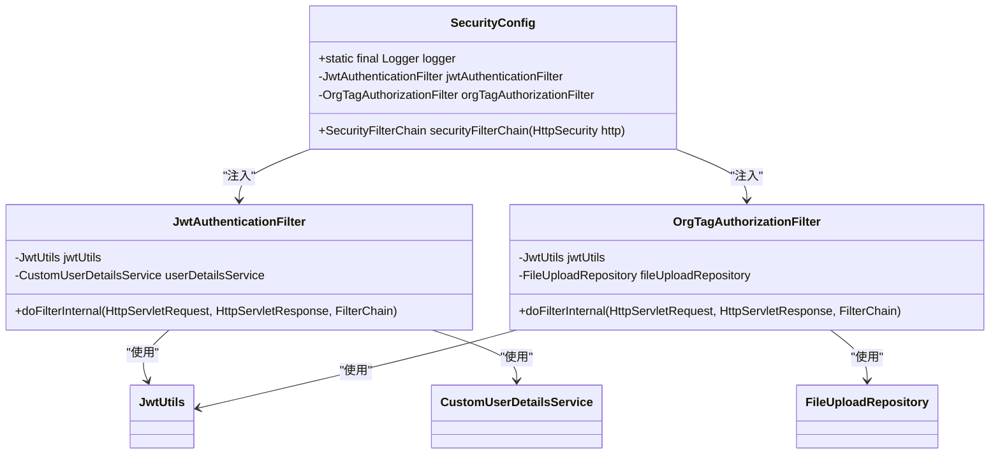
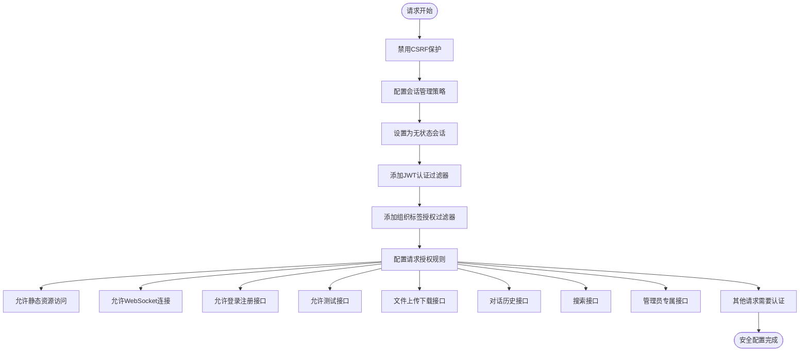
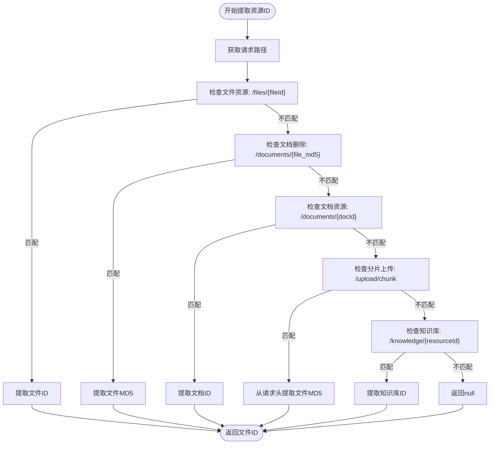
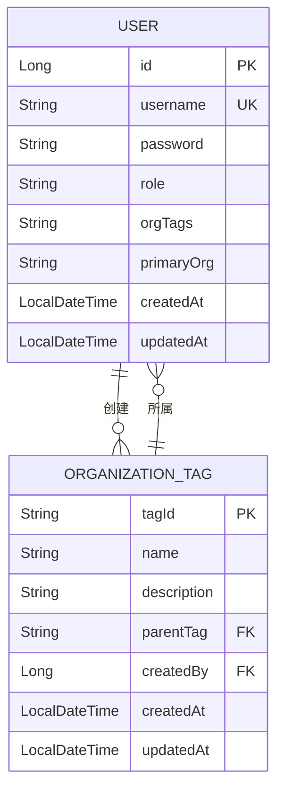
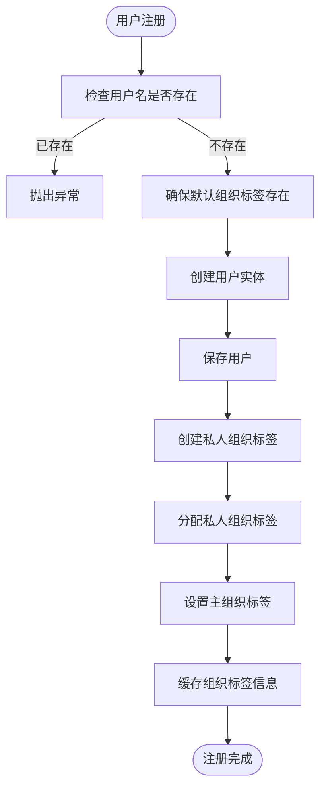
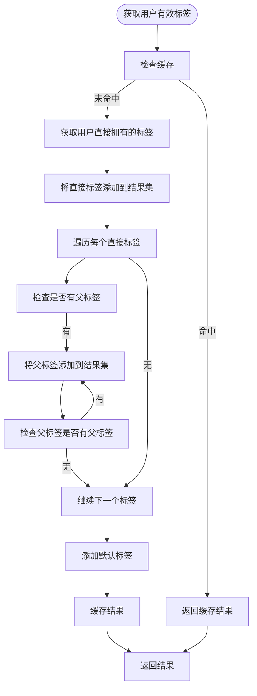
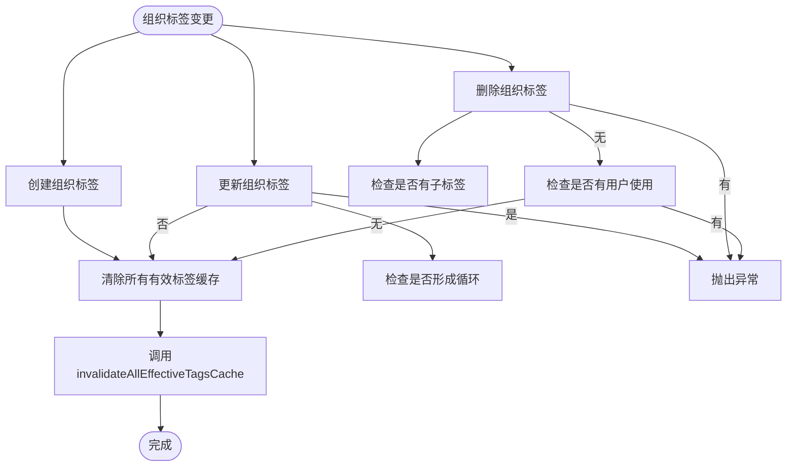
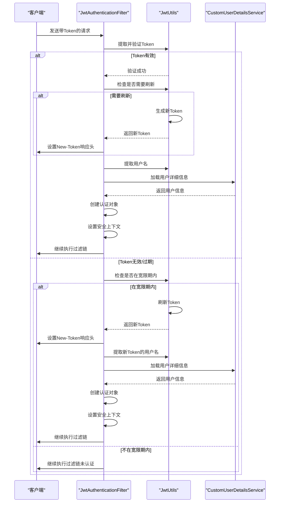
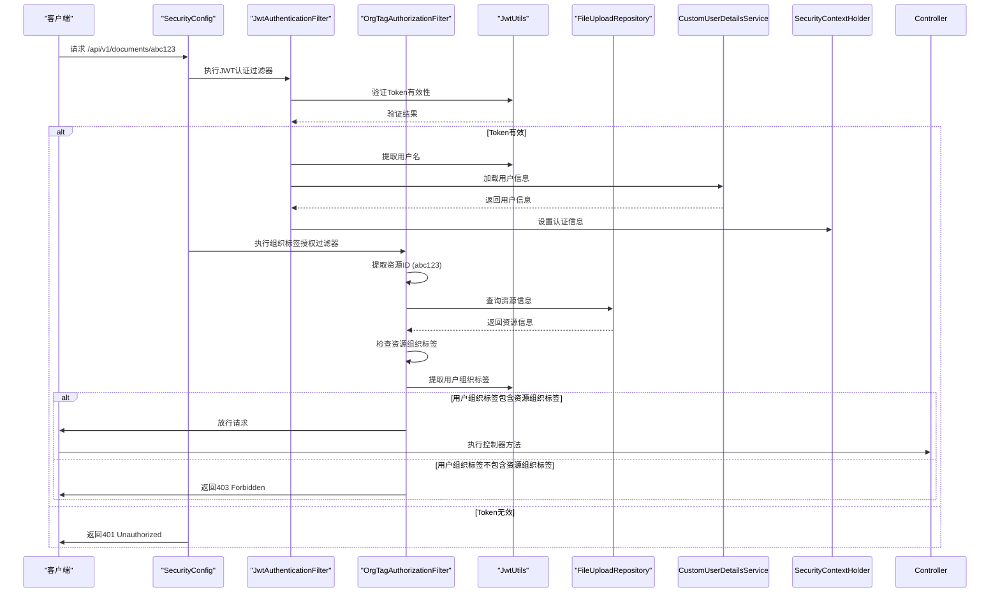

# 权限控制

<cite>
**本文档引用的文件**   
- [SecurityConfig.java](file://src/main/java/com/yizhaoqi/smartpai/config/SecurityConfig.java)
- [OrgTagAuthorizationFilter.java](file://src/main/java/com/yizhaoqi/smartpai/config/OrgTagAuthorizationFilter.java)
- [JwtUtils.java](file://src/main/java/com/yizhaoqi/smartpai/utils/JwtUtils.java)
- [UserService.java](file://src/main/java/com/yizhaoqi/smartpai/service/UserService.java)
- [OrgTagCacheService.java](file://src/main/java/com/yizhaoqi/smartpai/service/OrgTagCacheService.java)
- [JwtAuthenticationFilter.java](file://src/main/java/com/yizhaoqi/smartpai/config/JwtAuthenticationFilter.java)
- [CustomUserDetailsService.java](file://src/main/java/com/yizhaoqi/smartpai/service/CustomUserDetailsService.java)
- [User.java](file://src/main/java/com/yizhaoqi/smartpai/model/User.java)
- [OrganizationTag.java](file://src/main/java/com/yizhaoqi/smartpai/model/OrganizationTag.java)
</cite>

## 目录
1. [权限控制概述](#权限控制概述)
2. [基于角色的URL访问规则](#基于角色的url访问规则)
3. [组织标签授权过滤器](#组织标签授权过滤器)
4. [用户-组织-权限映射关系](#用户-组织-权限映射关系)
5. [权限缓存与动态更新机制](#权限缓存与动态更新机制)
6. [权限校验流程示例](#权限校验流程示例)

## 权限控制概述

PaiSmart系统的权限控制系统采用基于角色和组织标签（OrgTag）的多维权限控制模型。该系统通过Spring Security框架实现，结合JWT（JSON Web Token）进行无状态认证，并通过自定义过滤器实现细粒度的数据隔离与功能访问控制。

系统权限控制主要由以下几个核心组件构成：
- **SecurityConfig**：定义全局安全配置和URL访问规则
- **JwtAuthenticationFilter**：处理JWT认证，验证用户身份
- **OrgTagAuthorizationFilter**：实现基于组织标签的数据访问控制
- **JwtUtils**：提供JWT的生成、解析和验证功能
- **UserService**：管理用户和组织标签的业务逻辑
- **OrgTagCacheService**：提供组织标签权限的缓存服务

该权限系统支持三种访问控制级别：
1. **用户私人空间**：仅资源创建者可访问
2. **组织资源**：组织成员可访问
3. **公开资源**：所有用户可访问

**Section sources**
- [SecurityConfig.java](file://src/main/java/com/yizhaoqi/smartpai/config/SecurityConfig.java#L1-L90)
- [OrgTagAuthorizationFilter.java](file://src/main/java/com/yizhaoqi/smartpai/config/OrgTagAuthorizationFilter.java#L1-L338)

## 基于角色的URL访问规则

### URL访问规则配置

在`SecurityConfig`类中，通过`securityFilterChain`方法配置了详细的URL访问规则。系统采用基于角色的访问控制（RBAC）模型，定义了不同角色对不同API端点的访问权限。



**Diagram sources**
- [SecurityConfig.java](file://src/main/java/com/yizhaoqi/smartpai/config/SecurityConfig.java#L1-L90)
- [JwtAuthenticationFilter.java](file://src/main/java/com/yizhaoqi/smartpai/config/JwtAuthenticationFilter.java#L1-L99)
- [OrgTagAuthorizationFilter.java](file://src/main/java/com/yizhaoqi/smartpai/config/OrgTagAuthorizationFilter.java#L1-L338)

**Section sources**
- [SecurityConfig.java](file://src/main/java/com/yizhaoqi/smartpai/config/SecurityConfig.java#L30-L89)

### 具体访问规则

系统定义了以下URL访问规则：

| 访问路径 | 访问权限 | 说明 |
|---------|---------|------|
| `/`, `/static/**`, `/*.js`, `/*.css`, `/*.ico` | 允许匿名访问 | 静态资源访问 |
| `/chat/**`, `/ws/**` | 允许匿名访问 | WebSocket连接 |
| `/api/v1/users/register`, `/api/v1/users/login` | 允许匿名访问 | 登录注册接口 |
| `/api/v1/test/**` | 允许匿名访问 | 测试接口 |
| `/api/v1/upload/**`, `/api/v1/parse`, `/api/v1/documents/download`, `/api/v1/documents/preview` | USER, ADMIN角色 | 文件上传和下载相关接口 |
| `/api/v1/users/conversation/**` | USER, ADMIN角色 | 对话历史相关接口 |
| `/api/search/**` | USER, ADMIN角色 | 搜索接口 |
| `/api/chat/websocket-token` | 允许匿名访问 | 聊天WebSocket连接Token获取 |
| `/api/v1/admin/**` | ADMIN角色 | 管理员专属接口 |
| `/api/v1/users/primary-org` | USER, ADMIN角色 | 用户组织标签管理接口 |
| 其他请求 | 需要认证 | 所有其他请求需要用户认证 |

### 安全过滤器链

系统配置了安全过滤器链，按照特定顺序执行认证和授权逻辑：



**Diagram sources**
- [SecurityConfig.java](file://src/main/java/com/yizhaoqi/smartpai/config/SecurityConfig.java#L30-L89)

**Section sources**
- [SecurityConfig.java](file://src/main/java/com/yizhaoqi/smartpai/config/SecurityConfig.java#L30-L89)

## 组织标签授权过滤器

### 拦截逻辑分析

`OrgTagAuthorizationFilter`是实现基于组织标签数据访问控制的核心组件。该过滤器继承自`OncePerRequestFilter`，确保每个请求只被处理一次。

```mermaid
sequenceDiagram
participant Client as "客户端"
participant Filter as "OrgTagAuthorizationFilter"
participant JWT as "JwtUtils"
participant DB as "FileUploadRepository"
Client->>Filter : 发送请求
Filter->>Filter : 提取请求路径
alt 需要用户ID但不需要资源权限检查的API
Filter->>JWT : 从Token提取用户ID和角色
JWT-->>Filter : 返回用户信息
Filter->>Filter : 设置请求属性(userId, role)
Filter->>Client : 继续执行过滤链
else 需要资源权限检查的API
Filter->>Filter : 提取资源ID
alt 资源ID为空
Filter->>Client : 直接放行
else 资源ID存在
Filter->>DB : 查询资源信息
DB-->>Filter : 返回资源信息
alt 资源未找到
Filter->>Client : 返回404
else 资源找到
Filter->>Filter : 检查资源类型
alt 公开资源或默认组织
Filter->>Client : 放行请求
else 需要权限验证
Filter->>JWT : 提取用户Token
alt 无Token
Filter->>Client : 返回401
else 有Token
Filter->>JWT : 提取用户名和角色
alt 资源拥有者
Filter->>Client : 放行请求
else 管理员
Filter->>Client : 放行请求
else 私人资源
Filter->>Client : 返回403
else 检查组织标签
Filter->>JWT : 提取用户组织标签
alt 用户有权限
Filter->>Client : 放行请求
else 用户无权限
Filter->>Client : 返回403
end
end
end
end
```

**Diagram sources**
- [OrgTagAuthorizationFilter.java](file://src/main/java/com/yizhaoqi/smartpai/config/OrgTagAuthorizationFilter.java#L1-L338)

**Section sources**
- [OrgTagAuthorizationFilter.java](file://src/main/java/com/yizhaoqi/smartpai/config/OrgTagAuthorizationFilter.java#L1-L338)

### 资源ID提取机制

过滤器通过`extractResourceIdFromPath`方法从请求路径中提取资源ID，支持多种资源类型：



**Diagram sources**
- [OrgTagAuthorizationFilter.java](file://src/main/java/com/yizhaoqi/smartpai/config/OrgTagAuthorizationFilter.java#L200-L260)

**Section sources**
- [OrgTagAuthorizationFilter.java](file://src/main/java/com/yizhaoqi/smartpai/config/OrgTagAuthorizationFilter.java#L200-L260)

### 权限验证流程

过滤器的权限验证流程如下：

1. **特殊API处理**：对于分片上传、合并分片、获取用户文档等API，只需验证用户身份，将用户ID和角色设置为请求属性供控制器使用
2. **资源ID提取**：从请求路径中提取资源ID
3. **资源信息获取**：通过`FileUploadRepository`查询资源信息
4. **权限检查**：
   - 公开资源、无组织标签或属于默认组织的资源直接放行
   - 资源拥有者直接放行
   - 管理员直接放行
   - 私人组织标签资源只允许拥有者访问
   - 检查用户组织标签是否包含资源组织标签

## 用户-组织-权限映射关系

### 用户实体结构

`User`实体类定义了用户的基本信息和权限相关字段：

```java
@Data
@Entity
@Table(name = "users", uniqueConstraints = @UniqueConstraint(columnNames = "username"))
public class User {
    @Id
    @GeneratedValue(strategy = GenerationType.IDENTITY)
    private Long id;

    @Column(nullable = false, unique = true)
    private String username;

    @Column(nullable = false)
    private String password;

    @Enumerated(EnumType.STRING)
    @Column(nullable = false)
    private Role role;

    @Column(name = "org_tags")
    private String orgTags; // 用户所属组织标签，多个用逗号分隔

    @Column(name = "primary_org")
    private String primaryOrg; // 用户主组织标签

    @CreationTimestamp
    private LocalDateTime createdAt;

    @UpdateTimestamp
    private LocalDateTime updatedAt;

    public enum Role {
        USER, ADMIN
    }
}
```

**Section sources**
- [User.java](file://src/main/java/com/yizhaoqi/smartpai/model/User.java#L1-L44)

### 组织标签实体结构

`OrganizationTag`实体类定义了组织标签的结构和层级关系：

```java
@Data
@Entity
@Table(name = "organization_tags")
public class OrganizationTag {
    @Id
    @Column(name = "tag_id")
    private String tagId; // 标签唯一标识

    @Column(nullable = false)
    private String name; // 标签名称

    @Column(columnDefinition = "TEXT")
    private String description; // 描述

    @Column(name = "parent_tag", length = 255)
    private String parentTag; // 父标签ID

    @ManyToOne
    @JoinColumn(name = "created_by", nullable = false)
    private User createdBy; // 创建者ID

    @CreationTimestamp
    private LocalDateTime createdAt; // 创建时间

    @UpdateTimestamp
    private LocalDateTime updatedAt; // 更新时间
}
```

**Section sources**
- [OrganizationTag.java](file://src/main/java/com/yizhaoqi/smartpai/model/OrganizationTag.java#L1-L36)

### 用户-组织-权限关系图



**Diagram sources**
- [User.java](file://src/main/java/com/yizhaoqi/smartpai/model/User.java#L1-L44)
- [OrganizationTag.java](file://src/main/java/com/yizhaoqi/smartpai/model/OrganizationTag.java#L1-L36)

### 用户注册与组织标签分配

当用户注册时，系统会自动为其创建私人组织标签并进行分配：



**Diagram sources**
- [UserService.java](file://src/main/java/com/yizhaoqi/smartpai/service/UserService.java#L80-L150)

**Section sources**
- [UserService.java](file://src/main/java/com/yizhaoqi/smartpai/service/UserService.java#L80-L150)

## 权限缓存与动态更新机制

### 缓存策略

`OrgTagCacheService`类实现了组织标签权限的缓存服务，使用Redis作为缓存存储：

```java
@Service
public class OrgTagCacheService {
    
    private static final String USER_ORG_TAGS_KEY_PREFIX = "user:org_tags:";
    private static final String USER_PRIMARY_ORG_KEY_PREFIX = "user:primary_org:";
    private static final String USER_EFFECTIVE_TAGS_KEY_PREFIX = "user:effective_org_tags:";
    private static final long CACHE_TTL_HOURS = 24;
    
    @Autowired
    private RedisTemplate<String, Object> redisTemplate;
    
    // 缓存用户的组织标签
    public void cacheUserOrgTags(String username, List<String> orgTags) { ... }
    
    // 获取用户的组织标签
    public List<String> getUserOrgTags(String username) { ... }
    
    // 缓存用户的主组织标签
    public void cacheUserPrimaryOrg(String username, String primaryOrg) { ... }
    
    // 获取用户的主组织标签
    public String getUserPrimaryOrg(String username) { ... }
    
    // 获取用户的有效标签权限集合（包含用户直接拥有的标签及其所有父标签）
    public List<String> getUserEffectiveOrgTags(String username) { ... }
    
    // 删除用户的组织标签缓存
    public void deleteUserOrgTagsCache(String username) { ... }
    
    // 删除用户有效标签缓存
    public void deleteUserEffectiveTagsCache(String username) { ... }
    
    // 清除所有用户的有效标签缓存
    public void invalidateAllEffectiveTagsCache() { ... }
}
```

**Section sources**
- [OrgTagCacheService.java](file://src/main/java/com/yizhaoqi/smartpai/service/OrgTagCacheService.java#L1-L232)

### 有效标签权限计算

系统通过`getUserEffectiveOrgTags`方法计算用户的有效标签权限集合，包括用户直接拥有的标签及其所有父标签：



**Diagram sources**
- [OrgTagCacheService.java](file://src/main/java/com/yizhaoqi/smartpai/service/OrgTagCacheService.java#L150-L200)

**Section sources**
- [OrgTagCacheService.java](file://src/main/java/com/yizhaoqi/smartpai/service/OrgTagCacheService.java#L150-L200)

### 动态权限更新

当组织标签结构发生变化时，系统会自动更新相关缓存：



**Diagram sources**
- [UserService.java](file://src/main/java/com/yizhaoqi/smartpai/service/UserService.java#L300-L550)
- [OrgTagCacheService.java](file://src/main/java/com/yizhaoqi/smartpai/service/OrgTagCacheService.java#L220-L232)

**Section sources**
- [UserService.java](file://src/main/java/com/yizhaoqi/smartpai/service/UserService.java#L300-L550)
- [OrgTagCacheService.java](file://src/main/java/com/yizhaoqi/smartpai/service/OrgTagCacheService.java#L220-L232)

## 权限校验流程示例

### JWT认证流程



**Diagram sources**
- [JwtAuthenticationFilter.java](file://src/main/java/com/yizhaoqi/smartpai/config/JwtAuthenticationFilter.java#L1-L99)
- [JwtUtils.java](file://src/main/java/com/yizhaoqi/smartpai/utils/JwtUtils.java#L1-L434)
- [CustomUserDetailsService.java](file://src/main/java/com/yizhaoqi/smartpai/service/CustomUserDetailsService.java#L1-L49)

**Section sources**
- [JwtAuthenticationFilter.java](file://src/main/java/com/yizhaoqi/smartpai/config/JwtAuthenticationFilter.java#L1-L99)

### 完整权限校验流程

以用户访问文档资源为例，展示完整的权限校验流程：



**Diagram sources**
- [SecurityConfig.java](file://src/main/java/com/yizhaoqi/smartpai/config/SecurityConfig.java#L1-L90)
- [JwtAuthenticationFilter.java](file://src/main/java/com/yizhaoqi/smartpai/config/JwtAuthenticationFilter.java#L1-L99)
- [OrgTagAuthorizationFilter.java](file://src/main/java/com/yizhaoqi/smartpai/config/OrgTagAuthorizationFilter.java#L1-L338)
- [JwtUtils.java](file://src/main/java/com/yizhaoqi/smartpai/utils/JwtUtils.java#L1-L434)

**Section sources**
- [SecurityConfig.java](file://src/main/java/com/yizhaoqi/smartpai/config/SecurityConfig.java#L1-L90)
- [JwtAuthenticationFilter.java](file://src/main/java/com/yizhaoqi/smartpai/config/JwtAuthenticationFilter.java#L1-L99)
- [OrgTagAuthorizationFilter.java](file://src/main/java/com/yizhaoqi/smartpai/config/OrgTagAuthorizationFilter.java#L1-L338)