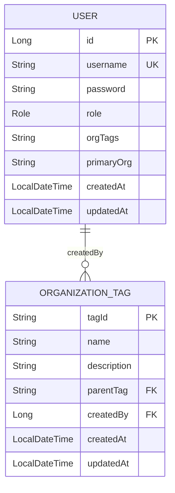
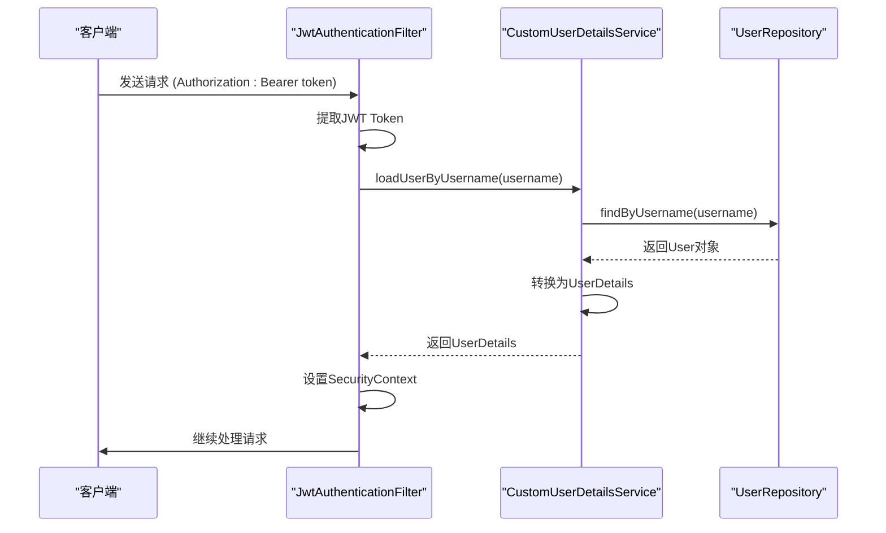
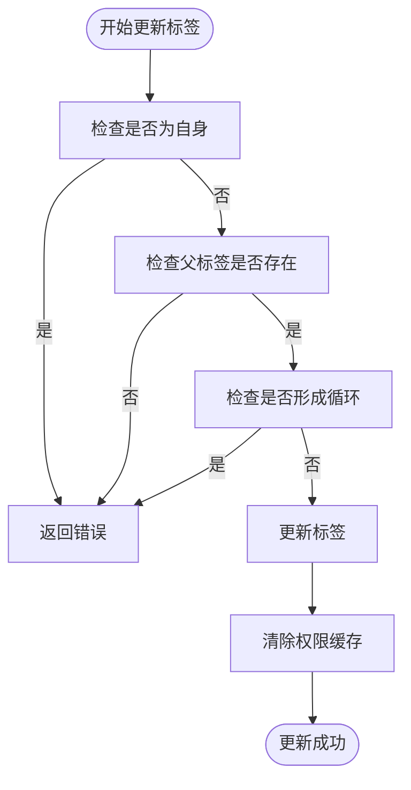
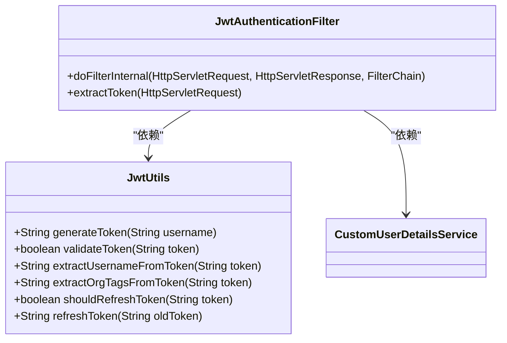
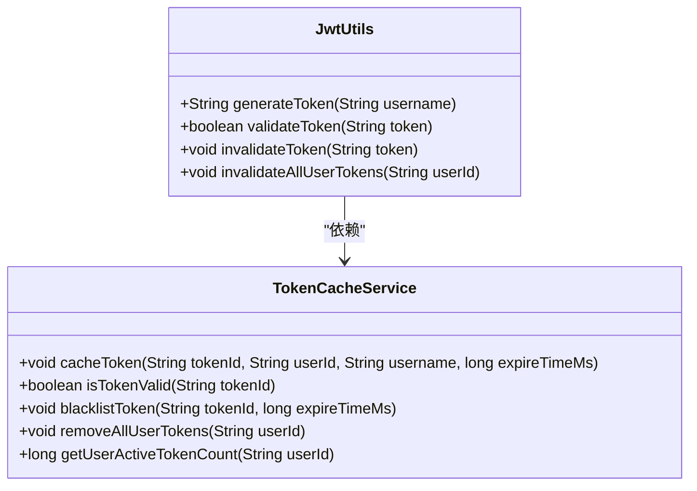
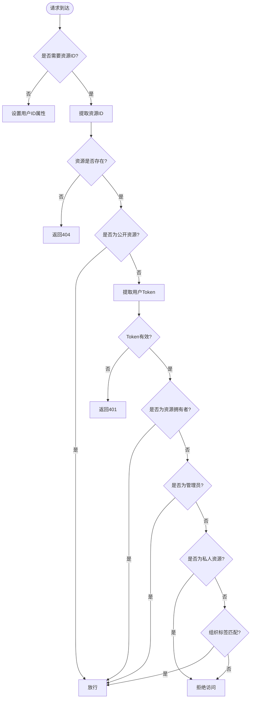

# 权限数据模型

<cite>
**本文档引用的文件**   
- [User.java](file://src/main/java/com/yizhaoqi/smartpai/model/User.java)
- [OrganizationTag.java](file://src/main/java/com/yizhaoqi/smartpai/model/OrganizationTag.java)
- [CustomUserDetailsService.java](file://src/main/java/com/yizhaoqi/smartpai/service/CustomUserDetailsService.java)
- [OrgTagCacheService.java](file://src/main/java/com/yizhaoqi/smartpai/service/OrgTagCacheService.java)
- [JwtAuthenticationFilter.java](file://src/main/java/com/yizhaoqi/smartpai/config/JwtAuthenticationFilter.java)
- [JwtUtils.java](file://src/main/java/com/yizhaoqi/smartpai/utils/JwtUtils.java)
- [TokenCacheService.java](file://src/main/java/com/yizhaoqi/smartpai/service/TokenCacheService.java)
- [SecurityConfig.java](file://src/main/java/com/yizhaoqi/smartpai/config/SecurityConfig.java)
- [OrgTagAuthorizationFilter.java](file://src/main/java/com/yizhaoqi/smartpai/config/OrgTagAuthorizationFilter.java)
- [FileUpload.java](file://src/main/java/com/yizhaoqi/smartpai/model/FileUpload.java)
- [UserService.java](file://src/main/java/com/yizhaoqi/smartpai/service/UserService.java)
- [UserRepository.java](file://src/main/java/com/yizhaoqi/smartpai/repository/UserRepository.java)
- [OrganizationTagRepository.java](file://src/main/java/com/yizhaoqi/smartpai/repository/OrganizationTagRepository.java)
</cite>

## 目录
1. [引言](#引言)
2. [核心数据模型](#核心数据模型)
3. [用户认证与授权流程](#用户认证与授权流程)
4. [组织标签层级结构](#组织标签层级结构)
5. [权限决策机制](#权限决策机制)
6. [缓存与会话管理](#缓存与会话管理)
7. [数据访问控制](#数据访问控制)
8. [结论](#结论)

## 引言
本文档全面阐述了权限控制系统的核心数据模型，重点分析了用户（User）实体与组织标签（OrganizationTag）实体之间的关联关系及其在权限决策中的作用。系统采用基于JWT的无状态认证机制，结合Redis缓存实现高效的权限验证。用户通过组织标签（orgTags）字段关联多个组织，每个组织标签可形成树状层级结构，支持基于组织的细粒度访问控制。文档详细说明了用户角色、组织标签集合等字段的业务含义，解析了CustomUserDetailsService如何加载用户信息，阐述了用户-组织多对多关系的存储实现，并文档化了权限信息的缓存结构和分布式会话一致性保障机制。

## 核心数据模型

### User实体分析
User实体是权限系统的核心，定义了用户的基本信息和权限属性。其字段定义如下：

**字段说明**
- `id`: 用户唯一标识，自增主键
- `username`: 用户名，唯一约束
- `password`: 加密后的密码
- `role`: 用户角色，枚举类型（USER, ADMIN）
- `orgTags`: 用户所属组织标签，多个标签用逗号分隔的字符串存储
- `primaryOrg`: 用户主组织标签，用于默认上下文
- `createdAt`: 创建时间，自动填充
- `updatedAt`: 更新时间，自动填充

```mermaid
classDiagram
class User {
+Long id
+String username
+String password
+Role role
+String orgTags
+String primaryOrg
+LocalDateTime createdAt
+LocalDateTime updatedAt
+enum Role { USER, ADMIN }
}
class OrganizationTag {
+String tagId
+String name
+String description
+String parentTag
+User createdBy
+LocalDateTime createdAt
+LocalDateTime updatedAt
}
User --> OrganizationTag : "通过orgTags字段关联"
OrganizationTag --> User : "createdBy"
```

**图示来源**
- [User.java](file://src/main/java/com/yizhaoqi/smartpai/model/User.java#L1-L44)
- [OrganizationTag.java](file://src/main/java/com/yizhaoqi/smartpai/model/OrganizationTag.java#L1-L36)

**本节来源**
- [User.java](file://src/main/java/com/yizhaoqi/smartpai/model/User.java#L1-L44)

### OrganizationTag实体分析
OrganizationTag实体定义了组织标签的结构，支持树状层级关系。其字段定义如下：

**字段说明**
- `tagId`: 标签唯一标识，作为主键
- `name`: 标签名称
- `description`: 标签描述
- `parentTag`: 父标签ID，用于构建层级
- `createdBy`: 创建者，关联User实体
- `createdAt`: 创建时间，自动填充
- `updatedAt`: 更新时间，自动填充

该实体通过`parentTag`字段实现自引用，形成树状结构。同时，`createdBy`字段建立了与User实体的多对一关系，表示每个标签由特定用户创建。

**本节来源**
- [OrganizationTag.java](file://src/main/java/com/yizhaoqi/smartpai/model/OrganizationTag.java#L1-L36)

### 用户-组织关系实现
系统采用字符串存储的方式实现用户与组织标签的多对多关系。User实体中的`orgTags`字段以逗号分隔的字符串形式存储用户所属的所有组织标签ID。这种设计避免了创建额外的关联表，简化了数据模型。

当需要查询用户的有效权限时，系统会解析`orgTags`字符串，并递归查找其所有父标签，形成完整的权限视图。这种设计在读取性能和存储效率之间取得了平衡，适用于组织结构相对稳定且层级不深的场景。



**图示来源**
- [User.java](file://src/main/java/com/yizhaoqi/smartpai/model/User.java#L1-L44)
- [OrganizationTag.java](file://src/main/java/com/yizhaoqi/smartpai/model/OrganizationTag.java#L1-L36)

## 用户认证与授权流程

### CustomUserDetailsService实现
CustomUserDetailsService实现了Spring Security的UserDetailsService接口，负责加载用户认证信息。其核心逻辑如下：



**图示来源**
- [CustomUserDetailsService.java](file://src/main/java/com/yizhaoqi/smartpai/service/CustomUserDetailsService.java#L1-L49)
- [JwtAuthenticationFilter.java](file://src/main/java/com/yizhaoqi/smartpai/config/JwtAuthenticationFilter.java#L1-L99)

**本节来源**
- [CustomUserDetailsService.java](file://src/main/java/com/yizhaoqi/smartpai/service/CustomUserDetailsService.java#L1-L49)

### 认证主体构建
当用户登录时，系统通过CustomUserDetailsService加载用户信息，并将其转换为Spring Security所需的UserDetails格式。`getAuthorities`方法将用户角色转换为权限格式（如"ROLE_USER"），这些权限信息将被包含在JWT令牌中，用于后续的授权决策。

## 组织标签层级结构

### 树状结构实现
组织标签通过`parentTag`字段实现树状层级结构。每个标签可以有一个父标签，从而形成多级组织架构。系统提供了递归方法`buildTagTreeRecursive`来构建完整的标签树，支持前端以树形控件展示组织结构。

```java
private List<Map<String, Object>> buildTagTreeRecursive(List<OrganizationTag> tags) {
    List<Map<String, Object>> result = new ArrayList<>();
    for (OrganizationTag tag : tags) {
        Map<String, Object> node = new HashMap<>();
        node.put("tagId", tag.getTagId());
        node.put("name", tag.getName());
        
        List<OrganizationTag> children = organizationTagRepository.findByParentTag(tag.getTagId());
        if (!children.isEmpty()) {
            node.put("children", buildTagTreeRecursive(children));
        }
        result.add(node);
    }
    return result;
}
```

### 层级维护逻辑
系统在更新组织标签时实施了严格的层级维护逻辑：
1. **自引用检查**：禁止标签成为自身的父标签
2. **循环检测**：通过`wouldFormCycle`方法检测是否会形成循环引用
3. **完整性约束**：删除标签时检查是否有子标签或用户使用



**图示来源**
- [UserService.java](file://src/main/java/com/yizhaoqi/smartpai/service/UserService.java#L500-L699)

**本节来源**
- [UserService.java](file://src/main/java/com/yizhaoqi/smartpai/service/UserService.java#L500-L699)

## 权限决策机制

### JWT令牌设计
系统采用JWT令牌传递用户权限信息。令牌的claims中包含：
- `tokenId`: 令牌唯一标识，用于Redis缓存
- `role`: 用户角色
- `userId`: 用户ID
- `orgTags`: 用户所属组织标签
- `primaryOrg`: 用户主组织标签



**图示来源**
- [JwtUtils.java](file://src/main/java/com/yizhaoqi/smartpai/utils/JwtUtils.java#L1-L434)
- [JwtAuthenticationFilter.java](file://src/main/java/com/yizhaoqi/smartpai/config/JwtAuthenticationFilter.java#L1-L99)

**本节来源**
- [JwtUtils.java](file://src/main/java/com/yizhaoqi/smartpai/utils/JwtUtils.java#L1-L434)

### 无状态认证流程
系统通过JwtAuthenticationFilter实现无状态认证。过滤器从请求头提取JWT令牌，验证其有效性，并将用户信息设置到SecurityContext中。系统还实现了自动刷新机制，当令牌即将过期时主动刷新，提升用户体验。

## 缓存与会话管理

### OrgTagCacheService
OrgTagCacheService使用Redis缓存用户的组织标签信息，提高权限验证效率。缓存键设计如下：
- `user:org_tags:{username}`: 存储用户组织标签列表
- `user:primary_org:{username}`: 存储用户主组织标签
- `user:effective_org_tags:{username}`: 存储用户有效标签集合（含父标签）

```java
public List<String> getUserEffectiveOrgTags(String username) {
    // 先从缓存获取
    List<Object> cachedTags = redisTemplate.opsForList().range(cacheKey, 0, -1);
    if (cachedTags != null && !cachedTags.isEmpty()) {
        return convertToList(cachedTags);
    }
    
    // 缓存未命中，计算有效标签集合
    Set<String> allEffectiveTags = new HashSet<>();
    List<String> userTags = getUserOrgTags(username);
    
    // 递归收集所有父标签
    for (String tagId : userTags) {
        collectParentTags(tagId, allEffectiveTags);
    }
    
    // 缓存结果
    cacheResult(username, allEffectiveTags);
    return new ArrayList<>(allEffectiveTags);
}
```

**本节来源**
- [OrgTagCacheService.java](file://src/main/java/com/yizhaoqi/smartpai/service/OrgTagCacheService.java#L1-L232)

### TokenCacheService
TokenCacheService基于Redis实现JWT令牌的状态管理，解决了无状态JWT的登出和失效问题。其核心功能包括：
- **令牌缓存**：将有效令牌信息存储在Redis中
- **黑名单机制**：主动失效的令牌加入黑名单
- **批量登出**：支持用户所有设备的批量登出
- **刷新令牌**：长期有效的刷新令牌管理

缓存键设计：
- `jwt:valid:{tokenId}`: 有效令牌信息
- `jwt:refresh:{refreshTokenId}`: 刷新令牌信息
- `jwt:blacklist:{tokenId}`: 黑名单令牌
- `jwt:user:{userId}:tokens`: 用户所有令牌集合



**图示来源**
- [TokenCacheService.java](file://src/main/java/com/yizhaoqi/smartpai/service/TokenCacheService.java#L1-L253)
- [JwtUtils.java](file://src/main/java/com/yizhaoqi/smartpai/utils/JwtUtils.java#L1-L434)

**本节来源**
- [TokenCacheService.java](file://src/main/java/com/yizhaoqi/smartpai/service/TokenCacheService.java#L1-L253)

## 数据访问控制

### OrgTagAuthorizationFilter
OrgTagAuthorizationFilter是数据访问控制的核心，实现基于组织标签的细粒度权限控制。其授权逻辑如下：



**图示来源**
- [OrgTagAuthorizationFilter.java](file://src/main/java/com/yizhaoqi/smartpai/config/OrgTagAuthorizationFilter.java#L1-L338)

**本节来源**
- [OrgTagAuthorizationFilter.java](file://src/main/java/com/yizhaoqi/smartpai/config/OrgTagAuthorizationFilter.java#L1-L338)

### 访问控制策略
系统支持多级访问控制策略：
1. **私人空间**：以`PRIVATE_`为前缀的组织标签，仅创建者可访问
2. **组织资源**：特定组织标签的资源，仅该组织成员可访问
3. **公开资源**：标记为公开的资源，所有用户可访问
4. **默认资源**：属于`DEFAULT`标签的资源，所有用户可访问

FileUpload实体中的`orgTag`字段将文件与组织标签关联，实现基于组织的文件权限控制。

## 结论
本文档全面分析了权限控制系统的核心数据模型和实现机制。系统通过User实体的`orgTags`字段实现用户与组织的多对多关系，采用字符串存储简化了数据模型。组织标签通过`parentTag`字段形成树状层级结构，支持复杂的组织架构。系统结合JWT无状态认证和Redis缓存，实现了高效的权限验证和会话管理。CustomUserDetailsService负责加载用户信息，JwtAuthenticationFilter处理认证流程，OrgTagAuthorizationFilter实现细粒度的数据访问控制。缓存服务解决了JWT的登出和失效问题，保障了分布式环境下的会话一致性。整体设计在安全性、性能和可维护性之间取得了良好平衡。