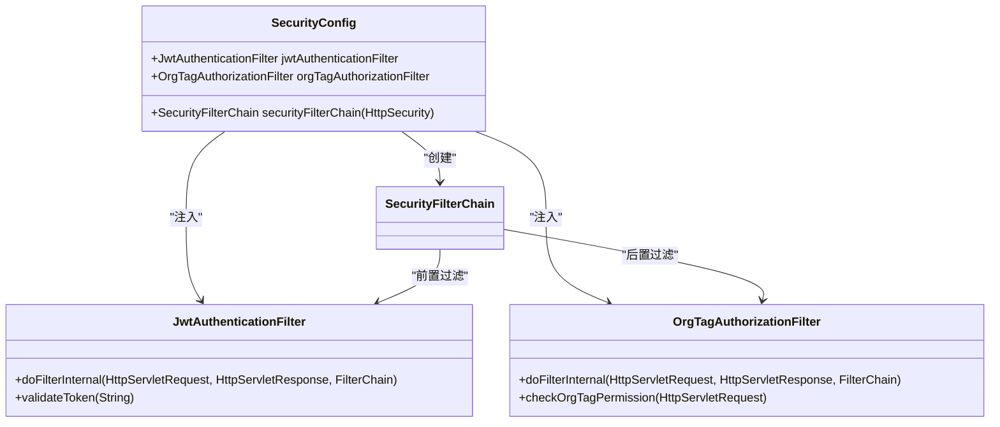
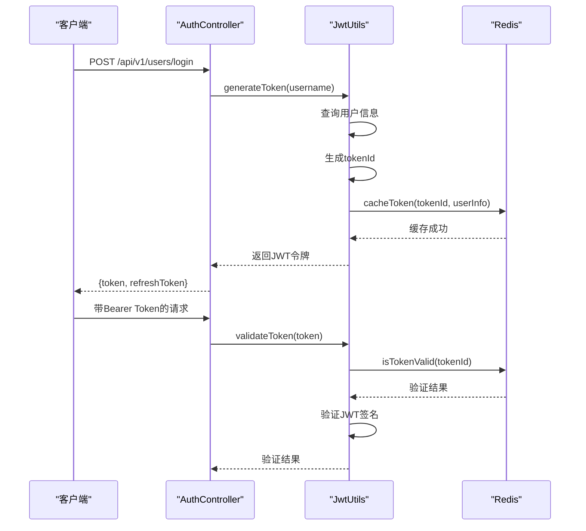
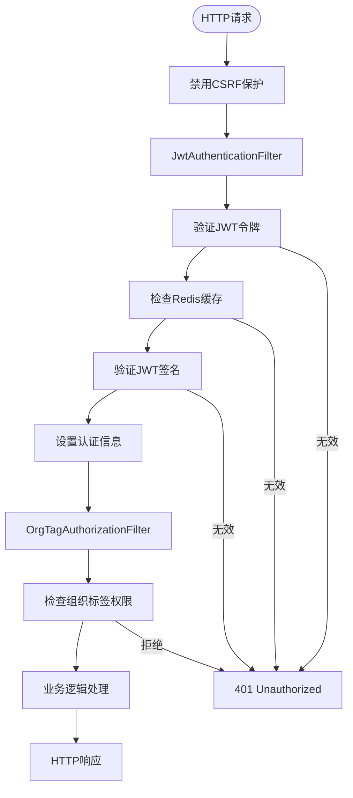

# 权限配置

<cite>
**本文档引用的文件**   
- [SecurityConfig.java](file://src/main/java/com/yizhaoqi/smartpai/config/SecurityConfig.java#L1-L87)
- [JwtAuthenticationFilter.java](file://src/main/java/com/yizhaoqi/smartpai/config/JwtAuthenticationFilter.java#L1-L100)
- [JwtUtils.java](file://src/main/java/com/yizhaoqi/smartpai/utils/JwtUtils.java#L1-L433)
- [TokenCacheService.java](file://src/main/java/com/yizhaoqi/smartpai/service/TokenCacheService.java#L1-L252)
- [UserController.java](file://src/main/java/com/yizhaoqi/smartpai/controller/UserController.java#L1-L332)
- [AdminController.java](file://src/main/java/com/yizhaoqi/smartpai/controller/AdminController.java#L1-L643)
</cite>

## 目录
1. [权限配置](#权限配置)
2. [Spring Security核心配置](#spring-security核心配置)
3. [JWT认证机制实现](#jwt认证机制实现)
4. [安全过滤器链分析](#安全过滤器链分析)
5. [方法级权限控制](#方法级权限控制)
6. [自定义安全扩展](#自定义安全扩展)

## Spring Security核心配置

`SecurityConfig`类是整个应用安全体系的核心配置，通过`@Configuration`和`@EnableWebSecurity`注解启用Spring Security功能。该配置定义了HTTP安全规则、会话管理策略和安全过滤器链。



**图示来源**
- [SecurityConfig.java](file://src/main/java/com/yizhaoqi/smartpai/config/SecurityConfig.java#L1-L87)
- [JwtAuthenticationFilter.java](file://src/main/java/com/yizhaoqi/smartpai/config/JwtAuthenticationFilter.java#L1-L100)

**本节来源**
- [SecurityConfig.java](file://src/main/java/com/yizhaoqi/smartpai/config/SecurityConfig.java#L1-L87)

### HTTP安全规则配置

在`securityFilterChain`方法中，通过`HttpSecurity`对象配置了详细的访问控制规则：

```java
http.csrf(csrf -> csrf.disable())
    .authorizeHttpRequests(authorize -> authorize
        // 允许静态资源访问
        .requestMatchers("/", "/test.html", "/static/test.html", "/static/**", "/*.js", "/*.css", "/*.ico").permitAll()
        // 允许 WebSocket 连接
        .requestMatchers("/chat/**", "/ws/**").permitAll()
        // 允许登录注册接口
        .requestMatchers("/api/v1/users/register", "/api/v1/users/login").permitAll()
        // 允许测试接口
        .requestMatchers("/api/v1/test/**").permitAll()
        // 其他请求需要认证
        .anyRequest().authenticated())
```

这些规则按照优先级顺序定义了不同URL路径的访问权限：
- **静态资源**：根路径、测试页面和静态文件目录允许匿名访问
- **WebSocket连接**：`/chat/**`和`/ws/**`路径开放，支持实时通信
- **认证接口**：用户注册和登录接口对所有用户开放
- **测试接口**：`/api/v1/test/**`前缀的接口用于开发测试
- **默认规则**：其他所有请求都需要通过身份验证

### 会话与CSRF配置

配置中明确禁用了CSRF保护并采用无状态会话管理：

```java
.sessionManagement(session -> session
    .sessionCreationPolicy(SessionCreationPolicy.STATELESS))
```

这种配置适用于基于JWT的无状态API应用，具有以下优势：
- **无状态性**：服务器不存储会话信息，便于水平扩展
- **跨域友好**：避免了传统会话的跨域问题
- **移动设备兼容**：适合移动端和单页应用

## JWT认证机制实现

JWT（JSON Web Token）认证机制通过`JwtUtils`类实现，提供了完整的令牌生命周期管理功能。



**图示来源**
- [JwtUtils.java](file://src/main/java/com/yizhaoqi/smartpai/utils/JwtUtils.java#L1-L433)
- [TokenCacheService.java](file://src/main/java/com/yizhaoqi/smartpai/service/TokenCacheService.java#L1-L252)

**本节来源**
- [JwtUtils.java](file://src/main/java/com/yizhaoqi/smartpai/utils/JwtUtils.java#L1-L433)

### JWT令牌生成

`generateToken`方法负责创建JWT令牌并将其状态缓存到Redis：

```java
public String generateToken(String username) {
    SecretKey key = getSigningKey();
    
    User user = userRepository.findByUsername(username)
            .orElseThrow(() -> new RuntimeException("User not found"));
    
    String tokenId = generateTokenId();
    long expireTime = System.currentTimeMillis() + EXPIRATION_TIME;
    
    Map<String, Object> claims = new HashMap<>();
    claims.put("tokenId", tokenId);
    claims.put("role", user.getRole().name());
    claims.put("userId", user.getId().toString());
    
    if (user.getOrgTags() != null && !user.getOrgTags().isEmpty()) {
        claims.put("orgTags", user.getOrgTags());
    }
    
    String token = Jwts.builder()
            .setClaims(claims)
            .setSubject(username)
            .setExpiration(new Date(expireTime))
            .signWith(key, SignatureAlgorithm.HS256)
            .compact();
    
    tokenCacheService.cacheToken(tokenId, user.getId().toString(), username, expireTime);
    return token;
}
```

关键特性包括：
- **令牌ID**：为每个令牌生成唯一ID，便于追踪和管理
- **用户信息**：将用户角色、ID和组织标签嵌入令牌
- **Redis缓存**：在Redis中存储令牌状态，实现主动失效

### 令牌验证与刷新

`validateToken`方法采用双重验证机制：

```java
public boolean validateToken(String token) {
    String tokenId = extractTokenIdFromToken(token);
    if (tokenId == null) return false;
    
    if (!tokenCacheService.isTokenValid(tokenId)) {
        return false;
    }
    
    Jwts.parserBuilder()
            .setSigningKey(getSigningKey())
            .build()
            .parseClaimsJws(token);
    return true;
}
```

刷新机制支持两种场景：
- **主动刷新**：当令牌剩余时间少于5分钟时触发
- **宽限期刷新**：过期后10分钟内仍可刷新

## 安全过滤器链分析

安全过滤器链由多个自定义过滤器组成，按照特定顺序执行认证和授权逻辑。



**图示来源**
- [SecurityConfig.java](file://src/main/java/com/yizhaoqi/smartpai/config/SecurityConfig.java#L1-L87)
- [JwtAuthenticationFilter.java](file://src/main/java/com/yizhaoqi/smartpai/config/JwtAuthenticationFilter.java#L1-L100)

**本节来源**
- [SecurityConfig.java](file://src/main/java/com/yizhaoqi/smartpai/config/SecurityConfig.java#L1-L87)

### JWT认证过滤器

`JwtAuthenticationFilter`是安全链的第一个过滤器，负责基本的身份验证：

1. 从请求头提取JWT令牌
2. 验证令牌的有效性
3. 从令牌中提取用户信息
4. 创建`Authentication`对象并设置到安全上下文

### 组织标签授权过滤器

`OrgTagAuthorizationFilter`在认证后执行，负责细粒度的权限控制：

1. 检查请求路径是否需要组织标签验证
2. 从JWT令牌中提取用户的组织标签
3. 验证用户是否有权访问目标资源
4. 拒绝未经授权的访问

## 方法级权限控制

通过`@PreAuthorize`注解实现方法级别的细粒度权限控制，在`AdminController`中广泛应用。

```java
@RestController
@RequestMapping("/api/v1/admin")
public class AdminController {
    
    @GetMapping("/users")
    public ResponseEntity<?> getAllUsers(@RequestHeader("Authorization") String token) {
        String adminUsername = jwtUtils.extractUsernameFromToken(token.replace("Bearer ", ""));
        validateAdmin(adminUsername);
        // ...
    }
    
    private User validateAdmin(String username) {
        if (username == null || username.isEmpty()) {
            throw new CustomException("Invalid token", HttpStatus.UNAUTHORIZED);
        }
        
        User admin = userRepository.findByUsername(username)
                .orElseThrow(() -> new CustomException("User not found", HttpStatus.NOT_FOUND));
        
        if (admin.getRole() != User.Role.ADMIN) {
            throw new CustomException("Unauthorized access: Admin role required", HttpStatus.FORBIDDEN);
        }
        
        return admin;
    }
}
```

**本节来源**
- [AdminController.java](file://src/main/java/com/yizhaoqi/smartpai/controller/AdminController.java#L1-L643)
- [UserController.java](file://src/main/java/com/yizhaoqi/smartpai/controller/UserController.java#L1-L332)

### 权限表达式使用场景

在实际控制器方法中，权限表达式通过编程方式实现：

- **管理员专属接口**：`/api/v1/admin/**`路径需要管理员角色
- **用户个人数据**：只能访问自己的信息
- **组织标签限制**：根据用户所属组织标签限制数据访问

例如，`getAllConversations`方法允许管理员查询所有用户的对话历史，但需要验证管理员身份。

## 自定义安全扩展

系统提供了多种扩展点，便于添加新的安全功能。

### 添加安全过滤器

通过`addFilterBefore`和`addFilterAfter`方法可以插入自定义过滤器：

```java
@Bean
public SecurityFilterChain securityFilterChain(HttpSecurity http) throws Exception {
    http.addFilterBefore(jwtAuthenticationFilter, UsernamePasswordAuthenticationFilter.class)
        .addFilterAfter(orgTagAuthorizationFilter, JwtAuthenticationFilter.class);
    // 可以继续添加其他过滤器
    return http.build();
}
```

### 修改访问决策管理器

虽然当前配置使用默认的访问决策管理器，但可以通过自定义`AccessDecisionManager`来实现复杂的权限决策逻辑。

### 扩展JWT令牌内容

`JwtUtils`类可以轻松扩展以包含更多用户信息：

```java
// 可以添加更多声明
claims.put("department", user.getDepartment());
claims.put("permissions", user.getPermissions());
```

这些扩展机制使得安全配置具有良好的可维护性和可扩展性。