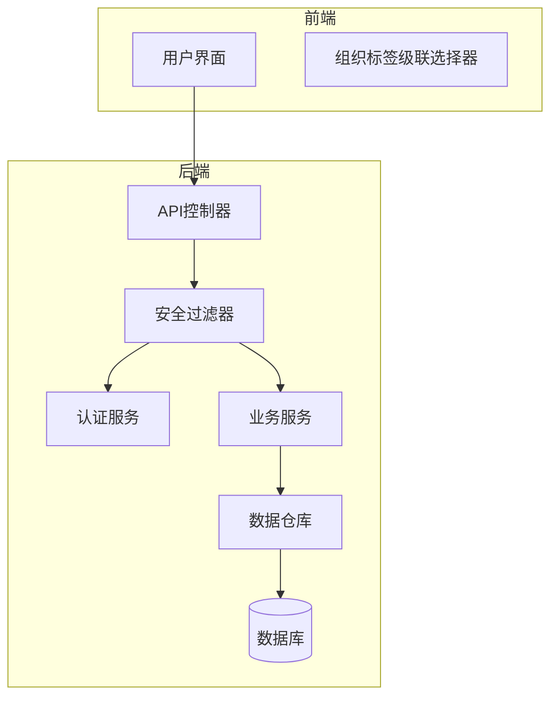
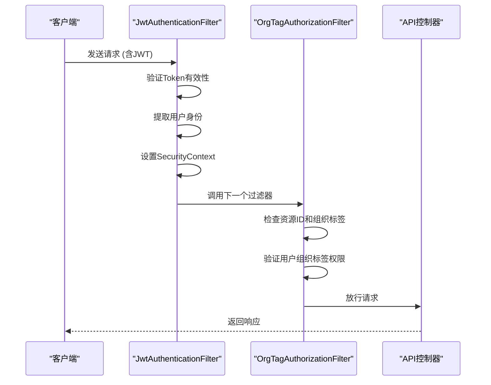
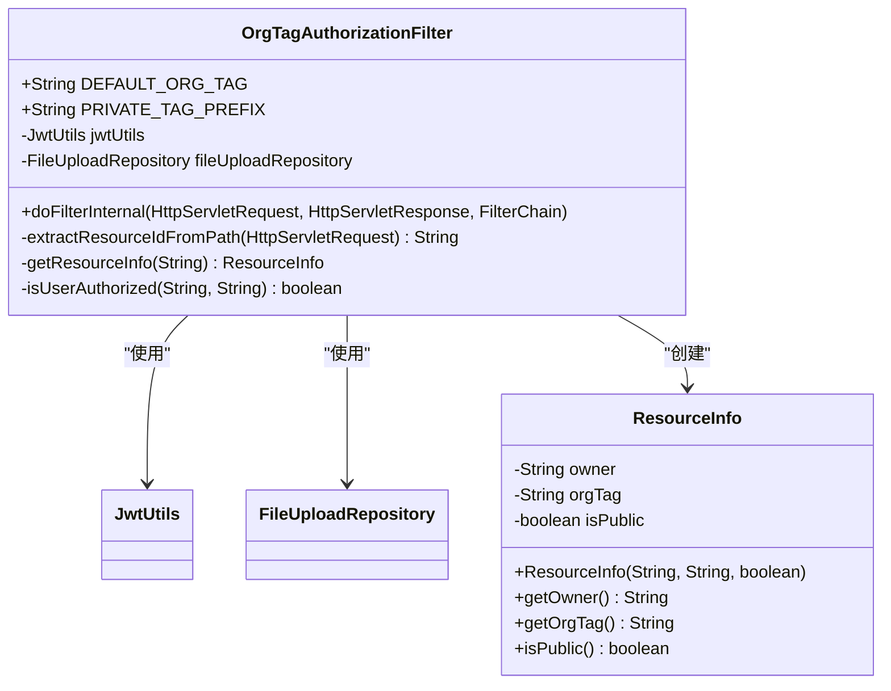
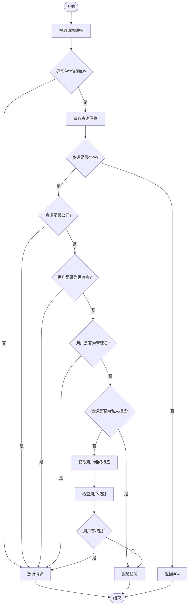
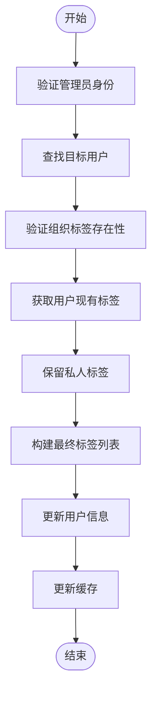
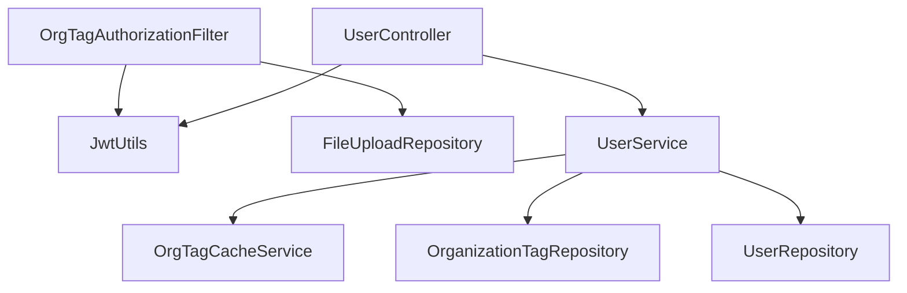

# 组织标签授权

<cite>
**本文档中引用的文件**   
- [OrgTagAuthorizationFilter.java](file://src/main/java/com/yizhaoqi/smartpai/config/OrgTagAuthorizationFilter.java)
- [SecurityConfig.java](file://src/main/java/com/yizhaoqi/smartpai/config/SecurityConfig.java)
- [UserService.java](file://src/main/java/com/yizhaoqi/smartpai/service/UserService.java)
- [UserController.java](file://src/main/java/com/yizhaoqi/smartpai/controller/UserController.java)
- [OrganizationTag.java](file://src/main/java/com/yizhaoqi/smartpai/model/OrganizationTag.java)
- [FileUploadRepository.java](file://src/main/java/com/yizhaoqi/smartpai/repository/FileUploadRepository.java)
- [JwtAuthenticationFilter.java](file://src/main/java/com/yizhaoqi/smartpai/config/JwtAuthenticationFilter.java)
</cite>

## 目录
1. [引言](#引言)
2. [项目结构](#项目结构)
3. [核心组件](#核心组件)
4. [架构概述](#架构概述)
5. [详细组件分析](#详细组件分析)
6. [依赖分析](#依赖分析)
7. [性能考虑](#性能考虑)
8. [故障排除指南](#故障排除指南)
9. [结论](#结论)

## 引言
本文档深入分析了组织标签授权机制的实现，重点阐述了`OrgTagAuthorizationFilter`如何在Spring Security框架中实现基于组织标签的多租户数据隔离。文档详细说明了组织标签的权限边界控制逻辑、过滤器链的协同工作机制、以及组织标签在API调用中的传递与验证流程。

## 项目结构
本项目采用典型的前后端分离架构。后端基于Spring Boot构建，核心安全功能位于`src/main/java/com/yizhaoqi/smartpai/config`包下，主要包括`JwtAuthenticationFilter`和`OrgTagAuthorizationFilter`两个核心安全过滤器。业务逻辑层位于`src/main/java/com/yizhaoqi/smartpai/service`包中，其中`UserService`负责组织标签的管理与分配。数据访问层通过JPA实现，`OrganizationTag`实体类定义了组织标签的数据模型。

**图示来源**
- [UserController.java](file://src/main/java/com/yizhaoqi/smartpai/controller/UserController.java)
- [UserService.java](file://src/main/java/com/yizhaoqi/smartpai/service/UserService.java)
- [OrganizationTag.java](file://src/main/java/yizhaoqi/smartpai/model/OrganizationTag.java)

## 核心组件
系统的核心组件是`OrgTagAuthorizationFilter`，它负责执行基于组织标签的细粒度访问控制。该过滤器与`JwtAuthenticationFilter`协同工作，共同构建了系统的安全防线。`UserService`则提供了组织标签的创建、分配和管理功能，是组织标签生命周期管理的核心。

**组件来源**
- [OrgTagAuthorizationFilter.java](file://src/main/java/com/yizhaoqi/smartpai/config/OrgTagAuthorizationFilter.java)
- [UserService.java](file://src/main/java/com/yizhaoqi/smartpai/service/UserService.java)

## 架构概述
系统的安全架构基于Spring Security的过滤器链模式。`JwtAuthenticationFilter`首先验证JWT令牌的有效性并建立用户认证上下文，随后`OrgTagAuthorizationFilter`在此基础上进行更细粒度的组织标签权限校验。这种分层授权模式确保了系统的安全性与灵活性。

**图示来源**
- [SecurityConfig.java](file://src/main/java/com/yizhaoqi/smartpai/config/SecurityConfig.java#L65-L87)
- [OrgTagAuthorizationFilter.java](file://src/main/java/com/yizhaoqi/smartpai/config/OrgTagAuthorizationFilter.java)

## 详细组件分析

### 组织标签授权过滤器分析
`OrgTagAuthorizationFilter`是实现组织标签授权的核心组件。它继承自`OncePerRequestFilter`，确保每个请求只被处理一次。

#### 类结构分析

**图示来源**
- [OrgTagAuthorizationFilter.java](file://src/main/java/com/yizhaoqi/smartpai/config/OrgTagAuthorizationFilter.java)

#### 权限验证流程分析

**图示来源**
- [OrgTagAuthorizationFilter.java](file://src/main/java/com/yizhaoqi/smartpai/config/OrgTagAuthorizationFilter.java#L125-L183)

**组件来源**
- [OrgTagAuthorizationFilter.java](file://src/main/java/com/yizhaoqi/smartpai/config/OrgTagAuthorizationFilter.java)

### 用户服务分析
`UserService`负责组织标签的业务逻辑处理，包括创建、分配和查询。

#### 组织标签分配流程

**图示来源**
- [UserService.java](file://src/main/java/com/yizhaoqi/smartpai/service/UserService.java#L280-L320)

**组件来源**
- [UserService.java](file://src/main/java/com/yizhaoqi/smartpai/service/UserService.java)

## 依赖分析
系统各组件之间存在明确的依赖关系。`OrgTagAuthorizationFilter`依赖于`JwtUtils`来解析令牌中的组织标签信息，并依赖`FileUploadRepository`来查询资源的组织标签。`UserService`则依赖`OrgTagCacheService`来实现组织标签的缓存管理，以提升权限校验性能。

**图示来源**
- [OrgTagAuthorizationFilter.java](file://src/main/java/com/yizhaoqi/smartpai/config/OrgTagAuthorizationFilter.java#L28-L31)
- [UserService.java](file://src/main/java/com/yizhaoqi/smartpai/service/UserService.java#L39-L41)

## 性能考虑
组织标签授权机制通过缓存显著提升了性能。`OrgTagCacheService`缓存了用户的组织标签和主组织标签信息，避免了每次权限校验时都进行数据库查询。当组织结构发生变化时，系统会自动清除相关缓存，确保数据一致性。

在组织标签更新、删除或用户标签分配时，`OrgTagCacheService`会调用`invalidateAllEffectiveTagsCache()`方法清除所有有效标签缓存，保证了权限校验的实时性和准确性。

## 故障排除指南
1. **用户无法访问属于其组织的资源**：检查`JwtUtils.extractOrgTagsFromToken()`方法是否能正确从JWT令牌中提取组织标签，确认用户分配的组织标签与资源的组织标签完全匹配。
2. **组织标签缓存未更新**：确认在执行`createOrganizationTag`、`updateOrganizationTag`、`deleteOrganizationTag`和`assignOrgTagsToUser`等操作后，`OrgTagCacheService`的缓存清除方法被正确调用。
3. **分片上传失败**：检查`/upload/chunk`路径的请求是否正确携带了`X-File-MD5`请求头，该头信息用于在首次上传时识别文件。

**故障排除来源**
- [OrgTagAuthorizationFilter.java](file://src/main/java/com/yizhaoqi/smartpai/config/OrgTagAuthorizationFilter.java)
- [UserService.java](file://src/main/java/com/yizhaoqi/smartpai/service/UserService.java)

## 结论
`OrgTagAuthorizationFilter`实现了一套完善的基于组织标签的多租户数据隔离方案。通过与`JwtAuthenticationFilter`的协同工作，系统实现了从身份认证到细粒度授权的完整安全链条。组织标签的缓存机制有效提升了权限校验的性能，而清晰的权限边界控制逻辑确保了数据的安全性。该设计支持灵活的组织结构管理，为系统的可扩展性奠定了坚实基础。