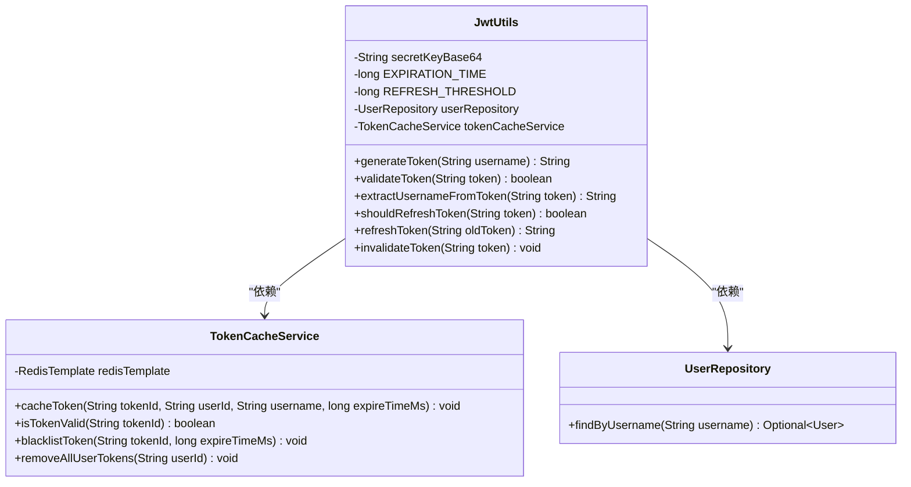
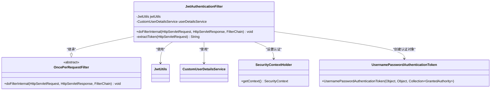
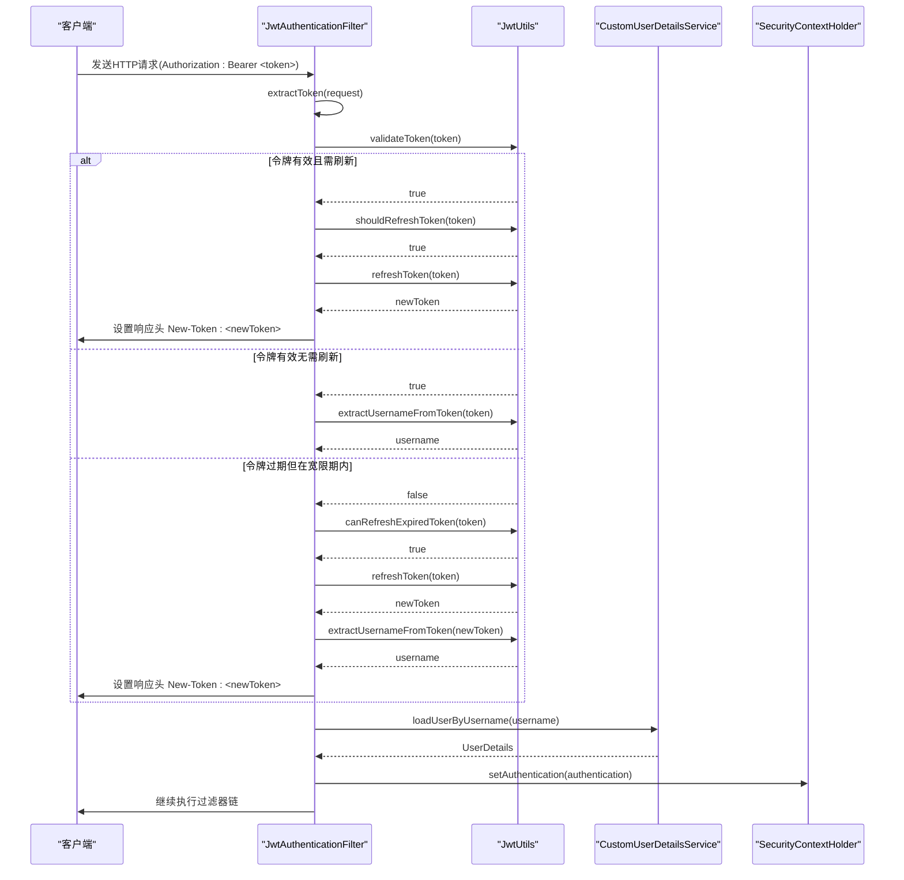
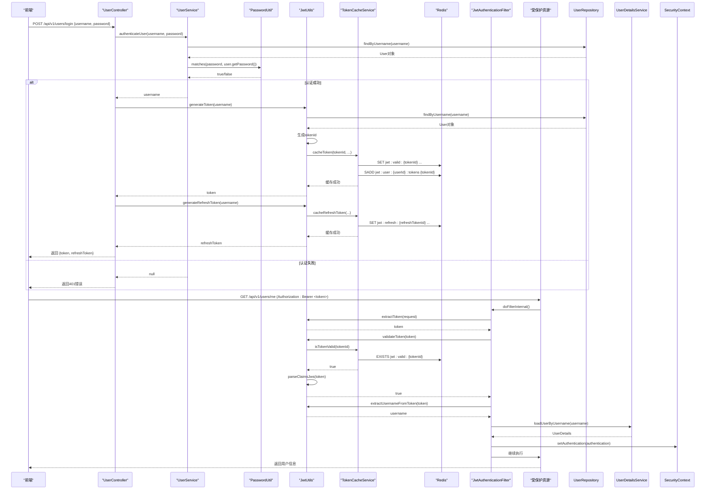

# JWT处理流程

<cite>
**本文档中引用的文件**   
- [JwtAuthenticationFilter.java](file://src/main/java/com/yizhaoqi/smartpai/config/JwtAuthenticationFilter.java)
- [JwtUtils.java](file://src/main/java/com/yizhaoqi/smartpai/utils/JwtUtils.java)
- [PasswordUtil.java](file://src/main/java/com/yizhaoqi/smartpai/utils/PasswordUtil.java)
- [UserController.java](file://src/main/java/com/yizhaoqi/smartpai/controller/UserController.java)
- [UserService.java](file://src/main/java/com/yizhaoqi/smartpai/service/UserService.java)
- [SecurityConfig.java](file://src/main/java/com/yizhaoqi/smartpai/config/SecurityConfig.java)
- [TokenCacheService.java](file://src/main/java/com/yizhaoqi/smartpai/service/TokenCacheService.java)
- [InvalidTokenException.java](file://src/main/java/com/yizhaoqi/smartpai/exception/InvalidTokenException.java)
</cite>

## 目录
1. [JWT处理流程概述](#jwt处理流程概述)
2. [核心组件分析](#核心组件分析)
3. [JWT令牌生成与解析](#jwt令牌生成与解析)
4. [JwtAuthenticationFilter执行流程](#jwtauthenticationfilter执行流程)
5. [密码哈希存储与验证](#密码哈希存储与验证)
6. [用户认证时序图](#用户认证时序图)
7. [JWT异常处理策略](#jwt异常处理策略)

## JWT处理流程概述

本文档全面阐述了PaiSmart项目中JWT（JSON Web Token）令牌的生成、解析、验证与刷新机制。系统通过`JwtUtils`工具类实现JWT的核心功能，结合`JwtAuthenticationFilter`过滤器在Spring Security框架中实现无状态认证。用户登录后获取的JWT令牌包含用户身份、角色和组织标签等自定义声明，通过Redis缓存实现令牌状态管理，支持主动刷新和自动刷新机制。整个流程确保了系统的安全性与用户体验的平衡。

## 核心组件分析

系统中的JWT处理涉及多个核心组件，它们协同工作以实现安全的用户认证和授权。

### JwtUtils工具类

`JwtUtils`是JWT处理的核心工具类，负责令牌的生成、解析、验证和刷新。它不仅实现了标准的JWT功能，还集成了Redis缓存以增强安全性。

**组件职责：**
- 生成包含自定义声明的JWT令牌
- 验证令牌的签名和有效期
- 从令牌中提取用户身份信息
- 实现令牌的刷新机制
- 与Redis集成进行令牌状态管理



**图示来源**
- [JwtUtils.java](file://src/main/java/com/yizhaoqi/smartpai/utils/JwtUtils.java)
- [TokenCacheService.java](file://src/main/java/com/yizhaoqi/smartpai/service/TokenCacheService.java)

**本节来源**
- [JwtUtils.java](file://src/main/java/com/yizhaoqi/smartpai/utils/JwtUtils.java)

### JwtAuthenticationFilter过滤器

`JwtAuthenticationFilter`是Spring Security过滤器链中的关键组件，负责在每次请求时处理JWT令牌，实现无状态认证。

**组件职责：**
- 从HTTP请求头中提取JWT令牌
- 调用`JwtUtils`验证令牌有效性
- 实现自动刷新机制
- 将用户身份信息注入Spring Security上下文
- 处理令牌刷新后的响应头设置



**图示来源**
- [JwtAuthenticationFilter.java](file://src/main/java/com/yizhaoqi/smartpai/config/JwtAuthenticationFilter.java)

**本节来源**
- [JwtAuthenticationFilter.java](file://src/main/java/com/yizhaoqi/smartpai/config/JwtAuthenticationFilter.java)

## JWT令牌生成与解析

### JWT生成算法与配置

系统采用HS256（HMAC SHA-256）算法进行JWT签名，这是一种对称加密算法，使用相同的密钥进行签名和验证。密钥通过`@Value("${jwt.secret-key}")`从配置文件中读取，并以Base64编码存储。

**关键配置参数：**
- **令牌有效期**：1小时（3600000毫秒）
- **刷新令牌有效期**：7天（604800000毫秒）
- **预刷新阈值**：5分钟（300000毫秒）
- **过期后宽限期**：10分钟（600000毫秒）

```java
private static final long EXPIRATION_TIME = 3600000; // 1 hour
private static final long REFRESH_TOKEN_EXPIRATION_TIME = 604800000; // 7 days
private static final long REFRESH_THRESHOLD = 300000; // 5分钟预刷新
private static final long REFRESH_WINDOW = 600000; // 10分钟宽限期
```

**本节来源**
- [JwtUtils.java](file://src/main/java/com/yizhaoqi/smartpai/utils/JwtUtils.java#L25-L28)

### 自定义声明（Claims）结构

生成的JWT令牌包含丰富的自定义声明，不仅包含标准的`sub`（主题）和`exp`（过期时间），还包含多个自定义字段以支持业务需求。

**令牌声明结构：**
```json
{
  "tokenId": "唯一令牌ID",
  "role": "用户角色",
  "userId": "用户ID",
  "orgTags": "组织标签列表",
  "primaryOrg": "主组织标签",
  "sub": "用户名",
  "exp": "过期时间戳"
}
```

**生成过程代码：**
```java
Map<String, Object> claims = new HashMap<>();
claims.put("tokenId", tokenId);
claims.put("role", user.getRole().name());
claims.put("userId", user.getId().toString());
if (user.getOrgTags() != null && !user.getOrgTags().isEmpty()) {
    claims.put("orgTags", user.getOrgTags());
}
if (user.getPrimaryOrg() != null && !user.getPrimaryOrg().isEmpty()) {
    claims.put("primaryOrg", user.getPrimaryOrg());
}

String token = Jwts.builder()
    .setClaims(claims)
    .setSubject(username)
    .setExpiration(new Date(expireTime))
    .signWith(key, SignatureAlgorithm.HS256)
    .compact();
```

**本节来源**
- [JwtUtils.java](file://src/main/java/com/yizhaoqi/smartpai/utils/JwtUtils.java#L59-L85)

### Redis缓存集成

系统创新性地将JWT与Redis缓存结合，解决了JWT令牌无法主动失效的问题。每个令牌生成时都会创建一个唯一的`tokenId`，并将其状态信息缓存在Redis中。

**缓存策略：**
- **有效令牌缓存**：`jwt:valid:{tokenId}`，存储令牌的用户信息和过期时间
- **用户令牌集合**：`jwt:user:{userId}:tokens`，存储用户所有活跃令牌ID
- **刷新令牌缓存**：`jwt:refresh:{refreshTokenId}`，存储刷新令牌信息
- **黑名单**：`jwt:blacklist:{tokenId}`，用于存储已失效的令牌

**缓存代码示例：**
```java
public void cacheToken(String tokenId, String userId, String username, long expireTimeMs) {
    String key = TOKEN_PREFIX + tokenId;
    Map<String, Object> tokenInfo = new HashMap<>();
    tokenInfo.put("userId", userId);
    tokenInfo.put("username", username);
    tokenInfo.put("expireTime", expireTimeMs);
    
    long ttlSeconds = (expireTimeMs - System.currentTimeMillis()) / 1000 + 300;
    redisTemplate.opsForValue().set(key, tokenInfo, ttlSeconds, TimeUnit.SECONDS);
}
```

**本节来源**
- [JwtUtils.java](file://src/main/java/com/yizhaoqi/smartpai/utils/JwtUtils.java#L95-L115)
- [TokenCacheService.java](file://src/main/java/com/yizhaoqi/smartpai/service/TokenCacheService.java)

### 刷新令牌机制

系统实现了双令牌机制，包含短期访问令牌（Access Token）和长期刷新令牌（Refresh Token），提供更好的安全性和用户体验。

**刷新机制特点：**
- **预刷新**：当令牌剩余有效期少于5分钟时，自动刷新
- **宽限期刷新**：令牌过期后10分钟内仍可刷新
- **无感知刷新**：前端通过响应头`New-Token`接收新令牌
- **双重验证**：先验证Redis缓存状态，再验证JWT签名

**刷新流程代码：**
```java
// 预刷新检查
if (jwtUtils.shouldRefreshToken(token)) {
    newToken = jwtUtils.refreshToken(token);
}

// 过期后宽限期刷新
if (!jwtUtils.validateToken(token)) {
    if (jwtUtils.canRefreshExpiredToken(token)) {
        newToken = jwtUtils.refreshToken(token);
    }
}
```

**本节来源**
- [JwtAuthenticationFilter.java](file://src/main/java/com/yizhaoqi/smartpai/config/JwtAuthenticationFilter.java#L37-L55)

## JwtAuthenticationFilter执行流程

### 过滤器在请求链中的执行时机

`JwtAuthenticationFilter`通过Spring Security的`addFilterBefore`方法注册到过滤器链中，位于`UsernamePasswordAuthenticationFilter`之前。这意味着它会在标准的表单登录认证之前执行，专门处理JWT令牌认证。

**安全配置代码：**
```java
@Bean
public SecurityFilterChain securityFilterChain(HttpSecurity http) throws Exception {
    http.addFilterBefore(jwtAuthenticationFilter, UsernamePasswordAuthenticationFilter.class);
    // 其他配置...
    return http.build();
}
```

**本节来源**
- [SecurityConfig.java](file://src/main/java/com/yizhaoqi/smartpai/config/SecurityConfig.java#L79)

### 核心职责与执行逻辑

`JwtAuthenticationFilter`的`doFilterInternal`方法是整个JWT认证流程的核心，它按照严格的顺序处理每个请求。

**执行流程：**
1. 从`Authorization`头提取JWT令牌
2. 验证令牌有效性
3. 检查是否需要刷新（预刷新或过期后刷新）
4. 从令牌中提取用户名
5. 通过`CustomUserDetailsService`加载用户详细信息
6. 创建`UsernamePasswordAuthenticationToken`并注入SecurityContext
7. 继续执行过滤器链



**图示来源**
- [JwtAuthenticationFilter.java](file://src/main/java/com/yizhaoqi/smartpai/config/JwtAuthenticationFilter.java#L22-L97)

**本节来源**
- [JwtAuthenticationFilter.java](file://src/main/java/com/yizhaoqi/smartpai/config/JwtAuthenticationFilter.java)

## 密码哈希存储与验证

### PasswordUtil密码处理

`PasswordUtil`工具类封装了Spring Security的`BCryptPasswordEncoder`，提供静态方法用于密码的加密和验证。

**核心方法：**
- `encode(String rawPassword)`：将明文密码加密为BCrypt哈希
- `matches(String rawPassword, String encodedPassword)`：验证明文密码与哈希是否匹配

```java
public class PasswordUtil {
    private static final BCryptPasswordEncoder encoder = new BCryptPasswordEncoder();

    public static String encode(String rawPassword) {
        return encoder.encode(rawPassword);
    }

    public static boolean matches(String rawPassword, String encodedPassword) {
        return encoder.matches(rawPassword, encodedPassword);
    }
}
```

**本节来源**
- [PasswordUtil.java](file://src/main/java/com/yizhaoqi/smartpai/utils/PasswordUtil.java)

### 用户认证流程

用户认证流程始于`UserController`的`login`接口，经过`UserService`的密码验证，最终生成JWT令牌。

**认证流程代码：**
```java
@PostMapping("/login")
public ResponseEntity<?> login(@RequestBody UserRequest request) {
    String username = userService.authenticateUser(request.username(), request.password());
    if (username == null) {
        return ResponseEntity.status(401).body(Map.of("code", 401, "message", "Invalid credentials"));
    }
    
    String token = jwtUtils.generateToken(username);
    String refreshToken = jwtUtils.generateRefreshToken(username);
    
    return ResponseEntity.ok(Map.of("code", 200, "message", "Login successful", "data", Map.of(
        "token", token,
        "refreshToken", refreshToken
    )));
}
```

**本节来源**
- [UserController.java](file://src/main/java/com/yizhaoqi/smartpai/controller/UserController.java#L63-L97)
- [UserService.java](file://src/main/java/com/yizhaoqi/smartpai/service/UserService.java#L245-L254)

## 用户认证时序图

以下时序图展示了用户从登录到访问受保护资源的完整流程。



**图示来源**
- [UserController.java](file://src/main/java/com/yizhaoqi/smartpai/controller/UserController.java#L63-L97)
- [UserService.java](file://src/main/java/com/yizhaoqi/smartpai/service/UserService.java#L245-L254)
- [JwtUtils.java](file://src/main/java/com/yizhaoqi/smartpai/utils/JwtUtils.java)
- [JwtAuthenticationFilter.java](file://src/main/java/com/yizhaoqi/smartpai/config/JwtAuthenticationFilter.java)

## JWT异常处理策略

系统实现了多层次的JWT异常处理机制，确保在各种异常情况下都能提供适当的响应。

### 常见JWT异常类型

**签名失败：**
- **原因**：令牌被篡改或使用了错误的密钥
- **处理**：记录警告日志，返回401未授权
- **代码位置**：
```java
} catch (SignatureException e) {
    logger.warn("Invalid token signature");
}
```

**令牌过期：**
- **原因**：令牌的过期时间已过
- **处理**：记录警告日志，尝试在宽限期内刷新
- **代码位置**：
```java
} catch (ExpiredJwtException e) {
    logger.warn("Token expired: {}", e.getClaims().get("tokenId", String.class));
}
```

**令牌无效：**
- **原因**：令牌格式错误或缺少必要字段
- **处理**：记录警告日志，返回401未授权
- **代码位置**：
```java
if (tokenId == null) {
    logger.warn("Token does not contain tokenId");
    return false;
}
```

**本节来源**
- [JwtUtils.java](file://src/main/java/com/yizhaoqi/smartpai/utils/JwtUtils.java#L135-L150)

### 异常处理实现

系统通过`InvalidTokenException`自定义异常类来统一处理JWT相关的业务异常。

**异常类定义：**
```java
public class InvalidTokenException extends RuntimeException{
    public InvalidTokenException(String message) {
        super(message);
    }
}
```

在`JwtAuthenticationFilter`中，所有异常都被捕获并记录错误日志，但不会中断过滤器链的执行，确保其他请求能够正常处理。

```java
} catch (Exception e) {
    logger.error("Cannot set user authentication: {}", e);
}
```

**本节来源**
- [InvalidTokenException.java](file://src/main/java/com/yizhaoqi/smartpai/exception/InvalidTokenException.java)
- [JwtAuthenticationFilter.java](file://src/main/java/com/yizhaoqi/smartpai/config/JwtAuthenticationFilter.java#L94-L96)