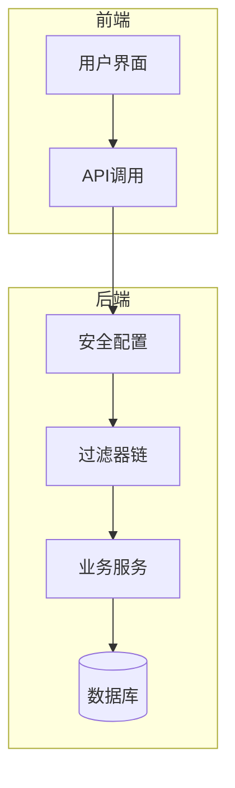
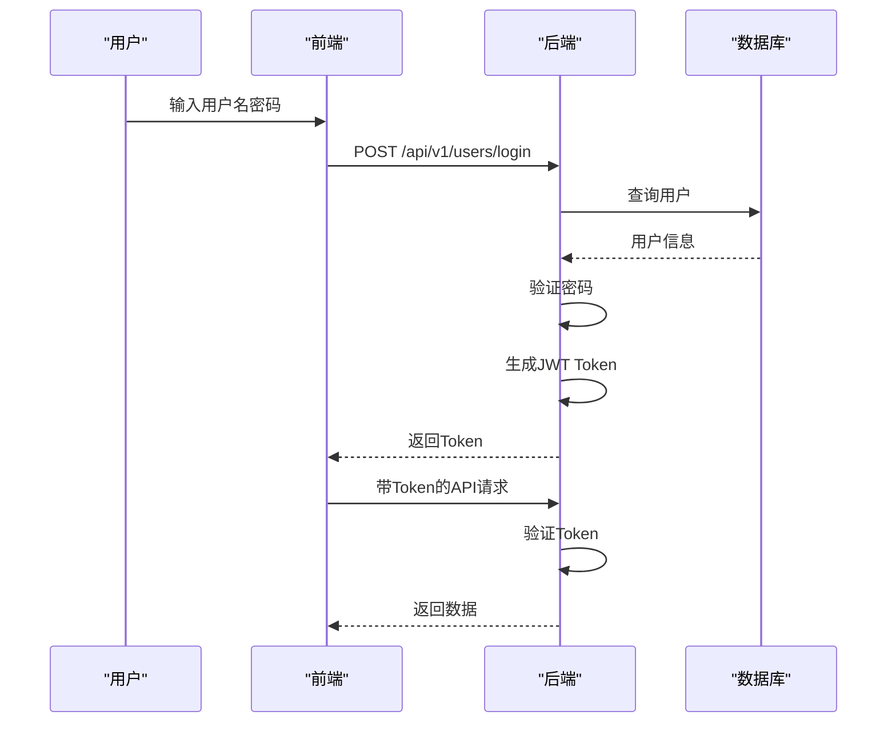
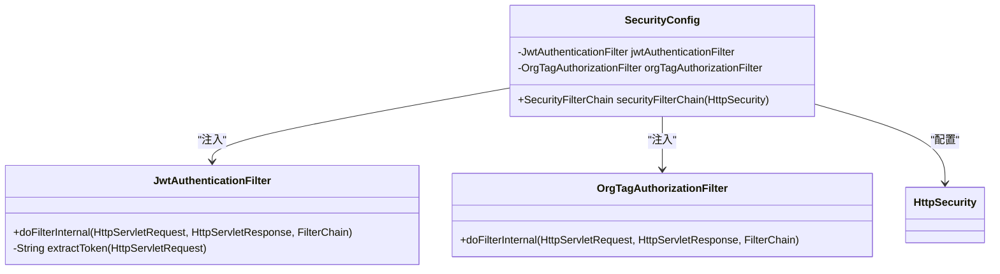
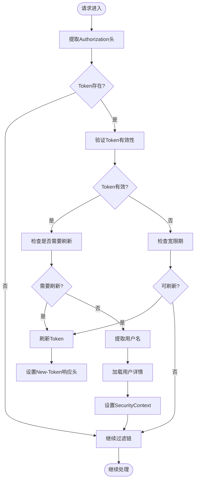
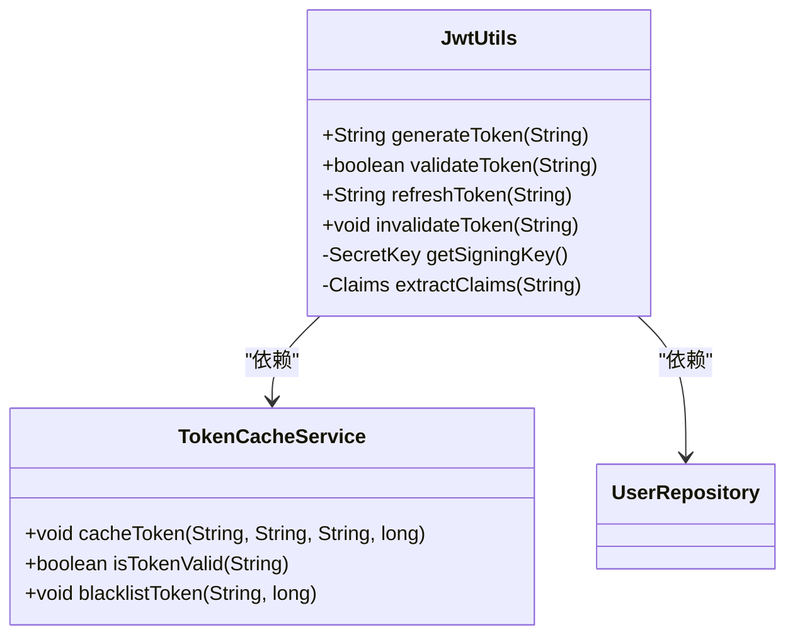
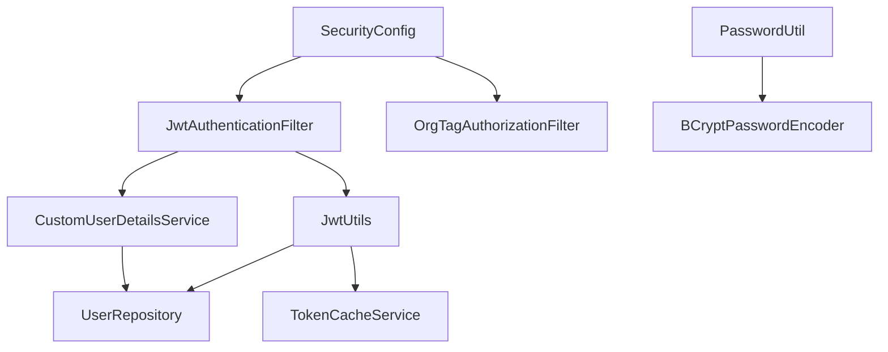

# 安全配置详解

<cite>
**本文档引用的文件**  
- [SecurityConfig.java](file://src/main/java/com/yizhaoqi/smartpai/config/SecurityConfig.java)
- [JwtAuthenticationFilter.java](file://src/main/java/com/yizhaoqi/smartpai/config/JwtAuthenticationFilter.java)
- [WebConfig.java](file://src/main/java/com/yizhaoqi/smartpai/config/WebConfig.java)
- [application.yml](file://src/main/resources/application.yml)
- [CustomUserDetailsService.java](file://src/main/java/com/yizhaoqi/smartpai/service/CustomUserDetailsService.java)
- [JwtUtils.java](file://src/main/java/com/yizhaoqi/smartpai/utils/JwtUtils.java)
- [PasswordUtil.java](file://src/main/java/com/yizhaoqi/smartpai/utils/PasswordUtil.java)
- [OrgTagAuthorizationFilter.java](file://src/main/java/com/yizhaoqi/smartpai/config/OrgTagAuthorizationFilter.java)
</cite>

## 目录
1. [引言](#引言)
2. [项目结构](#项目结构)
3. [核心组件](#核心组件)
4. [架构概览](#架构概览)
5. [详细组件分析](#详细组件分析)
6. [依赖分析](#依赖分析)
7. [性能考量](#性能考量)
8. [故障排查指南](#故障排查指南)
9. [结论](#结论)

## 引言
本文档深入解析PaiSmart项目的Spring Security安全配置体系，涵盖HTTP安全策略、认证流程、JWT机制、密码编码、拦截器顺序等核心内容。通过结合代码实现与配置文件联动，为开发者提供全面的安全配置理解与问题排查指导。

## 项目结构
项目采用典型的前后端分离架构，后端基于Spring Boot构建，前端使用Vue框架。安全配置主要集中在`src/main/java/com/yizhaoqi/smartpai/config`包下，核心安全类包括`SecurityConfig`、`JwtAuthenticationFilter`等。



**图示来源**
- [SecurityConfig.java](file://src/main/java/com/yizhaoqi/smartpai/config/SecurityConfig.java)
- [WebConfig.java](file://src/main/java/com/yizhaoqi/smartpai/config/WebConfig.java)

**本节来源**
- [SecurityConfig.java](file://src/main/java/com/yizhaoqi/smartpai/config/SecurityConfig.java)
- [WebConfig.java](file://src/main/java/com/yizhaoqi/smartpai/config/WebConfig.java)

## 核心组件
核心安全组件包括：
- **SecurityConfig**: 主安全配置类，定义全局安全策略
- **JwtAuthenticationFilter**: JWT认证过滤器，处理Token验证
- **CustomUserDetailsService**: 用户详情服务，加载用户信息
- **JwtUtils**: JWT工具类，负责Token生成与解析
- **PasswordUtil**: 密码工具类，使用BCrypt进行密码加密

**本节来源**
- [SecurityConfig.java](file://src/main/java/com/yizhaoqi/smartpai/config/SecurityConfig.java)
- [JwtAuthenticationFilter.java](file://src/main/java/com/yizhaoqi/smartpai/config/JwtAuthenticationFilter.java)
- [CustomUserDetailsService.java](file://src/main/java/com/yizhaoqi/smartpai/service/CustomUserDetailsService.java)

## 架构概览
系统采用无状态JWT认证架构，通过过滤器链实现安全控制。用户登录后获取JWT Token，后续请求通过Token进行身份验证。



**图示来源**
- [SecurityConfig.java](file://src/main/java/com/yizhaoqi/smartpai/config/SecurityConfig.java)
- [JwtAuthenticationFilter.java](file://src/main/java/com/yizhaoqi/smartpai/config/JwtAuthenticationFilter.java)

## 详细组件分析

### SecurityConfig分析
`SecurityConfig`类是Spring Security的核心配置，通过`@Configuration`和`@EnableWebSecurity`注解启用安全功能。

#### 安全过滤链配置
```java
@Bean
public SecurityFilterChain securityFilterChain(HttpSecurity http) throws Exception {
    http.csrf(csrf -> csrf.disable())
        .authorizeHttpRequests(authorize -> authorize
            .requestMatchers("/", "/test.html", "/static/**", "/*.js", "/*.css", "/*.ico").permitAll()
            .requestMatchers("/chat/**", "/ws/**").permitAll()
            .requestMatchers("/api/v1/users/register", "/api/v1/users/login").permitAll()
            .requestMatchers("/api/v1/test/**").permitAll()
            .requestMatchers("/api/v1/upload/**", "/api/v1/parse", "/api/v1/documents/download", "/api/v1/documents/preview").hasAnyRole("USER", "ADMIN")
            .requestMatchers("/api/v1/users/conversation/**").hasAnyRole("USER", "ADMIN")
            .requestMatchers("/api/search/**").hasAnyRole("USER", "ADMIN")
            .requestMatchers("/api/chat/websocket-token").permitAll()
            .requestMatchers("/api/v1/admin/**").hasRole("ADMIN")
            .requestMatchers("/api/v1/users/primary-org").hasAnyRole("USER", "ADMIN")
            .anyRequest().authenticated())
        .sessionManagement(session -> session
            .sessionCreationPolicy(SessionCreationPolicy.STATELESS))
        .addFilterBefore(jwtAuthenticationFilter, UsernamePasswordAuthenticationFilter.class)
        .addFilterAfter(orgTagAuthorizationFilter, JwtAuthenticationFilter.class);
    return http.build();
}
```

**配置要点：**
- **CSRF保护**: 已禁用，适用于无状态API
- **会话管理**: 采用STATELESS策略，不创建HTTP会话
- **认证规则**: 详细定义了不同路径的访问权限
- **过滤器顺序**: JWT过滤器在UsernamePasswordAuthenticationFilter之前执行



**图示来源**
- [SecurityConfig.java](file://src/main/java/com/yizhaoqi/smartpai/config/SecurityConfig.java#L30-L89)

**本节来源**
- [SecurityConfig.java](file://src/main/java/com/yizhaoqi/smartpai/config/SecurityConfig.java)

### JWT认证流程分析
JWT认证通过`JwtAuthenticationFilter`实现，处理Token的提取、验证和用户认证。

#### 认证流程


**图示来源**
- [JwtAuthenticationFilter.java](file://src/main/java/com/yizhaoqi/smartpai/config/JwtAuthenticationFilter.java#L40-L98)

**本节来源**
- [JwtAuthenticationFilter.java](file://src/main/java/com/yizhaoqi/smartpai/config/JwtAuthenticationFilter.java)

### 用户详情服务分析
`CustomUserDetailsService`实现Spring Security的`UserDetailsService`接口，负责加载用户详细信息。

```java
@Service
public class CustomUserDetailsService implements UserDetailsService {
    @Autowired
    private UserRepository userRepository;

    @Override
    public UserDetails loadUserByUsername(String username) throws UsernameNotFoundException {
        User user = userRepository.findByUsername(username)
                .orElseThrow(() -> new UsernameNotFoundException("User not found"));
        
        return new org.springframework.security.core.userdetails.User(
                user.getUsername(),
                user.getPassword(),
                getAuthorities(user.getRole())
        );
    }

    private Collection<? extends GrantedAuthority> getAuthorities(User.Role role) {
        return Collections.singletonList(new SimpleGrantedAuthority("ROLE_" + role.name()));
    }
}
```

**本节来源**
- [CustomUserDetailsService.java](file://src/main/java/com/yizhaoqi/smartpai/service/CustomUserDetailsService.java)

### JWT工具类分析
`JwtUtils`类提供JWT的生成、验证、刷新等核心功能，并集成Redis缓存。

#### 核心方法
- `generateToken`: 生成JWT Token，包含用户信息和tokenId
- `validateToken`: 验证Token有效性，优先检查Redis缓存
- `refreshToken`: 刷新Token，支持预刷新和宽限期刷新
- `invalidateToken`: 使Token失效，加入Redis黑名单



**图示来源**
- [JwtUtils.java](file://src/main/java/com/yizhaoqi/smartpai/utils/JwtUtils.java)

**本节来源**
- [JwtUtils.java](file://src/main/java/com/yizhaoqi/smartpai/utils/JwtUtils.java)

### 密码编码器分析
系统使用BCryptPasswordEncoder进行密码加密，通过`PasswordUtil`工具类封装。

```java
public class PasswordUtil {
    private static final BCryptPasswordEncoder encoder = new BCryptPasswordEncoder();

    public static String encode(String rawPassword) {
        return encoder.encode(rawPassword);
    }

    public static boolean matches(String rawPassword, String encodedPassword) {
        return encoder.matches(rawPassword, encodedPassword);
    }
}
```

**安全性考量：**
- BCrypt是自适应哈希算法，内置盐值，抗彩虹表攻击
- 加密过程消耗资源，可抵御暴力破解
- 密码哈希值长度固定，不暴露原始密码长度

**本节来源**
- [PasswordUtil.java](file://src/main/java/com/yizhaoqi/smartpai/utils/PasswordUtil.java)

### 拦截器顺序分析
`WebConfig`中注册的拦截器与安全过滤器的执行顺序对安全策略有重要影响。

```java
@Configuration
public class WebConfig implements WebMvcConfigurer {
    @Autowired
    private LoggingInterceptor loggingInterceptor;

    @Override
    public void addInterceptors(InterceptorRegistry registry) {
        registry.addInterceptor(loggingInterceptor)
                .addPathPatterns("/**")
                .excludePathPatterns("/static/**", "/css/**", "/js/**", "/images/**", "/*.ico", "/*.html");
    }
}
```

**执行顺序：**
1. Spring Security过滤器链
2. MVC拦截器
3. 控制器方法

**影响：**
- 安全过滤器在MVC拦截器之前执行，确保未认证请求不会进入业务逻辑
- 日志拦截器可以记录已通过安全验证的请求

**本节来源**
- [WebConfig.java](file://src/main/java/com/yizhaoqi/smartpai/config/WebConfig.java)

## 依赖分析
系统安全组件之间存在明确的依赖关系，形成完整的认证授权链。



**图示来源**
- [SecurityConfig.java](file://src/main/java/com/yizhaoqi/smartpai/config/SecurityConfig.java)
- [JwtAuthenticationFilter.java](file://src/main/java/com/yizhaoqi/smartpai/config/JwtAuthenticationFilter.java)
- [JwtUtils.java](file://src/main/java/com/yizhaoqi/smartpai/utils/JwtUtils.java)

**本节来源**
- [SecurityConfig.java](file://src/main/java/com/yizhaoqi/smartpai/config/SecurityConfig.java)
- [JwtAuthenticationFilter.java](file://src/main/java/com/yizhaoqi/smartpai/config/JwtAuthenticationFilter.java)

## 性能考量
- **JWT无状态**: 减少服务器会话存储开销
- **Redis缓存**: 提高Token验证效率，支持快速失效
- **BCrypt加密**: 平衡安全性与性能，避免过度消耗CPU
- **过滤器顺序**: 合理的执行顺序减少不必要的处理

## 故障排查指南

### 认证失效常见问题
1. **Token格式错误**
   - 确保Authorization头格式为`Bearer <token>`
   - 检查Token是否包含非法字符

2. **密钥不匹配**
   - 确认`application.yml`中的`jwt.secret-key`与生成时一致
   - 密钥必须是Base64编码的256位密钥

3. **时间不同步**
   - 服务器时间与客户端时间差异过大可能导致Token被视为过期
   - 确保系统时间同步

4. **Redis缓存问题**
   - 检查Redis服务是否正常运行
   - 确认Token缓存未被意外清除

5. **过滤器顺序错误**
   - 确保`JwtAuthenticationFilter`在`UsernamePasswordAuthenticationFilter`之前
   - 检查是否有其他过滤器干扰安全链

### 配置联动说明
`application.yml`中的安全参数与代码配置联动：

```yaml
jwt:
  secret-key: "PXrQbuCwXwOZzkML/Vm2S5rSwt1iybvmKtGDzVEu+Hc="

logging:
  level:
    org.springframework.security: DEBUG
```

- **jwt.secret-key**: 用于JWT签名的密钥，必须与`JwtUtils`中使用的密钥一致
- **日志级别**: 设置`org.springframework.security`为DEBUG可查看详细安全日志

**本节来源**
- [application.yml](file://src/main/resources/application.yml)
- [SecurityConfig.java](file://src/main/java/com/yizhaoqi/smartpai/config/SecurityConfig.java)

## 结论
PaiSmart项目的安全配置体系完整且合理，采用JWT无状态认证，结合Redis缓存实现高效的安全控制。通过合理的过滤器顺序和权限配置，确保了系统的安全性与性能平衡。开发者应重点关注配置一致性、密钥管理和异常处理，以维护系统的安全稳定运行。