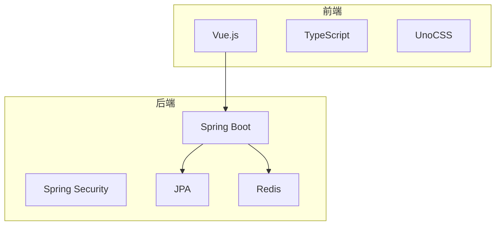
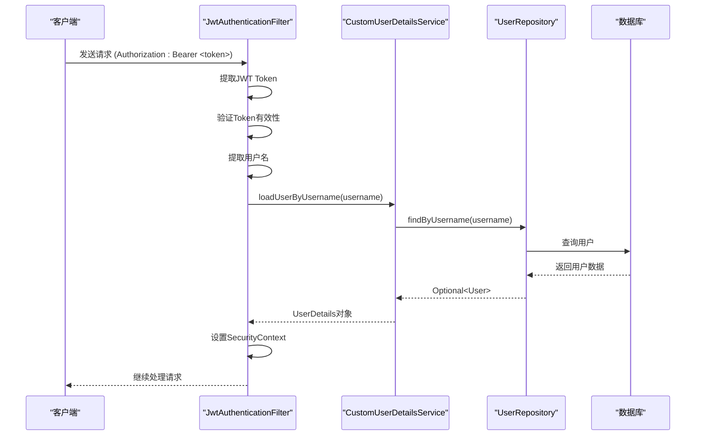
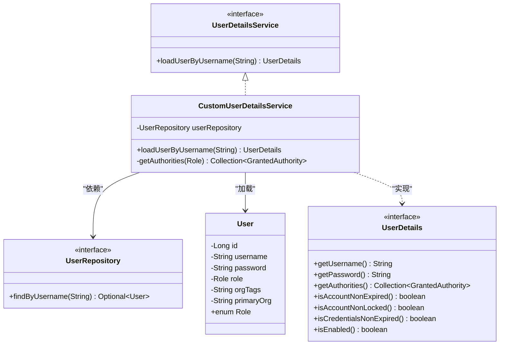
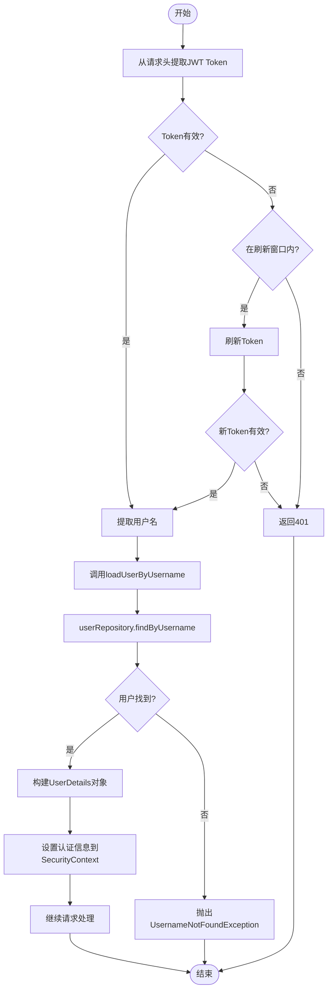
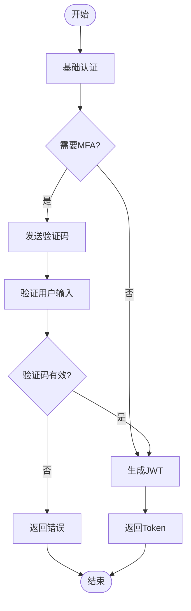
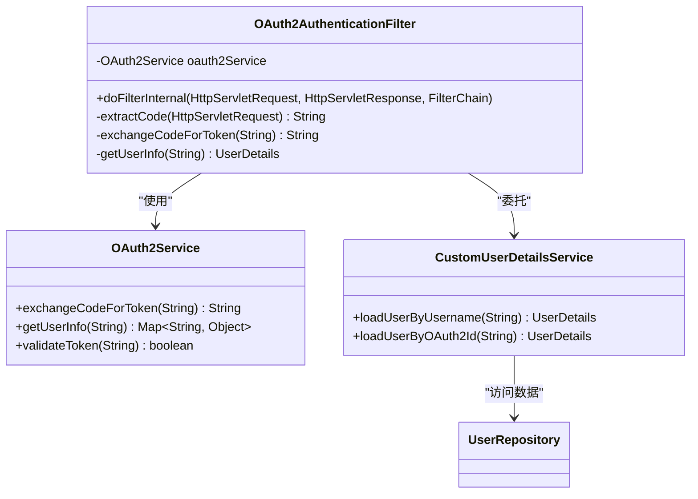
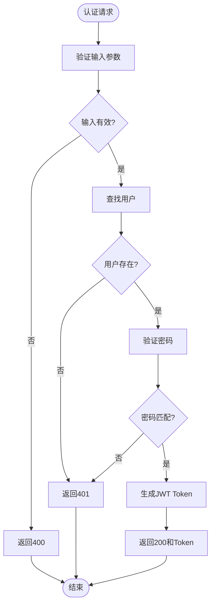
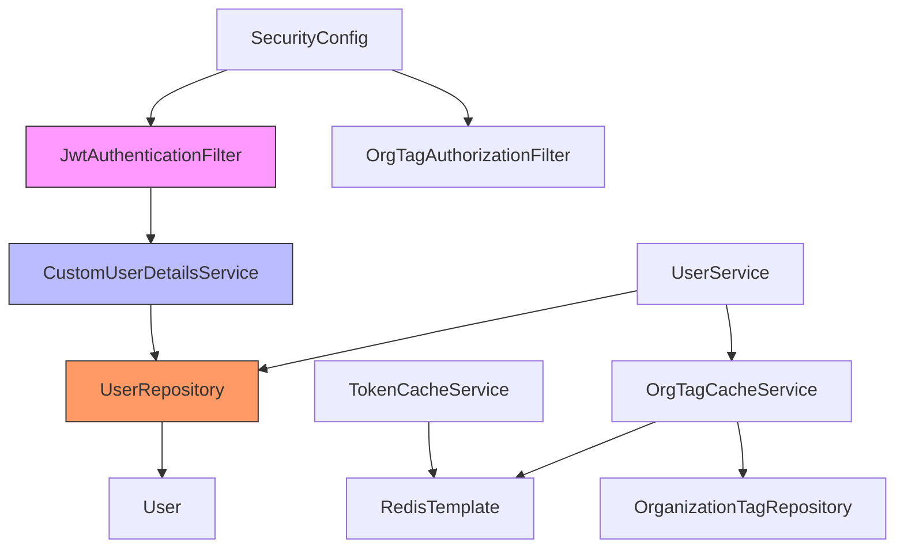
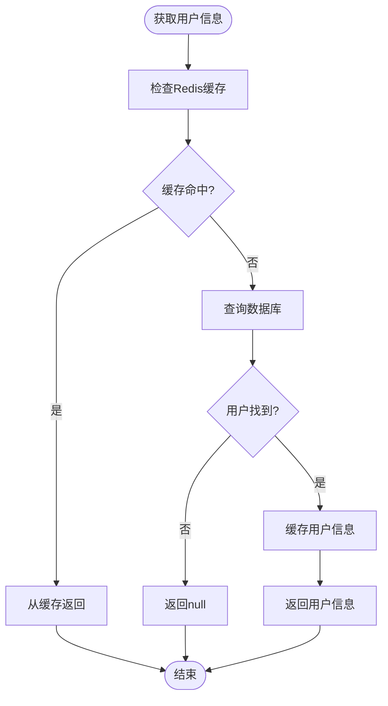

# 用户认证服务

<cite>
**本文档引用的文件**   
- [CustomUserDetailsService.java](file://src/main/java/com/yizhaoqi/smartpai/service/CustomUserDetailsService.java)
- [UserRepository.java](file://src/main/java/com/yizhaoqi/smartpai/repository/UserRepository.java)
- [User.java](file://src/main/java/com/yizhaoqi/smartpai/model/User.java)
- [SecurityConfig.java](file://src/main/java/com/yizhaoqi/smartpai/config/SecurityConfig.java)
- [JwtAuthenticationFilter.java](file://src/main/java/com/yizhaoqi/smartpai/config/JwtAuthenticationFilter.java)
- [TokenCacheService.java](file://src/main/java/com/yizhaoqi/smartpai/service/TokenCacheService.java)
- [OrgTagCacheService.java](file://src/main/java/com/yizhaoqi/smartpai/service/OrgTagCacheService.java)
- [UserService.java](file://src/main/java/com/yizhaoqi/smartpai/service/UserService.java)
</cite>

## 目录
1. [简介](#简介)
2. [项目结构](#项目结构)
3. [核心组件](#核心组件)
4. [架构概述](#架构概述)
5. [详细组件分析](#详细组件分析)
6. [依赖分析](#依赖分析)
7. [性能考虑](#性能考虑)
8. [故障排除指南](#故障排除指南)
9. [结论](#结论)

## 简介
本文档详细描述了PaiSmart项目中用户认证服务的实现机制。重点分析了`CustomUserDetailsService`如何实现Spring Security的`UserDetailsService`接口，从数据库加载用户凭证信息并构建`UserDetails`对象的过程。文档还阐述了用户权限角色的映射方式、认证流程中的状态判断逻辑、异常处理机制以及性能优化建议。

## 项目结构
该项目采用典型的分层架构，前端使用Vue.js框架，后端基于Spring Boot构建。后端代码组织遵循标准的Java包结构，将配置、控制器、实体、仓库、服务等组件分离。



**图表来源**
- [CustomUserDetailsService.java](file://src/main/java/com/yizhaoqi/smartpai/service/CustomUserDetailsService.java)
- [UserRepository.java](file://src/main/java/com/yizhaoqi/smartpai/repository/UserRepository.java)

**章节来源**
- [CustomUserDetailsService.java](file://src/main/java/com/yizhaoqi/smartpai/service/CustomUserDetailsService.java#L0-L48)
- [UserRepository.java](file://src/main/java/com/yizhaoqi/smartpai/repository/UserRepository.java#L0-L10)

## 核心组件

`CustomUserDetailsService`是用户认证的核心组件，它实现了Spring Security的`UserDetailsService`接口，负责从数据库加载用户详细信息。该服务通过`UserRepository`与数据库交互，根据用户名查找用户，并将其转换为Spring Security所需的`UserDetails`格式。

**章节来源**
- [CustomUserDetailsService.java](file://src/main/java/com/yizhaoqi/smartpai/service/CustomUserDetailsService.java#L0-L48)
- [User.java](file://src/main/java/com/yizhaoqi/smartpai/model/User.java#L0-L43)

## 架构概述

系统采用基于JWT的无状态认证架构，通过Spring Security过滤器链实现安全控制。认证流程从客户端请求开始，经过JWT认证过滤器验证token，然后由`CustomUserDetailsService`加载用户信息，最终完成权限验证。



**图表来源**
- [JwtAuthenticationFilter.java](file://src/main/java/com/yizhaoqi/smartpai/config/JwtAuthenticationFilter.java#L0-L98)
- [CustomUserDetailsService.java](file://src/main/java/com/yizhaoqi/smartpai/service/CustomUserDetailsService.java#L0-L48)
- [UserRepository.java](file://src/main/java/com/yizhaoqi/smartpai/repository/UserRepository.java#L0-L10)

## 详细组件分析

### CustomUserDetailsService 分析

`CustomUserDetailsService`是Spring Security用户详情服务的具体实现，它负责从持久化存储中加载用户信息。

#### 类图分析


**图表来源**
- [CustomUserDetailsService.java](file://src/main/java/com/yizhaoqi/smartpai/service/CustomUserDetailsService.java#L0-L48)
- [User.java](file://src/main/java/com/yizhaoqi/smartpai/model/User.java#L0-L43)
- [UserRepository.java](file://src/main/java/com/yizhaoqi/smartpai/repository/UserRepository.java#L0-L10)

**章节来源**
- [CustomUserDetailsService.java](file://src/main/java/com/yizhaoqi/smartpai/service/CustomUserDetailsService.java#L0-L48)

#### 加载用户流程分析


**图表来源**
- [JwtAuthenticationFilter.java](file://src/main/java/com/yizhaoqi/smartpai/config/JwtAuthenticationFilter.java#L0-L98)
- [CustomUserDetailsService.java](file://src/main/java/com/yizhaoqi/smartpai/service/CustomUserDetailsService.java#L0-L48)

### 权限角色映射机制

系统通过`User`实体类中的`Role`枚举来管理用户权限，该枚举定义了`USER`和`ADMIN`两种角色。`CustomUserDetailsService`通过`getAuthorities`方法将这些角色转换为Spring Security的权限格式。

```java
private Collection<? extends GrantedAuthority> getAuthorities(User.Role role) {
    return Collections.singletonList(new SimpleGrantedAuthority("ROLE_" + role.name()));
}
```

这种映射方式遵循了Spring Security的命名约定，将角色前缀统一为"ROLE_"，便于在安全配置中进行权限控制。

**章节来源**
- [CustomUserDetailsService.java](file://src/main/java/com/yizhaoqi/smartpai/service/CustomUserDetailsService.java#L38-L43)
- [User.java](file://src/main/java/com/yizhaoqi/smartpai/model/User.java#L35-L40)

### 用户状态判断逻辑

尽管在当前代码中未直接实现用户启用/禁用/锁定的状态字段，但系统通过JWT令牌的有效性和刷新机制间接实现了类似功能。`JwtAuthenticationFilter`中的token验证和刷新逻辑提供了用户状态管理的基础。

```mermaid
stateDiagram-v2
[*] --> TokenAbsent : 无Token
[*] --> TokenInvalid : Token无效
TokenAbsent --> Unauthorized : 返回401
TokenInvalid --> Unauthorized
[*] --> TokenValid : Token有效
TokenValid --> ShouldRefresh{"剩余时间<阈值?"}
ShouldRefresh --> |是| ProactiveRefresh : 主动刷新Token
ShouldRefresh --> |否| NormalFlow : 正常流程
ProactiveRefresh --> NewToken : 生成新Token
NewToken --> NormalFlow
NormalFlow --> Authorized : 授权通过
Authorized --> ProcessRequest : 处理请求
```

**图表来源**
- [JwtAuthenticationFilter.java](file://src/main/java/com/yizhaoqi/smartpai/config/JwtAuthenticationFilter.java#L0-L98)
- [JwtUtils.java](file://src/main/java/com/yizhaoqi/smartpai/utils/JwtUtils.java#L0-L37)

### 自定义认证扩展点

系统提供了多个扩展点，便于实现多因素认证或第三方OAuth2集成。

#### 多因素认证扩展
可以在`JwtAuthenticationFilter`中添加额外的认证步骤：



#### OAuth2集成扩展
系统可以通过添加新的认证过滤器来支持OAuth2：



**章节来源**
- [JwtAuthenticationFilter.java](file://src/main/java/com/yizhaoqi/smartpai/config/JwtAuthenticationFilter.java#L0-L98)
- [SecurityConfig.java](file://src/main/java/com/yizhaoqi/smartpai/config/SecurityConfig.java#L0-L89)

### 异常处理机制

当用户加载失败时，`CustomUserDetailsService`会抛出`UsernameNotFoundException`异常，该异常会被Spring Security框架捕获并转换为相应的HTTP响应。

```java
@Override
public UserDetails loadUserByUsername(String username) throws UsernameNotFoundException {
    User user = userRepository.findByUsername(username)
            .orElseThrow(() -> new UsernameNotFoundException("User not found"));
    // ...
}
```

在`UserService`中，更详细的异常处理通过`CustomException`实现：



**图表来源**
- [CustomUserDetailsService.java](file://src/main/java/com/yizhaoqi/smartpai/service/CustomUserDetailsService.java#L28-L32)
- [UserService.java](file://src/main/java/com/yizhaoqi/smartpai/service/UserService.java#L0-L199)

## 依赖分析

系统各组件之间的依赖关系清晰，遵循了依赖倒置原则。核心依赖关系如下：



**图表来源**
- [SecurityConfig.java](file://src/main/java/com/yizhaoqi/smartpai/config/SecurityConfig.java#L0-L89)
- [JwtAuthenticationFilter.java](file://src/main/java/com/yizhaoqi/smartpai/config/JwtAuthenticationFilter.java#L0-L98)
- [CustomUserDetailsService.java](file://src/main/java/com/yizhaoqi/smartpai/service/CustomUserDetailsService.java#L0-L48)

**章节来源**
- [SecurityConfig.java](file://src/main/java/com/yizhaoqi/smartpai/config/SecurityConfig.java#L0-L89)

## 性能考虑

为提高系统性能，建议实现用户信息缓存机制。虽然当前系统没有直接缓存用户信息，但已有`TokenCacheService`和`OrgTagCacheService`作为参考实现。

### 用户信息缓存建议



参考`TokenCacheService`的实现，可以创建`UserCacheService`：

```java
@Service
public class UserCacheService {
    private static final String USER_PREFIX = "user:";
    private static final long CACHE_TTL_HOURS = 1;
    
    @Autowired
    private RedisTemplate<String, Object> redisTemplate;
    
    public void cacheUser(User user) {
        try {
            String key = USER_PREFIX + user.getUsername();
            redisTemplate.opsForValue().set(key, user, CACHE_TTL_HOURS, TimeUnit.HOURS);
        } catch (Exception e) {
            logger.error("Failed to cache user: {}", user.getUsername(), e);
        }
    }
    
    public User getUser(String username) {
        try {
            String key = USER_PREFIX + username;
            return (User) redisTemplate.opsForValue().get(key);
        } catch (Exception e) {
            logger.error("Failed to get user from cache: {}", username, e);
            return null;
        }
    }
    
    public void removeUser(String username) {
        try {
            redisTemplate.delete(USER_PREFIX + username);
        } catch (Exception e) {
            logger.error("Failed to remove user from cache: {}", username, e);
        }
    }
}
```

同时，在`CustomUserDetailsService`中集成缓存：

```java
@Override
public UserDetails loadUserByUsername(String username) throws UsernameNotFoundException {
    // 先从缓存获取
    User user = userCacheService.getUser(username);
    if (user == null) {
        // 缓存未命中，从数据库获取
        user = userRepository.findByUsername(username)
                .orElseThrow(() -> new UsernameNotFoundException("User not found"));
        // 缓存用户信息
        userCacheService.cacheUser(user);
    }
    
    return new org.springframework.security.core.userdetails.User(
            user.getUsername(),
            user.getPassword(),
            getAuthorities(user.getRole())
    );
}
```

**章节来源**
- [TokenCacheService.java](file://src/main/java/com/yizhaoqi/smartpai/service/TokenCacheService.java#L0-L199)
- [OrgTagCacheService.java](file://src/main/java/com/yizhaoqi/smartpai/service/OrgTagCacheService.java#L0-L199)

## 故障排除指南

### 常见问题及解决方案

1. **用户无法登录**
   - 检查用户名和密码是否正确
   - 确认用户是否已注册
   - 检查数据库连接是否正常

2. **Token刷新失败**
   - 确认refresh token是否在有效期内
   - 检查JWT密钥配置是否正确
   - 验证Redis服务是否正常运行

3. **权限不足**
   - 确认用户角色是否正确
   - 检查安全配置中的权限规则
   - 验证JWT token中包含正确的角色信息

4. **缓存相关问题**
   - 检查Redis连接配置
   - 确认缓存键的命名规则
   - 验证缓存过期时间设置

**章节来源**
- [JwtAuthenticationFilter.java](file://src/main/java/com/yizhaoqi/smartpai/config/JwtAuthenticationFilter.java#L0-L98)
- [TokenCacheService.java](file://src/main/java/com/yizhaoqi/smartpai/service/TokenCacheService.java#L0-L199)

## 结论

`CustomUserDetailsService`作为PaiSmart项目用户认证的核心组件，通过实现Spring Security的`UserDetailsService`接口，实现了从数据库加载用户信息的功能。系统采用JWT无状态认证机制，通过`JwtAuthenticationFilter`在请求过滤链中完成用户认证。

虽然当前实现中未直接包含用户启用/禁用/锁定的状态管理，但通过JWT令牌的生命周期管理提供了类似功能。系统提供了良好的扩展性，便于实现多因素认证或第三方OAuth2集成。

为提高性能，建议实现用户信息缓存机制，参考现有的`TokenCacheService`和`OrgTagCacheService`实现。这将减少数据库查询次数，提高系统响应速度。

整体而言，该认证系统设计合理，结构清晰，具有良好的可维护性和扩展性。